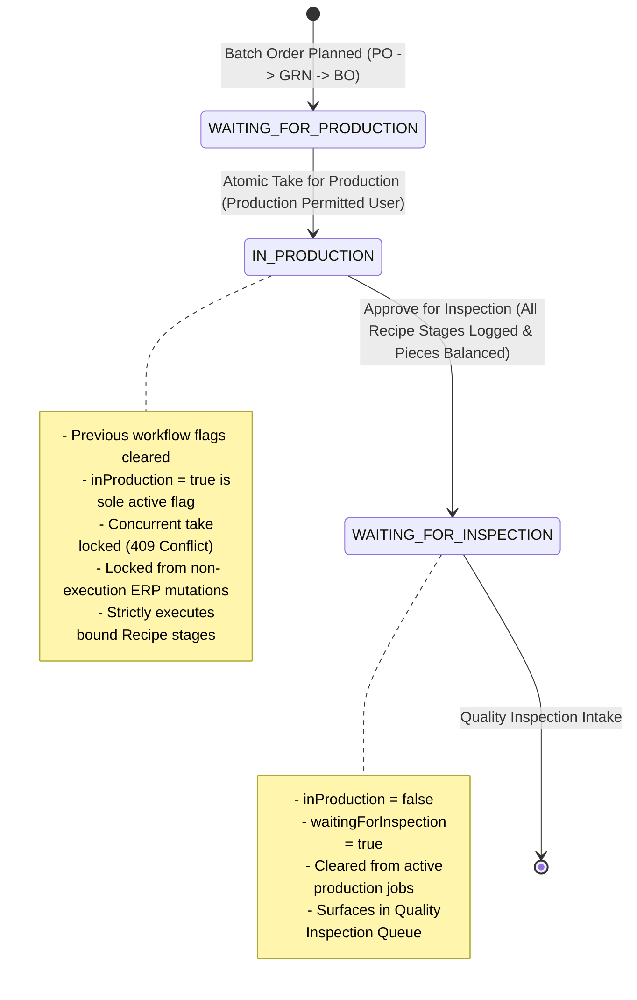
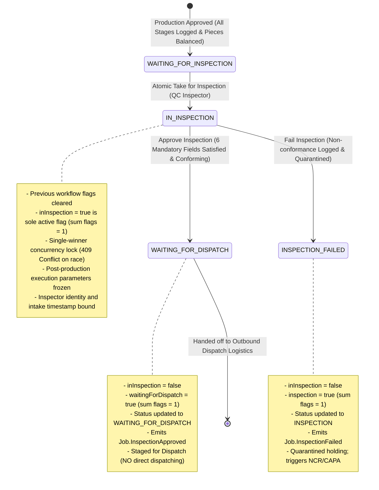
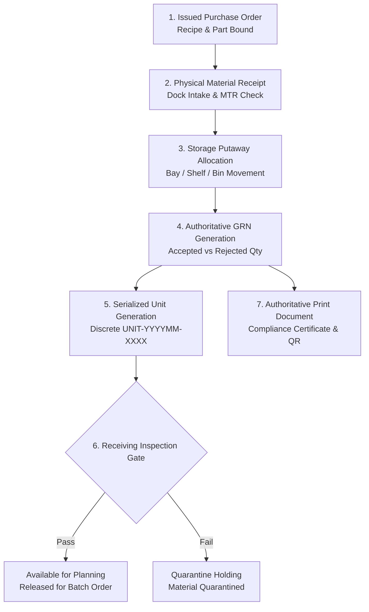
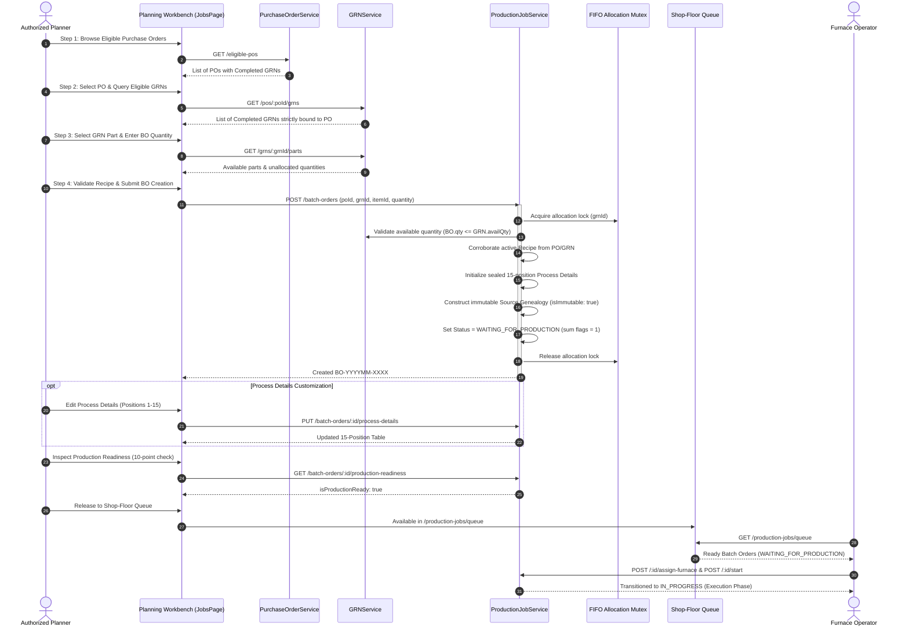

# 🚀 Astralis ERP — Complete Features & Architecture Catalog

> **Platform:** Astralis ERP (Advanced Thermal Processing, Precision Machining & Metallurgical Manufacturing)  
> **Tech Stack:** Node.js, Express, MongoDB (Mongoose 8), TypeScript, React 19, Redux Toolkit, React Router 7, Lucide Icons, Vanilla CSS (Apple HIG Design Tokens)  
> **Architecture:** Multi-Tenant Clean Layered Domain Architecture (`Route -> Controller -> Service -> Repository -> Model`) + Decoupled Domain Event Bus + Architecture Boundary Governance (`check:arch`)  
> **Authoritative Codebase Scope:** Entire ERP Repository (`c:\Users\Admin\Desktop\CelestiumERP`)

---

## 📑 Table of Contents

1. [Core Platform & Architecture Foundation](#1-core-platform--architecture-foundation)
   - 1.1 Multi-Tenant Isolation Engine
   - 1.2 Decoupled Domain Event Bus
   - 1.3 Immutable Audit Logging Subsystem
   - 1.4 Monotonic Sequential ID Generation
   - 1.5 Transparent Soft Delete Protocol
   - 1.6 Centralized Exception Hierarchy & Unified Response Envelope
   - 1.7 Enterprise Idempotency Middleware
   - 1.8 Async Background Task Queue & Resilience
   - 1.9 System Maintenance Lock Subsystem
   - 1.10 Database Connection & Resilience Subsystem
   - 1.11 Indexing Standards & Registry
   - 1.12 ACID Multi-Document Transactions
   - 1.13 Architecture Governance & Layer Boundary Enforcement (14 Rules)
   - 1.14 Security Stack, Middleware & Logging Infrastructure
   - 1.15 SRE Health, Liveness & Readiness Probes
2. [Core Platform Infrastructure Catalog](#2-core-platform-infrastructure-catalog)
3. [Domain Event Bus Registry (92 Typed Events)](#3-domain-event-bus-registry-92-typed-events)
4. [RBAC & Governance Permission Catalog (55 Granular Permissions)](#4-rbac--governance-permission-catalog-55-granular-permissions)
5. [Complete Backend Domain Modules Catalog (All 38 Modules)](#5-complete-backend-domain-modules-catalog-all-38-modules)
   - 5.1 Authentication (`auth`)
   - 5.2 Role-Based Access Control (`rbac`)
   - 5.3 Multi-Tenant Lifecycle (`tenant`)
   - 5.4 Customer Registry (`customer`)
   - 5.5 Item & Material Master (`item`)
   - 5.6 Recipe Master & Versioning (`recipe`)
   - 5.7 Specification Master (`specification`)
   - 5.8 Traceability & Heat Lots (`traceability`)
   - 5.9 Inventory & Stock Ledger (`inventory`)
   - 5.10 Warehouse & Storage Locations (`warehouse`)
   - 5.11 Quality Quarantine (`quarantine`)
   - 5.12 Finished Goods (`finished-goods`)
   - 5.13 Production Planning (`production-planning`)
   - 5.14 Material Requirements Planning (`material-requirements`)
   - 5.15 Furnace Capacity (`furnace-capacity`)
   - 5.16 Workforce Capacity (`workforce-capacity`)
   - 5.17 Constraint Analysis (`constraint-analysis`)
   - 5.18 Production Jobs & Batch Order Planning (`production-job`)
   - 5.19 Production Scheduling (`production-schedule`)
   - 5.20 Quality Inspection (`quality-inspection`)
   - 5.21 Metallurgical Lab (`metallurgical-lab`)
   - 5.22 Quality Planning (`quality-planning`)
   - 5.23 Non-Conformance & CAPA (`ncr-capa`)
   - 5.24 Quality Documentation & CoC (`quality-documentation`)
   - 5.25 Machinery Fleet (`machine`)
   - 5.26 Maintenance Management (`maintenance`)
   - 5.27 AMS 2750G Pyrometry (`pyrometry`)
   - 5.28 Workforce Attendance & Shifts (`attendance`)
   - 5.29 Dispatch Logistics (`dispatch`)
   - 5.30 Finance & General Ledger (`finance`)
   - 5.31 Manufacturing Job Costing (`costing`)
   - 5.32 Customer Billing & Invoicing (`billing`)
   - 5.33 Executive Reporting & Analytics (`reporting`)
   - 5.34 Notification Center (`notification`)
   - 5.35 Universal Global Search (`search`)
   - 5.36 Security Audit Trail (`audit`)
   - 5.37 Purchase Orders (`purchase-order`)
   - 5.38 Goods Receipt Notes & Material Receipts (`grn`)
6. [Frontend Architecture, Pages & Component Library](#6-frontend-architecture-pages--component-library)
   - 6.1 Application Shell & Navigation Layouts
   - 6.2 Frontend Route Matrix (16 Active Routes)
   - 6.3 Complete Page Workbenches (All 14 Pages)
   - 6.4 Apple HIG Design System Primitive Library (18 Components)
   - 6.5 Frontend State Management, RTK Base API & HTTP Client
   - 6.6 Apple HIG Design System Tokens & Aesthetics
7. [End-to-End Operational Domain Workflows](#7-end-to-end-operational-domain-workflows)
   - 7.1 Authoritative Production Phase Workflow (waiting for production -> in production -> waiting for inspection)
   - 7.2 Plan-to-Job Conversion & Constraint Feasibility Workflow
   - 7.3 Metallurgical Quality Inspection & CoC Generation Workflow
   - 7.4 Non-Conformance (NCR) & CAPA Verification Workflow
   - 7.5 Furnace Pyrometry (SAT/TUS) & Breakdown Maintenance Workflow
   - 7.6 Raw Material Heat-Lot Inwarding & Bi-Directional Genealogy Workflow
   - 7.7 Warehouse Storage, Quarantine Holding & Finished Goods Allocation Workflow
   - 7.8 Workforce Shift Roster, Punch Clock-In & Leave Workflow
   - 7.9 Outbound Dispatch & Gate Clearance Workflow
   - 7.10 Manufacturing Job Costing & Variance Analysis Workflow
   - 7.11 Customer Invoicing & Payment Reconciliation Workflow
   - 7.12 General Ledger Accounting & Financial Period Close Workflow
   - 7.13 Executive KPI & Shop-Floor Operational Reporting Workflow
   - 7.14 Universal Global Search & Quick Actions Workflow
   - 7.15 Authoritative Material Receipt, Storage Allocation & Serialized GRN Workflow
   - 7.16 Authoritative PO-to-GRN Batch Order Planning & Shop-Floor Handoff Workflow
8. [Operational Runbooks, SRE Documentation & Testing Infrastructure](#8-operational-runbooks-sre-documentation--testing-infrastructure)
   - 8.1 Database Seeding Engine (`backend/src/scripts/seed.ts`)
   - 8.2 Centralized Configuration Subsystem (`backend/src/config/`)
   - 8.3 Operational Runbooks & Technical Specifications (`docs/`)
   - 8.4 Automated Test Suite Matrix (84 Backend Specs + Frontend Suites)
     - *Prompt 8:* `production-operator-workspace.spec.ts`
     - *Prompt 9:* `production-security-concurrency.spec.ts`
     - *Prompt 10:* `production-e2e-integration.spec.ts`
     - *Inspection Prompt 2:* `inspection-queue.spec.ts`
     - *Inspection Prompt 3:* `inspection-lock.spec.ts`
     - *Inspection Prompt 4:* `inspection-data.spec.ts`
     - *Inspection Prompt 5:* `inspection-recipe-verification.spec.ts`
     - *Inspection Prompt 6:* `inspection-approval-dispatch.spec.ts`
     - *Inspection Prompt 7:* `inspection-failure-handling.spec.ts`
     - *Inspection Prompt 9:* `inspection-security-concurrency.spec.ts`
     - *Inspection Prompt 10:* `inspection-e2e-integration.spec.ts`
     - *Dispatch Prompt 4:* `dispatch-grn-delivery.spec.ts`
     - *Dispatch Prompt 5:* `dispatch-bo-items.spec.ts`
     - *Dispatch Prompt 6:* `dispatch-transport-physical.spec.ts`
     - *Dispatch Prompt 7:* `dispatch-authorization.spec.ts`
     - *Dispatch Prompt 8:* `dispatch-oc-view-print.spec.ts`
     - *Dispatch Prompt 9:* `dispatch-final-state-inventory.spec.ts`
     - *Dispatch Prompt 10:* `dispatch-e2e-integration.spec.ts`

---

## 1. Core Platform & Architecture Foundation

### 1.1 Multi-Tenant Isolation Engine
- **Strict Collection Partitioning:** Every tenant-owned MongoDB collection is indexed by a mandatory `tenantId` field.
- **Tenant Context Middleware (`tenantMiddleware`):** Extracts tenant identity from HTTP header (`x-tenant-id`) and asserts equality against validated JWT claims (`req.user.tenantId`). Mismatches immediately throw a `403 Forbidden` (`CROSS_TENANT_ACCESS_DENIED`).
- **AsyncLocalStorage Context (`TenantContextHolder`):** Wraps incoming requests in an isolated Node.js `AsyncLocalStorage` context, providing ambient tenant context across asynchronous call chains without parameter leaking.
- **Base Repository Isolation (`BaseRepository<T>`):** Automatically injects `{ tenantId }` scope into all queries (`findById`, `findOne`, `findMany`, `count`), mutations (`create`, `updateById`, `updateMany`), and soft-deletes, guaranteeing zero cross-tenant query contamination.

### 1.2 Decoupled Domain Event Bus
- **In-Memory Type-Safe Event Bus (`DomainEventBus`):** Implements an asynchronous publish-subscribe event bus that decouples domain modules without external broker dependencies.
- **89 Strongly Typed Domain Events:** Covers all lifecycle transitions across Jobs, Quality, Pyrometry, Machines, Inventory, Warehouses, Workforce, Dispatch, Master Data, Costing, Finance, Purchase Orders, and GRNs.
- **Side-Effect Handlers (`registerCoreSubscribers`):** Offloads non-critical side effects (e.g. audit logging, cross-module notifications, finished-goods receipt triggers upon job completion) to keep primary HTTP responses fast and responsive.

### 1.3 Immutable Audit Logging Subsystem
- **Non-Blocking Silent Logger (`logSilently`):** Captures actor identity, action type, tenant context, timestamp, client IP, and entity details without impeding transactional execution.
- **Granular Change Diff Engine (`diff.engine.ts`):** Computes deep before-and-after property diffs (`calculateDiff`) for sensitive records to support aerospace (AMS 2750G) and automotive (CQI-9) compliance audits.
- **AuditLog Collection:** Permanently stores tamper-evident logs within tenant-partitioned MongoDB collections indexed by tenant, entity type, entity ID, and timestamp.

### 1.4 Monotonic Sequential ID Generation
- **Atomic Counter Engine (`CounterModel`, `getNextSequence`):** Utilizes MongoDB atomic `$inc` with upsert operations on a dedicated counters collection to generate monotonic, sequential numbers without race conditions under high concurrency.
- **Standardized Domain Prefixes:**
  - Purchase Order: `PO-YYYYMM-XXXX` (e.g., `PO-202609-0001`)
  - Goods Receipt Note: `GRN-YYYYMM-XXXX` (e.g., `GRN-202609-0001`)
  - Batch Order / Production Job: `BO-YYYYMM-XXXX` / `JOB-YYYYMM-XXXX` (e.g., `BO-202609-0001`, `JOB-202609-0001`)
  - Serialized Part Unit: `UNIT-YYYYMM-XXXX` (e.g., `UNIT-202609-0001`)
  - Heat Lot: `HEAT-YYYY-XXXX` (e.g., `HEAT-2026-0001`)
  - Furnace Asset: `FURN-XX` (e.g., `FURN-01`)
  - Quality Inspection: `QC-YYYYMM-XXXX`
  - CoC Certificate: `COC-YYYYMM-XXXX`
  - Non-Conformance Report: `NCR-YYYYMM-XXXX`
  - Corrective Action: `CAPA-YYYYMM-XXXX`
  - Dispatch Consignment: `DISP-YYYYMM-XXXX`
  - Customer Invoice: `INV-YYYYMM-XXXX`
  - Production Plan: `PLAN-YYYYMM-XXXX`

### 1.5 Transparent Soft Delete Protocol
- **Mongoose Soft-Delete Plugin (`softDeletePlugin`):** Transparently injects `{ isDeleted: false }` into all Mongoose `find`, `findOne`, `findOneAndUpdate`, `countDocuments`, and `aggregate` operations.
- **Audit Preservation:** Stores `deletedAt: Date` and `deletedBy: string` instead of physically deleting documents.
- **Entity Restoration:** Provides dedicated repository and controller restore methods (`restoreById`) to recover accidentally archived records.

### 1.6 Centralized Exception Hierarchy & Unified Response Envelope
- **Structured Error Hierarchy (`AppError`):**
  - `BadRequestError` (400)
  - `UnauthorizedError` (401)
  - `ForbiddenError` (403)
  - `NotFoundError` (404)
  - `ConflictError` (409)
  - `ValidationError` (422)
  - `TenantIsolationError` (403)
  - `IdempotencyConflictError` (409)
  - `InternalServerError` (500)
- **Unified API Response Standard (`ApiResponse`):** Standardizes all JSON HTTP responses across the platform:
  - `ApiResponse.success(res, data, message, statusCode)`
  - `ApiResponse.created(res, data, message)`
  - `ApiResponse.paginated(res, items, page, limit, total, message)`
  - `ApiResponse.noContent(res)`
  - `ApiResponse.error(res, message, statusCode, errors, code)`

### 1.7 Enterprise Idempotency Middleware
- **Duplicate Mutation Filter (`idempotencyMiddleware`):** Inspects `Idempotency-Key` headers on mutating requests (`POST`, `PUT`, `PATCH`).
- **In-Memory Mutex & Cache:** Stores request hashes and response envelopes. Duplicate requests with identical keys return the cached response immediately, preventing double work order creation, double billing, or accidental duplicate inventory deductions.

### 1.8 Async Background Task Queue & Resilience
- **In-Memory Job Queue (`AsyncQueueService`):** Executes intensive background operations such as report compilation, batch evaluations, and broadcast notifications.
- **Exponential Backoff & Dead-Letter Queue (DLQ):** Retries transient task failures with configurable backoff before moving failed jobs to an inspectable DLQ.

### 1.9 System Maintenance Lock Subsystem
- **Runtime Maintenance Lock (`MaintenanceLockManager`):** Allows administrators to engage maintenance mode during controlled migrations or upgrades, gracefully blocking incoming non-admin mutations with informative `503 Service Unavailable` responses.

### 1.10 Database Connection & Resilience Subsystem
- **Connection Lifecycle Manager (`DatabaseConnectionManager`):**
  - Pool Sizing: Configured between 5 and 20 connections per instance.
  - Timeout Protection: `serverSelectionTimeoutMS: 5000ms`.
  - Auto-Indexing: Automatically enabled in development/test (`autoIndex: true`) and disabled in production (`autoIndex: false`) to avoid collection locks on startup.
  - Driver Auto-Recovery: Handles network interruptions and gracefully reconnects.
  - Graceful Shutdown: Listens for `SIGINT` and `SIGTERM` to cleanly close MongoDB connection pools.

### 1.11 Indexing Standards & Registry
- **ESR Rule (Equality, Sort, Range):** All compound indexes strictly follow the ESR standard.
- **Index Registry (`IndexRegistry`):** Centralized utility that applies standard indexes:
  - Tenant Unique Index: `{ tenantId: 1, [field]: 1 }` with `{ unique: true }`
  - Status Filter Index: `{ tenantId: 1, status: 1, createdAt: -1 }`
  - Genealogy Index: `{ tenantId: 1, heatNumber: 1, lotNumber: 1 }`
  - Schedule Index: `{ tenantId: 1, furnaceId: 1, scheduledStartTime: 1, scheduledEndTime: 1 }`
  - Ephemeral TTL Index: `{ createdAt: 1 }` with expiration seconds.

### 1.12 ACID Multi-Document Transactions
- **Atomic Transaction Runner (`withTransaction`):** Coordinates complex operations across multiple collections inside atomic MongoDB sessions (e.g. Job completion + inventory finished goods receipt + CoC generation).

### 1.13 Architecture Governance & Layer Boundary Enforcement (14 Rules)
The platform enforces strict Layered Clean Architecture (`Route -> Controller -> Service -> Repository -> Model`) via `ArchitectureGuard` and automated tests (`npm run check:arch`):
1. **Rule 1: `DIRECT_PROCESS_ENV_PROHIBITED`** — Direct access to `process.env` is prohibited outside `src/config/` and `src/governance/`.
2. **Rule 2: `CONTROLLER_DIRECT_REPOSITORY_PROHIBITED`** — Controllers must never import Repositories directly.
3. **Rule 3: `CONTROLLER_DIRECT_MODEL_PROHIBITED`** — Controllers must never import Models or Mongoose directly.
4. **Rule 4: `ROUTE_DIRECT_SERVICE_PROHIBITED`** — Routes must never import Services directly; routes delegate strictly to Controllers.
5. **Rule 5: `ROUTE_DIRECT_REPOSITORY_PROHIBITED`** — Routes must never import Repositories directly.
6. **Rule 6: `ROUTE_DIRECT_MODEL_PROHIBITED`** — Routes must never import Models directly.
7. **Rule 7: `REPOSITORY_CALL_SERVICE_PROHIBITED`** — Repositories must never import Services (prohibits circular upward dependencies).
8. **Rule 8: `REPOSITORY_CALL_CONTROLLER_PROHIBITED`** — Repositories must never import Controllers.
9. **Rule 9: `REPOSITORY_EMIT_EVENTS_PROHIBITED`** — Repositories must never emit Domain Events directly; only Services emit events.
10. **Rule 10: `MODEL_IMPORT_SERVICE_PROHIBITED`** — Models must never import Services.
11. **Rule 11: `MODEL_IMPORT_REPOSITORY_PROHIBITED`** — Models must never import Repositories.
12. **Rule 12: `SERVICE_CALL_CONTROLLER_PROHIBITED`** — Services must never import Controllers.
13. **Rule 13: `SERVICE_EXPRESS_LEAKAGE_PROHIBITED`** — Services must never import or receive Express `Request`, `Response`, or `NextFunction` objects.
14. **Rule 14: `CROSS_DOMAIN_DIRECT_DATA_ACCESS_PROHIBITED`** — Domain A must never import Domain B's repository or model directly; cross-domain coordination must use Domain B's Service or Domain Event Bus.

### 1.14 Security Stack, Middleware & Logging Infrastructure
- **Helmet:** Sets secure HTTP response headers.
- **CORS Whitelist:** Validates origin headers against configured domains.
- **Compression:** Gzip compresses JSON payloads.
- **Rate Limiters:** `apiRateLimiter` (1000 req/15min) and `authRateLimiter` (20 req/15min).
- **Winston JSON Logger (`logger.ts`):** Emits structured JSON logs with automatic masking of sensitive keys (`password`, `token`, `secret`, `authorization`).
- **Zod Environment Validator (`env.config.ts`, `env.validator.ts`):** Validates all environment variables at startup, failing fast if required configuration keys are missing.
- **Async Handler HOC (`asyncHandler`):** Wraps express controller methods, capturing rejected promises and forwarding errors to the global error middleware.

### 1.15 SRE Health, Liveness & Readiness Probes
- `GET /api/v1/health` — Comprehensive service diagnostics: database connection state, round-trip ping latency, process uptime, and memory usage (RSS, Heap).
- `GET /api/v1/health/liveness` — Kubernetes liveness probe verifying process responsiveness.
- `GET /api/v1/health/readiness` — Kubernetes readiness probe verifying database readiness to receive traffic.

---

## 2. Core Platform Infrastructure Catalog

The core framework in `backend/src/core` provides foundational utilities and base classes across 18 subdirectories (33 files):

| Directory | File | Primary Exports | Functionality & Purpose |
|---|---|---|---|
| `constants` | `events.ts` | `DomainEvents`, `DomainEventName` | Central registry of 89 strongly typed domain event names across 11 categories. |
| `constants` | `permissions.ts` | `Permissions`, `PermissionKey`, `PERMISSION_CATALOG` | 55 granular permissions categorized by domain with Standard, Sensitive, and Critical tiers. |
| `constants` | `status.ts` | `JobStatus`, `QualityStatus`, `MachineStatus`, etc. | Authoritative enum definitions for all domain entity lifecycles. |
| `context` | `tenant-context.ts` | `TenantContext`, `TenantContextHolder` | `AsyncLocalStorage` context holder providing ambient tenant and user data. |
| `controllers` | `base.controller.ts` | `BaseController` | Base class for controllers with tenant extraction, user claims, pagination, and response helpers. |
| `database` | `connection.ts` | `DatabaseConnectionManager` | Mongoose connection lifecycle manager with retry loops, pooling, and graceful shutdown. |
| `database` | `health.ts` | `getDatabaseHealth`, `DatabaseHealth` | Evaluates live MongoDB connection health and ping latency. |
| `database` | `index-registry.ts` | `IndexRegistry` | Declarative index helper enforcing tenant-unique and ESR query optimization patterns. |
| `database` | `transaction.ts` | `withTransaction` | Executes multi-document operations inside managed MongoDB ACID sessions. |
| `errors` | `app-error.ts` | `AppError`, `BadRequestError`, `NotFoundError`, etc. | Complete structured HTTP exception hierarchy with error codes and status codes. |
| `events` | `domain-event-bus.ts` | `DomainEventBus` | In-memory pub/sub broker with typed event dispatching and listener management. |
| `events` | `subscribers.ts` | `registerCoreSubscribers` | Registers system-wide listeners for cross-domain side effects. |
| `governance` | `architecture-guard.ts` | `ArchitectureGuard`, `ArchitectureViolation` | AST and regex scanner enforcing 14 clean architecture layer rules in CI builds. |
| `maintenance` | `maintenance-lock.ts` | `MaintenanceLockManager` | Manages platform-wide maintenance locks to block non-administrative mutations. |
| `middleware` | `auth.middleware.ts` | `authenticateJwt`, `optionalAuth` | Validates Bearer JWT tokens and populates `req.user` claims. |
| `middleware` | `error.middleware.ts` | `errorMiddleware` | Centralized Express error handler normalizing exceptions into `ApiResponse.error`. |
| `middleware` | `idempotency.middleware.ts` | `idempotencyMiddleware` | Intercepts `Idempotency-Key` headers on mutations to prevent duplicate execution. |
| `middleware` | `rate-limiter.middleware.ts` | `apiRateLimiter`, `authRateLimiter` | Express rate-limiting middleware protecting against brute-force attacks and abuse. |
| `middleware` | `rbac.middleware.ts` | `requirePermission`, `requireRole` | Enforces RBAC permission and role authorizations on protected routes. |
| `middleware` | `tenant.middleware.ts` | `tenantMiddleware` | Asserts tenant boundaries by verifying `x-tenant-id` header against JWT claims. |
| `models` | `base.schema.ts` | `createBaseSchema` | Mongoose schema factory injecting `tenantId`, timestamps, soft delete, and ID transforms. |
| `models` | `counter.model.ts` | `CounterModel`, `getNextSequence` | Atomic monotonic sequential business identifier generator. |
| `plugins` | `soft-delete.plugin.ts` | `softDeletePlugin` | Global Mongoose plugin transparently injecting `{ isDeleted: false }` into queries. |
| `repository` | `base.repository.ts` | `BaseRepository<T>` | Abstract repository encapsulating tenant scoping for CRUD, pagination, and soft delete. |
| `responses` | `api-response.ts` | `ApiResponse` | Standard JSON response formatter (`success`, `created`, `paginated`, `error`). |
| `routes` | `base.router.ts` | `createBaseRouter` | Factory helper for configuring Express domain routers. |
| `services` | `audit-log.service.ts` | `AuditLogService` | Service managing tamper-evident audit logging and entity audit trail queries. |
| `services` | `base.service.ts` | `BaseService` | Base service class providing common logging and event emission capabilities. |
| `services` | `queue.service.ts` | `AsyncQueueService` | Background task queue with exponential backoff and dead-letter queue. |
| `types` | `common.types.ts` | `PaginatedResult`, `PaginationQuery`, `UserContext` | Core TypeScript interfaces and shared data types. |
| `utils` | `async-handler.ts` | `asyncHandler` | High-order controller wrapper forwarding rejected promises to error middleware. |
| `utils` | `crypto.utils.ts` | `hashPassword`, `comparePassword`, `generateToken` | Cryptographic helpers for bcrypt hashing and JWT token signing/verification. |
| `utils` | `diff.engine.ts` | `calculateDiff`, `DiffItem` | Deep property difference engine calculating before/after changes for audit logs. |
| `utils` | `logger.ts` | `logger` | Winston JSON logger with automated masking of sensitive attributes. |
| `validators` | `base.validator.ts` | `validateBody`, `validateQuery`, `validateParams` | Zod validation middleware for Express route inputs. |
| `validators` | `env.validator.ts` | `validateEnv`, `envSchema` | Zod schema validating environment variables at application bootstrap. |
| `validators` | `pagination.validator.ts` | `paginationQuerySchema` | Zod schema validating standard pagination and sorting parameters. |

---

## 3. Domain Event Bus Registry (92 Typed Events)

The in-memory `DomainEventBus` manages 92 strongly typed domain events across 11 business domains:

| Domain | Event Identifier | Emitted When | Typical Subscribed Side Effects |
|---|---|---|---|
| **Jobs** | `Job.Created` | New production job work order is drafted. | Audit logging, notification dispatch. |
| **Jobs** | `Job.InProduction` | Batch order atomically taken into production (`waiting_for_production` -> `in_production`). | Clears prior flags, establishes single active flag `inProduction = true`, locks from unrelated modifications. |
| **Jobs** | `Job.ApprovedForInspection` | Production execution completed and approved for inspection (`in_production` -> `waiting_for_inspection`). | Clears prior flags, activates `waitingForInspection = true`, surfaces BO in Quality Inspection queue. |
| **Jobs** | `Job.InspectionStarted` | Batch order claimed and taken into Quality Inspection (`waiting_for_inspection` -> `in_inspection`). | Clears prior flags, activates `inInspection = true`, binds inspector `claimedBy`, locks BO from external operations. |
| **Jobs** | `Job.InspectionApproved` | Batch order heat-treatment inspection passed and approved for dispatch (`in_inspection` -> `waiting_for_dispatch`). | Clears prior flags, activates `waitingForDispatch = true`, transitions BO to dispatch staging queue (without auto-dispatching). |
| **Jobs** | `Job.InspectionFailed` | Batch order heat-treatment inspection rejected and quarantined (`in_inspection` -> `inspection`). | Clears prior flags, activates `inspection = true` failure/quarantine flag, logs non-conformance reason. |
| **Jobs** | `Job.Scheduled` | Job assigned to furnace time slot. | Machine calendar update, operator notification. |
| **Jobs** | `Job.Started` | Furnace charge entry, heating cycle timer started. | Machine status `RUNNING`, live telemetry streaming. |
| **Jobs** | `Job.Paused` | Thermal cycle temporarily paused. | Machine status `IDLE`, downtime timer started. |
| **Jobs** | `Job.Resumed` | Processing resumed after hold. | Machine status `RUNNING`, downtime timer ended. |
| **Jobs** | `Job.DowntimeLogged` | Operator logs stoppage reason. | OEE metrics calculation, supervisor notification. |
| **Jobs** | `Job.Completed` | Thermal process completed, unloaded. | Quality inspection record auto-created, machine `IDLE`. |
| **Jobs** | `Job.Cancelled` | Job cancelled prior to completion. | Schedule released, inventory reservations released. |
| **Jobs** | `Job.DispatchStaged` | Job transferred to dispatch holding area. | Finished goods status updated to dispatchable. |
| **Quality** | `QualityInspection.Created` | Inspection record created for job or raw material. | Inspector assignment queue updated. |
| **Quality** | `QualityInspection.Started` | Inspector commences physical test execution. | Inspection status set to `IN_PROGRESS`. |
| **Quality** | `QualityInspection.MeasurementsRecorded` | Hardness survey or lab reading captured. | Traverse curve updated, target-vs-actual checked. |
| **Quality** | `QualityInspection.DefectLogged` | Discrepancy observed. | Defect Pareto updated. |
| **Quality** | `QualityInspection.Approved` | QA Manager signs off inspection. | CoC generated, job transitioned to `STORAGE`. |
| **Quality** | `QualityInspection.Rejected` | Quality inspection failed. | Automatic NCR generated, material quarantined. |
| **Quality** | `QualityInspection.ReinspectionRequested` | Inconclusive readings require repolish/retest. | Secondary inspection task queued. |
| **Quality** | `QualityInspection.NcrRaised` | Formal NCR created. | Containment alert dispatched, MRB review scheduled. |
| **Quality** | `QualityInspection.CapaUpdated` | Corrective/Preventive Action logged. | CAPA verification deadline tracked. |
| **Quality** | `QualityPlan.Approved` | Quality inspection plan revision approved. | Activated for new production runs. |
| **Quality** | `Quality.TestReportGenerated` | Lab test findings compiled. | Test report attached to job audit trail. |
| **Quality** | `Quality.CocIssued` | Certificate of Conformance approved and signed. | Finished goods released for dispatch. |
| **Quality** | `Quality.CocRevoked` | Certificate of Conformance voided. | Dispatches blocked, alert triggered. |
| **Machines** | `Machine.Registered` | New furnace, CNC, or quench tank commissioned. | Asset database updated. |
| **Machines** | `Machine.StatusChanged` | Operational state transitions (Idle, Running, Maint). | Command center status cards updated. |
| **Machines** | `Machine.BreakdownReported` | Unplanned equipment stoppage logged. | Machine status set to `BREAKDOWN`, maintenance alerted. |
| **Machines** | `Machine.BreakdownResolved` | Emergency repair completed. | Machine transitioned to `MAINTENANCE` for testing. |
| **Machines** | `Machine.CalibrationLogged` | Sensor calibration, TUS, or SAT recorded. | Pyrometry compliance window refreshed. |
| **Machines** | `Machine.MaintenanceTriggered` | PM schedule interval elapsed. | Maintenance work order spawned. |
| **Machines** | `Machine.MaintenanceCompleted` | Service completed, parts logged. | PM schedule timer reset, machine restored to `IDLE`. |
| **Machines** | `Maintenance.WorkOrderCreated` | Work order opened for repair or service. | Assigned technician notified. |
| **Machines** | `Maintenance.WorkOrderCompleted` | Maintenance technician signs off work order. | Asset downtime hours rolled into OEE. |
| **Machines** | `Maintenance.PreventivePlanCreated`| New PM schedule defined. | Calendar reminders configured. |
| **Inventory** | `Inventory.ItemCreated` | New item or SKU master record created. | Item catalog updated. |
| **Inventory** | `Inventory.GoodsReceived` | Inward delivery from supplier recorded. | Stock balance incremented, heat lot created. |
| **Inventory** | `Inventory.GoodsIssued` | Material issued to production job. | Stock balance decremented, WIP charged. |
| **Inventory** | `Inventory.StockAdjusted` | Supervisor manual stock adjustment logged. | Inventory ledger updated with variance. |
| **Inventory** | `Inventory.StockReserved` | Raw material reserved for planned job. | Available stock decremented, reserved incremented. |
| **Inventory** | `Inventory.StockReleased` | Reservation cancelled. | Available stock restored. |
| **Inventory** | `Inventory.HeatLotCreated` | New heat lot batch registered with MTR. | Inward QC inspection triggered. |
| **Inventory** | `Inventory.LowStockAlert` | Balance falls below safety reorder threshold. | Reorder notification sent to procurement. |
| **Creation Phase** | `PurchaseOrder.Created` | New Purchase Order drafted linking parts and recipes. | Audit logging, supplier tracking. |
| **Creation Phase** | `PurchaseOrder.Updated` | Purchase Order lines or quantities modified. | Recalculate fulfillment tolerances. |
| **Creation Phase** | `PurchaseOrder.Cancelled` | Open Purchase Order cancelled. | Release procurement commitments. |
| **Creation Phase** | `MaterialReceipt.Recorded` | Inward physical delivery recorded against PO. | Awaiting warehouse storage allocation. |
| **Creation Phase** | `MaterialReceipt.Stored` | Received materials put away in warehouse bin. | Stock ledger updated, ready for GRN. |
| **Creation Phase** | `GRN.Created` | Authoritative Goods Receipt Note created. | Serialized units generated, heat lot linked. |
| **Creation Phase** | `GRN.Printed` | Goods Receipt Note printed for physical records. | Compliance audit log updated. |
| **Creation Phase** | `GRN.UnitsReleasedForPlanning` | Serialized units cleared for batch planning. | Available for BO creation in Planning Workbench. |
| **Warehouse** | `Warehouse.PutawayCompleted` | Material placed in specific warehouse bin. | Location occupancy updated. |
| **Warehouse** | `Warehouse.MaterialQuarantined` | Material moved to quarantine storage bay. | Bin flagged as quarantine hold. |
| **Warehouse** | `Warehouse.MaterialReleased` | Material cleared by QA. | Transferred from quarantine to usable bin. |
| **Warehouse** | `Warehouse.FinishedGoodsReceived`| Completed job parts received in FG store. | Finished goods ledger incremented. |
| **Warehouse** | `Warehouse.FinishedGoodsReserved`| Parts reserved for scheduled customer dispatch. | FG reservation locked against shipping order. |
| **Workforce** | `Workforce.EmployeeCreated` | New operator or staff profile added. | Personnel directory updated. |
| **Workforce** | `Workforce.EmployeeDeactivated` | Employee offboarded or suspended. | System access revoked, schedules cleared. |
| **Workforce** | `Workforce.ShiftScheduled` | Operator assigned to shift roster. | Shift calendar updated. |
| **Workforce** | `Workforce.PunchRecorded` | Operator clocks in or out. | Attendance status computed (Present/Late). |
| **Workforce** | `Workforce.LeaveRequested` | Leave application submitted. | Supervisor approval queue updated. |
| **Workforce** | `Workforce.LeaveApproved` | Supervisor approves time off. | Shift roster updated, leave balance decremented. |
| **Workforce** | `Workforce.LeaveRejected` | Supervisor denies leave request. | Employee notified with reason. |
| **Workforce** | `Workforce.OvertimeRequested` | Overtime hours submitted. | Supervisor authorization queue updated. |
| **Workforce** | `Workforce.OvertimeApproved` | Overtime approved at multiplier rate. | Payroll cost accumulator updated. |
| **Workforce** | `Workforce.ShiftSwapped` | Peer shift swap approved. | Both operators' rosters swapped atomically. |
| **Workforce** | `Workforce.AttendanceCorrected`| Supervisor corrects missed punch. | Attendance record updated with audit justification. |
| **Dispatch** | `Dispatch.Created` | Outbound consignment order drafted. | Staging queue updated. |
| **Dispatch** | `Dispatch.OCAuthorized` | Outward Challan authorized by RBAC-validated signatory. | Signatory sealed, gate departure unblocked. |
| **Dispatch** | `Dispatch.QualityVerified` | Verification that all jobs have approved CoCs. | Gate clearance milestone 1 achieved. |
| **Dispatch** | `Dispatch.Scheduled` | Carrier, vehicle, and driver assigned. | Logistics schedule locked. |
| **Dispatch** | `Dispatch.Approved` | Plant manager authorizes departure (delegates to OC authorization). | Gate pass issued. |
| **Dispatch** | `Dispatch.Shipped` | Consignment departs factory premises. | Shipment status set to `IN_TRANSIT` / `DISPATCHED`. |
| **Dispatch** | `Dispatch.CustomerAcknowledged` | Consignee receiving & delivery proof recorded. | Customer receipt sealed, billing notified. |
| **Dispatch** | `Dispatch.Delivered` | Customer receives goods, PoD uploaded. | Consignment `DELIVERED`, billing notified. |
| **Dispatch** | `Dispatch.Cancelled` | Consignment cancelled before departure. | Finished goods reservations released. |
| **Master Data**| `MasterData.RecipeApproved` | Thermal recipe revision approved. | Locked for production scheduling. |
| **Master Data**| `MasterData.SpecificationApproved`| Quality specification approved. | Linked to inspection criteria. |
| **Planning** | `Planning.ProductionPlanCreated` | Master production plan established. | MRP shortage calculation triggered. |
| **Planning** | `Planning.BatchOrderCreated` | Authoritative Batch Order derived from PO & GRN. | Queue placement in `WAITING_FOR_PRODUCTION`. |
| **Planning** | `Planning.MrpRunCompleted` | Material requirement calculations completed. | Shortage report generated. |
| **Costing** | `Costing.JobCostCalculated` | Material, labor, machine, energy calculated. | Job cost ledger populated. |
| **Costing** | `Costing.JobCostRecalculated` | Updated with final actuals upon completion. | Cost variance recorded. |
| **Costing** | `Costing.JobCostFrozen` | Job cost locked for historical archiving. | Sealed against future rate card changes. |
| **Costing** | `Costing.RateCardUpdated` | Machine-hour or labor rate revised. | Applied to future costing calculations. |
| **Finance** | `Finance.JournalPosted` | Balanced journal entry posted to GL. | Account balances updated. |
| **Finance** | `Finance.JournalReversed` | Journal entry reversed with offsetting entries.| Historical audit trail preserved. |
| **Finance** | `Finance.PeriodClosed` | Financial accounting period sealed. | Prior period postings blocked. |
| **Finance** | `Finance.PeriodReopened` | Period unsealed under supervisor approval. | Audit alert generated. |
| **Finance** | `Finance.InvoiceIssued` | Customer billing invoice generated. | Accounts receivable ledger incremented. |
| **Finance** | `Finance.InvoiceVoided` | Invoice cancelled. | Reversing journal posted. |
| **Finance** | `Finance.PaymentReceived` | Customer remittance recorded. | Receivables decremented, bank account credited. |
| **System** | `System.AuditLogged` | Audit entry recorded for compliance. | Real-time audit stream notified. |
| **System** | `System.AlertTriggered` | Critical operational anomaly detected. | Command center and push alerts triggered. |

---

## 4. RBAC & Governance Permission Catalog (55 Granular Permissions)

The platform enforces 55 granular permissions categorized across 13 functional domains with three sensitivity tiers:
- **Standard (37):** Routine shop-floor, planning, engineering, and administrative actions.
- **Sensitive (15):** High-impact actions (deletions, cancellations, quality sign-offs, gate releases, personnel deactivations).
- **Critical (3):** System-level administration, tenant management, and audit log access.

| Domain | Permission Key | Sensitivity | Purpose & Access Control Scope |
|---|---|---|---|
| **Jobs** | `JOB_VIEW` | Standard | View production jobs, recipes, schedules, and work order timelines. |
| **Jobs** | `JOB_CREATE` | Standard | Draft new production work orders and batches from approved plans. |
| **Jobs** | `JOB_UPDATE` | Standard | Update recipe targets, furnace allocations, and progress milestones. |
| **Jobs** | `JOB_DELETE` | Sensitive | Soft-delete or cancel draft work orders. |
| **Jobs** | `JOB_DISPATCH` | Sensitive | Authorize completed job transfer to dispatch holding. |
| **Planning / BO** | `BATCH_ORDER_CREATE` | Standard | Create authoritative Batch Orders derived from PO/GRN with recipe binding. |
| **Planning / BO** | `BATCH_ORDER_VIEW` | Standard | Inspect Batch Order source genealogy, 15-position process details, and readiness. |
| **Planning / BO** | `BATCH_ORDER_UPDATE` | Standard | Edit 15-position process details table while in `WAITING_FOR_PRODUCTION`. |
| **Creation Phase** | `PO_CREATE` | Standard | Create Purchase Orders linking parts and recipes (`purchase_order:order:create`). |
| **Creation Phase** | `PO_VIEW` | Standard | View Purchase Orders and receipt progress (`purchase_order:order:view`). |
| **Creation Phase** | `PO_UPDATE` | Standard | Update or cancel draft and open Purchase Orders (`purchase_order:order:update`). |
| **Creation Phase** | `STORAGE_RECORD` | Standard | Record received material intake and warehouse storage allocation (`inventory:storage:record`). |
| **Creation Phase** | `GRN_CREATE` | Standard | Create Goods Receipt Notes and generate individual part units (`inventory:grn:create`). |
| **Creation Phase** | `GRN_VIEW` | Standard | View Goods Receipt Notes and part unit genealogy (`inventory:grn:view`). |
| **Creation Phase** | `GRN_PRINT` | Standard | View and print authoritative Goods Receipt Notes (`inventory:grn:print`). |
| **Quality** | `QC_INSPECT` | Standard | Record hardness surveys, microhardness traverse, and microstructures. |
| **Quality** | `QC_ASSIGN` | Standard | Assign certified inspection personnel to inspection work orders. |
| **Quality** | `QC_APPROVE` | Sensitive | Authorize Certificates of Conformance (CoC) and release lots. |
| **Quality** | `QC_REJECT` | Sensitive | Reject non-conforming batches and trigger Non-Conformance Reports. |
| **Machines** | `MACHINE_VIEW` | Standard | Inspect machinery fleet status, working zones, and pyrometry telemetry. |
| **Machines** | `MACHINE_CREATE` | Standard | Register new furnaces, CNC equipment, and quench tanks. |
| **Machines** | `MACHINE_UPDATE` | Standard | Update machine technical parameters, zone dimensions, and capabilities. |
| **Machines** | `MACHINE_DELETE` | Standard | Decommission or archive obsolete factory machinery. |
| **Machines** | `MACHINE_MAINTAIN` | Standard | Log preventive maintenance, breakdown repairs, and sensor calibrations. |
| **Inventory** | `INVENTORY_VIEW` | Standard | View stock balances, heat lots, MTRs, and warehouse storage bins. |
| **Inventory** | `INVENTORY_UPDATE` | Standard | Record goods receipts, material issues, and bin transfers. |
| **Inventory** | `INVENTORY_MANAGE` | Standard | Perform supervisor manual stock adjustments and manage SKU master data. |
| **Employees** | `EMPLOYEE_VIEW` | Standard | View operator profiles, department allocations, and certified skills. |
| **Employees** | `EMPLOYEE_CREATE` | Standard | Register new employee profiles and operator accounts. |
| **Employees** | `EMPLOYEE_UPDATE` | Standard | Update contact information, department assignments, and work shifts. |
| **Employees** | `EMPLOYEE_DELETE` | Sensitive | Offboard and soft-delete an employee profile. |
| **Employees** | `EMPLOYEE_DEACTIVATE`| Sensitive | Temporarily suspend operator system access while preserving history. |
| **Employees** | `EMPLOYEE_REACTIVATE`| Sensitive | Re-enable system access for returning personnel. |
| **Employees** | `EMPLOYEE_ASSIGN` | Standard | Allocate operators to specific production cells and furnace bays. |
| **Employees** | `EMPLOYEE_MANAGE_SKILLS`| Sensitive | Certify specialized technical skills (e.g., Pyrometry, Vacuum Furnace). |
| **Attendance**| `ATTENDANCE_VIEW` | Standard | View shift rosters, clock-in/out records, leaves, and attendance calendars. |
| **Attendance**| `ATTENDANCE_MARK` | Standard | Record clock-in and clock-out timestamps for work shifts. |
| **Attendance**| `WORKFORCE_MANAGE` | Standard | Define plant shifts, approve leave applications, and authorize overtime. |
| **Dispatch** | `DISPATCH_VIEW` | Standard | View outbound consignments, shipping manifests, and delivery tracking. |
| **Dispatch** | `DISPATCH_CREATE` | Standard | Draft outbound shipment orders grouping finished jobs. |
| **Dispatch** | `DISPATCH_SCHEDULE` | Standard | Assign carrier details, vehicles, drivers, and delivery dates. |
| **Dispatch** | `DISPATCH_APPROVE` | Sensitive | Plant manager authorization for shipment gate departure. |
| **Dispatch** | `DISPATCH_MARK` | Standard | Update shipment milestones (Departed, In-Transit, Delivered with PoD). |
| **Dispatch** | `DISPATCH_CANCEL` | Sensitive | Cancel outbound dispatch and release finished goods back to storage. |
| **Reports** | `REPORTS_VIEW` | Standard | Access executive OEE dashboards, quality analytics, and throughput reports. |
| **Reports** | `REPORTS_MANAGE` | Standard | Configure automated recurring report generation and data exports. |
| **Customers** | `CUSTOMER_VIEW` | Standard | View customer directory, commercial terms, and contact profiles. |
| **Customers** | `CUSTOMER_CREATE` | Standard | Register new client companies and billing profiles. |
| **Customers** | `CUSTOMER_UPDATE` | Standard | Update customer billing terms, credit limits, and addresses. |
| **Customers** | `CUSTOMER_DELETE` | Standard | Archive or soft-delete customer profiles. |
| **Notifications**| `NOTIFICATIONS_VIEW`| Standard | View in-app notification center alerts and history. |
| **Notifications**| `NOTIFICATIONS_MANAGE`| Standard | Broadcast system alerts and manage notification preferences. |
| **Admin** | `SYSTEM_ADMIN` | Critical | Configure system infrastructure parameters and maintenance mode locks. |
| **Admin** | `TENANT_MANAGE` | Critical | Provision new tenant organizations and manage organizational lifecycles. |
| **Admin** | `AUDIT_VIEW` | Critical | Access and export immutable security audit logs with field diffs. |
| **Workflow** | `WORKFLOW_VIEW` | Standard | Inspect domain state-machine transition histories. |
| **Workflow** | `WORKFLOW_EXECUTE` | Standard | Trigger state transitions on jobs, quality inspections, and dispatches. |
| **Workflow** | `WORKFLOW_MANAGE` | Sensitive | Override or force state transitions under supervisor authorization. |

---

## 5. Complete Backend Domain Modules Catalog (All 38 Modules)

### 5.1 Authentication & Session Security (`modules/auth`)

> **Business Purpose:** Provides secure multi-tenant identity verification, bcrypt password hashing, dual JWT token rotation (access + refresh tokens), session revocation, and password recovery workflows.

#### Models & Schemas
- **`refresh-token.model.ts`** — Mongoose model: `RefreshToken`. Exported interfaces: ``. Encapsulates schema definitions, compound tenant indexes, and data validation rules.
- **`user.model.ts`** — Mongoose model: `User`. Exported interfaces: ``. Encapsulates schema definitions, compound tenant indexes, and data validation rules.

#### Repositories
- **`RefreshTokenRepository`** (`refresh-token.repository.ts`): Extends `BaseRepository<T>`. Encapsulates tenant-isolated database access routines:
  - Methods: `findByTokenHash()`, `revokeToken()`, `revokeFamily()`, `revokeAllForUser()`.
- **`UserRepository`** (`user.repository.ts`): Extends `BaseRepository<T>`. Encapsulates tenant-isolated database access routines:
  - Methods: `findByEmail()`, `findByUsername()`, `findByIdentifier()`, `findByResetToken()`, `updatePassword()`, `recordLoginSuccess()`, `recordFailedAttempt()`, `setResetToken()`, `clearResetToken()`.

#### Services
- **`AuthService`** (`auth.service.ts`): Encapsulates core business rules, transactional workflows, validation, and domain event publishing:
  - Methods: `register()`, `login()`, `refreshToken()`, `logout()`, `forgotPassword()`, `resetPassword()`, `getCurrentUser()`, `revokeAllSessions()`.

#### Controllers
- **`AuthController`** (`auth.controller.ts`): Extends `BaseController`. Handles HTTP request parsing, authentication verification, and response wrapping:

#### Validators (Zod Schemas)
- **`auth.validator.ts`**: Exported Zod validation schemas: .

#### API Endpoints & Routes
- `POST /api/v1/auth/register` — Handled by `AuthController`.
- `POST /api/v1/auth/login` — Handled by `AuthController`.
- `POST /api/v1/auth/refresh-token` — Handled by `AuthController`.
- `POST /api/v1/auth/refresh` — Handled by `AuthController`.
- `POST /api/v1/auth/forgot-password` — Handled by `AuthController`.
- `POST /api/v1/auth/reset-password` — Handled by `AuthController`.
- `GET /api/v1/auth/me` — Handled by `AuthController`.
- `POST /api/v1/auth/logout` — Handled by `AuthController`.
- `POST /api/v1/auth/revoke-all-sessions` — Handled by `AuthController`.

### 5.2 Role-Based Access Control (RBAC) & Governance (`modules/rbac`)

> **Business Purpose:** Manages fine-grained permission catalogs, role definitions, tenant-scoped user role bindings, and permission matrix queries.

#### Models & Schemas
- **`role.model.ts`** — Mongoose model: `Role`. Exported interfaces: ``. Encapsulates schema definitions, compound tenant indexes, and data validation rules.

#### Repositories
- **`RoleRepository`** (`role.repository.ts`): Extends `BaseRepository<T>`. Encapsulates tenant-isolated database access routines:
  - Methods: `findByCode()`, `findRolesByCodes()`, `seedDefaultRolesForTenant()`.

#### Services
- **`RbacService`** (`rbac.service.ts`): Encapsulates core business rules, transactional workflows, validation, and domain event publishing:
  - Methods: `getPermissionsCatalog()`, `getUserEffectivePermissions()`, `getRolesForTenant()`, `createRole()`, `updateRole()`, `assignRolesToUser()`.

#### Controllers
- **`RbacController`** (`rbac.controller.ts`): Extends `BaseController`. Handles HTTP request parsing, authentication verification, and response wrapping:

#### Validators (Zod Schemas)
- **`rbac.validator.ts`**: Exported Zod validation schemas: .

#### API Endpoints & Routes
- `GET /api/v1/rbac/permissions` — Handled by `RbacController`.
- `GET /api/v1/rbac/me/permissions` — Handled by `RbacController`.
- `GET /api/v1/rbac/roles` — Handled by `RbacController`.
- `POST /api/v1/rbac/roles` — Handled by `RbacController`.
- `PUT /api/v1/rbac/roles/:id` — Handled by `RbacController`.
- `POST /api/v1/rbac/users/:userId/roles` — Handled by `RbacController`.

### 5.3 Multi-Tenant Lifecycle & Organization Governance (`modules/tenant`)

> **Business Purpose:** Encapsulates tenant organization master data, status transitions (provisioning, active, suspended, archived), and system-wide isolation guarantees.

#### Models & Schemas
- **`tenant.model.ts`** — Mongoose model: `Tenant`. Exported interfaces: ``. Encapsulates schema definitions, compound tenant indexes, and data validation rules.

#### Repositories
- **`TenantRepository`** (`tenant.repository.ts`): Extends `BaseRepository<T>`. Encapsulates tenant-isolated database access routines:
  - Methods: `findById()`, `findByCode()`, `create()`, `update()`, `updateStatus()`, `findAll()`.

#### Services
- **`TenantService`** (`tenant.service.ts`): Encapsulates core business rules, transactional workflows, validation, and domain event publishing:
  - Methods: `provisionTenant()`, `getTenantByCode()`, `getTenantById()`, `suspendTenant()`, `activateTenant()`, `updateTenant()`, `getAllTenants()`.

#### Controllers
- _Internal domain service without direct HTTP controller endpoints._

#### Validators (Zod Schemas)
- _No dedicated request body validators required._

#### API Endpoints & Routes
_No direct HTTP routes mounted for this internal domain service._

### 5.4 Customer & Client Registry (`modules/customer`)

> **Business Purpose:** Maintains commercial customer profiles, credit limits, billing/shipping addresses, tax identifiers, and contact directories.

#### Models & Schemas
- **`customer.model.ts`** — Mongoose model: `Customer`. Exported interfaces: ``. Encapsulates schema definitions, compound tenant indexes, and data validation rules.

#### Repositories
- **`CustomerRepository`** (`customer.repository.ts`): Extends `BaseRepository<T>`. Encapsulates tenant-isolated database access routines:
  - Methods: `findByCode()`, `searchCustomers()`, `incrementJobCounters()`.

#### Services
- **`CustomerService`** (`customer.service.ts`): Encapsulates core business rules, transactional workflows, validation, and domain event publishing:
  - Methods: `createCustomer()`, `getCustomerById()`, `getCustomerByCode()`, `updateCustomer()`, `updateCustomerStatus()`, `archiveCustomer()`, `searchCustomers()`.

#### Controllers
- **`CustomerController`** (`customer.controller.ts`): Extends `BaseController`. Handles HTTP request parsing, authentication verification, and response wrapping:

#### Validators (Zod Schemas)
- **`customer.validator.ts`**: Exported Zod validation schemas: .

#### API Endpoints & Routes
- `GET /api/v1/customers` — Handled by `CustomerController`.
- `POST /api/v1/customers` — Handled by `CustomerController`.
- `GET /api/v1/customers/code/:code` — Handled by `CustomerController`.
- `GET /api/v1/customers/:id` — Handled by `CustomerController`.
- `PUT /api/v1/customers/:id` — Handled by `CustomerController`.
- `PATCH /api/v1/customers/:id/status` — Handled by `CustomerController`.
- `DELETE /api/v1/customers/:id` — Handled by `CustomerController`.

### 5.5 Item & Material Master Data (`modules/item`)

> **Business Purpose:** Defines master part records, customer drawing numbers, alloy grades, material classifications, and standard processing requirements.

#### Models & Schemas
- **`item.model.ts`** — Mongoose model: `Item`. Exported interfaces: ``. Encapsulates schema definitions, compound tenant indexes, and data validation rules.

#### Repositories
- **`ItemRepository`** (`item.repository.ts`): Extends `BaseRepository<T>`. Encapsulates tenant-isolated database access routines:
  - Methods: `findByCode()`, `searchItems()`, `updateStock()`, `incrementBatchCounters()`.

#### Services
- **`ItemService`** (`item.service.ts`): Encapsulates core business rules, transactional workflows, validation, and domain event publishing:
  - Methods: `createItem()`, `getItemById()`, `getItemByCode()`, `updateItem()`, `updateItemStatus()`, `archiveItem()`, `searchItems()`.

#### Controllers
- **`ItemController`** (`item.controller.ts`): Extends `BaseController`. Handles HTTP request parsing, authentication verification, and response wrapping:

#### Validators (Zod Schemas)
- **`item.validator.ts`**: Exported Zod validation schemas: .

#### API Endpoints & Routes
- `GET /api/v1/items` — Handled by `ItemController`.
- `POST /api/v1/items` — Handled by `ItemController`.
- `GET /api/v1/items/code/:code` — Handled by `ItemController`.
- `GET /api/v1/items/:id` — Handled by `ItemController`.
- `PUT /api/v1/items/:id` — Handled by `ItemController`.
- `PATCH /api/v1/items/:id/status` — Handled by `ItemController`.
- `DELETE /api/v1/items/:id` — Handled by `ItemController`.

### 5.6 Thermal Process Recipe Master & Versioning (`modules/recipe`)

> **Business Purpose:** Manages revision-controlled heat-treatment recipes including ramp rates, target temperatures, soak dwell times, carbon potential, quench media, and tempering stages.

#### Models & Schemas
- **`recipe.model.ts`** — Mongoose model: `Recipe`. Exported interfaces: ``. Encapsulates schema definitions, compound tenant indexes, and data validation rules.

#### Repositories
- **`RecipeRepository`** (`recipe.repository.ts`): Extends `BaseRepository<T>`. Encapsulates tenant-isolated database access routines:
  - Methods: `findByCodeAndRevision()`, `findLatestActiveRevision()`, `findHighestRevision()`, `searchRecipes()`, `supersedePreviousRevisions()`, `incrementJobCounters()`.

#### Services
- **`RecipeService`** (`recipe.service.ts`): Encapsulates core business rules, transactional workflows, validation, and domain event publishing:
  - Methods: `createRecipe()`, `getRecipeById()`, `getRecipeByCodeAndRevision()`, `getLatestActiveRecipe()`, `updateRecipe()`, `submitForApproval()`, `approveRecipe()`, `rejectRecipe()`, `createNewRevision()`, `retireRecipe()`, `searchRecipes()`.

#### Controllers
- **`RecipeController`** (`recipe.controller.ts`): Extends `BaseController`. Handles HTTP request parsing, authentication verification, and response wrapping:

#### Validators (Zod Schemas)
- **`recipe.validator.ts`**: Exported Zod validation schemas: .

#### API Endpoints & Routes
- `GET /api/v1/recipes` — Handled by `RecipeController`.
- `POST /api/v1/recipes` — Handled by `RecipeController`.
- `GET /api/v1/recipes/latest/:code` — Handled by `RecipeController`.
- `GET /api/v1/recipes/code/:code/revision/:revision` — Handled by `RecipeController`.
- `GET /api/v1/recipes/:id` — Handled by `RecipeController`.
- `PUT /api/v1/recipes/:id` — Handled by `RecipeController`.
- `POST /api/v1/recipes/:id/submit-approval` — Handled by `RecipeController`.
- `POST /api/v1/recipes/:id/approve` — Handled by `RecipeController`.
- `POST /api/v1/recipes/:id/reject` — Handled by `RecipeController`.
- `POST /api/v1/recipes/:id/new-revision` — Handled by `RecipeController`.
- `POST /api/v1/recipes/:id/retire` — Handled by `RecipeController`.

### 5.7 Metallurgical Specification Master & Standards (`modules/specification`)

> **Business Purpose:** Maintains revision-controlled customer and engineering specifications for surface hardness, core hardness, effective case depth (ECD), and microstructure limits.

#### Models & Schemas
- **`specification.model.ts`** — Mongoose model: `Specification`. Exported interfaces: ``. Encapsulates schema definitions, compound tenant indexes, and data validation rules.

#### Repositories
- **`SpecificationRepository`** (`specification.repository.ts`): Extends `BaseRepository<T>`. Encapsulates tenant-isolated database access routines:
  - Methods: `findByCodeAndRevision()`, `findLatestActiveRevision()`, `findHighestRevision()`, `searchSpecifications()`, `supersedePreviousRevisions()`, `incrementJobCounters()`.

#### Services
- **`SpecificationService`** (`specification.service.ts`): Encapsulates core business rules, transactional workflows, validation, and domain event publishing:
  - Methods: `createSpecification()`, `getSpecificationById()`, `getSpecificationByCodeAndRevision()`, `getLatestActiveSpecification()`, `updateSpecification()`, `submitForApproval()`, `approveSpecification()`, `rejectSpecification()`, `createNewRevision()`, `retireSpecification()`, `searchSpecifications()`.

#### Controllers
- **`SpecificationController`** (`specification.controller.ts`): Extends `BaseController`. Handles HTTP request parsing, authentication verification, and response wrapping:

#### Validators (Zod Schemas)
- **`specification.validator.ts`**: Exported Zod validation schemas: .

#### API Endpoints & Routes
- `GET /api/v1/specifications` — Handled by `SpecificationController`.
- `POST /api/v1/specifications` — Handled by `SpecificationController`.
- `GET /api/v1/specifications/latest/:code` — Handled by `SpecificationController`.
- `GET /api/v1/specifications/code/:code/revision/:revision` — Handled by `SpecificationController`.
- `GET /api/v1/specifications/:id` — Handled by `SpecificationController`.
- `PUT /api/v1/specifications/:id` — Handled by `SpecificationController`.
- `POST /api/v1/specifications/:id/submit-approval` — Handled by `SpecificationController`.
- `POST /api/v1/specifications/:id/approve` — Handled by `SpecificationController`.
- `POST /api/v1/specifications/:id/reject` — Handled by `SpecificationController`.
- `POST /api/v1/specifications/:id/new-revision` — Handled by `SpecificationController`.
- `POST /api/v1/specifications/:id/retire` — Handled by `SpecificationController`.

### 5.8 Metallurgical Heat-Lot Traceability & Lineage (`modules/traceability`)

> **Business Purpose:** Enforces complete bi-directional traceability linking raw material heat lots, Mill Test Certificates (MTR), chemistry records, inward inspection, job consumption, and customer shipments.

#### Models & Schemas
- **`heat-lot.model.ts`** — Mongoose model: `HeatLot`. Exported interfaces: ``. Encapsulates schema definitions, compound tenant indexes, and data validation rules.

#### Repositories
- **`HeatLotRepository`** (`heat-lot.repository.ts`): Extends `BaseRepository<T>`. Encapsulates tenant-isolated database access routines:
  - Methods: `findByHeatLotNumber()`, `findBySupplierHeatNumber()`, `findByJobCardNumber()`, `findChildLots()`, `searchHeatLots()`, `generateNextHeatLotNumber()`.

#### Services
- **`HeatLotService`** (`heat-lot.service.ts`): Encapsulates core business rules, transactional workflows, validation, and domain event publishing:
  - Methods: `inwardHeatLot()`, `getHeatLotById()`, `getHeatLotByNumber()`, `quarantineHeatLot()`, `releaseHeatLot()`, `allocateHeatLot()`, `consumeHeatLot()`, `forwardTrace()`, `backwardTrace()`, `searchHeatLots()`.

#### Controllers
- **`HeatLotController`** (`heat-lot.controller.ts`): Extends `BaseController`. Handles HTTP request parsing, authentication verification, and response wrapping:

#### Validators (Zod Schemas)
- **`heat-lot.validator.ts`**: Exported Zod validation schemas: .

#### API Endpoints & Routes
- `GET /api/v1/heat-lots` — Handled by `HeatLotController`.
- `POST /api/v1/heat-lots` — Handled by `HeatLotController`.
- `POST /api/v1/heat-lots/inward` — Handled by `HeatLotController`.
- `GET /api/v1/heat-lots/backward-trace` — Handled by `HeatLotController`.
- `GET /api/v1/heat-lots/forward-trace/:number` — Handled by `HeatLotController`.
- `GET /api/v1/heat-lots/number/:number` — Handled by `HeatLotController`.
- `GET /api/v1/heat-lots/:id` — Handled by `HeatLotController`.
- `PATCH /api/v1/heat-lots/:id/quarantine` — Handled by `HeatLotController`.
- `PATCH /api/v1/heat-lots/:id/release` — Handled by `HeatLotController`.
- `POST /api/v1/heat-lots/:id/allocate` — Handled by `HeatLotController`.
- `POST /api/v1/heat-lots/:id/consume` — Handled by `HeatLotController`.

### 5.9 Raw Materials, Consumables & Stock Ledger (`modules/inventory`)

> **Business Purpose:** Tracks stock balances, goods receipts, goods issues to production jobs, supervisor stock adjustments, inter-location transfers, and work-order reservations.

#### Models & Schemas
- **`inventory-balance.model.ts`** — Mongoose model: `InventoryBalance`. Exported interfaces: ``. Encapsulates schema definitions, compound tenant indexes, and data validation rules.
- **`inventory-transaction.model.ts`** — Mongoose model: ``. Exported interfaces: ``. Encapsulates schema definitions, compound tenant indexes, and data validation rules.

#### Repositories
- **`InventoryRepository`** (`inventory.repository.ts`): Extends `BaseRepository<T>`. Encapsulates tenant-isolated database access routines:
  - Methods: `getBalance()`, `findOrCreateBalance()`, `updateBalance()`, `searchBalances()`, `recordTransaction()`, `searchTransactions()`, `generateTransactionNumber()`.

#### Services
- **`InventoryService`** (`inventory.service.ts`): Encapsulates core business rules, transactional workflows, validation, and domain event publishing:
  - Methods: `recordGoodsReceipt()`, `recordGoodsIssue()`, `recordStockAdjustment()`, `recordInternalTransfer()`, `reserveStock()`, `releaseReservation()`, `getBalance()`, `searchBalances()`, `searchTransactions()`.

#### Controllers
- **`InventoryController`** (`inventory.controller.ts`): Extends `BaseController`. Handles HTTP request parsing, authentication verification, and response wrapping:

#### Validators (Zod Schemas)
- **`inventory.validator.ts`**: Exported Zod validation schemas: .

#### API Endpoints & Routes
- `GET /api/v1/inventory/balances` — Handled by `InventoryController`.
- `GET /api/v1/inventory/transactions` — Handled by `InventoryController`.
- `POST /api/v1/inventory/goods-receipt` — Handled by `InventoryController`.
- `POST /api/v1/inventory/goods-issue` — Handled by `InventoryController`.
- `POST /api/v1/inventory/adjustments` — Handled by `InventoryController`.
- `POST /api/v1/inventory/transfers` — Handled by `InventoryController`.
- `POST /api/v1/inventory/reservations` — Handled by `InventoryController`.
- `POST /api/v1/inventory/reservations/release` — Handled by `InventoryController`.

### 5.10 Warehouse Locations & Topology Management (`modules/warehouse`)

> **Business Purpose:** Models physical factory storage topology including warehouse bays, aisles, racks, and bins with capacity and occupancy tracking.

#### Models & Schemas
- **`storage-location.model.ts`** — Mongoose model: ``. Exported interfaces: ``. Encapsulates schema definitions, compound tenant indexes, and data validation rules.
- **`warehouse.model.ts`** — Mongoose model: `Warehouse`. Exported interfaces: ``. Encapsulates schema definitions, compound tenant indexes, and data validation rules.

#### Repositories
- **`WarehouseRepository`** (`warehouse.repository.ts`): Extends `BaseRepository<T>`. Encapsulates tenant-isolated database access routines:
  - Methods: `createWarehouse()`, `findWarehouseById()`, `findWarehouseByCode()`, `updateWarehouse()`, `searchWarehouses()`, `createLocation()`, `findLocationById()`, `findLocationByCode()`, `updateLocation()`, `searchLocations()`, `findLocationsByWarehouse()`.

#### Services
- **`WarehouseService`** (`warehouse.service.ts`): Encapsulates core business rules, transactional workflows, validation, and domain event publishing:
  - Methods: `createWarehouse()`, `getWarehouseById()`, `updateWarehouse()`, `searchWarehouses()`, `createStorageLocation()`, `getLocationById()`, `getLocationByCode()`, `validateLocationForStockMovement()`, `updateStorageLocation()`, `searchLocations()`, `getLocationsByWarehouse()`.

#### Controllers
- **`WarehouseController`** (`warehouse.controller.ts`): Extends `BaseController`. Handles HTTP request parsing, authentication verification, and response wrapping:

#### Validators (Zod Schemas)
- **`warehouse.validator.ts`**: Exported Zod validation schemas: .

#### API Endpoints & Routes
- `GET /api/v1/warehouses` — Handled by `WarehouseController`.
- `POST /api/v1/warehouses` — Handled by `WarehouseController`.
- `GET /api/v1/warehouses/locations` — Handled by `WarehouseController`.
- `POST /api/v1/warehouses/locations` — Handled by `WarehouseController`.
- `GET /api/v1/warehouses/locations/code/:code` — Handled by `WarehouseController`.
- `GET /api/v1/warehouses/locations/:id` — Handled by `WarehouseController`.
- `PATCH /api/v1/warehouses/locations/:id` — Handled by `WarehouseController`.
- `GET /api/v1/warehouses/:warehouseId/locations` — Handled by `WarehouseController`.
- `GET /api/v1/warehouses/:id` — Handled by `WarehouseController`.
- `PATCH /api/v1/warehouses/:id` — Handled by `WarehouseController`.

### 5.11 Quality Quarantine & Material Isolation (`modules/quarantine`)

> **Business Purpose:** Quarantines suspicious or non-conforming materials, tracking quarantine records, root causes, supervisor dispositions, and authorized release gates.

#### Models & Schemas
- **`quarantine.model.ts`** — Mongoose model: ``. Exported interfaces: ``. Encapsulates schema definitions, compound tenant indexes, and data validation rules.

#### Repositories
- **`QuarantineRepository`** (`quarantine.repository.ts`): Extends `BaseRepository<T>`. Encapsulates tenant-isolated database access routines:
  - Methods: `createQuarantine()`, `findQuarantineById()`, `findQuarantineByNumber()`, `findActiveQuarantineForTarget()`, `findActiveQuarantinesByItem()`, `updateQuarantine()`, `searchQuarantines()`, `generateQuarantineNumber()`.

#### Services
- **`QuarantineService`** (`quarantine.service.ts`): Encapsulates core business rules, transactional workflows, validation, and domain event publishing:
  - Methods: `placeInQuarantine()`, `releaseFromQuarantine()`, `dispositionQuarantine()`, `isTargetQuarantined()`, `getQuarantineById()`, `getQuarantineByNumber()`, `searchQuarantines()`.

#### Controllers
- **`QuarantineController`** (`quarantine.controller.ts`): Extends `BaseController`. Handles HTTP request parsing, authentication verification, and response wrapping:

#### Validators (Zod Schemas)
- **`quarantine.validator.ts`**: Exported Zod validation schemas: .

#### API Endpoints & Routes
- `GET /api/v1/quarantine` — Handled by `QuarantineController`.
- `POST /api/v1/quarantine` — Handled by `QuarantineController`.
- `GET /api/v1/quarantine/number/:number` — Handled by `QuarantineController`.
- `GET /api/v1/quarantine/:id` — Handled by `QuarantineController`.
- `POST /api/v1/quarantine/:id/release` — Handled by `QuarantineController`.
- `POST /api/v1/quarantine/:id/disposition` — Handled by `QuarantineController`.

### 5.12 Finished Goods Inventory & Dispatch Staging (`modules/finished-goods`)

> **Business Purpose:** Tracks QA-cleared finished goods received from production jobs, warehouse bin locations, dispatch reservations, and physical shipment releases.

#### Models & Schemas
- **`finished-goods.model.ts`** — Mongoose model: `FinishedGoods`. Exported interfaces: ``. Encapsulates schema definitions, compound tenant indexes, and data validation rules.

#### Repositories
- **`FinishedGoodsRepository`** (`finished-goods.repository.ts`): Extends `BaseRepository<T>`. Encapsulates tenant-isolated database access routines:
  - Methods: `create()`, `findById()`, `findByLotNumber()`, `findByJobCardNumber()`, `update()`, `search()`, `generateFgLotNumber()`.

#### Services
- **`FinishedGoodsService`** (`finished-goods.service.ts`): Encapsulates core business rules, transactional workflows, validation, and domain event publishing:
  - Methods: `inwardFinishedGoods()`, `releaseFinishedGoods()`, `reserveForDispatch()`, `releaseDispatchReservation()`, `moveLocation()`, `getById()`, `getByLotNumber()`, `search()`.

#### Controllers
- **`FinishedGoodsController`** (`finished-goods.controller.ts`): Extends `BaseController`. Handles HTTP request parsing, authentication verification, and response wrapping:

#### Validators (Zod Schemas)
- **`finished-goods.validator.ts`**: Exported Zod validation schemas: .

#### API Endpoints & Routes
- `GET /api/v1/finished-goods` — Handled by `FinishedGoodsController`.
- `POST /api/v1/finished-goods/inward` — Handled by `FinishedGoodsController`.
- `GET /api/v1/finished-goods/lot/:lotNumber` — Handled by `FinishedGoodsController`.
- `GET /api/v1/finished-goods/:id` — Handled by `FinishedGoodsController`.
- `POST /api/v1/finished-goods/:id/release` — Handled by `FinishedGoodsController`.
- `POST /api/v1/finished-goods/:id/reserve` — Handled by `FinishedGoodsController`.
- `POST /api/v1/finished-goods/:id/reserve/release` — Handled by `FinishedGoodsController`.
- `PATCH /api/v1/finished-goods/:id/location` — Handled by `FinishedGoodsController`.

### 5.13 Master Production Planning & Scheduling (`modules/production-planning`)

> **Business Purpose:** Creates and coordinates production plans, target quantities, planned dates, priority scheduling, and plan recalculation against factory constraints.

#### Models & Schemas
- **`production-plan.model.ts`** — Mongoose model: `ProductionPlan`. Exported interfaces: ``. Encapsulates schema definitions, compound tenant indexes, and data validation rules.

#### Repositories
- **`ProductionPlanRepository`** (`production-plan.repository.ts`): Extends `BaseRepository<T>`. Encapsulates tenant-isolated database access routines:
  - Methods: `generateNextPlanNumber()`, `findByPlanNumber()`, `findActivePlansByItem()`, `queryPlans()`.

#### Services
- **`ProductionPlanService`** (`production-plan.service.ts`): Encapsulates core business rules, transactional workflows, validation, and domain event publishing:
  - Methods: `createPlan()`, `getPlanById()`, `getPlanByNumber()`, `queryPlans()`, `updatePlan()`, `updatePlanStatus()`, `recalculatePlan()`.

#### Controllers
- **`ProductionPlanController`** (`production-plan.controller.ts`): Extends `BaseController`. Handles HTTP request parsing, authentication verification, and response wrapping:

#### Validators (Zod Schemas)
- **`production-plan.validator.ts`**: Exported Zod validation schemas: .

#### API Endpoints & Routes
- `GET /api/v1/production-plans` — Handled by `ProductionPlanController`.
- `POST /api/v1/production-plans` — Handled by `ProductionPlanController`.
- `GET /api/v1/production-plans/number/:planNumber` — Handled by `ProductionPlanController`.
- `GET /api/v1/production-plans/:id` — Handled by `ProductionPlanController`.
- `PUT /api/v1/production-plans/:id` — Handled by `ProductionPlanController`.
- `PATCH /api/v1/production-plans/:id/status` — Handled by `ProductionPlanController`.
- `POST /api/v1/production-plans/:id/recalculate` — Handled by `ProductionPlanController`.

### 5.14 Material Requirements Planning (MRP) & Shortages (`modules/material-requirements`)

> **Business Purpose:** Analyzes material demand against active production plans, detects raw material shortages, and manages material reservations against inventory.

#### Models & Schemas
- **`material-reservation.model.ts`** — Mongoose model: `MaterialReservation`. Exported interfaces: ``. Encapsulates schema definitions, compound tenant indexes, and data validation rules.

#### Repositories
- **`MaterialRequirementsRepository`** (`material-requirements.repository.ts`): Extends `BaseRepository<T>`. Encapsulates tenant-isolated database access routines:
  - Methods: `generateNextReservationNumber()`, `findReservationByNumber()`, `findActiveReservationsByPlan()`, `findActiveReservationsByTarget()`, `findReservationsByItem()`.

#### Services
- **`MaterialRequirementsService`** (`material-requirements.service.ts`): Encapsulates core business rules, transactional workflows, validation, and domain event publishing:
  - Methods: `calculateRequirements()`, `getShortages()`, `reserveMaterial()`, `releaseReservation()`, `releaseAllReservationsForPlan()`, `getReservationsByPlan()`.

#### Controllers
- **`MaterialRequirementsController`** (`material-requirements.controller.ts`): Extends `BaseController`. Handles HTTP request parsing, authentication verification, and response wrapping:

#### Validators (Zod Schemas)
- **`material-requirements.validator.ts`**: Exported Zod validation schemas: .

#### API Endpoints & Routes
- `POST /api/v1/material-requirements/calculate` — Handled by `MaterialRequirementsController`.
- `GET /api/v1/material-requirements/shortages` — Handled by `MaterialRequirementsController`.
- `POST /api/v1/material-requirements/reserve` — Handled by `MaterialRequirementsController`.
- `POST /api/v1/material-requirements/reservations/:id/release` — Handled by `MaterialRequirementsController`.
- `GET /api/v1/material-requirements/reservations/plan/:planId` — Handled by `MaterialRequirementsController`.

### 5.15 Furnace Asset Registry & Capacity Allocation (`modules/furnace-capacity`)

> **Business Purpose:** Manages furnace profiles, working zone dimensions, temperature limits, atmospheric controls, process capability matching, and time-slot capacity bookings.

#### Models & Schemas
- **`furnace-allocation.model.ts`** — Mongoose model: `FurnaceAllocation`. Exported interfaces: ``. Encapsulates schema definitions, compound tenant indexes, and data validation rules.
- **`furnace.model.ts`** — Mongoose model: `Furnace`. Exported interfaces: ``. Encapsulates schema definitions, compound tenant indexes, and data validation rules.

#### Repositories
- **`FurnaceAllocationRepository`** (`furnace-capacity.repository.ts`): Extends `BaseRepository<T>`. Encapsulates tenant-isolated database access routines:
  - Methods: `findFurnaceByCode()`, `findFurnaceById()`, `findFurnaces()`, `createFurnace()`, `updateFurnace()`, `generateNextAllocationNumber()`, `findOverlappingAllocations()`, `findAllocationsInPeriod()`, `createAllocation()`, `findAllocationById()`, `updateAllocation()`.

#### Services
- **`FurnaceCapacityService`** (`furnace-capacity.service.ts`): Encapsulates core business rules, transactional workflows, validation, and domain event publishing:
  - Methods: `createFurnace()`, `getFurnaces()`, `getFurnaceById()`, `checkCompatibility()`, `bookCapacity()`, `releaseAllocation()`, `getUtilization()`.

#### Controllers
- **`FurnaceCapacityController`** (`furnace-capacity.controller.ts`): Extends `BaseController`. Handles HTTP request parsing, authentication verification, and response wrapping:

#### Validators (Zod Schemas)
- **`furnace-capacity.validator.ts`**: Exported Zod validation schemas: .

#### API Endpoints & Routes
- `GET /api/v1/furnace-capacity` — Handled by `FurnaceCapacityController`.
- `POST /api/v1/furnace-capacity` — Handled by `FurnaceCapacityController`.
- `GET /api/v1/furnace-capacity/:id` — Handled by `FurnaceCapacityController`.
- `POST /api/v1/furnace-capacity/check-compatibility` — Handled by `FurnaceCapacityController`.
- `GET /api/v1/furnace-capacity/utilization` — Handled by `FurnaceCapacityController`.
- `POST /api/v1/furnace-capacity/book` — Handled by `FurnaceCapacityController`.
- `DELETE /api/v1/furnace-capacity/allocations/:id` — Handled by `FurnaceCapacityController`.

### 5.16 Workforce Operator Skills & Shift Allocation (`modules/workforce-capacity`)

> **Business Purpose:** Tracks operator skills (pyrometry, vacuum furnace operation, metallurgical testing), evaluates shift skill coverage, and books operator allocations.

#### Models & Schemas
- **`workforce-member.model.ts`** — Mongoose model: `WorkforceMember`. Exported interfaces: ``. Encapsulates schema definitions, compound tenant indexes, and data validation rules.
- **`workforce-shift-allocation.model.ts`** — Mongoose model: ``. Exported interfaces: ``. Encapsulates schema definitions, compound tenant indexes, and data validation rules.

#### Repositories
- **`WorkforceShiftAllocationRepository`** (`workforce-capacity.repository.ts`): Extends `BaseRepository<T>`. Encapsulates tenant-isolated database access routines:
  - Methods: `findEmployeeByCode()`, `findEmployeeById()`, `findEmployees()`, `createEmployee()`, `updateEmployee()`, `generateNextAllocationNumber()`, `findEmployeeAllocationsOnDate()`, `findAllocationsForShift()`, `createAllocation()`, `findAllocationById()`, `updateAllocation()`.

#### Services
- **`WorkforceCapacityService`** (`workforce-capacity.service.ts`): Encapsulates core business rules, transactional workflows, validation, and domain event publishing:
  - Methods: `createEmployee()`, `addOrUpdateSkill()`, `getEmployees()`, `getEmployeeById()`, `evaluateCoverage()`, `assignOperator()`, `releaseAssignment()`, `getShiftCapacity()`.

#### Controllers
- **`WorkforceCapacityController`** (`workforce-capacity.controller.ts`): Extends `BaseController`. Handles HTTP request parsing, authentication verification, and response wrapping:

#### Validators (Zod Schemas)
- **`workforce-capacity.validator.ts`**: Exported Zod validation schemas: .

#### API Endpoints & Routes
- `GET /api/v1/workforce-capacity` — Handled by `WorkforceCapacityController`.
- `POST /api/v1/workforce-capacity` — Handled by `WorkforceCapacityController`.
- `GET /api/v1/workforce-capacity/:id` — Handled by `WorkforceCapacityController`.
- `POST /api/v1/workforce-capacity/:id/skills` — Handled by `WorkforceCapacityController`.
- `POST /api/v1/workforce-capacity/evaluate-coverage` — Handled by `WorkforceCapacityController`.
- `GET /api/v1/workforce-capacity/shift-capacity` — Handled by `WorkforceCapacityController`.
- `POST /api/v1/workforce-capacity/assign` — Handled by `WorkforceCapacityController`.
- `DELETE /api/v1/workforce-capacity/allocations/:id` — Handled by `WorkforceCapacityController`.

### 5.17 Factory Constraint & Bottleneck Analysis (`modules/constraint-analysis`)

> **Business Purpose:** Performs multidimensional feasibility audits across furnace capacity, operator skill availability, and material stock to identify production bottlenecks.

#### Models & Schemas
- _No dedicated Mongoose collection; acts as a pure calculation, aggregation, or analytical engine._

#### Repositories
- _No standalone repository; coordinates across related domain services._

#### Services
- **`ConstraintAnalysisService`** (`constraint-analysis.service.ts`): Encapsulates core business rules, transactional workflows, validation, and domain event publishing:
  - Methods: `evaluatePlanConstraints()`, `factoryAudit()`.

#### Controllers
- **`ConstraintAnalysisController`** (`constraint-analysis.controller.ts`): Extends `BaseController`. Handles HTTP request parsing, authentication verification, and response wrapping:

#### Validators (Zod Schemas)
- **`constraint-analysis.validator.ts`**: Exported Zod validation schemas: .

#### API Endpoints & Routes
- `POST /api/v1/constraint-analysis/evaluate-plan/:planId` — Handled by `ConstraintAnalysisController`.
- `GET /api/v1/constraint-analysis/factory-audit` — Handled by `ConstraintAnalysisController`.
- `GET /api/v1/constraint-analysis/bottlenecks` — Handled by `ConstraintAnalysisController`.

### 5.18 Production Jobs & Batch Order Planning (`modules/production-job`)

> **Business Purpose:** Encapsulates the complete manufacturing lifecycle across two interconnected authoritative operational stages:
> 1. **Authoritative Planning Phase (Batch Order Derivation):** Planners derive Batch Orders (`BO-YYYYMM-XXXX`) strictly from completed Purchase Orders and Goods Receipt Notes (`PO -> GRN -> Part -> BO`), inheriting validated Item and Recipe parameters. Generates an authoritative 15-position Process Details table seeded from the recipe, enforces immutable source genealogy (`isImmutable: true`), locks inventory allocation under an enterprise FIFO concurrency mutex ($0 < \text{BO.quantity} \le \text{GRN.availableQty}$), establishes a strict single-active state machine (`status: 'WAITING_FOR_PRODUCTION'`, `workflowState.waitingForProduction: true`), and validates 10-point production readiness before shop-floor handoff.
> 2. **Authoritative Production Phase Reconstruction (`waiting for production` → `in production` → `waiting for inspection`):**
>    - **Waiting for Production Queue:** Production operators inspect eligible batch orders (`GET /production-jobs/waiting-for-production`).
>    - **Atomic Take into Production:** When an operator takes a BO (`POST /production-jobs/:id/take-for-production`), the system atomically clears prior workflow flags, transitions state to `inProduction = true` (invariant: $\sum \text{flag}_i = 1$), locks against concurrent operator assignment (`409 Conflict`), and prohibits unrelated ERP mutations while the BO is in production.
>    - **Recipe-Driven Execution:** Execution strictly follows the Recipe snapshot bound to the BO (`recipeSnapshot.stages`). Operators log stage milestones (`POST /production-jobs/:id/recipe-progress`) validating against recipe stages without field invention or omission.
>    - **Production Completion & Inspection Approval:** Evaluates execution readiness (`GET /production-jobs/:id/execution-readiness`). Approves for inspection (`POST /production-jobs/:id/approve-for-inspection` or alias `POST /approve-inspection`) only when all recipe stages are completed and piece counts balance ($Q_{\text{completed}} + Q_{\text{scrapped}} = Q_{\text{loaded}}$). Evaluates Recipe tolerance compliance; out-of-spec excursions require explicit authorized concession (`concessionApproved: true`, `concessionReason: string`). Atomically sets `waitingForInspection = true`, clears `inProduction` (invariant $\sum \text{flag}_i = 1$), removes the BO from active production jobs, establishes post-approval modification lock, and hands off directly to Quality Inspection.

#### Models & Schemas
- **`production-job.model.ts`** — Mongoose model: `ProductionJob`. Exported interfaces:
  - `IProductionJob`: Complete domain document representing a Batch Order / Production Job. Includes exclusive inspection session metadata: `claimedBy: string | null`, `claimedAt: Date | null`, `claimedByEmail: string | null`, `claimedByRole: string | null`.
  - `isJobInInspection(job: any): boolean`: Canonical exported helper function providing unified detection across status flags, workflow states, and claimed sessions.
  - `IProcessDetailRow`: 15-position process details row (`serialNumber: 1..15`, `processNumber: 1..15`, `partId`, `partCode`, `partName`, `process`, `targetTemp`, `targetDurationMinutes`, `quenchMedium`, `atmosphere`, `tolerance`, `operatorNotes`, `inspectorNotes`, `verifiedBy`, `completedAt`, `actualHardness?: number`, `isCompliant?: boolean`, `status: 'PENDING' | 'IN_PROGRESS' | 'COMPLETED' | 'BLANK' | 'SKIPPED' | 'PASSED' | 'FAILED'`).
  - `VerifyProcessRowDto`: 15-position process row verification input payload (`serialNumber: 1..15`, `actualHardness: number`, `operatorNotes?: string`, `inspectorNotes?: string`, `verifiedBy?: string`).
  - `IBatchOrderGenealogy`: Immutable source lineage (`purchaseOrderId`, `purchaseOrderNumber`, `grnId`, `grnNumber`, `itemId`, `itemPartNumber`, `materialName`, `recipeId`, `recipeCode`, `isImmutable: true`).
  - `IBatchOrderProductionReadiness`: 10-point readiness check payload (`isProductionReady`, `reasons`, `checks`, `evaluatedAt`).
  - `IBatchOrderWorkflowState`: Single-active boolean state flags with invariant $\sum \text{flag}_i = 1$ across `{ waitingForProduction, inProduction, waitingForInspection, inInspection, waitingForDispatch, dispatched, inspection }`.
  - `IJobWorkflowState`: Legacy interface backward-compatible with `IBatchOrderWorkflowState`.
  - `IHeatTreatmentInspectionData`: Authoritative sub-document capturing the Six Mandatory Heat-Treatment Fields:
    1. Furnace/equipment identification (`furnaceId`, `furnaceCode`).
    2. Hardness specification (`minHardness`, `maxHardness`, `scale`: `HRC` | `HBW` | `HV` | `HRB`).
    3. Actual hardness test points and compliant average (`measuredAverage`, `testPoints: [{ pointIdentifier, measuredValue, location }]`, `isHardnessCompliant`).
    4. Case depth (`effectiveCaseDepthMm`, `isCaseDepthCompliant`, `caseDepthMethod`, `totalCaseDepthMm`).
    5. Quantity received (`quantityReceived > 0`).
    6. Quantity delivered (`0 < quantityDelivered <= quantityReceived`, with `quantityRejected = quantityReceived - quantityDelivered`).
    - Quality sign-off metadata: `microstructure`, `visualInspection`, `inspectorId`, `inspectorName`, `inspectedAt`, `inspectedBy: { userId, email, role }`, `concessionReason`, `rejectionReason`, `defectCategory`, `disposition: 'PENDING' | 'ACCEPTED' | 'REJECTED'`.
  - `IProductionExecution`: Reconstructed execution state tracking furnace, operator, shift, loaded piece count, loaded weight, completed piece count, scrapped piece count, furnace charge parameters (`furnaceCharge`), recipe stage progress logs (`IJobStageProgress[]`), and approval metadata.
  - `RecordFurnaceChargeDto`: Authoritative furnace charge input payload (`furnaceId`, `shiftId`, `loadNumber`, `loadedPieces`, `loadedWeightKg`, `setpointTempC`, `atmosphereType`, `notes`).
  - `SaveProductionDataDto`: Partial production execution payload allowing incremental saves of furnace charge, stage progress actuals, and operator thermal notes without triggering workflow state transitions.
  - `ApproveForInspectionDto`: Authoritative approval payload (`completedQuantity`, `scrappedQuantity`, `notes`, `concessionApproved`, `concessionReason`).
  - `TakeForInspectionDto`: Inspector assignment payload (`inspectorId`, `notes`).
  - `RecordHeatTreatmentInspectionDto`: Quality inspection intermediate data entry payload.
  - `ApproveInspectionForDispatchDto`: Complete payload fulfilling all 6 mandatory heat-treatment fields to release BO to dispatch staging.
  - `FailInspectionDto`: Quality rejection payload recording defect category and failure explanation.
  - `IJobStageProgress`: Authoritative Recipe execution progress telemetry: `stageName`, `sequence`, `targetTemperatureC`, `actualTemperatureC`, `targetDurationMinutes`, `actualDurationMinutes`, `temperatureDeviationC`, `durationDeviationMinutes`, `isCompliant`, `deviationWarning`, `quenchMedium`, `quenchParameters` (`medium`, `agitationSpeedRpm`, `mediaInitialTempC`, `mediaFinalTempC`), `atmosphereLevel`, `atmosphereDetails`, `operatorNotes`, `loggedAt`, `loggedBy`.
  - `IProductionExecutionReadiness`: Execution readiness audit evaluating all recipe stages completed, piece count balance ($Q_{\text{completed}} + Q_{\text{scrapped}} = Q_{\text{loaded}}$), furnace equipment assigned, and operator assigned.
  - `IJobStageLog`, `IJobDowntimeLog`, `IJobTransitionLog`: Telemetry and lifecycle logs.
  - **Mongoose `pre('save')` Hook Enforcement:** Enforces that when `isJobInInspection(this)` is true, modifications to non-inspection fields (`processDetails`, `customer`, `item`, `poId`, `grnId`, `boNumber`, `timeline`, `quantity`, `recipeSnapshot`, `assignedFurnaceId`, `assignedOperatorId`, `equipmentAssignment`, `operatorAssignment`, `execution.furnaceCharge`, `execution.stageProgress`) are strictly blocked with `Inspection Lock Violation`.

#### Repositories
- **`ProductionJobRepository`** (`production-job.repository.ts`): Extends `BaseRepository<T>`. Encapsulates tenant-isolated database access routines:
  - Production Phase Methods: `findWaitingForProductionQueue()`, `findInProductionQueue()`, `findWaitingForInspectionQueue()`, `atomicTakeForProduction()`, `atomicApproveForInspection()`, `findInProductionJobsForPo(tenantId, poId)`, `findInProductionJobsForGrn(tenantId, grnId)`.
  - Inspection Phase Methods:
    - `findInInspectionQueue(tenantId)`: Returns batch orders actively in inspection (`workflowState.inInspection: true`).
    - `findWaitingForDispatchQueue(tenantId)`: Returns batch orders approved by quality inspection waiting for dispatch staging (`workflowState.waitingForDispatch: true`).
    - `findInspectionFailedQueue(tenantId)`: Returns batch orders rejected/quarantined by quality inspection (`workflowState.inspection: true`).
    - `atomicTakeForInspection(tenantId, id, update)`: Atomically transitions BO from `waitingForInspection` to `inInspection`, enforcing single-winner concurrency lock (`409 Conflict` on race) and binding `claimedBy` / `claimedAt`.
    - `atomicApproveForDispatch(tenantId, id, update)`: Atomically transitions BO from `inInspection` to `waitingForDispatch`, persisting complete inspection sub-document and locking post-production execution data.
    - `atomicFailInspection(tenantId, id, update)`: Atomically transitions BO from `inInspection` to `inspection` (quarantine state) with rejection disposition notes.
  - Concurrency & Lock Enforcement:
    - `updateById()` strictly intercepts update attempts on in-production jobs and in-inspection jobs, preventing mutation of processDetails, timeline, quantity, items, recipe snapshots, and source genealogy with `Inspection Lock Violation`.
    - Post-Production Lock & Recipe Protection: `updateById()` permanently protects `recipeSnapshot` against substitution (`Recipe Protection Violation`), and intercepts updates on completed jobs in `waitingForInspection`, `inInspection`, `waitingForDispatch`, `dispatched`, or `inspection`, rejecting modifications to furnace charges, stage progress actuals, process details, customer, item, PO/GRN references, quantities, and furnace/operator assignments with `Post-Production Lock Violation`.
    - `atomicApproveForInspection()` asserts `status: 'IN_PRODUCTION' | 'IN_PROGRESS'` or `workflowState.inProduction: true`, preventing race conditions and multiple approvals (`409 Conflict`).
  - Planning Phase Methods: `generateNextJobNumber()`, `findJobByNumber()`, `findByPlanId()`, `findJobsByPlanId()`, `findByIdempotencyKey()`, `queryJobs()`, `findActiveQueueJobs()` (strictly delegates to `findWaitingForProductionQueue()`), `findConflictingJobs()`, `findEligiblePOs()`, `findEligibleGRNsForPO()`, `findEligiblePartsForGRN()`, `findActiveAllocationsForGRN()`.

#### Services
- **`ProductionJobService`** (`production-job.service.ts`): Encapsulates core business rules, transactional workflows, validation, and domain event publishing:
  - *Authoritative Production Phase Methods:*
    - `getWaitingForProductionQueue()`: Surfaces all BOs awaiting production entry (`waitingForProduction: true`).
    - `getInProductionQueue()`: Surfaces active production jobs (`inProduction: true`).
    - `getWaitingForInspectionQueue()`: Surfaces production jobs approved and awaiting quality inspection (`waitingForInspection: true`).
    - `takeForProduction()`: Atomically transitions BO to `IN_PRODUCTION`, asserts single active flag, enforces exclusive ownership (409 Conflict on race), records authoritative audit trail with before/after diffs, and emits `Job.InProduction`.
    - `recordFurnaceCharge()`: Authoritative furnace charge recording:
      - Validates BO is actively `inProduction = true`.
      - Validates operational furnace against capacity limits and operating temperature limits.
      - Sets furnace and operator assignment, shift details, and loaded metrics on `execution.furnaceCharge`.
      - Emits audit log `PRODUCTION_FURNACE_CHARGE_RECORDED`.
      - Maintains `inProduction = true` without workflow state advancement.
    - `saveProductionData()`: Partial work saving capability:
      - Persists incremental updates of furnace charge, stage progress actuals, and operator thermal notes.
      - Enforces strict single-active state machine invariant: keeps `inProduction = true` and does not advance to inspection.
      - Rejects laboratory QA inspection fields (`surfaceHardness`, `coreHardness`, `caseDepth`, `microstructure`, `mechanical`, `pyrometryCertification`) with `Inspection Boundary Violation`.
    - `recordRecipeStageProgress()`: Authoritative recipe-driven progress recording:
      - Validates BO is actively `inProduction = true`.
      - Binds strictly to `recipeSnapshot.stages` and matches target stage by name or sequence.
      - Enforces strict process sequence ($S_n$ blocked until $S_{n-1}$ is completed).
      - Compares actual telemetry against Recipe tolerance windows $[T_{\text{target}} - \text{tolMinus}, T_{\text{target}} + \text{tolPlus}]$.
      - Flags deviations non-silently (`isCompliant: false`, `deviationWarning`, `temperatureDeviationC`, `durationDeviationMinutes`).
      - Preserves planned requirement alongside actuals without overwriting recipe snapshot.
      - Excludes laboratory post-treatment hardness/case-depth inspection fields (phase boundary preservation).
      - Generates audit logs: `PRODUCTION_RECIPE_STAGE_RECORDED` and `PRODUCTION_STAGE_DEVIATION_FLAGGED`.
    - `evaluateProductionExecutionReadiness()`: Evaluates execution completeness: all recipe stages completed, loaded piece count balanced ($Q_{\text{completed}} + Q_{\text{scrapped}} = Q_{\text{loaded}}$), furnace equipment assigned, and operator assigned.
    - `approveForInspection()`: Authoritative production-to-inspection handoff operation:
      - Validates BO is actively `inProduction = true` (rejects non-in-production BOs).
      - Verifies piece count balance ($Q_{\text{completed}} + Q_{\text{scrapped}} = Q_{\text{loaded}}$).
      - Verifies all recipe stages from the bound Recipe snapshot are completed.
      - Enforces mandatory positive telemetry ($T > 0$°C, soak duration $> 0$ min).
      - Verifies operational furnace equipment and operator assignment.
      - Recipe Compliance & Concession Gating: Detects out-of-tolerance excursions and non-compliant stages. Automatically rejects unapproved deviations unless explicit concession authorization is provided (`concessionApproved: true`, non-empty `concessionReason`). Records concession details in `job.execution.qualityHandoff.concession`.
      - Atomically sets `waitingForProduction = false`, `inProduction = false`, `waitingForInspection = true`, preserving single-active flag invariant ($\sum \text{flag}_i = 1$).
      - Concurrency & Race Protection: Atomic filter asserts `inProduction: true` / `status: 'IN_PRODUCTION'`; concurrent approval returns `409 Conflict`.
      - Post-Approval Lock Enforcement: Rejects any subsequent attempts to record furnace charges, recipe progress actuals, partial saves, or process details on approved BOs (`Post-Production Lock Violation`).
      - Emits audit log `PRODUCTION_JOB_APPROVED_FOR_INSPECTION` and publishes domain events `Job.ApprovedForInspection` and `Job.Completed`.
      - Prohibits dispatch bypass: Prunes `STORAGE` from `WAITING_FOR_INSPECTION` allowed transitions, blocking direct transitions to storage or dispatch without QA clearance.
  - *Production Lock & Historical Record Integrity (Prompt 7):*
    - **Post-Production Historical Integrity & Record Locking:** Once a BO enters `waitingForInspection` (or downstream), all historical production execution data is permanently frozen. The service strictly rejects mutations across `recordFurnaceCharge()`, `recordRecipeStageProgress()`, `saveProductionData()`, `updateJob()`, `assignOperator()`, `removeOperator()`, `assignFurnace()`, `removeFurnace()`, and `cancelJob()` with `Post-Production Lock Violation`.
    - **Tampering Detection & Audit Trail:** Unauthorized post-production edit attempts automatically log an immutable security audit event `PRODUCTION_RECORD_LOCK_VIOLATION_ATTEMPT` capturing the actor, timestamp, entity ID, attempted operation, and current status.
    - **Authoritative Recipe Immutability:** Pinned `recipeSnapshot` and revision number are permanently immutable across the lifecycle, preventing version substitution or drift from subsequent master recipe edits.
    - **Strict Lifecycle Transition Guarding:** Transitions from `WAITING_FOR_INSPECTION` are restricted exclusively to `QUALITY_CHECK`. Rollbacks to `IN_PROGRESS` and bypass transitions to `STORAGE` or `READY_FOR_DISPATCH` are rejected with `State Transition Authority Violation`.
    - **Mongoose Document Model Defense-in-Depth:** `productionJobSchema.pre('save')` enforces that `recipeSnapshot` cannot be modified for existing documents (`!this.isNew`), and blocks direct document saves attempting to alter locked execution fields (`execution.furnaceCharge`, `execution.stageProgress`, piece counts, customer, item, PO/GRN references) when in post-production.
    - **Read-Only Historical Fidelity:** `GET /api/v1/production-jobs/:id` returns 100% complete execution history, thermal telemetry, piece balance, recipe snapshot, and genealogy in read-only mode.
    - **Role & Route Separation:** Quality inspection roles (`QC_INSPECTOR`) without production execution permissions are restricted from production mutation routes (`403 Forbidden`).
  - *Authoritative Operator Workspace Compilation (Prompt 8):*
    - `getOperatorWorkspace(tenantId, id)`: Compiles an authoritative shop-floor operator workspace view for active and historical Batch Orders:
      - **Header Context:** BO identity (`boNumber`, `jobNumber`), PO lineage, GRN lineage, Part specs (`partCode`, `partName`, `materialGrade`, `uom`), target and loaded piece quantities, loaded weight (kg), bound recipe code and name, immutable revision (`REV X`), process family, due date, current production status badge, and workflow lock indicator.
      - **Recipe Specification Panel:** Read-only master recipe snapshot specifications (`isMasterDataProtected: true`, `isReadOnly: true`) displaying target temperature windows $[T_{\text{min}}, T_{\text{max}}]$, soak duration, soak criteria, atmosphere, and quench parameters, cleanly separated from production actuals.
      - **Sequential Process Progress & Stepper:** Visual completion metrics (% and $X$ of $Y$ stages completed) and stage status classifications (`COMPLETED_COMPLIANT`, `COMPLETED_DEVIATION`, `NEXT_IN_SEQUENCE`, `LOCKED`).
      - **Furnace Charge State:** Surfaces active charge number, assigned furnace, shift, loaded piece count, loaded weight (kg), initial furnace temperature, and operator setup notes.
      - **Live Execution Readiness:** Verifies operational readiness (stages completed, piece count balance, equipment and operator assignment).
      - **State Awareness & Stale Protection:** Surfaces actionable execution permissions when `inProduction = true`, while enforcing read-only lock banners and disabled controls for historical/completed BOs.
  - *Authoritative Inspection Phase Methods (Prompt 1 & Prompt 3 Reconstruction):*
    - `getInInspectionQueue(tenantId)`: Surfaces batch orders actively undergoing inspection (`inInspection: true`).
    - `getWaitingForDispatchQueue(tenantId)`: Surfaces batch orders approved by inspection awaiting dispatch release (`waitingForDispatch: true`).
    - `getInspectionFailedQueue(tenantId)`: Surfaces batch orders rejected/quarantined by inspection (`inspection: true`).
    - `getInspectionWorkbenchData(tenantId, id)`: Compiles comprehensive heat-treatment inspection workbench data: complete unbroken genealogy (`PO -> GRN -> BO`), recipe target limits, furnace charge parameters, execution telemetry, current inspection sub-document, and authoritative `recipeAuthority` specifications (master recipe code, revision number, tolerance limits, hardness range $[H_{\text{min}}, H_{\text{max}}]$, case depth limits, and temperature limits).
    - `verifyProcessRow(tenantId, id, dto, actor)`: Authoritative 15-position process row verification:
      - Enforces active inspection session (`isJobInInspection`), throwing `400 Bad Request` if BO is in other states.
      - Enforces exclusive claimed inspector ownership (`403 Forbidden` if another inspector claims session without QA Lead/Admin role).
      - Binds row by `serialNumber` (1..15); rejects invalid serial numbers outside 1..15 or blank rows (`400 Bad Request`).
      - Validates measured `actualHardness` against recipe metallurgical targets $[H_{\text{min}}, H_{\text{max}}]$ from `recipeSnapshot` or `specificationSnapshot`.
      - Sets `actualHardness`, `isCompliant: true/false`, and status `PASSED` (if within tolerance) or `FAILED` (if out-of-spec).
      - Silent-Pass Prevention: Strictly rejects converting failed hardness into passes with `400 Bad Request`.
      - Separate Storage: Stores actual verification results strictly within the process details row without mutating recipe snapshot specifications.
      - Blocks Dispatch Approval: If any process row has status `FAILED`, subsequent dispatch approval is strictly blocked (`400 Bad Request`).
      - Quarantine Integration: Provides immediate fail-path routing to authoritative `INSPECTION` failure quarantine state (`workflowState.inspection = true`) via `failInspection`.
    - `takeForInspection(tenantId, id, actorId, dto)`: Atomically transitions BO from `waitingForInspection` to `inInspection`, establishes single active flag (`inInspection: true`), rejects concurrent claims with `409 Conflict`, records exclusive ownership (`claimedBy`, `claimedAt`, `claimedByEmail`, `claimedByRole`, `inspectedBy`), sets `disposition = 'PENDING'`, logs audit diff `INSPECTION_STARTED`, and publishes `Job.InspectionStarted`.
    - `recordHeatTreatmentInspectionData(tenantId, id, actorId, dto)`: Validates active inspection status (`isJobInInspection`), enforces exclusive ownership (`403 Forbidden` if another inspector without QA Lead/Admin role), enforces Recipe Protection (`Recipe Protection Violation` on recipe tampering), enforces Production Data Protection (`Production Data Protection Violation` on telemetry/piece tampering), enforces silent-pass prevention when measured average is out of spec, and saves partial inspection actuals without advancing state.
    - `approveInspectionForDispatch(tenantId, id, actorId, dto)`: Authoritative Inspection Approval for Dispatch (`inInspection -> waitingForDispatch` atomic transition):
      - **1. Eligibility Invariant:** Only a Batch Order currently in active `inInspection = true` (`workflowState.inInspection: true`, `status: 'IN_INSPECTION'`) may be approved. All other states (`waitingForProduction`, `inProduction`, `waitingForInspection`, `waitingForDispatch`, `dispatched`, `inspection`) are strictly rejected with `400 Bad Request`.
      - **2. Server-Side Permission & Ownership Invariant:** Only users with authorized Quality Inspection roles (`QC_INSPECTOR`, `METALLURGIST`, `QUALITY_LEAD`, `PLANT_MANAGER`, `ADMIN`, `SUPER_ADMIN`) or direct quality inspection permissions may approve inspection; unauthorized roles are rejected server-side with `403 Forbidden`. Enforces exclusive claimed inspector ownership (`claimedBy`); competing inspectors are rejected with `403 Forbidden` (`Inspection Ownership Violation`), while QA Lead / Metallurgist / Plant Manager / Admin retain supervisory override authority.
      - **3. Six Authoritative Heat-Treatment Fields Completeness:** Validates that all six core heat-treatment inspection fields are complete, valid, and verified:
        1. Furnace / equipment identification: Verified against equipment master records (`furnaceCapacityRepository`, `machineRepository`); arbitrary unverified equipment is prohibited (`400 Bad Request`).
        2. Hardness specification: Valid numeric bounds (`minHardness`, `maxHardness`, `scale`: `HRC` | `HBW` | `HV` | `HRB`) with `maxHardness >= minHardness`.
        3. Actual hardness: Non-negative measured value (`measuredAverage`) and test points (`testPoints`).
        4. Case depth: Non-negative measured value (`effectiveCaseDepthMm`) and testing method (`caseDepthMethod`).
        5. Quantity received: Positive count (`quantityReceived > 0`).
        6. Quantity delivered: Positive count ($0 < \text{quantityDelivered} \le \text{quantityReceived}$), rejecting delivered exceeding received with `400 Bad Request`.
      - **4. Process Validation & Mandatory Failure Blocking:** Confirms measured hardness is within specification $[H_{\text{min}}, H_{\text{max}}]$, effective case depth is within recipe limits $[C_{\text{min}}, C_{\text{max}}]$, no row in the 15-position process details table has status `FAILED`, and neither `isHardnessCompliant` nor `isCaseDepthCompliant` is false. Unresolved mandatory failures strictly block approval (`400 Bad Request`).
      - **5. Single Active Workflow Flag & Atomic State Transition:** Atomically mutates `inInspection = false`, `waitingForDispatch = true`, `status = 'WAITING_FOR_DISPATCH'`, setting all other flags false ($\sum \text{flag}_i = 1$). Race conditions and concurrent approvals return `409 Conflict`.
      - **6. Post-Approval Production Lock & Queue Clearance:** Permanently locks inspection editing (`400 Bad Request`) and production operations (furnace charges, stage progress, partial saves) on approved BOs (`Post-Production Lock Violation`). Clears the BO from active inspection queues and surfaces it exclusively in `GET /api/v1/production-jobs/waiting-for-dispatch`.
      - **7. Dispatch Boundary Preservation:** Inspection strictly establishes `waitingForDispatch = true` and `dispatched = false`. Outward challans, delivery notes, and gate passes are reserved for the Dispatch Phase. Direct bypass transitions from `IN_INSPECTION` to `DISPATCHED` via generic `/transition` are prohibited (`Inspection Lock Violation`).
      - **8. Audit Trail & Domain Event Publication:** Records immutable audit log `INSPECTION_APPROVED_FOR_DISPATCH` with approving user, timestamp, previous status (`IN_INSPECTION`), resulting status (`WAITING_FOR_DISPATCH`), delivered pieces, scrapped pieces, and publishes `DomainEvents.JOB_INSPECTION_APPROVED`.
    - `failInspection(tenantId, id, actorId, dto)`: Authoritative Batch Order Quality Inspection Failure & Quarantine Handling (`inInspection -> inspection` atomic transition):
      - **1. Failure Eligibility Invariant:** Only a Batch Order currently in active `inInspection = true` (`workflowState.inInspection: true`, `status: 'IN_INSPECTION'`) may be failed. Rejection attempts across all other workflow states (`waitingForProduction`, `inProduction`, `waitingForInspection`, `waitingForDispatch`, `dispatched`, `inspection`) are strictly rejected with `400 Bad Request`.
      - **2. Server-Side Authorization & Ownership Enforcement:** Only users with authorized Quality Inspection roles (`QC_INSPECTOR`, `METALLURGIST`, `QUALITY_LEAD`, `PLANT_MANAGER`, `ADMIN`, `SUPER_ADMIN`) or direct quality permissions (`record`, `reject`, `verify`, `disposition`) may perform the failure operation; unauthorized roles are rejected with `403 Forbidden`. Enforces exclusive claimed inspector ownership (`claimedBy`); competing inspectors are rejected with `403 Forbidden` (`Inspection Ownership Violation`), while supervisory roles (`METALLURGIST`, `QUALITY_LEAD`, `PLANT_MANAGER`, `ADMIN`, `SUPER_ADMIN`) retain override authority.
      - **3. Failure Transition & Single Active Flag Invariant:** When failure is confirmed, atomically sets `inInspection = false`, `inspection = true` (and `workflow.inspection = true`, `workflowState.inspection = true`), and `status = 'INSPECTION'`. All other workflow flags (`waitingForProduction`, `inProduction`, `waitingForInspection`, `waitingForDispatch`, `dispatched`) are set to false, guaranteeing exactly one active state flag remains ($\sum \text{flag}_i = 1$). Balances piece counts: `quantity.completedQuantity = 0` and `quantity.scrappedQuantity = quantityRejected`.
      - **4. Dispatch Protection & Quarantine Isolation:** A failed BO must never become `waitingForDispatch`, must never be eligible for Outward Challan (OC) creation, and must never become `dispatched`. Verified in `DispatchService` (`createDispatch`, `verifyQualityRelease`), rejecting any consignment with a linked BO in `INSPECTION` with `400 Bad Request` (`Dispatch Protection Violation`). Generic status transitions (`/transition`) out of `INSPECTION` are permanently locked (`Quarantine Lock Violation`), permitting only `CANCELLED`.
      - **5. Inspection Data Preservation (No Erasure):** Pre-existing inspection measurements and test point actuals (furnace equipment, hardness specification, test points, measured average, case depth measurements, quantity received) are preserved without erasure across canonical nested subdocuments (`equipment`, `hardnessSpecification`, `actualHardness`, `caseDepth`, `quantities`, `inspectedBy`) and flat accessors. Sets `disposition: 'REJECTED'`, `isHardnessCompliant: false`, and `isCaseDepthCompliant: false`.
      - **6. Mandatory Failure Information Gating:** Rejection requires mandatory non-empty `defectCategory` and `defectReason` (or `rejectionReason`). Preserves optional `correctiveAction`, `quantityRejected`, and inspector `notes`. Missing required failure fields are rejected with validation errors.
      - **7. Historical Integrity & Concurrency Protection:** The failure result remains fully traceable across the entire manufacturing lifecycle: $\text{PO} \longrightarrow \text{GRN} \longrightarrow \text{BO} \longrightarrow \text{Recipe} \longrightarrow \text{Production} \longrightarrow \text{Inspection}$. Concurrent failure attempts return `409 Conflict`.
      - **8. Audit Trail & Domain Event Publication:** Records an immutable audit log `INSPECTION_FAILED_QUARANTINED` capturing the BO, inspector ID, failure event, timestamp, defect category, rejection reason, scrapped piece count, and resulting quarantine state, and publishes `DomainEvents.JOB_INSPECTION_FAILED`.
  - *Inspection Lock & Cross-Phase Protection Invariants (Prompt 3):*
    - **Queue Locking:** Taking a BO into inspection atomically excludes it from `GET /queue/waiting-for-inspection`.
    - **Production Operation Lockout:** While a BO is in inspection (`isJobInInspection`), `takeForProduction`, `recordRecipeStageProgress`, `recordFurnaceCharge`, and `saveProductionData` are strictly rejected with `400 Bad Request` (`Inspection Lock Violation` or `Post-Production Lock Violation`).
    - **Planning Operation Lockout:** While in inspection, `updateJob`, `updateProcessDetails`, `assignOperator`, `removeOperator`, `assignFurnace`, `removeFurnace`, and `cancelJob` are strictly rejected with `400 Bad Request` (`Inspection Lock Violation`).
    - **Dispatch & Generic Transition Lockout:** Direct manual transitions via `/transition` are rejected with `400 Bad Request`; disposition must proceed exclusively through `/approve-inspection` or `/fail-inspection`.
    - **Recipe & Production Data Protection:** Inspection payloads are strictly prohibited from substituting or modifying `recipeSnapshot`, or rewriting historical production actuals (furnace charges, stage progress, loaded piece counts).
    - **Read-Only Viewing Integrity:** Read-only inspection and viewing (`GET /api/v1/production-jobs/:id`) remains 100% permitted.
  - *Planning Phase Methods:* `getEligiblePOs()`, `getEligibleGRNsForPO()`, `getEligiblePartsForGRN()`, `createBatchOrder()`, `getProcessDetails()`, `updateProcessDetails()`, `getBatchOrderGenealogy()`, `getBatchOrderProductionReadiness()`.
  - *Cleaned Up / Disabled:* `createDirectJob()` permanently disabled with `BadRequestError` to prevent un-genealogized work order bypass; legacy duplicate queue queries unified under `findWaitingForProductionQueue()`.

#### Controllers
- **`ProductionJobController`** (`production-job.controller.ts`): Extends `BaseController`. Handles HTTP request parsing, authentication verification, and response wrapping for Batch Orders, Production Phase operations (including `getOperatorWorkspace`), and Quality Inspection Phase workflows (`takeForInspection`, `recordHeatTreatmentInspectionData`, `approveInspectionForDispatch`, `failInspection`, and inspection queue queries).

#### Validators (Zod Schemas)
- **`production-job.validator.ts`**: Exported Zod validation schemas:
  - Reconstructed Production Phase: `takeForProductionSchema`, `recordRecipeStageProgressSchema`, `recordFurnaceChargeSchema`, `saveProductionDataSchema` (with custom `superRefine` boundary rejection quarantining laboratory inspection fields: `surfaceHardness`, `coreHardness`, `caseDepth`, `surfaceHardnessHRC`, `coreHardnessHRC`, `caseDepthMm`, `microstructure`, `mechanical`, `pyrometryCertification`), `approveForInspectionSchema` (with custom `superRefine` inspection boundary rejection and conditional `concessionReason` validation).
  - Reconstructed Inspection Phase: `takeForInspectionSchema`, `recordHeatTreatmentInspectionSchema`, `approveInspectionForDispatchSchema` (strictly enforcing all 6 mandatory heat-treatment inspection fields, positive quantities, and delivered $\le$ received), `failInspectionSchema` (requiring non-empty `rejectionReason` and `defectCategory`), `hardnessTestPointValidatorSchema` (supports flexible `pointIdentifier` and `measuredValue`), `verifyProcessRowSchema` (validating `serialNumber` 1..15, non-negative `actualHardness`, notes, and controlled status values `PASSED` / `FAILED`).
  - Planning Phase: `createBatchOrderSchema`, `updateProcessDetailsSchema`, `getProcessDetailsSchema`, `getBatchOrderGenealogySchema`, `getBatchOrderProductionReadinessSchema`, `convertPlanToJobSchema`, `queryJobsSchema`, `getJobByIdSchema`, `updateJobSchema`.

#### API Endpoints & Routes
*Mounted at `/api/v1/production-jobs`, `/api/v1/batch-orders`, and `/api/v1/planning` in Express routing.*

- **Reconstructed Production Phase Endpoints:**
  - `GET /api/v1/production-jobs/waiting-for-production` (alias `GET /api/v1/production-jobs/queue/waiting-for-production`) — Returns eligible BO queue strictly in `workflowState.waitingForProduction = true` with complete authoritative lineage (`PO -> GRN -> BO`), customer, part specs, bound recipe stages, quantities, and due date. Protected with `requireAnyPermission(PRODUCTION_JOB_VIEW, BATCH_ORDER_VIEW)`.
  - `GET /api/v1/production-jobs/in-production` — Returns active shop-floor jobs in `IN_PRODUCTION`.
  - `GET /api/v1/production-jobs/waiting-for-inspection` — Returns BOs approved for QA and in `WAITING_FOR_INSPECTION`.
  - `POST /api/v1/production-jobs/:id/take-for-production` (aliases `POST /:id/take-production`, `POST /batch-orders/:id/take-production`, `POST /batch-orders/:id/take-for-production`) — Atomically takes BO into production (`waitingForProduction` -> `inProduction`), verifying waiting state at invocation, enforcing single active flag ($\sum \text{flags} = 1$) and atomic concurrency lock (`409 Conflict` on race). Protected with `requireAnyPermission(PRODUCTION_JOB_START, PRODUCTION_JOB_TRANSITION, PRODUCTION_JOB_UPDATE, MACHINES_FURNACE_OPERATE)`.
  - `POST /api/v1/production-jobs/:id/charge` (aliases `POST /:id/furnace-charge`) — Records furnace charge execution parameters (furnace, shift, load number, pieces, weight, setpoint temp, atmosphere). Protected with `requireAnyPermission(PRODUCTION_JOB_UPDATE, MACHINES_FURNACE_OPERATE)`.
  - `POST /api/v1/production-jobs/:id/save-production-data` (aliases `PUT /:id/production-data`) — Atomically saves partial production execution data without advancing the workflow state from `inProduction`. Protected with `requireAnyPermission(PRODUCTION_JOB_UPDATE, MACHINES_FURNACE_OPERATE)`.
  - `POST /api/v1/production-jobs/:id/recipe-progress` (aliases `POST /:id/recipe-stage-progress`, `POST /batch-orders/:id/recipe-progress`) — Records recipe stage milestone progress against the bound Recipe snapshot with strict process sequencing, planned vs actual thermal tracking, and non-silent deviation detection.
  - `GET /api/v1/production-jobs/:id/execution-readiness` — Evaluates recipe stage completeness and piece balance before QA handoff.
  - `POST /api/v1/production-jobs/:id/approve-for-inspection` (alias `POST /batch-orders/:id/approve-for-inspection`) — Validates complete execution, evaluates tolerance excursions, enforces concession gating, sets `waitingForInspection = true`, removes from active production jobs, and hands off to Quality. Protected with `requireAnyPermission(PRODUCTION_JOB_COMPLETE, PRODUCTION_JOB_TRANSITION, PRODUCTION_JOB_UPDATE, MACHINES_FURNACE_OPERATE)`.
  - `GET /api/v1/production-jobs/:id/operator-workspace` (alias `GET /api/v1/batch-orders/:id/operator-workspace`) — Surfaces complete authoritative shop-floor operator workspace compilation (header context, read-only recipe specs, progress stepper, live furnace charge, execution readiness, and state awareness). Protected with `requireAnyPermission(PRODUCTION_JOB_VIEW, BATCH_ORDER_VIEW, MACHINES_FURNACE_OPERATE)`.
- **Reconstructed Quality Inspection Phase Endpoints:**
  - `GET /api/v1/production-jobs/in-inspection` — Returns batch orders actively undergoing heat-treatment inspection (`inInspection: true`). Protected with `requireAnyPermission(QC_INSPECT, QUALITY_INSPECTION_VIEW, PRODUCTION_JOB_VIEW)`.
  - `GET /api/v1/production-jobs/waiting-for-dispatch` — Returns batch orders approved by QA and staged for dispatch (`waitingForDispatch: true`). Protected with `requireAnyPermission(QC_APPROVE, QUALITY_INSPECTION_VIEW, PRODUCTION_JOB_VIEW, DISPATCH_VIEW)`.
  - `GET /api/v1/production-jobs/inspection-failed` — Returns batch orders rejected by QA and quarantined (`inspection: true`). Protected with `requireAnyPermission(QC_INSPECT, QUALITY_INSPECTION_VIEW, PRODUCTION_JOB_VIEW)`.
  - `GET /api/v1/production-jobs/:id/inspection-workbench` — Returns unified inspection workbench data package (BO identity, genealogy, recipe specification limits, furnace charge actuals, stage execution logs, and inspection form actuals). Protected with `requireAnyPermission(QC_INSPECT, QUALITY_INSPECTION_VIEW, PRODUCTION_JOB_VIEW)`.
  - `POST /api/v1/production-jobs/:id/take-for-inspection` (alias `POST /:id/take-inspection`) — Atomically takes BO into inspection (`waitingForInspection` -> `inInspection`), enforcing single-winner concurrency (`409 Conflict` on race) and single active flag ($\sum \text{flag}_i = 1$). Protected with `requireAnyPermission(QC_INSPECT, QUALITY_INSPECTION_UPDATE, PRODUCTION_JOB_UPDATE)`.
  - `POST /api/v1/production-jobs/:id/verify-process-row` (alias `POST /batch-orders/:id/verify-process-row`) — Verifies an individual process row within the authoritative 15-position table against recipe limits, evaluating actual hardness, setting compliant/failed status, preventing silent passes, and enforcing inspector attribution. Protected with `requireAnyPermission(QC_INSPECT, QUALITY_INSPECTION_UPDATE, PRODUCTION_JOB_UPDATE)`.
  - `POST /api/v1/production-jobs/:id/inspection-data` — Saves intermediate heat-treatment inspection actuals without advancing state. Protected with `requireAnyPermission(QC_INSPECT, QUALITY_INSPECTION_UPDATE, PRODUCTION_JOB_UPDATE)`.
  - `POST /api/v1/production-jobs/:id/approve-inspection` (alias `POST /:id/approve-dispatch`) — Unified inspection approval endpoint: routes to `approveForInspection` if BO is in production, or validates all 6 mandatory heat-treatment inspection fields, validates quantity delivered vs received, and routes to `approveInspectionForDispatch` if BO is in inspection, staging BO for dispatch without direct dispatching, and publishing `Job.InspectionApproved`. Protected with `requireAnyPermission(QC_APPROVE, QUALITY_INSPECTION_APPROVE, PRODUCTION_JOB_COMPLETE)`.
  - `POST /api/v1/production-jobs/:id/fail-inspection` (alias `POST /:id/reject-inspection`) — Atomically transitions BO to failure/quarantine state `inspection: true` ($\sum \text{flags} = 1$), captures defect category and reason, and publishes `Job.InspectionFailed`. Protected with `requireAnyPermission(QC_REJECT, QUALITY_INSPECTION_REJECT, PRODUCTION_JOB_UPDATE)`.
- **Planning Phase & Batch Order Endpoints:**
  - `GET /api/v1/production-jobs/eligible-pos` (also `/planning/eligible-pos`) — Returns POs with completed GRNs available for planning.
  - `GET /api/v1/production-jobs/pos/:poId/grns` (also `/planning/pos/:poId/grns`) — Returns eligible GRNs strictly linked to the specified PO.
  - `GET /api/v1/production-jobs/grns/:grnId/parts` (also `/planning/grns/:grnId/parts`) — Returns parts and available quantities on the GRN.
  - `POST /api/v1/production-jobs` (also `POST /api/v1/batch-orders`, `/create-batch-order`) — Creates authoritative Batch Order with validated genealogy and locked allocation.
  - `GET /api/v1/production-jobs/:id/process-details` (also `/batch-orders/:id/process-details`) — Retrieves 15 sequential process positions.
  - `PUT /api/v1/production-jobs/:id/process-details` (also `/batch-orders/:id/process-details`) — Updates process details while in `WAITING_FOR_PRODUCTION`.
  - `GET /api/v1/production-jobs/:id/genealogy` (also `/batch-orders/:id/genealogy`) — Retrieves immutable source genealogy card payload.
  - `GET /api/v1/production-jobs/:id/production-readiness` (also `/batch-orders/:id/production-readiness`) — 10-point readiness check.
- **Query & Utility Endpoints:**
  - `GET /api/v1/production-jobs` (also `GET /api/v1/batch-orders`) — Paginated search and filtering of jobs and batch orders.
  - `GET /api/v1/production-jobs/:id` (also `GET /api/v1/batch-orders/:id`) — Full details and history of a job by ID.
  - `POST /api/v1/production-jobs/convert-plan/:planId` — Converts approved production plan to job in `WAITING_FOR_PRODUCTION`.

### 5.19 Production Scheduling & Shop-Floor Queue (`modules/production-schedule`)

> **Business Purpose:** Schedules production jobs into machine time windows, manages priority sequencing, resolves booking conflicts, and surfaces active shop-floor furnace queues.

#### Models & Schemas
- **`production-schedule.model.ts`** — Mongoose model: `ProductionSchedule`. Exported interfaces: ``. Encapsulates schema definitions, compound tenant indexes, and data validation rules.

#### Repositories
- **`ProductionScheduleRepository`** (`production-schedule.repository.ts`): Extends `BaseRepository<T>`. Encapsulates tenant-isolated database access routines:
  - Methods: `generateNextScheduleNumber()`, `findActiveScheduleByJobId()`, `findActiveSchedulesByFurnaceAndTime()`, `findActiveSchedulesByOperatorAndTime()`, `querySchedules()`.

#### Services
- **`ProductionScheduleService`** (`production-schedule.service.ts`): Encapsulates core business rules, transactional workflows, validation, and domain event publishing:
  - Methods: `scheduleJob()`, `rescheduleJob()`, `unscheduleJob()`, `getProductionQueue()`, `querySchedules()`, `getScheduleById()`.

#### Controllers
- **`ProductionScheduleController`** (`production-schedule.controller.ts`): Extends `BaseController`. Handles HTTP request parsing, authentication verification, and response wrapping:

#### Validators (Zod Schemas)
- **`production-schedule.validator.ts`**: Exported Zod validation schemas: .

#### API Endpoints & Routes
- `POST /api/v1/production-schedules` — Handled by `ProductionScheduleController`.
- `POST /api/v1/production-schedules/:id/reschedule` — Handled by `ProductionScheduleController`.
- `POST /api/v1/production-schedules/:id/unschedule` — Handled by `ProductionScheduleController`.
- `GET /api/v1/production-schedules/queue` — Handled by `ProductionScheduleController`.
- `GET /api/v1/production-schedules` — Handled by `ProductionScheduleController`.
- `GET /api/v1/production-schedules/:id` — Handled by `ProductionScheduleController`.

### 5.20 Quality Inspection & Heat-Treatment Quality Phase (`modules/quality-inspection`)

> **Business Purpose:** Orchestrates the authoritative Heat-Treatment Inspection Phase (`waiting for inspection` $\longrightarrow$ `in inspection` $\longrightarrow$ `waiting for dispatch` OR `inspection` [quarantine]) and certified laboratory testing, enforcing the Six Mandatory Heat-Treatment Inspection Fields, atomic single-winner concurrency, recipe limit compliance, and strict dispatch staging boundaries.

#### Models & Schemas
- **`quality-inspection.model.ts`** — Mongoose model: `QualityInspection`. Encapsulates schema definitions, compound tenant indexes, and standalone inspection test data.
- **`production-job.model.ts` (`IHeatTreatmentInspectionData`)** — Authoritative embedded data structure on Batch Orders encapsulating the Six Mandatory Heat-Treatment Inspection Fields, with canonical nested sub-documents and synchronized flat accessors:
  1. **Furnace / Equipment** (`equipment: IInspectionEquipment`, plus flat `furnaceId`, `furnaceCode`): Validated server-side against `furnaceCapacityRepository`, `machineRepository`, or BO assigned equipment; arbitrary equipment identifiers are strictly rejected (`400 Bad Request`).
  2. **Hardness Specification** (`hardnessSpecification: IHardnessSpecification`, plus flat `minHardness`, `maxHardness`, `scale`, `targetHardness`): Sourced authoritatively from `job.specificationSnapshot` or `job.recipeSnapshot.metallurgicalTargets`; non-negative, max $\ge$ min. Preserves strict Planned vs Actual separation; never silently derived or replaced with unrelated values.
  3. **Actual Hardness** (`actualHardness: IActualHardness`, plus flat `measuredAverage`, `testPoints`, `isHardnessCompliant`): Required, numeric, non-negative, preserving decimal precision; discrete test points with locations and computed average.
  4. **Case Depth** (`caseDepth: IInspectionCaseDepth`, plus flat `effectiveCaseDepthMm`, `totalCaseDepthMm`, `caseDepthMethod`, `isCaseDepthCompliant`): Required, numeric, non-negative, preserving decimal precision.
  5. **Quantity Received** (`quantities.quantityReceived`, plus flat `quantityReceived`): Required, numeric, non-negative ($Q_{\text{rec}} > 0$).
  6. **Quantity Delivered** (`quantities.quantityDelivered`, plus flat `quantityDelivered`): Required, numeric, non-negative ($0 < Q_{\text{del}} \le Q_{\text{rec}}$); strictly required for approval without silent derivation, auto-balancing $Q_{\text{rej}} = Q_{\text{rec}} - Q_{\text{del}}$.
  - **Inspection State Restriction:** Enforced at both Mongoose model `pre('save')` hook (`Inspection State Restriction Violation`) and service layer (`isJobInInspection(this)`); inspection data can be entered or modified only while `workflow.inInspection = true`.
  - **Completeness Gating:** BO cannot be approved for dispatch (`waitingForDispatch = true`) while any required field is missing or invalid.
  - **Planned vs Actual Distinction:** Strict separation between required specification limits and measured results; recipe snapshots are protected and never overwritten with test actuals.
  - Microstructure evaluation, visual inspection, inspector ID, sign-off timestamp, `inspectedBy: { userId, email, role }`, `disposition: 'PENDING' | 'ACCEPTED' | 'REJECTED'`, and rejection reason.
  - Exclusive Session Metadata: `claimedBy`, `claimedAt`, `claimedByEmail`, `claimedByRole` on parent Batch Order document.

#### Repositories
- **`QualityInspectionRepository`** (`quality-inspection.repository.ts`): Extends `BaseRepository<T>`. Encapsulates tenant-isolated standalone inspection queries.
- **`ProductionJobRepository`** (`production-job.repository.ts`): Powers the authoritative Batch Order Inspection Phase queues and atomic state transitions:
  - `findWaitingForInspectionQueue()`, `findInInspectionQueue()`, `findWaitingForDispatchQueue()`, `findInspectionFailedQueue()`.
  - `atomicTakeForInspection()`: Atomically claims BO, asserts waiting state, binds `claimedBy`/`claimedAt`, clears waiting flag, sets `inInspection = true` ($\sum=1$), and throws `409 Conflict` on race.
  - `atomicApproveForDispatch()`, `atomicFailInspection()`.

#### Services
- **`QualityInspectionService`** (`quality-inspection.service.ts`): Manages standalone inspection records, inspector assignment, test results, and NCR escalation.
- **`ProductionJobService`** (`production-job.service.ts`): Executes authoritative Batch Order Inspection Phase operations:
  - `getWaitingForInspectionQueue()`, `getInInspectionQueue()`, `getWaitingForDispatchQueue()`, `getInspectionFailedQueue()`, `getInspectionWorkbenchData()`.
  - `takeForInspection()`: Atomically claims BO, enforces single-winner concurrency (`409 Conflict`), records `claimedBy`, `claimedAt`, `inspectedBy`, emits `Job.InspectionStarted`, and logs `INSPECTION_STARTED`.
  - `recordHeatTreatmentInspectionData()`: Validates `isJobInInspection`, enforces exclusive ownership (`403 Forbidden` if another inspector), enforces Recipe Protection (`400 Bad Request`), enforces Production Data Protection (`400 Bad Request`), validates equipment against master records, verifies non-negative numeric constraints with precision preservation, protects Planned vs Actual separation, and saves inspection test data.
  - `approveInspectionForDispatch()`: Validates `isJobInInspection`, enforces exclusive ownership (`403 Forbidden`), validates completeness across all Six Mandatory Fields (equipment, hardness spec, actual hardness, case depth, quantity received, quantity delivered), validates quantity delivered $\le$ quantity received, sets `waitingForDispatch = true` ($\sum=1$), and publishes `Job.InspectionApproved`.
  - `failInspection()`: Validates `isJobInInspection`, enforces exclusive ownership (`403 Forbidden` with supervisory override), validates mandatory defect category and reason, sets `inspection = true` and `status = 'INSPECTION'` ($\sum=1$), preserves prior test actuals without erasure, balances piece counts ($Q_{\text{completed}}=0, Q_{\text{scrapped}}=Q_{\text{rejected}}$), isolates in quarantine queue (`findInspectionFailedQueue`), permanently locks against dispatch staging or Outward Challan creation, and publishes `Job.InspectionFailed`.
  - Cross-Phase Lock Enforcement: Prohibits `takeForProduction`, `recordFurnaceCharge`, `recordRecipeStageProgress`, `saveProductionData`, `updateJob`, `updateProcessDetails`, operator/furnace changes, cancellation, or generic status transitions while in active inspection or quarantined inspection.

#### Controllers
- **`QualityInspectionController`** (`quality-inspection.controller.ts`): Handles standalone quality inspection records and auxiliary testing endpoints.
- **`ProductionJobController`** (`production-job.controller.ts`): Authoritatively executes Batch Order Inspection Phase state transitions and workbench payloads.

#### Validators (Zod Schemas)
- **`production-job.validator.ts`**:
  - `takeForInspectionSchema`: Inspector assignment and optional intake notes.
  - `recordHeatTreatmentInspectionSchema`: Partial inspection actuals entry.
  - `approveInspectionForDispatchSchema`: Strictly enforces all 6 mandatory heat-treatment fields, valid hardness scale, and positive quantities ($0 < Q_{\text{del}} \le Q_{\text{rec}}$).
  - `failInspectionSchema`: Validates mandatory non-empty `defectCategory` and `defectReason` / `rejectionReason`, with optional `correctiveAction`, `quantityRejected`, and inspector `notes`.
  - `hardnessTestPointValidatorSchema`: Validates multi-point hardness readings.
- **`quality-inspection.validator.ts`**: Standalone inspection schemas (`createQualityInspectionSchema`, `assignInspectorSchema`, `recordTestResultsSchema`, `approveInspectionSchema`, `rejectInspectionSchema`, `requestReinspectionSchema`, `queryQualityInspectionsSchema`).

#### API Endpoints & Routes
*Mounted at `/api/v1/quality-inspections` in Express routing.*

- **Authoritative Batch Order Inspection Phase Lifecycle:**
  - `GET /api/v1/quality-inspections/waiting-for-inspection` (alias `/queue/waiting-for-inspection`) — Queue of completed production jobs awaiting inspection intake (`waitingForInspection: true`).
  - `GET /api/v1/quality-inspections/in-inspection` (alias `/queue/in-inspection`) — Queue of batch orders actively being inspected by QC metallurgists (`inInspection: true`).
  - `GET /api/v1/quality-inspections/waiting-for-dispatch` (alias `/queue/waiting-for-dispatch`) — Staging queue of conforming inspected batch orders waiting for release by dispatch logistics (`waitingForDispatch: true`).
  - `GET /api/v1/quality-inspections/inspection-failed` (alias `/queue/inspection-failed`) — Quarantined batch orders rejected during inspection (`inspection: true`).
  - `GET /api/v1/quality-inspections/:id/workbench` (alias `/:id/inspection-workbench`) — Comprehensive workbench compilation (lineage `PO -> GRN -> BO`, recipe target limits, furnace charge actuals, stage execution logs, and inspection form data).
  - `POST /api/v1/quality-inspections/:id/take-for-inspection` (alias `/:id/take-inspection`) — Atomically takes BO into active inspection (`waitingForInspection` -> `inInspection`) with `409 Conflict` race protection.
  - `POST /api/v1/quality-inspections/:id/record-inspection` (alias `/:id/inspection-data`) — Records intermediate inspection actuals without state advance.
  - `POST /api/v1/quality-inspections/:id/verify-process-row` — Verifies process row against recipe specification.
  - `POST /api/v1/quality-inspections/:id/approve-dispatch` (aliases `/:id/approve-for-dispatch`, `/:id/approve-inspection`, `/:id/approve-for-inspection`) — Validates all 6 mandatory heat-treatment fields, atomically transitions to `waitingForDispatch = true`, preserves dispatch boundary (no auto-dispatch), and emits `Job.InspectionApproved`.
  - `POST /api/v1/quality-inspections/:id/fail-inspection` — Atomically transitions to failure state `inspection = true` and emits `Job.InspectionFailed`.
- **Standalone Quality Inspection Endpoints:**
  - `POST /api/v1/quality-inspections` — Creates standalone inspection record.
  - `GET /api/v1/quality-inspections` — Query standalone inspections.
  - `GET /api/v1/quality-inspections/by-job/:jobId` — Standalone inspections by job ID.
  - `GET /api/v1/quality-inspections/:id` — Standalone inspection details.
  - `POST /api/v1/quality-inspections/:id/assign` — Assign inspector to standalone record.
  - `POST /api/v1/quality-inspections/:id/test-results` — Log test results on standalone record.
  - `POST /api/v1/quality-inspections/:id/approve` — Approve standalone record.
  - `POST /api/v1/quality-inspections/:id/reject` — Reject standalone record.
  - `POST /api/v1/quality-inspections/:id/reinspection` — Request reinspection on standalone record.

### 5.21 Metallurgical Lab Subsystem & Physical Testing (`modules/metallurgical-lab`)

> **Business Purpose:** Captures physical lab data including multi-scale hardness surveys (Rockwell, Vickers, Brinell), traverse depth-hardness curves (ECD), and microstructural evaluations.

#### Models & Schemas
- **`metallurgical-lab.model.ts`** — Mongoose model: ``. Exported interfaces: ``. Encapsulates schema definitions, compound tenant indexes, and data validation rules.

#### Repositories
- **`MetallurgicalLabRepository`** (`metallurgical-lab.repository.ts`): Extends `BaseRepository<T>`. Encapsulates tenant-isolated database access routines:
  - Methods: `create()`, `findById()`, `findByRecordNumber()`, `findByInspectionId()`, `findByJobId()`, `queryRecords()`, `generateNextRecordNumber()`.

#### Services
- **`MetallurgicalLabService`** (`metallurgical-lab.service.ts`): Encapsulates core business rules, transactional workflows, validation, and domain event publishing:
  - Methods: `createLabRecord()`, `getRecordById()`, `getRecordsByInspectionId()`, `getRecordsByJobId()`, `queryRecords()`, `addHardnessMeasurement()`, `addHardnessTraverse()`, `addMicrostructureObservation()`, `lockLabRecord()`, `calculateEffectiveCaseDepth()`.

#### Controllers
- **`MetallurgicalLabController`** (`metallurgical-lab.controller.ts`): Extends `BaseController`. Handles HTTP request parsing, authentication verification, and response wrapping:

#### Validators (Zod Schemas)
- **`metallurgical-lab.validator.ts`**: Exported Zod validation schemas: `createLabTestRecordSchema`, `addHardnessMeasurementSchema`, `hardnessTraversePointSchema`, `addHardnessTraverseSchema`, `addMicrostructureObservationSchema`, `lockLabTestRecordSchema`, `queryLabTestRecordsSchema`.

#### API Endpoints & Routes
- `POST /api/v1/metallurgical-lab` — Handled by `MetallurgicalLabController`.
- `GET /api/v1/metallurgical-lab` — Handled by `MetallurgicalLabController`.
- `GET /api/v1/metallurgical-lab/:id` — Handled by `MetallurgicalLabController`.
- `GET /api/v1/metallurgical-lab/by-inspection/:inspectionId` — Handled by `MetallurgicalLabController`.
- `GET /api/v1/metallurgical-lab/by-job/:jobId` — Handled by `MetallurgicalLabController`.
- `POST /api/v1/metallurgical-lab/:id/hardness` — Handled by `MetallurgicalLabController`.
- `POST /api/v1/metallurgical-lab/:id/traverse` — Handled by `MetallurgicalLabController`.
- `POST /api/v1/metallurgical-lab/:id/microstructure` — Handled by `MetallurgicalLabController`.
- `POST /api/v1/metallurgical-lab/:id/lock` — Handled by `MetallurgicalLabController`.

### 5.22 Quality Inspection Planning & Inspection Criteria (`modules/quality-planning`)

> **Business Purpose:** Maintains reusable inspection plans, sampling frequencies, mandatory test criteria, and acceptance thresholds tied to customer specifications.

#### Models & Schemas
- **`quality-planning.model.ts`** — Mongoose model: `QualityPlan`. Exported interfaces: ``. Encapsulates schema definitions, compound tenant indexes, and data validation rules.

#### Repositories
- **`QualityPlanningRepository`** (`quality-planning.repository.ts`): Extends `BaseRepository<T>`. Encapsulates tenant-isolated database access routines:
  - Methods: `create()`, `findById()`, `findByPlanCodeAndRevision()`, `findActiveApprovedRevision()`, `findApplicablePlan()`, `queryPlans()`, `markPreviousRevisionsObsolete()`, `generateNextPlanCode()`.

#### Services
- **`QualityPlanningService`** (`quality-planning.service.ts`): Encapsulates core business rules, transactional workflows, validation, and domain event publishing:
  - Methods: `createPlan()`, `updateDraftPlan()`, `approvePlan()`, `createRevision()`, `getPlanById()`, `getActiveApprovedPlan()`, `findApplicablePlan()`, `queryPlans()`, `createSnapshot()`, `evaluateInspectionCompliance()`.

#### Controllers
- **`QualityPlanningController`** (`quality-planning.controller.ts`): Extends `BaseController`. Handles HTTP request parsing, authentication verification, and response wrapping:

#### Validators (Zod Schemas)
- **`quality-planning.validator.ts`**: Exported Zod validation schemas: `acceptanceCriteriaSchema`, `inspectionCharacteristicSchema`, `createQualityPlanSchema`, `updateQualityPlanSchema`, `approveQualityPlanSchema`, `createQualityPlanRevisionSchema`, `queryQualityPlansSchema`.

#### API Endpoints & Routes
- `POST /api/v1/quality-plans` — Handled by `QualityPlanningController`.
- `GET /api/v1/quality-plans` — Handled by `QualityPlanningController`.
- `GET /api/v1/quality-plans/applicable` — Handled by `QualityPlanningController`.
- `GET /api/v1/quality-plans/active/:planCode` — Handled by `QualityPlanningController`.
- `GET /api/v1/quality-plans/:id` — Handled by `QualityPlanningController`.
- `PUT /api/v1/quality-plans/:id` — Handled by `QualityPlanningController`.
- `POST /api/v1/quality-plans/:id/approve` — Handled by `QualityPlanningController`.
- `POST /api/v1/quality-plans/:id/revise` — Handled by `QualityPlanningController`.

### 5.23 Non-Conformance Reports (NCR) & CAPA Tracking (`modules/ncr-capa`)

> **Business Purpose:** Manages defect non-conformance reports, containment actions, root-cause investigations (5-Why, Fishbone), dispositions, and Corrective/Preventive Action (CAPA) verification.

#### Models & Schemas
- **`ncr-capa.model.ts`** — Mongoose model: ``. Exported interfaces: ``. Encapsulates schema definitions, compound tenant indexes, and data validation rules.

#### Repositories
- **`NcrCapaRepository`** (`ncr-capa.repository.ts`): Extends `BaseRepository<T>`. Encapsulates tenant-isolated database access routines:
  - Methods: `createNcr()`, `findNcrById()`, `findNcrByNumber()`, `findNcrsByInspectionId()`, `findNcrsByJobId()`, `queryNcrs()`, `generateNextNcrNumber()`, `createCapa()`, `findCapaById()`, `findCapaByNumber()`, `findCapasByNcrId()`, `queryCapas()`, `generateNextCapaNumber()`.

#### Services
- **`NcrCapaService`** (`ncr-capa.service.ts`): Encapsulates core business rules, transactional workflows, validation, and domain event publishing:
  - Methods: `createNcr()`, `recordRootCause()`, `recordDisposition()`, `closeNcr()`, `getNcrById()`, `getNcrByNumber()`, `queryNcrs()`, `createCapa()`, `updateActionItem()`, `verifyEffectiveness()`, `closeCapa()`, `getCapaById()`, `queryCapas()`.

#### Controllers
- **`NcrCapaController`** (`ncr-capa.controller.ts`): Extends `BaseController`. Handles HTTP request parsing, authentication verification, and response wrapping:

#### Validators (Zod Schemas)
- **`ncr-capa.validator.ts`**: Exported Zod validation schemas: `createNcrSchema`, `recordNcrRootCauseSchema`, `recordNcrDispositionSchema`, `closeNcrSchema`, `createCapaSchema`, `updateCapaActionItemSchema`, `verifyCapaEffectivenessSchema`, `closeCapaSchema`, `queryNcrsSchema`, `queryCapasSchema`.

#### API Endpoints & Routes
- `POST /api/v1/ncrs` — Handled by `NcrCapaController`.
- `GET /api/v1/ncrs` — Handled by `NcrCapaController`.
- `GET /api/v1/ncrs/:id` — Handled by `NcrCapaController`.
- `PUT /api/v1/ncrs/:id/root-cause` — Handled by `NcrCapaController`.
- `POST /api/v1/ncrs/:id/disposition` — Handled by `NcrCapaController`.
- `POST /api/v1/ncrs/:id/close` — Handled by `NcrCapaController`.
- `POST /api/v1/ncrs/:ncrId/capas` — Handled by `NcrCapaController`.
- `GET /api/v1/ncrs` — Handled by `NcrCapaController`.
- `GET /api/v1/ncrs/:id` — Handled by `NcrCapaController`.
- `PUT /api/v1/ncrs/:id/action-items` — Handled by `NcrCapaController`.
- `POST /api/v1/ncrs/:id/verify` — Handled by `NcrCapaController`.
- `POST /api/v1/ncrs/:id/close` — Handled by `NcrCapaController`.

### 5.24 Quality Certificates & CoC Verification (`modules/quality-documentation`)

> **Business Purpose:** Generates ISO 17025 / AMS 2750G compliant Certificates of Conformance (CoC), test reports, digital signatures, QR verification codes, and revocation tracking.

#### Models & Schemas
- **`quality-documentation.model.ts`** — Mongoose model: ``. Exported interfaces: ``. Encapsulates schema definitions, compound tenant indexes, and data validation rules.

#### Repositories
- **`QualityDocumentationRepository`** (`quality-documentation.repository.ts`): Extends `BaseRepository<T>`. Encapsulates tenant-isolated database access routines:
  - Methods: `create()`, `findById()`, `findByDocumentNumber()`, `findByVerificationCode()`, `findLatestByInspectionId()`, `findByJobId()`, `query()`, `generateNextDocumentNumber()`.

#### Services
- **`QualityDocumentationService`** (`quality-documentation.service.ts`): Encapsulates core business rules, transactional workflows, validation, and domain event publishing:
  - Methods: `generateDocument()`, `revokeDocument()`, `verifyDocument()`, `getDocumentById()`, `getDocumentByNumber()`, `queryDocuments()`.

#### Controllers
- **`QualityDocumentationController`** (`quality-documentation.controller.ts`): Extends `BaseController`. Handles HTTP request parsing, authentication verification, and response wrapping:

#### Validators (Zod Schemas)
- **`quality-documentation.validator.ts`**: Exported Zod validation schemas: `generateQualityDocumentSchema`, `revokeQualityDocumentSchema`, `reissueQualityDocumentSchema`, `queryQualityDocumentsSchema`.

#### API Endpoints & Routes
- `GET /api/v1/quality-documents/verify/:code` — Handled by `QualityDocumentationController`.
- `POST /api/v1/quality-documents` — Handled by `QualityDocumentationController`.
- `GET /api/v1/quality-documents` — Handled by `QualityDocumentationController`.
- `GET /api/v1/quality-documents/:id` — Handled by `QualityDocumentationController`.
- `GET /api/v1/quality-documents/number/:documentNumber` — Handled by `QualityDocumentationController`.
- `POST /api/v1/quality-documents/:id/revoke` — Handled by `QualityDocumentationController`.

### 5.25 Machinery Fleet & Equipment Maintenance Registry (`modules/machine`)

> **Business Purpose:** Registers plant machinery, status management (Idle, Running, Maintenance, Breakdown, Offline), process capability tags, and notes.

#### Models & Schemas
- **`machine.model.ts`** — Mongoose model: `Machine`. Exported interfaces: ``. Encapsulates schema definitions, compound tenant indexes, and data validation rules.

#### Repositories
- **`MachineRepository`** (`machine.repository.ts`): Extends `BaseRepository<T>`. Encapsulates tenant-isolated database access routines:
  - Methods: `create()`, `findById()`, `findByCode()`, `update()`, `delete()`, `query()`, `findCapableMachines()`, `getFleetSummary()`.

#### Services
- **`MachineService`** (`machine.service.ts`): Encapsulates core business rules, transactional workflows, validation, and domain event publishing:
  - Methods: `createMachine()`, `updateMachine()`, `changeMachineStatus()`, `addNote()`, `getMachineById()`, `getMachineByCode()`, `queryMachines()`, `findCapableMachines()`, `getFleetSummary()`.

#### Controllers
- **`MachineController`** (`machine.controller.ts`): Extends `BaseController`. Handles HTTP request parsing, authentication verification, and response wrapping:

#### Validators (Zod Schemas)
- **`machine.validator.ts`**: Exported Zod validation schemas: `createMachineSchema`, `updateMachineSchema`, `changeMachineStatusSchema`, `addMachineNoteSchema`, `queryMachinesSchema`.

#### API Endpoints & Routes
- `GET /api/v1/machines/summary/fleet` — Handled by `MachineController`.
- `GET /api/v1/machines/capabilities/search` — Handled by `MachineController`.
- `GET /api/v1/machines` — Handled by `MachineController`.
- `POST /api/v1/machines` — Handled by `MachineController`.
- `GET /api/v1/machines/code/:machineCode` — Handled by `MachineController`.
- `GET /api/v1/machines/:id` — Handled by `MachineController`.
- `PUT /api/v1/machines/:id` — Handled by `MachineController`.
- `POST /api/v1/machines/:id/status` — Handled by `MachineController`.
- `POST /api/v1/machines/:id/notes` — Handled by `MachineController`.

### 5.26 Preventive & Breakdown Maintenance Management (`modules/maintenance`)

> **Business Purpose:** Coordinates Preventive Maintenance (PM) schedules, overdue service tracking, breakdown emergency reporting, repair work orders, and MTTR/MTBF metrics.

#### Models & Schemas
- **`maintenance.model.ts`** — Mongoose model: ``. Exported interfaces: ``. Encapsulates schema definitions, compound tenant indexes, and data validation rules.

#### Repositories
- **`MaintenanceRepository`** (`maintenance.repository.ts`): Extends `BaseRepository<T>`. Encapsulates tenant-isolated database access routines:
  - Methods: `createPlan()`, `findPlanById()`, `findPlanByCode()`, `updatePlan()`, `queryPlans()`, `findOverduePlans()`, `createWorkOrder()`, `findWorkOrderById()`, `findWorkOrderByNumber()`, `findActiveBreakdownByMachineId()`, `updateWorkOrder()`, `queryWorkOrders()`, `generateNextWorkOrderNumber()`, `getMetrics()`.

#### Services
- **`MaintenanceService`** (`maintenance.service.ts`): Encapsulates core business rules, transactional workflows, validation, and domain event publishing:
  - Methods: `createPreventivePlan()`, `updatePreventivePlan()`, `queryPlans()`, `getOverduePlans()`, `reportBreakdown()`, `resolveBreakdown()`, `createWorkOrder()`, `completeWorkOrder()`, `getWorkOrderById()`, `queryWorkOrders()`, `getMetrics()`.

#### Controllers
- **`MaintenanceController`** (`maintenance.controller.ts`): Extends `BaseController`. Handles HTTP request parsing, authentication verification, and response wrapping:

#### Validators (Zod Schemas)
- **`maintenance.validator.ts`**: Exported Zod validation schemas: `createPreventivePlanSchema`, `updatePreventivePlanSchema`, `reportBreakdownSchema`, `createWorkOrderSchema`, `resolveBreakdownSchema`, `completeWorkOrderSchema`, `queryMaintenanceWorkOrdersSchema`, `queryPreventivePlansSchema`.

#### API Endpoints & Routes
- `GET /api/v1/maintenance/metrics` — Handled by `MaintenanceController`.
- `GET /api/v1/maintenance/plans/overdue` — Handled by `MaintenanceController`.
- `GET /api/v1/maintenance/plans` — Handled by `MaintenanceController`.
- `POST /api/v1/maintenance/plans` — Handled by `MaintenanceController`.
- `PUT /api/v1/maintenance/plans/:id` — Handled by `MaintenanceController`.
- `POST /api/v1/maintenance/breakdown` — Handled by `MaintenanceController`.
- `POST /api/v1/maintenance/breakdown/:id/resolve` — Handled by `MaintenanceController`.
- `GET /api/v1/maintenance/work-orders` — Handled by `MaintenanceController`.
- `POST /api/v1/maintenance/work-orders` — Handled by `MaintenanceController`.
- `GET /api/v1/maintenance/work-orders/:id` — Handled by `MaintenanceController`.
- `POST /api/v1/maintenance/work-orders/:id/complete` — Handled by `MaintenanceController`.

### 5.27 AMS 2750G Pyrometry & Sensor Calibration (`modules/pyrometry`)

> **Business Purpose:** Enforces aerospace thermal compliance: thermocouple channel tracking, System Accuracy Tests (SAT), Temperature Uniformity Surveys (TUS), and multi-zone telemetry.

#### Models & Schemas
- **`pyrometry.model.ts`** — Mongoose model: ``. Exported interfaces: ``. Encapsulates schema definitions, compound tenant indexes, and data validation rules.

#### Repositories
- **`PyrometryRepository`** (`pyrometry.repository.ts`): Extends `BaseRepository<T>`. Encapsulates tenant-isolated database access routines:
  - Methods: `createChannel()`, `findChannelById()`, `findChannelByChannelId()`, `findChannelsByMachineId()`, `updateChannel()`, `queryChannels()`, `createCalibration()`, `findCalibrationById()`, `findLatestApprovedCalibration()`, `updateCalibration()`, `queryCalibrations()`, `generateNextCalibrationNumber()`, `createTelemetrySample()`, `findTelemetryByJobId()`, `findLatestTelemetryByMachineId()`.

#### Services
- **`PyrometryService`** (`pyrometry.service.ts`): Encapsulates core business rules, transactional workflows, validation, and domain event publishing:
  - Methods: `registerChannel()`, `incrementChannelUsage()`, `queryChannels()`, `logSensorCalibration()`, `logTusSurvey()`, `logSatTest()`, `approveCalibration()`, `logTelemetrySample()`, `evaluateMachineCompliance()`, `validateMachinePyrometryReadiness()`, `getCalibrationById()`, `queryCalibrations()`, `getJobTelemetry()`.

#### Controllers
- **`PyrometryController`** (`pyrometry.controller.ts`): Extends `BaseController`. Handles HTTP request parsing, authentication verification, and response wrapping:

#### Validators (Zod Schemas)
- **`pyrometry.validator.ts`**: Exported Zod validation schemas: `registerChannelSchema`, `logSensorCalibrationSchema`, `logTusSurveySchema`, `logSatTestSchema`, `approveCalibrationSchema`, `logTelemetrySchema`, `queryCalibrationsSchema`, `queryChannelsSchema`.

#### API Endpoints & Routes
- `GET /api/v1/pyrometry/machines/:machineId/compliance-status` — Handled by `PyrometryController`.
- `POST /api/v1/pyrometry/channels` — Handled by `PyrometryController`.
- `GET /api/v1/pyrometry/channels` — Handled by `PyrometryController`.
- `POST /api/v1/pyrometry/calibrations/sensor` — Handled by `PyrometryController`.
- `POST /api/v1/pyrometry/calibrations/tus` — Handled by `PyrometryController`.
- `POST /api/v1/pyrometry/calibrations/sat` — Handled by `PyrometryController`.
- `POST /api/v1/pyrometry/calibrations/:id/approve` — Handled by `PyrometryController`.
- `GET /api/v1/pyrometry/calibrations` — Handled by `PyrometryController`.
- `GET /api/v1/pyrometry/calibrations/:id` — Handled by `PyrometryController`.
- `POST /api/v1/pyrometry/telemetry` — Handled by `PyrometryController`.
- `GET /api/v1/pyrometry/telemetry/jobs/:jobId` — Handled by `PyrometryController`.

### 5.28 Workforce Attendance, Shifts & Leave Management (`modules/attendance`)

> **Business Purpose:** Manages shift definitions, worker schedules, clock-in/out punch timestamps, supervisor corrections, leave requests/balances, overtime authorizations, and holiday calendars.

#### Models & Schemas
- **`attendance.model.ts`** — Mongoose model: `Shift`. Exported interfaces: ``. Encapsulates schema definitions, compound tenant indexes, and data validation rules.

#### Repositories
- **`AttendanceRepository`** (`attendance.repository.ts`): Extends `BaseRepository<T>`. Encapsulates tenant-isolated database access routines:
  - Methods: `createShift()`, `findShiftById()`, `findShiftByCode()`, `findAllActiveShifts()`, `updateShift()`, `createSchedule()`, `findScheduleById()`, `findEmployeeScheduleOnDate()`, `querySchedules()`, `generateNextScheduleCode()`, `createAttendanceRecord()`, `findAttendanceById()`, `findEmployeeAttendanceOnDate()`, `queryAttendance()`, `generateNextAttendanceNumber()`, `createLeaveRequest()`, `findLeaveRequestById()`, `findApprovedLeavesForEmployee()`, `queryLeaves()`, `generateNextLeaveNumber()`, `findOrCreateLeaveBalance()`, `findLeaveBalance()`, `createOvertimeRecord()`, `findOvertimeById()`, `queryOvertime()`, `generateNextOvertimeNumber()`, `createShiftSwap()`, `findShiftSwapById()`, `generateNextSwapNumber()`, `createPlantHoliday()`, `findHolidaysInDateRange()`.

#### Services
- **`AttendanceService`** (`attendance.service.ts`): Encapsulates core business rules, transactional workflows, validation, and domain event publishing:
  - Methods: `createShift()`, `updateShift()`, `getActiveShifts()`, `createSchedule()`, `bulkCreateSchedules()`, `reassignShift()`, `querySchedules()`, `clockIn()`, `clockOut()`, `correctAttendance()`, `queryAttendance()`, `createLeaveRequest()`, `approveLeave()`, `rejectLeave()`, `getLeaveBalance()`, `queryLeaves()`, `createOvertimeRequest()`, `approveOvertime()`, `rejectOvertime()`, `queryOvertime()`, `createShiftSwap()`, `approveShiftSwap()`, `createPlantHoliday()`, `getPlantHolidays()`, `getWorkforceAvailability()`.

#### Controllers
- **`AttendanceController`** (`attendance.controller.ts`): Extends `BaseController`. Handles HTTP request parsing, authentication verification, and response wrapping:

#### Validators (Zod Schemas)
- **`attendance.validator.ts`**: Exported Zod validation schemas: `createShiftSchema`, `updateShiftSchema`, `createScheduleSchema`, `bulkCreateScheduleSchema`, `reassignShiftSchema`, `clockInSchema`, `clockOutSchema`, `correctAttendanceSchema`, `createLeaveRequestSchema`, `approveLeaveSchema`, `rejectLeaveSchema`, `createOvertimeRequestSchema`, `approveOvertimeSchema`, `rejectOvertimeSchema`, `createShiftSwapSchema`, `createPlantHolidaySchema`, `querySchedulesSchema`, `queryAttendanceSchema`, `queryLeavesSchema`, `queryOvertimeSchema`, `queryWorkforceAvailabilitySchema`.

#### API Endpoints & Routes
- `GET /api/v1/attendance/availability` — Handled by `AttendanceController`.
- `GET /api/v1/attendance/shifts` — Handled by `AttendanceController`.
- `POST /api/v1/attendance/shifts` — Handled by `AttendanceController`.
- `PUT /api/v1/attendance/shifts/:id` — Handled by `AttendanceController`.
- `GET /api/v1/attendance/schedules` — Handled by `AttendanceController`.
- `POST /api/v1/attendance/schedules` — Handled by `AttendanceController`.
- `POST /api/v1/attendance/schedules/bulk` — Handled by `AttendanceController`.
- `POST /api/v1/attendance/schedules/reassign` — Handled by `AttendanceController`.
- `POST /api/v1/attendance/swaps` — Handled by `AttendanceController`.
- `POST /api/v1/attendance/swaps/:id/approve` — Handled by `AttendanceController`.
- `GET /api/v1/attendance/records` — Handled by `AttendanceController`.
- `POST /api/v1/attendance/clock-in` — Handled by `AttendanceController`.
- `POST /api/v1/attendance/clock-out` — Handled by `AttendanceController`.
- `POST /api/v1/attendance/records/:id/correct` — Handled by `AttendanceController`.
- `GET /api/v1/attendance/leaves` — Handled by `AttendanceController`.
- `POST /api/v1/attendance/leaves` — Handled by `AttendanceController`.
- `POST /api/v1/attendance/leaves/:id/approve` — Handled by `AttendanceController`.
- `POST /api/v1/attendance/leaves/:id/reject` — Handled by `AttendanceController`.
- `GET /api/v1/attendance/leaves/balances/:employeeId` — Handled by `AttendanceController`.
- `GET /api/v1/attendance/overtime` — Handled by `AttendanceController`.
- `POST /api/v1/attendance/overtime` — Handled by `AttendanceController`.
- `POST /api/v1/attendance/overtime/:id/approve` — Handled by `AttendanceController`.
- `POST /api/v1/attendance/overtime/:id/reject` — Handled by `AttendanceController`.
- `GET /api/v1/attendance/holidays` — Handled by `AttendanceController`.
- `POST /api/v1/attendance/holidays` — Handled by `AttendanceController`.

### 5.29 Outbound Dispatch Logistics & Gate Clearance (`modules/dispatch`)

> **Business Purpose:** Manages the 6-stage dispatch lifecycle, grouping finished jobs into consignments, quality gate verification, carrier scheduling, departure, delivery confirmation, and the authoritative Outward Challan (OC) workflow strictly preserving the unbroken $\text{PO} \longrightarrow \text{GRN} \longrightarrow \text{BO} \longrightarrow \text{OC}$ hierarchy.

#### Models & Schemas
- **`dispatch.model.ts`** — Mongoose model: `DispatchConsignment`. Exported interfaces: `IDispatchConsignment`, `IOutwardChallanHierarchy`, `IOutwardChallanItem`, `IOutwardChallanHeatTreatment`, `IDispatchDeliveryInformation`, `IDispatchLine`, `IDispatchCarrier`, `IOCUserReference`, `IOCAuthorizedSignatory`, `ICustomerAcknowledgement`, `IPrintableOutwardChallanResult`. Encapsulates schema definitions, compound tenant indexes (`{ tenantId: 1, outwardChallanNumber: 1 }`, `{ tenantId: 1, batchOrderId: 1 }`, `{ tenantId: 1, grnId: 1 }`, `{ tenantId: 1, poId: 1 }`, `{ tenantId: 1, 'authorizedSignatory.userId': 1 }`, `{ tenantId: 1, 'preparedBy.userId': 1 }`), and data validation rules.
  - `IDispatchConsignment`: Stores authoritative consignment metadata, including `transporter`, `vehicleNumber`, `dispatchDate`, `ewayBillNumber`, `dispatchedBy` (`IActorSnapshot`), `dispatchedAt`, `preparedBy` (`IOCUserReference`), `authorizedSignatory` (`IOCAuthorizedSignatory`), `customerAcknowledgement` (`ICustomerAcknowledgement`), `printCount` (number), `printedAt` (Date), and `printedBy` (string).
  - `IOCUserReference`: Records the user responsible for preparing the OC: `userId` (valid User ObjectId reference), `name`, `username`, `email`, `role`, `designation`, `preparedAt`.
  - `IOCAuthorizedSignatory`: Records the authorized signatory validated by the ERP RBAC system: `userId` (valid User ObjectId reference), `name`, `username`, `email`, `role`, `designation`, `authorizedAt`, `signatureRef`.
  - `ICustomerAcknowledgement`: Encapsulates optional recipient proof: `receivedBy`, `signatureStampRef` (or `signatureRef` / `stampRef`), `date` / `acknowledgedDate`, `remarks`.
  - `IOutwardChallanItem`: Encapsulates the 8 authoritative item fields: `serialNumber` (number), `partName` (string), `partDescription` (string), `partNumber` (string), `materialGrade` (string), `heatTreatmentProcess` (string), `batchLotNumber` (string), `quantity` (number), `unitOfMeasure` (string).
  - `IOutwardChallanHeatTreatment`: Encapsulates the 6 required metallurgical inspection parameters: `furnaceEquipment` (string), `furnaceCode` (string), `hardnessSpecification` (string), `actualHardness` (string), `caseDepth` (string), `quantityReceived` (number), `quantityDelivered` (number).
  - `IDispatchDeliveryInformation`: Encapsulates authoritative delivery recipient data: `customerCode`, `customerName`, `deliveryAddress`, `gstNumber`, `contactPerson`, `contactPhone`.
  - `IPrintableOutwardChallanResult`: Encapsulates printable document generation results: `consignmentId`, `outwardChallanNumber`, `printCount`, `printedAt`, `printedBy`, `htmlDocument`, `challanData`.

#### Repositories
- **`DispatchRepository`** (`dispatch.repository.ts`): Extends `BaseRepository<T>`. Encapsulates tenant-isolated database access routines:
  - Methods: `create()`, `findById()` (supports `_id`, `id`, `dispatchNumber`, `outwardChallanNumber`, `deliveryChallanNumber`), `findByDispatchNumber()`, `findByDeliveryChallanNumber()`, `findByOutwardChallanNumber()`, `findByBatchOrderId()`, `update()`, `query()`, `generateNextDispatchNumber()`, `generateNextDeliveryChallanNumber()`, `generateNextGatePassNumber()`, `generateNextOutwardChallanNumber()` (atomic monotonic counter `$inc`).
- **`ProductionJobRepository`** (`production-job.repository.ts`):
  - Methods: `atomicLinkOutwardChallan(tenantId, batchOrderId, outwardChallanNumber)` (two-phase atomic reservation under `waitingForDispatch = true`), `atomicUnlinkOutwardChallan(tenantId, batchOrderId, outwardChallanNumber)` (concurrency rollback protection), `atomicMarkDispatched(tenantId, batchOrderId, updateData)` (single-winner atomic transition setting `status = 'DISPATCHED'`, `dispatched = true`, `waitingForDispatch = false`, `workflowState.dispatched = true`, `workflowState.waitingForDispatch = false`, `dispatchedAt`, `dispatchedBy`, and transition history).

#### Services
- **`DispatchService`** (`dispatch.service.ts`): Encapsulates core business rules, transactional workflows, validation, and domain event publishing:
  - Methods: `createDispatch()`, `createOutwardChallanForBatchOrder()`, `authorizeOutwardChallan()`, `recordCustomerAcknowledgement()`, `completePhysicalDispatch()`, `getOutwardChallan()`, `generatePrintableOutwardChallan()`, `updateOutwardChallan()`, `deleteOutwardChallan()`, `getDispatchQueue()`, `verifyQuality()`, `scheduleDispatch()`, `approveDispatch()`, `recordDeparture()`, `confirmDelivery()`, `cancelDispatch()`, `queryDispatches()`, `getDispatchById()`, `getDispatchByNumber()`.
  - **Authoritative Outward Challan (OC) Creation Invariant:** `createOutwardChallanForBatchOrder()` enforces the strict hierarchy $\text{PO} \longrightarrow \text{GRN} \longrightarrow \text{BO} \longrightarrow \text{OC}$:
    1. *Eligibility:* The selected Batch Order must have `waitingForDispatch = true`. All other states (`WAITING_FOR_PRODUCTION`, `IN_PRODUCTION`, `WAITING_FOR_INSPECTION`, `IN_INSPECTION`, `INSPECTION` quarantined, `DISPATCHED`) are rejected with `400 Bad Request`.
    2. *BO & GRN Relationship:* The OC references the selected BO, and the selected BO must belong to the referenced GRN (`grnId === bo.grnId`). Pairing an unrelated GRN is strictly rejected.
    3. *PO Derivation:* The PO is authoritatively derived from the corresponding GRN (`poId === grn.poId`). Independent client submission of an unrelated PO is rejected.
    4. *Automatic OC Number:* Monotonically generated (`OC-YYYYMM-XXXX`) using `CounterModel` atomic `$inc`. Client custom numbers are ignored.
    5. *Authoritative OC Date:* Derived strictly from the corresponding GRN (`grn.grnDate || grn.createdAt`). Client override is ignored.
    6. *Authoritative GRN-Derived Delivery Information (Prompt 4):* Delivery customer recipient details (`customerCode`, `customerName`, `deliveryAddress`, `gstNumber`, `contactPerson`, `contactPhone`) are populated authoritatively from the GRN / Customer master. Arbitrary client overrides are ignored or prohibited.
    7. *Authoritative BO-Derived Items (Prompt 5):* The OC items array is strictly generated from the corresponding BO. The 8 required fields (`serialNumber`, `partName`, `partDescription`, `partNumber`, `materialGrade`, `heatTreatmentProcess`, `batchLotNumber`, `quantity`, `unitOfMeasure`) are populated from `job.item`, `job.recipeSnapshot`, `heatLotNumber`, and `authoritativeQuantity`. Dispatch users cannot manually create arbitrary items; client-supplied item arrays are ignored or rejected.
    8. *Authoritative BO-Derived Heat-Treatment Parameters (Prompt 5):* All 6 heat-treatment parameters (`furnaceEquipment`, `hardnessSpecification`, `actualHardness`, `caseDepth`, `quantityReceived`, `quantityDelivered`) are strictly derived from the BO's inspection records (`job.execution.inspectionData`). Re-entry is prohibited. If the BO lacks required heat-treatment inspection data, OC creation is rejected with `400 Bad Request`.
    9. *Historical & Quantity Integrity (Prompt 5):* The OC preserves historical Production and Inspection data exactly as represented by the authoritative BO at dispatch time. Production logs, inspection records, and recipe snapshots remain unaltered. The OC quantity must match the BO completed/delivered quantity; client attempts to manipulate or partially dispatch quantity (`dto.quantity`, `dto.dispatchedQuantity`) are strictly rejected with `400 Bad Request`.
    10. *Recipe Mismatch Protection (Prompt 5):* Client attempts to submit mismatched recipe IDs or codes are strictly rejected with `400 Bad Request`.
    11. *Collision & Concurrency Protection:* Two-phase atomic claiming on `jobRepo.atomicLinkOutwardChallan` ensures exactly one winner in race conditions, returning `409 Conflict` on concurrent requests.
    12. *Dispatch Boundary:* Creating an OC does *not* prematurely mark the BO as dispatched (`dispatched = false`); the BO remains staged until physical factory gate departure.
  - **Authoritative OC Authorization & Customer Acknowledgement Invariants (Prompt 7):**
    1. *Prepared By Attribution:* Every OC records the valid User responsible for preparing it (`preparedBy`). Reject arbitrary user identifiers; derive from authenticated user where client does not supply an explicit valid user reference.
    2. *Authorized Signatory Verification:* Every OC must contain the required authorized signatory validated by the ERP's RBAC/permission system (`validateAndResolveSignatory`). The signatory must exist and hold dispatch authorization permissions (`PERMISSIONS.DISPATCH_DELIVERY_DISPATCH`, `DISPATCH_PASS_GENERATE`, `DISPATCH_APPROVE`, `ADMIN`, `PLANT_MANAGER`, `DISPATCH_OFFICER`). Client-supplied claims (`isAuthorized: true`) are never trusted. Arbitrary users or unauthorized signatories are strictly rejected with `400 Bad Request` or `403 Forbidden`.
    3. *Physical Dispatch Gate Enforcement:* Physical departure cannot proceed without prior authorized signatory approval. `completePhysicalDispatch()` asserts `consignment.authorizedSignatory?.userId`. If missing, the operation is blocked with `400 Bad Request` (`Outward Challan must be authorized by an authorized signatory before physical dispatch departure`).
    4. *Customer Acknowledgement:* Consignee receipt and delivery confirmation are captured via `customerAcknowledgement` (`receivedBy`, `signatureStampRef` / `signatureRef` / `stampRef`, `date` / `acknowledgedDate`, `remarks`). Fields are strictly optional proof of delivery records embedded directly into the authoritative Outward Challan document.
    5. *Unified Delivery & Approval Systems:* Eliminates duplicate parallel mechanisms by routing `approveDispatch()` into `authorizeOutwardChallan()` and `confirmDelivery()` into `recordCustomerAcknowledgement()`.
    6. *Authoritative Audit Trail:* Emits domain events `DISPATCH_OC_AUTHORIZED` and `DISPATCH_CUSTOMER_ACKNOWLEDGED`, permanently recording acting user, timestamp, affected OC, and action.
  - **Authoritative Transport & Physical Dispatch Invariant (Prompt 6):** `completePhysicalDispatch()` governs the physical departure of material and gate clearance:
    1. *Required Transport Fields:* `transporter` (min 2 characters, non-empty, non-meaningless), `vehicleNumber` (min 5 characters, valid registration or fleet format), `dispatchDate` (valid parseable datetime).
    2. *Optional Transport Fields:* `ewayBillNumber` (if provided, validated as 12-digit numeric `^\d{12}$` or authorized `EWB-...`).
    3. *Authenticated User Attribution:* User identity is strictly derived from the authenticated session (`actor.userId`, `actor.email`, `actor.role`) and stamped into `dispatchedBy` and `dispatchedAt`. Client-supplied user identities are never trusted.
    4. *Physical Dispatch vs OC Preparation Boundary:* Generating an OC leaves the BO in `waitingForDispatch: true, dispatched: false`; physical dispatch execution marks gate departure, transitioning the BO to `status = 'DISPATCHED'`, `dispatched = true`, `waitingForDispatch = false`.
    5. *Inventory / Storage Deduction & Negative Stock Prevention:* Dispatched quantity is verified against warehouse Finished Goods stock. If requested dispatch quantity exceeds available warehouse stock, or exceeds total represented quantity, the operation is strictly rejected with `400 Bad Request` to prevent negative inventory. Upon validation, warehouse stock is permanently decremented.
    6. *Atomicity & Conflict Rollback:* The system never produces a physical dispatch without an OC (`outwardChallanNumber`). Simultaneous dispatch attempts on the same BO resolve via single-winner atomic locking on `jobRepo.atomicMarkDispatched`, rolling back any inventory deductions and returning `409 Conflict`. Duplicate dispatches are rejected with `400 Bad Request`.
  - **Authoritative OC Record View & Reliable Printing Invariants (Prompt 8):**
    1. *Authoritative OC Record View:* `getOutwardChallan(tenantId, idOrNumber)` resolves consignments by MongoDB ObjectId, internal ID, `dispatchNumber`, `outwardChallanNumber`, or `deliveryChallanNumber`. Returns complete record displaying: OC identity, PO, GRN, BO, OC date, customer/delivery information, transport details, all 8 BO-derived item specs, all 6 metallurgical heat-treatment inspection parameters, two-tier authorization (`preparedBy` and `authorizedSignatory`), and customer acknowledgement.
    2. *Source Relationships Maintenance:* Strictly preserves and displays the unbroken $\text{PO} \longrightarrow \text{GRN} \longrightarrow \text{BO} \longrightarrow \text{OC}$ production genealogy. The OC never appears disconnected from its manufacturing lineage.
    3. *Reliable Printable Document Generation:* `generatePrintableOutwardChallan(tenantId, idOrNumber, actor)` compiles an authoritative, Nadcap AC7102-compliant HTML document preview without creating secondary editable business records. Increments monotonic `printCount`, updates `printedAt` and `printedBy`, and writes a `DISPATCH_OC_PRINTED` audit log entry.
    4. *Historical OC Viewing & Traceability:* Dispatched and delivered consignments remain permanently accessible, queryable, viewable, and printable by authorized users across all active and historical lifecycle stages.
    5. *Dispatched Record Immutability Guard:* Once a consignment achieves `DISPATCHED` or `DELIVERED` status, `updateOutwardChallan()` and `deleteOutwardChallan()` strictly reject direct modification or deletion (`400 Bad Request`), permanently locking historical production, metallurgical, and transport records.
  - **Authoritative Final Dispatch State & Inventory Removal Invariants (Prompt 9):**
    1. *Authoritative Transition (`waitingForDispatch -> dispatched`):* When an eligible BO is physically dispatched, its final workflow state becomes `dispatched = true` and `waitingForDispatch = false`. All other BO workflow flags (`waitingForProduction`, `inProduction`, `waitingForInspection`, `inInspection`, `inspection`) are strictly set to `false`. Exactly one workflow state remains active ($\sum \text{flag}_i = 1$). Status is updated to `DISPATCHED`.
    2. *Strict Eligibility Gating:* Only a BO currently in `waitingForDispatch = true` may be dispatched. Requests for BOs in any other state (`WAITING_FOR_PRODUCTION`, `IN_PRODUCTION`, `WAITING_FOR_INSPECTION`, `IN_INSPECTION`, `INSPECTION` quarantined failure) or with corrupted/multiple active flags (`activeFlags > 1`) are strictly rejected with `400 Bad Request`.
    3. *RBAC & Permission Verification:* Only users holding Dispatch permissions (`PERMISSIONS.DISPATCH_DELIVERY_DISPATCH`, `PERMISSIONS.DISPATCH_PASS_GENERATE`) or authoritative dispatch roles (`ADMIN`, `PLANT_MANAGER`, `DISPATCH_OFFICER`, `DISPATCH_MANAGER`) may execute the final dispatch operation. Unauthorized users are rejected with `403 Forbidden`.
    4. *Authoritative Outward Challan (OC) Requirement:* A valid OC must exist on the consignment prior to physical dispatch finalization (`consignment.outwardChallanNumber`), belonging to the unbroken $\text{PO} \longrightarrow \text{GRN} \longrightarrow \text{BO}$ hierarchy.
    5. *Warehouse Inventory Removal without Record Deletion:* Upon physical departure, the dispatched quantity is deducted from warehouse Finished Goods stock (`availableQuantity` and `reservedQuantity` decremented, `dispatchedQuantity` incremented, status updated to `FULLY_DISPATCHED`). An outward carrier shipment movement is permanently appended to `movementHistory`. The Finished Goods document is **never deleted**, preserving full historical material traceability.
    6. *Negative Inventory Prevention & Quantity Integrity:* Physical dispatch verifies that warehouse available stock is sufficient ($\text{availableQuantity} \ge \text{requestedQuantity}$) and that the line quantity strictly equals the authoritative BO delivered quantity. Attempts to dispatch negative or mismatched quantities or when inventory is insufficient are rejected with `400 Bad Request`.
    7. *Atomic Transaction & Concurrency Control:* The final dispatch operation atomically updates BO workflow, consignment status, inventory availability, carrier metadata, and audit records. Simultaneous dispatch attempts on the same BO resolve via single-winner atomic locking on `jobRepo.atomicMarkDispatched`; any pre-allocated inventory deductions are immediately rolled back and competing requests receive `409 Conflict`.
    8. *Duplicate Dispatch Prevention:* A BO or consignment that is already dispatched cannot be dispatched again. Repeated requests are safely rejected with `400 Bad Request`.
    9. *Permanent Historical Traceability:* After dispatch, the complete lineage $\text{PO} \longrightarrow \text{GRN} \longrightarrow \text{BO} \longrightarrow \text{OC} \longrightarrow \text{dispatched material}$ remains fully preserved, queryable, and immutable.
  - **Dispatch Protection & Inspection Clearance Invariant:** `createDispatch()` and `verifyQualityRelease()` strictly inspect linked Batch Orders. Any attempt to dispatch a job in quarantined `INSPECTION` (`workflowState.inspection: true`) or lacking quality approval is strictly rejected with `400 Bad Request` (`Dispatch Protection Violation`).

#### Controllers
- **`DispatchController`** (`dispatch.controller.ts`): Extends `BaseController`. Handles HTTP request parsing, authentication verification, and response wrapping:
  - Endpoints handled: `createDispatch()`, `createOutwardChallan()`, `authorizeOutwardChallan()`, `recordCustomerAcknowledgement()`, `completePhysicalDispatch()`, `getOutwardChallan()`, `printOutwardChallan()`, `updateOutwardChallan()`, `deleteOutwardChallan()`, `getDispatchQueue()`, `verifyQuality()`, `schedule()`, `approve()`, `depart()`, `deliver()`, `cancel()`, `getAll()`, `getById()`, `getByNumber()`.

#### Validators (Zod Schemas)
- **`dispatch.validator.ts`**: Exported Zod validation schemas and helpers: `authorizeDispatchSchema`, `customerAcknowledgementSchema`, `validateTransporter()`, `validateVehicleNumber()`, `validateEwayBillNumber()`, `validateDispatchDate()`, `physicalDispatchSchema`, `PackageDetailsSchema`, `CreateDispatchLineSchema`, `createDispatchSchema`, `createOutwardChallanSchema`, `verifyDispatchQualitySchema`, `scheduleDispatchSchema`, `approveDispatchSchema`, `departDispatchSchema`, `deliverDispatchSchema`, `cancelDispatchSchema`, `queryDispatchesSchema`.

#### API Endpoints & Routes
- `POST /api/v1/dispatches` — Handled by `DispatchController`.
- `POST /api/v1/dispatches/outward-challan` (alias `/api/v1/dispatch/outward-challan`) — Authoritative Outward Challan creation for single eligible BO.
- `GET /api/v1/dispatches/outward-challan/:idOrNumber` (alias `/api/v1/dispatches/:id/outward-challan`) — Authoritative Outward Challan record view with complete genealogy, BO items, metallurgical inspection, authorization, and acknowledgement.
- `GET /api/v1/dispatches/outward-challan/:idOrNumber/print` (alias `/api/v1/dispatches/:id/print`, `/api/v1/dispatches/:id/outward-challan/print`) — Generate printable Nadcap-compliant Outward Challan document, increment `printCount`, record audit entry, and return printable HTML report.
- `POST /api/v1/dispatches/outward-challan/:idOrNumber/print` (alias `/api/v1/dispatches/:id/print`) — Print action execution logging and metadata retrieval.
- `PUT /api/v1/dispatches/outward-challan/:idOrNumber` (alias `PATCH`) — Update Outward Challan (strictly rejected with `400 Bad Request` if dispatched).
- `DELETE /api/v1/dispatches/outward-challan/:idOrNumber` — Delete Outward Challan (strictly rejected with `400 Bad Request` if dispatched).
- `POST /api/v1/dispatches/:id/authorize` (alias `/api/v1/dispatches/outward-challan/:id/authorize`) — Authorize Outward Challan with validated authorized signatory credentials.
- `POST /api/v1/dispatches/:id/acknowledge` (alias `/api/v1/dispatches/outward-challan/:id/acknowledge`) — Record customer receiving acknowledgement and optional signature/stamp proof.
- `POST /api/v1/dispatches/:id/dispatch` (alias `/api/v1/dispatches/outward-challan/:id/dispatch`) — Complete physical dispatch with mandatory transport fields, stock deduction, and BO transition to `DISPATCHED` (gated by prior authorized signatory validation).
- `GET /api/v1/dispatches/queue` (alias `/api/v1/dispatch/queue`, `/waiting-for-dispatch`) — Dedicated dispatch queue returning BOs with `waitingForDispatch = true`.
- `GET /api/v1/dispatches` (alias `/api/v1/dispatch`) — Handled by `DispatchController`.
- `GET /api/v1/dispatches/number/:dispatchNumber` — Handled by `DispatchController`.
- `GET /api/v1/dispatches/:id` — Handled by `DispatchController`.
- `POST /api/v1/dispatches/:id/verify-quality` — Handled by `DispatchController`.
- `POST /api/v1/dispatches/:id/schedule` — Handled by `DispatchController`.
- `POST /api/v1/dispatches/:id/approve` — Handled by `DispatchController` (delegates to `authorizeOutwardChallan`).
- `POST /api/v1/dispatches/:id/depart` — Handled by `DispatchController`.
- `POST /api/v1/dispatches/:id/deliver` — Handled by `DispatchController` (delegates to `recordCustomerAcknowledgement`).
- `POST /api/v1/dispatches/:id/cancel` — Handled by `DispatchController`.

### 5.30 Manufacturing Finance & General Ledger (`modules/finance`)

> **Business Purpose:** Provides double-entry general ledger accounting, chart of accounts, factory cost centers, journal posting/reversal, accounting period close, and trial balance generation.

#### Models & Schemas
- **`finance.model.ts`** — Mongoose model: `Account, CostCenter, AccountingPeriod, JournalEntry`. Exported interfaces: ``. Encapsulates schema definitions, compound tenant indexes, and data validation rules.

#### Repositories
- **`FinanceRepository`** (`finance.repository.ts`): Extends `BaseRepository<T>`. Encapsulates tenant-isolated database access routines:
  - Methods: `createAccount()`, `findAccountByCode()`, `findAllAccounts()`, `updateAccount()`, `seedDefaultAccounts()`, `createCostCenter()`, `findCostCenterByCode()`, `findAllCostCenters()`, `seedDefaultCostCenters()`, `createPeriod()`, `findPeriodByCode()`, `findPeriodForDate()`, `findAllPeriods()`, `updatePeriod()`, `seedDefaultPeriods()`, `createJournalEntry()`, `findJournalById()`, `findJournalByNumber()`, `updateJournal()`, `queryJournalEntries()`, `generateNextEntryNumber()`, `getJournalEntriesForLedger()`, `getAllPostedJournalsUpTo()`.

#### Services
- **`FinanceService`** (`finance.service.ts`): Encapsulates core business rules, transactional workflows, validation, and domain event publishing:
  - Methods: `createAccount()`, `getAllAccounts()`, `getAccountByCode()`, `updateAccount()`, `createCostCenter()`, `getAllCostCenters()`, `createPeriod()`, `getAllPeriods()`, `closePeriod()`, `reopenPeriod()`, `createJournalEntry()`, `postJournalEntry()`, `reverseJournalEntry()`, `getGeneralLedgerReport()`, `getTrialBalanceReport()`, `queryJournals()`, `getJournalById()`, `getJournalByNumber()`.

#### Controllers
- **`FinanceController`** (`finance.controller.ts`): Extends `BaseController`. Handles HTTP request parsing, authentication verification, and response wrapping:

#### Validators (Zod Schemas)
- **`finance.validator.ts`**: Exported Zod validation schemas: `createAccountSchema`, `updateAccountSchema`, `createCostCenterSchema`, `createPeriodSchema`, `closePeriodSchema`, `createJournalLineSchema`, `createJournalEntrySchema`, `reverseJournalEntrySchema`, `queryJournalEntriesSchema`, `queryLedgerSchema`, `queryTrialBalanceSchema`.

#### API Endpoints & Routes
- `POST /api/v1/finance/accounts` — Handled by `FinanceController`.
- `GET /api/v1/finance/accounts` — Handled by `FinanceController`.
- `GET /api/v1/finance/accounts/:code` — Handled by `FinanceController`.
- `PATCH /api/v1/finance/accounts/:code` — Handled by `FinanceController`.
- `POST /api/v1/finance/cost-centers` — Handled by `FinanceController`.
- `GET /api/v1/finance/cost-centers` — Handled by `FinanceController`.
- `POST /api/v1/finance/periods` — Handled by `FinanceController`.
- `GET /api/v1/finance/periods` — Handled by `FinanceController`.
- `POST /api/v1/finance/periods/:periodCode/close` — Handled by `FinanceController`.
- `POST /api/v1/finance/periods/:periodCode/reopen` — Handled by `FinanceController`.
- `POST /api/v1/finance/journals` — Handled by `FinanceController`.
- `GET /api/v1/finance/journals` — Handled by `FinanceController`.
- `GET /api/v1/finance/journals/number/:entryNumber` — Handled by `FinanceController`.
- `GET /api/v1/finance/journals/:id` — Handled by `FinanceController`.
- `POST /api/v1/finance/journals/:id/post` — Handled by `FinanceController`.
- `POST /api/v1/finance/journals/:id/reverse` — Handled by `FinanceController`.
- `GET /api/v1/finance/ledger` — Handled by `FinanceController`.
- `GET /api/v1/finance/trial-balance` — Handled by `FinanceController`.

### 5.31 Manufacturing Job Costing & Rate Cards (`modules/costing`)

> **Business Purpose:** Calculates standard and actual job costs across materials, labor, machine runtime, energy, and overhead allocation; manages rate cards and cost freezing.

#### Models & Schemas
- **`costing.model.ts`** — Mongoose model: `CostRateCard, JobCost`. Exported interfaces: ``. Encapsulates schema definitions, compound tenant indexes, and data validation rules.

#### Repositories
- **`CostingRepository`** (`costing.repository.ts`): Extends `BaseRepository<T>`. Encapsulates tenant-isolated database access routines:
  - Methods: `findActiveRateCard()`, `findRateCardByCode()`, `findAllRateCards()`, `createRateCard()`, `updateRateCard()`, `seedDefaultRateCards()`, `generateNextCostingNumber()`, `createJobCost()`, `findJobCostById()`, `findJobCostByJobId()`, `findJobCostByNumber()`, `queryJobCosts()`, `getSummaryReport()`.

#### Services
- **`CostingService`** (`costing.service.ts`): Encapsulates core business rules, transactional workflows, validation, and domain event publishing:
  - Methods: `getActiveRateCard()`, `getRateCardByCode()`, `getAllRateCards()`, `createRateCard()`, `updateRateCard()`, `calculateJobCost()`, `recalculateJobCost()`, `freezeJobCost()`, `getJobCostById()`, `getJobCostByJobId()`, `queryJobCosts()`, `getCostingSummaryReport()`.

#### Controllers
- **`CostingController`** (`costing.controller.ts`): Extends `BaseController`. Handles HTTP request parsing, authentication verification, and response wrapping:

#### Validators (Zod Schemas)
- **`costing.validator.ts`**: Exported Zod validation schemas: `createCostRateCardSchema`, `updateCostRateCardSchema`, `calculateJobCostSchema`, `recalculateJobCostSchema`, `freezeJobCostSchema`, `queryJobCostsSchema`.

#### API Endpoints & Routes
- `GET /api/v1/costing/rate-cards/active` — Handled by `CostingController`.
- `GET /api/v1/costing/rate-cards` — Handled by `CostingController`.
- `GET /api/v1/costing/rate-cards/:code` — Handled by `CostingController`.
- `POST /api/v1/costing/rate-cards` — Handled by `CostingController`.
- `PATCH /api/v1/costing/rate-cards/:code` — Handled by `CostingController`.
- `POST /api/v1/costing/jobs` — Handled by `CostingController`.
- `POST /api/v1/costing/jobs/:id/recalculate` — Handled by `CostingController`.
- `POST /api/v1/costing/jobs/:id/freeze` — Handled by `CostingController`.
- `GET /api/v1/costing/jobs` — Handled by `CostingController`.
- `GET /api/v1/costing/jobs/summary` — Handled by `CostingController`.
- `GET /api/v1/costing/jobs/job/:jobId` — Handled by `CostingController`.
- `GET /api/v1/costing/jobs/:id` — Handled by `CostingController`.

### 5.32 Customer Invoicing & Accounts Receivable (`modules/billing`)

> **Business Purpose:** Generates customer invoices from completed dispatchable jobs, records invoice finalization, payment receipts, invoice voiding, and accounts receivable aging.

#### Models & Schemas
- **`billing.model.ts`** — Mongoose model: `Invoice`. Exported interfaces: ``. Encapsulates schema definitions, compound tenant indexes, and data validation rules.

#### Repositories
- **`BillingRepository`** (`billing.repository.ts`): Extends `BaseRepository<T>`. Encapsulates tenant-isolated database access routines:
  - Methods: `generateNextInvoiceNumber()`, `generateNextPaymentNumber()`, `createInvoice()`, `findInvoiceById()`, `findInvoiceByNumber()`, `findInvoiceByDispatchId()`, `findActiveInvoiceForDispatch()`, `findActiveInvoiceForJob()`, `queryInvoices()`, `getAgingReport()`, `getReceivablesSummary()`.

#### Services
- **`BillingService`** (`billing.service.ts`): Encapsulates core business rules, transactional workflows, validation, and domain event publishing:
  - Methods: `createInvoice()`, `finalizeInvoice()`, `recordPayment()`, `voidInvoice()`, `getInvoiceById()`, `getInvoiceByNumber()`, `queryInvoices()`, `getAgingReport()`, `getReceivablesSummary()`.

#### Controllers
- **`BillingController`** (`billing.controller.ts`): Extends `BaseController`. Handles HTTP request parsing, authentication verification, and response wrapping:

#### Validators (Zod Schemas)
- **`billing.validator.ts`**: Exported Zod validation schemas: `createInvoiceSchema`, `finalizeInvoiceSchema`, `recordPaymentSchema`, `voidInvoiceSchema`, `queryInvoicesSchema`, `queryAgingReportSchema`.

#### API Endpoints & Routes
- `POST /api/v1/billing/invoices` — Handled by `BillingController`.
- `GET /api/v1/billing/invoices` — Handled by `BillingController`.
- `GET /api/v1/billing/invoices/summary` — Handled by `BillingController`.
- `GET /api/v1/billing/aging` — Handled by `BillingController`.
- `GET /api/v1/billing/invoices/number/:invoiceNumber` — Handled by `BillingController`.
- `GET /api/v1/billing/invoices/:id` — Handled by `BillingController`.
- `POST /api/v1/billing/invoices/:id/finalize` — Handled by `BillingController`.
- `POST /api/v1/billing/invoices/:id/payments` — Handled by `BillingController`.
- `POST /api/v1/billing/invoices/:id/void` — Handled by `BillingController`.

### 5.33 Executive Analytics & Domain Reporting (`modules/reporting`)

> **Business Purpose:** Aggregates plant-wide telemetry to generate executive dashboards, production throughput, equipment OEE, quality FPY, attendance, inventory valuation, and profitability reports.

#### Models & Schemas
- _No dedicated Mongoose collection; acts as a pure calculation, aggregation, or analytical engine._

#### Repositories
- **`ReportingRepository`** (`reporting.repository.ts`): Extends `BaseRepository<T>`. Encapsulates tenant-isolated database access routines:
  - Methods: `getProductionJobs()`, `getQualityInspections()`, `getNcrs()`, `getCapas()`, `getMachines()`, `getMaintenanceWorkOrders()`, `getAttendanceRecords()`, `getOvertimeRecords()`, `getInventoryBalances()`, `getItems()`, `getWarehouses()`, `getQuarantineRecords()`, `getDispatches()`, `getJobCosts()`, `getInvoices()`, `getAuditLogs()`.

#### Services
- **`ReportingService`** (`reporting.service.ts`): Encapsulates core business rules, transactional workflows, validation, and domain event publishing:
  - Methods: `getExecutiveDashboard()`, `getThroughputReport()`, `getCycleTimeReport()`, `getOeeDowntimeReport()`, `getQualityAnalyticsReport()`, `getWorkforceAttendanceReport()`, `getInventoryWarehouseReport()`, `getDispatchReport()`, `getJobCostProfitabilityReport()`, `formatToCsv()`, `getCommandCenterDashboard()`.

#### Controllers
- **`ReportingController`** (`reporting.controller.ts`): Extends `BaseController`. Handles HTTP request parsing, authentication verification, and response wrapping:

#### Validators (Zod Schemas)
- **`reporting.validator.ts`**: Exported Zod validation schemas: `dateRangeFilterSchema`.

#### API Endpoints & Routes
- `GET /api/v1/reporting/command-center` — Handled by `ReportingController`.
- `GET /api/v1/reporting/dashboard/executive` — Handled by `ReportingController`.
- `GET /api/v1/reporting/production/throughput` — Handled by `ReportingController`.
- `GET /api/v1/reporting/production/cycle-time` — Handled by `ReportingController`.
- `GET /api/v1/reporting/equipment/oee` — Handled by `ReportingController`.
- `GET /api/v1/reporting/quality` — Handled by `ReportingController`.
- `GET /api/v1/reporting/workforce/attendance` — Handled by `ReportingController`.
- `GET /api/v1/reporting/inventory/valuation` — Handled by `ReportingController`.
- `GET /api/v1/reporting/dispatch` — Handled by `ReportingController`.
- `GET /api/v1/reporting/costing/profitability` — Handled by `ReportingController`.

### 5.34 Notification Center & Multi-Channel Alerts (`modules/notification`)

> **Business Purpose:** Dispatches real-time in-app alerts, tracks unread badge counters, handles mark-as-read actions, broadcasts system notifications, and manages user preferences.

#### Models & Schemas
- **`notification.model.ts`** — Mongoose model: ``. Exported interfaces: `NotificationDocument, NotificationPreferenceDocument`. Encapsulates schema definitions, compound tenant indexes, and data validation rules.

#### Repositories
- **`NotificationRepository`** (`notification.repository.ts`): Extends `BaseRepository<T>`. Encapsulates tenant-isolated database access routines:
  - Methods: `createNotification()`, `findNotificationById()`, `findNotificationsByRecipient()`, `getUnreadNotificationCount()`, `markNotificationAsRead()`, `markAllNotificationsAsRead()`, `findDuplicateByIdempotencyKey()`, `getUserPreferences()`, `saveUserPreferences()`, `checkRateLimitCooldown()`.

#### Services
- **`NotificationService`** (`notification.service.ts`): Encapsulates core business rules, transactional workflows, validation, and domain event publishing:
  - Methods: `registerEventSubscriptions()`, `handleQcRejectedEvent()`, `handleNcrRaisedEvent()`, `handleMachineBreakdownEvent()`, `handleMaintenanceWorkOrderEvent()`, `handlePyrometryCalibrationEvent()`, `handleLowStockAlertEvent()`, `handleDispatchScheduledEvent()`, `handleJobPausedEvent()`, `dispatchTemplatedNotification()`, `getNotifications()`, `getUnreadCount()`, `markAsRead()`, `markAllAsRead()`, `getUserPreferences()`, `updateUserPreferences()`, `broadcastAlert()`.

#### Controllers
- **`NotificationController`** (`notification.controller.ts`): Extends `BaseController`. Handles HTTP request parsing, authentication verification, and response wrapping:

#### Validators (Zod Schemas)
- **`notification.validator.ts`**: Exported Zod validation schemas: `queryNotificationsSchema`, `updatePreferencesSchema`, `broadcastAlertSchema`.

#### API Endpoints & Routes
- `GET /api/v1/notifications` — Handled by `NotificationController`.
- `GET /api/v1/notifications/unread-count` — Handled by `NotificationController`.
- `POST /api/v1/notifications/mark-all-read` — Handled by `NotificationController`.
- `POST /api/v1/notifications/:id/read` — Handled by `NotificationController`.
- `GET /api/v1/notifications/preferences/me` — Handled by `NotificationController`.
- `PUT /api/v1/notifications/preferences/me` — Handled by `NotificationController`.
- `POST /api/v1/notifications/broadcast` — Handled by `NotificationController`.

### 5.35 Universal Global Search & Quick Actions (`modules/search`)

> **Business Purpose:** Executes multi-domain, permission-scoped, tenant-isolated full-text queries across jobs, machines, inventory, customers, quality inspections, and dispatches.

#### Models & Schemas
- _No dedicated Mongoose collection; acts as a pure calculation, aggregation, or analytical engine._

#### Repositories
- **`SearchRepository`** (`search.repository.ts`): Extends `BaseRepository<T>`. Encapsulates tenant-isolated database access routines:
  - Methods: `searchJobs()`, `searchCustomers()`, `searchEmployees()`, `searchMaterials()`, `searchHeatLots()`, `searchMachines()`, `searchInspections()`, `searchNcrs()`, `searchWarehouses()`, `searchDispatches()`, `searchInvoices()`.

#### Services
- **`SearchService`** (`search.service.ts`): Encapsulates core business rules, transactional workflows, validation, and domain event publishing:
  - Methods: `search()`, `getQuickActionsForActor()`, `getSuggestionsForQuery()`.

#### Controllers
- **`SearchController`** (`search.controller.ts`): Extends `BaseController`. Handles HTTP request parsing, authentication verification, and response wrapping:

#### Validators (Zod Schemas)
- **`search.validator.ts`**: Exported Zod validation schemas: `querySearchSchema`.

#### API Endpoints & Routes
- `GET /api/v1/search` — Handled by `SearchController`.
- `GET /api/v1/search/quick-actions` — Handled by `SearchController`.
- `GET /api/v1/search/suggestions` — Handled by `SearchController`.

### 5.36 Immutable Security Audit Trail Explorer (`modules/audit`)

> **Business Purpose:** Captures and queries tamper-evident audit records with actor identity, action type, IP address, before/after diffs, and entity audit history.

#### Models & Schemas
- **`audit-log.model.ts`** — Mongoose model: `AuditLog`. Exported interfaces: ``. Encapsulates schema definitions, compound tenant indexes, and data validation rules.

#### Repositories
- **`AuditLogRepository`** (`audit-log.repository.ts`): Extends `BaseRepository<T>`. Encapsulates tenant-isolated database access routines:
  - Methods: `queryAuditLogs()`, `findEntityHistory()`.

#### Services
- **`AuditService`** (`audit.service.ts`): Encapsulates core business rules, transactional workflows, validation, and domain event publishing:
  - Methods: `computeDiff()`, `record()`, `queryAuditLogs()`, `getEntityHistory()`.

#### Controllers
- **`AuditController`** (`audit.controller.ts`): Extends `BaseController`. Handles HTTP request parsing, authentication verification, and response wrapping:

#### Validators (Zod Schemas)
- **`audit.validator.ts`**: Exported Zod validation schemas: .

#### API Endpoints & Routes
- `GET /api/v1/audit/logs` — Handled by `AuditController`.
- `GET /api/v1/audit/entities/:entityType/:entityId` — Handled by `AuditController`.

### 5.37 Purchase Orders & Procurement Binding (`modules/purchase-order`)

> **Business Purpose:** Manages the authoritative commercial procurement lifecycle for raw material bar stock, forgings, and machining components. Enforces strict recipe binding at the PO line-item level (`PO Line -> Item + Recipe`), tracks supplier delivery commitments, calculates balance-to-receive quantities, manages PO statuses (`DRAFT`, `ISSUED`, `PARTIALLY_RECEIVED`, `RECEIVED`, `CLOSED`, `CANCELLED`), and guarantees that all inwarded materials possess unambiguous metallurgical processing recipes.

#### Models & Schemas
- **`purchase-order.model.ts`** — Mongoose model: `PurchaseOrder`. Exported interfaces:
  - `PurchaseOrderDocument`: Core tenant-scoped Mongoose document for purchase orders.
  - `IPurchaseOrderItem`: Line-item schema binding `itemId`, `itemCode`, `itemName`, `materialGrade`, `processFamily`, `recipeId`, `recipeCode`, `recipeRevision`, `orderedQuantity`, `receivedQuantity`, `balanceQuantity`, and `unitPrice`.

#### Repositories
- **`PurchaseOrderRepository`** (`purchase-order.repository.ts`): Extends `BaseRepository<T>`. Encapsulates tenant-isolated database access routines:
  - Methods: `generateNextPONumber()`, `findByPoNumber()`, `findEligibleForPlanning()`, `updateItemReceivedQuantity()`, `updateStatus()`, `queryOrders()`.

#### Services
- **`PurchaseOrderService`** (`purchase-order.service.ts`): Encapsulates core business rules, transactional workflows, validation, and domain event publishing:
  - Methods: `createOrder()`, `queryOrders()`, `getOrderById()`, `getOrderByPoNumber()`, `updateOrder()`, `cancelOrder()`, `recordReceiptFulfillment()`.
  - Source Genealogy Protection: `cancelOrder()` and `updateOrder()` strictly check for active in-production Batch Orders (`findInProductionJobsForPo`) and reject attempts to cancel or close a parent PO with `400 Bad Request` while downstream manufacturing is actively running.

#### Controllers
- **`PurchaseOrderController`** (`purchase-order.controller.ts`): Extends `BaseController`. Handles HTTP request parsing, authentication verification, and response wrapping:

#### Validators (Zod Schemas)
- **`purchase-order.validator.ts`**: Exported Zod validation schemas: `createPurchaseOrderSchema`, `updatePurchaseOrderSchema`, `queryPurchaseOrderSchema`.

#### API Endpoints & Routes
- `POST /api/v1/purchase-orders` — Create new Purchase Order with recipe-bound line items (requires `PO_CREATE`, idempotency protected).
- `GET /api/v1/purchase-orders` — Query Purchase Orders with pagination, search, and status filtering.
- `GET /api/v1/purchase-orders/number/:poNumber` — Retrieve Purchase Order by monotonic PO number (e.g., `PO-202609-0001`).
- `GET /api/v1/purchase-orders/:id` — Retrieve Purchase Order details by ID.
- `PUT /api/v1/purchase-orders/:id` — Update Purchase Order parameters (delivery dates, notes, terms).
- `POST /api/v1/purchase-orders/:id/cancel` — Cancel open Purchase Order and release procurement commitments.

### 5.38 Goods Receipt Notes & Material Receipts (`modules/grn`)

> **Business Purpose:** Executes the physical dock receipt, storage putaway, authoritative Goods Receipt Note (GRN) generation, serialized part unit tracking, and available-for-planning validation:
> 1. **Material Receipt Intake:** Records physical delivery against an issued PO, verifying supplier delivery note, heat number, lot number, and Mill Test Report (MTR).
> 2. **Warehouse Storage Allocation:** Allocates warehouse storage bay, shelf, and bin locations with full spatial movement audit history.
> 3. **Authoritative GRN Generation:** Generates `GRN-YYYYMM-XXXX` capturing accepted and rejected quantities, discrepancy reasons, and sign-offs.
> 4. **Serialized Unit Generation:** Automatically spawns discrete serialized part units (`UNIT-YYYYMM-XXXX`) inheriting full 5-tier lineage (`PO -> GRN -> Unit -> Item -> Recipe`).
> 5. **Planning Release Gate:** Evaluates whether units are quarantined, accepted, or available for batch order planning. Supports allocation locking for downstream batch creation.
> 6. **Authoritative Printing:** Generates formal compliance print layouts (HTML/JSON) with company headers, line items, heat references, and authorized signature blocks.

#### Models & Schemas
- **`grn.model.ts`** — Mongoose models: `MaterialReceiptModel`, `GRNModel`, `GRNUnitModel`. Exported interfaces:
  - `MaterialReceiptDocument`: Dock delivery receipt with MTR and heat details.
  - `GRNDocument`: Authoritative Goods Receipt Note record with inspection results.
  - `GRNUnitDocument` / `ISerializedUnit`: Individual serialized part unit with barcode, storage location, and planning status.
  - `IMaterialReceiptItem`, `IGRNItem`, `IStorageMovement`: Sub-document interfaces.

#### Repositories
- **`GRNRepository`** (`grn.repository.ts`): Extends `BaseRepository<T>`. Encapsulates tenant-isolated database access routines:
  - Methods: `generateNextReceiptNumber()`, `generateNextGRNNumber()`, `generateNextUnitIdentifier()`, `createMaterialReceipt()`, `findMaterialReceiptById()`, `findMaterialReceiptByNumber()`, `updateMaterialReceipt()`, `createGRN()`, `findGRNById()`, `findGRNByNumber()`, `findGRNsByPO()`, `createGRNUnits()`, `findUnitsByGRN()`, `findUnitByIdentifier()`, `updateUnitStatus()`, `allocateUnit()`, `queryAvailableUnits()`, `queryReceipts()`, `queryGRNs()`, `queryUnits()`.

#### Services
- **`GRNService`** (`grn.service.ts`): Encapsulates core business rules, transactional workflows, validation, and domain event publishing:
  - Methods: `recordMaterialReceipt()`, `storeMaterial()`, `createGRN()`, `getGrnById()`, `getGrnByNumber()`, `queryReceipts()`, `queryGRNs()`, `queryUnits()`, `getAvailableUnitsForPlanning()`, `getUnitTraceability()`, `allocateUnitForPlanning()`, `getStateMachineLifecycle()`, `printGRN()`.

#### Controllers
- **`GRNController`** (`grn.controller.ts`): Extends `BaseController`. Handles HTTP request parsing, authentication verification, and response wrapping:

#### Validators (Zod Schemas)
- **`grn.validator.ts`**: Exported Zod validation schemas:
  - `recordMaterialReceiptSchema`, `storeMaterialSchema`, `createGrnSchema`, `queryGrnSchema`, `queryGrnUnitSchema`, `allocateUnitSchema`, `queryAvailablePlanningUnitsSchema`.

#### API Endpoints & Routes
*Mounted at `/api/v1/grn` and `/api/v1/material-receipts` in Express routing.*

- `POST /api/v1/grn/receipts` (also `/material-receipts`) — Record inward physical arrival against PO (requires `STORAGE_RECORD`).
- `GET /api/v1/grn/receipts` (also `/material-receipts`) — Query material arrival receipts.
- `POST /api/v1/grn/receipts/:id/store` — Put away received material into warehouse bin location.
- `POST /api/v1/grn` — Generate authoritative Goods Receipt Note with serialized part units (requires `GRN_CREATE`).
- `GET /api/v1/grn` — Query GRN records with pagination and filters.
- `GET /api/v1/grn/:id` — Retrieve authoritative GRN details by ID.
- `GET /api/v1/grn/:id/print` (also `POST /.../:id/print`) — Generate printable HTML/JSON GRN document.
- `GET /api/v1/grn/units` — Query individual serialized part units with location and status.
- `GET /api/v1/grn/units/available-for-planning` — Query gate for units released for batch order planning.
- `GET /api/v1/grn/units/:unitIdentifier/traceability` — Full 5-tier genealogy tree for an individual unit.
- `POST /api/v1/grn/units/:unitIdentifier/allocate` — Atomically allocate unit to downstream batch order.
- `GET /api/v1/grn/state-control/lifecycle` — Introspect Creation Phase state machine transitions.

---

## 6. Frontend Architecture, Pages & Component Library

### 6.1 Application Shell & Navigation Layouts

The frontend is built with React 19, Redux Toolkit, React Router 7, and a custom Apple Human Interface Guidelines (HIG) design system in Vanilla CSS. The interface is organized around a responsive application shell that dynamically adapts between desktop, tablet, and mobile viewports:

- **Root Entrypoint (`main.tsx`):** Boots the React 19 application tree, binding to the `#root` DOM container with StrictMode enabled.
- **Root Router Shell (`App.tsx`):** Orchestrates all top-level routing, Redux store context injection, and route guards. Separates public unauthenticated views from protected operational pages.
- **Main Application Shell (`MainLayout.tsx`):** Enforces the standard enterprise desktop layout consisting of the persistent collapsible sidebar (`Sidebar.tsx`), top application bar (`Header.tsx`), and scrollable content viewport wrapped in `PageContainer.tsx`.
- **Authentication Shell (`AuthLayout.tsx`):** Centers login forms within an Apple-styled frosted glass card with deep background gradients and branding.
- **Application Header (`Header.tsx`):** 
  - Houses the corporate brand identity and active tenant tag.
  - Interactive `Ctrl+K` Global Search pill triggering the Command Palette.
  - Live system status beacon.
  - Notification drawer trigger with unread badge counter.
  - User profile menu displaying current operator name, assigned roles, and clean logout trigger.
- **Navigation Sidebar (`Sidebar.tsx`):**
  - Grouped navigation organized by operational domains:
    - **Manufacturing:** Command Center (`/dashboard`), Production Jobs (`/jobs`), Machinery Fleet (`/machines`), Inventory & Lots (`/inventory`), Warehouse & FG (`/warehouse`).
    - **Quality & Lab:** Quality Inspections & NCRs (`/quality`).
    - **Logistics & Finance:** Outbound Dispatch (`/dispatch`), Manufacturing Finance (`/finance`).
    - **Workforce & Management:** Workforce & Attendance (`/workforce`), Executive Reports (`/reports`), Security & Audit (`/settings`).
  - Tactile active-link indicators with subtle tinted backdrops and Lucide icon pairings.
- **Protected Route Guard (`ProtectedRoute.tsx`):** Validates user authentication via `useAuth()` before rendering route components; redirects unauthenticated visitors to `/login` while preserving the attempted target URL for post-login return.
- **Universal Command Palette (`CommandPalette.tsx`):**
  - Accessible from anywhere in the application via the global `Ctrl+K` or `Cmd+K` shortcut.
  - Frosted glass backdrop with blurred background.
  - Instant live search querying across Jobs, Equipment, Inventory, Dispatches, Customers, and Quality Inspections.
  - Domain category filter chips to narrow scope.
  - Keyboard navigation with Arrow keys, Enter selection, and Escape dismissal.
  - LocalStorage history preserving recent searches.

### 6.2 Frontend Route Matrix (16 Active Routes)

| Path | Element | Shell Layout | Auth Required | Purpose & Capabilities |
|---|---|---|---|---|
| `/login` | `<LoginPage />` | `AuthLayout` | No | Operator authentication, tenant selection, password credentials. |
| `/`, `/dashboard` | `<DashboardPage />` | `MainLayout` | Yes | Command center, live thermal runs, equipment status, active alerts. |
| `/planning`, `/batch-orders` | `<JobsPage />` | `MainLayout` | Yes | Authoritative Batch Order Planning Workbench, 4-step PO/GRN derivation wizard, 15-position table, readiness checks. |
| `/jobs`, `/production-jobs`, `/production-jobs/:id` | `<JobsPage />` | `MainLayout` | Yes | Authoritative Production Phase workbench: Waiting for Production Queue, atomic take, In-Production Execution with Recipe checklist, and Inspection Queue. |
| `/quality`, `/quality/inspections`, `/ncrs` | `<QualityPage />` | `MainLayout` | Yes | Lab testing, hardness surveys, NCR dispositioning, CoC generation, and Batch Orders Awaiting QA Inspection queue. |
| `/machines`, `/furnaces`, `/maintenance` | `<MachinesPage />` | `MainLayout` | Yes | Machinery fleet status, pyrometry compliance, breakdown reporting. |
| `/inventory`, `/heat-lots` | `<InventoryPage />` | `MainLayout` | Yes | Creation Phase POs, Material Receipts, GRN creation & printing, serialized units, stock ledger. |
| `/warehouse`, `/warehouses`, `/finished-goods` | `<WarehousePage />` | `MainLayout` | Yes | Warehouse location topology, quarantine holds, finished goods staging. |
| `/workforce`, `/attendance` | `<WorkforcePage />` | `MainLayout` | Yes | Operator skills, shift rosters, clock-in/out punch timestamps. |
| `/dispatch`, `/dispatches`, `/dispatches/:id` | `<DispatchPage />` | `MainLayout` | Yes | Outbound shipments, QA gate verification, gate clearance, delivery. |
| `/finance`, `/billing`, `/costing` | `<FinancePage />` | `MainLayout` | Yes | Factory billing invoices, job-level cost breakdowns, ledger accounts. |
| `/reports`, `/reporting` | `<ReportsPage />` | `MainLayout` | Yes | Executive OEE, throughput tonnage, quality FPY %, cost variance. |
| `/settings`, `/audit` | `<SettingsPage />` | `MainLayout` | Yes | Audit log explorer, entity before/after diffs, tenant profile info. |
| `/unauthorized` | `<UnauthorizedPage />` | `MainLayout` | Yes | Role/permission denial screen with safe navigation fallback. |
| `/404` | `<NotFoundPage />` | `MainLayout` | No | Clean 404 error page for undefined paths. |

### 6.3 Complete Page Workbenches (All 14 Pages)

#### 1. Dashboard Page (`DashboardPage.tsx`, 41.7 KB)
- **Role:** Central manufacturing command center providing real-time shop-floor operational visibility and executive KPIs.
- **State & Filters:** Manages `activeTab`, `timeFilter` ('Live Shift', 'Today', 'This Week', 'This Month'), and live refresh timers.
- **Key Visualizations & Modules:**
  - Fleet Status Grid: Live operational state cards for all active furnaces (Running, Idle, Maintenance, Breakdown) with current cycle temperatures and progress bars.
  - Active Work Orders Rail: Priority-ranked jobs currently inside thermal runs with dwell timers and target specifications.
  - Quality Pass/Fail Meter: Live First Pass Yield (FPY %) gauge with open NCR counters.
  - Inventory Reorder Alerts: Low-stock warning banner for quench oils, process gases, and bar stock.
  - Real-Time Event Feed: Streaming audit and domain event log displaying actor, action, and timestamp.

#### 2. Jobs & Production Phase Workbench (`JobsPage.tsx`, 44.5 KB)
- **Role:** Authoritative manufacturing workbench supporting both Batch Order Planning (`PO -> GRN -> Part -> BO`) and reconstructed Production Phase execution (`waiting for production` → `in production` → `waiting for inspection`).
- **State & Sub-Views:** `activeTab` ('WAITING_FOR_PRODUCTION', 'IN_PRODUCTION', 'WAITING_FOR_INSPECTION', 'PLANNING_AND_ALL'), `jobs`, `selectedJob`, `isCreateModalOpen`, `isTakeModalOpen`, `isApproveModalOpen`.
- **Key Capabilities:**
  - **Authoritative Waiting for Production Queue:**
    - Displays strictly batch orders in `workflowState.waitingForProduction = true` directly from server state (`hasFetchedQueues`), preventing premature or invalid BO presentation.
    - Authoritative Data Presentation: Lineage pill (`PO -> GRN -> BO`), Priority badge (`CRITICAL`, `URGENT`, `HIGH`, `NORMAL`), Customer and Part specs (`itemCode`, `itemName`, `materialGrade`), Pieces & Weight (`targetQuantity`, `weightKg`), Due Date, and Assigned Furnace.
    - **Inspect Recipe Stages Action & Dialog:** Dedicated inspection modal (`AppDialog`) allowing operators to review all thermal stages, target temperatures, soak times, and atmosphere criteria directly from the bound recipe snapshot. Strictly read-only and immutable; recipe substitution is prohibited.
    - **Operator "Take for Production" Action Dialog:** Captures furnace code, shift identifier, charge/load number, verified loaded piece count, and charge weight (kg).
    - **Atomic Concurrency Feedback:** Atomically transitions job to `inProduction = true`, asserts single-active flag ($\sum \text{flags} = 1$), and gracefully handles `409 Conflict` if another operator took the BO simultaneously, immediately refreshing the queue to clear stale records.
  - **In-Production Execution Panel & Shop-Floor Operator Workspace (Prompt 8 UX Reconstruction):**
    - Live tracking of active batch orders undergoing heat-treatment with high-contrast, shop-floor optimized UI tokens.
    - **Authoritative Header Context Banner:**
      - Deep slate gradient banner (`linear-gradient(135deg, rgba(15, 23, 42, 0.95), rgba(30, 41, 59, 0.85))`) with subtle cyan border and glow.
      - Prominently surfaces complete context: BO identity (`boNumber`, `jobNumber`), PO lineage, GRN lineage, Part details (`itemCode`, `itemName`, `materialGrade`, `uom`), target and loaded pieces, loaded weight (kg), bound Recipe code, name, and exact immutable revision badge (`REV ${revisionNumber}`), equipment bay assignment, due date, status badge, and workflow lock indicator.
    - **Process Progress Stepper:**
      - Visual completion bar with multi-color gradient showing completion percentage and $X$ of $Y$ stages completed.
      - Multi-stage status indicator cards mapping directly to `recipeSnapshot.stages`: Compliant Pass (`COMPLETED_COMPLIANT`, green border/badge), Excursion Alert (`COMPLETED_DEVIATION`, red border/warning badge), Next Ready (`NEXT_IN_SEQUENCE`, cyan border/badge), and Sequence Locked (`LOCKED`, grey lock icon).
    - **Two-Column Shop-Floor Workbench Layout:**
      - **Left Column: Furnace Charge Parameters & Inspection Handoff Gate:**
        - Live furnace charge readouts (charge number, shift, loaded pieces, loaded weight, initial furnace temperature, furnace equipment code).
        - Inline quick-edit form toggled via "Edit Charge" button allowing operators to update charge parameters (`POST /api/v1/production-jobs/:id/charge`) with live persistence.
        - Execution Readiness Gate: Real-time status cards checking all stages executed, piece count balance, equipment assignment, and operator assignment.
        - "Approve for Inspection" action button launching the inspection handoff modal.
      - **Right Column: Recipe Specifications & Stage Execution Logger:**
        - **Recipe Specification Panel:** Clear distinction between planned Recipe Requirements and Production Actuals. Master recipe parameters are strictly read-only (`isMasterDataProtected: true`) with explicit master protection badges. Features large legible 20px+ font readouts for target temperature windows $[T_{\text{min}}, T_{\text{max}}]$, soak duration, soak criteria, atmosphere, and quench specs.
        - **Authoritative Stage Execution Logger Form (`POST /production-jobs/:id/recipe-progress` & `POST /production-jobs/:id/save-production-data`):**
          - Stage selector constrained strictly to stages from the bound Recipe snapshot.
          - Pre-populated Requirement Target Card surfacing planned limits before actuals entry.
          - **Real-Time Temperature Delta Calculation:** Calculates temperature deviation delta ($\Delta = T_{\text{actual}} - T_{\text{target}}$) dynamically on input and renders an out-of-tolerance warning banner with exact excursion degrees when $\Delta$ exceeds tolerance windows.
          - Inputs for actual temperature (°C), actual soak time (min), quench parameters, atmosphere level, and operator notes.
          - Strict process sequence blocker enforcing predecessor completion ($S_{n-1}$ required before $S_n$).
          - Phase Boundary Notice: Explicitly alerts operators that laboratory metallurgical inspection fields (`surfaceHardness`, `coreHardness`, `caseDepth`, `microstructure`, `mechanical`, `pyrometryCertification`) are reserved strictly for Quality Inspection.
          - **"Save Partial Work" Action:** Dedicated button enabling operators to save intermediate actuals, furnace charge parameters, and thermal notes incrementally (`POST /api/v1/production-jobs/:id/save-production-data`) without advancing workflow state.
    - **"Approve for Inspection" Modal Dialog & Concession Authorization Gate:**
      - Validates completed and scrapped pieces balance against loaded pieces ($Q_{\text{completed}} + Q_{\text{scrapped}} = Q_{\text{loaded}}$) and all stages executed.
      - **Recipe Compliance Alert:** Real-time analysis surfaces any out-of-tolerance stage excursions or non-compliant stages in an amber banner.
      - **Concession Authorization:** Requires explicit supervisory sign-off (`concessionApproved: true`) and mandatory documented rationale (`concessionReason`) if any stage deviations exist; blocks submit otherwise.
      - Triggers atomic transition via `POST /api/v1/production-jobs/:id/approve-for-inspection`, setting `waitingForInspection = true` and activating the post-production modification lock.
  - **Waiting for Inspection Queue & Post-Production Record Locking:**
    - Displays batch orders that have completed production execution and are awaiting Quality Inspection.
    - Shows completed piece counts, scrapped counts, furnace run history, and operator sign-offs.
    - **Post-Production Historical Integrity & Record Locking Banner:** When viewing completed batch orders in `waitingForInspection`, `inInspection`, `QUALITY_CHECK`, or `COMPLETED`, renders the prominent lock banner: `🔒 Production Complete — Historical Record Locked: This Batch Order has completed heat-treatment production and is waiting for Quality Inspection. All production parameters (furnace charge, recipe stage progress actuals, piece counts, and thermal telemetry) are locked against further modification to guarantee historical integrity and regulatory auditability.`
    - **Historical Production Execution Telemetry Card:** Renders full historical execution data in 100% read-only mode, showing assigned furnace, charge/load number, conforming vs. scrapped pieces, inspection handoff status, and complete stage actuals (temperatures, soak durations, compliance tags). Mutation buttons are completely disabled.
  - **4-Step Guided Batch Order Planning Wizard & Drawer:**
    - Multi-step PO -> GRN -> Part -> BO derivation with FIFO allocation lock.
    - 8-card immutable source genealogy inspection grid.
    - 15-position Process Details table editable while in `WAITING_FOR_PRODUCTION`.
    - 10-point production readiness evaluation card.

#### 3. Quality Control Workbench (`QualityPage.tsx`, 38.5 KB)
- **Role:** Authoritative ISO 17025 / AMS 2750G Heat-Treatment Inspection Suite and Quality Phase Workbench (`waiting for inspection` $\longrightarrow$ `in inspection` $\longrightarrow$ `waiting for dispatch` OR `inspection` [Quarantined]).
- **State & Sub-Views:** `activeTab` ('WAITING_FOR_INSPECTION', 'IN_INSPECTION', 'WAITING_FOR_DISPATCH', 'INSPECTION_FAILED'), `waitingJobs`, `inInspectionJobs`, `waitingDispatchJobs`, `failedJobs`, `selectedJob`, `workbenchData`, and inspection dialog forms.
- **Key Capabilities & Reconstructed Tabs (Prompt 1 Reconstruction):**
  - **Tab 1: Dedicated Waiting for Inspection Queue (Prompt 2 Implementation):**
    - Directly queries `GET /api/v1/production-jobs/queue/waiting-for-inspection` guarded by strict server-side authorization (`QUALITY_INSPECTION_VIEW`, `QUALITY_INSPECTION_RECORD`, `QUALITY_INSPECTION_VERIFY`).
    - **Authoritative 9-Dimension Display Card:** Each record in the queue presents comprehensive traceability without master data duplication:
      1. *BO Identity:* `boNumber`, `jobNumber`, priority tag, and status badge (`WAITING FOR INSPECTION`).
      2. *PO Lineage:* Customer name (`customerName`), customer code, and customer purchase order reference (`poNumber`).
      3. *GRN Lineage:* Raw material goods receipt reference (`grnNumber`), raw material heat/lot number (`heatLotNumber`), and intake timestamp.
      4. *Part Specifications:* Part code (`itemCode`), description (`itemName`), material grade (`materialGrade`), drawing number (`drawingNumber`), and unit of measurement (`uom`).
      5. *Governing Recipe Specification:* Pinned recipe code (`recipeCode`), name (`recipeName`), revision badge (`REV ${recipeRevision}`), process family, and stage count. Guaranteed master recipe immutability.
      6. *Quantities:* QA intake quantity (`completedQuantity`), loaded piece count (`loadedQuantity`), and production scrap count (`scrappedQuantity`).
      7. *Weight:* Net charge weight in kilograms (`weightKg`).
      8. *Timeline & Delivery:* Contractual due date (`dueDate`) with visual overdue warning indicators.
      9. *Production Execution Telemetry (Locked):* Assigned furnace (`assignedFurnaceCode`), operator name (`assignedOperatorName`), shift ID (`shiftId`), charge/load number (`chargeNumber`), thermal stages verified, and production completion badge (`✓ Production Complete — Ready for QA`).
    - **"View Recipe Specifications" Read-Only Modal (`AppDialog`):** Allows inspectors to inspect governing thermal stages, sequence numbers, target soak temperatures, hold durations, and atmospheres. Prominently displays the immutability banner: `🔒 Master Recipe Immutability: Recipe replacement, parameter override, or substitution is strictly prohibited during inspection.`
    - **"Take for Inspection" Confirmation Modal (`AppDialog`):** Captures inspector claim notes, validates single-winner concurrency, and atomically transitions the BO from `waitingForInspection` $\rightarrow$ `inInspection`.
    - **Real-Time Concurrency Collision & Queue Refresh:** If two inspectors attempt to claim the same BO simultaneously, exactly one succeeds; the second receives an explicit `409 Conflict` alert notification and the UI automatically re-fetches server queue state.
    - **Server-Side Access Control Alert:** Displays access denied alert if unauthorized users (e.g. operators or coordinators lacking inspection permissions) attempt queue or take access.
  - **Tab 2: In-Inspection Active Workbench & Authoritative Inspection Record View (`InspectionWorkbench.tsx`, Prompt 8 Implementation):**
    - Features the authoritative `<InspectionWorkbench />` component (`frontend/src/components/inspection/InspectionWorkbench.tsx`) providing an integrated single-workspace heat-treatment inspection terminal:
      - **1. 10-Point Authoritative BO Context Header:**
        1. *BO Identity:* Batch Order number (`boNumber`) and internal Job Number (`jobNumber`).
        2. *PO Lineage:* Customer Purchase Order reference (`poNumber`) and Customer Name (`customerName`).
        3. *GRN Lineage:* Raw material Goods Receipt Note (`grnNumber`) and raw material heat/lot number (`heatLotNumber`).
        4. *Part Specifications:* Part code (`itemCode`), part description (`itemName`), and material grade (`materialGrade`).
        5. *Quantity:* Total target/allocated piece count (`targetQuantity` or `completedQuantity`).
        6. *Weight:* Net charge weight in kilograms (`weightKg` or `loadedWeightKg`).
        7. *Due Date:* Contractual delivery deadline (`dueDate`) with visual overdue indicators.
        8. *Governing Recipe:* Pinned master recipe reference (`recipeCode`, `recipeName`).
        9. *Recipe Revision:* Pinned recipe revision badge (`REV ${recipeRevision}`).
        10. *Current Workflow State:* Real-time workflow state pill with status dot (`inInspection`, `waitingForProduction`, `inProduction`, `waitingForDispatch`, `inspection`).
      - **2. Production Information Panel (Strictly Read-Only & Permanently Locked):**
        - Surfaces authoritative furnace run telemetry required for quality evaluation: operating furnace code (`assignedFurnaceCode`), charge/load number (`chargeNumber`), assigned furnace operator (`assignedOperatorName`), active shift ID (`shiftId`), loaded pieces (`loadedQuantity`), loaded weight (`weightKg`), executed thermal stages, and concession warnings (`concessionApproved`, `concessionReason`).
        - **Immutability Protection:** Production information is strictly read-only (`isProductionDataLocked: true`). The workbench permanently prevents the inspector from altering or rewriting historical production data.
      - **3. Recipe Requirements vs Actual Inspection Results (Dual Grid):**
        - Strictly distinguishes required process specifications from actual measured inspection results:
          - *Required Specification Limits:* Hardness specification range $[H_{\min}, H_{\max}]$ (e.g. 58–62 HRC), core hardness limits, and Effective Case Depth range $[C_{\min}, C_{\max}]$ (e.g. 0.8–1.2 mm).
          - *Actual Measured Results:* Average measured hardness across test points with real-time compliance badge (`COMPLIANT` / `OUT OF SPEC`), and measured effective case depth ($C_{\text{actual}}$) with tolerance conformance badge.
      - **4. The Six Mandatory Heat-Treatment Inspection Fields:**
        1. *Furnace / Equipment Identification:* Selects and verifies operating furnace (`furnaceCode`, `furnaceId`) against production charge records and equipment master.
        2. *Hardness Specification Limits:* Minimum hardness (`minHardness`), maximum hardness (`maxHardness`), and scale (`HRC`, `HBW`, `HV`, `HRB`).
        3. *Actual Hardness Multi-Point Traverse:* Multi-point readings with point identifiers ($P_1, P_2, \dots$), locations (Surface, Sub-surface, Mid-radius, Core), dynamic point addition/removal, auto-computed arithmetic average (`measuredAverage`), and compliance evaluation (`isHardnessCompliant`).
        4. *Case Depth Evaluation:* Effective Case Depth (`effectiveCaseDepthMm`), Total Case Depth (`totalCaseDepthMm`), test method (`MICROHARDNESS_TRAVERSE`, `MACRO_ETCH`), and compliance verification (`isCaseDepthCompliant`).
        5. *Quantity Received:* Verified received piece count ($Q_{\text{received}} > 0$).
        6. *Quantity Delivered & Scrapped Balance:* Verified delivered piece count ($0 < Q_{\text{delivered}} \le Q_{\text{received}}$) with automatic real-time balance calculation ($Q_{\text{rejected}} = Q_{\text{received}} - Q_{\text{delivered}}$). Delivered quantity cannot exceed received quantity.
      - **5. 15-Position Sequential Process Table & Individual Row Verification:**
        - Interactive 15-position process details grid displaying sequential positions (1..15), test locations, target specifications, and actual measurements.
        - **Individual Row Verification (`verify-process-row`):** Each row features an individual "Verify Row" action triggering `POST /api/v1/production-jobs/:id/verify-process-row`, validating measured hardness against metallurgical targets, stamping compliance (`PASSED` or `FAILED`), and marking `isCompliant`.
        - Any out-of-spec or failed process row immediately flags the entire BO as non-compliant and strictly blocks subsequent dispatch approval.
      - **6. 7-Point Live Validation Checklist & Approval Gating:**
        - Dynamically evaluates and displays seven pass/fail gating criteria:
          1. *Furnace & Equipment Master Validated*
          2. *Hardness Bounds Valid ($H_{\max} \ge H_{\min}$)*
          3. *Measured Hardness Conforming ($H_{\min} \le H_{\text{actual}} \le H_{\max}$)*
          4. *Effective Case Depth Conforming ($C_{\min} \le C_{\text{actual}} \le C_{\max}$)*
          5. *Quantity Received Verified ($Q_{\text{received}} > 0$)*
          6. *Quantity Delivered Valid ($0 < Q_{\text{delivered}} \le Q_{\text{received}}$)*
          7. *15-Position Process Table Verified with Zero Non-Conformances*
        - The primary "Approve for Dispatch" action is strictly disabled until all 7 validation criteria pass.
      - **7. Authoritative Quality Actions & Modals:**
        - *"Save Progress"* (`POST /api/v1/production-jobs/:id/inspection-data`): Incremental saving of partial readings without mutating workflow state.
        - *"Approve for Dispatch"* (`POST /api/v1/production-jobs/:id/approve-inspection`): Explicit separate action with confirmation modal (`AppDialog`), transitioning BO to `WAITING_FOR_DISPATCH` (`waitingForDispatch = true`), clearing active inspection flags, and emitting `DomainEvents.JOB_INSPECTION_APPROVED`.
        - *"Fail Inspection / Quarantine"* (`POST /api/v1/production-jobs/:id/fail-inspection`): Explicit separate failure action with confirmation modal (`AppDialog`), capturing mandatory defect category and non-empty rejection reason, atomically transitioning BO to quarantined `INSPECTION` (`inspection = true`), and emitting `DomainEvents.JOB_INSPECTION_FAILED`.
      - **8. State Awareness & Immutable Historical Lock:**
        - When the Batch Order is NOT in active inspection (`inInspection !== true`, e.g. when viewing historical, awaiting inspection, or dispatched jobs):
          - A prominent Apple HIG warning banner is rendered: `🔒 Read-Only Mode: Batch Order is not in active inspection. All modification controls are permanently disabled.`
          - All input fields, select dropdowns, test point additions, row verification buttons, save progress, approve, and quarantine buttons are strictly disabled.
          - Mutation controls are active ONLY when `isJobInInspection === true`.
  - **Tab 3: Waiting for Dispatch Queue (Strict Read-Only Staging):**
    - Displays batch orders that have passed heat-treatment inspection and are staged awaiting outbound logistics dispatch (`waitingForDispatch: true`).
    - Surfaces inspected piece counts, conforming hardness averages, verified case depth, and inspector approval stamps.
    - **Strict Phase Boundary Enforcement:** Strictly read-only staging view. Does not contain dispatch execution or shipping release buttons, strictly enforcing the boundary that Quality Inspection releases to dispatch staging, while physical shipping and carrier gate clearance are exclusively owned by the Dispatch module (`DispatchPage.tsx`).
  - **Tab 4: Inspection Failed / Quarantined Queue:**
    - Displays batch orders rejected by Quality Inspection in `inspection = true`.
    - Surfaces defect category, inspector rejection notes, failure timestamp, and quarantined inventory hold indicator, integrating with NCR/CAPA workflows.

#### 4. Machinery & Equipment Workbench (`MachinesPage.tsx`, 28.5 KB)
- **Role:** Asset management for furnaces, CNC machinery, and quench tanks.
- **State & Sub-Views:** `activeTab` ('Fleet Overview', 'Maintenance Work Orders', 'Pyrometry & Calibration'), `machines`, and `workOrders`.
- **Key Capabilities:**
  - Asset Fleet Cards: Renders technical cards showing max operating temperature (°C), maximum charge weight (kg), atmosphere control capabilities, and live status.
  - Machine Registration Modal: Input technical parameters, heating element types, thermocouple channels, and plant bay locations.
  - Breakdown Logging Modal: Rapid emergency stoppage logging with severity tags, automatically transitioning equipment to `BREAKDOWN`.
  - Pyrometry & Calibration Log: Displays System Accuracy Test (SAT) and Temperature Uniformity Survey (TUS) due dates with warning alerts.

#### 5. Inventory & Creation Phase Workbench (`InventoryPage.tsx`, 24.7 KB)
- **Role:** Raw material stock ledger, heat lot traceability, MTR management, and authoritative Creation Phase lifecycle (`PO -> Material Storage -> GRN -> Serialized Units`).
- **State & Sub-Views:** `activeTab` ('Stock Ledger', 'Purchase Orders', 'Material Receipts', 'Goods Receipt Notes', 'Serialized Units', 'Heat Lots & MTRs'), `items`, `heatLots`, `selectedHeatLot`.
- **Key Capabilities:**
  - **Purchase Order Management:** Guided PO creation wizard binding supplier, expected delivery date, and line items strictly coupled to active recipes and item master records; tracks status lifecycle (`DRAFT`, `ISSUED`, `PARTIALLY_RECEIVED`, `RECEIVED`, `CANCELLED`).
  - **Material Storage Putaway:** Records inward physical deliveries and logs warehouse putaway movements to specific rack/shelf/bin locations.
  - **Authoritative GRN Generation & Printing:** Issues monotonic `GRN-YYYYMM-XXXX`, records inspected accepted/rejected quantities, and provides on-demand printable GRN certificates with company headers, heat details, QR codes, and authorized sign-off blocks.
  - **Serialized Part Unit Traceability:** Generates discrete serialized units (`UNIT-YYYYMM-XXXX`) inheriting unbroken 5-tier lineage (`PO -> GRN -> Unit -> Item -> Recipe`) and manages the available-for-planning release gate.
  - **Stock Ledger & Heat Lots:** Real-time on-hand, reserved, and available stock balances with MTR document attachments.

#### 6. Warehouse & Locations Workbench (`WarehousePage.tsx`, 12.6 KB)
- **Role:** Physical plant warehouse topology, quarantine holding, and finished-goods storage.
- **State & Actions:** `warehouses`, `isAddModalOpen`, `code`, `name`, `type` ('Raw Material', 'WIP', 'Quarantine', 'Finished Goods'), and `plantArea`.
- **Key Capabilities:**
  - Warehouse Topology Grid: Renders warehouse bays with total locations, occupied locations, and percentage utilization meters.
  - Storage Location Manager: Form to create and update racks, shelves, and bins with capacity constraints.
  - Quarantine Holding View: Highlights quarantined items awaiting quality review, preventing unauthorized issue or dispatch.
  - Finished Goods Bay: Staging area for QA-cleared completed jobs ready for packing and dispatch.

#### 7. Workforce & Attendance Workbench (`WorkforcePage.tsx`, 13.1 KB)
- **Role:** Personnel directory, shift scheduling, operator skill certification, and attendance tracking.
- **State & Actions:** `shifts`, `isClockInOpen`, `employeeId`, `shiftCode`, and `availableStaff`.
- **Key Capabilities:**
  - Daily Attendance Table: Displays operator name, employee code, scheduled shift, punch-in time, punch-out time, and compliance status.
  - Shift Clock-In Modal: Captures operator badge ID, assigned shift, and punch notes.
  - Operator Skills Matrix: Visual display of operator qualifications (Vacuum Furnace, Sealed Quench, Induction Hardening, Pyrometry).
  - Shift Schedule Calendar: Monthly grid showing workforce coverage and scheduled shift allocations.

#### 8. Outbound Dispatch Workbench (`DispatchPage.tsx`, 24.5 KB)
- **Role:** Outbound shipping logistics, document compliance, delivery tracking, authoritative Outward Challan creation maintaining $\text{PO} \longrightarrow \text{GRN} \longrightarrow \text{BO} \longrightarrow \text{OC}$, and physical dispatch execution with inventory stock deduction.
- **State & Actions:** `activeTab` ('all', 'queue', 'consignments'), `dispatchQueue`, `dispatches`, `selectedDispatch`, `selectedBOForOC`, `isOCModalOpen`, `isConsignmentModalOpen`, `isPhysicalDispatchModalOpen`, `selectedDispatchForPhysical`, `transporterInput`, `vehicleNumberInput`, `dispatchDateInput`, `ewayBillInput`, `transportRemarksInput`, `formValidationErrors`.
- **Key Capabilities:**
  - **Unified Dispatch Workbench:** Single operational command center rendering both the Dispatch Queue and the Active Consignments table, with flexible tab filtering.
  - **Dedicated Dispatch Queue (`waitingForDispatch = true`):** Apple HIG cards displaying eligible Batch Orders with unbroken traceability badges (`PO` ➔ `GRN` ➔ `BO`), customer names, part specifications (item code, material grade, UOM), verified quantities, lot numbers, and inspection clearance (`COC-APPROVED`).
  - **Authoritative Outward Challan Creation Modal:** Accessible via "Create Outward Challan" on queue items; enforces read-only source-of-truth invariants:
    - Derived Purchase Order (`poNumber`, read-only lock)
    - Corresponding Goods Receipt Note (`grnNumber`, read-only lock)
    - Selected Batch Order (`jobNumber` / `batchOrderNumber`, read-only lock)
    - System-assigned monotonic Challan Number (`[AUTO-GENERATED: OC-YYYYMM-XXXX]`)
    - GRN-derived Authoritative OC Date
    - Carrier and transport inputs (carrier name, transport mode, vehicle number, driver contact, remarks)
  - **Active Consignments Table & Quick Dispatch Action:** Displays Outward Challan numbers, PO ➔ GRN ➔ BO hierarchy paths, customer destinations, carriers, vehicles, gate passes, and statuses. Features direct "Dispatch" action button on unfulfilled consignments.
  - **Complete Physical Dispatch Modal Dialog:** Accessible from table action button and Drawer footer; captures authoritative transport details:
    - Transporter / Logistics Carrier (Required, min 2 chars, non-empty, non-placeholder)
    - Vehicle Registration Number (Required, min 5 chars, standard registration or fleet pattern)
    - Dispatch Date & Time (Required, valid ISO datetime defaulting to local time)
    - E-Way Bill Number (Optional, 12-digit numeric or authorized identifier)
    - Authoritative Dispatch & Inventory Context banner showing OC number, linked BO, customer, and exact finished goods quantity to be deducted.
  - **Selected Dispatch Details Drawer:** Renders complete traceability hierarchy, BO-derived item specification cards, metallurgical inspection parameters, physical dispatch record card with authenticated actor attribution, and gate pass print action.
  - **Proof of Delivery (PoD):** Confirms customer delivery receipt and records PoD document references.

#### 9. Manufacturing Finance Workbench (`FinancePage.tsx`, 20.1 KB)
- **Role:** Factory job costing, customer billing, and general ledger operations.
- **State & Sub-Views:** `activeTab` ('Customer Invoices', 'Job Costing & Profitability', 'General Ledger & Accounts'), `invoices`, and `jobCosts`.
- **Key Capabilities:**
  - Invoices Master Table: Lists issued invoices, customer names, total amounts, payment terms, and statuses (Draft, Issued, Paid, Void).
  - Invoice Creation Modal: Generates commercial invoices directly from approved completed/dispatched jobs.
  - Job Costing Breakdown: Visualizes direct material, direct labor, machine runtime cost, energy consumption, and factory overhead per job.
  - General Ledger View: Posted journal entries with double-entry debit/credit balances and cost center filtering.

#### 10. Executive Reports & Analytics (`ReportsPage.tsx`, 7.8 KB)
- **Role:** Executive reporting and domain operational analytics.
- **State & Controls:** `timeRange` ('Last 7 Days', 'Month to Date', 'Quarter to Date', 'Year to Date') and export actions.
- **Key Capabilities:**
  - Plant Throughput Metrics: Total heat-treated tonnage, average heating cycle durations, and furnace utilization rates.
  - Overall Equipment Effectiveness (OEE): Aggregated Availability, Performance, and Quality ratings across the furnace fleet.
  - First Pass Yield (FPY %): Trends over time with defect root-cause distribution.
  - Export Options: On-demand downloadable exports in CSV and JSON formats.

#### 11. System Settings & Audit Explorer (`SettingsPage.tsx`, 11.7 KB)
- **Role:** Security audit log explorer and organization configuration.
- **State & Sub-Views:** `activeTab` ('Audit Logs', 'Organization Profile', 'Security Policies'), `logs`, `isLoading`.
- **Key Capabilities:**
  - Tamper-Evident Audit Table: Lists timestamp, actor identity, action type (CREATE, UPDATE, DELETE, STATUS_CHANGE), entity type, and IP address.
  - Property Diff Inspector: Modal rendering deep JSON before-and-after property diffs for any modified entity.
  - Tenant Organization Profile: Displays plant facility name, tenant code, and operational parameters.

#### 12. Authentication View (`LoginPage.tsx`, 7.2 KB)
- **Role:** Secure authentication portal with high-contrast inputs and tenant routing.
- **State & Controls:** `email`, `password`, `tenantId`, `isLoading`, and structured error alerts.
- **Key Capabilities:**
  - Validates credentials against `/api/v1/auth/login`.
  - Dispatches `setCredentials` to Redux, persisting access and refresh tokens to LocalStorage.
  - Seamless redirection to the initially requested protected route.

#### 13. Unauthorized Access View (`UnauthorizedPage.tsx`, 1.7 KB)
- **Role:** Clean permission denial view when a user's assigned roles lack the required granular permission.
- **Key Capabilities:** Explains access restriction with a direct navigation button back to the Dashboard.

#### 14. Not Found Fallback (`NotFoundPage.tsx`, 1.8 KB)
- **Role:** Apple-styled 404 screen displayed when an invalid URL route is entered.
- **Key Capabilities:** Visual warning icon, descriptive message, and a one-click return to safe routes.

---

### 6.4 Apple HIG Design System Primitive Library (18 Components)

The frontend features a cohesive, bespoke Apple Human Interface Guidelines (HIG) component system in `frontend/src/design-system`:

| Category | Component File | Description & Visual Characteristics | Typical Usage |
|---|---|---|---|
| **Buttons** | `ActionButton.tsx` | Split compound button with primary action and context dropdown. | Multi-action buttons (e.g. Save vs Save & Dispatch). |
| **Buttons** | `AppButton.tsx` | Core button with variants (Primary, Secondary, Tinted, Ghost, Danger, Pill), loading spinners, and disabled states. | Primary user action triggers across forms and dialogs. |
| **Buttons** | `IconButton.tsx` | Compact circular or squircle icon button with tooltip integration and tactile active scaling. | Toolbar actions (refresh, edit, delete, close, settings). |
| **Feedback**| `AppAlert.tsx` | Semantic banner with Info, Success, Warning, and Danger styles. | Form feedback, validation errors, system notifications. |
| **Feedback**| `AppDialog.tsx` | Accessible modal dialog with backdrop blur, keyboard trapping, and spring animations. | Data entry modals, confirmation alerts, edit dialogs. |
| **Feedback**| `AppLoader.tsx` | Smooth SVG spinner with variable size variants. | Network request loading states and asynchronous spinners. |
| **Feedback**| `StatusBadge.tsx`| Color-coded status badge with subtle semantic tints and dot indicator. | Lifecycle states on jobs, machines, quality, and shifts. |
| **Forms** | `AppCheckbox.tsx`| Accessible checkbox with smooth indicator transition. | Table row multi-selection, binary form preferences. |
| **Forms** | `AppInput.tsx` | Text and numeric input with floating label, validation error, and focus rings. | Data capture across forms, filter bars, and modals. |
| **Forms** | `AppRadio.tsx` | Radio group with accessible keyboard navigation. | Mutually exclusive option selection (e.g. priority tiers). |
| **Forms** | `AppSelect.tsx` | Styled select dropdown with custom arrow and option styling. | Single-selection pickers (e.g. status, customer, machine). |
| **Navigation**|`AppDropdown.tsx`| Floating dropdown menu with spring entrance and item icons. | Action menus, filter option lists, user account menus. |
| **Navigation**|`AppTabs.tsx` | Segmented pill tabs and underline tabs with counter badges. | Sub-view navigation within workbenches. |
| **Navigation**|`NavigationItem.tsx`| Tactile sidebar button with active route tint and icon pairing. | Primary sidebar navigation links. |
| **Navigation**|`PageHeader.tsx` | Standardized view header with title, subtitle, icon, and action slot. | Consistent visual hierarchy at the top of every workbench. |
| **States** | `EmptyState.tsx` | Illustrative empty container with icon, message, and call to action. | Shown when tables or filter queries return zero results. |
| **Surfaces** | `AppCard.tsx` | Squircle container card with glass, elevated, and outlined variants. | Form containers, dashboard KPI cards, summary widgets. |
| **Surfaces** | `AppDrawer.tsx` | Slide-over side sheet with backdrop blur and spring slide animation. | Deep detail inspection without navigating away from tables. |

#### Dedicated Domain Workbenches & Feature Components (`frontend/src/components/`)

- **`InspectionWorkbench.tsx` (`frontend/src/components/inspection/InspectionWorkbench.tsx`, 24.8 KB):**
  - **Role:** The authoritative single-workspace Heat-Treatment Quality Inspection Terminal.
  - **Design System Integration:** Implements Apple HIG dark glassmorphic styling (`rgba(255, 255, 255, 0.03)` with `backdrop-filter: blur(16px)`), tactile hover states, and WCAG AA compliant contrast colors.
  - **Core Sub-Panels:**
    1. *10-Point BO Context Header:* Dynamic pill display of BO, PO, GRN, Part, Quantity, Weight, Due Date, Recipe, Revision, and Current Workflow State.
    2. *Read-Only Production Run Information:* Operating furnace, charge/load number, operator, shift, pieces, weight, stages, and concession warnings; strictly locked against modification.
    3. *Recipe Specification vs Actuals Dual Display:* Side-by-side contrast of required specifications ($[H_{\min}, H_{\max}]$, case depth $[C_{\min}, C_{\max}]$) and actual measurements.
    4. *The Six Mandatory Heat-Treatment Fields:* Furnace verification, hardness spec, actual hardness with multi-point test traverse, case depth evaluation, quantity received, and quantity delivered with auto-calculated scrap/rejected balance.
    5. *15-Position Sequential Process Table:* Multi-row test table with per-row "Verify Row" action triggering `POST /api/v1/production-jobs/:id/verify-process-row`.
    6. *7-Point Live Validation Checklist:* Interactive status checklist gating the "Approve for Dispatch" button.
    7. *Quality Action Modals (`AppDialog`):* "Approve for Dispatch" (`WAITING_FOR_DISPATCH`) and "Fail Inspection / Quarantine" (`INSPECTION`).
    8. *State Awareness Lockout Banner:* Prominent warning banner disabling all mutation controls when the BO is outside active `inInspection`.

---

### 6.5 Frontend State Management, RTK Base API & HTTP Client

#### 1. Redux Toolkit Store (`store/store.ts`)
- Configures the central Redux store combining the RTK Query API slice (`baseApi`), authentication state (`authSlice`), and UI state (`uiSlice`).
- Exports strongly typed `RootState` and `AppDispatch` definitions.

#### 2. Base RTK Query API Slice (`store/baseApi.ts`)
- **Central API Client:** Configured with `baseUrl: env.API_BASE_URL` (`/api/v1`).
- **Header Injection:** Automatically extracts JWT access token and active tenant ID from Redux state (or LocalStorage fallback) and injects `Authorization: Bearer <token>` and `x-tenant-id: <tenantId>` headers into every outgoing request.
- **Single-Flight Re-Authentication Interceptor:** Wraps `rawBaseQuery` with `baseQueryWithReauth`. If any query encounters a `401 Unauthorized`, it transparently calls `performTokenRefresh()` and replays the original query once with the new token.
- **Domain Tag Types (24):** `Auth`, `User`, `Role`, `Tenant`, `Customer`, `ItemMaster`, `Recipe`, `Specification`, `Machine`, `Maintenance`, `Employee`, `Shift`, `Attendance`, `Leave`, `Overtime`, `Inventory`, `Batch`, `Warehouse`, `Job`, `QualityInspection`, `Dispatch`, `Costing`, `Finance`, `Report`, `Notification`, `AuditLog`.

#### 3. Authentication Slice (`store/slices/authSlice.ts`)
- **State Properties:** `user`, `token`, `refreshToken`, `tenantId`, `isAuthenticated`, `roles`, `permissions`.
- **Reducers:**
  - `setCredentials`: Stores authenticated user profile and tokens in Redux and LocalStorage.
  - `updateTokens`: Updates access and refresh tokens synchronously during token rotation.
  - `logout`: Purges user credentials and tokens from Redux and LocalStorage.

#### 4. UI Slice (`store/slices/uiSlice.ts`)
- **State Properties:** `sidebarCollapsed` (boolean), `commandPaletteOpen` (boolean), `activeTab` (string), `theme` ('light' | 'dark').
- **Reducers:** `toggleSidebar`, `setSidebarCollapsed`, `openCommandPalette`, `closeCommandPalette`, `setActiveTab`, `setTheme`.

#### 5. Authenticated HTTP Client (`services/apiClient.ts`)
- **Single-Flight Mutex (`performTokenRefresh`):** Prevents the "refresh storm" problem where multiple concurrent API calls with an expired token would trigger multiple refresh requests. Reuses a single shared promise mutex for all concurrent callers.
- **Session Expiration Handler (`handleSessionExpiration`):** Cleans up credentials and cleanly redirects the browser to `/login`.
- **Core Wrapper (`authenticatedFetch`):** Attaches headers, executes HTTP fetch, and intercepts 401 status codes to refresh tokens and retry.
- **Typed REST Helpers:** `apiClient.get(url)`, `apiClient.post(url, body)`, `apiClient.put(url, body)`, `apiClient.delete(url)`.

#### 6. Custom React Hooks
- **`useAuth` (`hooks/useAuth.ts`):** Returns current user identity, active tenant, authentication status, and clean logout trigger.
- **`usePermission` (`hooks/usePermission.ts`):** Checks whether the current user has specific granular permissions (e.g. `hasPermission('QC_APPROVE')`), allowing conditional UI element rendering.

---

### 6.6 Apple HIG Design System Tokens & Aesthetics

The user interface strictly implements Apple Human Interface Guidelines (HIG) design principles in `frontend/src/styles/index.css`:

- **SF Pro Typography Scale:** Standardized font sizes, weights, and line heights:
  - Display: `text-display` (40px, font-bold, tracking-tight)
  - Large Title: `text-large-title` (32px, font-bold)
  - Title 1: `text-title-1` (24px, font-semibold)
  - Title 2: `text-title-2` (20px, font-semibold)
  - Body: `text-body` (15px, font-normal, line-height 1.5)
  - Callout: `text-callout` (14px, font-medium)
  - Caption: `text-caption` (12px, font-medium, text-secondary)
- **Continuous Squircle Curvature:** Uses Apple continuous squircle corner radii:
  - Cards & Modals: `rounded-2xl` (16px) and `rounded-3xl` (24px)
  - Inputs & Buttons: `rounded-xl` (12px)
  - Chips & Badges: `rounded-full` (9999px)
- **Translucent Materials (Glassmorphism):** Utilizes multi-layer translucent materials with CSS `backdrop-filter: blur(20px)`:
  - `material-ultra-thin`: Subtlest blur for layered table headers.
  - `material-thin`: Standard card surface in dark mode.
  - `material-regular`: Navigation bar and floating toolbar material.
  - `material-thick`: Modal backdrops and Command Palette dialogs.
- **Tactile Spring Micro-Interactions:** Micro-interactions use cubic-bezier spring curves and tactile press feedback:
  - Button press state: `active:scale-[0.97] transition-transform duration-150`
  - Card hover state: Subtle elevation and border highlighting.
- **Keyframe Motion & Transitions:** Smooth 60fps animations:
  - `animate-page-enter`: Subtle fade and 6px upward drift on route transitions.
  - `animate-dialog-enter`: Spring zoom-and-fade for modals.
  - `animate-drawer-enter-right`: Smooth slide-in for inspection drawers.
  - `animate-toast-enter`: Spring bounce for floating notification toasts.
- **Semantic Colors & Accessibility:** Meets WCAG 2.1 AA contrast standards in both light and dark modes with dedicated semantic tokens for background, canvas, surface, borders, text, and status states (Success, Warning, Danger, Info).

---

## 7. End-to-End Operational Domain Workflows

### 7.1 Authoritative Production Phase Workflow (waiting for production -> in production -> waiting for inspection)

The Production Phase establishes the authoritative, closed-loop manufacturing pipeline:
$$\mathbf{PO} \longrightarrow \mathbf{GRN} \longrightarrow \mathbf{BO} \longrightarrow \mathbf{Recipe} \longrightarrow \mathbf{Production\ Execution} \longrightarrow \mathbf{Inspection\ Queue}$$

1. **Phase Inception & Production Queue (`waiting for production`):**
   - The Production Phase strictly begins with an approved Batch Order in `waiting for production` status (`workflowState.waitingForProduction: true`, $\sum \text{flags} = 1$).
   - **Server-Side Authorization Enforcement:**
     - Access to the queue requires explicit Production viewing privileges (`PRODUCTION_JOB_VIEW` or `BATCH_ORDER_VIEW`). Unauthorized users are rejected with `403 Forbidden` at the API boundary; frontend UI hiding or route guards are never solely relied upon.
     - Taking a BO requires execution privileges (`PRODUCTION_JOB_START`, `PRODUCTION_JOB_TRANSITION`, `PRODUCTION_JOB_UPDATE`, or `MACHINES_FURNACE_OPERATE`).
   - **Authoritative Server-Side State Filtering:**
     - Backend queries strictly match `{ 'workflowState.waitingForProduction': true }` / `{ waitingForProduction: true }`, explicitly excluding `inProduction: true`, `waitingForInspection: true`, and `isDeleted: true`.
     - The frontend never relies on client-side filtering to establish eligibility.
   - **Authoritative Job & Lineage Visibility Without Master Data Duplication:**
     - Each queue entry includes authoritative job identification from BO (`jobNumber`, `boNumber`), PO (`poId`, `poNumber`, `supplierName`), GRN (`grnId`, `grnNumber`, `receivedDate`, `heatLotNumber`), Part (`itemCode`, `itemName`, `materialGrade`), Recipe (`recipeCode`, `recipeName`, `recipeRevision`), Quantities (`targetQuantity`, `allocatedQuantity`, `loadedQuantity`), Weight (`weightKg`), Due Date, and Priority.
   - **Recipe Visibility & Substitution Prohibition:**
     - The Recipe governing the BO is strictly the authoritative Recipe referenced by the Batch Order (`recipeSnapshot`).
     - Operators can view complete thermal stages, setpoints (°C), soak durations (min), atmosphere criteria, and quench media via the dedicated Inspect Recipe Stages modal.
     - Recipe substitution is prohibited by design; queue interactions are strictly read-only regarding master data (PO, GRN, Item, Recipe).

2. **Atomic Production Ingestion (`waiting for production` $\longrightarrow$ `in production`):**
   - An authorized Production operator initiates production via `POST /api/v1/production-jobs/:id/take-for-production` (or `POST /api/v1/production-jobs/:id/take-production`), providing furnace code, shift identifier, operator name, verified loaded piece count, and charge weight (kg).
   - **State Verification at Moment of Operation:**
     - The backend verifies that the BO is still legitimately waiting for production at the exact instant of execution.
   - **Atomic State Mutation:**
     - Previous workflow flags are cleared.
     - Atomically sets `workflowState.waitingForProduction = false` and `workflowState.inProduction = true` (invariant: $\sum \text{flag}_i = 1$).
     - System updates status to `IN_PRODUCTION`, sets execution timestamps (`startedAt`, `actualStartDate`), and publishes domain event `Job.InProduction`.
   - **Concurrency Collision Control (Single-Winner Guarantee):**
     - The atomic MongoDB operation uses conditional query matching `{ _id: id, 'workflowState.waitingForProduction': true, 'workflowState.inProduction': { $ne: true } }`.
     - If two operators attempt to take the same BO concurrently, exactly one succeeds and the other immediately receives `409 Conflict`, leaving the BO in an unambiguous state.
   - **Queue Refresh & Active Session Isolation:**
     - The successfully taken BO is immediately removed from the waiting-for-production queue and surfaces in the in-production workbench tab, preventing duplicate active production sessions.
   - **Read-Only Master Data Protection:**
     - Taking a BO for production or viewing queue details never mutates PO, GRN, Item, or Recipe master data. Non-execution modifications through unrelated ERP endpoints are strictly rejected.

3. **Authoritative BO Production Lock & Exclusive Ownership Semantics (`inProduction = true`):**
   - Once a Batch Order enters production (`inProduction: true`), it becomes locked server-side against any modification other than authorized viewing and the authorized production workflow (`recordRecipeStageProgress`, `approveForInspection`).
   - **Exclusive Ownership:** Exactly one production operation holds the claim. Race conditions between concurrent users are rejected with `409 Conflict`.
   - **Queue Lock Semantics:**
     - The BO immediately disappears from the `waiting-for-production` queue.
     - Attempts by other operators to take or restart the BO are rejected with `409 Conflict`.
   - **Planning Operations Lock:**
     - Planning parameters cannot be altered while the job is in the furnace. `updateJob()` (`PATCH /api/v1/production-jobs/:id` or `PATCH /api/v1/batch-orders/:id`) and `updateProcessDetails()` (`PUT /api/v1/production-jobs/:id/process-details`) are strictly blocked with `400 Bad Request` (`In-Production Lock Violation`).
     - Operator assignments cannot be reassigned or removed (`POST /:id/assign-operator`, `POST /:id/remove-operator`).
     - Furnace assignments cannot be reassigned or removed (`POST /:id/assign-furnace`, `POST /:id/remove-furnace`).
   - **Lifecycle & Cancellation Lock:**
     - Arbitrary status transitions (`POST /api/v1/production-jobs/:id/transition`) and planning cancellations (`POST /api/v1/production-jobs/:id/cancel`) are rejected with `400 Bad Request` while in production.
   - **Recipe Protection:**
     - The Recipe governing the BO cannot be replaced, substituted, or amended during production. Operators must execute against the bound `recipeSnapshot`.
   - **Source Genealogy Protection ($\mathbf{PO} \longrightarrow \mathbf{GRN} \longrightarrow \mathbf{BO}$):**
     - The linkage between the parent Purchase Order, Goods Receipt Note, and Batch Order is strictly immutable.
     - Parent POs cannot be cancelled or closed while an associated Batch Order is active in production (`PurchaseOrderService.cancelOrder()` and `updateOrder()` throw `400 Bad Request`).
   - **Backend Multi-Layer Enforcement:**
     - Enforced at the Mongoose document model level (`pre('save')` hook strictly rejects changes to locked fields), Repository level (`updateById()` interceptor), and Service level (`In-Production Lock Violation` guards).
     - Direct API manipulation bypassing UI controls is completely neutralized.
   - **Workflow Exclusivity:**
     - Exactly one workflow flag is active at any time ($\sum \text{flag}_i = 1$). When production begins, `waitingForProduction = false`, `inProduction = true`, and all later flags remain `false`.
   - **Authoritative Audit Trail:**
     - The production start event is recorded in the centralized audit log capturing the BO ID, acting user, timestamp, state diffs, and `resultingState: 'IN_PRODUCTION'`.
   - **Authorized Production Editing & Read-Only Viewing:**
     - In-production records remain fully accessible for viewing by authorized personnel in the manufacturing workbench.
     - Only authorized production endpoints (`recordRecipeStageProgress`, `approveForInspection`) may update execution fields.

4. **Recipe-Driven Execution, Sequential Process Gating & Tolerance Deviation Tracking:**
   - **Recipe as Absolute Authority:**
     - The Recipe bound to the BO (`recipeSnapshot`) serves as the immutable process specification.
     - Production execution must strictly adhere to the stages defined in `recipeSnapshot.stages`.
     - Operators cannot replace the Recipe, alter stage definitions, or introduce arbitrary unapproved processes.
   - **Recipe Revision Pinning:**
     - The BO executes against the exact revision identifier captured at planning (`recipeSnapshot.revisionNumber`).
     - Silent substitution of newer master recipe revisions during active production is strictly prohibited.
   - **Authoritative Production Execution Telemetry:**
     - For each thermal stage, the system captures authoritative actual production telemetry:
       - Actual Temperature (°C): `actualTemperatureC`
       - Actual Soak Duration (minutes): `actualDurationMinutes`
       - Quench Telemetry: `quenchMedium`, `quenchAgitationSpeedRpm`, `quenchMediaInitialTempC`, `quenchMediaFinalTempC`
       - Atmosphere Telemetry: `atmosphereLevel` (e.g. % Carbon Potential), `atmosphereDetails`
       - Shop-Floor Observations: `operatorNotes`
     - Telemetry parameters are restricted strictly to heat-treatment operation execution fields explicitly defined in the domain model; speculative or non-standard fields are excluded.
   - **Planned Requirements vs Actual Production Telemetry:**
     - Retains an unbroken relationship between the authoritative Recipe requirement ($T_{\text{target}}$, $\text{duration}_{\text{target}}$, quench media, atmosphere) and the actual recorded shop-floor values.
     - Planned recipe parameters are preserved in `recipeSnapshot` and are never overwritten by actual execution logs.
   - **Continuous Tolerance Window Validation & Non-Silent Deviation Detection:**
     - Actual process values are automatically validated against authoritative Recipe tolerance limits:
       $$T_{\text{actual}} \in [T_{\text{target}} - \text{toleranceMinus},\ T_{\text{target}} + \text{tolerancePlus}]$$
     - If an actual value falls outside the allowable tolerance band:
       - Marked `isCompliant: false`.
       - Excursion delta is calculated: $\Delta T = T_{\text{actual}} - T_{\text{target}}$.
       - Explicit deviation warning is generated (`deviationWarning: 'Temperature excursion: ...'`).
       - Out-of-range actuals are never silently converted into passing results.
       - Emits domain audit event `PRODUCTION_STAGE_DEVIATION_FLAGGED` alongside `PRODUCTION_RECIPE_STAGE_RECORDED`.
   - **Strict Process Sequence Gating ($S_1 \longrightarrow S_2 \longrightarrow \dots \longrightarrow S_k$):**
     - Thermal processing must proceed in the exact sequential order defined by the Recipe snapshot.
     - The backend asserts that Stage $N$ can only be logged if Stage $N-1$ has already been recorded and completed. Attempting to skip or execute stages out of sequence throws `400 Bad Request` (`Sequence Violation`).
     - The UI dynamically enforces this by disabling inputs for subsequent stages until the active stage is completed.
   - **Data Integrity & BO Traceability:**
     - All execution progress logs are stored directly against the parent BO document in `job.execution.stageProgress`. Detached or untraceable production records cannot exist.
   - **Strict Inspection Boundary Preservation:**
     - The six specialized metallurgical inspection fields (`surfaceHardness`, `coreHardness`, `caseDepth`, `microstructure`, `mechanical`, `pyrometryCertification`) are strictly quarantined to the Quality Inspection stage.
     - Production execution forms and APIs explicitly exclude laboratory inspection data entry to maintain pristine organizational role boundaries.
   - **Operational Auditability:**
     - Every recorded stage generates an immutable entry in the centralized audit log capturing acting operator, timestamp, planned targets, actual telemetry, and compliance status.

5. **Production Completion & Inspection Approval (`in production` $\longrightarrow$ `waiting for inspection`):**
   - After thermal cycles conclude, the Production user submits the final completion payload via `POST /api/v1/production-jobs/:id/approve-for-inspection` specifying completed piece count, scrapped piece count, and optional notes.
   - **Pre-Approval Invariants:**
     - **Recipe Completeness:** Every stage specified in the bound Recipe snapshot must be fully executed and logged; incomplete runs throw `BadRequestError`.
     - **Piece Balance Invariant:** The sum of completed pieces and scrapped pieces must exactly match the loaded pieces ($Q_{\text{completed}} + Q_{\text{scrapped}} = Q_{\text{loaded}}$). Any discrepancy throws `BadRequestError`.
   - **Atomic Quality Handoff:**
     - `inProduction = false`.
     - `waitingForInspection = true` becomes the sole active state flag ($\sum \text{flags} = 1$).
     - Status updates to `WAITING_FOR_INSPECTION`.
     - Emits `Job.ApprovedForInspection` on the domain event bus.
     - The Batch Order is atomically cleared and removed from active production queues and jobs (`/production-jobs/in-production`).
     - The Batch Order immediately surfaces in the Quality Inspection queue (`GET /api/v1/production-jobs/waiting-for-inspection` and Quality Workbench `WAITING_FOR_INSPECTION` tab) where certified QC Inspectors can initiate metallurgical inspection.

---

### 7.2 Plan-to-Job Conversion & Constraint Feasibility Workflow

1. **Master Production Plan Establishment (`POST /api/v1/production-plans`):** Production Planner drafts a master plan for the upcoming period with target quantities and required completion dates.
2. **Material Requirements Run (`POST /api/v1/material-requirements/calculate`):** The MRP engine evaluates the bill of materials for all planned items against active inventory balances. Identifies shortages and logs material reservations (`POST /reserve`).
3. **Furnace & Workforce Capacity Checks (`POST /api/v1/furnaces/check-compatibility`, `POST /api/v1/workforce-capacity/evaluate-coverage`):** Asserts furnace working zone dimensions, temperature ratings, and operator skill certifications against planned workloads.
4. **Constraint Feasibility Audit (`POST /api/v1/constraint-analysis/evaluate-plan/:planId`):** Runs a composite bottleneck analysis across furnace capacity, operator availability, and material shortages. Returns a feasibility score and flagged constraints.
5. **Plan-to-Job Conversion (`POST /api/v1/production-jobs/convert-plan/:planId`):** Approved plans are converted into executable production work orders without duplicate data entry.

---

### 7.3 Authoritative Heat-Treatment Inspection Phase Workflow (waiting for inspection -> in inspection -> waiting for dispatch OR inspection [quarantined])

The Heat-Treatment Inspection Phase establishes the authoritative quality assurance and metallurgical release gate:
$$\mathbf{Production\ Completion} \longrightarrow \mathbf{Waiting\ for\ Inspection} \longrightarrow \mathbf{In\ Inspection\ Workbench} \longrightarrow \mathbf{Waiting\ for\ Dispatch}\ (\text{or}\ \mathbf{Quarantine})$$

1. **Phase Inception & Dedicated Inspection Queue Intake (`waiting for inspection`):**
   - The Inspection Phase strictly begins when an in-production Batch Order completes all recipe stages, balances loaded piece counts ($Q_{\text{completed}} + Q_{\text{scrapped}} = Q_{\text{loaded}}$), and is approved for quality handoff (`workflowState.waitingForInspection: true`, $\sum \text{flags} = 1$).
   - **Queue Isolation & Strict Server-Side State Filtering:**
     - Querying `GET /api/v1/production-jobs/queue/waiting-for-inspection` strictly asserts `{ 'workflowState.waitingForInspection': true }` while explicitly filtering out `inProduction`, `inInspection`, `waitingForDispatch`, `dispatched`, `inspection` failure and terminal statuses.
     - Does NOT depend on frontend filtering for authorization or workflow correctness.
   - **Authoritative 9-Dimension Payload (Zero Master Data Duplication):**
     - Surfaces complete authoritative information dynamically projected from master references:
       1. *BO Identity:* `boNumber`, `jobNumber`, priority, status (`WAITING_FOR_INSPECTION`).
       2. *PO Lineage:* `poNumber`, `customerName`, `customerCode`.
       3. *GRN Lineage:* `grnNumber`, `heatLotNumber`, raw material received date.
       4. *Part Specifications:* `itemCode`, `itemName`, `materialGrade`, `drawingNumber`, `uom`.
       5. *Recipe Authority:* `recipeCode`, `recipeName`, pinned revision (`recipeRevision`), process family, stage count, and `isMasterRecipeProtected: true`. Recipe replacement is prohibited.
       6. *Quantities:* `loadedQuantity`, `completedQuantity` (ready for QA), `scrappedQuantity`.
       7. *Weight:* Charge net weight (`weightKg`).
       8. *Due Date:* Contractual delivery deadline (`dueDate`) with overdue highlighting.
       9. *Production Telemetry:* `assignedFurnaceCode`, `assignedOperatorName`, `shiftId`, `chargeNumber`, verified stages, and locked production flag.
   - **Server-Side Authorization Enforcement:** Guarded strictly by `requireAnyPermission(PERMISSIONS.QUALITY_INSPECTION_VIEW, PERMISSIONS.QUALITY_INSPECTION_RECORD, PERMISSIONS.QUALITY_INSPECTION_VERIFY)`. Non-inspection roles (including general production operators) receive `403 Forbidden`. Frontend does not rely on hidden buttons alone.

2. **Atomic Inspection Ingestion & Exclusive Ownership (`waiting for inspection` $\longrightarrow$ `in inspection`):**
   - A certified QC inspector claims the BO via `POST /api/v1/production-jobs/:id/take-for-inspection` (or `POST /api/v1/quality-inspections/:id/take-for-inspection`), providing optional intake notes.
   - **State Verification at Moment of Execution:** Verifies that the BO is currently in `waitingForInspection = true` and has not already been claimed or moved downstream.
   - **Atomic State Mutation:**
     - Atomically clears previous workflow flags (`waitingForProduction: false`, `inProduction: false`, `waitingForInspection: false`, `waitingForDispatch: false`, `dispatched: false`, `inspection: false`).
     - Activates `inInspection = true` (enforcing exact single active flag invariant: $\sum \text{flag}_i = 1$).
     - Sets status to `IN_INSPECTION` (or `QUALITY_CHECK`).
     - Binds exclusive inspector ownership metadata: `claimedBy: actor.userId`, `claimedAt: new Date()`, `claimedByEmail: actor.email`, `claimedByRole: actor.role`, and `execution.inspectionData.inspectedBy = { userId, email, role }`.
     - Initializes `execution.inspectionData.disposition = 'PENDING'`.
     - Records immutable audit log `INSPECTION_STARTED` and emits domain event `Job.InspectionStarted` (`DomainEvents.JOB_INSPECTION_STARTED`).
   - **Concurrency Collision Protection (Single-Winner Guarantee):**
     - Uses conditional atomic query matching `{ _id: id, status: { $nin: ['IN_INSPECTION', 'IN_PRODUCTION', 'WAITING_FOR_DISPATCH', 'DISPATCHED', 'COMPLETED', 'CANCELLED', 'INSPECTION'] }, 'workflowState.inInspection': { $ne: true }, claimedBy: { $in: [null, undefined] } }`.
     - If two inspectors attempt to claim the same BO simultaneously, exactly one succeeds (`200 OK`); the second receives `409 Conflict`, preventing double-claiming races.
   - **Active Session Exclusive Ownership Guard:**
     - Once claimed, only the claiming inspector (or users with `QUALITY_LEAD`, `METALLURGIST`, `PLANT_MANAGER`, or `ADMIN` roles) can record test data (`POST /:id/inspection-data`), approve inspection (`POST /:id/approve-inspection`), or fail inspection (`POST /:id/fail-inspection`).
     - Concurrent or competitor inspectors attempting to manipulate an active session receive `403 Forbidden` (`Inspection Ownership Violation`).

3. **Inspection Lock Behavior & Protection Invariants:**
   - **Queue Exclusion:** As soon as `inInspection = true`, the BO atomically disappears from the `waiting-for-inspection` queue (`GET /queue/waiting-for-inspection`) and appears exclusively in the active `in-inspection` queue.
   - **Production Operation Lockout:** Production operations are strictly blocked while the BO is in inspection (`isJobInInspection`). Calls to `takeForProduction`, `recordRecipeStageProgress`, `recordFurnaceCharge`, and `saveProductionData` are rejected with `400 Bad Request` (`Inspection Lock Violation` or `Post-Production Lock Violation`).
   - **Planning Operation Lockout:** Planning and job alteration endpoints are strictly locked: `updateJob`, `updateProcessDetails`, `assignOperator`, `removeOperator`, `assignFurnace`, `removeFurnace`, and `cancelJob` are rejected with `400 Bad Request` (`Inspection Lock Violation`).
   - **Dispatch & Status Transition Lockout:** Generic status transitions via `/transition` are prohibited with `400 Bad Request`. Quality release must proceed strictly through `/approve-inspection` or `/fail-inspection`.
   - **Recipe Protection Invariant:** The bound `recipeSnapshot` is permanently immutable. Any inspection payload attempting to substitute or alter recipe parameters (`recipeId`, `recipeCode`, `recipeSnapshot`) is rejected with `400 Bad Request` (`Recipe Protection Violation`).
   - **Production Data Protection Invariant:** Historical production telemetry, furnace charge actuals, and loaded piece counts cannot be silently rewritten or modified during quality inspection. Payloads attempting to alter `furnaceCharge`, `stageProgress`, or loaded quantities are rejected with `400 Bad Request` (`Production Data Protection Violation`).
   - **Defense-in-Depth Enforcement:** Enforced at Mongoose model `pre('save')` hooks, repository `updateById` interceptors, and service-layer validation boundaries.
   - **Read-Only Fidelity:** Authorized read-only viewing (`GET /api/v1/production-jobs/:id`) remains fully accessible to all privileged roles.

4. **The Six Mandatory Heat-Treatment Inspection Fields:**
   Before any Batch Order can be approved for dispatch release, the inspection engine strictly verifies and enforces all six mandatory heat-treatment parameters:
   1. **Furnace / Equipment Master Validation:** Must reference valid furnace or equipment master data (`equipmentId`, `equipmentCode`). Arbitrary equipment identifiers are strictly rejected server-side against `furnaceCapacityRepository` / `machineRepository` or BO assigned equipment (`400 Bad Request`).
   2. **Hardness Specification Limits:** Sourced authoritatively from drawing/process requirements (`job.specificationSnapshot` or `job.recipeSnapshot.metallurgicalTargets`): `minHardness`, `maxHardness`, and scale (`HRC`, `HBW`, `HV`, `HRB`). Must be non-negative with $\text{max} \ge \text{min}$. The specification is strictly preserved and never overwritten or silently derived with unrelated values.
   3. **Actual Hardness Test Readings:** Records discrete multi-point hardness readings with point identifiers and locations (`testPoints: [{ pointIdentifier, measuredValue, location }]`), calculates verified average (`measuredAverage`), and confirms compliance flag (`isHardnessCompliant`). Must be numeric, non-negative, and preserve decimal precision.
   4. **Case Depth Evaluation:** Records Effective Case Depth (`effectiveCaseDepthMm`), Total Case Depth (`totalCaseDepthMm`), test method (`MICROHARDNESS_TRAVERSE`, `MACRO_ETCH`), and compliance verification (`isCaseDepthCompliant`). Must be numeric, non-negative, and preserve decimal precision.
   5. **Quantity Received:** Verified piece count received into the inspection bay ($Q_{\text{received}} > 0$). Must be numeric and non-negative.
   6. **Quantity Delivered & Scrapped Balance:** Conforming piece count cleared for delivery ($0 < Q_{\text{delivered}} \le Q_{\text{received}}$). Must be numeric and non-negative. Strictly required for dispatch approval without silent derivation. The system automatically computes rejected pieces:
      $$Q_{\text{rejected}} = Q_{\text{received}} - Q_{\text{delivered}}$$
      Submitting $Q_{\text{delivered}} > Q_{\text{received}}$ or $Q_{\text{delivered}} \le 0$ is rejected with `BadRequestError`.
   - **Inspection State Restriction (`workflow.inInspection = true`):** The backend strictly enforces that all six fields may be entered or modified only while the BO is in active inspection (`workflow.inInspection = true`). Modifications attempted in any other state are rejected at both service layer and Mongoose `pre('save')` hooks (`Inspection State Restriction Violation`).
   - **Completeness Gating:** The BO is strictly prohibited from approval for Dispatch while any of the six required inspection fields is missing or invalid.
   - **Planned vs Actual Separation:** The system preserves the strict distinction between required specification (Recipe/process target range) and actual measured result. Requirements are never overwritten with actual inspection values.

5. **15-Position Sequential Process Table & Row Verification (`POST /:id/verify-process-row`):**
   - The inspection engine features a dedicated 15-position sequential process verification grid mapping each critical metallurgical test location across the heat-treated lot.
   - **Individual Row Verification Endpoint:** Inspectors verify individual positions via `POST /api/v1/production-jobs/:id/verify-process-row`, providing `serialNumber` (1..15), `actualHardness`, `testLocation`, and optional inspector notes.
   - **Metallurgical Tolerance Checking:** The backend compares `actualHardness` against the governing specification $[H_{\min}, H_{\max}]$. If within tolerance, sets `status: 'PASSED'` and `isCompliant: true`. If out-of-tolerance, sets `status: 'FAILED'` and `isCompliant: false`.
   - **Dispatch Approval Gating:** Any row with status `FAILED` or unverified state strictly blocks approval for dispatch release (`400 Bad Request`).
   - **Silent Pass Prevention:** Attempting to force an out-of-range hardness value as conforming is rejected server-side.

6. **7-Point Live Validation Checklist & Approval Gating:**
   - Both backend and frontend enforce a comprehensive 7-point quality checklist before an active BO can be released to dispatch:
     1. *Furnace & Equipment Master Validated:* Must match active furnace charge telemetry or equipment master registry.
     2. *Hardness Bounds Valid:* Configured limits must satisfy $H_{\max} \ge H_{\min} \ge 0$.
     3. *Measured Hardness Conforming:* Verified average hardness must satisfy $H_{\min} \le H_{\text{actual}} \le H_{\max}$.
     4. *Effective Case Depth Conforming:* Measured case depth must satisfy $C_{\min} \le C_{\text{actual}} \le C_{\max}$.
     5. *Quantity Received Verified:* Received piece count must be strictly positive ($Q_{\text{received}} > 0$).
     6. *Quantity Delivered Valid:* Delivered count must satisfy $0 < Q_{\text{delivered}} \le Q_{\text{received}}$.
     7. *15-Position Process Table Verified:* All positions verified with zero non-conforming rows.
   - The primary "Approve for Dispatch" action is disabled until all 7 criteria are green.

7. **Intermediate Progress Persistence (`POST /:id/inspection-data`):**
   - Inspectors can record partial laboratory test readings (e.g. initial surface hardness or partial traverse points) incrementally via `POST /api/v1/production-jobs/:id/inspection-data`.
   - Persists intermediate test values without advancing the workflow state, keeping `inInspection = true`.

8. **Conforming Approval & Dispatch Staging (`in inspection` $\longrightarrow$ `waiting for dispatch`):**
   - Upon satisfying all Six Mandatory Fields and compliance verifications, the inspector submits approval via `POST /api/v1/production-jobs/:id/approve-inspection` (or `POST /api/v1/quality-inspections/:id/approve-dispatch`).
   - **Atomic State Mutation:**
     - Sets `workflowState.inInspection = false`.
     - Sets `workflowState.waitingForDispatch = true` ($\sum \text{flag}_i = 1$).
     - Sets status to `WAITING_FOR_DISPATCH`.
     - Seals `inspectionData` sub-document with inspector approval stamp, completion timestamp, and conforming certification.
     - Publishes domain event `Job.InspectionApproved`.
   - **Strict Quality-to-Dispatch Boundary Enforcement:**
     - Quality Inspection **NEVER** directly dispatches a batch order or creates a shipping manifest.
     - Approval strictly places the BO into the `waitingForDispatch` staging queue (`GET /api/v1/production-jobs/waiting-for-dispatch`).
     - Physical consignment packaging, carrier assignment, gate clearance, and final delivery transition (`dispatched = true`) are exclusively owned and executed by the Outbound Dispatch Phase (`modules/dispatch`).

9. **Non-Conformance, Rejection & Quarantine (`in inspection` $\longrightarrow$ `inspection`):**
   - If test readings indicate metallurgical failure (e.g., hardness out of tolerance, decarburization excursion, quench cracks), the inspector rejects the BO via `POST /api/v1/production-jobs/:id/fail-inspection`.
   - **Rejection Validation:** Requires mandatory `defectCategory` (Hardness Out of Spec, Decarb Excursion, Cracking/Distortion, Visual Defect) and non-empty `rejectionReason`.
   - **Atomic Quarantine Transition:**
     - Sets `workflowState.inInspection = false`.
     - Sets `workflowState.inspection = true` as the sole active failure flag ($\sum \text{flag}_i = 1$).
     - Sets status to `INSPECTION` (quarantined).
     - Records failure disposition metadata and publishes domain event `Job.InspectionFailed`.
     - Automatically flags the material for Non-Conformance Review (NCR/MRB) and isolates inventory from any dispatch staging.

---

### 7.4 Non-Conformance (NCR) & CAPA Verification Workflow

1. **Inspection Rejection (`POST /api/v1/quality-inspections/:id/reject`):** If lab test readings fall outside drawing limits, inspection is rejected. Emits `QualityInspection.Rejected`.
2. **Automatic NCR Generation (`POST /api/v1/ncrs`):** An NCR record is automatically created (`NCR-YYYYMM-XXXX`). Non-conforming material is immediately placed into quarantine.
3. **Root Cause Analysis (`PUT /api/v1/ncrs/:id/root-cause`):** Engineering team conducts 5-Why or Fishbone analysis, documenting root causes (e.g. thermocouple drift, quench oil temperature fluctuation).
4. **Dispositioning (`POST /api/v1/ncrs/:id/disposition`):** Material Review Board (MRB) assigns disposition: Scrap, Rework (Re-temper/Re-harden), or Return to Supplier.
5. **CAPA Tracking & Verification (`POST /api/v1/ncrs/:ncrId/capas`, `POST /api/v1/capas/:id/verify`):** Corrective and Preventive Actions are assigned, executed, verified by the Quality Director, and closed (`POST /:id/close`).

---

### 7.5 Furnace Pyrometry (SAT/TUS) & Breakdown Maintenance Workflow

1. **Telemetry Streaming (`POST /api/v1/pyrometry/telemetry`):** Thermocouple sensors (Control, Overtemperature, Load) stream temperature readings during cycles.
2. **System Accuracy Test (SAT) (`POST /api/v1/pyrometry/calibrations/sat`):** Technicians perform periodic SATs by inserting a calibrated test probe adjacent to the control sensor; calculates temperature deviation and pass/fail status.
3. **Temperature Uniformity Survey (TUS) (`POST /api/v1/pyrometry/calibrations/tus`):** Multi-point survey mapping temperature variations across the furnace working zone to certify AMS 2750G furnace class (e.g. Class 2: ±6°C).
4. **Breakdown Reporting (`POST /api/v1/maintenance/breakdown`):** When an unexpected failure occurs (heating element burnout, quench pump failure), operator logs a breakdown. Machine status switches to `BREAKDOWN`.
5. **Maintenance Work Order Execution (`POST /api/v1/maintenance/work-orders`, `POST /.../complete`):** Maintenance technician replaces components, logs labor hours, and marks work order complete. Machine returns to `IDLE`.

---

### 7.6 Raw Material Heat-Lot Inwarding & Bi-Directional Genealogy Workflow

1. **Goods Receipt (`POST /api/v1/inventory/goods-receipt`):** Delivery arrives from mill/distributor. Inward supervisor logs invoice number, quantity, and material grade.
2. **Heat-Lot Creation (`POST /api/v1/heat-lots/inward`):** Creates heat lot record (`HEAT-YYYY-XXXX`), attaching supplier heat number and chemical composition from the Mill Test Certificate (MTR).
3. **Inward Quality Gate:** Material is held in quarantine until receiving inspection confirms chemistry and hardness. Once cleared, it is released to usable raw material stock.
4. **Job Consumption (`POST /api/v1/heat-lots/:id/consume`):** Production work orders consume specific quantities from the heat lot.
5. **Bi-Directional Traceability:**
   - **Forward Trace (`GET /api/v1/heat-lots/forward-trace/:number`):** Given a raw heat number, returns all production jobs, inspection reports, and customer dispatches that utilized that heat.
   - **Backward Trace (`GET /api/v1/heat-lots/backward-trace`):** Given a dispatched job or finished part, traces back to the exact furnace run, quench media batch, and supplier mill heat lot.

---

### 7.7 Warehouse Storage, Quarantine Holding & Finished Goods Allocation Workflow

1. **Putaway Routing (`POST /api/v1/warehouse/locations`):** Warehouse locations are configured with area, aisle, rack, and bin codes, tagged by material type (Raw Material, WIP, Quarantine, Finished Goods).
2. **Quarantine Isolation (`POST /api/v1/quarantine`):** Defective or uninspected materials are transferred into quarantine bins. System prevents these materials from being scheduled or issued.
3. **Authorized Quarantine Release (`POST /api/v1/quarantine/:id/release`):** Upon QA sign-off, quarantined stock is released and moved to usable inventory bins.
4. **Finished Goods Staging (`POST /api/v1/finished-goods/inward`):** Completed jobs passing final inspection are moved into finished goods storage bins.
5. **Reservation for Dispatch (`POST /api/v1/finished-goods/:id/reserve`):** When a dispatch consignment is created, finished goods quantities are locked against that order.

---

### 7.8 Workforce Shift Roster, Punch Clock-In & Leave Workflow

1. **Shift Definition (`POST /api/v1/attendance/shifts`):** HR defines shifts (Morning, Afternoon, Night) with start time, end time, grace periods, and break allowances.
2. **Roster Scheduling (`POST /api/v1/attendance/schedules`):** Supervisors schedule employees into shifts. System verifies that no worker is scheduled without mandatory rest windows.
3. **Clock-In / Clock-Out (`POST /api/v1/attendance/clock-in`, `POST /.../clock-out`):** Workers record attendance timestamps. System calculates shift duration and flags late arrivals or overtime.
4. **Attendance Correction (`POST /api/v1/attendance/records/:id/correct`):** Supervisors correct missed punches with required audit justification.
5. **Leave Applications & Approvals (`POST /api/v1/attendance/leaves`, `POST /.../:id/approve`):** Workers apply for time off; supervisor approval automatically updates shift rosters and deducts leave balances.
6. **Peer Shift Swapping (`POST /api/v1/attendance/swaps`, `POST /.../:id/approve`):** Two qualified workers propose a shift swap; supervisor approval swaps both rosters atomically.

---

### 7.9 Outbound Dispatch & Gate Clearance Workflow

The ERP enforces exactly one authoritative Dispatch workflow:
$$\text{waiting for dispatch} \longrightarrow \text{Authorized Dispatch user} \longrightarrow \text{BO selected} \longrightarrow \text{OC created (derived from GRN and BO)} \longrightarrow \text{Transport information completed} \longrightarrow \text{Authorization completed} \longrightarrow \text{Physical dispatch} \longrightarrow \text{Inventory/storage updated} \longrightarrow \text{dispatched}$$

This workflow forms the terminal stage of the continuous manufacturing genealogy:
$$\text{PO} \longrightarrow \text{GRN} \longrightarrow \text{BO} \longrightarrow \text{Production} \longrightarrow \text{Inspection} \longrightarrow \text{waiting for dispatch} \longrightarrow \text{OC} \longrightarrow \text{Physical Dispatch} \longrightarrow \text{dispatched}$$

1. **Authoritative Dispatch Queue Staging (`GET /api/v1/dispatches/queue`):** Dispatch coordinators view the dedicated dispatch queue displaying only Batch Orders where `waitingForDispatch = true` and quality inspection approval has been granted. Jobs in production, inspection, or failure quarantine are strictly excluded.
2. **Authoritative Outward Challan (OC) Creation (`POST /api/v1/dispatches/outward-challan`):**
   - **Hierarchy Corroboration:** Generates an OC for exactly one eligible BO while strictly preserving $\text{PO} \longrightarrow \text{GRN} \longrightarrow \text{BO} \longrightarrow \text{OC}$.
   - **BO/GRN Matching:** The selected BO must belong to the referenced GRN (`grnId === bo.grnId`). Any mismatch is rejected with `400 Bad Request`.
   - **PO Derivation:** The PO is authoritatively derived from the GRN (`poId === grn.poId`). User cannot independently provide an unrelated PO.
   - **Automatic OC Number:** Generates unique, immutable, system-assigned challan number (`OC-YYYYMM-XXXX`) using monotonic sequence counter.
   - **Authoritative OC Date:** The OC date is strictly derived from the corresponding GRN date (`grn.grnDate || grn.createdAt`).
   - **Authoritative GRN-Derived Delivery Information (Prompt 4):** Populates recipient details (`customerCode`, `customerName`, `deliveryAddress`, `gstNumber`, `contactPerson`, `contactPhone`) directly from the referenced GRN/Customer master. Manual client delivery override is prevented.
   - **Authoritative BO-Derived OC Items (Prompt 5):** Populates all 8 required item fields (`serialNumber`, `partName`, `partDescription`, `partNumber`, `materialGrade`, `heatTreatmentProcess`, `batchLotNumber`, `quantity`, `unitOfMeasure`) directly from the corresponding BO. Arbitrary client item entries are rejected or ignored.
   - **Authoritative BO-Derived Heat-Treatment Parameters (Prompt 5):** Populates all 6 mandatory metallurgical parameters (`furnaceEquipment`, `hardnessSpecification`, `actualHardness`, `caseDepth`, `quantityReceived`, `quantityDelivered`) from the BO's inspection records (`job.execution.inspectionData`). If inspection data is missing or incomplete, OC creation is rejected with `400 Bad Request`.
   - **Historical & Quantity Integrity (Prompt 5):** Preserves historical production and inspection records unchanged. Enforces that OC quantity strictly equals the BO delivered quantity. Client attempts to modify quantity or partially dispatch throw `400 Bad Request`.
   - **Recipe Mismatch Protection (Prompt 5):** Client attempts to supply mismatched recipe IDs or codes throw `400 Bad Request`.
   - **Atomic Concurrency Protection:** Two-phase atomic claiming on the Batch Order (`jobRepo.atomicLinkOutwardChallan`) ensures race conditions result in exactly one winner and `409 Conflict` for competing requests.
   - **Dispatch Boundary:** Creating the OC does *not* mark the BO as dispatched (`dispatched: false`); the BO remains in dispatch staging until physical factory gate departure.
3. **Authoritative OC Signatory Authorization (`POST /api/v1/dispatches/:id/authorize`):**
   - **Prepared By Attribution (Prompt 7):** Every Outward Challan records the valid user responsible for preparing it (`preparedBy`), derived authoritatively from the authenticated session context (`actor.userId`) or validated user ID. Arbitrary user IDs are strictly rejected.
   - **Authorized Signatory RBAC Gate (Prompt 7):** Before an Outward Challan becomes a finalized dispatch document, it must contain a verified authorized signatory validated by the ERP's RBAC system (`validateAndResolveSignatory`). The signatory must exist and hold dispatch authorization permissions (`PERMISSIONS.DISPATCH_DELIVERY_DISPATCH`, `DISPATCH_PASS_GENERATE`, `DISPATCH_APPROVE`, `ADMIN`, `PLANT_MANAGER`, `DISPATCH_OFFICER`). Client-supplied claims of authorization (`isAuthorized: true`) are strictly ignored and never trusted. Arbitrary users or unauthorized signatories are rejected with `400 Bad Request` or `403 Forbidden`.
   - **Pre-Dispatch Gate Enforcement:** Physical factory gate departure cannot proceed without prior authorized signatory approval; missing signatory authorization strictly blocks physical dispatch with `400 Bad Request`. Emits `DISPATCH_OC_AUTHORIZED`.
4. **Transport Information & Physical Dispatch Execution (`POST /api/v1/dispatches/:id/dispatch`):**
   - **Authorization Prerequisite Check:** Re-evaluates that the OC possesses a valid `authorizedSignatory.userId`. If unauthorized, physical departure is immediately blocked (`400 Bad Request`).
   - **Mandatory Transport Fields (Prompt 6):** Enforces required `transporter` (min 2 characters, rejecting empty or meaningless strings like `""`, `"   "`, `"-"`, `"N/A"`), `vehicleNumber` (min 5 characters, conforming to standard Indian registration format or valid fleet IDs), and `dispatchDate` (valid parseable datetime).
   - **Optional E-Way Bill:** `ewayBillNumber` is optional; if provided, it is validated strictly as a 12-digit numeric code (`^\d{12}$`) or standard authorized format (`EWB-...`).
   - **Authenticated User Attribution:** Dispatched user attribution is strictly extracted from the authenticated session actor context (`actor.userId`, `actor.email`, `actor.role`) and recorded into `consignment.dispatchedBy`, `consignment.dispatchedAt`, and `bo.dispatchedBy`. Client-supplied user identities are never trusted.
   - **Physical Dispatch vs OC Preparation Separation:** Distinguishes OC generation (`waitingForDispatch: true, dispatched: false`) from physical dispatch (`status: 'DISPATCHED'`, `dispatched: true`, `waitingForDispatch: false`).
   - **Finished Goods Stock Deduction & Negative Inventory Prevention:** Dispatched quantities are validated against available warehouse stock. Requests exceeding available stock or exceeding the total represented quantity are strictly rejected with `400 Bad Request` to prevent negative inventory.
   - **Strict Atomicity, Single-Winner Concurrency, and Conflict Rollback:** Physical dispatch is prohibited without an OC (`outwardChallanNumber`). Simultaneous dispatch attempts on the same BO resolve via single-winner atomic locking on `jobRepo.atomicMarkDispatched`. In conflict scenarios, any Finished Goods deductions are automatically rolled back, returning `409 Conflict`. Duplicate dispatches on already dispatched consignments or BOs are rejected with `400 Bad Request`. Emits `Dispatch.Shipped`.
5. **Customer Acknowledgement & Proof of Delivery (`POST /api/v1/dispatches/:id/acknowledge`):**
   - **Authoritative Receipt Confirmation (Prompt 7):** Consignee receipt and delivery confirmation are captured via `customerAcknowledgement` (`receivedBy`, `signatureStampRef` / `signatureRef` / `stampRef`, `date` / `acknowledgedDate`, `remarks`). Fields are strictly optional proof of delivery records embedded directly into the authoritative Outward Challan document.
   - **Status Transition & Billing Handoff:** Updates consignment status to `DELIVERED`. Emits `Dispatch.CustomerAcknowledged` and `Dispatch.Delivered`, notifying billing and accounts receivable subsystems.
   - **Unified Architecture:** The legacy `confirmDelivery()` endpoint delegates directly to `recordCustomerAcknowledgement()`, maintaining a single unified customer delivery and acknowledgement pipeline.
6. **Authoritative Outward Challan Record View & Reliable Printing (Prompt 8):**
   - **Full Authoritative OC Record View (`GET /api/v1/dispatches/outward-challan/:idOrNumber`):** Displays all mandatory components:
     1. *OC Identity:* `outwardChallanNumber`, `dispatchNumber`, and `deliveryChallanNumber`.
     2. *Source Relationships:* Unbroken lineage displaying derived `poNumber`, `grnNumber`, `batchOrderNumber`, and `outwardChallanNumber`. The OC never appears disconnected from production genealogy.
     3. *OC Date:* Authoritatively derived from the corresponding GRN date (`grn.grnDate || grn.createdAt`).
     4. *Customer / Consignee Information:* Customer code, customer name, destination delivery address, GSTIN, contact person.
     5. *Transport & Gate Logistics:* Transporter, vehicle number, dispatch date/time, e-way bill number, gate pass number, security officer clearance.
     6. *BO-Derived Item Information:* Table rendering all 8 authoritative fields (`serialNumber`, `partNumber`, `partName` / description, `materialGrade`, `heatTreatmentProcess`, `batchLotNumber`, `quantity`, `unitOfMeasure`) with zero manual duplicate entry.
     7. *Metallurgical Heat-Treatment Specifications & Inspection Outcomes:* Table rendering all 6 mandatory parameters (`furnaceEquipment`, `hardnessSpecification`, `actualHardness`, `caseDepth`, `quantityReceived`, `quantityDelivered`) derived from the BO's inspection records.
     8. *Dual-Tier Authorization:* Prepared By attribution (`userId`, `name`, `designation`, timestamp) and Authorized Signatory verification (`userId`, `name`, `designation`, digital signature reference, authorization timestamp).
     9. *Customer Acknowledgement:* Consignee receiving proof (`receivedBy`, signature/stamp reference, date, customer remarks), gracefully null-safe when pending delivery.
   - **Reliable Printing & Audit Trail (`GET /api/v1/dispatches/outward-challan/:idOrNumber/print` & `POST /.../print`):**
     1. Dedicated print routes render an authoritative, Nadcap AC7102-compliant HTML document view without creating a second editable business record.
     2. Monotonically increments `printCount`, records `printedAt` and `printedBy` from the authenticated session actor, and writes a permanent `DISPATCH_OC_PRINTED` audit record.
     3. Dedicated `#printable-oc-container` with `@media print` style sheet isolates the document for crisp physical print or PDF generation without surrounding UI chrome.
   - **Historical OC Accessibility & Read-Only Immutability Guard:**
     1. Dispatched and delivered historical records remain fully accessible, queryable, viewable, and printable.
     2. Immutability protection: Once dispatched, direct API modifications (`PUT`, `PATCH`) or deletion (`DELETE`) are strictly rejected with `400 Bad Request`, permanently locking historical production, metallurgical, and transport data.
7. **Authoritative Final Physical Dispatch State Transition & Inventory Removal (Prompt 9):**
   - **Authoritative State Invariant:** The definitive physical departure transitions the Batch Order from `waitingForDispatch` to `dispatched`:
     $$\text{waitingForDispatch} = \text{false}, \quad \text{dispatched} = \text{true}, \quad \sum \text{flag}_i = 1$$
     All other workflow flags (`waitingForProduction`, `inProduction`, `waitingForInspection`, `inInspection`, `inspection`) are strictly `false`. Status transitions to `DISPATCHED`.
   - **Strict State & Flag Exclusivity Gating:** The BO must be currently waiting for dispatch (`waitingForDispatch = true`). Attempts to dispatch BOs in any other lifecycle state (`WAITING_FOR_PRODUCTION`, `IN_PRODUCTION`, `WAITING_FOR_INSPECTION`, `IN_INSPECTION`, `INSPECTION` quarantined failure) or corrupted states with multiple active flags ($\sum \text{flag}_i > 1$) are rejected with `400 Bad Request`.
   - **RBAC Permission Gate:** Physical dispatch is strictly restricted to authenticated users holding Dispatch permissions (`DISPATCH_DELIVERY_DISPATCH`, `DISPATCH_PASS_GENERATE`) or authoritative roles (`ADMIN`, `PLANT_MANAGER`, `DISPATCH_OFFICER`, `DISPATCH_MANAGER`). Unauthorized users receive `403 Forbidden`.
   - **Mandatory Outward Challan Lineage:** Dispatches cannot occur without an existing Outward Challan linked to the unbroken $\text{PO} \longrightarrow \text{GRN} \longrightarrow \text{BO}$ hierarchy. Missing OC is rejected with `400 Bad Request`.
   - **Warehouse Inventory Removal without Record Deletion:** Physical departure deducts the exact dispatched quantity from warehouse Finished Goods available stock (`availableQuantity` and `reservedQuantity` decremented, `dispatchedQuantity` incremented, status set to `FULLY_DISPATCHED`). An outward shipment record is permanently appended to `movementHistory`. The Finished Goods inventory document is **never deleted**, preserving full physical material genealogy.
   - **Negative Stock & Quantity Mismatch Protection:** If warehouse available stock is insufficient ($\text{availableQuantity} < \text{dispatchedQuantity}$), or if the dispatched quantity does not match the authoritative BO delivered quantity, the operation is rejected with `400 Bad Request`.
   - **Single-Winner Atomic Concurrency:** Concurrent dispatch requests resolve atomically via single-winner update (`jobRepo.atomicMarkDispatched`). Competing requests roll back pre-allocated stock deductions and return `409 Conflict`.
   - **Duplicate Dispatch Protection:** Dispatched consignments or BOs cannot be dispatched again; duplicate requests are rejected with `400 Bad Request`.
   - **Permanent Historical Traceability:** Full manufacturing lineage $\text{PO} \longrightarrow \text{GRN} \longrightarrow \text{BO} \longrightarrow \text{OC} \longrightarrow \text{dispatched material}$ remains queryable, viewable, and printable for audits and customer compliance.
8. **Consignment Drafting (`POST /api/v1/dispatches`):** Logistics coordinator can alternatively create a multi-line dispatch order selecting customer and destination. Generates `DISP-YYYYMM-XXXX`. Status is `DRAFT`.
9. **Finished Goods Attachment:** Jobs in finished goods storage are attached to the consignment.
10. **Quality Compliance Gate (`POST /api/v1/dispatches/:id/verify-quality`):** System validates that every attached job has an approved, signed Certificate of Conformance (CoC). If any job lacks a valid CoC, the shipment cannot proceed.
11. **Carrier Scheduling (`POST /api/v1/dispatches/:id/schedule`):** Logistics attaches carrier name, vehicle number, driver name, and planned departure time. Status moves to `SCHEDULED`.
12. **Gate Departure Authorization (`POST /api/v1/dispatches/:id/approve`, `POST /.../depart`):** Plant Manager authorizes gate pass (delegating to `authorizeOutwardChallan`). Vehicle departs plant; consignment status transitions to `IN_TRANSIT` (or delegates to `completePhysicalDispatch` for OC consignments).
13. **Customer Delivery & PoD (`POST /api/v1/dispatches/:id/deliver`):** Driver delivers shipment. Customer signs delivery challan; Proof of Delivery (PoD) is uploaded (delegating to `recordCustomerAcknowledgement`). Status transitions to `DELIVERED`. Emits `Dispatch.Delivered`.

---

### 7.10 Manufacturing Job Costing & Variance Analysis Workflow

1. **Cost Rate Card Configuration (`POST /api/v1/costing/rate-cards`):** Finance defines machine-hour rates (power, depreciation, maintenance), labor-hour rates by skill level, and factory overhead absorption percentages.
2. **Direct Material Cost Calculation:** Actual quantities of bar stock, carburizing gases, and quench polymers issued to the job are valued at weighted average inventory cost.
3. **Direct Labor & Machine Cost Allocation:** Actual operator production hours and furnace cycle runtime hours are multiplied by their respective rate cards.
4. **Total Manufacturing Cost Rollup (`POST /api/v1/costing/jobs`):** Sums material, labor, machine, energy, and allocated overhead to determine total job cost and unit manufacturing cost.
5. **Cost Recalculation & Freezing (`POST /api/v1/costing/jobs/:id/recalculate`, `POST /.../freeze`):** Upon job completion, actual costs are locked to provide an immutable cost record for historical profitability analysis.

---

### 7.11 Customer Invoicing & Payment Reconciliation Workflow

1. **Invoice Generation (`POST /api/v1/billing/invoices`):** Billing team generates a commercial invoice from an approved completed or dispatched job. Generates `INV-YYYYMM-XXXX`. Status is `DRAFT`.
2. **Tax & Payment Terms Calculation:** Invoices compute applicable taxes, payment terms (Net 30, Net 60), and line-item totals.
3. **Invoice Finalization (`POST /api/v1/billing/invoices/:id/finalize`):** Invoice is sealed and issued to the customer. Accounts Receivable is incremented, and general ledger journal entries are automatically posted. Emits `Finance.InvoiceIssued`.
4. **Customer Payment Receipt (`POST /api/v1/billing/invoices/:id/payments`):** Customer payment remittance is recorded. Outstanding invoice balance is decremented. If balance reaches zero, status transitions to `PAID`. Emits `Finance.PaymentReceived`.
5. **Accounts Receivable Aging (`GET /api/v1/billing/aging`):** Generates aging summaries (Current, 1-30 Days, 31-60 Days, 61-90 Days, 90+ Days) to monitor credit risk.

---

### 7.12 General Ledger Accounting & Financial Period Close Workflow

1. **Chart of Accounts Setup (`POST /api/v1/finance/accounts`):** Finance establishes general ledger accounts categorized as Assets, Liabilities, Equity, Revenue, Direct Manufacturing Costs, and Operating Expenses.
2. **Cost Center Configuration (`POST /api/v1/finance/cost-centers`):** Factory cost centers are established (Furnace Bay 1, Furnace Bay 2, Quality Lab, Maintenance Cell, Administration).
3. **Journal Entry Posting (`POST /api/v1/finance/journals`, `POST /.../:id/post`):** Double-entry accounting journals are posted with validated balanced debits and credits.
4. **Trial Balance Generation (`GET /api/v1/finance/trial-balance`):** Sums all debits and credits across the chart of accounts for any accounting date range to ensure ledger equilibrium.
5. **Accounting Period Close (`POST /api/v1/finance/periods/:periodCode/close`):** At month-end, the period is validated for unresolved transactions and sealed. Postings to closed periods are strictly rejected.

---

### 7.13 Executive KPI & Shop-Floor Operational Reporting Workflow

1. **Shop-Floor Telemetry Aggregation (`GET /api/v1/reporting/command-center`):** Aggregates live furnace operational states, active work orders, operator coverage, and open quality holds into a unified payload for the command center.
2. **Executive Dashboard Compilation (`GET /api/v1/reporting/dashboard/executive`):** Calculates monthly revenue, plant-wide OEE, delivery on-time rates, and scrap percentages.
3. **Production Throughput & Cycle Time Analysis (`GET /api/v1/reporting/production/throughput`, `GET /.../cycle-time`):** Computes completed tonnage and cycle duration metrics categorized by thermal process family (Carburizing, Quenching, Annealing, Tempering).
4. **Equipment OEE Rankings (`GET /api/v1/reporting/equipment/oee`):** Computes Availability, Performance, and Quality ratings per furnace asset, identifying underperforming machinery.
5. **Quality Yield Trends (`GET /api/v1/reporting/quality`):** Generates First Pass Yield (FPY %) trend curves and defect Pareto charts.

---

### 7.14 Universal Global Search & Quick Actions Workflow

1. **Global Shortcut Trigger (`Ctrl+K` / `Cmd+K`):** Operator presses shortcut from any screen in the ERP. Redux dispatches `openCommandPalette`.
2. **Frosted Glass Modal Mounts:** The `CommandPalette.tsx` dialog opens over the current view with an Apple-styled frosted glass backdrop.
3. **Live Query Typing (`GET /api/v1/search?q=...`):** As the operator types, debounced requests query the backend search service.
4. **Permission & Tenant Scoping:** The search repository executes cross-domain searches across Jobs, Machines, Inventory, Dispatches, Customers, and Quality Inspections, automatically scoping to the tenant and filtering out domains where the user lacks read permission.
5. **Categorized Results Display:** Results are organized into domain clusters with icon badges, status chips, and primary identifiers.
6. **Keyboard Navigation & Deep-Link:** Operator navigates results with Up/Down arrow keys and presses Enter to instantly route directly to the target record's workbench drawer or details view.

---

### 7.15 Authoritative Material Receipt, Storage Allocation & Serialized GRN Workflow

1. **Purchase Order Issuance (`POST /api/v1/purchase-orders`):**
   - Procurement creates PO with supplier details, currency, expected delivery date, and line items.
   - Every line item is strictly bound to an `itemId` and an active `recipeId`.
   - Generates monotonic sequential ID `PO-YYYYMM-XXXX`. Initial status is `ISSUED`.
2. **Material Arrival & Dock Intake (`POST /api/v1/grn/receipts`):**
   - Stores clerk records physical unloading at the inward receiving dock.
   - Captures PO reference, delivery note number, vehicle registration, supplier heat number, and Mill Test Report (MTR) certificate number.
   - Generates monotonic sequential ID `RCPT-YYYYMM-XXXX`. Initial status is `RECEIVED`.
3. **Warehouse Putaway & Storage Allocation (`POST /api/v1/grn/receipts/:id/store`):**
   - Material handler puts away unloaded material from receiving dock into specific warehouse bay, shelf, and bin locations.
   - Validates quantity ($0 < \text{storedQuantity} \le \text{remainingQuantity}$).
   - Records spatial movement log (`sourceLocation` → `destinationLocationCode`) with timestamp and operator identity.
4. **Authoritative GRN Generation (`POST /api/v1/grn`):**
   - Store supervisor generates the official Goods Receipt Note.
   - Records accepted and rejected quantities, discrepancy reasons, and inspector notes.
   - System updates PO line fulfillment (`receivedQuantity`, `balanceQuantity`) and auto-transitions PO status (`PARTIALLY_RECEIVED` or `RECEIVED`).
   - Automatically generates discrete serialized part units (`UNIT-YYYYMM-XXXX`) for each accepted unit.
   - Generates monotonic sequential ID `GRN-YYYYMM-XXXX`.
5. **Quality Disposition & Planning Release Gate (`GET /api/v1/grn/units/available-for-planning`):**
   - Units passing receiving QC are stamped `AVAILABLE_FOR_PLANNING`.
   - Rejection flags quarantine hold (`QUARANTINED`), blocking planning allocation.
6. **Authoritative GRN Document Printing (`GET /api/v1/grn/:id/print`):**
   - Produces formal audit-ready printable document containing company header, PO reference, supplier metadata, chemical composition, heat lot link, unit barcode breakdown, and digital sign-off blocks.

---

### 7.16 Authoritative PO-to-GRN Batch Order Planning & Shop-Floor Handoff Workflow

1. **Step 1: Browse Eligible Purchase Orders (`GET /api/v1/planning/eligible-pos`):**
   - Authorized planner opens the Planning Workbench (`/planning` or `/batch-orders`).
   - System queries and lists only purchase orders that have completed Goods Receipt Notes with available, unallocated inventory.
2. **Step 2: Select PO & Filter Eligible GRNs (`GET /api/v1/planning/pos/:poId/grns`):**
   - Planner selects a PO. The system strictly queries and returns only GRNs belonging directly to that PO.
3. **Step 3: Select GRN Part & Enter Batch Order Quantity (`GET /api/v1/planning/grns/:grnId/parts`):**
   - Planner selects a part line item. The system calculates unallocated balance from GRN accepted quantity minus active batch orders.
   - Planner inputs BO quantity, strictly validated against available balance ($0 < \text{BO.quantity} \le \text{GRN.availableQty}$).
4. **Step 4: Recipe Corroboration & Atomic BO Creation (`POST /api/v1/batch-orders`):**
   - Planner submits batch order creation.
   - Concurrency mutex (`allocation-lock.ts`) locks the target GRN to prevent race conditions across concurrent planners.
   - System validates that the referenced Recipe matches the approved PO line item and Part Master.
   - Seeds the authoritative 15-position Process Details table (`IProcessDetailRow`) initialized from recipe parameters.
   - Inscribes immutable Source Genealogy (`isImmutable: true`).
   - Sets status to `WAITING_FOR_PRODUCTION` with single-active state invariant $\sum \text{flag}_i = 1$.
   - Generates monotonic sequential ID `BO-YYYYMM-XXXX`.
5. **Process Details Customization (`PUT /api/v1/batch-orders/:id/process-details`):**
   - While the batch order resides in `WAITING_FOR_PRODUCTION`, planners can fine-tune thermal parameters across positions 1 to 15 (target temperatures, dwell times, atmospheres, quench media).
   - Sealed 15-row structure prevents arbitrary row insertion or deletion.
6. **Production Readiness Evaluation (`GET /api/v1/batch-orders/:id/production-readiness`):**
   - 10-point algorithmic readiness check verifies PO link, GRN link, part valid, recipe bound, process details complete, quantity within bounds, status valid, furnace eligible, operator certifiable, and no conflicting locks.
7. **Shop-Floor Handoff & Pull Queue (`GET /api/v1/production-jobs/queue`):**
   - Ready batch orders surface automatically in the prioritized shop-floor queue.
   - Boundary enforcement strictly blocks planners from mutating shop-floor telemetry fields (`PRODUCTION_ONLY_FIELDS`).
   - Furnace operators pull batch orders from the queue, allocate physical furnace assets, and trigger cycle execution (`POST /api/v1/production-jobs/:id/start`), safely transitioning the job into the 12-stage execution phase.

---

## 8. Operational Runbooks, SRE Documentation & Testing Infrastructure

### 8.1 Database Seeding Engine (`backend/src/scripts/seed.ts`, 64.8 KB)

The database seeding subsystem generates realistic, high-frequency, relational test data for development, staging, and certification environments:
- **Tenant Scope:** Target tenant defaults to `tenant_default_001` (configured in `app.config.ts`).
- **Idempotent Purge & Seed:** Atomically deletes previous test documents for the tenant before populating fresh mock records.
- **Relational Integrity Across Domains:** Seeds cohesive multi-domain business entities:
  - Users & Roles: Superadmin, QA Metallurgist, Shift Supervisor, Operator with hashed passwords (`bcrypt`).
  - Item Master & Customers: 4140, 8620, Inconel 718 alloy grades, draw numbers, customer profiles.
  - Thermal Recipes: Vacuum carburizing, oil quench, and double-temper cycles with precise temperature ramps and soak timings.
  - Machinery Fleet: Multi-zone vacuum furnaces, sealed quench furnaces, pit carburizers with pyrometry telemetry.
  - Production Jobs: 12-stage work orders linked to recipes, furnaces, and operators.
  - Quality Inspections & Lab: Hardness traverse survey points, microstructural grain size assessments, and approved CoCs.
  - Traceability: Mill heat lots, supplier MTR certificates, and consumption links.
  - Warehouse & Inventory: Storage bays, raw bar stock balances, and finished goods reservations.
  - Logistics & Billing: Outbound dispatches, carrier details, commercial invoices, and payments.

### 8.2 Centralized Configuration Subsystem (`backend/src/config/`)

The configuration layer encapsulates all environment parameters with strict type safety:
- **`app.config.ts`:** Aggregates server, database, JWT, CORS, rate-limiting, and tenant configuration into a frozen, typed `config` object.
- **`database.config.ts`:** Manages database connection strings and pooling parameters.
- **`env.schema.ts`:** Zod schema defining all required and optional environment variables with default fallbacks and format validations.
- **`logger.config.ts`:** Winston structured logging configuration with file transports and console formats.
- **`env.config.ts`:** Re-exports validated environment parameters.

### 8.3 Operational Runbooks & Technical Specifications (`docs/`)

The platform includes 8 authoritative engineering specifications and operational runbooks:
1. **`DATABASE_ARCHITECTURE.md`:** MongoDB schema design standards, ESR indexing rules, dual identifier conventions, embedding vs. referencing decision matrix, and transaction standards.
2. **`TENANT_ISOLATION_ARCHITECTURE.md`:** Multi-tenant threat model, header vs. JWT claim verification, `BaseRepository<T>` auto-scoping, and developer guardrails.
3. **`PRODUCTION_DEPLOYMENT_RUNBOOK.md`:** Pre-deployment checklist, zero-downtime rolling update steps, smoke testing protocols, and verification commands.
4. **`DEPLOYMENT_ROLLBACK_PROCEDURES.md`:** Step-by-step emergency rollback triggers, database snapshot restoration, and traffic redirection procedures.
5. **`BACKUP_AND_DISASTER_RECOVERY.md`:** Point-in-time recovery (PITR) protocols, hourly snapshot schedules, off-site replication, and Recovery Time Objective (RTO < 30 min) / Recovery Point Objective (RPO < 5 min) targets.
6. **`INCIDENT_RESPONSE_RUNBOOK.md`:** Severity classification (SEV-1 through SEV-4), escalation matrices, root-cause analysis (RCA) templates, and post-mortem procedures.
7. **`PHASE_1_CERTIFICATION_REPORT.md`:** Verification findings for core platform stability, data boundary enforcement, and error resilience.
8. **`FACTORY_ACCEPTANCE_REPORT.md`:** End-to-end metallurgical workflow verification and compliance sign-off.

### 8.4 Automated Test Suite Matrix (84 Backend Specs + Frontend Suites)

The codebase features comprehensive test suites validating layer boundaries, data integrity, and business logic:
- **Backend Test Summary:** **84 Test Suites, 1182 Tests Passed (0 Failures, 100% Pass Rate)**
- **Frontend Test Summary:** **5 Test Suites, 69 Tests Passed (0 Failures, 100% Pass Rate)**

#### 1. Backend Architecture Governance
- `tests/architecture-boundaries.spec.ts`: Automated AST scanner asserting 100% compliance with 14 layer-boundary rules (`check:arch`).

#### 2. Authoritative Creation & Planning Phase Integration Suites
- `backend/tests/planning-phase-batch-order.spec.ts` (97 tests):
  - Strict PO selection and completed GRN requirement.
  - PO-to-GRN containment and validation.
  - Part selection and recipe corroboration.
  - Concurrency allocation lock and mutex resilience under high parallel load.
  - Over-allocation prevention ($0 < \text{BO.quantity} \le \text{GRN.availableQty}$).
  - Sealed 15-position Process Details table initialization and editing.
  - Strict single-active state machine (`WAITING_FOR_PRODUCTION`, $\sum \text{flag}_i = 1$).
  - Source genealogy immutability (`isImmutable: true`).
  - Production readiness 10-point evaluation.
  - Planning-to-production handoff boundary segregation (`PRODUCTION_ONLY_FIELDS`).
  - Plan conversion (`convertPlanToJob`) alignment with `WAITING_FOR_PRODUCTION`.
  - Legacy direct job creation bypass prohibition (`createDirectJob` throws `BadRequestError`).
- `backend/tests/grn-creation.spec.ts` (15 tests):
  - Physical material dock arrival and receipt recording.
  - Spatial warehouse storage location allocation (bay/shelf/bin).
  - Authoritative Goods Receipt Note generation with sequential `GRN-YYYYMM-XXXX`.
  - PO line fulfillment updates and status auto-transitions.
- `backend/tests/grn-unit-traceability.spec.ts` (21 tests):
  - Discrete serialized part unit generation (`UNIT-YYYYMM-XXXX`).
  - 5-tier lineage tracking (`PO -> GRN -> Unit -> Item -> Recipe`).
  - Available-for-planning release gate and quarantine holds.
- `backend/tests/grn-view-print.spec.ts` (10 tests):
  - Authoritative GRN print preview formatting (HTML/JSON).
  - Header metadata, line items, heat references, and authorized signature blocks.

#### 3. Authoritative Production Phase Reconstruction Suite
- `backend/tests/production-phase-reconstruction.spec.ts` (11 tests):
  - Strict RBAC: 403 Forbidden for unauthorized users; 200 OK for `FURNACE_OPERATOR`.
  - Queue isolation: Only batch orders in `WAITING_FOR_PRODUCTION` returned by `/waiting-for-production`.
  - Atomic state transition: Taking a BO sets `inProduction = true`, status `IN_PRODUCTION`, clears `waitingForProduction`.
  - Concurrency lock: Simultaneous take attempt on an active job returns `409 Conflict`.
  - Recipe-driven execution: Progress logging asserts stage name exists in the bound Recipe snapshot.
  - Incomplete recipe rejection: Rejects inspection approval when not all recipe stages are logged.
  - Piece balance verification: Rejects approval when $Q_{\text{completed}} + Q_{\text{scrapped}} \neq Q_{\text{loaded}}$.
  - Complete approval handoff: Sets `waitingForInspection = true`, clears `inProduction`, and publishes `Job.ApprovedForInspection`.
  - Single active flag invariant: Exactly one boolean flag active ($\sum \text{flag}_i = 1$) at all lifecycle phases.
  - Queue visibility: Approved BOs immediately appear in `/waiting-for-inspection` and vanish from active production jobs.
  - Tamper protection: In-production BO is locked against non-execution updates.
- `backend/tests/production-queue.spec.ts` (15 tests):
  - Strict Authorization: Rejects unauthorized users without Production view permission with `403 Forbidden` (`requireAnyPermission(PRODUCTION_JOB_VIEW, BATCH_ORDER_VIEW)`).
  - Permitted Access: Successfully grants queue access (`200 OK`) to authorized Production operators (`FURNACE_OPERATOR`, `PLANT_MANAGER`).
  - Empty Queue Handling: Returns clean empty array (`[]`, total: 0) when no batch orders are in `waitingForProduction`.
  - Server-Side State Filtering: Excludes in-production, waiting-for-inspection, completed, cancelled, or draft jobs; returns strictly eligible BOs.
  - Comprehensive Job Metadata: Confirms complete authoritative identification fields from BO, PO, GRN, Part, Recipe, Quantities, Due Date, and Priority without master data duplication.
  - Authoritative Recipe Immutability: Guarantees recipe stages match bound recipe snapshot and rejects any recipe substitution attempts.
  - Atomic State Mutation: Takes a waiting BO, sets `waitingForProduction = false`, `inProduction = true`, `status = IN_PRODUCTION`, and maintains single active flag.
  - Concurrency Collision Control: Simulates two operators taking the same BO concurrently; exactly one wins (`200 OK`), competitor receives `409 Conflict`.
  - Already-In-Production Guard: Rejects taking a BO that has already moved to production with `409 Conflict`.
  - Invalid BO Handling: Returns `404 Not Found` when attempting to take a non-existent or deleted BO.
  - Post-Take Queue Refresh Isolation: Successfully taken BO immediately disappears from the waiting-for-production queue and surfaces in in-production.
  - Read-Only Master Data Protection: Queue operations never modify PO, GRN, Item, or Recipe master collections.
  - Direct API Access Protection: Validates direct HTTP calls against `/api/v1/production-jobs/waiting-for-production` and alias `/queue/waiting-for-production`.
  - Take Production Aliases: Confirms both `/take-for-production` and `/take-production` endpoints enforce identical authorization, invariants, and atomic concurrency.
- `backend/tests/production-lock.spec.ts` (15 tests):
  - Invariant 1 (Atomic Transition & Workflow Exclusivity): Atomically mutates `waitingForProduction = false` and `inProduction = true` with strictly one active flag ($\sum \text{flag}_i = 1$).
  - Invariant 2 (Exclusive Ownership & Race Protection): Allows only one winner when concurrent users claim the same BO; rejects competitor with `409 Conflict`.
  - Invariant 3 (Already In-Production Guard): Rejects attempts to start an already running BO with `409 Conflict`.
  - Invariant 4 (Queue Lock Semantics): Confirms in-production BO is excluded from `waiting-for-production` queue queries.
  - Invariant 5 (Planning Mutation Lock): Rejects `PATCH /api/v1/production-jobs/:id` (and alias `/batch-orders/:id`) with `400 Bad Request` (`In-Production Lock Violation`).
  - Invariant 6 (Process Details Lock): Rejects `PUT /api/v1/production-jobs/:id/process-details` with `400 Bad Request` (`In-Production Lock Violation`).
  - Invariant 7 (Operator Assignment Lock): Rejects `POST /:id/assign-operator` and `POST /:id/remove-operator` while in production.
  - Invariant 8 (Furnace Assignment Lock): Rejects `POST /:id/assign-furnace` and `POST /:id/remove-furnace` while in production.
  - Invariant 9 (Lifecycle Transition Lock): Rejects arbitrary transitions via `POST /:id/transition` while in production.
  - Invariant 10 (Planning Cancellation Lock): Rejects cancellation via `POST /:id/cancel` while in production.
  - Invariant 11 (Source Genealogy Protection): Rejects cancelling or closing parent PO via `POST /api/v1/purchase-orders/:id/cancel` when downstream BO is actively in production.
  - Invariant 12 (Authoritative Audit Trail): Records production start event in the audit log capturing BO ID, acting user, timestamp, state diffs, and resulting state `IN_PRODUCTION`.
  - Invariant 13 (Read-Only Record Viewing): Allows authorized operators to view complete BO record (`GET /:id`) while in production without modification.
  - Invariant 14 (Authorized Production Execution): Allows logging recipe stage progress via `POST /:id/recipe-progress` against the bound Recipe snapshot.
  - Invariant 15 (Recipe Substitution Prohibition): Rejects logging progress for stage names not present in the bound Recipe snapshot.
- `backend/tests/recipe-driven-execution.spec.ts` (15 tests):
  - Invariant 1 (Recipe as Authority): Rejects arbitrary process definitions or stages that contradict the bound Recipe snapshot (`400 Bad Request`).
  - Invariant 2 (Recipe Replacement Prohibition): Prohibits replacing the bound Recipe with a new or alternate recipe while the BO is in production (`In-Production Lock Violation`).
  - Invariant 3 (Recipe Revision Pinning): Verifies execution against the exact revision attached to the BO (`recipeSnapshot.revisionNumber`); prevents silent substitution of newer master revisions.
  - Invariant 4 (Production Execution Parameters): Captures all authoritative process parameters (actual temp, actual duration, quench parameters, atmosphere level/details, operator notes) without data loss.
  - Invariant 5 (Planned vs Actual Preservation): Retains planned requirements ($T_{\text{target}}$, duration, atmosphere) in the recipe snapshot without overwriting when recording actuals.
  - Invariant 6 (Valid Actual Compliance): Marks in-tolerance actuals as compliant (`isCompliant: true`, no deviation warning).
  - Invariant 7 (Out-of-Range Deviation Detection): Identifies excursions outside tolerance limits non-silently (`isCompliant: false`, `deviationWarning`, `temperatureDeviationC`).
  - Invariant 8 (Duration Excursion Tracking): Identifies and flags soak duration deficiencies or overruns (`durationDeviationMinutes`).
  - Invariant 9 (Missing Required Data): Rejects progress submissions missing required parameters (e.g. non-numeric or missing `actualTemperatureC`) with `400 Bad Request`.
  - Invariant 10 (Strict Process Sequence Gating): Blocks execution of Stage 2 when Stage 1 has not yet been logged (`400 Bad Request`, `Sequence Violation`).
  - Invariant 11 (Ordered Sequence Completion): Successfully allows sequential stage execution ($S_1 \rightarrow S_2$) when performed in authoritative Recipe order.
  - Invariant 12 (Data Integrity & Lineage): Stores actuals directly against the BO document (`job.execution.stageProgress`), preserving trace to parent BO, PO, and GRN.
  - Invariant 13 (Auditability & Event Logging): Emits structured audit log entries (`PRODUCTION_RECIPE_STAGE_RECORDED` and `PRODUCTION_STAGE_DEVIATION_FLAGGED`) recording planned vs actual metrics.
  - Invariant 14 (Inspection Boundary Quarantine): Preserves strict phase boundary—rejects or isolates post-treatment laboratory metallurgy inspection fields from production execution.
  - Invariant 15 (Authorization Enforcement): Rejects unauthorized users without production execution permissions with `403 Forbidden`.
- `backend/tests/production-data-capture.spec.ts` (14 tests):
  - Invariant 1 (Read-Only Authoritative BO Context): Retains authoritative lineage (BO, PO, GRN, Item, Recipe) unchanged through all data capture mutations.
  - Invariant 2 (Furnace Operational Limits Validation): Enforces furnace temperature limits against furnace master record during charge recording.
  - Invariant 3 (Furnace Operating Status Enforcement): Rejects assigning offline or in-maintenance furnaces to production jobs (`400 Bad Request`).
  - Invariant 4 (Furnace Charge Parameter Capture): Captures complete furnace charge metrics (furnace, shift, load number, pieces, weight, setpoint temp, atmosphere).
  - Invariant 5 (Planned vs Actual Parameter Distinction): Preserves recipe planned requirements intact alongside actual recorded metrics without overwriting recipe snapshot.
  - Invariant 6 (Strict Inspection Field Rejection): Rejects metallurgical laboratory inspection fields (`surfaceHardness`, `coreHardness`, `caseDepth`, `microstructure`, `mechanical`, `pyrometryCertification`) with `422 Unprocessable Entity` (`Inspection Boundary Violation`).
  - Invariant 7 (Partial Saves Without Workflow Advance): `saveProductionData` incrementally updates furnace charge, stage actuals, and notes while keeping `inProduction = true` and `waitingForInspection = false`.
  - Invariant 8 (Audit Logging for Partial Saves): Records structured audit events for incremental furnace charge and production data saves.
  - Invariant 9 (Incomplete Approval Rejection - Missing Stages): Prohibits advancing to inspection when recipe stages remain unexecuted.
  - Invariant 10 (Incomplete Approval Rejection - Zero Telemetry): Rejects advancing to inspection when recorded actuals have missing or zero temperature/duration.
  - Invariant 11 (Piece Balance Discrepancy Gate): Blocks inspection approval when $Q_{\text{completed}} + Q_{\text{scrapped}} \neq Q_{\text{loaded}}$ (`Piece Balance Discrepancy`).
  - Invariant 12 (Complete Execution Approval Success): Transitions cleanly from `inProduction` to `waitingForInspection` when all stages are complete and piece count balances.
  - Invariant 13 (Concurrent Partial Save Mutual Exclusion): Prevents conflicting concurrent partial updates from corrupting production records.
  - Invariant 14 (Authorization Check on Capture Routes): Rejects unauthenticated or unauthorized users lacking production execution permissions with `401/403`.
- `backend/tests/production-inspection-approval.spec.ts` (20 tests):
  - Invariant 1 (State Eligibility Validation): Strictly allows approval only for batch orders in `inProduction = true` / `IN_PRODUCTION`; rejects `WAITING_FOR_PRODUCTION` with 400 Bad Request.
  - Invariant 2 (Already Approved Rejection): Rejects approving batch orders already in `WAITING_FOR_INSPECTION` with `400 Bad Request`.
  - Invariant 3 (Route Aliasing): Verifies `/approve-for-inspection` and `/approve-inspection` behave identically.
  - Invariant 4 (Piece Count Conservation Balance): Requires $Q_{\text{completed}} + Q_{\text{scrapped}} = Q_{\text{loaded}}$; rejects discrepancies (`Piece count balance discrepancy`).
  - Invariant 5 (Negative Quantity Rejection): Rejects negative completed or scrapped pieces.
  - Invariant 6 (Zero Balance Rejection): Rejects empty / zero piece counts.
  - Invariant 7 (Recipe Stage Completeness): Enforces execution of every stage in `recipeSnapshot.stages`; blocks approval if any stage is missing.
  - Invariant 8 (Empty Execution Guard): Rejects approval when no stage progress has been recorded.
  - Invariant 9 (Furnace Equipment Assignment): Rejects approval when no operational furnace equipment is assigned.
  - Invariant 10 (Operator Assignment): Rejects approval when no production operator is assigned.
  - Invariant 11 (Mandatory Positive Telemetry - Temperature): Rejects actual temperature $\le 0$°C.
  - Invariant 12 (Mandatory Positive Telemetry - Soak Time): Rejects actual soak duration $\le 0$ min.
  - Invariant 13 (Recipe Compliance Gating & Rejection): Automatically blocks approval when stage deviations exist without explicit concession authorization (`400 Bad Request`).
  - Invariant 14 (Authorized Concession Approval): Successfully approves non-compliant batch orders when supervisory concession is provided (`concessionApproved: true`, `concessionReason: string`).
  - Invariant 15 (Concession Reason Validation): Rejects concession approval when `concessionReason` is empty or missing (`400 Bad Request`).
  - Invariant 16 (Laboratory Inspection Field Exclusion): Rejects QA measurement inputs (`surfaceHardness`, `caseDepth`, etc.) during production approval (`400 Bad Request`).
  - Invariant 17 (Atomic Concurrency & Race Protection): Rejects concurrent approval attempts on the same BO with `409 Conflict`.
  - Invariant 18 (Post-Approval Modification Lock): Strictly prohibits subsequent furnace charges, recipe progress actuals, partial saves, or process detail updates once approved (`Post-Production Lock Violation`).
  - Invariant 19 (Dispatch / Storage Bypass Prohibition): Blocks direct lifecycle transitions from `WAITING_FOR_INSPECTION` to `STORAGE` or dispatch states without QA clearance.
  - Invariant 20 (Authentication & Authorization): Enforces JWT authentication (`401`) and Production RBAC permissions (`403`).
- `backend/tests/production-record-lock.spec.ts` (18 tests):
  - Invariant 1 (Furnace Charge Locking & Security Audit): Rejects furnace charge logging on post-production BOs awaiting inspection (`Post-Production Lock Violation`) and logs `PRODUCTION_RECORD_LOCK_VIOLATION_ATTEMPT`.
  - Invariant 2 (Recipe Stage Progress Locking & Audit): Rejects telemetry stage updates on completed BOs with security audit logging.
  - Invariant 3 (Partial Save Lock): Rejects incremental production saves once in `waitingForInspection`.
  - Invariant 4 (Planning Modification Lock): Rejects `updateJob()` on post-production BOs.
  - Invariant 5 (Operator Assignment/Removal Lock): Rejects operator mutations once production is complete.
  - Invariant 6 (Furnace Assignment/Removal Lock): Rejects furnace equipment mutations once production is complete.
  - Invariant 7 (Cancellation Lock): Rejects cancellation of completed BOs awaiting inspection.
  - Invariant 8 (Backwards Rollback Prohibition): Rejects transition from `WAITING_FOR_INSPECTION` back to `IN_PROGRESS` (`State Transition Authority Violation`).
  - Invariant 9 (Inspection Bypass Prohibition): Rejects transition from `WAITING_FOR_INSPECTION` directly to `STORAGE` or dispatch.
  - Invariant 10 (Authorized Inspection Transition): Confirms transition from `WAITING_FOR_INSPECTION` strictly to `QUALITY_CHECK`.
  - Invariant 11 (Repository Recipe Immutability Guard): Rejects `updateById` attempting to substitute or alter `recipeSnapshot` (`Recipe Protection Violation`).
  - Invariant 12 (Repository Post-Production Mutation Guard): Rejects `updateById` modifying piece counts or furnace charges on post-production BOs.
  - Invariant 13 (Mongoose Pre-Save Recipe Immutability Guard): Pre-save hook rejects direct document saves modifying `recipeSnapshot` on existing documents.
  - Invariant 14 (Mongoose Pre-Save Post-Production Execution Lock): Pre-save hook rejects direct document saves modifying `execution.stageProgress` or furnace charges when `waitingForInspection = true`.
  - Invariant 15 (Mongoose Pre-Save Piece Count Lock): Pre-save hook rejects direct document saves modifying completed/scrapped piece counts on post-production BOs.
  - Invariant 16 (QC Inspector Role Separation - Furnace Charge): Rejects `QC_INSPECTOR` without production permissions from accessing furnace charge routes (`403 Forbidden`).
  - Invariant 17 (QC Inspector Role Separation - Stage Progress): Rejects `QC_INSPECTOR` without production permissions from logging recipe stage progress (`403 Forbidden`).
  - Invariant 18 (Historical Read-Only Fidelity): Asserts `GET /:id` returns 100% complete execution history, furnace charge details, stage progress actuals, compliance tags, and unbroken genealogy.
- `backend/tests/production-operator-workspace.spec.ts` (17 tests):
  - Invariant 1 (Authoritative Workspace Compilation - Header & Recipe Context): Validates `getOperatorWorkspace` aggregates complete header context, recipe specs, piece counts, and bound revision.
  - Invariant 2 (Process Progress & Stepper Tracking): Asserts stage count, completed stage count, percentage calculation, and progress completion boolean.
  - Invariant 3 (Sequential Stage Gating Status): Asserts sequential stage status tagging (`COMPLETED_COMPLIANT`, `COMPLETED_DEVIATION`, `NEXT_IN_SEQUENCE`, `LOCKED`).
  - Invariant 4 (Furnace Charge State Compilation): Verifies charge number, shift, pieces, weight, initial temp, and operational furnace assignment.
  - Invariant 5 (Execution Readiness Audit Compilation): Evaluates all recipe stages completed, piece balance ($Q_{\text{completed}} + Q_{\text{scrapped}} = Q_{\text{loaded}}$), and equipment/operator assignment.
  - Invariant 6 (State Awareness - In-Production Active Workspace): Verifies `inProduction = true` permits data entry and action execution (`canSavePartialWork`, `canRecordStageProgress`, `canApproveForInspection`).
  - Invariant 7 (State Awareness - Waiting for Production): Asserts `waitingForProduction` workspace shows awaiting furnace take badge with mutation controls blocked.
  - Invariant 8 (State Awareness - Completed/Waiting for Inspection Locked Workspace): Asserts post-production workspace renders authoritative lock banner and read-only flags.
  - Invariant 9 (Master Recipe Data Protection Flag): Enforces `isMasterDataProtected: true` and `isReadOnly: true` on recipe snapshot specifications.
  - Invariant 10 (Real-Time Temperature Delta Calculation & Out-of-Tolerance Deviation Warning): Asserts exact calculation of $\Delta = T_{\text{actual}} - T_{\text{target}}$ and flag on excursion outside $[T_{\text{target}} - 5, T_{\text{target}} + 5]$.
  - Invariant 11 (Save Partial Work Persists Incremental State Without Advancing Workflow): Asserts `saveProductionData` preserves `inProduction = true` and records stage actuals.
  - Invariant 12 (Approve for Inspection Enforces Piece Count Balance): Asserts approval requires $Q_{\text{completed}} + Q_{\text{scrapped}} = Q_{\text{loaded}}$.
  - Invariant 13 (Approve for Inspection Enforces Concession Gating on Deviations): Asserts approval on excursions requires supervisory concession authorization and documented reason.
  - Invariant 14 (Laboratory Hardness & Case Depth Boundary Quarantine): Rejects QA hardness/case-depth inputs during production save with custom boundary violation error.
  - Invariant 15 (Stale Edit Rejection - Non-In-Production Mutation Guard): Server strictly rejects production data saves when BO is not in active production (`400 Bad Request`).
  - Invariant 16 (Furnace Charge Parameter Update & Persistence): Asserts `recordFurnaceCharge` updates and persists charge parameters (`shift`, `notes`, `loadedPieces`, `loadedWeightKg`, `initialFurnaceTempC`).
  - Invariant 17 (Authentication & RBAC Permission Enforcement): Enforces authentication (`401`) and requires `PRODUCTION_JOB_VIEW`, `BATCH_ORDER_VIEW`, or `MACHINES_FURNACE_OPERATE` (`403`).
- `backend/tests/production-security-concurrency.spec.ts` (20 tests — Prompt 9):
  - Invariant 1 (Invalid Initial State Transition Rejection): Strictly rejects transitioning directly from `WAITING_FOR_PRODUCTION` to `QUALITY_CHECK`, `WAITING_FOR_DISPATCH`, `DISPATCHED`, or `COMPLETED` (`400 Bad Request`).
  - Invariant 2 (Invalid Post-Production State Transition Rejection): Prohibits rolling back from `WAITING_FOR_INSPECTION` back to `WAITING_FOR_PRODUCTION` or `IN_PRODUCTION`.
  - Invariant 3 (Atomic Take Concurrency & Race Protection): Grants exclusive ownership to the first of concurrent operators and rejects second with `409 Conflict`.
  - Invariant 4 (Distributed Allocation Lock Expiry & Recovery): Validates automatic lock expiration after configured TTL (60s) allowing recovery from network partitioning or crashed worker nodes.
  - Invariant 5 (Stage Progress Recording Concurrency): Serializes concurrent stage progress updates via distributed stage mutex preventing lost telemetry updates.
  - Invariant 6 (Approval Concurrency Single-Winner Guarantee): Ensures only one approval succeeds during concurrent requests (`409 Conflict` on second attempt).
  - Invariant 7 (Mid-Production Equipment Fault Emergency Hold): Safely transitions in-production BO to `ON_HOLD` with `PAUSED_EQUIPMENT_HOLD` reason upon furnace tripping, preserving all partial thermal progress.
  - Invariant 8 (Safe Mid-Production Resume): Resumes paused execution back to `IN_PRODUCTION` retaining existing completed stages and unbroken thermal history.
  - Invariant 9 (Emergency Cancellation with Mandatory Supervisory Audit & Quarantine): Rejects unauthorized cancellations; requires supervisory reason and automatically initiates heat-lot quarantine handoff.
  - Invariant 10 (Multi-Tenant Isolation on Take): Rejects operations across tenant boundaries (`403 Forbidden` / `404 Not Found`).
  - Invariant 11 (Multi-Tenant Isolation on Stage Progress): Rejects cross-tenant telemetry updates.
  - Invariant 12 (Multi-Tenant Isolation on Approval): Prevents cross-tenant quality inspection approvals.
  - Invariant 13 (Role-Based Access Control on Take): Rejects users without production operator/supervisor permissions with `403 Forbidden`.
  - Invariant 14 (Role-Based Access Control on Stage Logging): Rejects unauthorized stage telemetry logging.
  - Invariant 15 (Role-Based Access Control on Approval): Rejects non-production users attempting to approve jobs for inspection.
  - Invariant 16 (Enterprise Idempotency Protection on Take): Replays cached transition response on duplicate requests with identical `Idempotency-Key` without re-executing state mutation.
  - Invariant 17 (Enterprise Idempotency Protection on Stage Logging): Replays cached stage logging response on duplicate idempotent submission.
  - Invariant 18 (Enterprise Idempotency Protection on Approval): Replays cached inspection handoff on duplicate approval requests.
  - Invariant 19 (High-Concurrency Simultaneous Take Hammer): Verifies exactly 1 winner and $N-1$ conflicts under high-frequency parallel requests.
  - Invariant 20 (High-Concurrency Simultaneous Approval Hammer): Verifies exactly 1 winner under high-frequency parallel approval requests.
- `backend/tests/production-e2e-integration.spec.ts` (20 tests — Prompt 10):
  - Invariant 1 (Authoritative Unbroken Lineage): Verifies complete, immutable lineage `PO -> GRN -> BO -> Recipe -> Production` with verified genealogy (`isImmutable: true`).
  - Invariant 2 (Tamper-Proof Genealogy & Recipe Protection): Strictly rejects client attempts to modify source genealogy or recipe relationships.
  - Invariant 3 (Realistic 17-Step Production Lifecycle Execution): Executes the complete authoritative manufacturing lifecycle:
    1. Query eligible batch orders in `WAITING_FOR_PRODUCTION`.
    2. Inspect authoritative genealogy card (`PO`, `GRN`, `Part`, `Recipe`).
    3. Review read-only Recipe parameters (`isMasterDataProtected: true`).
    4. Compile full Operator Workspace payload (`GET /operator-workspace`).
    5. Authorized operator claims BO via atomic take (`POST /take-for-production`).
    6. System atomically updates status to `IN_PRODUCTION` and sets single active flag.
    7. Clear all previous workflow state flags ($\sum \text{flag}_i = 1$).
    8. Confirm second operator receives `409 Conflict` on concurrent take attempt.
    9. Operator records Stage 1 actuals with in-tolerance telemetry (`isCompliant: true`).
    10. Operator attempts out-of-spec Stage 2 excursion; system records non-silent warning.
    11. Operator records Stage 3 actuals; validates sequential process gating ($S_1 \rightarrow S_2 \rightarrow S_3$).
    12. Operator logs furnace charge parameters and saves partial production data (`saveProductionData`).
    13. System evaluates production execution readiness (`GET /production-execution-readiness`).
    14. Supervisor approves BO for inspection with explicit concession authorization for Stage 2 excursion.
    15. System transitions BO to `WAITING_FOR_INSPECTION`, clearing `inProduction` flag.
    16. Confirm BO is completely removed from active production queues (`/in-production`).
    17. Confirm BO immediately surfaces in Quality Inspection queue (`/waiting-for-inspection`).
  - Invariant 4 (Invalid Workflow Rejection - Already In Production): Rejects taking an already in-production BO (`400 Bad Request`).
  - Invariant 5 (Invalid Workflow Rejection - Waiting for Inspection): Rejects taking a completed post-production BO.
  - Invariant 6 (Invalid Workflow Rejection - Dispatched BO): Rejects taking a dispatched BO.
  - Invariant 7 (Invalid Workflow Rejection - Waiting for Production Approval): Rejects approving a BO that was never taken into production (`Eligibility Violation`).
  - Invariant 8 (Invalid Workflow Rejection - Incomplete Telemetry Approval): Rejects approving a BO lacking furnace charge or stage execution telemetry.
  - Invariant 9 (Invalid Workflow Rejection - Direct Dispatch Bypass): Rejects advancing directly from Production to Dispatch.
  - Invariant 10 (Invalid Workflow Rejection - Multiple Active Workflow Flags): Strips client attempts to manipulate multiple state flags simultaneously.
  - Invariant 11 (Strict Role Authorization on Production Take): Permits authorized production supervisors and operators.
  - Invariant 12 (Strict Role Authorization Rejection): Rejects unprivileged or non-production users with `403 Forbidden`.
  - Invariant 13 (Recipe Revision Pinning Enforcement): Binds production execution strictly to the pinned recipe revision (`revisionNumber`).
  - Invariant 14 (Recipe Replacement Prohibition): Prohibits recipe substitution or revision tampering during production.
  - Invariant 15 (Schema Validation on Furnace Charge): Rejects invalid numeric values (negative pieces) and missing mandatory parameters (`422 Unprocessable Entity`).
  - Invariant 16 (Strict Operator Identity Attribution): Overrides spoofed client operator IDs with verified JWT identity claims (`actor.userId`).
  - Invariant 17 (Single-Winner Concurrency Guarantee): Rejects second concurrent taker with `409 Conflict`.
  - Invariant 18 (Idempotent Request Replay): Safely returns cached responses on duplicate idempotent submissions.
  - Invariant 19 (Historical Post-Handoff Lock): Permanently locks production records once the BO enters `WAITING_FOR_INSPECTION`.
  - Invariant 20 (Cross-Phase Boundary Strictness): Guarantees strict isolation of Production strictly bounded between `WAITING_FOR_PRODUCTION` and `WAITING_FOR_INSPECTION`.
- `backend/tests/inspection-phase-audit-reconstruction.spec.ts` (20 tests — Inspection Phase Reconstruction):
  - Invariant 1 (Strict Role Authorization on Inspection Take): Grants access to `QC_INSPECT` / `QUALITY_INSPECTION_RECORD` and rejects unauthorized users with `403 Forbidden`.
  - Invariant 2 (State Precondition Guard on Take): Strictly rejects taking BOs that are not in `waitingForInspection = true` (`State Transition Authority Violation`).
  - Invariant 3 (Atomic Inspection Ingestion State Mutation): Atomically transitions BO to `inInspection = true`, sets status to `IN_INSPECTION`, and records inspector identity and intake timestamp.
  - Invariant 4 (Single Active Workflow Flag Invariant on Take): Asserts exactly one active flag ($\sum \text{flag}_i = 1$) across `{ waitingForProduction, inProduction, waitingForInspection, inInspection, waitingForDispatch, dispatched, inspection }`.
  - Invariant 5 (Atomic Concurrency & Single-Winner Lock on Take): Two concurrent inspectors attempting to claim the same BO -> exactly one succeeds, the other receives `409 Conflict`.
  - Invariant 6 (Post-Production Historical Record Freeze): Strictly rejects attempts to modify furnace charge, stage progress actuals, or recipe snapshots during inspection (`Post-Production Lock Violation`).
  - Invariant 7 (Mandatory Hardness Limits & Actuals Verification): Rejects dispatch approval if hardness specification or measured actuals are missing or non-compliant.
  - Invariant 8 (Mandatory Case Depth Evaluation): Rejects dispatch approval if effective case depth or case depth compliance flag is missing.
  - Invariant 9 (Mandatory Quantity Received Gate): Rejects dispatch approval if `quantityReceived <= 0`.
  - Invariant 10 (Mandatory Delivered vs Received Balance): Rejects dispatch approval if `quantityDelivered <= 0` or `quantityDelivered > quantityReceived`; validates exact balance $Q_{\text{rejected}} = Q_{\text{received}} - Q_{\text{delivered}}$.
  - Invariant 11 (Mandatory Furnace / Equipment Identification): Rejects dispatch approval if operating furnace code or ID is absent.
  - Invariant 12 (Six Mandatory Fields Comprehensive Verification): Confirms successful dispatch staging when all Six Mandatory Heat-Treatment Fields are satisfied.
  - Invariant 13 (Conforming Approval State Transition): Atomically transitions BO from `inInspection` to `waitingForDispatch = true` with status `WAITING_FOR_DISPATCH`.
  - Invariant 14 (Conforming Approval Domain Event Publication): Publishes `Job.InspectionApproved` with complete inspection payload on the domain event bus.
  - Invariant 15 (Strict Quality-to-Dispatch Boundary Enforcement): Asserts that inspection approval stages BO into `waitingForDispatch = true` without auto-dispatching (`dispatched: false`).
  - Invariant 16 (Authoritative Quarantine State Transition on Rejection): Atomically transitions rejected BO to `inspection = true` (quarantine state) with status `INSPECTION`.
  - Invariant 17 (Mandatory Defect Classification on Rejection): Rejects rejection attempts lacking non-empty `rejectionReason` or valid `defectCategory`.
  - Invariant 18 (Rejection Domain Event Publication): Publishes `Job.InspectionFailed` with defect category and failure explanation on the event bus.
  - Invariant 19 (Multi-Point Hardness Traverse Validation): Validates discrete point identifiers, measured values, locations, and average hardness calculation.
  - Invariant 20 (Single Active Workflow Flag Invariant on Quarantine): Verifies $\sum \text{flag}_i = 1$ in the failure quarantine state (`inspection: true`).
- `backend/tests/inspection-queue.spec.ts` (15 tests — Prompt 2: Inspection Queue, Authorization & Concurrency Control):
  - Invariant 1 (Strict Role Authorization on Queue Query): Rejects non-QA users with `403 Forbidden` (`requireAnyPermission(QUALITY_INSPECTION_VIEW, QUALITY_INSPECTION_RECORD, QUALITY_INSPECTION_VERIFY)`).
  - Invariant 2 (Permitted QA Access): Grants inspection queue access (`200 OK`) to authorized QA inspectors (`QC_INSPECTOR`, `METALLURGIST`).
  - Invariant 3 (Empty Queue Handling): Returns empty array (`[]`) when no BOs are waiting for inspection.
  - Invariant 4 (Authoritative 9-Dimension Payload): Returns BO Identity, PO Lineage, GRN Lineage, Part Specs, Recipe Authority (`isMasterRecipeProtected: true`), Quantities, Weight, Due Date, and Production Telemetry without master data duplication.
  - Invariant 5 (Atomic Transition waitingForInspection -> inInspection): Claims waiting BO, establishes single active flag ($\sum \text{flag}_i = 1$), clears `waitingForInspection`.
  - Invariant 6 (Concurrency Single-Winner Guarantee on Take): Simultaneous claims on same BO -> exactly one wins (`200 OK`), second receives `409 Conflict`.
  - Invariant 7 (Already In-Inspection Rejection): Rejects duplicate take request on active inspection session with `409 Conflict`.
  - Invariant 8 (Invalid State Take Rejection): Rejects taking completed, dispatched, or quarantined BOs with `400 Bad Request`.
- `backend/tests/inspection-lock.spec.ts` (14 tests — Prompt 3: Implement the Inspection Lock and Exclusive Ownership):
  - Invariant 1 (Atomic Transition & Workflow Exclusivity): Atomically mutates `waitingForInspection -> inInspection` with single active flag ($\sum \text{flag}_i = 1$), sets `claimedBy`, `claimedAt`, `claimedByEmail`, `claimedByRole`, `execution.inspectionData.inspectedBy`, and sets `disposition = 'PENDING'`.
  - Invariant 2 (Exclusive Ownership & Race Protection): Concurrency collision protection; two inspectors claiming same BO -> first succeeds (`200 OK`), second receives `409 Conflict`.
  - Invariant 3 (Atomic DB Update Race Guard): If database conditional update returns null due to race condition, returns `409 Conflict`.
  - Invariant 4 (Active Session Exclusive Ownership Guard): Rejects competitor inspectors from recording test data, approving dispatch, or failing inspection with `403 Forbidden` (`Inspection Ownership Violation`).
  - Invariant 5 (Authorized Lead/Admin Override): Permits `METALLURGIST` (QA Lead), `PLANT_MANAGER`, or `ADMIN` to override/proceed with inspection session.
  - Invariant 6 (Queue Lock Semantics): Confirms in-inspection BO is completely excluded from `waiting-for-inspection` queue queries.
  - Invariant 7 (Production Operation Lockout): Rejects `takeForProduction` with `400 Bad Request` (`Inspection Lock Violation`).
  - Invariant 8 (Execution Telemetry Lockout): Rejects `recordRecipeStageProgress` and `recordFurnaceCharge` with `400 Bad Request` (`Post-Production Lock Violation`).
  - Invariant 9 (Planning Operation Lockout): Rejects generic updates (`updateJob`), process details editing (`updateProcessDetails`), operator assignment/removal, furnace assignment/removal, and job cancellation with `400 Bad Request` (`Inspection Lock Violation`).
  - Invariant 10 (Dispatch Operation Lockout): Rejects generic manual status transitions via `/transition` with `400 Bad Request`.
  - Invariant 11 (Recipe Protection Invariant): Rejects inspection payloads attempting to substitute or alter `recipeSnapshot` with `400 Bad Request` (`Recipe Protection Violation`).
  - Invariant 12 (Production Data Protection Invariant): Rejects inspection payloads attempting to rewrite production telemetry, piece counts, or charge actuals with `400 Bad Request` (`Production Data Protection Violation`).
  - Invariant 13 (Authorized Inspection Editing Permitted): Permits claimed inspector to record valid heat-treatment inspection actuals (`200 OK`).
  - Invariant 14 (Read-Only Viewing Fidelity): Asserts `GET /:id` returns 100% complete execution history and bound inspection session in read-only mode (`200 OK`).
  - Audit & Events: Emits `Job.InspectionStarted` (`DomainEvents.JOB_INSPECTION_STARTED`) and records audit action `INSPECTION_STARTED`.
- `backend/tests/inspection-data.spec.ts` (24 tests — Prompt 4: Implement the Required Heat-Treatment Inspection Data Structure):
  - Invariant 1 (All Six Required Fields Present): Successfully records all 6 mandatory heat-treatment fields while in inspection (`200 OK`).
  - Invariant 2 (Dispatch Approval with Complete Fields): Successfully approves inspection for dispatch when all 6 fields are valid and complete (`200 OK`, `waitingForDispatch: true`).
  - Invariant 3 (Missing Equipment Gating): Rejects approval when furnace/equipment is missing (`400 Bad Request`).
  - Invariant 4 (Missing Hardness Spec Gating): Rejects approval when hardness specification is missing (`400 Bad Request`).
  - Invariant 5 (Missing Actual Hardness Gating): Rejects approval when actual measured hardness is missing (`400 Bad Request`).
  - Invariant 6 (Missing Case Depth Gating): Rejects approval when case depth is missing (`400 Bad Request`).
  - Invariant 7 (Missing Quantity Received Gating): Rejects approval when quantity received is missing (`400 Bad Request`).
  - Invariant 8 (Missing Quantity Delivered Gating): Rejects approval when quantity delivered is missing (`400 Bad Request`).
  - Invariant 9 (Negative Numeric Hardness Rejection): Rejects negative measured hardness with non-negative validation error (`400`/`422`).
  - Invariant 10 (Negative Case Depth Rejection): Rejects negative case depth (`400`/`422`).
  - Invariant 11 (Negative Quantity Received Rejection): Rejects negative quantity received (`400`/`422`).
  - Invariant 12 (Negative Quantity Delivered Rejection): Rejects negative quantity delivered (`400`/`422`).
  - Invariant 13 (Negative Hardness Specification Rejection): Rejects negative minHardness in specification (`400`/`422`).
  - Invariant 14 (Malformed Non-Numeric Hardness Rejection): Rejects non-numeric string values for actual hardness (`400`/`422`).
  - Invariant 15 (Malformed Non-Numeric Case Depth Rejection): Rejects non-numeric string values for case depth (`400`/`422`).
  - Invariant 16 (Decimal Precision Preservation): Preserves appropriate multi-decimal precision for actual hardness (e.g. 60.475 HRC) and case depth (e.g. 0.8625 mm).
  - Invariant 17 (Arbitrary Equipment Rejection): Server-side validation against equipment master records (`furnaceCapacityRepository`, `machineRepository`) rejects arbitrary equipment identifiers (`400 Bad Request`).
  - Invariant 18 (Valid Equipment Master Acceptance): Accepts valid furnace identifier present in master equipment registry (`200 OK`).
  - Invariant 19 (State Restriction - WAITING_FOR_PRODUCTION): Rejects editing inspection data before production (`400 Bad Request`).
  - Invariant 20 (State Restriction - IN_PRODUCTION): Rejects editing inspection data while in production (`400 Bad Request`).
  - Invariant 21 (State Restriction - WAITING_FOR_INSPECTION): Rejects editing inspection data before taking for inspection (`400 Bad Request`).
  - Invariant 22 (State Restriction - Already Approved): Rejects editing inspection data after dispatch approval (`400 Bad Request`).
  - Invariant 23 (Planned vs Actual Preservation): Preserves required specification separate from actual measured hardness; strictly protects recipe specification from overwrite.
  - Invariant 24 (Delivered Exceeding Received Rejection): Rejects quantity delivered exceeding quantity received ($Q_{\text{del}} > Q_{\text{rec}}$) with `400 Bad Request`.
- `backend/tests/inspection-recipe-verification.spec.ts` (18 tests — Prompt 5: Recipe-Based Inspection and Process Verification):
  - Invariant 1 (Authoritative Recipe Requirements in Read-Only Mode): Displays authoritative recipe requirements in read-only mode via inspection workbench data (`recipeAuthority` object with limits and specifications).
  - Invariant 2 (Recipe Replacement Prohibition): Prohibits inspector from replacing or substituting the recipe with `400 Bad Request` (`Recipe Protection Violation`).
  - Invariant 3 (Individual Process Row Verification): Verifies an individual process row within the authoritative 15-position table with `actualHardness`, `isCompliant`, and status.
  - Invariant 4 (Process Row serialNumber Bounds Enforcement): Rejects invalid process row `serialNumber` outside 1 to 15 with `400 Bad Request`.
  - Invariant 5 (Conforming Hardness Verification): Verifies conforming hardness within specified recipe range (e.g. $[58, 62]$ HRC) and marks status `PASSED` and `isCompliant: true`.
  - Invariant 6 (Non-Conforming Hardness Flagged as FAILED): Marks non-conforming hardness below min range (e.g. 52 HRC $< 58$ HRC) as `FAILED` and `isCompliant: false`.
  - Invariant 7 (Prohibits Silently Converting Hardness Failures to Passes): Strictly prohibits silently converting hardness failures into passes with `400 Bad Request`.
  - Invariant 8 (Silent-Pass Prevention in Intermediate Inspection Data): Rejects silent pass conversion in `recordHeatTreatmentInspectionData` when measured average is out of spec.
  - Invariant 9 (Unrelated Part Rejection on Process Row Verification): Rejects evaluation payload referencing an unrelated part or item with `400 Bad Request`.
  - Invariant 10 (Unrelated Part Rejection on Inspection Data): Rejects inspection data referencing an unrelated part or item with `400 Bad Request`.
  - Invariant 11 (Separate Storage of Actuals vs Recipe Specs): Stores actual inspection and verification results separately in `processDetails` and `inspectionData` without mutating `recipeSnapshot`.
  - Invariant 12 (Inspector Attribution from Authenticated JWT): Derives inspector attribution strictly from authenticated JWT context and ignores client-spoofed user IDs.
  - Invariant 13 (Rejection of Arbitrary Uncontrolled Status Values): Rejects arbitrary uncontrolled status values with `400 Bad Request`.
  - Invariant 14 (Acceptance of Controlled Status Values): Accepts strictly controlled status values (`SKIPPED`, `COMPLETED`, `PASSED`, `FAILED`).
  - Invariant 15 (Blocks Dispatch Approval on Non-Compliant Hardness): Blocks dispatch approval with `400 Bad Request` if measured hardness is non-compliant.
  - Invariant 16 (Blocks Dispatch Approval if Any Process Row is FAILED): Blocks dispatch approval with `400 Bad Request` if any process row has status `FAILED`.
  - Invariant 17 (Transitions Non-Compliant BO to Authoritative Failure Quarantine): Transitions non-compliant BO to authoritative `INSPECTION` failure quarantine state (`workflowState.inspection: true`) via `failInspection`.
  - Invariant 18 (Process Row Verification via Quality Inspection Route): Allows process row verification via `POST /api/v1/quality-inspections/:id/verify-process-row`.
- `backend/tests/inspection-approval-dispatch.spec.ts` (33 tests — Prompt 6: Implement Inspection Approval for Dispatch):
  - Invariant 1 (Eligibility - WAITING_FOR_PRODUCTION Rejection): Rejects approval when BO is in `WAITING_FOR_PRODUCTION` with `400 Bad Request`.
  - Invariant 2 (Eligibility - IN_PRODUCTION Rejection): Rejects approval when BO is in `IN_PRODUCTION` with `400 Bad Request`.
  - Invariant 3 (Eligibility - WAITING_FOR_INSPECTION Rejection): Rejects approval when BO is in `WAITING_FOR_INSPECTION` with `400 Bad Request`.
  - Invariant 4 (Eligibility - Already WAITING_FOR_DISPATCH Rejection): Rejects approval when BO is already in `WAITING_FOR_DISPATCH` with `400 Bad Request`.
  - Invariant 5 (Eligibility - DISPATCHED Rejection): Rejects approval when BO is in `DISPATCHED` with `400 Bad Request`.
  - Invariant 6 (Eligibility - INSPECTION Rejection): Rejects approval when BO is in quarantined `INSPECTION` with `400 Bad Request`.
  - Invariant 7 (Permission - Non-QA Role Rejection): Rejects approval attempts by unauthorized non-inspection roles with `403 Forbidden` enforced server-side.
  - Invariant 8 (Permission - Authorized QC Inspector Acceptance): Grants approval to authorized QC Inspector with `200 OK`.
  - Invariant 9 (Permission - Exclusive Ownership Enforcement): Rejects competing inspector from approving session with `403 Forbidden` (`Inspection Ownership Violation`).
  - Invariant 10 (Permission - QA Lead / Metallurgist Override): Permits `QUALITY_LEAD` or `METALLURGIST` to override and approve claimed session with `200 OK`.
  - Invariant 11 (Required Data - Missing Equipment Gating): Rejects approval when furnace/equipment identification is missing with `400 Bad Request`.
  - Invariant 12 (Required Data - Unverified Equipment Master Rejection): Rejects approval when arbitrary unverified equipment not in master records is provided with `400 Bad Request`.
  - Invariant 13 (Required Data - Missing Hardness Spec Gating): Rejects approval when hardness specification (`minHardness`/`maxHardness`) is missing with `400 Bad Request`.
  - Invariant 14 (Required Data - Missing Actual Hardness Gating): Rejects approval when actual measured hardness is missing with `400 Bad Request`.
  - Invariant 15 (Required Data - Missing Case Depth Gating): Rejects approval when case depth (`effectiveCaseDepthMm`) is missing with `400 Bad Request`.
  - Invariant 16 (Required Data - Missing / Non-Positive Quantity Received Gating): Rejects approval when quantity received is missing or $\le 0$ with `400 Bad Request`.
  - Invariant 17 (Required Data - Missing / Non-Positive Quantity Delivered Gating): Rejects approval when quantity delivered is missing or $\le 0$ with `400 Bad Request`.
  - Invariant 18 (Required Data - Quantity Delivered Exceeding Received Gating): Rejects approval when quantity delivered exceeds quantity received with `400 Bad Request`.
  - Invariant 19 (Process Validation - Out-of-Spec Hardness Rejection): Rejects approval when measured hardness is outside recipe specification range $[58, 62]$ HRC with `400 Bad Request`.
  - Invariant 20 (Process Validation - Out-of-Spec Case Depth Rejection): Rejects approval when case depth is outside target limits with `400 Bad Request`.
  - Invariant 21 (Process Validation - Failed Process Row Blocking): Rejects approval when any 15-position process detail row has status `FAILED` with `400 Bad Request`.
  - Invariant 22 (Process Validation - Explicit Non-Compliant Hardness Flag Blocking): Rejects approval when `isHardnessCompliant` is explicitly false with `400 Bad Request`.
  - Invariant 23 (Process Validation - Explicit Non-Compliant Case Depth Flag Blocking): Rejects approval when `isCaseDepthCompliant` is explicitly false with `400 Bad Request`.
  - Invariant 24 (State Transition - Single Active Flag Invariant): Atomically transitions `inInspection = false` and `waitingForDispatch = true` with single active flag ($\sum \text{flag}_i = 1$).
  - Invariant 25 (State Transition - Concurrency Collision Protection): Enforces concurrency collision protection (second simultaneous approval receives `409 Conflict`).
  - Invariant 26 (Production Lock - Inspection Data Immutability): Prohibits editing inspection data after dispatch approval with `400 Bad Request`.
  - Invariant 27 (Production Lock - Process Row Immutability): Prohibits process row verification after dispatch approval with `400 Bad Request`.
  - Invariant 28 (Production Lock - Production Operations Lockout): Prohibits production operations (charge, progress, save) on approved BO with `Post-Production Lock Violation` (`400 Bad Request`).
  - Invariant 29 (Dispatch Boundary - Zero Auto-Dispatch): Does not mark `dispatched = true` or create outward challan during inspection approval.
  - Invariant 30 (Dispatch Boundary - Generic Transition Lockout): Prohibits direct status skipping from `IN_INSPECTION` to `DISPATCHED` via generic transition route with `400 Bad Request` (`Inspection Lock Violation`).
  - Invariant 31 (Audit Trail & Event Publication): Records audit log `INSPECTION_APPROVED_FOR_DISPATCH` and publishes `DomainEvents.JOB_INSPECTION_APPROVED` with complete payload.
  - Invariant 32 (Router Compatibility - Dedicated Route): Allows approval via dedicated route `/api/v1/quality-inspections/:id/approve-dispatch` with `200 OK`.
  - Invariant 33 (Router Compatibility - Unified Route): Allows approval via unified endpoint `/api/v1/production-jobs/:id/approve-inspection` with `200 OK`.
- `backend/tests/inspection-failure-handling.spec.ts` (28 tests — Prompt 7: Implement Inspection Failure Handling):
  - Invariant 1 (Eligibility - WAITING_FOR_PRODUCTION Rejection): Rejects failure when BO is in `WAITING_FOR_PRODUCTION` with `400 Bad Request`.
  - Invariant 2 (Eligibility - IN_PRODUCTION Rejection): Rejects failure when BO is in `IN_PRODUCTION` with `400 Bad Request`.
  - Invariant 3 (Eligibility - WAITING_FOR_INSPECTION Rejection): Rejects failure when BO is in `WAITING_FOR_INSPECTION` with `400 Bad Request`.
  - Invariant 4 (Eligibility - Already WAITING_FOR_DISPATCH Rejection): Rejects failure when BO is in `WAITING_FOR_DISPATCH` with `400 Bad Request`.
  - Invariant 5 (Eligibility - DISPATCHED Rejection): Rejects failure when BO is in `DISPATCHED` with `400 Bad Request`.
  - Invariant 6 (Eligibility - Already Quarantined INSPECTION Rejection): Rejects failure when BO is already in quarantined `INSPECTION` with `400 Bad Request`.
  - Invariant 7 (Permission - Non-QA Role Rejection): Rejects failure attempts by unauthorized non-inspection roles with `403 Forbidden` enforced server-side.
  - Invariant 8 (Permission - Authorized QC Inspector Acceptance): Grants failure operation to authorized QC Inspector with `200 OK`.
  - Invariant 9 (Permission - Exclusive Ownership Enforcement): Rejects competing inspector from failing claimed session with `403 Forbidden` (`Inspection Ownership Violation`).
  - Invariant 10 (Permission - QA Lead / Metallurgist Supervisory Override): Permits supervisory roles (`METALLURGIST`, `QUALITY_LEAD`, `PLANT_MANAGER`, `ADMIN`) to override and fail session with `200 OK`.
  - Invariant 11 (State Transition - Quarantine Flags & Status Mutation): Atomically transitions `inInspection = false` and `inspection = true` (`workflow.inspection = true`, `workflowState.inspection = true`, `status = 'INSPECTION'`).
  - Invariant 12 (State Transition - Single Active Flag Invariant): Enforces strict single-active state machine invariant ($\sum \text{flag}_i = 1$) with all other workflow flags false.
  - Invariant 13 (State Transition - Piece Count Balancing): Balances piece counts setting `completedQuantity = 0` and `scrappedQuantity = quantityRejected`.
  - Invariant 14 (Data Preservation - Inspection Records Retention): Preserves pre-existing inspection actuals, equipment identification, hardness test points, and case depth measurements without erasure.
  - Invariant 15 (Data Preservation - Disposition & Compliance Marking): Sets `disposition = 'REJECTED'`, `isHardnessCompliant = false`, and `isCaseDepthCompliant = false`.
  - Invariant 16 (Required Failure Data - Missing Defect Category Rejection): Rejects failure when `defectCategory` is missing or empty with `422 Unprocessable Entity`.
  - Invariant 17 (Required Failure Data - Missing Defect Reason Rejection): Rejects failure when `defectReason` is missing or empty with `422 Unprocessable Entity`.
  - Invariant 18 (Required Failure Data - Optional Fields Persistence): Persists optional corrective action, rejected quantity, and inspector notes alongside mandatory failure data.
  - Invariant 19 (Dispatch Protection - Queue Exclusion): Strictly excludes failed BO from `waiting-for-dispatch` queue.
  - Invariant 20 (Dispatch Protection - Quarantine Queue Presence): Surfaces failed BO exclusively in `inspection-failed` quarantine queue (`findInspectionFailedQueue`).
  - Invariant 21 (Dispatch Protection - Outward Challan Creation Blocking): Blocks Outward Challan (OC) creation attempt in `DispatchService` with `400 Bad Request` (`Dispatch Protection Violation`).
  - Invariant 22 (Dispatch Protection - Release Verification Blocking): Blocks dispatch release verification in `DispatchService` with `400 Bad Request` (`Dispatch Protection Violation`).
  - Invariant 23 (Concurrency Protection - Duplicate Failure Collision): Prevents duplicate failure and rejects concurrent race attempts with `409 Conflict`.
  - Invariant 24 (State Manipulation - Quarantine Lockout Violation): Rejects generic lifecycle status transitions out of `INSPECTION` to non-cancelled states with `400 Bad Request` (`Quarantine Lock Violation`).
  - Invariant 25 (State Manipulation - Production & Inspection Operations Lockout): Prohibits taking a quarantined BO for production or inspection.
  - Invariant 26 (Historical Traceability - Unbroken Genealogy): Preserves complete unbroken lineage across $\text{PO} \longrightarrow \text{GRN} \longrightarrow \text{BO} \longrightarrow \text{Recipe} \longrightarrow \text{Production} \longrightarrow \text{Inspection}$.
  - Invariant 27 (Audit Trail & Event Publication): Records audit log `INSPECTION_FAILED_QUARANTINED` and publishes `DomainEvents.JOB_INSPECTION_FAILED` with complete failure telemetry.
  - Invariant 28 (Router Compatibility - Dedicated & Unified Routes): Allows failure via `/api/v1/quality-inspections/:id/fail-inspection`, `/api/v1/production-jobs/:id/fail-inspection`, and `/api/v1/production-jobs/batch-orders/:id/fail-inspection` with `200 OK`.
- `backend/tests/inspection-security-concurrency.spec.ts` (35 tests — Prompt 9: Inspection Security, Concurrency and Data Integrity):
  - Section 1 (Permission Enforcement - 7 tests):
    - Invariant 1.1: Rejects unauthorized user (`OPERATOR`) attempting to take a BO for inspection with `403 Forbidden` (`Permission Denied`).
    - Invariant 1.2: Rejects unauthorized user (`DISPATCH_COORDINATOR`) attempting to record inspection test data with `403 Forbidden` (`Permission Denied`).
    - Invariant 1.3: Rejects unauthorized user (`OPERATOR`) attempting to verify a process row with `403 Forbidden` (`Permission Denied`).
    - Invariant 1.4: Rejects unauthorized user (`DISPATCH_COORDINATOR`) attempting to approve inspection with `403 Forbidden` (`Permission Denied`).
    - Invariant 1.5: Rejects unauthorized user (`OPERATOR`) attempting to fail inspection with `403 Forbidden` (`Permission Denied`).
    - Invariant 1.6: Strictly ignores client-submitted roles/permissions in request payloads, enforcing authenticated JWT roles exclusively.
    - Invariant 1.7: Grants inspection claim authority to validated `QC_INSPECTOR` with `200 OK`.
  - Section 2 (State Enforcement - 7 tests):
    - Invariant 2.1: Rejects taking a BO currently in `WAITING_FOR_PRODUCTION` with `400 Bad Request` (`Take Inspection Error`).
    - Invariant 2.2: Rejects taking a BO currently in `IN_PRODUCTION` with `400 Bad Request` (`Take Inspection Error`).
    - Invariant 2.3: Rejects taking a BO already transitioned to `WAITING_FOR_DISPATCH` with `400 Bad Request` (`Take Inspection Error`).
    - Invariant 2.4: Rejects taking a BO quarantined in `INSPECTION` with `400 Bad Request` (`Take Inspection Error`).
    - Invariant 2.5: Rejects recording inspection data on a BO in `WAITING_FOR_INSPECTION` (unclaimed) with `400 Bad Request` (`not in active inspection`).
    - Invariant 2.6: Rejects approving for dispatch on an unclaimed BO in `WAITING_FOR_INSPECTION` with `400 Bad Request` (`not in active inspection`).
    - Invariant 2.7: Rejects direct skipping from `WAITING_FOR_INSPECTION` to `DISPATCHED` via generic `/transition` route with `400 Bad Request` (`State Transition Authority Violation`).
  - Section 3 (Exclusive Claim & Concurrency - 4 tests):
    - Invariant 3.1: Rejects taking an already claimed BO with `409 Conflict` (`already in inspection and cannot be taken simultaneously`).
    - Invariant 3.2: Handles atomic conditional collision on race condition; second concurrent inspector receives `409 Conflict` (`already claimed by another inspector`).
    - Invariant 3.3: Rejects a competing inspector from editing an active inspection session claimed by another inspector with `403 Forbidden` (`Inspection Ownership Violation`).
    - Invariant 3.4: Permits supervisory roles (`METALLURGIST` / QA Lead, `QUALITY_LEAD`, `PLANT_MANAGER`, `ADMIN`) to override and edit an active claimed inspection session with `200 OK`.
  - Section 4 (Duplicate Requests & Idempotency - 3 tests):
    - Invariant 4.1: Rejects duplicate approval requests on an already approved BO in `WAITING_FOR_DISPATCH` with `400 Bad Request` (`not in active inspection`).
    - Invariant 4.2: Rejects duplicate failure requests on an already quarantined BO in `INSPECTION` with `400 Bad Request` (`not in active inspection`).
    - Invariant 4.3: Enforces atomic conditional state transition protection on concurrent approval race; simultaneous second request receives `409 Conflict`.
  - Section 5 (Stale Sessions - 3 tests):
    - Invariant 5.1: Rejects inspection data modifications from a stale browser session on an already approved BO in `WAITING_FOR_DISPATCH` with `400 Bad Request`.
    - Invariant 5.2: Rejects inspection data modifications from a stale browser session on a quarantined BO in `INSPECTION` with `400 Bad Request`.
    - Invariant 5.3: Rejects process row verification from a stale browser session on a `DISPATCHED` BO with `400 Bad Request`.
  - Section 6 (Production Protection - 3 tests):
    - Invariant 6.1: Prohibits rewriting furnace charge telemetry (`furnaceCharge`) through inspection endpoints with `400 Bad Request` (`Production Data Protection Violation`).
    - Invariant 6.2: Prohibits rewriting historical production progress (`stageProgress`) or quantities (`loadedQuantity`) through inspection endpoints with `400 Bad Request`.
    - Invariant 6.3: Blocks updating process details via `PUT /:id/process-details` while BO is in Quality Inspection with `400 Bad Request` (`Inspection Lock Violation`).
  - Section 7 (Recipe Protection - 2 tests):
    - Invariant 7.1: Strictly prohibits substituting or replacing `recipeSnapshot` through inspection endpoints with `400 Bad Request` (`Recipe Protection Violation`).
    - Invariant 7.2: Rejects inspection payloads containing mismatched `recipeCode` or `recipeId` targeting unrelated recipes with `400 Bad Request`.
  - Section 8 (Dispatch Protection - 3 tests):
    - Invariant 8.1: Blocks Outward Challan (OC) creation in `DispatchService` for any BO currently in `IN_INSPECTION` with `400 Bad Request` (`Dispatch Protection Violation`).
    - Invariant 8.2: Blocks Outward Challan (OC) creation in `DispatchService` for any quarantined BO in `INSPECTION` with `400 Bad Request` (`Dispatch Protection Violation`).
    - Invariant 8.3: Blocks generic status skipping from `IN_INSPECTION` directly to `DISPATCHED` via generic `/transition` endpoint with `400 Bad Request` (`Inspection Lock Violation`).
  - Section 9 (Workflow Integrity & Mutual Exclusivity - 3 tests):
    - Invariant 9.1: Enforces Mongoose pre-validate and pre-save hooks rejecting any BO document having multiple active workflow state flags ($\sum \text{flag}_i > 1$) with `Mutual Exclusivity Violation`.
    - Invariant 9.2: Formally verifies that an approved BO has exactly one active state flag (`waitingForDispatch = true`, $\sum \text{flag}_i = 1$).
    - Invariant 9.3: Formally verifies that a quarantined failed BO has exactly one active state flag (`inspection = true`, $\sum \text{flag}_i = 1$).
- `backend/tests/inspection-e2e-integration.spec.ts` (36 tests — Prompt 10: Complete Inspection Phase Integration, Testing and Final Cleanup):
  - Section 1 (Repository-Wide Authoritative Workflow & Queue Partitioning - 5 tests):
    - Invariant 1.1: Queries `waiting-for-inspection` queue and returns eligible BOs awaiting QC claim.
    - Invariant 1.2: Queries `in-inspection` queue and returns active claimed BOs with inspector ownership.
    - Invariant 1.3: Queries `waiting-for-dispatch` queue and returns QC-approved BOs awaiting Outward Challan creation.
    - Invariant 1.4: Queries `inspection-failed` quarantine queue and returns failed/quarantined BOs.
    - Invariant 1.5: Verifies identical queue access and strict router parity across `/api/v1/quality-inspections` and `/api/v1/production-jobs`.
  - Section 2 (Creation-to-Inspection Traceability - 2 tests):
    - Invariant 2.1: Preserves the unbroken genealogy ($\text{PO} \longrightarrow \text{GRN} \longrightarrow \text{BO} \longrightarrow \text{Recipe} \longrightarrow \text{Production} \longrightarrow \text{Inspection}$) accessible via workbench endpoint.
    - Invariant 2.2: Strictly prohibits detaching inspection records, nullifying parent BO lineage, or altering genealogy via inspection endpoints with `400 Bad Request` (`Production Data Protection Violation`).
  - Section 3 (Complete End-to-End Inspection Lifecycle - 18-Step Canonical Journey - 1 test):
    - Invariant 3.1: Executes and validates the entire 18-step canonical quality inspection lifecycle from waiting for inspection through atomic take, competing inspector rejection, workbench inspection verification, six mandatory fields entry, 15 process row verifications, atomic dispatch approval, queue re-partitioning, and downstream Outward Challan dispatch eligibility.
  - Section 4 (Required Heat-Treatment Data Gating - The Six Mandatory Fields - 6 tests):
    - Invariant 4.1: Rejects approval when furnace/equipment identification is missing (`400/422`).
    - Invariant 4.2: Rejects approval when hardness specification limits are missing (`400/422`).
    - Invariant 4.3: Rejects approval when actual measured hardness result is missing (`400/422`).
    - Invariant 4.4: Rejects approval when effective case depth measurement is missing (`400/422`).
    - Invariant 4.5: Rejects approval when quantity received is missing or non-positive (`400 Bad Request`).
    - Invariant 4.6: Rejects approval when quantity delivered exceeds quantity received (`400 Bad Request`).
  - Section 5 (Failure Test & Quarantine Lifecycle - 2 tests):
    - Invariant 5.1: Atomically transitions non-compliant BO to authoritative `INSPECTION` failure quarantine state (`inspection = true`, all other flags false).
    - Invariant 5.2: Strictly prevents Outward Challan creation in `DispatchService` for any failed BO with `400 Bad Request` (`Dispatch Protection Violation`).
  - Section 6 (Workflow Manipulation Testing - 8 tests):
    - Invariant 6.1: Rejects taking an already inspected / approved BO with `400 Bad Request`.
    - Invariant 6.2: Rejects approving a `WAITING_FOR_INSPECTION` BO without taking it with `400 Bad Request`.
    - Invariant 6.3: Rejects approving an incomplete BO with missing required data with `400 Bad Request`.
    - Invariant 6.4: Rejects approving a failed / quarantined BO with `400 Bad Request`.
    - Invariant 6.5: Rejects setting multiple workflow flags simultaneously via schema validation with `Mutual Exclusivity Violation`.
    - Invariant 6.6: Rejects substituting or replacing `recipeSnapshot` through inspection endpoints with `400 Bad Request` (`Recipe Protection Violation`).
    - Invariant 6.7: Rejects rewriting historical production data or piece counts through inspection endpoints with `400 Bad Request` (`Production Data Protection Violation`).
    - Invariant 6.8: Rejects directly moving from `IN_INSPECTION` to `DISPATCHED` via generic `/transition` endpoint with `400 Bad Request` (`Inspection Lock Violation`).
  - Section 7 (Authorization Testing - 4 tests):
    - Invariant 7.1: Permits authorized QC Inspector (`QC_INSPECTOR`) to perform inspection mutations with `200 OK`.
    - Invariant 7.2: Rejects unauthorized inventory clerk (`INVENTORY_CLERK`) attempting inspection operations with `403 Forbidden`.
    - Invariant 7.3: Rejects production operator (`FURNACE_OPERATOR`) attempting inspection operations with `403 Forbidden`.
    - Invariant 7.4: Rejects dispatch officer (`DISPATCH_OFFICER`) attempting inspection operations with `403 Forbidden`.
  - Section 8 (Concurrency & Collision Testing - 6 tests):
    - Invariant 8.1: Handles atomic race conditions: when two inspectors attempt simultaneous atomic take, second receives `409 Conflict`.
    - Invariant 8.2: Rejects competing inspector from editing an active claimed inspection session with `403 Forbidden` (`Inspection Ownership Violation`).
    - Invariant 8.3: Permits supervisory Chief Metallurgist (`METALLURGIST`) to override and edit an active claimed inspection session with `200 OK`.
    - Invariant 8.4: Rejects duplicate approval requests on an already approved BO with `400 Bad Request` (`not in active inspection`).
    - Invariant 8.5: Rejects duplicate failure requests on an already quarantined BO with `400 Bad Request` (`not in active inspection`).
    - Invariant 8.6: Rejects stale session modifications on an already approved BO in `WAITING_FOR_DISPATCH` with `400 Bad Request`.
  - Section 9 (Historical Integrity & Cross-Phase Boundary Enforcement - 2 tests):
    - Invariant 9.1: Preserves all historical inspection results, genealogy, and recipe snapshots viewable after dispatch approval.
    - Invariant 9.2: Formally verifies that Inspection phase endpoints do NOT create or execute Outward Challans (clean architectural boundary).

#### 4. Domain Integration Suites (49 Core Specs in `backend/tests/`)
- Production Execution & Lifecycle: `production-job.spec.ts`, `production-execution-workflow.spec.ts`, `production-scheduling.spec.ts`, `plan-to-job-handoff.spec.ts`.
- Dispatch Logistics & Outward Challan: `dispatch.spec.ts`, `dispatch-oc-creation.spec.ts` (19 tests — Authoritative Outward Challan Creation & PO/GRN/BO/OC Hierarchy Enforcement):
  - Section 1 (Valid waiting-for-dispatch BO & Traceability Hierarchy - 2 tests): Creates an OC for exactly one eligible BO with complete unbroken $\text{PO} \longrightarrow \text{GRN} \longrightarrow \text{BO} \longrightarrow \text{OC}$ lineage; verifies route alias parity at `/api/v1/dispatch/outward-challan`.
  - Section 2 (Invalid BO State Enforcement - 6 tests): Strictly rejects OC creation when BO is in `WAITING_FOR_PRODUCTION`, `IN_PRODUCTION`, `WAITING_FOR_INSPECTION`, `IN_INSPECTION`, `INSPECTION` (quarantined failure), or `DISPATCHED`.
  - Section 3 (BO/GRN Relationship & Mismatch Rejection - 2 tests): Rejects pairing an unrelated GRN with the BO; rejects non-existent GRNs.
  - Section 4 (GRN/PO Relationship & Mismatch Rejection - 2 tests): Rejects user-supplied unrelated PO; rejects non-existent POs.
  - Section 5 (Duplicate OC Creation Rejection - 2 tests): Rejects duplicate OC creation when an active consignment exists for the BO; rejects creation if BO already has `outwardChallanNumber` stamped.
  - Section 6 (Concurrent OC Creation Collision Protection - 1 test): Concurrency race condition handling: permits exactly one winner and rejects competing requests with `409 Conflict`.
  - Section 7 (Automatic OC Number & Immutability Enforcement - 1 test): Ignores client-supplied custom OC number and always generates authoritative monotonic `OC-YYYYMM-XXXX`.
  - Section 8 (Direct API Manipulation & Authoritative OC Date - 1 test): Ignores client-supplied date and authoritatively derives OC date strictly from the GRN date (`grn.grnDate || grn.createdAt`).
  - Section 9 (Dispatch Boundary Enforcement - 1 test): Verifies that creating the OC does NOT mark the Batch Order as dispatched (`dispatched = false`).
  - Section 10 (Dedicated Dispatch Queue - 1 test): Verifies that `/api/v1/dispatches/queue` returns only BOs with `waitingForDispatch = true` enriched with full PO, GRN, Part, Recipe, and Inspection clearance.
- `dispatch-grn-delivery.spec.ts` (9 tests — Prompt 4: Authoritative GRN-Derived Delivery Information & Route Aliasing):
  - Invariant 1: Automatically populates authoritative customer delivery recipient details from referenced GRN.
  - Invariant 2: Ignores client-submitted independent delivery customer data in favor of authoritative GRN customer data.
  - Invariant 3: Verifies PO relationship strictly matching the corresponding GRN.
  - Invariant 4: Strictly rejects pairing an unrelated GRN with the BO (`400 Bad Request`).
  - Invariant 5: Ignores client-provided custom OC numbers and auto-generates monotonic IDs.
  - Invariant 6: Strictly derives OC date from corresponding GRN date.
  - Invariant 7: Verifies route alias parity between `/api/v1/dispatches/outward-challan` and `/api/v1/dispatch/outward-challan`.
  - Invariant 8: Verifies queue alias parity across `/api/v1/dispatches/queue`, `/api/v1/dispatch/queue`, and `/waiting-for-dispatch`.
  - Invariant 9: Enforces that OC creation leaves BO in `waitingForDispatch = true` until physical gate departure.
- `dispatch-bo-items.spec.ts` (9 tests — Prompt 5: BO-Derived OC Items and Heat-Treatment Information):
  - Invariant 1: Populates all 8 required OC item fields (`serialNumber`, `partName`, `partDescription`, `partNumber`, `materialGrade`, `heatTreatmentProcess`, `batchLotNumber`, `quantity`, `unitOfMeasure`) authoritatively from the corresponding BO.
  - Invariant 2: Ignores client-submitted independent item entries in favor of authoritative BO data.
  - Invariant 3: Strictly rejects an unrelated BO whose `grnId` does not match the referenced GRN (`400 Bad Request`).
  - Invariant 4: Populates all 6 mandatory heat-treatment parameters (`furnaceEquipment`, `hardnessSpecification`, `actualHardness`, `caseDepth`, `quantityReceived`, `quantityDelivered`) authoritatively from BO inspection records.
  - Invariant 5: Strictly rejects client attempts to manipulate dispatched quantity (`dto.quantity`, `dto.dispatchedQuantity`) with `400 Bad Request`.
  - Invariant 6: Strictly rejects client attempts to supply a mismatched recipe (`dto.recipeId`) with `400 Bad Request`.
  - Invariant 7: Strictly rejects OC creation if required heat-treatment data is missing in the BO (`400 Bad Request`).
  - Invariant 8: Formally verifies that OC creation preserves historical production logs, inspection records, and recipe snapshots unaltered.
  - Invariant 9: Enforces that the dedicated dispatch queue (`/api/v1/dispatches/queue`) projects complete BO items and heat-treatment parameters.
- `dispatch-transport-physical.spec.ts` (13 tests — Prompt 6: Transport & Physical Dispatch Information):
  - Invariant 1: Requires valid transporter name (min 2 non-whitespace characters) and strictly rejects empty, whitespace, and placeholder strings (`"-"`, `"N/A"`, `"none"`).
  - Invariant 2: Requires valid vehicle registration number (min 5 non-whitespace characters) and rejects placeholder strings (`"123"`, `"car"`, `"invalid-veh"`, `"???"`).
  - Invariant 3: Validates optional E-Way Bill Number format (12-digit numeric `^\d{12}$` or `EWB-...`) and rejects malformed values.
  - Invariant 4: Requires valid parseable ISO dispatch date and rejects invalid date strings.
  - Invariant 5: Records user identity and timestamp strictly from authenticated actor (`req.user`) in `dispatchedBy` and `dispatchedAt`, ignoring client-supplied user fields.
  - Invariant 6: Deduces dispatched quantity from warehouse finished goods available stock and rejects physical dispatch if stock is insufficient to prevent negative inventory.
  - Invariant 7: Transitions Batch Order from `waitingForDispatch: true, dispatched: false` to `dispatched: true, status: 'DISPATCHED'`, clearing `waitingForDispatch`.
  - Invariant 8: Rejects physical dispatch attempt without an existing Outward Challan / Consignment record (`404 Not Found`).
  - Invariant 9: Enforces single-winner atomic locking on physical dispatch (`jobRepo.atomicMarkDispatched`), rolling back inventory and returning `409 Conflict` on concurrent race.
  - Invariant 10: Rejects duplicate physical dispatch attempts on already-dispatched consignments (`400 Bad Request`).
  - Invariant 11: Emits `DomainEvents.DISPATCH_SHIPPED` event upon successful physical departure.
  - Invariant 12: Verifies route alias parity between `/api/v1/dispatches/:id/dispatch` and `/api/v1/dispatches/outward-challan/:id/dispatch`.
  - Invariant 13: Strictly prevents deducting more material than the BO / OC represents.
- `dispatch-authorization.spec.ts` (15 tests — Prompt 7: OC Authorization & Customer Acknowledgement):
  - Invariant 1: Records valid user responsible for preparing the OC (`preparedBy`); derives from authenticated user when client does not supply an explicit user ID.
  - Invariant 2: Strictly rejects arbitrary non-existent user IDs for `preparedBy` (`400 Bad Request`).
  - Invariant 3: Accepts valid user reference with validated RBAC permissions for authorized signatory (`authorizedSignatory`).
  - Invariant 4: Strictly rejects arbitrary or unauthorized users without dispatch authorization permissions from serving as signatory (`400 Bad Request` or `403 Forbidden`).
  - Invariant 5: Client-supplied claims of authorization (`isAuthorized: true`) are strictly ignored and never trusted; authorization is verified by ERP permission system.
  - Invariant 6: Captures optional customer acknowledgement fields (`receivedBy`, `signatureStampRef`, `date`, `remarks`).
  - Invariant 7: Confirms customer acknowledgement fields are strictly optional and can be omitted without failure.
  - Invariant 8: Allows capturing both signature reference and company stamp reference in customer acknowledgement.
  - Invariant 9: Enforces pre-dispatch gate: physical dispatch departure cannot proceed without prior authorized signatory approval (`400 Bad Request`).
  - Invariant 10: Unifies approval systems: `approveDispatch()` delegates cleanly to `authorizeOutwardChallan()`.
  - Invariant 11: Unifies delivery systems: `confirmDelivery()` delegates cleanly to `recordCustomerAcknowledgement()`.
  - Invariant 12: Emits `DomainEvents.DISPATCH_OC_AUTHORIZED` upon successful signatory authorization.
  - Invariant 13: Emits `DomainEvents.DISPATCH_CUSTOMER_ACKNOWLEDGED` upon customer acknowledgement recording.
  - Invariant 14: Verifies route alias parity for authorization (`/api/v1/dispatches/:id/authorize` and `/api/v1/dispatches/outward-challan/:id/authorize`).
  - Invariant 15: Verifies route alias parity for customer acknowledgement (`/api/v1/dispatches/:id/acknowledge` and `/api/v1/dispatches/outward-challan/:id/acknowledge`).
- `dispatch-oc-view-print.spec.ts` (20 tests — Prompt 8: OC Viewing, Printing and Dispatch Documentation):
  - Invariant 1: Rejects unauthenticated requests to view Outward Challan with `401 Unauthorized`.
  - Invariant 2: Rejects unprivileged user lacking `DISPATCH_DELIVERY_VIEW` with `403 Forbidden`.
  - Invariant 3: Rejects unprivileged user attempting to print Outward Challan with `403 Forbidden`.
  - Invariant 4: Rejects view-only operator attempting to print without `DISPATCH_CHALLAN_PRINT` permission with `403 Forbidden`.
  - Invariant 5: Permits authorized `DISPATCH_OFFICER` with `DISPATCH_DELIVERY_VIEW` to view Outward Challan.
  - Invariant 6: Permits authorized `DISPATCH_OFFICER` / `PLANT_MANAGER` with `DISPATCH_CHALLAN_PRINT` to execute formal OC printing.
  - Invariant 7: Returns complete authoritative OC record displaying all required sections (OC identity, PO, GRN, BO, OC date, customer info, transport info, 8 BO item fields, 6 metallurgical specs, preparedBy, authorizedSignatory, customerAcknowledgement).
  - Invariant 8: Resolves Outward Challan by human-readable `outwardChallanNumber` or internal `dispatchNumber` directly.
  - Invariant 9: Supports looking up OC via route alias `/api/v1/dispatches/:id/outward-challan`.
  - Invariant 10: Returns `404 Not Found` for non-existent or invalid OC identifiers without data leakage.
  - Invariant 11: Gracefully handles incomplete OC with missing optional customer acknowledgement (null-safe rendering).
  - Invariant 12: Executes formal OC printing, atomically increments `printCount`, updates `printedAt` / `printedBy`, and records `DISPATCH_OC_PRINTED` in audit trail.
  - Invariant 13: Supports `POST /outward-challan/:id/print` to record print action idempotently.
  - Invariant 14: Renders full Nadcap AC7102-certified HTML document matching authoritative OC record.
  - Invariant 15: Returns direct HTML content when `Accept: text/html` is requested.
  - Invariant 16: Allows viewing and printing historical `DISPATCHED` and `DELIVERED` OCs without modifying downstream states.
  - Invariant 17: Guarantees viewing and printing operations are read-only and never alter items, recipe, or quantities.
  - Invariant 18: Rejects direct API modification (`PUT`, `PATCH`) of finalized dispatched Outward Challans with `400 Bad Request` (`Outward Challan is finalized and dispatched. Historical manufacturing and dispatch data is permanently immutable`).
  - Invariant 19: Rejects direct API deletion (`DELETE`) of dispatched Outward Challans with `400 Bad Request`.
  - Invariant 20: Rejects cancellation of dispatched Outward Challans with `400 Bad Request`.
- `dispatch-final-state-inventory.spec.ts` (11 tests — Prompt 9: Final Dispatch State, Inventory Removal & Concurrency Control):
  - Invariant 1: Valid physical dispatch transitions Batch Order to `waitingForDispatch = false`, `dispatched = true`, and strictly sets all other 5 workflow flags to `false` ($\sum \text{flag}_i = 1$).
  - Invariant 2: Strictly rejects physical dispatch attempt when Batch Order is not in `waitingForDispatch` state (`400 Bad Request`).
  - Invariant 3: Strictly rejects physical dispatch attempt when Batch Order has corrupted / multiple active workflow flags (`400 Bad Request`).
  - Invariant 4: Rejects physical dispatch attempt by an unauthorized user lacking Dispatch permissions (`403 Forbidden`).
  - Invariant 5: Rejects physical dispatch attempt when consignment lacks an Outward Challan (`400 Bad Request`).
  - Invariant 6: Deducts dispatched quantity from warehouse Finished Goods availability and records outward carrier transfer in `movementHistory` without deleting the material record.
  - Invariant 7: Strictly rejects physical dispatch when warehouse stock is insufficient, preventing negative inventory (`400 Bad Request`).
  - Invariant 8: Strictly rejects physical dispatch when dispatched quantity does not match the authoritative BO delivered quantity (`400 Bad Request`).
  - Invariant 9: Strictly rejects duplicate physical dispatch attempts on an already-dispatched BO or consignment (`400 Bad Request`).
  - Invariant 10: Prevents concurrent race conditions via single-winner atomic locking (`jobRepo.atomicMarkDispatched`), rolling back inventory deductions and returning `409 Conflict`.
  - Invariant 11: Preserves unbroken historical $\text{PO} \longrightarrow \text{GRN} \longrightarrow \text{BO} \longrightarrow \text{OC} \longrightarrow \text{dispatched material}$ traceability lineage after physical dispatch.
- `dispatch-e2e-integration.spec.ts` (24 tests — Prompt 10: Complete Dispatch Phase Integration, End-to-End Verification & Final Cleanup):
  - Invariant 1 (21-Step Authoritative Lifecycle Execution): Executes complete unbroken 21-step workflow from `WAITING_FOR_DISPATCH` staging through authorized signatory resolution, transport completion, atomic physical gate dispatch, inventory deduction without deletion, and final `DISPATCHED` state transition ($\text{PO} \to \text{GRN} \to \text{BO} \to \text{Production} \to \text{Inspection} \to \text{waiting for dispatch} \to \text{OC} \to \text{Physical Dispatch} \to \text{dispatched}$).
  - Invariant 2 (Strict Relationship & Hierarchy Gating): Strictly rejects attempts to create Outward Challans when BO does not belong to GRN (`grnId !== bo.grnId`) or when referenced GRN does not belong to PO (`poId !== grn.poId`), returning `400 Bad Request`.
  - Invariant 3 (Workflow State Precondition Gating): Strictly rejects OC creation when Batch Order is not in `waitingForDispatch` state (`waitingForProduction`, `inProduction`, `waitingForInspection`, `inInspection`, or `inspection` quarantine), returning `400 Bad Request`.
  - Invariant 4 (Corrupted State Rejection): Strictly rejects OC creation when Batch Order has corrupted or multiple active workflow flags ($\sum \text{flag}_i > 1$), returning `400 Bad Request`.
  - Invariant 5 (Source-of-Truth Integrity & Client Override Prevention): Strictly ignores or rejects client attempts to override derived delivery details (customer code, name, address, GSTIN) or derived item specs, guaranteeing that all 8 item fields and 6 metallurgical parameters originate exclusively from authoritative GRN and BO records.
  - Invariant 6 (Incomplete Inspection Data Protection): Strictly blocks Outward Challan creation when inspection data or metallurgical parameters are incomplete or missing, returning `400 Bad Request`.
  - Invariant 7 (Granular RBAC Authorization Enforcement): Rejects unauthenticated requests with `401 Unauthorized`; rejects requests from unprivileged users, Production-only operators, and Inspection-only inspectors lacking `DISPATCH_DELIVERY_DISPATCH` or `DISPATCH_PASS_GENERATE` with `403 Forbidden`; permits authorized Dispatch Officers and Plant Managers.
  - Invariant 8 (Dual-Tier Signatory Gating): Prevents physical dispatch of an Outward Challan without prior authorized signatory approval (`400 Bad Request`); permits physical dispatch once authorized by a verified signatory holding valid dispatch credentials.
  - Invariant 9 (Mandatory Transport Logistics Validation): Enforces valid transporter name (min 2 chars), valid vehicle registration number (min 5 chars), valid dispatch date, and optional 12-digit E-Way Bill format; rejects empty, placeholder, or invalid strings with `400 Bad Request`.
  - Invariant 10 (Single-Active Workflow State Invariant): Upon physical dispatch, guarantees $\text{waitingForDispatch} = \text{false}$, $\text{dispatched} = \text{true}$, and all other 5 workflow flags are strictly `false` ($\sum \text{flag}_i = 1$).
  - Invariant 11 (Warehouse Inventory Removal & Non-Deletion): Atomically deducts dispatched quantity from warehouse Finished Goods available and reserved quantities, marks status `FULLY_DISPATCHED`, and appends outward dispatch transfer to `movementHistory` while guaranteeing the Finished Goods document is never deleted.
  - Invariant 12 (Negative Inventory Prevention): Strictly rejects physical dispatch when warehouse finished goods stock is insufficient ($\text{availableQuantity} < \text{dispatchedQuantity}$), returning `400 Bad Request`.
  - Invariant 13 (Quantity Mismatch Protection): Strictly rejects physical dispatch when dispatched quantity does not match the authoritative BO delivered quantity (`400 Bad Request`).
  - Invariant 14 (Duplicate Dispatch Prevention): Strictly rejects physical dispatch attempts on already-dispatched consignments or Batch Orders with `400 Bad Request`.
  - Invariant 15 (Single-Winner Atomic Concurrency on OC Creation): Concurrently competing OC creation requests on the same eligible BO resolve via atomic lock (`jobRepo.atomicLinkOutwardChallan`), guaranteeing exactly one winner and returning `409 Conflict` to the loser.
  - Invariant 16 (Single-Winner Atomic Concurrency on Physical Dispatch): Concurrently competing physical dispatch requests resolve atomically via single-winner lock (`jobRepo.atomicMarkDispatched`), rolling back inventory deductions and returning `409 Conflict` to competing requests.
  - Invariant 17 (Reliable Nadcap AC7102 Document Generation & Auditing): Renders authoritative print-ready Outward Challan HTML document with complete genealogical metadata, atomically increments `printCount`, updates `printedAt`/`printedBy`, and writes permanent `DISPATCH_OC_PRINTED` audit record.
  - Invariant 18 (Historical Immutability & Read-Only Protection): Rejects direct API mutation (`PUT`, `PATCH`) or deletion (`DELETE`) of finalized dispatched Outward Challans with `400 Bad Request`.
  - Invariant 19 (Cross-Phase Boundary Preservation): Preserves clean architectural layer boundaries without circular dependencies or domain bleeding between Dispatch, Quality, Production, and Planning.
- Metallurgical Lab & Quality: `quality-inspection.spec.ts`, `metallurgical-lab.spec.ts`, `ncr-capa.spec.ts`, `quality-documentation.spec.ts`, `pyrometry.spec.ts`.
- Machine & Maintenance: `machine.spec.ts`, `maintenance.spec.ts`, `furnace-capacity.spec.ts`.
- Traceability & Inventory: `heat-lot-traceability.spec.ts`, `inventory-ledger.spec.ts`, `warehouse.spec.ts`, `finished-goods.spec.ts`, `quarantine.spec.ts`.
- Workforce & Attendance: `workforce-attendance.spec.ts`, `workforce-capacity.spec.ts`.
- Finance, Costing & Billing: `finance.spec.ts`, `costing.spec.ts`, `billing.spec.ts`.
- Platform Core & Security: `auth.spec.ts`, `rbac.spec.ts`, `tenant-isolation.spec.ts`, `audit-logging.spec.ts`, `error-handling.spec.ts`, `database.spec.ts`, `health.spec.ts`.

#### 5. Frontend Integration Suites (`frontend/src/`)
- `dispatch-page.test.tsx` (11 tests — Outward Challan Workflow, BO Items, Heat-Treatment, Physical Dispatch, Authorization, Customer Acknowledgement, OC Viewing & Reliable Printing UI):
  - Renders Dispatch workspace with Dispatch Queue, Active Consignments, and Unified Workbench views.
  - Displays eligible Batch Orders in the queue with unbroken $\text{PO} \longrightarrow \text{GRN} \longrightarrow \text{BO}$ hierarchy badges and CoC approval.
  - Opens Create Outward Challan modal with read-only authoritative derived fields: PO, GRN, BO, auto OC number, GRN date, all 8 BO item fields, and all 6 heat-treatment parameters with no manual editing inputs.
  - Submits OC creation request with `batchOrderId` and updates UI upon success.
  - Allows switching to Active Consignments tab and displays hierarchy badges, drawer BO-derived items card, and metallurgical heat-treatment details.
  - Validates required transport fields (transporter, vehicle number, dispatch date, optional e-way bill), rejects meaningless placeholder values, and completes physical dispatch upon valid submission.
  - Confirms physical dispatch status transitions and warehouse stock deduction notifications in UI.
  - Opens Authorize Outward Challan modal, validates signatory user ID, and submits signatory credentials to ERP backend.
  - Opens Customer Acknowledgement modal, submits customer receipt and stamp reference, and renders updated Prepared By, Authorized Signatory, and Customer Acknowledgement cards in Drawer.
  - Opens authoritative Outward Challan Print/View modal displaying complete unbroken genealogy ($\text{PO} \longrightarrow \text{GRN} \longrightarrow \text{BO} \longrightarrow \text{OC}$), all 8 BO-derived item specs, all 6 metallurgical heat-treatment parameters, dual-tier authorization, customer acknowledgement, print run count, and read-only immutability notice for dispatched consignments.
  - Triggers document print action, increments `printCount`, calls ERP print endpoint, triggers `window.print()` with `@media print` CSS isolation, and functions seamlessly from both table row actions and details drawer footer.
- `e2e-workflows.test.tsx` (36 tests):
  - Multi-step Batch Order creation wizard (PO -> GRN -> Part -> BO).
  - Interactive BO drawer with hierarchy banner and 8-card source genealogy grid.
  - 15-position Process Details table parameter editing.
  - Planning-to-Production Handoff card with 10-point readiness check.
  - Creation Phase PO creation, Material Receipt, GRN generation, and Print Preview modal.
- `design-system/components.test.tsx` (10 tests):
  - Apple HIG component primitives (accessible buttons, inputs, dialogs, badges, drawers, tabs).
- `services/apiClient.test.ts` (4 tests):
  - Single-flight token refresh mutex, authorization header injection, and 401 retry loops.
- `inspection-workbench.test.tsx` (10 tests — Prompt 8: Build the Inspection Workbench and Record View):
  - Invariant 1 (Authoritative BO Context Header): Renders all 10 context dimensions (BO, PO, GRN, Part, Quantity, Weight, Due Date, Recipe, Revision, Workflow State).
  - Invariant 2 (Production Information Display & Locked Immutability): Renders operating furnace, charge number, operator, shift, pieces, weight, stages, and concession warnings; asserts production information is permanently read-only and locked against rewriting history.
  - Invariant 3 (Recipe Requirements vs Actuals Distinction): Clearly distinguishes required specifications ($[H_{\min}, H_{\max}]$, case depth $[C_{\min}, C_{\max}]$) from actual measured results with real-time compliance indicators.
  - Invariant 4 (The Six Mandatory Heat-Treatment Fields): Renders furnace equipment, hardness specification limits, actual hardness test points with multi-point traverse and dynamic additions, case depth evaluation, quantity received, and quantity delivered with auto-calculated scrap/rejected balance.
  - Invariant 5 (15-Position Process Table Verification): Displays 15-position sequential table and verifies per-row verification action (`POST /api/v1/production-jobs/:id/verify-process-row`).
  - Invariant 6 (Live Validation Checklist & Approval Gating): Evaluates 7-point validation checklist and gates/disables "Approve for Dispatch" button while validation is incomplete.
  - Invariant 7 (Separate Authoritative Dispatch Approval Action): Executes explicit "Approve for Dispatch" dialog action triggering approval API and staging into `WAITING_FOR_DISPATCH`.
  - Invariant 8 (Separate Authoritative Failure & Quarantine Action): Executes explicit "Fail Inspection / Quarantine" dialog action capturing defect category and non-empty rejection reason, triggering quarantine into `INSPECTION`.
  - Invariant 9 (State-Aware Read-Only Lockout Protection): When BO is outside active `inInspection` (e.g. `WAITING_FOR_INSPECTION`, `WAITING_FOR_DISPATCH`, `INSPECTION`), renders read-only warning banner and permanently disables all mutation controls.
  - Invariant 10 (Conflicting Interface Cleanup & Integrated Workflow): Verifies the unified flow $\text{BO} \longrightarrow \text{Recipe} \longrightarrow \text{Production Result} \longrightarrow \text{Inspection} \longrightarrow \text{Dispatch Eligibility}$ cleanly embedded within QualityPage Tab 2.

