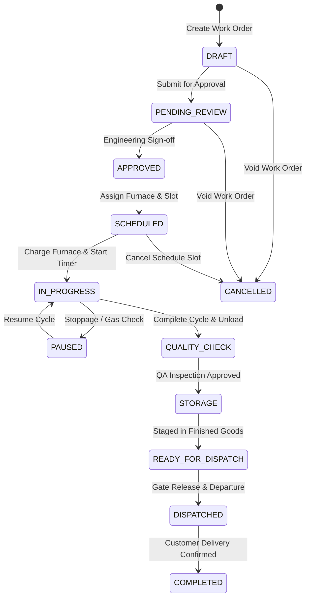

# 🚀 Astralis ERP — Complete Features & Architecture Catalog

> **Platform:** Astralis ERP (Advanced Thermal Processing, Precision Machining & Metallurgical Manufacturing)  
> **Tech Stack:** Node.js, Express, MongoDB (Mongoose 8), TypeScript, React 19, Redux Toolkit, React Router 7, Lucide Icons, Vanilla CSS (Apple HIG Design Tokens)  
> **Architecture:** Multi-Tenant Clean Layered Domain Architecture (`Route -> Controller -> Service -> Repository -> Model`) + Decoupled Domain Event Bus + Architecture Boundary Governance (`check:arch`)  
> **Authoritative Codebase Scope:** Entire ERP Repository (`c:\Users\Admin\Desktop\CelestiumERP`)

---

## 📑 Table of Contents

1. [Core Platform & Architecture Foundation](#1-core-platform--architecture-foundation)
   - 1.1 Multi-Tenant Isolation Engine
   - 1.2 Decoupled Domain Event Bus
   - 1.3 Immutable Audit Logging Subsystem
   - 1.4 Monotonic Sequential ID Generation
   - 1.5 Transparent Soft Delete Protocol
   - 1.6 Centralized Exception Hierarchy & Unified Response Envelope
   - 1.7 Enterprise Idempotency Middleware
   - 1.8 Async Background Task Queue & Resilience
   - 1.9 System Maintenance Lock Subsystem
   - 1.10 Database Connection & Resilience Subsystem
   - 1.11 Indexing Standards & Registry
   - 1.12 ACID Multi-Document Transactions
   - 1.13 Architecture Governance & Layer Boundary Enforcement (14 Rules)
   - 1.14 Security Stack, Middleware & Logging Infrastructure
   - 1.15 SRE Health, Liveness & Readiness Probes
2. [Core Platform Infrastructure Catalog](#2-core-platform-infrastructure-catalog)
3. [Domain Event Bus Registry (66 Typed Events)](#3-domain-event-bus-registry-66-typed-events)
4. [RBAC & Governance Permission Catalog (44 Granular Permissions)](#4-rbac--governance-permission-catalog-44-granular-permissions)
5. [Complete Backend Domain Modules Catalog (All 36 Modules)](#5-complete-backend-domain-modules-catalog-all-36-modules)
   - 5.1 Authentication (`auth`)
   - 5.2 Role-Based Access Control (`rbac`)
   - 5.3 Multi-Tenant Lifecycle (`tenant`)
   - 5.4 Customer Registry (`customer`)
   - 5.5 Item & Material Master (`item`)
   - 5.6 Recipe Master & Versioning (`recipe`)
   - 5.7 Specification Master (`specification`)
   - 5.8 Traceability & Heat Lots (`traceability`)
   - 5.9 Inventory & Stock Ledger (`inventory`)
   - 5.10 Warehouse & Storage Locations (`warehouse`)
   - 5.11 Quality Quarantine (`quarantine`)
   - 5.12 Finished Goods (`finished-goods`)
   - 5.13 Production Planning (`production-planning`)
   - 5.14 Material Requirements Planning (`material-requirements`)
   - 5.15 Furnace Capacity (`furnace-capacity`)
   - 5.16 Workforce Capacity (`workforce-capacity`)
   - 5.17 Constraint Analysis (`constraint-analysis`)
   - 5.18 Production Jobs (`production-job`)
   - 5.19 Production Scheduling (`production-schedule`)
   - 5.20 Quality Inspection (`quality-inspection`)
   - 5.21 Metallurgical Lab (`metallurgical-lab`)
   - 5.22 Quality Planning (`quality-planning`)
   - 5.23 Non-Conformance & CAPA (`ncr-capa`)
   - 5.24 Quality Documentation & CoC (`quality-documentation`)
   - 5.25 Machinery Fleet (`machine`)
   - 5.26 Maintenance Management (`maintenance`)
   - 5.27 AMS 2750G Pyrometry (`pyrometry`)
   - 5.28 Workforce Attendance & Shifts (`attendance`)
   - 5.29 Dispatch Logistics (`dispatch`)
   - 5.30 Finance & General Ledger (`finance`)
   - 5.31 Manufacturing Job Costing (`costing`)
   - 5.32 Customer Billing & Invoicing (`billing`)
   - 5.33 Executive Reporting & Analytics (`reporting`)
   - 5.34 Notification Center (`notification`)
   - 5.35 Universal Global Search (`search`)
   - 5.36 Security Audit Trail (`audit`)
6. [Frontend Architecture, Pages & Component Library](#6-frontend-architecture-pages--component-library)
   - 6.1 Application Shell & Navigation Layouts
   - 6.2 Frontend Route Matrix (14 Active Routes)
   - 6.3 Complete Page Workbenches (All 14 Pages)
   - 6.4 Apple HIG Design System Primitive Library (18 Components)
   - 6.5 Frontend State Management, RTK Base API & HTTP Client
   - 6.6 Apple HIG Design System Tokens & Aesthetics
7. [End-to-End Operational Domain Workflows](#7-end-to-end-operational-domain-workflows)
   - 7.1 12-Stage Heat Treatment Lifecycle Workflow
   - 7.2 Plan-to-Job Conversion & Constraint Feasibility Workflow
   - 7.3 Metallurgical Quality Inspection & CoC Generation Workflow
   - 7.4 Non-Conformance (NCR) & CAPA Verification Workflow
   - 7.5 Furnace Pyrometry (SAT/TUS) & Breakdown Maintenance Workflow
   - 7.6 Raw Material Heat-Lot Inwarding & Bi-Directional Genealogy Workflow
   - 7.7 Warehouse Storage, Quarantine Holding & Finished Goods Allocation Workflow
   - 7.8 Workforce Shift Roster, Punch Clock-In & Leave Workflow
   - 7.9 Outbound Dispatch & Gate Clearance Workflow
   - 7.10 Manufacturing Job Costing & Variance Analysis Workflow
   - 7.11 Customer Invoicing & Payment Reconciliation Workflow
   - 7.12 General Ledger Accounting & Financial Period Close Workflow
   - 7.13 Executive KPI & Shop-Floor Operational Reporting Workflow
   - 7.14 Universal Global Search & Quick Actions Workflow
8. [Operational Runbooks, SRE Documentation & Testing Infrastructure](#8-operational-runbooks-sre-documentation--testing-infrastructure)
   - 8.1 Database Seeding Engine (`backend/src/scripts/seed.ts`)
   - 8.2 Centralized Configuration Subsystem (`backend/src/config/`)
   - 8.3 Operational Runbooks & Technical Specifications (`docs/`)
   - 8.4 Automated Test Suite Matrix (47 Backend Specs + Frontend Suites)

---

## 1. Core Platform & Architecture Foundation

### 1.1 Multi-Tenant Isolation Engine
- **Strict Collection Partitioning:** Every tenant-owned MongoDB collection is indexed by a mandatory `tenantId` field.
- **Tenant Context Middleware (`tenantMiddleware`):** Extracts tenant identity from HTTP header (`x-tenant-id`) and asserts equality against validated JWT claims (`req.user.tenantId`). Mismatches immediately throw a `403 Forbidden` (`CROSS_TENANT_ACCESS_DENIED`).
- **AsyncLocalStorage Context (`TenantContextHolder`):** Wraps incoming requests in an isolated Node.js `AsyncLocalStorage` context, providing ambient tenant context across asynchronous call chains without parameter leaking.
- **Base Repository Isolation (`BaseRepository<T>`):** Automatically injects `{ tenantId }` scope into all queries (`findById`, `findOne`, `findMany`, `count`), mutations (`create`, `updateById`, `updateMany`), and soft-deletes, guaranteeing zero cross-tenant query contamination.

### 1.2 Decoupled Domain Event Bus
- **In-Memory Type-Safe Event Bus (`DomainEventBus`):** Implements an asynchronous publish-subscribe event bus that decouples domain modules without external broker dependencies.
- **66 Strongly Typed Domain Events:** Covers all lifecycle transitions across Jobs, Quality, Pyrometry, Machines, Inventory, Warehouses, Workforce, Dispatch, Master Data, Costing, and Finance.
- **Side-Effect Handlers (`registerCoreSubscribers`):** Offloads non-critical side effects (e.g. audit logging, cross-module notifications, finished-goods receipt triggers upon job completion) to keep primary HTTP responses fast and responsive.

### 1.3 Immutable Audit Logging Subsystem
- **Non-Blocking Silent Logger (`logSilently`):** Captures actor identity, action type, tenant context, timestamp, client IP, and entity details without impeding transactional execution.
- **Granular Change Diff Engine (`diff.engine.ts`):** Computes deep before-and-after property diffs (`calculateDiff`) for sensitive records to support aerospace (AMS 2750G) and automotive (CQI-9) compliance audits.
- **AuditLog Collection:** Permanently stores tamper-evident logs within tenant-partitioned MongoDB collections indexed by tenant, entity type, entity ID, and timestamp.

### 1.4 Monotonic Sequential ID Generation
- **Atomic Counter Engine (`CounterModel`, `getNextSequence`):** Utilizes MongoDB atomic `$inc` with upsert operations on a dedicated counters collection to generate monotonic, sequential numbers without race conditions under high concurrency.
- **Standardized Domain Prefixes:**
  - Production Job: `JOB-YYYYMM-XXXX` (e.g., `JOB-202609-0001`)
  - Heat Lot: `HEAT-YYYY-XXXX` (e.g., `HEAT-2026-0001`)
  - Furnace Asset: `FURN-XX` (e.g., `FURN-01`)
  - Quality Inspection: `QC-YYYYMM-XXXX`
  - CoC Certificate: `COC-YYYYMM-XXXX`
  - Non-Conformance Report: `NCR-YYYYMM-XXXX`
  - Corrective Action: `CAPA-YYYYMM-XXXX`
  - Dispatch Consignment: `DISP-YYYYMM-XXXX`
  - Customer Invoice: `INV-YYYYMM-XXXX`
  - Production Plan: `PLAN-YYYYMM-XXXX`

### 1.5 Transparent Soft Delete Protocol
- **Mongoose Soft-Delete Plugin (`softDeletePlugin`):** Transparently injects `{ isDeleted: false }` into all Mongoose `find`, `findOne`, `findOneAndUpdate`, `countDocuments`, and `aggregate` operations.
- **Audit Preservation:** Stores `deletedAt: Date` and `deletedBy: string` instead of physically deleting documents.
- **Entity Restoration:** Provides dedicated repository and controller restore methods (`restoreById`) to recover accidentally archived records.

### 1.6 Centralized Exception Hierarchy & Unified Response Envelope
- **Structured Error Hierarchy (`AppError`):**
  - `BadRequestError` (400)
  - `UnauthorizedError` (401)
  - `ForbiddenError` (403)
  - `NotFoundError` (404)
  - `ConflictError` (409)
  - `ValidationError` (422)
  - `TenantIsolationError` (403)
  - `IdempotencyConflictError` (409)
  - `InternalServerError` (500)
- **Unified API Response Standard (`ApiResponse`):** Standardizes all JSON HTTP responses across the platform:
  - `ApiResponse.success(res, data, message, statusCode)`
  - `ApiResponse.created(res, data, message)`
  - `ApiResponse.paginated(res, items, page, limit, total, message)`
  - `ApiResponse.noContent(res)`
  - `ApiResponse.error(res, message, statusCode, errors, code)`

### 1.7 Enterprise Idempotency Middleware
- **Duplicate Mutation Filter (`idempotencyMiddleware`):** Inspects `Idempotency-Key` headers on mutating requests (`POST`, `PUT`, `PATCH`).
- **In-Memory Mutex & Cache:** Stores request hashes and response envelopes. Duplicate requests with identical keys return the cached response immediately, preventing double work order creation, double billing, or accidental duplicate inventory deductions.

### 1.8 Async Background Task Queue & Resilience
- **In-Memory Job Queue (`AsyncQueueService`):** Executes intensive background operations such as report compilation, batch evaluations, and broadcast notifications.
- **Exponential Backoff & Dead-Letter Queue (DLQ):** Retries transient task failures with configurable backoff before moving failed jobs to an inspectable DLQ.

### 1.9 System Maintenance Lock Subsystem
- **Runtime Maintenance Lock (`MaintenanceLockManager`):** Allows administrators to engage maintenance mode during controlled migrations or upgrades, gracefully blocking incoming non-admin mutations with informative `503 Service Unavailable` responses.

### 1.10 Database Connection & Resilience Subsystem
- **Connection Lifecycle Manager (`DatabaseConnectionManager`):**
  - Pool Sizing: Configured between 5 and 20 connections per instance.
  - Timeout Protection: `serverSelectionTimeoutMS: 5000ms`.
  - Auto-Indexing: Automatically enabled in development/test (`autoIndex: true`) and disabled in production (`autoIndex: false`) to avoid collection locks on startup.
  - Driver Auto-Recovery: Handles network interruptions and gracefully reconnects.
  - Graceful Shutdown: Listens for `SIGINT` and `SIGTERM` to cleanly close MongoDB connection pools.

### 1.11 Indexing Standards & Registry
- **ESR Rule (Equality, Sort, Range):** All compound indexes strictly follow the ESR standard.
- **Index Registry (`IndexRegistry`):** Centralized utility that applies standard indexes:
  - Tenant Unique Index: `{ tenantId: 1, [field]: 1 }` with `{ unique: true }`
  - Status Filter Index: `{ tenantId: 1, status: 1, createdAt: -1 }`
  - Genealogy Index: `{ tenantId: 1, heatNumber: 1, lotNumber: 1 }`
  - Schedule Index: `{ tenantId: 1, furnaceId: 1, scheduledStartTime: 1, scheduledEndTime: 1 }`
  - Ephemeral TTL Index: `{ createdAt: 1 }` with expiration seconds.

### 1.12 ACID Multi-Document Transactions
- **Atomic Transaction Runner (`withTransaction`):** Coordinates complex operations across multiple collections inside atomic MongoDB sessions (e.g. Job completion + inventory finished goods receipt + CoC generation).

### 1.13 Architecture Governance & Layer Boundary Enforcement (14 Rules)
The platform enforces strict Layered Clean Architecture (`Route -> Controller -> Service -> Repository -> Model`) via `ArchitectureGuard` and automated tests (`npm run check:arch`):
1. **Rule 1: `DIRECT_PROCESS_ENV_PROHIBITED`** — Direct access to `process.env` is prohibited outside `src/config/` and `src/governance/`.
2. **Rule 2: `CONTROLLER_DIRECT_REPOSITORY_PROHIBITED`** — Controllers must never import Repositories directly.
3. **Rule 3: `CONTROLLER_DIRECT_MODEL_PROHIBITED`** — Controllers must never import Models or Mongoose directly.
4. **Rule 4: `ROUTE_DIRECT_SERVICE_PROHIBITED`** — Routes must never import Services directly; routes delegate strictly to Controllers.
5. **Rule 5: `ROUTE_DIRECT_REPOSITORY_PROHIBITED`** — Routes must never import Repositories directly.
6. **Rule 6: `ROUTE_DIRECT_MODEL_PROHIBITED`** — Routes must never import Models directly.
7. **Rule 7: `REPOSITORY_CALL_SERVICE_PROHIBITED`** — Repositories must never import Services (prohibits circular upward dependencies).
8. **Rule 8: `REPOSITORY_CALL_CONTROLLER_PROHIBITED`** — Repositories must never import Controllers.
9. **Rule 9: `REPOSITORY_EMIT_EVENTS_PROHIBITED`** — Repositories must never emit Domain Events directly; only Services emit events.
10. **Rule 10: `MODEL_IMPORT_SERVICE_PROHIBITED`** — Models must never import Services.
11. **Rule 11: `MODEL_IMPORT_REPOSITORY_PROHIBITED`** — Models must never import Repositories.
12. **Rule 12: `SERVICE_CALL_CONTROLLER_PROHIBITED`** — Services must never import Controllers.
13. **Rule 13: `SERVICE_EXPRESS_LEAKAGE_PROHIBITED`** — Services must never import or receive Express `Request`, `Response`, or `NextFunction` objects.
14. **Rule 14: `CROSS_DOMAIN_DIRECT_DATA_ACCESS_PROHIBITED`** — Domain A must never import Domain B's repository or model directly; cross-domain coordination must use Domain B's Service or Domain Event Bus.

### 1.14 Security Stack, Middleware & Logging Infrastructure
- **Helmet:** Sets secure HTTP response headers.
- **CORS Whitelist:** Validates origin headers against configured domains.
- **Compression:** Gzip compresses JSON payloads.
- **Rate Limiters:** `apiRateLimiter` (1000 req/15min) and `authRateLimiter` (20 req/15min).
- **Winston JSON Logger (`logger.ts`):** Emits structured JSON logs with automatic masking of sensitive keys (`password`, `token`, `secret`, `authorization`).
- **Zod Environment Validator (`env.config.ts`, `env.validator.ts`):** Validates all environment variables at startup, failing fast if required configuration keys are missing.
- **Async Handler HOC (`asyncHandler`):** Wraps express controller methods, capturing rejected promises and forwarding errors to the global error middleware.

### 1.15 SRE Health, Liveness & Readiness Probes
- `GET /api/v1/health` — Comprehensive service diagnostics: database connection state, round-trip ping latency, process uptime, and memory usage (RSS, Heap).
- `GET /api/v1/health/liveness` — Kubernetes liveness probe verifying process responsiveness.
- `GET /api/v1/health/readiness` — Kubernetes readiness probe verifying database readiness to receive traffic.

---

## 2. Core Platform Infrastructure Catalog

The core framework in `backend/src/core` provides foundational utilities and base classes across 18 subdirectories (33 files):

| Directory | File | Primary Exports | Functionality & Purpose |
|---|---|---|---|
| `constants` | `events.ts` | `DomainEvents`, `DomainEventName` | Central registry of 66 strongly typed domain event names across 10 categories. |
| `constants` | `permissions.ts` | `Permissions`, `PermissionKey`, `PERMISSION_CATALOG` | 44 granular permissions categorized by domain with Standard, Sensitive, and Critical tiers. |
| `constants` | `status.ts` | `JobStatus`, `QualityStatus`, `MachineStatus`, etc. | Authoritative enum definitions for all domain entity lifecycles. |
| `context` | `tenant-context.ts` | `TenantContext`, `TenantContextHolder` | `AsyncLocalStorage` context holder providing ambient tenant and user data. |
| `controllers` | `base.controller.ts` | `BaseController` | Base class for controllers with tenant extraction, user claims, pagination, and response helpers. |
| `database` | `connection.ts` | `DatabaseConnectionManager` | Mongoose connection lifecycle manager with retry loops, pooling, and graceful shutdown. |
| `database` | `health.ts` | `getDatabaseHealth`, `DatabaseHealth` | Evaluates live MongoDB connection health and ping latency. |
| `database` | `index-registry.ts` | `IndexRegistry` | Declarative index helper enforcing tenant-unique and ESR query optimization patterns. |
| `database` | `transaction.ts` | `withTransaction` | Executes multi-document operations inside managed MongoDB ACID sessions. |
| `errors` | `app-error.ts` | `AppError`, `BadRequestError`, `NotFoundError`, etc. | Complete structured HTTP exception hierarchy with error codes and status codes. |
| `events` | `domain-event-bus.ts` | `DomainEventBus` | In-memory pub/sub broker with typed event dispatching and listener management. |
| `events` | `subscribers.ts` | `registerCoreSubscribers` | Registers system-wide listeners for cross-domain side effects. |
| `governance` | `architecture-guard.ts` | `ArchitectureGuard`, `ArchitectureViolation` | AST and regex scanner enforcing 14 clean architecture layer rules in CI builds. |
| `maintenance` | `maintenance-lock.ts` | `MaintenanceLockManager` | Manages platform-wide maintenance locks to block non-administrative mutations. |
| `middleware` | `auth.middleware.ts` | `authenticateJwt`, `optionalAuth` | Validates Bearer JWT tokens and populates `req.user` claims. |
| `middleware` | `error.middleware.ts` | `errorMiddleware` | Centralized Express error handler normalizing exceptions into `ApiResponse.error`. |
| `middleware` | `idempotency.middleware.ts` | `idempotencyMiddleware` | Intercepts `Idempotency-Key` headers on mutations to prevent duplicate execution. |
| `middleware` | `rate-limiter.middleware.ts` | `apiRateLimiter`, `authRateLimiter` | Express rate-limiting middleware protecting against brute-force attacks and abuse. |
| `middleware` | `rbac.middleware.ts` | `requirePermission`, `requireRole` | Enforces RBAC permission and role authorizations on protected routes. |
| `middleware` | `tenant.middleware.ts` | `tenantMiddleware` | Asserts tenant boundaries by verifying `x-tenant-id` header against JWT claims. |
| `models` | `base.schema.ts` | `createBaseSchema` | Mongoose schema factory injecting `tenantId`, timestamps, soft delete, and ID transforms. |
| `models` | `counter.model.ts` | `CounterModel`, `getNextSequence` | Atomic monotonic sequential business identifier generator. |
| `plugins` | `soft-delete.plugin.ts` | `softDeletePlugin` | Global Mongoose plugin transparently injecting `{ isDeleted: false }` into queries. |
| `repository` | `base.repository.ts` | `BaseRepository<T>` | Abstract repository encapsulating tenant scoping for CRUD, pagination, and soft delete. |
| `responses` | `api-response.ts` | `ApiResponse` | Standard JSON response formatter (`success`, `created`, `paginated`, `error`). |
| `routes` | `base.router.ts` | `createBaseRouter` | Factory helper for configuring Express domain routers. |
| `services` | `audit-log.service.ts` | `AuditLogService` | Service managing tamper-evident audit logging and entity audit trail queries. |
| `services` | `base.service.ts` | `BaseService` | Base service class providing common logging and event emission capabilities. |
| `services` | `queue.service.ts` | `AsyncQueueService` | Background task queue with exponential backoff and dead-letter queue. |
| `types` | `common.types.ts` | `PaginatedResult`, `PaginationQuery`, `UserContext` | Core TypeScript interfaces and shared data types. |
| `utils` | `async-handler.ts` | `asyncHandler` | High-order controller wrapper forwarding rejected promises to error middleware. |
| `utils` | `crypto.utils.ts` | `hashPassword`, `comparePassword`, `generateToken` | Cryptographic helpers for bcrypt hashing and JWT token signing/verification. |
| `utils` | `diff.engine.ts` | `calculateDiff`, `DiffItem` | Deep property difference engine calculating before/after changes for audit logs. |
| `utils` | `logger.ts` | `logger` | Winston JSON logger with automated masking of sensitive attributes. |
| `validators` | `base.validator.ts` | `validateBody`, `validateQuery`, `validateParams` | Zod validation middleware for Express route inputs. |
| `validators` | `env.validator.ts` | `validateEnv`, `envSchema` | Zod schema validating environment variables at application bootstrap. |
| `validators` | `pagination.validator.ts` | `paginationQuerySchema` | Zod schema validating standard pagination and sorting parameters. |

---

## 3. Domain Event Bus Registry (66 Typed Events)

The in-memory `DomainEventBus` manages 66 strongly typed domain events across 10 business domains:

| Domain | Event Identifier | Emitted When | Typical Subscribed Side Effects |
|---|---|---|---|
| **Jobs** | `Job.Created` | New production job work order is drafted. | Audit logging, notification dispatch. |
| **Jobs** | `Job.Scheduled` | Job assigned to furnace time slot. | Machine calendar update, operator notification. |
| **Jobs** | `Job.Started` | Furnace charge entry, heating cycle timer started. | Machine status `RUNNING`, live telemetry streaming. |
| **Jobs** | `Job.Paused` | Thermal cycle temporarily paused. | Machine status `IDLE`, downtime timer started. |
| **Jobs** | `Job.Resumed` | Processing resumed after hold. | Machine status `RUNNING`, downtime timer ended. |
| **Jobs** | `Job.DowntimeLogged` | Operator logs stoppage reason. | OEE metrics calculation, supervisor notification. |
| **Jobs** | `Job.Completed` | Thermal process completed, unloaded. | Quality inspection record auto-created, machine `IDLE`. |
| **Jobs** | `Job.Cancelled` | Job cancelled prior to completion. | Schedule released, inventory reservations released. |
| **Jobs** | `Job.DispatchStaged` | Job transferred to dispatch holding area. | Finished goods status updated to dispatchable. |
| **Quality** | `QualityInspection.Created` | Inspection record created for job or raw material. | Inspector assignment queue updated. |
| **Quality** | `QualityInspection.Started` | Inspector commences physical test execution. | Inspection status set to `IN_PROGRESS`. |
| **Quality** | `QualityInspection.MeasurementsRecorded` | Hardness survey or lab reading captured. | Traverse curve updated, target-vs-actual checked. |
| **Quality** | `QualityInspection.DefectLogged` | Discrepancy observed. | Defect Pareto updated. |
| **Quality** | `QualityInspection.Approved` | QA Manager signs off inspection. | CoC generated, job transitioned to `STORAGE`. |
| **Quality** | `QualityInspection.Rejected` | Quality inspection failed. | Automatic NCR generated, material quarantined. |
| **Quality** | `QualityInspection.ReinspectionRequested` | Inconclusive readings require repolish/retest. | Secondary inspection task queued. |
| **Quality** | `QualityInspection.NcrRaised` | Formal NCR created. | Containment alert dispatched, MRB review scheduled. |
| **Quality** | `QualityInspection.CapaUpdated` | Corrective/Preventive Action logged. | CAPA verification deadline tracked. |
| **Quality** | `QualityPlan.Approved` | Quality inspection plan revision approved. | Activated for new production runs. |
| **Quality** | `Quality.TestReportGenerated` | Lab test findings compiled. | Test report attached to job audit trail. |
| **Quality** | `Quality.CocIssued` | Certificate of Conformance approved and signed. | Finished goods released for dispatch. |
| **Quality** | `Quality.CocRevoked` | Certificate of Conformance voided. | Dispatches blocked, alert triggered. |
| **Machines** | `Machine.Registered` | New furnace, CNC, or quench tank commissioned. | Asset database updated. |
| **Machines** | `Machine.StatusChanged` | Operational state transitions (Idle, Running, Maint). | Command center status cards updated. |
| **Machines** | `Machine.BreakdownReported` | Unplanned equipment stoppage logged. | Machine status set to `BREAKDOWN`, maintenance alerted. |
| **Machines** | `Machine.BreakdownResolved` | Emergency repair completed. | Machine transitioned to `MAINTENANCE` for testing. |
| **Machines** | `Machine.CalibrationLogged` | Sensor calibration, TUS, or SAT recorded. | Pyrometry compliance window refreshed. |
| **Machines** | `Machine.MaintenanceTriggered` | PM schedule interval elapsed. | Maintenance work order spawned. |
| **Machines** | `Machine.MaintenanceCompleted` | Service completed, parts logged. | PM schedule timer reset, machine restored to `IDLE`. |
| **Machines** | `Maintenance.WorkOrderCreated` | Work order opened for repair or service. | Assigned technician notified. |
| **Machines** | `Maintenance.WorkOrderCompleted` | Maintenance technician signs off work order. | Asset downtime hours rolled into OEE. |
| **Machines** | `Maintenance.PreventivePlanCreated`| New PM schedule defined. | Calendar reminders configured. |
| **Inventory** | `Inventory.ItemCreated` | New item or SKU master record created. | Item catalog updated. |
| **Inventory** | `Inventory.GoodsReceived` | Inward delivery from supplier recorded. | Stock balance incremented, heat lot created. |
| **Inventory** | `Inventory.GoodsIssued` | Material issued to production job. | Stock balance decremented, WIP charged. |
| **Inventory** | `Inventory.StockAdjusted` | Supervisor manual stock adjustment logged. | Inventory ledger updated with variance. |
| **Inventory** | `Inventory.StockReserved` | Raw material reserved for planned job. | Available stock decremented, reserved incremented. |
| **Inventory** | `Inventory.StockReleased` | Reservation cancelled. | Available stock restored. |
| **Inventory** | `Inventory.HeatLotCreated` | New heat lot batch registered with MTR. | Inward QC inspection triggered. |
| **Inventory** | `Inventory.LowStockAlert` | Balance falls below safety reorder threshold. | Reorder notification sent to procurement. |
| **Warehouse** | `Warehouse.PutawayCompleted` | Material placed in specific warehouse bin. | Location occupancy updated. |
| **Warehouse** | `Warehouse.MaterialQuarantined` | Material moved to quarantine storage bay. | Bin flagged as quarantine hold. |
| **Warehouse** | `Warehouse.MaterialReleased` | Material cleared by QA. | Transferred from quarantine to usable bin. |
| **Warehouse** | `Warehouse.FinishedGoodsReceived`| Completed job parts received in FG store. | Finished goods ledger incremented. |
| **Warehouse** | `Warehouse.FinishedGoodsReserved`| Parts reserved for scheduled customer dispatch. | FG reservation locked against shipping order. |
| **Workforce** | `Workforce.EmployeeCreated` | New operator or staff profile added. | Personnel directory updated. |
| **Workforce** | `Workforce.EmployeeDeactivated` | Employee offboarded or suspended. | System access revoked, schedules cleared. |
| **Workforce** | `Workforce.ShiftScheduled` | Operator assigned to shift roster. | Shift calendar updated. |
| **Workforce** | `Workforce.PunchRecorded` | Operator clocks in or out. | Attendance status computed (Present/Late). |
| **Workforce** | `Workforce.LeaveRequested` | Leave application submitted. | Supervisor approval queue updated. |
| **Workforce** | `Workforce.LeaveApproved` | Supervisor approves time off. | Shift roster updated, leave balance decremented. |
| **Workforce** | `Workforce.LeaveRejected` | Supervisor denies leave request. | Employee notified with reason. |
| **Workforce** | `Workforce.OvertimeRequested` | Overtime hours submitted. | Supervisor authorization queue updated. |
| **Workforce** | `Workforce.OvertimeApproved` | Overtime approved at multiplier rate. | Payroll cost accumulator updated. |
| **Workforce** | `Workforce.ShiftSwapped` | Peer shift swap approved. | Both operators' rosters swapped atomically. |
| **Workforce** | `Workforce.AttendanceCorrected`| Supervisor corrects missed punch. | Attendance record updated with audit justification. |
| **Dispatch** | `Dispatch.Created` | Outbound consignment order drafted. | Staging queue updated. |
| **Dispatch** | `Dispatch.QualityVerified` | Verification that all jobs have approved CoCs. | Gate clearance milestone 1 achieved. |
| **Dispatch** | `Dispatch.Scheduled` | Carrier, vehicle, and driver assigned. | Logistics schedule locked. |
| **Dispatch** | `Dispatch.Approved` | Plant manager authorizes departure. | Gate pass issued. |
| **Dispatch** | `Dispatch.Shipped` | Consignment departs factory premises. | Shipment status set to `IN_TRANSIT`. |
| **Dispatch** | `Dispatch.Delivered` | Customer receives goods, PoD uploaded. | Consignment `DELIVERED`, billing notified. |
| **Dispatch** | `Dispatch.Cancelled` | Consignment cancelled before departure. | Finished goods reservations released. |
| **Master Data**| `MasterData.RecipeApproved` | Thermal recipe revision approved. | Locked for production scheduling. |
| **Master Data**| `MasterData.SpecificationApproved`| Quality specification approved. | Linked to inspection criteria. |
| **Planning** | `Planning.ProductionPlanCreated` | Master production plan established. | MRP shortage calculation triggered. |
| **Planning** | `Planning.MrpRunCompleted` | Material requirement calculations completed. | Shortage report generated. |
| **Costing** | `Costing.JobCostCalculated` | Material, labor, machine, energy calculated. | Job cost ledger populated. |
| **Costing** | `Costing.JobCostRecalculated` | Updated with final actuals upon completion. | Cost variance recorded. |
| **Costing** | `Costing.JobCostFrozen` | Job cost locked for historical archiving. | Sealed against future rate card changes. |
| **Costing** | `Costing.RateCardUpdated` | Machine-hour or labor rate revised. | Applied to future costing calculations. |
| **Finance** | `Finance.JournalPosted` | Balanced journal entry posted to GL. | Account balances updated. |
| **Finance** | `Finance.JournalReversed` | Journal entry reversed with offsetting entries.| Historical audit trail preserved. |
| **Finance** | `Finance.PeriodClosed` | Financial accounting period sealed. | Prior period postings blocked. |
| **Finance** | `Finance.PeriodReopened` | Period unsealed under supervisor approval. | Audit alert generated. |
| **Finance** | `Finance.InvoiceIssued` | Customer billing invoice generated. | Accounts receivable ledger incremented. |
| **Finance** | `Finance.InvoiceVoided` | Invoice cancelled. | Reversing journal posted. |
| **Finance** | `Finance.PaymentReceived` | Customer remittance recorded. | Receivables decremented, bank account credited. |
| **System** | `System.AuditLogged` | Audit entry recorded for compliance. | Real-time audit stream notified. |
| **System** | `System.AlertTriggered` | Critical operational anomaly detected. | Command center and push alerts triggered. |

---

## 4. RBAC & Governance Permission Catalog (44 Granular Permissions)

The platform enforces 44 granular permissions categorized across 12 functional domains with three sensitivity tiers:
- **Standard (30):** Routine shop-floor, engineering, and administrative actions.
- **Sensitive (11):** High-impact actions (deletions, quality sign-offs, gate releases, personnel deactivations).
- **Critical (3):** System-level administration, tenant management, and audit log access.

| Domain | Permission Key | Sensitivity | Purpose & Access Control Scope |
|---|---|---|---|
| **Jobs** | `JOB_VIEW` | Standard | View production jobs, recipes, schedules, and work order timelines. |
| **Jobs** | `JOB_CREATE` | Standard | Draft new production work orders and batches from approved plans. |
| **Jobs** | `JOB_UPDATE` | Standard | Update recipe targets, furnace allocations, and progress milestones. |
| **Jobs** | `JOB_DELETE` | Sensitive | Soft-delete or cancel draft work orders. |
| **Jobs** | `JOB_DISPATCH` | Sensitive | Authorize completed job transfer to dispatch holding. |
| **Quality** | `QC_INSPECT` | Standard | Record hardness surveys, microhardness traverse, and microstructures. |
| **Quality** | `QC_ASSIGN` | Standard | Assign certified inspection personnel to inspection work orders. |
| **Quality** | `QC_APPROVE` | Sensitive | Authorize Certificates of Conformance (CoC) and release lots. |
| **Quality** | `QC_REJECT` | Sensitive | Reject non-conforming batches and trigger Non-Conformance Reports. |
| **Machines** | `MACHINE_VIEW` | Standard | Inspect machinery fleet status, working zones, and pyrometry telemetry. |
| **Machines** | `MACHINE_CREATE` | Standard | Register new furnaces, CNC equipment, and quench tanks. |
| **Machines** | `MACHINE_UPDATE` | Standard | Update machine technical parameters, zone dimensions, and capabilities. |
| **Machines** | `MACHINE_DELETE` | Standard | Decommission or archive obsolete factory machinery. |
| **Machines** | `MACHINE_MAINTAIN` | Standard | Log preventive maintenance, breakdown repairs, and sensor calibrations. |
| **Inventory** | `INVENTORY_VIEW` | Standard | View stock balances, heat lots, MTRs, and warehouse storage bins. |
| **Inventory** | `INVENTORY_UPDATE` | Standard | Record goods receipts, material issues, and bin transfers. |
| **Inventory** | `INVENTORY_MANAGE` | Standard | Perform supervisor manual stock adjustments and manage SKU master data. |
| **Employees** | `EMPLOYEE_VIEW` | Standard | View operator profiles, department allocations, and certified skills. |
| **Employees** | `EMPLOYEE_CREATE` | Standard | Register new employee profiles and operator accounts. |
| **Employees** | `EMPLOYEE_UPDATE` | Standard | Update contact information, department assignments, and work shifts. |
| **Employees** | `EMPLOYEE_DELETE` | Sensitive | Offboard and soft-delete an employee profile. |
| **Employees** | `EMPLOYEE_DEACTIVATE`| Sensitive | Temporarily suspend operator system access while preserving history. |
| **Employees** | `EMPLOYEE_REACTIVATE`| Sensitive | Re-enable system access for returning personnel. |
| **Employees** | `EMPLOYEE_ASSIGN` | Standard | Allocate operators to specific production cells and furnace bays. |
| **Employees** | `EMPLOYEE_MANAGE_SKILLS`| Sensitive | Certify specialized technical skills (e.g., Pyrometry, Vacuum Furnace). |
| **Attendance**| `ATTENDANCE_VIEW` | Standard | View shift rosters, clock-in/out records, leaves, and attendance calendars. |
| **Attendance**| `ATTENDANCE_MARK` | Standard | Record clock-in and clock-out timestamps for work shifts. |
| **Attendance**| `WORKFORCE_MANAGE` | Standard | Define plant shifts, approve leave applications, and authorize overtime. |
| **Dispatch** | `DISPATCH_VIEW` | Standard | View outbound consignments, shipping manifests, and delivery tracking. |
| **Dispatch** | `DISPATCH_CREATE` | Standard | Draft outbound shipment orders grouping finished jobs. |
| **Dispatch** | `DISPATCH_SCHEDULE` | Standard | Assign carrier details, vehicles, drivers, and delivery dates. |
| **Dispatch** | `DISPATCH_APPROVE` | Sensitive | Plant manager authorization for shipment gate departure. |
| **Dispatch** | `DISPATCH_MARK` | Standard | Update shipment milestones (Departed, In-Transit, Delivered with PoD). |
| **Dispatch** | `DISPATCH_CANCEL` | Sensitive | Cancel outbound dispatch and release finished goods back to storage. |
| **Reports** | `REPORTS_VIEW` | Standard | Access executive OEE dashboards, quality analytics, and throughput reports. |
| **Reports** | `REPORTS_MANAGE` | Standard | Configure automated recurring report generation and data exports. |
| **Customers** | `CUSTOMER_VIEW` | Standard | View customer directory, commercial terms, and contact profiles. |
| **Customers** | `CUSTOMER_CREATE` | Standard | Register new client companies and billing profiles. |
| **Customers** | `CUSTOMER_UPDATE` | Standard | Update customer billing terms, credit limits, and addresses. |
| **Customers** | `CUSTOMER_DELETE` | Standard | Archive or soft-delete customer profiles. |
| **Notifications**| `NOTIFICATIONS_VIEW`| Standard | View in-app notification center alerts and history. |
| **Notifications**| `NOTIFICATIONS_MANAGE`| Standard | Broadcast system alerts and manage notification preferences. |
| **Admin** | `SYSTEM_ADMIN` | Critical | Configure system infrastructure parameters and maintenance mode locks. |
| **Admin** | `TENANT_MANAGE` | Critical | Provision new tenant organizations and manage organizational lifecycles. |
| **Admin** | `AUDIT_VIEW` | Critical | Access and export immutable security audit logs with field diffs. |
| **Workflow** | `WORKFLOW_VIEW` | Standard | Inspect domain state-machine transition histories. |
| **Workflow** | `WORKFLOW_EXECUTE` | Standard | Trigger state transitions on jobs, quality inspections, and dispatches. |
| **Workflow** | `WORKFLOW_MANAGE` | Sensitive | Override or force state transitions under supervisor authorization. |

---

## 5. Complete Backend Domain Modules Catalog (All 36 Modules)

### 5.1 Authentication & Session Security (`modules/auth`)

> **Business Purpose:** Provides secure multi-tenant identity verification, bcrypt password hashing, dual JWT token rotation (access + refresh tokens), session revocation, and password recovery workflows.

#### Models & Schemas
- **`refresh-token.model.ts`** — Mongoose model: `RefreshToken`. Exported interfaces: ``. Encapsulates schema definitions, compound tenant indexes, and data validation rules.
- **`user.model.ts`** — Mongoose model: `User`. Exported interfaces: ``. Encapsulates schema definitions, compound tenant indexes, and data validation rules.

#### Repositories
- **`RefreshTokenRepository`** (`refresh-token.repository.ts`): Extends `BaseRepository<T>`. Encapsulates tenant-isolated database access routines:
  - Methods: `findByTokenHash()`, `revokeToken()`, `revokeFamily()`, `revokeAllForUser()`.
- **`UserRepository`** (`user.repository.ts`): Extends `BaseRepository<T>`. Encapsulates tenant-isolated database access routines:
  - Methods: `findByEmail()`, `findByUsername()`, `findByIdentifier()`, `findByResetToken()`, `updatePassword()`, `recordLoginSuccess()`, `recordFailedAttempt()`, `setResetToken()`, `clearResetToken()`.

#### Services
- **`AuthService`** (`auth.service.ts`): Encapsulates core business rules, transactional workflows, validation, and domain event publishing:
  - Methods: `register()`, `login()`, `refreshToken()`, `logout()`, `forgotPassword()`, `resetPassword()`, `getCurrentUser()`, `revokeAllSessions()`.

#### Controllers
- **`AuthController`** (`auth.controller.ts`): Extends `BaseController`. Handles HTTP request parsing, authentication verification, and response wrapping:

#### Validators (Zod Schemas)
- **`auth.validator.ts`**: Exported Zod validation schemas: .

#### API Endpoints & Routes
- `POST /api/v1/auth/register` — Handled by `AuthController`.
- `POST /api/v1/auth/login` — Handled by `AuthController`.
- `POST /api/v1/auth/refresh-token` — Handled by `AuthController`.
- `POST /api/v1/auth/refresh` — Handled by `AuthController`.
- `POST /api/v1/auth/forgot-password` — Handled by `AuthController`.
- `POST /api/v1/auth/reset-password` — Handled by `AuthController`.
- `GET /api/v1/auth/me` — Handled by `AuthController`.
- `POST /api/v1/auth/logout` — Handled by `AuthController`.
- `POST /api/v1/auth/revoke-all-sessions` — Handled by `AuthController`.

### 5.2 Role-Based Access Control (RBAC) & Governance (`modules/rbac`)

> **Business Purpose:** Manages fine-grained permission catalogs, role definitions, tenant-scoped user role bindings, and permission matrix queries.

#### Models & Schemas
- **`role.model.ts`** — Mongoose model: `Role`. Exported interfaces: ``. Encapsulates schema definitions, compound tenant indexes, and data validation rules.

#### Repositories
- **`RoleRepository`** (`role.repository.ts`): Extends `BaseRepository<T>`. Encapsulates tenant-isolated database access routines:
  - Methods: `findByCode()`, `findRolesByCodes()`, `seedDefaultRolesForTenant()`.

#### Services
- **`RbacService`** (`rbac.service.ts`): Encapsulates core business rules, transactional workflows, validation, and domain event publishing:
  - Methods: `getPermissionsCatalog()`, `getUserEffectivePermissions()`, `getRolesForTenant()`, `createRole()`, `updateRole()`, `assignRolesToUser()`.

#### Controllers
- **`RbacController`** (`rbac.controller.ts`): Extends `BaseController`. Handles HTTP request parsing, authentication verification, and response wrapping:

#### Validators (Zod Schemas)
- **`rbac.validator.ts`**: Exported Zod validation schemas: .

#### API Endpoints & Routes
- `GET /api/v1/rbac/permissions` — Handled by `RbacController`.
- `GET /api/v1/rbac/me/permissions` — Handled by `RbacController`.
- `GET /api/v1/rbac/roles` — Handled by `RbacController`.
- `POST /api/v1/rbac/roles` — Handled by `RbacController`.
- `PUT /api/v1/rbac/roles/:id` — Handled by `RbacController`.
- `POST /api/v1/rbac/users/:userId/roles` — Handled by `RbacController`.

### 5.3 Multi-Tenant Lifecycle & Organization Governance (`modules/tenant`)

> **Business Purpose:** Encapsulates tenant organization master data, status transitions (provisioning, active, suspended, archived), and system-wide isolation guarantees.

#### Models & Schemas
- **`tenant.model.ts`** — Mongoose model: `Tenant`. Exported interfaces: ``. Encapsulates schema definitions, compound tenant indexes, and data validation rules.

#### Repositories
- **`TenantRepository`** (`tenant.repository.ts`): Extends `BaseRepository<T>`. Encapsulates tenant-isolated database access routines:
  - Methods: `findById()`, `findByCode()`, `create()`, `update()`, `updateStatus()`, `findAll()`.

#### Services
- **`TenantService`** (`tenant.service.ts`): Encapsulates core business rules, transactional workflows, validation, and domain event publishing:
  - Methods: `provisionTenant()`, `getTenantByCode()`, `getTenantById()`, `suspendTenant()`, `activateTenant()`, `updateTenant()`, `getAllTenants()`.

#### Controllers
- _Internal domain service without direct HTTP controller endpoints._

#### Validators (Zod Schemas)
- _No dedicated request body validators required._

#### API Endpoints & Routes
_No direct HTTP routes mounted for this internal domain service._

### 5.4 Customer & Client Registry (`modules/customer`)

> **Business Purpose:** Maintains commercial customer profiles, credit limits, billing/shipping addresses, tax identifiers, and contact directories.

#### Models & Schemas
- **`customer.model.ts`** — Mongoose model: `Customer`. Exported interfaces: ``. Encapsulates schema definitions, compound tenant indexes, and data validation rules.

#### Repositories
- **`CustomerRepository`** (`customer.repository.ts`): Extends `BaseRepository<T>`. Encapsulates tenant-isolated database access routines:
  - Methods: `findByCode()`, `searchCustomers()`, `incrementJobCounters()`.

#### Services
- **`CustomerService`** (`customer.service.ts`): Encapsulates core business rules, transactional workflows, validation, and domain event publishing:
  - Methods: `createCustomer()`, `getCustomerById()`, `getCustomerByCode()`, `updateCustomer()`, `updateCustomerStatus()`, `archiveCustomer()`, `searchCustomers()`.

#### Controllers
- **`CustomerController`** (`customer.controller.ts`): Extends `BaseController`. Handles HTTP request parsing, authentication verification, and response wrapping:

#### Validators (Zod Schemas)
- **`customer.validator.ts`**: Exported Zod validation schemas: .

#### API Endpoints & Routes
- `GET /api/v1/customers` — Handled by `CustomerController`.
- `POST /api/v1/customers` — Handled by `CustomerController`.
- `GET /api/v1/customers/code/:code` — Handled by `CustomerController`.
- `GET /api/v1/customers/:id` — Handled by `CustomerController`.
- `PUT /api/v1/customers/:id` — Handled by `CustomerController`.
- `PATCH /api/v1/customers/:id/status` — Handled by `CustomerController`.
- `DELETE /api/v1/customers/:id` — Handled by `CustomerController`.

### 5.5 Item & Material Master Data (`modules/item`)

> **Business Purpose:** Defines master part records, customer drawing numbers, alloy grades, material classifications, and standard processing requirements.

#### Models & Schemas
- **`item.model.ts`** — Mongoose model: `Item`. Exported interfaces: ``. Encapsulates schema definitions, compound tenant indexes, and data validation rules.

#### Repositories
- **`ItemRepository`** (`item.repository.ts`): Extends `BaseRepository<T>`. Encapsulates tenant-isolated database access routines:
  - Methods: `findByCode()`, `searchItems()`, `updateStock()`, `incrementBatchCounters()`.

#### Services
- **`ItemService`** (`item.service.ts`): Encapsulates core business rules, transactional workflows, validation, and domain event publishing:
  - Methods: `createItem()`, `getItemById()`, `getItemByCode()`, `updateItem()`, `updateItemStatus()`, `archiveItem()`, `searchItems()`.

#### Controllers
- **`ItemController`** (`item.controller.ts`): Extends `BaseController`. Handles HTTP request parsing, authentication verification, and response wrapping:

#### Validators (Zod Schemas)
- **`item.validator.ts`**: Exported Zod validation schemas: .

#### API Endpoints & Routes
- `GET /api/v1/items` — Handled by `ItemController`.
- `POST /api/v1/items` — Handled by `ItemController`.
- `GET /api/v1/items/code/:code` — Handled by `ItemController`.
- `GET /api/v1/items/:id` — Handled by `ItemController`.
- `PUT /api/v1/items/:id` — Handled by `ItemController`.
- `PATCH /api/v1/items/:id/status` — Handled by `ItemController`.
- `DELETE /api/v1/items/:id` — Handled by `ItemController`.

### 5.6 Thermal Process Recipe Master & Versioning (`modules/recipe`)

> **Business Purpose:** Manages revision-controlled heat-treatment recipes including ramp rates, target temperatures, soak dwell times, carbon potential, quench media, and tempering stages.

#### Models & Schemas
- **`recipe.model.ts`** — Mongoose model: `Recipe`. Exported interfaces: ``. Encapsulates schema definitions, compound tenant indexes, and data validation rules.

#### Repositories
- **`RecipeRepository`** (`recipe.repository.ts`): Extends `BaseRepository<T>`. Encapsulates tenant-isolated database access routines:
  - Methods: `findByCodeAndRevision()`, `findLatestActiveRevision()`, `findHighestRevision()`, `searchRecipes()`, `supersedePreviousRevisions()`, `incrementJobCounters()`.

#### Services
- **`RecipeService`** (`recipe.service.ts`): Encapsulates core business rules, transactional workflows, validation, and domain event publishing:
  - Methods: `createRecipe()`, `getRecipeById()`, `getRecipeByCodeAndRevision()`, `getLatestActiveRecipe()`, `updateRecipe()`, `submitForApproval()`, `approveRecipe()`, `rejectRecipe()`, `createNewRevision()`, `retireRecipe()`, `searchRecipes()`.

#### Controllers
- **`RecipeController`** (`recipe.controller.ts`): Extends `BaseController`. Handles HTTP request parsing, authentication verification, and response wrapping:

#### Validators (Zod Schemas)
- **`recipe.validator.ts`**: Exported Zod validation schemas: .

#### API Endpoints & Routes
- `GET /api/v1/recipes` — Handled by `RecipeController`.
- `POST /api/v1/recipes` — Handled by `RecipeController`.
- `GET /api/v1/recipes/latest/:code` — Handled by `RecipeController`.
- `GET /api/v1/recipes/code/:code/revision/:revision` — Handled by `RecipeController`.
- `GET /api/v1/recipes/:id` — Handled by `RecipeController`.
- `PUT /api/v1/recipes/:id` — Handled by `RecipeController`.
- `POST /api/v1/recipes/:id/submit-approval` — Handled by `RecipeController`.
- `POST /api/v1/recipes/:id/approve` — Handled by `RecipeController`.
- `POST /api/v1/recipes/:id/reject` — Handled by `RecipeController`.
- `POST /api/v1/recipes/:id/new-revision` — Handled by `RecipeController`.
- `POST /api/v1/recipes/:id/retire` — Handled by `RecipeController`.

### 5.7 Metallurgical Specification Master & Standards (`modules/specification`)

> **Business Purpose:** Maintains revision-controlled customer and engineering specifications for surface hardness, core hardness, effective case depth (ECD), and microstructure limits.

#### Models & Schemas
- **`specification.model.ts`** — Mongoose model: `Specification`. Exported interfaces: ``. Encapsulates schema definitions, compound tenant indexes, and data validation rules.

#### Repositories
- **`SpecificationRepository`** (`specification.repository.ts`): Extends `BaseRepository<T>`. Encapsulates tenant-isolated database access routines:
  - Methods: `findByCodeAndRevision()`, `findLatestActiveRevision()`, `findHighestRevision()`, `searchSpecifications()`, `supersedePreviousRevisions()`, `incrementJobCounters()`.

#### Services
- **`SpecificationService`** (`specification.service.ts`): Encapsulates core business rules, transactional workflows, validation, and domain event publishing:
  - Methods: `createSpecification()`, `getSpecificationById()`, `getSpecificationByCodeAndRevision()`, `getLatestActiveSpecification()`, `updateSpecification()`, `submitForApproval()`, `approveSpecification()`, `rejectSpecification()`, `createNewRevision()`, `retireSpecification()`, `searchSpecifications()`.

#### Controllers
- **`SpecificationController`** (`specification.controller.ts`): Extends `BaseController`. Handles HTTP request parsing, authentication verification, and response wrapping:

#### Validators (Zod Schemas)
- **`specification.validator.ts`**: Exported Zod validation schemas: .

#### API Endpoints & Routes
- `GET /api/v1/specifications` — Handled by `SpecificationController`.
- `POST /api/v1/specifications` — Handled by `SpecificationController`.
- `GET /api/v1/specifications/latest/:code` — Handled by `SpecificationController`.
- `GET /api/v1/specifications/code/:code/revision/:revision` — Handled by `SpecificationController`.
- `GET /api/v1/specifications/:id` — Handled by `SpecificationController`.
- `PUT /api/v1/specifications/:id` — Handled by `SpecificationController`.
- `POST /api/v1/specifications/:id/submit-approval` — Handled by `SpecificationController`.
- `POST /api/v1/specifications/:id/approve` — Handled by `SpecificationController`.
- `POST /api/v1/specifications/:id/reject` — Handled by `SpecificationController`.
- `POST /api/v1/specifications/:id/new-revision` — Handled by `SpecificationController`.
- `POST /api/v1/specifications/:id/retire` — Handled by `SpecificationController`.

### 5.8 Metallurgical Heat-Lot Traceability & Lineage (`modules/traceability`)

> **Business Purpose:** Enforces complete bi-directional traceability linking raw material heat lots, Mill Test Certificates (MTR), chemistry records, inward inspection, job consumption, and customer shipments.

#### Models & Schemas
- **`heat-lot.model.ts`** — Mongoose model: `HeatLot`. Exported interfaces: ``. Encapsulates schema definitions, compound tenant indexes, and data validation rules.

#### Repositories
- **`HeatLotRepository`** (`heat-lot.repository.ts`): Extends `BaseRepository<T>`. Encapsulates tenant-isolated database access routines:
  - Methods: `findByHeatLotNumber()`, `findBySupplierHeatNumber()`, `findByJobCardNumber()`, `findChildLots()`, `searchHeatLots()`, `generateNextHeatLotNumber()`.

#### Services
- **`HeatLotService`** (`heat-lot.service.ts`): Encapsulates core business rules, transactional workflows, validation, and domain event publishing:
  - Methods: `inwardHeatLot()`, `getHeatLotById()`, `getHeatLotByNumber()`, `quarantineHeatLot()`, `releaseHeatLot()`, `allocateHeatLot()`, `consumeHeatLot()`, `forwardTrace()`, `backwardTrace()`, `searchHeatLots()`.

#### Controllers
- **`HeatLotController`** (`heat-lot.controller.ts`): Extends `BaseController`. Handles HTTP request parsing, authentication verification, and response wrapping:

#### Validators (Zod Schemas)
- **`heat-lot.validator.ts`**: Exported Zod validation schemas: .

#### API Endpoints & Routes
- `GET /api/v1/heat-lots` — Handled by `HeatLotController`.
- `POST /api/v1/heat-lots` — Handled by `HeatLotController`.
- `POST /api/v1/heat-lots/inward` — Handled by `HeatLotController`.
- `GET /api/v1/heat-lots/backward-trace` — Handled by `HeatLotController`.
- `GET /api/v1/heat-lots/forward-trace/:number` — Handled by `HeatLotController`.
- `GET /api/v1/heat-lots/number/:number` — Handled by `HeatLotController`.
- `GET /api/v1/heat-lots/:id` — Handled by `HeatLotController`.
- `PATCH /api/v1/heat-lots/:id/quarantine` — Handled by `HeatLotController`.
- `PATCH /api/v1/heat-lots/:id/release` — Handled by `HeatLotController`.
- `POST /api/v1/heat-lots/:id/allocate` — Handled by `HeatLotController`.
- `POST /api/v1/heat-lots/:id/consume` — Handled by `HeatLotController`.

### 5.9 Raw Materials, Consumables & Stock Ledger (`modules/inventory`)

> **Business Purpose:** Tracks stock balances, goods receipts, goods issues to production jobs, supervisor stock adjustments, inter-location transfers, and work-order reservations.

#### Models & Schemas
- **`inventory-balance.model.ts`** — Mongoose model: `InventoryBalance`. Exported interfaces: ``. Encapsulates schema definitions, compound tenant indexes, and data validation rules.
- **`inventory-transaction.model.ts`** — Mongoose model: ``. Exported interfaces: ``. Encapsulates schema definitions, compound tenant indexes, and data validation rules.

#### Repositories
- **`InventoryRepository`** (`inventory.repository.ts`): Extends `BaseRepository<T>`. Encapsulates tenant-isolated database access routines:
  - Methods: `getBalance()`, `findOrCreateBalance()`, `updateBalance()`, `searchBalances()`, `recordTransaction()`, `searchTransactions()`, `generateTransactionNumber()`.

#### Services
- **`InventoryService`** (`inventory.service.ts`): Encapsulates core business rules, transactional workflows, validation, and domain event publishing:
  - Methods: `recordGoodsReceipt()`, `recordGoodsIssue()`, `recordStockAdjustment()`, `recordInternalTransfer()`, `reserveStock()`, `releaseReservation()`, `getBalance()`, `searchBalances()`, `searchTransactions()`.

#### Controllers
- **`InventoryController`** (`inventory.controller.ts`): Extends `BaseController`. Handles HTTP request parsing, authentication verification, and response wrapping:

#### Validators (Zod Schemas)
- **`inventory.validator.ts`**: Exported Zod validation schemas: .

#### API Endpoints & Routes
- `GET /api/v1/inventory/balances` — Handled by `InventoryController`.
- `GET /api/v1/inventory/transactions` — Handled by `InventoryController`.
- `POST /api/v1/inventory/goods-receipt` — Handled by `InventoryController`.
- `POST /api/v1/inventory/goods-issue` — Handled by `InventoryController`.
- `POST /api/v1/inventory/adjustments` — Handled by `InventoryController`.
- `POST /api/v1/inventory/transfers` — Handled by `InventoryController`.
- `POST /api/v1/inventory/reservations` — Handled by `InventoryController`.
- `POST /api/v1/inventory/reservations/release` — Handled by `InventoryController`.

### 5.10 Warehouse Locations & Topology Management (`modules/warehouse`)

> **Business Purpose:** Models physical factory storage topology including warehouse bays, aisles, racks, and bins with capacity and occupancy tracking.

#### Models & Schemas
- **`storage-location.model.ts`** — Mongoose model: ``. Exported interfaces: ``. Encapsulates schema definitions, compound tenant indexes, and data validation rules.
- **`warehouse.model.ts`** — Mongoose model: `Warehouse`. Exported interfaces: ``. Encapsulates schema definitions, compound tenant indexes, and data validation rules.

#### Repositories
- **`WarehouseRepository`** (`warehouse.repository.ts`): Extends `BaseRepository<T>`. Encapsulates tenant-isolated database access routines:
  - Methods: `createWarehouse()`, `findWarehouseById()`, `findWarehouseByCode()`, `updateWarehouse()`, `searchWarehouses()`, `createLocation()`, `findLocationById()`, `findLocationByCode()`, `updateLocation()`, `searchLocations()`, `findLocationsByWarehouse()`.

#### Services
- **`WarehouseService`** (`warehouse.service.ts`): Encapsulates core business rules, transactional workflows, validation, and domain event publishing:
  - Methods: `createWarehouse()`, `getWarehouseById()`, `updateWarehouse()`, `searchWarehouses()`, `createStorageLocation()`, `getLocationById()`, `getLocationByCode()`, `validateLocationForStockMovement()`, `updateStorageLocation()`, `searchLocations()`, `getLocationsByWarehouse()`.

#### Controllers
- **`WarehouseController`** (`warehouse.controller.ts`): Extends `BaseController`. Handles HTTP request parsing, authentication verification, and response wrapping:

#### Validators (Zod Schemas)
- **`warehouse.validator.ts`**: Exported Zod validation schemas: .

#### API Endpoints & Routes
- `GET /api/v1/warehouses` — Handled by `WarehouseController`.
- `POST /api/v1/warehouses` — Handled by `WarehouseController`.
- `GET /api/v1/warehouses/locations` — Handled by `WarehouseController`.
- `POST /api/v1/warehouses/locations` — Handled by `WarehouseController`.
- `GET /api/v1/warehouses/locations/code/:code` — Handled by `WarehouseController`.
- `GET /api/v1/warehouses/locations/:id` — Handled by `WarehouseController`.
- `PATCH /api/v1/warehouses/locations/:id` — Handled by `WarehouseController`.
- `GET /api/v1/warehouses/:warehouseId/locations` — Handled by `WarehouseController`.
- `GET /api/v1/warehouses/:id` — Handled by `WarehouseController`.
- `PATCH /api/v1/warehouses/:id` — Handled by `WarehouseController`.

### 5.11 Quality Quarantine & Material Isolation (`modules/quarantine`)

> **Business Purpose:** Quarantines suspicious or non-conforming materials, tracking quarantine records, root causes, supervisor dispositions, and authorized release gates.

#### Models & Schemas
- **`quarantine.model.ts`** — Mongoose model: ``. Exported interfaces: ``. Encapsulates schema definitions, compound tenant indexes, and data validation rules.

#### Repositories
- **`QuarantineRepository`** (`quarantine.repository.ts`): Extends `BaseRepository<T>`. Encapsulates tenant-isolated database access routines:
  - Methods: `createQuarantine()`, `findQuarantineById()`, `findQuarantineByNumber()`, `findActiveQuarantineForTarget()`, `findActiveQuarantinesByItem()`, `updateQuarantine()`, `searchQuarantines()`, `generateQuarantineNumber()`.

#### Services
- **`QuarantineService`** (`quarantine.service.ts`): Encapsulates core business rules, transactional workflows, validation, and domain event publishing:
  - Methods: `placeInQuarantine()`, `releaseFromQuarantine()`, `dispositionQuarantine()`, `isTargetQuarantined()`, `getQuarantineById()`, `getQuarantineByNumber()`, `searchQuarantines()`.

#### Controllers
- **`QuarantineController`** (`quarantine.controller.ts`): Extends `BaseController`. Handles HTTP request parsing, authentication verification, and response wrapping:

#### Validators (Zod Schemas)
- **`quarantine.validator.ts`**: Exported Zod validation schemas: .

#### API Endpoints & Routes
- `GET /api/v1/quarantine` — Handled by `QuarantineController`.
- `POST /api/v1/quarantine` — Handled by `QuarantineController`.
- `GET /api/v1/quarantine/number/:number` — Handled by `QuarantineController`.
- `GET /api/v1/quarantine/:id` — Handled by `QuarantineController`.
- `POST /api/v1/quarantine/:id/release` — Handled by `QuarantineController`.
- `POST /api/v1/quarantine/:id/disposition` — Handled by `QuarantineController`.

### 5.12 Finished Goods Inventory & Dispatch Staging (`modules/finished-goods`)

> **Business Purpose:** Tracks QA-cleared finished goods received from production jobs, warehouse bin locations, dispatch reservations, and physical shipment releases.

#### Models & Schemas
- **`finished-goods.model.ts`** — Mongoose model: `FinishedGoods`. Exported interfaces: ``. Encapsulates schema definitions, compound tenant indexes, and data validation rules.

#### Repositories
- **`FinishedGoodsRepository`** (`finished-goods.repository.ts`): Extends `BaseRepository<T>`. Encapsulates tenant-isolated database access routines:
  - Methods: `create()`, `findById()`, `findByLotNumber()`, `findByJobCardNumber()`, `update()`, `search()`, `generateFgLotNumber()`.

#### Services
- **`FinishedGoodsService`** (`finished-goods.service.ts`): Encapsulates core business rules, transactional workflows, validation, and domain event publishing:
  - Methods: `inwardFinishedGoods()`, `releaseFinishedGoods()`, `reserveForDispatch()`, `releaseDispatchReservation()`, `moveLocation()`, `getById()`, `getByLotNumber()`, `search()`.

#### Controllers
- **`FinishedGoodsController`** (`finished-goods.controller.ts`): Extends `BaseController`. Handles HTTP request parsing, authentication verification, and response wrapping:

#### Validators (Zod Schemas)
- **`finished-goods.validator.ts`**: Exported Zod validation schemas: .

#### API Endpoints & Routes
- `GET /api/v1/finished-goods` — Handled by `FinishedGoodsController`.
- `POST /api/v1/finished-goods/inward` — Handled by `FinishedGoodsController`.
- `GET /api/v1/finished-goods/lot/:lotNumber` — Handled by `FinishedGoodsController`.
- `GET /api/v1/finished-goods/:id` — Handled by `FinishedGoodsController`.
- `POST /api/v1/finished-goods/:id/release` — Handled by `FinishedGoodsController`.
- `POST /api/v1/finished-goods/:id/reserve` — Handled by `FinishedGoodsController`.
- `POST /api/v1/finished-goods/:id/reserve/release` — Handled by `FinishedGoodsController`.
- `PATCH /api/v1/finished-goods/:id/location` — Handled by `FinishedGoodsController`.

### 5.13 Master Production Planning & Scheduling (`modules/production-planning`)

> **Business Purpose:** Creates and coordinates production plans, target quantities, planned dates, priority scheduling, and plan recalculation against factory constraints.

#### Models & Schemas
- **`production-plan.model.ts`** — Mongoose model: `ProductionPlan`. Exported interfaces: ``. Encapsulates schema definitions, compound tenant indexes, and data validation rules.

#### Repositories
- **`ProductionPlanRepository`** (`production-plan.repository.ts`): Extends `BaseRepository<T>`. Encapsulates tenant-isolated database access routines:
  - Methods: `generateNextPlanNumber()`, `findByPlanNumber()`, `findActivePlansByItem()`, `queryPlans()`.

#### Services
- **`ProductionPlanService`** (`production-plan.service.ts`): Encapsulates core business rules, transactional workflows, validation, and domain event publishing:
  - Methods: `createPlan()`, `getPlanById()`, `getPlanByNumber()`, `queryPlans()`, `updatePlan()`, `updatePlanStatus()`, `recalculatePlan()`.

#### Controllers
- **`ProductionPlanController`** (`production-plan.controller.ts`): Extends `BaseController`. Handles HTTP request parsing, authentication verification, and response wrapping:

#### Validators (Zod Schemas)
- **`production-plan.validator.ts`**: Exported Zod validation schemas: .

#### API Endpoints & Routes
- `GET /api/v1/production-plans` — Handled by `ProductionPlanController`.
- `POST /api/v1/production-plans` — Handled by `ProductionPlanController`.
- `GET /api/v1/production-plans/number/:planNumber` — Handled by `ProductionPlanController`.
- `GET /api/v1/production-plans/:id` — Handled by `ProductionPlanController`.
- `PUT /api/v1/production-plans/:id` — Handled by `ProductionPlanController`.
- `PATCH /api/v1/production-plans/:id/status` — Handled by `ProductionPlanController`.
- `POST /api/v1/production-plans/:id/recalculate` — Handled by `ProductionPlanController`.

### 5.14 Material Requirements Planning (MRP) & Shortages (`modules/material-requirements`)

> **Business Purpose:** Analyzes material demand against active production plans, detects raw material shortages, and manages material reservations against inventory.

#### Models & Schemas
- **`material-reservation.model.ts`** — Mongoose model: `MaterialReservation`. Exported interfaces: ``. Encapsulates schema definitions, compound tenant indexes, and data validation rules.

#### Repositories
- **`MaterialRequirementsRepository`** (`material-requirements.repository.ts`): Extends `BaseRepository<T>`. Encapsulates tenant-isolated database access routines:
  - Methods: `generateNextReservationNumber()`, `findReservationByNumber()`, `findActiveReservationsByPlan()`, `findActiveReservationsByTarget()`, `findReservationsByItem()`.

#### Services
- **`MaterialRequirementsService`** (`material-requirements.service.ts`): Encapsulates core business rules, transactional workflows, validation, and domain event publishing:
  - Methods: `calculateRequirements()`, `getShortages()`, `reserveMaterial()`, `releaseReservation()`, `releaseAllReservationsForPlan()`, `getReservationsByPlan()`.

#### Controllers
- **`MaterialRequirementsController`** (`material-requirements.controller.ts`): Extends `BaseController`. Handles HTTP request parsing, authentication verification, and response wrapping:

#### Validators (Zod Schemas)
- **`material-requirements.validator.ts`**: Exported Zod validation schemas: .

#### API Endpoints & Routes
- `POST /api/v1/material-requirements/calculate` — Handled by `MaterialRequirementsController`.
- `GET /api/v1/material-requirements/shortages` — Handled by `MaterialRequirementsController`.
- `POST /api/v1/material-requirements/reserve` — Handled by `MaterialRequirementsController`.
- `POST /api/v1/material-requirements/reservations/:id/release` — Handled by `MaterialRequirementsController`.
- `GET /api/v1/material-requirements/reservations/plan/:planId` — Handled by `MaterialRequirementsController`.

### 5.15 Furnace Asset Registry & Capacity Allocation (`modules/furnace-capacity`)

> **Business Purpose:** Manages furnace profiles, working zone dimensions, temperature limits, atmospheric controls, process capability matching, and time-slot capacity bookings.

#### Models & Schemas
- **`furnace-allocation.model.ts`** — Mongoose model: `FurnaceAllocation`. Exported interfaces: ``. Encapsulates schema definitions, compound tenant indexes, and data validation rules.
- **`furnace.model.ts`** — Mongoose model: `Furnace`. Exported interfaces: ``. Encapsulates schema definitions, compound tenant indexes, and data validation rules.

#### Repositories
- **`FurnaceAllocationRepository`** (`furnace-capacity.repository.ts`): Extends `BaseRepository<T>`. Encapsulates tenant-isolated database access routines:
  - Methods: `findFurnaceByCode()`, `findFurnaceById()`, `findFurnaces()`, `createFurnace()`, `updateFurnace()`, `generateNextAllocationNumber()`, `findOverlappingAllocations()`, `findAllocationsInPeriod()`, `createAllocation()`, `findAllocationById()`, `updateAllocation()`.

#### Services
- **`FurnaceCapacityService`** (`furnace-capacity.service.ts`): Encapsulates core business rules, transactional workflows, validation, and domain event publishing:
  - Methods: `createFurnace()`, `getFurnaces()`, `getFurnaceById()`, `checkCompatibility()`, `bookCapacity()`, `releaseAllocation()`, `getUtilization()`.

#### Controllers
- **`FurnaceCapacityController`** (`furnace-capacity.controller.ts`): Extends `BaseController`. Handles HTTP request parsing, authentication verification, and response wrapping:

#### Validators (Zod Schemas)
- **`furnace-capacity.validator.ts`**: Exported Zod validation schemas: .

#### API Endpoints & Routes
- `GET /api/v1/furnace-capacity` — Handled by `FurnaceCapacityController`.
- `POST /api/v1/furnace-capacity` — Handled by `FurnaceCapacityController`.
- `GET /api/v1/furnace-capacity/:id` — Handled by `FurnaceCapacityController`.
- `POST /api/v1/furnace-capacity/check-compatibility` — Handled by `FurnaceCapacityController`.
- `GET /api/v1/furnace-capacity/utilization` — Handled by `FurnaceCapacityController`.
- `POST /api/v1/furnace-capacity/book` — Handled by `FurnaceCapacityController`.
- `DELETE /api/v1/furnace-capacity/allocations/:id` — Handled by `FurnaceCapacityController`.

### 5.16 Workforce Operator Skills & Shift Allocation (`modules/workforce-capacity`)

> **Business Purpose:** Tracks operator skills (pyrometry, vacuum furnace operation, metallurgical testing), evaluates shift skill coverage, and books operator allocations.

#### Models & Schemas
- **`workforce-member.model.ts`** — Mongoose model: `WorkforceMember`. Exported interfaces: ``. Encapsulates schema definitions, compound tenant indexes, and data validation rules.
- **`workforce-shift-allocation.model.ts`** — Mongoose model: ``. Exported interfaces: ``. Encapsulates schema definitions, compound tenant indexes, and data validation rules.

#### Repositories
- **`WorkforceShiftAllocationRepository`** (`workforce-capacity.repository.ts`): Extends `BaseRepository<T>`. Encapsulates tenant-isolated database access routines:
  - Methods: `findEmployeeByCode()`, `findEmployeeById()`, `findEmployees()`, `createEmployee()`, `updateEmployee()`, `generateNextAllocationNumber()`, `findEmployeeAllocationsOnDate()`, `findAllocationsForShift()`, `createAllocation()`, `findAllocationById()`, `updateAllocation()`.

#### Services
- **`WorkforceCapacityService`** (`workforce-capacity.service.ts`): Encapsulates core business rules, transactional workflows, validation, and domain event publishing:
  - Methods: `createEmployee()`, `addOrUpdateSkill()`, `getEmployees()`, `getEmployeeById()`, `evaluateCoverage()`, `assignOperator()`, `releaseAssignment()`, `getShiftCapacity()`.

#### Controllers
- **`WorkforceCapacityController`** (`workforce-capacity.controller.ts`): Extends `BaseController`. Handles HTTP request parsing, authentication verification, and response wrapping:

#### Validators (Zod Schemas)
- **`workforce-capacity.validator.ts`**: Exported Zod validation schemas: .

#### API Endpoints & Routes
- `GET /api/v1/workforce-capacity` — Handled by `WorkforceCapacityController`.
- `POST /api/v1/workforce-capacity` — Handled by `WorkforceCapacityController`.
- `GET /api/v1/workforce-capacity/:id` — Handled by `WorkforceCapacityController`.
- `POST /api/v1/workforce-capacity/:id/skills` — Handled by `WorkforceCapacityController`.
- `POST /api/v1/workforce-capacity/evaluate-coverage` — Handled by `WorkforceCapacityController`.
- `GET /api/v1/workforce-capacity/shift-capacity` — Handled by `WorkforceCapacityController`.
- `POST /api/v1/workforce-capacity/assign` — Handled by `WorkforceCapacityController`.
- `DELETE /api/v1/workforce-capacity/allocations/:id` — Handled by `WorkforceCapacityController`.

### 5.17 Factory Constraint & Bottleneck Analysis (`modules/constraint-analysis`)

> **Business Purpose:** Performs multidimensional feasibility audits across furnace capacity, operator skill availability, and material stock to identify production bottlenecks.

#### Models & Schemas
- _No dedicated Mongoose collection; acts as a pure calculation, aggregation, or analytical engine._

#### Repositories
- _No standalone repository; coordinates across related domain services._

#### Services
- **`ConstraintAnalysisService`** (`constraint-analysis.service.ts`): Encapsulates core business rules, transactional workflows, validation, and domain event publishing:
  - Methods: `evaluatePlanConstraints()`, `factoryAudit()`.

#### Controllers
- **`ConstraintAnalysisController`** (`constraint-analysis.controller.ts`): Extends `BaseController`. Handles HTTP request parsing, authentication verification, and response wrapping:

#### Validators (Zod Schemas)
- **`constraint-analysis.validator.ts`**: Exported Zod validation schemas: .

#### API Endpoints & Routes
- `POST /api/v1/constraint-analysis/evaluate-plan/:planId` — Handled by `ConstraintAnalysisController`.
- `GET /api/v1/constraint-analysis/factory-audit` — Handled by `ConstraintAnalysisController`.
- `GET /api/v1/constraint-analysis/bottlenecks` — Handled by `ConstraintAnalysisController`.

### 5.18 Production Work Order Execution & Lifecycle (`modules/production-job`)

> **Business Purpose:** Executes the core 12-stage heat treatment production lifecycle, furnace charges, operator assignments, stage progress tracking, pause/resume, and downtime logging.

#### Models & Schemas
- **`production-job.model.ts`** — Mongoose model: `ProductionJob`. Exported interfaces: ``. Encapsulates schema definitions, compound tenant indexes, and data validation rules.

#### Repositories
- **`ProductionJobRepository`** (`production-job.repository.ts`): Extends `BaseRepository<T>`. Encapsulates tenant-isolated database access routines:
  - Methods: `generateNextJobNumber()`, `findJobByNumber()`, `findByPlanId()`, `findJobsByPlanId()`, `findByIdempotencyKey()`, `queryJobs()`, `findActiveQueueJobs()`, `findConflictingJobs()`.

#### Services
- **`ProductionJobService`** (`production-job.service.ts`): Encapsulates core business rules, transactional workflows, validation, and domain event publishing:
  - Methods: `createDirectJob()`, `updateJob()`, `assignOperator()`, `removeOperator()`, `assignFurnace()`, `removeFurnace()`, `startJobExecution()`, `recordStageProgress()`, `pauseJobExecution()`, `resumeJobExecution()`, `addProductionLog()`, `completeJobExecution()`, `transitionToStorage()`, `getMachineUtilizationAndDowntime()`, `transitionJob()`, `cancelJob()`, `getProductionQueue()`, `convertPlanToJob()`, `getJobs()`, `getJobById()`, `getJobsByPlanId()`.

#### Controllers
- **`ProductionJobController`** (`production-job.controller.ts`): Extends `BaseController`. Handles HTTP request parsing, authentication verification, and response wrapping:

#### Validators (Zod Schemas)
- **`production-job.validator.ts`**: Exported Zod validation schemas: .

#### API Endpoints & Routes
- `POST /api/v1/production-jobs` — Handled by `ProductionJobController`.
- `POST /api/v1/production-jobs/convert-plan/:planId` — Handled by `ProductionJobController`.
- `GET /api/v1/production-jobs/queue` — Handled by `ProductionJobController`.
- `GET /api/v1/production-jobs/analytics/utilization` — Handled by `ProductionJobController`.
- `GET /api/v1/production-jobs` — Handled by `ProductionJobController`.
- `GET /api/v1/production-jobs/by-plan/:planId` — Handled by `ProductionJobController`.
- `GET /api/v1/production-jobs/:id` — Handled by `ProductionJobController`.
- `PATCH /api/v1/production-jobs/:id` — Handled by `ProductionJobController`.
- `POST /api/v1/production-jobs/:id/assign-operator` — Handled by `ProductionJobController`.
- `POST /api/v1/production-jobs/:id/remove-operator` — Handled by `ProductionJobController`.
- `POST /api/v1/production-jobs/:id/assign-furnace` — Handled by `ProductionJobController`.
- `POST /api/v1/production-jobs/:id/remove-furnace` — Handled by `ProductionJobController`.
- `POST /api/v1/production-jobs/:id/start` — Handled by `ProductionJobController`.
- `POST /api/v1/production-jobs/:id/stage-progress` — Handled by `ProductionJobController`.
- `POST /api/v1/production-jobs/:id/pause` — Handled by `ProductionJobController`.
- `POST /api/v1/production-jobs/:id/resume` — Handled by `ProductionJobController`.
- `POST /api/v1/production-jobs/:id/notes` — Handled by `ProductionJobController`.
- `POST /api/v1/production-jobs/:id/complete` — Handled by `ProductionJobController`.
- `POST /api/v1/production-jobs/:id/transition-storage` — Handled by `ProductionJobController`.
- `POST /api/v1/production-jobs/:id/transition` — Handled by `ProductionJobController`.
- `POST /api/v1/production-jobs/:id/cancel` — Handled by `ProductionJobController`.

### 5.19 Production Scheduling & Shop-Floor Queue (`modules/production-schedule`)

> **Business Purpose:** Schedules production jobs into machine time windows, manages priority sequencing, resolves booking conflicts, and surfaces active shop-floor furnace queues.

#### Models & Schemas
- **`production-schedule.model.ts`** — Mongoose model: `ProductionSchedule`. Exported interfaces: ``. Encapsulates schema definitions, compound tenant indexes, and data validation rules.

#### Repositories
- **`ProductionScheduleRepository`** (`production-schedule.repository.ts`): Extends `BaseRepository<T>`. Encapsulates tenant-isolated database access routines:
  - Methods: `generateNextScheduleNumber()`, `findActiveScheduleByJobId()`, `findActiveSchedulesByFurnaceAndTime()`, `findActiveSchedulesByOperatorAndTime()`, `querySchedules()`.

#### Services
- **`ProductionScheduleService`** (`production-schedule.service.ts`): Encapsulates core business rules, transactional workflows, validation, and domain event publishing:
  - Methods: `scheduleJob()`, `rescheduleJob()`, `unscheduleJob()`, `getProductionQueue()`, `querySchedules()`, `getScheduleById()`.

#### Controllers
- **`ProductionScheduleController`** (`production-schedule.controller.ts`): Extends `BaseController`. Handles HTTP request parsing, authentication verification, and response wrapping:

#### Validators (Zod Schemas)
- **`production-schedule.validator.ts`**: Exported Zod validation schemas: .

#### API Endpoints & Routes
- `POST /api/v1/production-schedules` — Handled by `ProductionScheduleController`.
- `POST /api/v1/production-schedules/:id/reschedule` — Handled by `ProductionScheduleController`.
- `POST /api/v1/production-schedules/:id/unschedule` — Handled by `ProductionScheduleController`.
- `GET /api/v1/production-schedules/queue` — Handled by `ProductionScheduleController`.
- `GET /api/v1/production-schedules` — Handled by `ProductionScheduleController`.
- `GET /api/v1/production-schedules/:id` — Handled by `ProductionScheduleController`.

### 5.20 Quality Inspection & In-Process Testing (`modules/quality-inspection`)

> **Business Purpose:** Orchestrates the 5-tier quality inspection lifecycle, certified inspector assignments, test recording, pass/fail dispositioning, and reinspection requests.

#### Models & Schemas
- **`quality-inspection.model.ts`** — Mongoose model: ``. Exported interfaces: ``. Encapsulates schema definitions, compound tenant indexes, and data validation rules.

#### Repositories
- **`QualityInspectionRepository`** (`quality-inspection.repository.ts`): Extends `BaseRepository<T>`. Encapsulates tenant-isolated database access routines:
  - Methods: `create()`, `findById()`, `findByInspectionNumber()`, `findByJobId()`, `find()`, `queryInspections()`, `generateNextInspectionNumber()`.

#### Services
- **`QualityInspectionService`** (`quality-inspection.service.ts`): Encapsulates core business rules, transactional workflows, validation, and domain event publishing:
  - Methods: `createInspection()`, `getInspections()`, `getInspectionById()`, `getInspectionByJobId()`, `assignInspector()`, `recordTestResults()`, `approveInspection()`, `rejectInspection()`, `requestReinspection()`.

#### Controllers
- **`QualityInspectionController`** (`quality-inspection.controller.ts`): Extends `BaseController`. Handles HTTP request parsing, authentication verification, and response wrapping:

#### Validators (Zod Schemas)
- **`quality-inspection.validator.ts`**: Exported Zod validation schemas: `createQualityInspectionSchema`, `assignInspectorSchema`, `recordTestResultsSchema`, `approveInspectionSchema`, `rejectInspectionSchema`, `requestReinspectionSchema`, `queryQualityInspectionsSchema`.

#### API Endpoints & Routes
- `POST /api/v1/quality-inspections` — Handled by `QualityInspectionController`.
- `GET /api/v1/quality-inspections` — Handled by `QualityInspectionController`.
- `GET /api/v1/quality-inspections/by-job/:jobId` — Handled by `QualityInspectionController`.
- `GET /api/v1/quality-inspections/:id` — Handled by `QualityInspectionController`.
- `POST /api/v1/quality-inspections/:id/assign` — Handled by `QualityInspectionController`.
- `POST /api/v1/quality-inspections/:id/test-results` — Handled by `QualityInspectionController`.
- `POST /api/v1/quality-inspections/:id/approve` — Handled by `QualityInspectionController`.
- `POST /api/v1/quality-inspections/:id/reject` — Handled by `QualityInspectionController`.
- `POST /api/v1/quality-inspections/:id/reinspection` — Handled by `QualityInspectionController`.

### 5.21 Metallurgical Lab Subsystem & Physical Testing (`modules/metallurgical-lab`)

> **Business Purpose:** Captures physical lab data including multi-scale hardness surveys (Rockwell, Vickers, Brinell), traverse depth-hardness curves (ECD), and microstructural evaluations.

#### Models & Schemas
- **`metallurgical-lab.model.ts`** — Mongoose model: ``. Exported interfaces: ``. Encapsulates schema definitions, compound tenant indexes, and data validation rules.

#### Repositories
- **`MetallurgicalLabRepository`** (`metallurgical-lab.repository.ts`): Extends `BaseRepository<T>`. Encapsulates tenant-isolated database access routines:
  - Methods: `create()`, `findById()`, `findByRecordNumber()`, `findByInspectionId()`, `findByJobId()`, `queryRecords()`, `generateNextRecordNumber()`.

#### Services
- **`MetallurgicalLabService`** (`metallurgical-lab.service.ts`): Encapsulates core business rules, transactional workflows, validation, and domain event publishing:
  - Methods: `createLabRecord()`, `getRecordById()`, `getRecordsByInspectionId()`, `getRecordsByJobId()`, `queryRecords()`, `addHardnessMeasurement()`, `addHardnessTraverse()`, `addMicrostructureObservation()`, `lockLabRecord()`, `calculateEffectiveCaseDepth()`.

#### Controllers
- **`MetallurgicalLabController`** (`metallurgical-lab.controller.ts`): Extends `BaseController`. Handles HTTP request parsing, authentication verification, and response wrapping:

#### Validators (Zod Schemas)
- **`metallurgical-lab.validator.ts`**: Exported Zod validation schemas: `createLabTestRecordSchema`, `addHardnessMeasurementSchema`, `hardnessTraversePointSchema`, `addHardnessTraverseSchema`, `addMicrostructureObservationSchema`, `lockLabTestRecordSchema`, `queryLabTestRecordsSchema`.

#### API Endpoints & Routes
- `POST /api/v1/metallurgical-lab` — Handled by `MetallurgicalLabController`.
- `GET /api/v1/metallurgical-lab` — Handled by `MetallurgicalLabController`.
- `GET /api/v1/metallurgical-lab/:id` — Handled by `MetallurgicalLabController`.
- `GET /api/v1/metallurgical-lab/by-inspection/:inspectionId` — Handled by `MetallurgicalLabController`.
- `GET /api/v1/metallurgical-lab/by-job/:jobId` — Handled by `MetallurgicalLabController`.
- `POST /api/v1/metallurgical-lab/:id/hardness` — Handled by `MetallurgicalLabController`.
- `POST /api/v1/metallurgical-lab/:id/traverse` — Handled by `MetallurgicalLabController`.
- `POST /api/v1/metallurgical-lab/:id/microstructure` — Handled by `MetallurgicalLabController`.
- `POST /api/v1/metallurgical-lab/:id/lock` — Handled by `MetallurgicalLabController`.

### 5.22 Quality Inspection Planning & Inspection Criteria (`modules/quality-planning`)

> **Business Purpose:** Maintains reusable inspection plans, sampling frequencies, mandatory test criteria, and acceptance thresholds tied to customer specifications.

#### Models & Schemas
- **`quality-planning.model.ts`** — Mongoose model: `QualityPlan`. Exported interfaces: ``. Encapsulates schema definitions, compound tenant indexes, and data validation rules.

#### Repositories
- **`QualityPlanningRepository`** (`quality-planning.repository.ts`): Extends `BaseRepository<T>`. Encapsulates tenant-isolated database access routines:
  - Methods: `create()`, `findById()`, `findByPlanCodeAndRevision()`, `findActiveApprovedRevision()`, `findApplicablePlan()`, `queryPlans()`, `markPreviousRevisionsObsolete()`, `generateNextPlanCode()`.

#### Services
- **`QualityPlanningService`** (`quality-planning.service.ts`): Encapsulates core business rules, transactional workflows, validation, and domain event publishing:
  - Methods: `createPlan()`, `updateDraftPlan()`, `approvePlan()`, `createRevision()`, `getPlanById()`, `getActiveApprovedPlan()`, `findApplicablePlan()`, `queryPlans()`, `createSnapshot()`, `evaluateInspectionCompliance()`.

#### Controllers
- **`QualityPlanningController`** (`quality-planning.controller.ts`): Extends `BaseController`. Handles HTTP request parsing, authentication verification, and response wrapping:

#### Validators (Zod Schemas)
- **`quality-planning.validator.ts`**: Exported Zod validation schemas: `acceptanceCriteriaSchema`, `inspectionCharacteristicSchema`, `createQualityPlanSchema`, `updateQualityPlanSchema`, `approveQualityPlanSchema`, `createQualityPlanRevisionSchema`, `queryQualityPlansSchema`.

#### API Endpoints & Routes
- `POST /api/v1/quality-plans` — Handled by `QualityPlanningController`.
- `GET /api/v1/quality-plans` — Handled by `QualityPlanningController`.
- `GET /api/v1/quality-plans/applicable` — Handled by `QualityPlanningController`.
- `GET /api/v1/quality-plans/active/:planCode` — Handled by `QualityPlanningController`.
- `GET /api/v1/quality-plans/:id` — Handled by `QualityPlanningController`.
- `PUT /api/v1/quality-plans/:id` — Handled by `QualityPlanningController`.
- `POST /api/v1/quality-plans/:id/approve` — Handled by `QualityPlanningController`.
- `POST /api/v1/quality-plans/:id/revise` — Handled by `QualityPlanningController`.

### 5.23 Non-Conformance Reports (NCR) & CAPA Tracking (`modules/ncr-capa`)

> **Business Purpose:** Manages defect non-conformance reports, containment actions, root-cause investigations (5-Why, Fishbone), dispositions, and Corrective/Preventive Action (CAPA) verification.

#### Models & Schemas
- **`ncr-capa.model.ts`** — Mongoose model: ``. Exported interfaces: ``. Encapsulates schema definitions, compound tenant indexes, and data validation rules.

#### Repositories
- **`NcrCapaRepository`** (`ncr-capa.repository.ts`): Extends `BaseRepository<T>`. Encapsulates tenant-isolated database access routines:
  - Methods: `createNcr()`, `findNcrById()`, `findNcrByNumber()`, `findNcrsByInspectionId()`, `findNcrsByJobId()`, `queryNcrs()`, `generateNextNcrNumber()`, `createCapa()`, `findCapaById()`, `findCapaByNumber()`, `findCapasByNcrId()`, `queryCapas()`, `generateNextCapaNumber()`.

#### Services
- **`NcrCapaService`** (`ncr-capa.service.ts`): Encapsulates core business rules, transactional workflows, validation, and domain event publishing:
  - Methods: `createNcr()`, `recordRootCause()`, `recordDisposition()`, `closeNcr()`, `getNcrById()`, `getNcrByNumber()`, `queryNcrs()`, `createCapa()`, `updateActionItem()`, `verifyEffectiveness()`, `closeCapa()`, `getCapaById()`, `queryCapas()`.

#### Controllers
- **`NcrCapaController`** (`ncr-capa.controller.ts`): Extends `BaseController`. Handles HTTP request parsing, authentication verification, and response wrapping:

#### Validators (Zod Schemas)
- **`ncr-capa.validator.ts`**: Exported Zod validation schemas: `createNcrSchema`, `recordNcrRootCauseSchema`, `recordNcrDispositionSchema`, `closeNcrSchema`, `createCapaSchema`, `updateCapaActionItemSchema`, `verifyCapaEffectivenessSchema`, `closeCapaSchema`, `queryNcrsSchema`, `queryCapasSchema`.

#### API Endpoints & Routes
- `POST /api/v1/ncrs` — Handled by `NcrCapaController`.
- `GET /api/v1/ncrs` — Handled by `NcrCapaController`.
- `GET /api/v1/ncrs/:id` — Handled by `NcrCapaController`.
- `PUT /api/v1/ncrs/:id/root-cause` — Handled by `NcrCapaController`.
- `POST /api/v1/ncrs/:id/disposition` — Handled by `NcrCapaController`.
- `POST /api/v1/ncrs/:id/close` — Handled by `NcrCapaController`.
- `POST /api/v1/ncrs/:ncrId/capas` — Handled by `NcrCapaController`.
- `GET /api/v1/ncrs` — Handled by `NcrCapaController`.
- `GET /api/v1/ncrs/:id` — Handled by `NcrCapaController`.
- `PUT /api/v1/ncrs/:id/action-items` — Handled by `NcrCapaController`.
- `POST /api/v1/ncrs/:id/verify` — Handled by `NcrCapaController`.
- `POST /api/v1/ncrs/:id/close` — Handled by `NcrCapaController`.

### 5.24 Quality Certificates & CoC Verification (`modules/quality-documentation`)

> **Business Purpose:** Generates ISO 17025 / AMS 2750G compliant Certificates of Conformance (CoC), test reports, digital signatures, QR verification codes, and revocation tracking.

#### Models & Schemas
- **`quality-documentation.model.ts`** — Mongoose model: ``. Exported interfaces: ``. Encapsulates schema definitions, compound tenant indexes, and data validation rules.

#### Repositories
- **`QualityDocumentationRepository`** (`quality-documentation.repository.ts`): Extends `BaseRepository<T>`. Encapsulates tenant-isolated database access routines:
  - Methods: `create()`, `findById()`, `findByDocumentNumber()`, `findByVerificationCode()`, `findLatestByInspectionId()`, `findByJobId()`, `query()`, `generateNextDocumentNumber()`.

#### Services
- **`QualityDocumentationService`** (`quality-documentation.service.ts`): Encapsulates core business rules, transactional workflows, validation, and domain event publishing:
  - Methods: `generateDocument()`, `revokeDocument()`, `verifyDocument()`, `getDocumentById()`, `getDocumentByNumber()`, `queryDocuments()`.

#### Controllers
- **`QualityDocumentationController`** (`quality-documentation.controller.ts`): Extends `BaseController`. Handles HTTP request parsing, authentication verification, and response wrapping:

#### Validators (Zod Schemas)
- **`quality-documentation.validator.ts`**: Exported Zod validation schemas: `generateQualityDocumentSchema`, `revokeQualityDocumentSchema`, `reissueQualityDocumentSchema`, `queryQualityDocumentsSchema`.

#### API Endpoints & Routes
- `GET /api/v1/quality-documents/verify/:code` — Handled by `QualityDocumentationController`.
- `POST /api/v1/quality-documents` — Handled by `QualityDocumentationController`.
- `GET /api/v1/quality-documents` — Handled by `QualityDocumentationController`.
- `GET /api/v1/quality-documents/:id` — Handled by `QualityDocumentationController`.
- `GET /api/v1/quality-documents/number/:documentNumber` — Handled by `QualityDocumentationController`.
- `POST /api/v1/quality-documents/:id/revoke` — Handled by `QualityDocumentationController`.

### 5.25 Machinery Fleet & Equipment Maintenance Registry (`modules/machine`)

> **Business Purpose:** Registers plant machinery, status management (Idle, Running, Maintenance, Breakdown, Offline), process capability tags, and notes.

#### Models & Schemas
- **`machine.model.ts`** — Mongoose model: `Machine`. Exported interfaces: ``. Encapsulates schema definitions, compound tenant indexes, and data validation rules.

#### Repositories
- **`MachineRepository`** (`machine.repository.ts`): Extends `BaseRepository<T>`. Encapsulates tenant-isolated database access routines:
  - Methods: `create()`, `findById()`, `findByCode()`, `update()`, `delete()`, `query()`, `findCapableMachines()`, `getFleetSummary()`.

#### Services
- **`MachineService`** (`machine.service.ts`): Encapsulates core business rules, transactional workflows, validation, and domain event publishing:
  - Methods: `createMachine()`, `updateMachine()`, `changeMachineStatus()`, `addNote()`, `getMachineById()`, `getMachineByCode()`, `queryMachines()`, `findCapableMachines()`, `getFleetSummary()`.

#### Controllers
- **`MachineController`** (`machine.controller.ts`): Extends `BaseController`. Handles HTTP request parsing, authentication verification, and response wrapping:

#### Validators (Zod Schemas)
- **`machine.validator.ts`**: Exported Zod validation schemas: `createMachineSchema`, `updateMachineSchema`, `changeMachineStatusSchema`, `addMachineNoteSchema`, `queryMachinesSchema`.

#### API Endpoints & Routes
- `GET /api/v1/machines/summary/fleet` — Handled by `MachineController`.
- `GET /api/v1/machines/capabilities/search` — Handled by `MachineController`.
- `GET /api/v1/machines` — Handled by `MachineController`.
- `POST /api/v1/machines` — Handled by `MachineController`.
- `GET /api/v1/machines/code/:machineCode` — Handled by `MachineController`.
- `GET /api/v1/machines/:id` — Handled by `MachineController`.
- `PUT /api/v1/machines/:id` — Handled by `MachineController`.
- `POST /api/v1/machines/:id/status` — Handled by `MachineController`.
- `POST /api/v1/machines/:id/notes` — Handled by `MachineController`.

### 5.26 Preventive & Breakdown Maintenance Management (`modules/maintenance`)

> **Business Purpose:** Coordinates Preventive Maintenance (PM) schedules, overdue service tracking, breakdown emergency reporting, repair work orders, and MTTR/MTBF metrics.

#### Models & Schemas
- **`maintenance.model.ts`** — Mongoose model: ``. Exported interfaces: ``. Encapsulates schema definitions, compound tenant indexes, and data validation rules.

#### Repositories
- **`MaintenanceRepository`** (`maintenance.repository.ts`): Extends `BaseRepository<T>`. Encapsulates tenant-isolated database access routines:
  - Methods: `createPlan()`, `findPlanById()`, `findPlanByCode()`, `updatePlan()`, `queryPlans()`, `findOverduePlans()`, `createWorkOrder()`, `findWorkOrderById()`, `findWorkOrderByNumber()`, `findActiveBreakdownByMachineId()`, `updateWorkOrder()`, `queryWorkOrders()`, `generateNextWorkOrderNumber()`, `getMetrics()`.

#### Services
- **`MaintenanceService`** (`maintenance.service.ts`): Encapsulates core business rules, transactional workflows, validation, and domain event publishing:
  - Methods: `createPreventivePlan()`, `updatePreventivePlan()`, `queryPlans()`, `getOverduePlans()`, `reportBreakdown()`, `resolveBreakdown()`, `createWorkOrder()`, `completeWorkOrder()`, `getWorkOrderById()`, `queryWorkOrders()`, `getMetrics()`.

#### Controllers
- **`MaintenanceController`** (`maintenance.controller.ts`): Extends `BaseController`. Handles HTTP request parsing, authentication verification, and response wrapping:

#### Validators (Zod Schemas)
- **`maintenance.validator.ts`**: Exported Zod validation schemas: `createPreventivePlanSchema`, `updatePreventivePlanSchema`, `reportBreakdownSchema`, `createWorkOrderSchema`, `resolveBreakdownSchema`, `completeWorkOrderSchema`, `queryMaintenanceWorkOrdersSchema`, `queryPreventivePlansSchema`.

#### API Endpoints & Routes
- `GET /api/v1/maintenance/metrics` — Handled by `MaintenanceController`.
- `GET /api/v1/maintenance/plans/overdue` — Handled by `MaintenanceController`.
- `GET /api/v1/maintenance/plans` — Handled by `MaintenanceController`.
- `POST /api/v1/maintenance/plans` — Handled by `MaintenanceController`.
- `PUT /api/v1/maintenance/plans/:id` — Handled by `MaintenanceController`.
- `POST /api/v1/maintenance/breakdown` — Handled by `MaintenanceController`.
- `POST /api/v1/maintenance/breakdown/:id/resolve` — Handled by `MaintenanceController`.
- `GET /api/v1/maintenance/work-orders` — Handled by `MaintenanceController`.
- `POST /api/v1/maintenance/work-orders` — Handled by `MaintenanceController`.
- `GET /api/v1/maintenance/work-orders/:id` — Handled by `MaintenanceController`.
- `POST /api/v1/maintenance/work-orders/:id/complete` — Handled by `MaintenanceController`.

### 5.27 AMS 2750G Pyrometry & Sensor Calibration (`modules/pyrometry`)

> **Business Purpose:** Enforces aerospace thermal compliance: thermocouple channel tracking, System Accuracy Tests (SAT), Temperature Uniformity Surveys (TUS), and multi-zone telemetry.

#### Models & Schemas
- **`pyrometry.model.ts`** — Mongoose model: ``. Exported interfaces: ``. Encapsulates schema definitions, compound tenant indexes, and data validation rules.

#### Repositories
- **`PyrometryRepository`** (`pyrometry.repository.ts`): Extends `BaseRepository<T>`. Encapsulates tenant-isolated database access routines:
  - Methods: `createChannel()`, `findChannelById()`, `findChannelByChannelId()`, `findChannelsByMachineId()`, `updateChannel()`, `queryChannels()`, `createCalibration()`, `findCalibrationById()`, `findLatestApprovedCalibration()`, `updateCalibration()`, `queryCalibrations()`, `generateNextCalibrationNumber()`, `createTelemetrySample()`, `findTelemetryByJobId()`, `findLatestTelemetryByMachineId()`.

#### Services
- **`PyrometryService`** (`pyrometry.service.ts`): Encapsulates core business rules, transactional workflows, validation, and domain event publishing:
  - Methods: `registerChannel()`, `incrementChannelUsage()`, `queryChannels()`, `logSensorCalibration()`, `logTusSurvey()`, `logSatTest()`, `approveCalibration()`, `logTelemetrySample()`, `evaluateMachineCompliance()`, `validateMachinePyrometryReadiness()`, `getCalibrationById()`, `queryCalibrations()`, `getJobTelemetry()`.

#### Controllers
- **`PyrometryController`** (`pyrometry.controller.ts`): Extends `BaseController`. Handles HTTP request parsing, authentication verification, and response wrapping:

#### Validators (Zod Schemas)
- **`pyrometry.validator.ts`**: Exported Zod validation schemas: `registerChannelSchema`, `logSensorCalibrationSchema`, `logTusSurveySchema`, `logSatTestSchema`, `approveCalibrationSchema`, `logTelemetrySchema`, `queryCalibrationsSchema`, `queryChannelsSchema`.

#### API Endpoints & Routes
- `GET /api/v1/pyrometry/machines/:machineId/compliance-status` — Handled by `PyrometryController`.
- `POST /api/v1/pyrometry/channels` — Handled by `PyrometryController`.
- `GET /api/v1/pyrometry/channels` — Handled by `PyrometryController`.
- `POST /api/v1/pyrometry/calibrations/sensor` — Handled by `PyrometryController`.
- `POST /api/v1/pyrometry/calibrations/tus` — Handled by `PyrometryController`.
- `POST /api/v1/pyrometry/calibrations/sat` — Handled by `PyrometryController`.
- `POST /api/v1/pyrometry/calibrations/:id/approve` — Handled by `PyrometryController`.
- `GET /api/v1/pyrometry/calibrations` — Handled by `PyrometryController`.
- `GET /api/v1/pyrometry/calibrations/:id` — Handled by `PyrometryController`.
- `POST /api/v1/pyrometry/telemetry` — Handled by `PyrometryController`.
- `GET /api/v1/pyrometry/telemetry/jobs/:jobId` — Handled by `PyrometryController`.

### 5.28 Workforce Attendance, Shifts & Leave Management (`modules/attendance`)

> **Business Purpose:** Manages shift definitions, worker schedules, clock-in/out punch timestamps, supervisor corrections, leave requests/balances, overtime authorizations, and holiday calendars.

#### Models & Schemas
- **`attendance.model.ts`** — Mongoose model: `Shift`. Exported interfaces: ``. Encapsulates schema definitions, compound tenant indexes, and data validation rules.

#### Repositories
- **`AttendanceRepository`** (`attendance.repository.ts`): Extends `BaseRepository<T>`. Encapsulates tenant-isolated database access routines:
  - Methods: `createShift()`, `findShiftById()`, `findShiftByCode()`, `findAllActiveShifts()`, `updateShift()`, `createSchedule()`, `findScheduleById()`, `findEmployeeScheduleOnDate()`, `querySchedules()`, `generateNextScheduleCode()`, `createAttendanceRecord()`, `findAttendanceById()`, `findEmployeeAttendanceOnDate()`, `queryAttendance()`, `generateNextAttendanceNumber()`, `createLeaveRequest()`, `findLeaveRequestById()`, `findApprovedLeavesForEmployee()`, `queryLeaves()`, `generateNextLeaveNumber()`, `findOrCreateLeaveBalance()`, `findLeaveBalance()`, `createOvertimeRecord()`, `findOvertimeById()`, `queryOvertime()`, `generateNextOvertimeNumber()`, `createShiftSwap()`, `findShiftSwapById()`, `generateNextSwapNumber()`, `createPlantHoliday()`, `findHolidaysInDateRange()`.

#### Services
- **`AttendanceService`** (`attendance.service.ts`): Encapsulates core business rules, transactional workflows, validation, and domain event publishing:
  - Methods: `createShift()`, `updateShift()`, `getActiveShifts()`, `createSchedule()`, `bulkCreateSchedules()`, `reassignShift()`, `querySchedules()`, `clockIn()`, `clockOut()`, `correctAttendance()`, `queryAttendance()`, `createLeaveRequest()`, `approveLeave()`, `rejectLeave()`, `getLeaveBalance()`, `queryLeaves()`, `createOvertimeRequest()`, `approveOvertime()`, `rejectOvertime()`, `queryOvertime()`, `createShiftSwap()`, `approveShiftSwap()`, `createPlantHoliday()`, `getPlantHolidays()`, `getWorkforceAvailability()`.

#### Controllers
- **`AttendanceController`** (`attendance.controller.ts`): Extends `BaseController`. Handles HTTP request parsing, authentication verification, and response wrapping:

#### Validators (Zod Schemas)
- **`attendance.validator.ts`**: Exported Zod validation schemas: `createShiftSchema`, `updateShiftSchema`, `createScheduleSchema`, `bulkCreateScheduleSchema`, `reassignShiftSchema`, `clockInSchema`, `clockOutSchema`, `correctAttendanceSchema`, `createLeaveRequestSchema`, `approveLeaveSchema`, `rejectLeaveSchema`, `createOvertimeRequestSchema`, `approveOvertimeSchema`, `rejectOvertimeSchema`, `createShiftSwapSchema`, `createPlantHolidaySchema`, `querySchedulesSchema`, `queryAttendanceSchema`, `queryLeavesSchema`, `queryOvertimeSchema`, `queryWorkforceAvailabilitySchema`.

#### API Endpoints & Routes
- `GET /api/v1/attendance/availability` — Handled by `AttendanceController`.
- `GET /api/v1/attendance/shifts` — Handled by `AttendanceController`.
- `POST /api/v1/attendance/shifts` — Handled by `AttendanceController`.
- `PUT /api/v1/attendance/shifts/:id` — Handled by `AttendanceController`.
- `GET /api/v1/attendance/schedules` — Handled by `AttendanceController`.
- `POST /api/v1/attendance/schedules` — Handled by `AttendanceController`.
- `POST /api/v1/attendance/schedules/bulk` — Handled by `AttendanceController`.
- `POST /api/v1/attendance/schedules/reassign` — Handled by `AttendanceController`.
- `POST /api/v1/attendance/swaps` — Handled by `AttendanceController`.
- `POST /api/v1/attendance/swaps/:id/approve` — Handled by `AttendanceController`.
- `GET /api/v1/attendance/records` — Handled by `AttendanceController`.
- `POST /api/v1/attendance/clock-in` — Handled by `AttendanceController`.
- `POST /api/v1/attendance/clock-out` — Handled by `AttendanceController`.
- `POST /api/v1/attendance/records/:id/correct` — Handled by `AttendanceController`.
- `GET /api/v1/attendance/leaves` — Handled by `AttendanceController`.
- `POST /api/v1/attendance/leaves` — Handled by `AttendanceController`.
- `POST /api/v1/attendance/leaves/:id/approve` — Handled by `AttendanceController`.
- `POST /api/v1/attendance/leaves/:id/reject` — Handled by `AttendanceController`.
- `GET /api/v1/attendance/leaves/balances/:employeeId` — Handled by `AttendanceController`.
- `GET /api/v1/attendance/overtime` — Handled by `AttendanceController`.
- `POST /api/v1/attendance/overtime` — Handled by `AttendanceController`.
- `POST /api/v1/attendance/overtime/:id/approve` — Handled by `AttendanceController`.
- `POST /api/v1/attendance/overtime/:id/reject` — Handled by `AttendanceController`.
- `GET /api/v1/attendance/holidays` — Handled by `AttendanceController`.
- `POST /api/v1/attendance/holidays` — Handled by `AttendanceController`.

### 5.29 Outbound Dispatch Logistics & Gate Clearance (`modules/dispatch`)

> **Business Purpose:** Manages the 6-stage dispatch lifecycle, grouping finished jobs into consignments, quality gate verification, carrier scheduling, departure, and delivery confirmation.

#### Models & Schemas
- **`dispatch.model.ts`** — Mongoose model: `DispatchConsignment`. Exported interfaces: ``. Encapsulates schema definitions, compound tenant indexes, and data validation rules.

#### Repositories
- **`DispatchRepository`** (`dispatch.repository.ts`): Extends `BaseRepository<T>`. Encapsulates tenant-isolated database access routines:
  - Methods: `create()`, `findById()`, `findByDispatchNumber()`, `findByDeliveryChallanNumber()`, `update()`, `query()`, `generateNextDispatchNumber()`, `generateNextDeliveryChallanNumber()`, `generateNextGatePassNumber()`.

#### Services
- **`DispatchService`** (`dispatch.service.ts`): Encapsulates core business rules, transactional workflows, validation, and domain event publishing:
  - Methods: `createDispatch()`, `verifyQuality()`, `scheduleDispatch()`, `approveDispatch()`, `recordDeparture()`, `confirmDelivery()`, `cancelDispatch()`, `queryDispatches()`, `getDispatchById()`, `getDispatchByNumber()`.

#### Controllers
- **`DispatchController`** (`dispatch.controller.ts`): Extends `BaseController`. Handles HTTP request parsing, authentication verification, and response wrapping:

#### Validators (Zod Schemas)
- **`dispatch.validator.ts`**: Exported Zod validation schemas: `PackageDetailsSchema`, `CreateDispatchLineSchema`, `createDispatchSchema`, `verifyDispatchQualitySchema`, `scheduleDispatchSchema`, `approveDispatchSchema`, `departDispatchSchema`, `deliverDispatchSchema`, `cancelDispatchSchema`, `queryDispatchesSchema`.

#### API Endpoints & Routes
- `POST /api/v1/dispatches` — Handled by `DispatchController`.
- `GET /api/v1/dispatches` — Handled by `DispatchController`.
- `GET /api/v1/dispatches/number/:dispatchNumber` — Handled by `DispatchController`.
- `GET /api/v1/dispatches/:id` — Handled by `DispatchController`.
- `POST /api/v1/dispatches/:id/verify-quality` — Handled by `DispatchController`.
- `POST /api/v1/dispatches/:id/schedule` — Handled by `DispatchController`.
- `POST /api/v1/dispatches/:id/approve` — Handled by `DispatchController`.
- `POST /api/v1/dispatches/:id/depart` — Handled by `DispatchController`.
- `POST /api/v1/dispatches/:id/deliver` — Handled by `DispatchController`.
- `POST /api/v1/dispatches/:id/cancel` — Handled by `DispatchController`.

### 5.30 Manufacturing Finance & General Ledger (`modules/finance`)

> **Business Purpose:** Provides double-entry general ledger accounting, chart of accounts, factory cost centers, journal posting/reversal, accounting period close, and trial balance generation.

#### Models & Schemas
- **`finance.model.ts`** — Mongoose model: `Account, CostCenter, AccountingPeriod, JournalEntry`. Exported interfaces: ``. Encapsulates schema definitions, compound tenant indexes, and data validation rules.

#### Repositories
- **`FinanceRepository`** (`finance.repository.ts`): Extends `BaseRepository<T>`. Encapsulates tenant-isolated database access routines:
  - Methods: `createAccount()`, `findAccountByCode()`, `findAllAccounts()`, `updateAccount()`, `seedDefaultAccounts()`, `createCostCenter()`, `findCostCenterByCode()`, `findAllCostCenters()`, `seedDefaultCostCenters()`, `createPeriod()`, `findPeriodByCode()`, `findPeriodForDate()`, `findAllPeriods()`, `updatePeriod()`, `seedDefaultPeriods()`, `createJournalEntry()`, `findJournalById()`, `findJournalByNumber()`, `updateJournal()`, `queryJournalEntries()`, `generateNextEntryNumber()`, `getJournalEntriesForLedger()`, `getAllPostedJournalsUpTo()`.

#### Services
- **`FinanceService`** (`finance.service.ts`): Encapsulates core business rules, transactional workflows, validation, and domain event publishing:
  - Methods: `createAccount()`, `getAllAccounts()`, `getAccountByCode()`, `updateAccount()`, `createCostCenter()`, `getAllCostCenters()`, `createPeriod()`, `getAllPeriods()`, `closePeriod()`, `reopenPeriod()`, `createJournalEntry()`, `postJournalEntry()`, `reverseJournalEntry()`, `getGeneralLedgerReport()`, `getTrialBalanceReport()`, `queryJournals()`, `getJournalById()`, `getJournalByNumber()`.

#### Controllers
- **`FinanceController`** (`finance.controller.ts`): Extends `BaseController`. Handles HTTP request parsing, authentication verification, and response wrapping:

#### Validators (Zod Schemas)
- **`finance.validator.ts`**: Exported Zod validation schemas: `createAccountSchema`, `updateAccountSchema`, `createCostCenterSchema`, `createPeriodSchema`, `closePeriodSchema`, `createJournalLineSchema`, `createJournalEntrySchema`, `reverseJournalEntrySchema`, `queryJournalEntriesSchema`, `queryLedgerSchema`, `queryTrialBalanceSchema`.

#### API Endpoints & Routes
- `POST /api/v1/finance/accounts` — Handled by `FinanceController`.
- `GET /api/v1/finance/accounts` — Handled by `FinanceController`.
- `GET /api/v1/finance/accounts/:code` — Handled by `FinanceController`.
- `PATCH /api/v1/finance/accounts/:code` — Handled by `FinanceController`.
- `POST /api/v1/finance/cost-centers` — Handled by `FinanceController`.
- `GET /api/v1/finance/cost-centers` — Handled by `FinanceController`.
- `POST /api/v1/finance/periods` — Handled by `FinanceController`.
- `GET /api/v1/finance/periods` — Handled by `FinanceController`.
- `POST /api/v1/finance/periods/:periodCode/close` — Handled by `FinanceController`.
- `POST /api/v1/finance/periods/:periodCode/reopen` — Handled by `FinanceController`.
- `POST /api/v1/finance/journals` — Handled by `FinanceController`.
- `GET /api/v1/finance/journals` — Handled by `FinanceController`.
- `GET /api/v1/finance/journals/number/:entryNumber` — Handled by `FinanceController`.
- `GET /api/v1/finance/journals/:id` — Handled by `FinanceController`.
- `POST /api/v1/finance/journals/:id/post` — Handled by `FinanceController`.
- `POST /api/v1/finance/journals/:id/reverse` — Handled by `FinanceController`.
- `GET /api/v1/finance/ledger` — Handled by `FinanceController`.
- `GET /api/v1/finance/trial-balance` — Handled by `FinanceController`.

### 5.31 Manufacturing Job Costing & Rate Cards (`modules/costing`)

> **Business Purpose:** Calculates standard and actual job costs across materials, labor, machine runtime, energy, and overhead allocation; manages rate cards and cost freezing.

#### Models & Schemas
- **`costing.model.ts`** — Mongoose model: `CostRateCard, JobCost`. Exported interfaces: ``. Encapsulates schema definitions, compound tenant indexes, and data validation rules.

#### Repositories
- **`CostingRepository`** (`costing.repository.ts`): Extends `BaseRepository<T>`. Encapsulates tenant-isolated database access routines:
  - Methods: `findActiveRateCard()`, `findRateCardByCode()`, `findAllRateCards()`, `createRateCard()`, `updateRateCard()`, `seedDefaultRateCards()`, `generateNextCostingNumber()`, `createJobCost()`, `findJobCostById()`, `findJobCostByJobId()`, `findJobCostByNumber()`, `queryJobCosts()`, `getSummaryReport()`.

#### Services
- **`CostingService`** (`costing.service.ts`): Encapsulates core business rules, transactional workflows, validation, and domain event publishing:
  - Methods: `getActiveRateCard()`, `getRateCardByCode()`, `getAllRateCards()`, `createRateCard()`, `updateRateCard()`, `calculateJobCost()`, `recalculateJobCost()`, `freezeJobCost()`, `getJobCostById()`, `getJobCostByJobId()`, `queryJobCosts()`, `getCostingSummaryReport()`.

#### Controllers
- **`CostingController`** (`costing.controller.ts`): Extends `BaseController`. Handles HTTP request parsing, authentication verification, and response wrapping:

#### Validators (Zod Schemas)
- **`costing.validator.ts`**: Exported Zod validation schemas: `createCostRateCardSchema`, `updateCostRateCardSchema`, `calculateJobCostSchema`, `recalculateJobCostSchema`, `freezeJobCostSchema`, `queryJobCostsSchema`.

#### API Endpoints & Routes
- `GET /api/v1/costing/rate-cards/active` — Handled by `CostingController`.
- `GET /api/v1/costing/rate-cards` — Handled by `CostingController`.
- `GET /api/v1/costing/rate-cards/:code` — Handled by `CostingController`.
- `POST /api/v1/costing/rate-cards` — Handled by `CostingController`.
- `PATCH /api/v1/costing/rate-cards/:code` — Handled by `CostingController`.
- `POST /api/v1/costing/jobs` — Handled by `CostingController`.
- `POST /api/v1/costing/jobs/:id/recalculate` — Handled by `CostingController`.
- `POST /api/v1/costing/jobs/:id/freeze` — Handled by `CostingController`.
- `GET /api/v1/costing/jobs` — Handled by `CostingController`.
- `GET /api/v1/costing/jobs/summary` — Handled by `CostingController`.
- `GET /api/v1/costing/jobs/job/:jobId` — Handled by `CostingController`.
- `GET /api/v1/costing/jobs/:id` — Handled by `CostingController`.

### 5.32 Customer Invoicing & Accounts Receivable (`modules/billing`)

> **Business Purpose:** Generates customer invoices from completed dispatchable jobs, records invoice finalization, payment receipts, invoice voiding, and accounts receivable aging.

#### Models & Schemas
- **`billing.model.ts`** — Mongoose model: `Invoice`. Exported interfaces: ``. Encapsulates schema definitions, compound tenant indexes, and data validation rules.

#### Repositories
- **`BillingRepository`** (`billing.repository.ts`): Extends `BaseRepository<T>`. Encapsulates tenant-isolated database access routines:
  - Methods: `generateNextInvoiceNumber()`, `generateNextPaymentNumber()`, `createInvoice()`, `findInvoiceById()`, `findInvoiceByNumber()`, `findInvoiceByDispatchId()`, `findActiveInvoiceForDispatch()`, `findActiveInvoiceForJob()`, `queryInvoices()`, `getAgingReport()`, `getReceivablesSummary()`.

#### Services
- **`BillingService`** (`billing.service.ts`): Encapsulates core business rules, transactional workflows, validation, and domain event publishing:
  - Methods: `createInvoice()`, `finalizeInvoice()`, `recordPayment()`, `voidInvoice()`, `getInvoiceById()`, `getInvoiceByNumber()`, `queryInvoices()`, `getAgingReport()`, `getReceivablesSummary()`.

#### Controllers
- **`BillingController`** (`billing.controller.ts`): Extends `BaseController`. Handles HTTP request parsing, authentication verification, and response wrapping:

#### Validators (Zod Schemas)
- **`billing.validator.ts`**: Exported Zod validation schemas: `createInvoiceSchema`, `finalizeInvoiceSchema`, `recordPaymentSchema`, `voidInvoiceSchema`, `queryInvoicesSchema`, `queryAgingReportSchema`.

#### API Endpoints & Routes
- `POST /api/v1/billing/invoices` — Handled by `BillingController`.
- `GET /api/v1/billing/invoices` — Handled by `BillingController`.
- `GET /api/v1/billing/invoices/summary` — Handled by `BillingController`.
- `GET /api/v1/billing/aging` — Handled by `BillingController`.
- `GET /api/v1/billing/invoices/number/:invoiceNumber` — Handled by `BillingController`.
- `GET /api/v1/billing/invoices/:id` — Handled by `BillingController`.
- `POST /api/v1/billing/invoices/:id/finalize` — Handled by `BillingController`.
- `POST /api/v1/billing/invoices/:id/payments` — Handled by `BillingController`.
- `POST /api/v1/billing/invoices/:id/void` — Handled by `BillingController`.

### 5.33 Executive Analytics & Domain Reporting (`modules/reporting`)

> **Business Purpose:** Aggregates plant-wide telemetry to generate executive dashboards, production throughput, equipment OEE, quality FPY, attendance, inventory valuation, and profitability reports.

#### Models & Schemas
- _No dedicated Mongoose collection; acts as a pure calculation, aggregation, or analytical engine._

#### Repositories
- **`ReportingRepository`** (`reporting.repository.ts`): Extends `BaseRepository<T>`. Encapsulates tenant-isolated database access routines:
  - Methods: `getProductionJobs()`, `getQualityInspections()`, `getNcrs()`, `getCapas()`, `getMachines()`, `getMaintenanceWorkOrders()`, `getAttendanceRecords()`, `getOvertimeRecords()`, `getInventoryBalances()`, `getItems()`, `getWarehouses()`, `getQuarantineRecords()`, `getDispatches()`, `getJobCosts()`, `getInvoices()`, `getAuditLogs()`.

#### Services
- **`ReportingService`** (`reporting.service.ts`): Encapsulates core business rules, transactional workflows, validation, and domain event publishing:
  - Methods: `getExecutiveDashboard()`, `getThroughputReport()`, `getCycleTimeReport()`, `getOeeDowntimeReport()`, `getQualityAnalyticsReport()`, `getWorkforceAttendanceReport()`, `getInventoryWarehouseReport()`, `getDispatchReport()`, `getJobCostProfitabilityReport()`, `formatToCsv()`, `getCommandCenterDashboard()`.

#### Controllers
- **`ReportingController`** (`reporting.controller.ts`): Extends `BaseController`. Handles HTTP request parsing, authentication verification, and response wrapping:

#### Validators (Zod Schemas)
- **`reporting.validator.ts`**: Exported Zod validation schemas: `dateRangeFilterSchema`.

#### API Endpoints & Routes
- `GET /api/v1/reporting/command-center` — Handled by `ReportingController`.
- `GET /api/v1/reporting/dashboard/executive` — Handled by `ReportingController`.
- `GET /api/v1/reporting/production/throughput` — Handled by `ReportingController`.
- `GET /api/v1/reporting/production/cycle-time` — Handled by `ReportingController`.
- `GET /api/v1/reporting/equipment/oee` — Handled by `ReportingController`.
- `GET /api/v1/reporting/quality` — Handled by `ReportingController`.
- `GET /api/v1/reporting/workforce/attendance` — Handled by `ReportingController`.
- `GET /api/v1/reporting/inventory/valuation` — Handled by `ReportingController`.
- `GET /api/v1/reporting/dispatch` — Handled by `ReportingController`.
- `GET /api/v1/reporting/costing/profitability` — Handled by `ReportingController`.

### 5.34 Notification Center & Multi-Channel Alerts (`modules/notification`)

> **Business Purpose:** Dispatches real-time in-app alerts, tracks unread badge counters, handles mark-as-read actions, broadcasts system notifications, and manages user preferences.

#### Models & Schemas
- **`notification.model.ts`** — Mongoose model: ``. Exported interfaces: `NotificationDocument, NotificationPreferenceDocument`. Encapsulates schema definitions, compound tenant indexes, and data validation rules.

#### Repositories
- **`NotificationRepository`** (`notification.repository.ts`): Extends `BaseRepository<T>`. Encapsulates tenant-isolated database access routines:
  - Methods: `createNotification()`, `findNotificationById()`, `findNotificationsByRecipient()`, `getUnreadNotificationCount()`, `markNotificationAsRead()`, `markAllNotificationsAsRead()`, `findDuplicateByIdempotencyKey()`, `getUserPreferences()`, `saveUserPreferences()`, `checkRateLimitCooldown()`.

#### Services
- **`NotificationService`** (`notification.service.ts`): Encapsulates core business rules, transactional workflows, validation, and domain event publishing:
  - Methods: `registerEventSubscriptions()`, `handleQcRejectedEvent()`, `handleNcrRaisedEvent()`, `handleMachineBreakdownEvent()`, `handleMaintenanceWorkOrderEvent()`, `handlePyrometryCalibrationEvent()`, `handleLowStockAlertEvent()`, `handleDispatchScheduledEvent()`, `handleJobPausedEvent()`, `dispatchTemplatedNotification()`, `getNotifications()`, `getUnreadCount()`, `markAsRead()`, `markAllAsRead()`, `getUserPreferences()`, `updateUserPreferences()`, `broadcastAlert()`.

#### Controllers
- **`NotificationController`** (`notification.controller.ts`): Extends `BaseController`. Handles HTTP request parsing, authentication verification, and response wrapping:

#### Validators (Zod Schemas)
- **`notification.validator.ts`**: Exported Zod validation schemas: `queryNotificationsSchema`, `updatePreferencesSchema`, `broadcastAlertSchema`.

#### API Endpoints & Routes
- `GET /api/v1/notifications` — Handled by `NotificationController`.
- `GET /api/v1/notifications/unread-count` — Handled by `NotificationController`.
- `POST /api/v1/notifications/mark-all-read` — Handled by `NotificationController`.
- `POST /api/v1/notifications/:id/read` — Handled by `NotificationController`.
- `GET /api/v1/notifications/preferences/me` — Handled by `NotificationController`.
- `PUT /api/v1/notifications/preferences/me` — Handled by `NotificationController`.
- `POST /api/v1/notifications/broadcast` — Handled by `NotificationController`.

### 5.35 Universal Global Search & Quick Actions (`modules/search`)

> **Business Purpose:** Executes multi-domain, permission-scoped, tenant-isolated full-text queries across jobs, machines, inventory, customers, quality inspections, and dispatches.

#### Models & Schemas
- _No dedicated Mongoose collection; acts as a pure calculation, aggregation, or analytical engine._

#### Repositories
- **`SearchRepository`** (`search.repository.ts`): Extends `BaseRepository<T>`. Encapsulates tenant-isolated database access routines:
  - Methods: `searchJobs()`, `searchCustomers()`, `searchEmployees()`, `searchMaterials()`, `searchHeatLots()`, `searchMachines()`, `searchInspections()`, `searchNcrs()`, `searchWarehouses()`, `searchDispatches()`, `searchInvoices()`.

#### Services
- **`SearchService`** (`search.service.ts`): Encapsulates core business rules, transactional workflows, validation, and domain event publishing:
  - Methods: `search()`, `getQuickActionsForActor()`, `getSuggestionsForQuery()`.

#### Controllers
- **`SearchController`** (`search.controller.ts`): Extends `BaseController`. Handles HTTP request parsing, authentication verification, and response wrapping:

#### Validators (Zod Schemas)
- **`search.validator.ts`**: Exported Zod validation schemas: `querySearchSchema`.

#### API Endpoints & Routes
- `GET /api/v1/search` — Handled by `SearchController`.
- `GET /api/v1/search/quick-actions` — Handled by `SearchController`.
- `GET /api/v1/search/suggestions` — Handled by `SearchController`.

### 5.36 Immutable Security Audit Trail Explorer (`modules/audit`)

> **Business Purpose:** Captures and queries tamper-evident audit records with actor identity, action type, IP address, before/after diffs, and entity audit history.

#### Models & Schemas
- **`audit-log.model.ts`** — Mongoose model: `AuditLog`. Exported interfaces: ``. Encapsulates schema definitions, compound tenant indexes, and data validation rules.

#### Repositories
- **`AuditLogRepository`** (`audit-log.repository.ts`): Extends `BaseRepository<T>`. Encapsulates tenant-isolated database access routines:
  - Methods: `queryAuditLogs()`, `findEntityHistory()`.

#### Services
- **`AuditService`** (`audit.service.ts`): Encapsulates core business rules, transactional workflows, validation, and domain event publishing:
  - Methods: `computeDiff()`, `record()`, `queryAuditLogs()`, `getEntityHistory()`.

#### Controllers
- **`AuditController`** (`audit.controller.ts`): Extends `BaseController`. Handles HTTP request parsing, authentication verification, and response wrapping:

#### Validators (Zod Schemas)
- **`audit.validator.ts`**: Exported Zod validation schemas: .

#### API Endpoints & Routes
- `GET /api/v1/audit/logs` — Handled by `AuditController`.
- `GET /api/v1/audit/entities/:entityType/:entityId` — Handled by `AuditController`.

---

## 6. Frontend Architecture, Pages & Component Library

### 6.1 Application Shell & Navigation Layouts

The frontend is built with React 19, Redux Toolkit, React Router 7, and a custom Apple Human Interface Guidelines (HIG) design system in Vanilla CSS. The interface is organized around a responsive application shell that dynamically adapts between desktop, tablet, and mobile viewports:

- **Root Entrypoint (`main.tsx`):** Boots the React 19 application tree, binding to the `#root` DOM container with StrictMode enabled.
- **Root Router Shell (`App.tsx`):** Orchestrates all top-level routing, Redux store context injection, and route guards. Separates public unauthenticated views from protected operational pages.
- **Main Application Shell (`MainLayout.tsx`):** Enforces the standard enterprise desktop layout consisting of the persistent collapsible sidebar (`Sidebar.tsx`), top application bar (`Header.tsx`), and scrollable content viewport wrapped in `PageContainer.tsx`.
- **Authentication Shell (`AuthLayout.tsx`):** Centers login forms within an Apple-styled frosted glass card with deep background gradients and branding.
- **Application Header (`Header.tsx`):** 
  - Houses the corporate brand identity and active tenant tag.
  - Interactive `Ctrl+K` Global Search pill triggering the Command Palette.
  - Live system status beacon.
  - Notification drawer trigger with unread badge counter.
  - User profile menu displaying current operator name, assigned roles, and clean logout trigger.
- **Navigation Sidebar (`Sidebar.tsx`):**
  - Grouped navigation organized by operational domains:
    - **Manufacturing:** Command Center (`/dashboard`), Production Jobs (`/jobs`), Machinery Fleet (`/machines`), Inventory & Lots (`/inventory`), Warehouse & FG (`/warehouse`).
    - **Quality & Lab:** Quality Inspections & NCRs (`/quality`).
    - **Logistics & Finance:** Outbound Dispatch (`/dispatch`), Manufacturing Finance (`/finance`).
    - **Workforce & Management:** Workforce & Attendance (`/workforce`), Executive Reports (`/reports`), Security & Audit (`/settings`).
  - Tactile active-link indicators with subtle tinted backdrops and Lucide icon pairings.
- **Protected Route Guard (`ProtectedRoute.tsx`):** Validates user authentication via `useAuth()` before rendering route components; redirects unauthenticated visitors to `/login` while preserving the attempted target URL for post-login return.
- **Universal Command Palette (`CommandPalette.tsx`):**
  - Accessible from anywhere in the application via the global `Ctrl+K` or `Cmd+K` shortcut.
  - Frosted glass backdrop with blurred background.
  - Instant live search querying across Jobs, Equipment, Inventory, Dispatches, Customers, and Quality Inspections.
  - Domain category filter chips to narrow scope.
  - Keyboard navigation with Arrow keys, Enter selection, and Escape dismissal.
  - LocalStorage history preserving recent searches.

### 6.2 Frontend Route Matrix (14 Active Routes)

| Path | Element | Shell Layout | Auth Required | Purpose & Capabilities |
|---|---|---|---|---|
| `/login` | `<LoginPage />` | `AuthLayout` | No | Operator authentication, tenant selection, password credentials. |
| `/`, `/dashboard` | `<DashboardPage />` | `MainLayout` | Yes | Command center, live thermal runs, equipment status, active alerts. |
| `/jobs`, `/production-jobs`, `/production-jobs/:id` | `<JobsPage />` | `MainLayout` | Yes | Production work orders, 12-stage lifecycle transitions, recipe review. |
| `/quality`, `/quality/inspections`, `/ncrs` | `<QualityPage />` | `MainLayout` | Yes | Lab testing, hardness surveys, NCR dispositioning, CoC generation. |
| `/machines`, `/furnaces`, `/maintenance` | `<MachinesPage />` | `MainLayout` | Yes | Machinery fleet status, pyrometry compliance, breakdown reporting. |
| `/inventory`, `/heat-lots` | `<InventoryPage />` | `MainLayout` | Yes | Raw material stock ledger, MTR heat lot inwarding, stock adjustments. |
| `/warehouse`, `/warehouses`, `/finished-goods` | `<WarehousePage />` | `MainLayout` | Yes | Warehouse location topology, quarantine holds, finished goods staging. |
| `/workforce`, `/attendance` | `<WorkforcePage />` | `MainLayout` | Yes | Operator skills, shift rosters, clock-in/out punch timestamps. |
| `/dispatch`, `/dispatches`, `/dispatches/:id` | `<DispatchPage />` | `MainLayout` | Yes | Outbound shipments, QA gate verification, gate clearance, delivery. |
| `/finance`, `/billing`, `/costing` | `<FinancePage />` | `MainLayout` | Yes | Factory billing invoices, job-level cost breakdowns, ledger accounts. |
| `/reports`, `/reporting` | `<ReportsPage />` | `MainLayout` | Yes | Executive OEE, throughput tonnage, quality FPY %, cost variance. |
| `/settings`, `/audit` | `<SettingsPage />` | `MainLayout` | Yes | Audit log explorer, entity before/after diffs, tenant profile info. |
| `/unauthorized` | `<UnauthorizedPage />` | `MainLayout` | Yes | Role/permission denial screen with safe navigation fallback. |
| `/404` | `<NotFoundPage />` | `MainLayout` | No | Clean 404 error page for undefined paths. |

### 6.3 Complete Page Workbenches (All 14 Pages)

#### 1. Dashboard Page (`DashboardPage.tsx`, 41.7 KB)
- **Role:** Central manufacturing command center providing real-time shop-floor operational visibility and executive KPIs.
- **State & Filters:** Manages `activeTab`, `timeFilter` ('Live Shift', 'Today', 'This Week', 'This Month'), and live refresh timers.
- **Key Visualizations & Modules:**
  - Fleet Status Grid: Live operational state cards for all active furnaces (Running, Idle, Maintenance, Breakdown) with current cycle temperatures and progress bars.
  - Active Work Orders Rail: Priority-ranked jobs currently inside thermal cycles with dwell timers and target specifications.
  - Quality Pass/Fail Meter: Live First Pass Yield (FPY %) gauge with open NCR counters.
  - Inventory Reorder Alerts: Low-stock warning banner for quench oils, process gases, and bar stock.
  - Real-Time Event Feed: Streaming audit and domain event log displaying actor, action, and timestamp.

#### 2. Jobs Workbench (`JobsPage.tsx`, 34.4 KB)
- **Role:** Comprehensive management of production jobs across the complete 12-stage heat treatment lifecycle.
- **State & Actions:** Manages `jobs`, `selectedJob`, `statusFilter`, `searchQuery`, and `isNewJobOpen` modal state.
- **Key Capabilities:**
  - Work Order Master Table: Displays job codes, customer names, alloy grades, recipe codes, scheduled machine, and status badges.
  - Status Filter Tabs: Quick toggles for `All`, `Draft`, `Scheduled`, `In Progress`, `Quality Check`, and `Completed`.
  - Detail Inspection Drawer: Deep-dive slide-out reviewing recipe parameters (Target Temp °C, Soak Minutes, Carbon %C, Quench Medium), furnace and operator assignments, and state transition history.
  - Work Order Creation Modal: Guided wizard to bind Customer, Item, Recipe, Specification, and Target Quantity with automated validation.
  - Lifecycle Action Triggers: One-click actions to Start, Pause, Resume, Log Downtime, Record Milestone Progress, and Transition to Storage.

#### 3. Quality Control Workbench (`QualityPage.tsx`, 27.5 KB)
- **Role:** ISO 17025 / AMS 2750G metallurgical inspection and non-conformance disposition workbench.
- **State & Sub-Views:** `activeTab` ('Inspections', 'NCRs & CAPAs', 'Analytics'), `inspections`, `ncrs`, and `selectedInspection`.
- **Key Capabilities:**
  - Inspection Worklist: Displays inspection number, linked job, heat lot, inspector name, and status (Pending, In Progress, Approved, Rejected).
  - Hardness Survey Data Entry: Input forms to capture Rockwell (HRC), Vickers (HV), and Brinell (HBW) readings across sample locations.
  - Traverse Case Depth Curve: Visual representation of hardness vs. depth to verify Effective Case Depth (ECD).
  - Approval / Rejection Workflow: QA Manager digital sign-off producing Certificate of Conformance (CoC), or formal rejection raising an NCR.
  - NCR / CAPA Tracker: Tracks root cause investigations (5-Why analysis), containment actions, and corrective preventive actions.

#### 4. Machinery & Equipment Workbench (`MachinesPage.tsx`, 28.5 KB)
- **Role:** Asset management for furnaces, CNC machinery, and quench tanks.
- **State & Sub-Views:** `activeTab` ('Fleet Overview', 'Maintenance Work Orders', 'Pyrometry & Calibration'), `machines`, and `workOrders`.
- **Key Capabilities:**
  - Asset Fleet Cards: Renders technical cards showing max operating temperature (°C), maximum charge weight (kg), atmosphere control capabilities, and live status.
  - Machine Registration Modal: Input technical parameters, heating element types, thermocouple channels, and plant bay locations.
  - Breakdown Logging Modal: Rapid emergency stoppage logging with severity tags, automatically transitioning equipment to `BREAKDOWN`.
  - Pyrometry & Calibration Log: Displays System Accuracy Test (SAT) and Temperature Uniformity Survey (TUS) due dates with warning alerts.

#### 5. Inventory & Heat-Lots Workbench (`InventoryPage.tsx`, 24.7 KB)
- **Role:** Raw material stock ledger, heat lot traceability, and Mill Test Certificate (MTR) management.
- **State & Sub-Views:** `activeTab` ('Stock Ledger', 'Heat Lots & MTRs', 'Stock Movements'), `items`, `heatLots`, `selectedHeatLot`.
- **Key Capabilities:**
  - Stock Ledger Table: Displays SKU, item name, material grade, current balance, reserved quantity, available quantity, and safety reorder point.
  - Goods Receipt Inwarding Modal: Captures supplier heat numbers, Mill Test Certificate (MTR) numbers, chemical analysis, and assigned storage bin.
  - Heat Lot Traceability Drawer: Bi-directional genealogy display linking raw heat numbers to consumed jobs and customer dispatch consignments.
  - Stock Adjustment Action: Supervisor-authorized balance corrections with mandatory reason codes.

#### 6. Warehouse & Locations Workbench (`WarehousePage.tsx`, 12.6 KB)
- **Role:** Physical plant warehouse topology, quarantine holding, and finished-goods storage.
- **State & Actions:** `warehouses`, `isAddModalOpen`, `code`, `name`, `type` ('Raw Material', 'WIP', 'Quarantine', 'Finished Goods'), and `plantArea`.
- **Key Capabilities:**
  - Warehouse Topology Grid: Renders warehouse bays with total locations, occupied locations, and percentage utilization meters.
  - Storage Location Manager: Form to create and update racks, shelves, and bins with capacity constraints.
  - Quarantine Holding View: Highlights quarantined items awaiting quality review, preventing unauthorized issue or dispatch.
  - Finished Goods Bay: Staging area for QA-cleared completed jobs ready for packing and dispatch.

#### 7. Workforce & Attendance Workbench (`WorkforcePage.tsx`, 13.1 KB)
- **Role:** Personnel directory, shift scheduling, operator skill certification, and attendance tracking.
- **State & Actions:** `shifts`, `isClockInOpen`, `employeeId`, `shiftCode`, and `availableStaff`.
- **Key Capabilities:**
  - Daily Attendance Table: Displays operator name, employee code, scheduled shift, punch-in time, punch-out time, and compliance status.
  - Shift Clock-In Modal: Captures operator badge ID, assigned shift, and punch notes.
  - Operator Skills Matrix: Visual display of operator qualifications (Vacuum Furnace, Sealed Quench, Induction Hardening, Pyrometry).
  - Shift Schedule Calendar: Monthly grid showing workforce coverage and scheduled shift allocations.

#### 8. Outbound Dispatch Workbench (`DispatchPage.tsx`, 17.8 KB)
- **Role:** Outbound shipping logistics, document compliance, and delivery tracking.
- **State & Actions:** `dispatches`, `selectedDispatch`, `isConsignmentModalOpen`, and customer/carrier selection fields.
- **Key Capabilities:**
  - Shipping Orders Table: Displays consignment code, customer name, total items, transport carrier, gate departure status, and delivery date.
  - Consignment Creation Wizard: Groups finished goods from completed work orders into a shipping manifest.
  - Quality Gate Verification: Asserts that all attached jobs possess approved and signed Certificates of Conformance (CoC) before enabling departure.
  - Carrier & Gate Clearance: Records carrier name, vehicle number, driver details, and gate departure authorization.
  - Proof of Delivery (PoD): Confirms customer delivery receipt and records PoD document references.

#### 9. Manufacturing Finance Workbench (`FinancePage.tsx`, 20.1 KB)
- **Role:** Factory job costing, customer billing, and general ledger operations.
- **State & Sub-Views:** `activeTab` ('Customer Invoices', 'Job Costing & Profitability', 'General Ledger & Accounts'), `invoices`, and `jobCosts`.
- **Key Capabilities:**
  - Invoices Master Table: Lists issued invoices, customer names, total amounts, payment terms, and statuses (Draft, Issued, Paid, Void).
  - Invoice Creation Modal: Generates commercial invoices directly from approved completed/dispatched jobs.
  - Job Costing Breakdown: Visualizes direct material, direct labor, machine runtime cost, energy consumption, and factory overhead per job.
  - General Ledger View: Posted journal entries with double-entry debit/credit balances and cost center filtering.

#### 10. Executive Reports & Analytics (`ReportsPage.tsx`, 7.8 KB)
- **Role:** Executive reporting and domain operational analytics.
- **State & Controls:** `timeRange` ('Last 7 Days', 'Month to Date', 'Quarter to Date', 'Year to Date') and export actions.
- **Key Capabilities:**
  - Plant Throughput Metrics: Total heat-treated tonnage, average heating cycle durations, and furnace utilization rates.
  - Overall Equipment Effectiveness (OEE): Aggregated Availability, Performance, and Quality ratings across the furnace fleet.
  - First Pass Yield (FPY %): Trends over time with defect root-cause distribution.
  - Export Options: On-demand downloadable exports in CSV and JSON formats.

#### 11. System Settings & Audit Explorer (`SettingsPage.tsx`, 11.7 KB)
- **Role:** Security audit log explorer and organization configuration.
- **State & Sub-Views:** `activeTab` ('Audit Logs', 'Organization Profile', 'Security Policies'), `logs`, `isLoading`.
- **Key Capabilities:**
  - Tamper-Evident Audit Table: Lists timestamp, actor identity, action type (CREATE, UPDATE, DELETE, STATUS_CHANGE), entity type, and IP address.
  - Property Diff Inspector: Modal rendering deep JSON before-and-after property diffs for any modified entity.
  - Tenant Organization Profile: Displays plant facility name, tenant code, and operational parameters.

#### 12. Authentication View (`LoginPage.tsx`, 7.2 KB)
- **Role:** Secure authentication portal with high-contrast inputs and tenant routing.
- **State & Controls:** `email`, `password`, `tenantId`, `isLoading`, and structured error alerts.
- **Key Capabilities:**
  - Validates credentials against `/api/v1/auth/login`.
  - Dispatches `setCredentials` to Redux, persisting access and refresh tokens to LocalStorage.
  - Seamless redirection to the initially requested protected route.

#### 13. Unauthorized Access View (`UnauthorizedPage.tsx`, 1.7 KB)
- **Role:** Clean permission denial view when a user's assigned roles lack the required granular permission.
- **Key Capabilities:** Explains access restriction with a direct navigation button back to the Dashboard.

#### 14. Not Found Fallback (`NotFoundPage.tsx`, 1.8 KB)
- **Role:** Apple-styled 404 screen displayed when an invalid URL route is entered.
- **Key Capabilities:** Visual warning icon, descriptive message, and a one-click return to safe routes.

---

### 6.4 Apple HIG Design System Primitive Library (18 Components)

The frontend features a cohesive, bespoke Apple Human Interface Guidelines (HIG) component system in `frontend/src/design-system`:

| Category | Component File | Description & Visual Characteristics | Typical Usage |
|---|---|---|---|
| **Buttons** | `ActionButton.tsx` | Split compound button with primary action and context dropdown. | Multi-action buttons (e.g. Save vs Save & Dispatch). |
| **Buttons** | `AppButton.tsx` | Core button with variants (Primary, Secondary, Tinted, Ghost, Danger, Pill), loading spinners, and disabled states. | Primary user action triggers across forms and dialogs. |
| **Buttons** | `IconButton.tsx` | Compact circular or squircle icon button with tooltip integration and tactile active scaling. | Toolbar actions (refresh, edit, delete, close, settings). |
| **Feedback**| `AppAlert.tsx` | Semantic banner with Info, Success, Warning, and Danger styles. | Form feedback, validation errors, system notifications. |
| **Feedback**| `AppDialog.tsx` | Accessible modal dialog with backdrop blur, keyboard trapping, and spring animations. | Data entry modals, confirmation alerts, edit dialogs. |
| **Feedback**| `AppLoader.tsx` | Smooth SVG spinner with variable size variants. | Network request loading states and asynchronous spinners. |
| **Feedback**| `StatusBadge.tsx`| Color-coded status badge with subtle semantic tints and dot indicator. | Lifecycle states on jobs, machines, quality, and shifts. |
| **Forms** | `AppCheckbox.tsx`| Accessible checkbox with smooth indicator transition. | Table row multi-selection, binary form preferences. |
| **Forms** | `AppInput.tsx` | Text and numeric input with floating label, validation error, and focus rings. | Data capture across forms, filter bars, and modals. |
| **Forms** | `AppRadio.tsx` | Radio group with accessible keyboard navigation. | Mutually exclusive option selection (e.g. priority tiers). |
| **Forms** | `AppSelect.tsx` | Styled select dropdown with custom arrow and option styling. | Single-selection pickers (e.g. status, customer, machine). |
| **Navigation**|`AppDropdown.tsx`| Floating dropdown menu with spring entrance and item icons. | Action menus, filter option lists, user account menus. |
| **Navigation**|`AppTabs.tsx` | Segmented pill tabs and underline tabs with counter badges. | Sub-view navigation within workbenches. |
| **Navigation**|`NavigationItem.tsx`| Tactile sidebar button with active route tint and icon pairing. | Primary sidebar navigation links. |
| **Navigation**|`PageHeader.tsx` | Standardized view header with title, subtitle, icon, and action slot. | Consistent visual hierarchy at the top of every workbench. |
| **States** | `EmptyState.tsx` | Illustrative empty container with icon, message, and call to action. | Shown when tables or filter queries return zero results. |
| **Surfaces** | `AppCard.tsx` | Squircle container card with glass, elevated, and outlined variants. | Form containers, dashboard KPI cards, summary widgets. |
| **Surfaces** | `AppDrawer.tsx` | Slide-over side sheet with backdrop blur and spring slide animation. | Deep detail inspection without navigating away from tables. |

---

### 6.5 Frontend State Management, RTK Base API & HTTP Client

#### 1. Redux Toolkit Store (`store/store.ts`)
- Configures the central Redux store combining the RTK Query API slice (`baseApi`), authentication state (`authSlice`), and UI state (`uiSlice`).
- Exports strongly typed `RootState` and `AppDispatch` definitions.

#### 2. Base RTK Query API Slice (`store/baseApi.ts`)
- **Central API Client:** Configured with `baseUrl: env.API_BASE_URL` (`/api/v1`).
- **Header Injection:** Automatically extracts JWT access token and active tenant ID from Redux state (or LocalStorage fallback) and injects `Authorization: Bearer <token>` and `x-tenant-id: <tenantId>` headers into every outgoing request.
- **Single-Flight Re-Authentication Interceptor:** Wraps `rawBaseQuery` with `baseQueryWithReauth`. If any query encounters a `401 Unauthorized`, it transparently calls `performTokenRefresh()` and replays the original query once with the new token.
- **Domain Tag Types (24):** `Auth`, `User`, `Role`, `Tenant`, `Customer`, `ItemMaster`, `Recipe`, `Specification`, `Machine`, `Maintenance`, `Employee`, `Shift`, `Attendance`, `Leave`, `Overtime`, `Inventory`, `Batch`, `Warehouse`, `Job`, `QualityInspection`, `Dispatch`, `Costing`, `Finance`, `Report`, `Notification`, `AuditLog`.

#### 3. Authentication Slice (`store/slices/authSlice.ts`)
- **State Properties:** `user`, `token`, `refreshToken`, `tenantId`, `isAuthenticated`, `roles`, `permissions`.
- **Reducers:**
  - `setCredentials`: Stores authenticated user profile and tokens in Redux and LocalStorage.
  - `updateTokens`: Updates access and refresh tokens synchronously during token rotation.
  - `logout`: Purges user credentials and tokens from Redux and LocalStorage.

#### 4. UI Slice (`store/slices/uiSlice.ts`)
- **State Properties:** `sidebarCollapsed` (boolean), `commandPaletteOpen` (boolean), `activeTab` (string), `theme` ('light' | 'dark').
- **Reducers:** `toggleSidebar`, `setSidebarCollapsed`, `openCommandPalette`, `closeCommandPalette`, `setActiveTab`, `setTheme`.

#### 5. Authenticated HTTP Client (`services/apiClient.ts`)
- **Single-Flight Mutex (`performTokenRefresh`):** Prevents the "refresh storm" problem where multiple concurrent API calls with an expired token would trigger multiple refresh requests. Reuses a single shared promise mutex for all concurrent callers.
- **Session Expiration Handler (`handleSessionExpiration`):** Cleans up credentials and cleanly redirects the browser to `/login`.
- **Core Wrapper (`authenticatedFetch`):** Attaches headers, executes HTTP fetch, and intercepts 401 status codes to refresh tokens and retry.
- **Typed REST Helpers:** `apiClient.get(url)`, `apiClient.post(url, body)`, `apiClient.put(url, body)`, `apiClient.delete(url)`.

#### 6. Custom React Hooks
- **`useAuth` (`hooks/useAuth.ts`):** Returns current user identity, active tenant, authentication status, and clean logout trigger.
- **`usePermission` (`hooks/usePermission.ts`):** Checks whether the current user has specific granular permissions (e.g. `hasPermission('QC_APPROVE')`), allowing conditional UI element rendering.

---

### 6.6 Apple HIG Design System Tokens & Aesthetics

The user interface strictly implements Apple Human Interface Guidelines (HIG) design principles in `frontend/src/styles/index.css`:

- **SF Pro Typography Scale:** Standardized font sizes, weights, and line heights:
  - Display: `text-display` (40px, font-bold, tracking-tight)
  - Large Title: `text-large-title` (32px, font-bold)
  - Title 1: `text-title-1` (24px, font-semibold)
  - Title 2: `text-title-2` (20px, font-semibold)
  - Body: `text-body` (15px, font-normal, line-height 1.5)
  - Callout: `text-callout` (14px, font-medium)
  - Caption: `text-caption` (12px, font-medium, text-secondary)
- **Continuous Squircle Curvature:** Uses Apple continuous squircle corner radii:
  - Cards & Modals: `rounded-2xl` (16px) and `rounded-3xl` (24px)
  - Inputs & Buttons: `rounded-xl` (12px)
  - Chips & Badges: `rounded-full` (9999px)
- **Translucent Materials (Glassmorphism):** Utilizes multi-layer translucent materials with CSS `backdrop-filter: blur(20px)`:
  - `material-ultra-thin`: Subtlest blur for layered table headers.
  - `material-thin`: Standard card surface in dark mode.
  - `material-regular`: Navigation bar and floating toolbar material.
  - `material-thick`: Modal backdrops and Command Palette dialogs.
- **Tactile Spring Micro-Interactions:** Micro-interactions use cubic-bezier spring curves and tactile press feedback:
  - Button press state: `active:scale-[0.97] transition-transform duration-150`
  - Card hover state: Subtle elevation and border highlighting.
- **Keyframe Motion & Transitions:** Smooth 60fps animations:
  - `animate-page-enter`: Subtle fade and 6px upward drift on route transitions.
  - `animate-dialog-enter`: Spring zoom-and-fade for modals.
  - `animate-drawer-enter-right`: Smooth slide-in for inspection drawers.
  - `animate-toast-enter`: Spring bounce for floating notification toasts.
- **Semantic Colors & Accessibility:** Meets WCAG 2.1 AA contrast standards in both light and dark modes with dedicated semantic tokens for background, canvas, surface, borders, text, and status states (Success, Warning, Danger, Info).

---

## 7. End-to-End Operational Domain Workflows

### 7.1 12-Stage Heat Treatment Lifecycle Workflow

1. **Work Order Creation (`POST /api/v1/production-jobs`):** Supervisor creates a work order specifying Customer, Part, Recipe, Specification, and Target Quantity. Generates sequential ID `JOB-YYYYMM-XXXX`. State is `DRAFT`.
2. **Engineering Review (`POST /api/v1/production-jobs/:id/transition`):** Metallurgist reviews recipe parameters. Job transitions to `PENDING_REVIEW` then `APPROVED`.
3. **Scheduling (`POST /api/v1/production-schedules`):** Scheduler allocates an approved job to a capable furnace during an open time window. Emits `Job.Scheduled`. State transitions to `SCHEDULED`.
4. **Furnace Charge & Start (`POST /api/v1/production-jobs/:id/start`):** Operator loads charge into furnace, verifies thermocouples, and starts heating cycle. Machine transitions to `RUNNING`. Job state transitions to `IN_PROGRESS`. Emits `Job.Started`.
5. **Stage Progression & Telemetry (`POST /api/v1/production-jobs/:id/stage-progress`):** Milestones are captured through Preheat, Carburize/Soak, Quench, and Temper. Temperatures are continuously logged.
6. **Cycle Completion (`POST /api/v1/production-jobs/:id/complete`):** Furnace cycle ends. Charge is unloaded. Job state transitions to `QUALITY_CHECK`. Automatically spawns an inspection record in the Quality module. Emits `Job.Completed`.
7. **Storage Transition (`POST /api/v1/production-jobs/:id/transition-storage`):** Once QA signs off the inspection, job transitions to `STORAGE` and finished goods are placed in storage bins.
8. **Dispatch Staging & Release:** Job transitions to `READY_FOR_DISPATCH`, is attached to a consignment, and upon gate departure transitions to `DISPATCHED`. Customer receipt moves job to `COMPLETED`.

---

### 7.2 Plan-to-Job Conversion & Constraint Feasibility Workflow

1. **Master Production Plan Establishment (`POST /api/v1/production-plans`):** Production Planner drafts a master plan for the upcoming period with target quantities and required completion dates.
2. **Material Requirements Run (`POST /api/v1/material-requirements/calculate`):** The MRP engine evaluates the bill of materials for all planned items against active inventory balances. Identifies shortages and logs material reservations (`POST /reserve`).
3. **Furnace & Workforce Capacity Checks (`POST /api/v1/furnaces/check-compatibility`, `POST /api/v1/workforce-capacity/evaluate-coverage`):** Asserts furnace working zone dimensions, temperature ratings, and operator skill certifications against planned workloads.
4. **Constraint Feasibility Audit (`POST /api/v1/constraint-analysis/evaluate-plan/:planId`):** Runs a composite bottleneck analysis across furnace capacity, operator availability, and material shortages. Returns a feasibility score and flagged constraints.
5. **Plan-to-Job Conversion (`POST /api/v1/production-jobs/convert-plan/:planId`):** Approved plans are converted into executable production work orders without duplicate data entry.

---

### 7.3 Metallurgical Quality Inspection & CoC Generation Workflow

1. **Inspection Work Order Creation (`POST /api/v1/quality-inspections`):** Spawns automatically upon job completion or raw material delivery. Generates `QC-YYYYMM-XXXX`. Status is `PENDING`.
2. **Inspector Assignment (`POST /api/v1/quality-inspections/:id/assign`):** Assigns a certified QC metallurgist. Status moves to `IN_PROGRESS`.
3. **Physical Lab Testing (`POST /api/v1/metallurgical-lab/:id/hardness`, `POST /.../traverse`):** Metallurgist performs hardness tests across Rockwell, Vickers, or Brinell scales, and records cross-sectional microhardness traverse curves to determine Effective Case Depth (ECD).
4. **Microstructural Evaluation (`POST /api/v1/metallurgical-lab/:id/microstructure`):** Records grain size numbers (ASTM E112), retained austenite percentage (%), and surface decarburization depth.
5. **Quality Manager Sign-Off (`POST /api/v1/quality-inspections/:id/approve`):** If all readings meet engineering specification limits, QA Manager approves the inspection.
6. **Certificate of Conformance (CoC) Issuance (`POST /api/v1/quality-documents`):** Compiles hardness surveys and test results into an ISO 17025 / AMS 2750G compliant CoC with digital signatures and a QR verification code. Emits `Quality.CocIssued`.

---

### 7.4 Non-Conformance (NCR) & CAPA Verification Workflow

1. **Inspection Rejection (`POST /api/v1/quality-inspections/:id/reject`):** If lab test readings fall outside drawing limits, inspection is rejected. Emits `QualityInspection.Rejected`.
2. **Automatic NCR Generation (`POST /api/v1/ncrs`):** An NCR record is automatically created (`NCR-YYYYMM-XXXX`). Non-conforming material is immediately placed into quarantine.
3. **Root Cause Analysis (`PUT /api/v1/ncrs/:id/root-cause`):** Engineering team conducts 5-Why or Fishbone analysis, documenting root causes (e.g. thermocouple drift, quench oil temperature fluctuation).
4. **Dispositioning (`POST /api/v1/ncrs/:id/disposition`):** Material Review Board (MRB) assigns disposition: Scrap, Rework (Re-temper/Re-harden), or Return to Supplier.
5. **CAPA Tracking & Verification (`POST /api/v1/ncrs/:ncrId/capas`, `POST /api/v1/capas/:id/verify`):** Corrective and Preventive Actions are assigned, executed, verified by the Quality Director, and closed (`POST /:id/close`).

---

### 7.5 Furnace Pyrometry (SAT/TUS) & Breakdown Maintenance Workflow

1. **Telemetry Streaming (`POST /api/v1/pyrometry/telemetry`):** Thermocouple sensors (Control, Overtemperature, Load) stream temperature readings during cycles.
2. **System Accuracy Test (SAT) (`POST /api/v1/pyrometry/calibrations/sat`):** Technicians perform periodic SATs by inserting a calibrated test probe adjacent to the control sensor; calculates temperature deviation and pass/fail status.
3. **Temperature Uniformity Survey (TUS) (`POST /api/v1/pyrometry/calibrations/tus`):** Multi-point survey mapping temperature variations across the furnace working zone to certify AMS 2750G furnace class (e.g. Class 2: ±6°C).
4. **Breakdown Reporting (`POST /api/v1/maintenance/breakdown`):** When an unexpected failure occurs (heating element burnout, quench pump failure), operator logs a breakdown. Machine status switches to `BREAKDOWN`.
5. **Maintenance Work Order Execution (`POST /api/v1/maintenance/work-orders`, `POST /.../complete`):** Maintenance technician replaces components, logs labor hours, and marks work order complete. Machine returns to `IDLE`.

---

### 7.6 Raw Material Heat-Lot Inwarding & Bi-Directional Genealogy Workflow

1. **Goods Receipt (`POST /api/v1/inventory/goods-receipt`):** Delivery arrives from mill/distributor. Inward supervisor logs invoice number, quantity, and material grade.
2. **Heat-Lot Creation (`POST /api/v1/heat-lots/inward`):** Creates heat lot record (`HEAT-YYYY-XXXX`), attaching supplier heat number and chemical composition from the Mill Test Certificate (MTR).
3. **Inward Quality Gate:** Material is held in quarantine until receiving inspection confirms chemistry and hardness. Once cleared, it is released to usable raw material stock.
4. **Job Consumption (`POST /api/v1/heat-lots/:id/consume`):** Production work orders consume specific quantities from the heat lot.
5. **Bi-Directional Traceability:**
   - **Forward Trace (`GET /api/v1/heat-lots/forward-trace/:number`):** Given a raw heat number, returns all production jobs, inspection reports, and customer dispatches that utilized that heat.
   - **Backward Trace (`GET /api/v1/heat-lots/backward-trace`):** Given a dispatched job or finished part, traces back to the exact furnace run, quench media batch, and supplier mill heat lot.

---

### 7.7 Warehouse Storage, Quarantine Holding & Finished Goods Allocation Workflow

1. **Putaway Routing (`POST /api/v1/warehouse/locations`):** Warehouse locations are configured with area, aisle, rack, and bin codes, tagged by material type (Raw Material, WIP, Quarantine, Finished Goods).
2. **Quarantine Isolation (`POST /api/v1/quarantine`):** Defective or uninspected materials are transferred into quarantine bins. System prevents these materials from being scheduled or issued.
3. **Authorized Quarantine Release (`POST /api/v1/quarantine/:id/release`):** Upon QA sign-off, quarantined stock is released and moved to usable inventory bins.
4. **Finished Goods Staging (`POST /api/v1/finished-goods/inward`):** Completed jobs passing final inspection are moved into finished goods storage bins.
5. **Reservation for Dispatch (`POST /api/v1/finished-goods/:id/reserve`):** When a dispatch consignment is created, finished goods quantities are locked against that order.

---

### 7.8 Workforce Shift Roster, Punch Clock-In & Leave Workflow

1. **Shift Definition (`POST /api/v1/attendance/shifts`):** HR defines shifts (Morning, Afternoon, Night) with start time, end time, grace periods, and break allowances.
2. **Roster Scheduling (`POST /api/v1/attendance/schedules`):** Supervisors schedule employees into shifts. System verifies that no worker is scheduled without mandatory rest windows.
3. **Clock-In / Clock-Out (`POST /api/v1/attendance/clock-in`, `POST /.../clock-out`):** Workers record attendance timestamps. System calculates shift duration and flags late arrivals or overtime.
4. **Attendance Correction (`POST /api/v1/attendance/records/:id/correct`):** Supervisors correct missed punches with required audit justification.
5. **Leave Applications & Approvals (`POST /api/v1/attendance/leaves`, `POST /.../:id/approve`):** Workers apply for time off; supervisor approval automatically updates shift rosters and deducts leave balances.
6. **Peer Shift Swapping (`POST /api/v1/attendance/swaps`, `POST /.../:id/approve`):** Two qualified workers propose a shift swap; supervisor approval swaps both rosters atomically.

---

### 7.9 Outbound Dispatch & Gate Clearance Workflow

1. **Consignment Drafting (`POST /api/v1/dispatches`):** Logistics coordinator creates a dispatch order selecting the customer and destination. Generates `DISP-YYYYMM-XXXX`. Status is `DRAFT`.
2. **Finished Goods Attachment:** Jobs in finished goods storage are attached to the consignment.
3. **Quality Compliance Gate (`POST /api/v1/dispatches/:id/verify-quality`):** System validates that every attached job has an approved, signed Certificate of Conformance (CoC). If any job lacks a valid CoC, the shipment cannot proceed.
4. **Carrier Scheduling (`POST /api/v1/dispatches/:id/schedule`):** Logistics attaches carrier name, vehicle number, driver name, and planned departure time. Status moves to `SCHEDULED`.
5. **Gate Departure Authorization (`POST /api/v1/dispatches/:id/approve`, `POST /.../depart`):** Plant Manager authorizes gate pass. Vehicle departs plant; consignment status transitions to `IN_TRANSIT`. Emits `Dispatch.Shipped`.
6. **Customer Delivery & PoD (`POST /api/v1/dispatches/:id/deliver`):** Driver delivers shipment. Customer signs delivery challan; Proof of Delivery (PoD) is uploaded. Status transitions to `DELIVERED`. Emits `Dispatch.Delivered`.

---

### 7.10 Manufacturing Job Costing & Variance Analysis Workflow

1. **Cost Rate Card Configuration (`POST /api/v1/costing/rate-cards`):** Finance defines machine-hour rates (power, depreciation, maintenance), labor-hour rates by skill level, and factory overhead absorption percentages.
2. **Direct Material Cost Calculation:** Actual quantities of bar stock, carburizing gases, and quench polymers issued to the job are valued at weighted average inventory cost.
3. **Direct Labor & Machine Cost Allocation:** Actual operator production hours and furnace cycle runtime hours are multiplied by their respective rate cards.
4. **Total Manufacturing Cost Rollup (`POST /api/v1/costing/jobs`):** Sums material, labor, machine, energy, and allocated overhead to determine total job cost and unit manufacturing cost.
5. **Cost Recalculation & Freezing (`POST /api/v1/costing/jobs/:id/recalculate`, `POST /.../freeze`):** Upon job completion, actual costs are locked to provide an immutable cost record for historical profitability analysis.

---

### 7.11 Customer Invoicing & Payment Reconciliation Workflow

1. **Invoice Generation (`POST /api/v1/billing/invoices`):** Billing team generates a commercial invoice from an approved completed or dispatched job. Generates `INV-YYYYMM-XXXX`. Status is `DRAFT`.
2. **Tax & Payment Terms Calculation:** Invoices compute applicable taxes, payment terms (Net 30, Net 60), and line-item totals.
3. **Invoice Finalization (`POST /api/v1/billing/invoices/:id/finalize`):** Invoice is sealed and issued to the customer. Accounts Receivable is incremented, and general ledger journal entries are automatically posted. Emits `Finance.InvoiceIssued`.
4. **Customer Payment Receipt (`POST /api/v1/billing/invoices/:id/payments`):** Customer payment remittance is recorded. Outstanding invoice balance is decremented. If balance reaches zero, status transitions to `PAID`. Emits `Finance.PaymentReceived`.
5. **Accounts Receivable Aging (`GET /api/v1/billing/aging`):** Generates aging summaries (Current, 1-30 Days, 31-60 Days, 61-90 Days, 90+ Days) to monitor credit risk.

---

### 7.12 General Ledger Accounting & Financial Period Close Workflow

1. **Chart of Accounts Setup (`POST /api/v1/finance/accounts`):** Finance establishes general ledger accounts categorized as Assets, Liabilities, Equity, Revenue, Direct Manufacturing Costs, and Operating Expenses.
2. **Cost Center Configuration (`POST /api/v1/finance/cost-centers`):** Factory cost centers are established (Furnace Bay 1, Furnace Bay 2, Quality Lab, Maintenance Cell, Administration).
3. **Journal Entry Posting (`POST /api/v1/finance/journals`, `POST /.../:id/post`):** Double-entry accounting journals are posted with validated balanced debits and credits.
4. **Trial Balance Generation (`GET /api/v1/finance/trial-balance`):** Sums all debits and credits across the chart of accounts for any accounting date range to ensure ledger equilibrium.
5. **Accounting Period Close (`POST /api/v1/finance/periods/:periodCode/close`):** At month-end, the period is validated for unresolved transactions and sealed. Postings to closed periods are strictly rejected.

---

### 7.13 Executive KPI & Shop-Floor Operational Reporting Workflow

1. **Shop-Floor Telemetry Aggregation (`GET /api/v1/reporting/command-center`):** Aggregates live furnace operational states, active work orders, operator coverage, and open quality holds into a unified payload for the command center.
2. **Executive Dashboard Compilation (`GET /api/v1/reporting/dashboard/executive`):** Calculates monthly revenue, plant-wide OEE, delivery on-time rates, and scrap percentages.
3. **Production Throughput & Cycle Time Analysis (`GET /api/v1/reporting/production/throughput`, `GET /.../cycle-time`):** Computes completed tonnage and cycle duration metrics categorized by thermal process family (Carburizing, Quenching, Annealing, Tempering).
4. **Equipment OEE Rankings (`GET /api/v1/reporting/equipment/oee`):** Computes Availability, Performance, and Quality ratings per furnace asset, identifying underperforming machinery.
5. **Quality Yield Trends (`GET /api/v1/reporting/quality`):** Generates First Pass Yield (FPY %) trend curves and defect Pareto charts.

---

### 7.14 Universal Global Search & Quick Actions Workflow

1. **Global Shortcut Trigger (`Ctrl+K` / `Cmd+K`):** Operator presses shortcut from any screen in the ERP. Redux dispatches `openCommandPalette`.
2. **Frosted Glass Modal Mounts:** The `CommandPalette.tsx` dialog opens over the current view with an Apple-styled frosted glass backdrop.
3. **Live Query Typing (`GET /api/v1/search?q=...`):** As the operator types, debounced requests query the backend search service.
4. **Permission & Tenant Scoping:** The search repository executes cross-domain searches across Jobs, Machines, Inventory, Dispatches, Customers, and Quality Inspections, automatically scoping to the tenant and filtering out domains where the user lacks read permission.
5. **Categorized Results Display:** Results are organized into domain clusters with icon badges, status chips, and primary identifiers.
6. **Keyboard Navigation & Deep-Link:** Operator navigates results with Up/Down arrow keys and presses Enter to instantly route directly to the target record's workbench drawer or details view.

---

## 8. Operational Runbooks, SRE Documentation & Testing Infrastructure

### 8.1 Database Seeding Engine (`backend/src/scripts/seed.ts`, 64.8 KB)

The database seeding subsystem generates realistic, high-frequency, relational test data for development, staging, and certification environments:
- **Tenant Scope:** Target tenant defaults to `tenant_default_001` (configured in `app.config.ts`).
- **Idempotent Purge & Seed:** Atomically deletes previous test documents for the tenant before populating fresh mock records.
- **Relational Integrity Across Domains:** Seeds cohesive multi-domain business entities:
  - Users & Roles: Superadmin, QA Metallurgist, Shift Supervisor, Operator with hashed passwords (`bcrypt`).
  - Item Master & Customers: 4140, 8620, Inconel 718 alloy grades, draw numbers, customer profiles.
  - Thermal Recipes: Vacuum carburizing, oil quench, and double-temper cycles with precise temperature ramps and soak timings.
  - Machinery Fleet: Multi-zone vacuum furnaces, sealed quench furnaces, pit carburizers with pyrometry telemetry.
  - Production Jobs: 12-stage work orders linked to recipes, furnaces, and operators.
  - Quality Inspections & Lab: Hardness traverse survey points, microstructural grain size assessments, and approved CoCs.
  - Traceability: Mill heat lots, supplier MTR certificates, and consumption links.
  - Warehouse & Inventory: Storage bays, raw bar stock balances, and finished goods reservations.
  - Logistics & Billing: Outbound dispatches, carrier details, commercial invoices, and payments.

### 8.2 Centralized Configuration Subsystem (`backend/src/config/`)

The configuration layer encapsulates all environment parameters with strict type safety:
- **`app.config.ts`:** Aggregates server, database, JWT, CORS, rate-limiting, and tenant configuration into a frozen, typed `config` object.
- **`database.config.ts`:** Manages database connection strings and pooling parameters.
- **`env.schema.ts`:** Zod schema defining all required and optional environment variables with default fallbacks and format validations.
- **`logger.config.ts`:** Winston structured logging configuration with file transports and console formats.
- **`env.config.ts`:** Re-exports validated environment parameters.

### 8.3 Operational Runbooks & Technical Specifications (`docs/`)

The platform includes 8 authoritative engineering specifications and operational runbooks:
1. **`DATABASE_ARCHITECTURE.md`:** MongoDB schema design standards, ESR indexing rules, dual identifier conventions, embedding vs. referencing decision matrix, and transaction standards.
2. **`TENANT_ISOLATION_ARCHITECTURE.md`:** Multi-tenant threat model, header vs. JWT claim verification, `BaseRepository<T>` auto-scoping, and developer guardrails.
3. **`PRODUCTION_DEPLOYMENT_RUNBOOK.md`:** Pre-deployment checklist, zero-downtime rolling update steps, smoke testing protocols, and verification commands.
4. **`DEPLOYMENT_ROLLBACK_PROCEDURES.md`:** Step-by-step emergency rollback triggers, database snapshot restoration, and traffic redirection procedures.
5. **`BACKUP_AND_DISASTER_RECOVERY.md`:** Point-in-time recovery (PITR) protocols, hourly snapshot schedules, off-site replication, and Recovery Time Objective (RTO < 30 min) / Recovery Point Objective (RPO < 5 min) targets.
6. **`INCIDENT_RESPONSE_RUNBOOK.md`:** Severity classification (SEV-1 through SEV-4), escalation matrices, root-cause analysis (RCA) templates, and post-mortem procedures.
7. **`PHASE_1_CERTIFICATION_REPORT.md`:** Verification findings for core platform stability, data boundary enforcement, and error resilience.
8. **`FACTORY_ACCEPTANCE_REPORT.md`:** End-to-end metallurgical workflow verification and compliance sign-off.

### 8.4 Automated Test Suite Matrix (47 Backend Specs + Frontend Suites)

The codebase features comprehensive test suites validating layer boundaries, data integrity, and business logic:
- **Backend Architecture Governance (`tests/architecture-boundaries.spec.ts`):** Automated AST scanner asserting 100% compliance with 14 layer-boundary rules (`check:arch`).
- **Domain Integration Suites (47 Specs in `backend/tests/`):**
  - Production Execution & Lifecycle: `production-job.spec.ts`, `production-execution-workflow.spec.ts`, `production-scheduling.spec.ts`, `plan-to-job-handoff.spec.ts`.
  - Metallurgical Lab & Quality: `quality-inspection.spec.ts`, `metallurgical-lab.spec.ts`, `ncr-capa.spec.ts`, `quality-documentation.spec.ts`, `pyrometry.spec.ts`.
  - Machine & Maintenance: `machine.spec.ts`, `maintenance.spec.ts`, `furnace-capacity.spec.ts`.
  - Traceability & Inventory: `heat-lot-traceability.spec.ts`, `inventory-ledger.spec.ts`, `warehouse.spec.ts`, `finished-goods.spec.ts`, `quarantine.spec.ts`.
  - Workforce & Attendance: `workforce-attendance.spec.ts`, `workforce-capacity.spec.ts`.
  - Finance, Costing & Billing: `finance.spec.ts`, `costing.spec.ts`, `billing.spec.ts`.
  - Platform Core & Security: `auth.spec.ts`, `rbac.spec.ts`, `tenant-isolation.spec.ts`, `audit-logging.spec.ts`, `error-handling.spec.ts`, `database.spec.ts`, `health.spec.ts`.
- **Frontend Test Suites (`frontend/src/`):**
  - End-to-End Workflow Testing: `e2e-workflows.test.tsx` (Testing integrated React workflows).
  - Design System Primitives Testing: `design-system/components.test.tsx` (Testing accessible buttons, inputs, dialogs, badges).
  - API Client Testing: `services/apiClient.test.ts` (Testing single-flight token refresh mutex and 401 retry loops).
