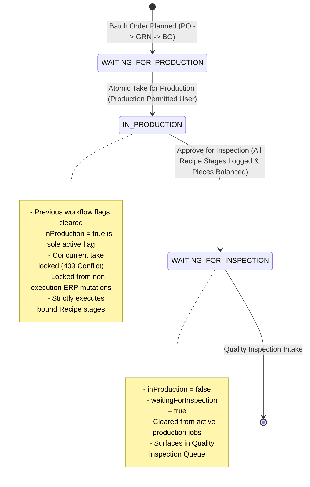
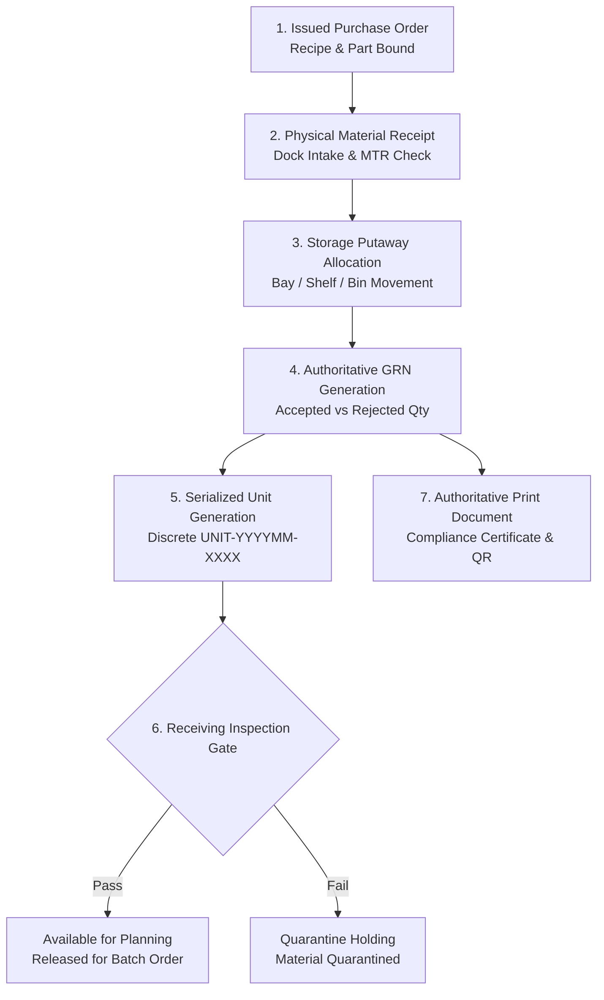
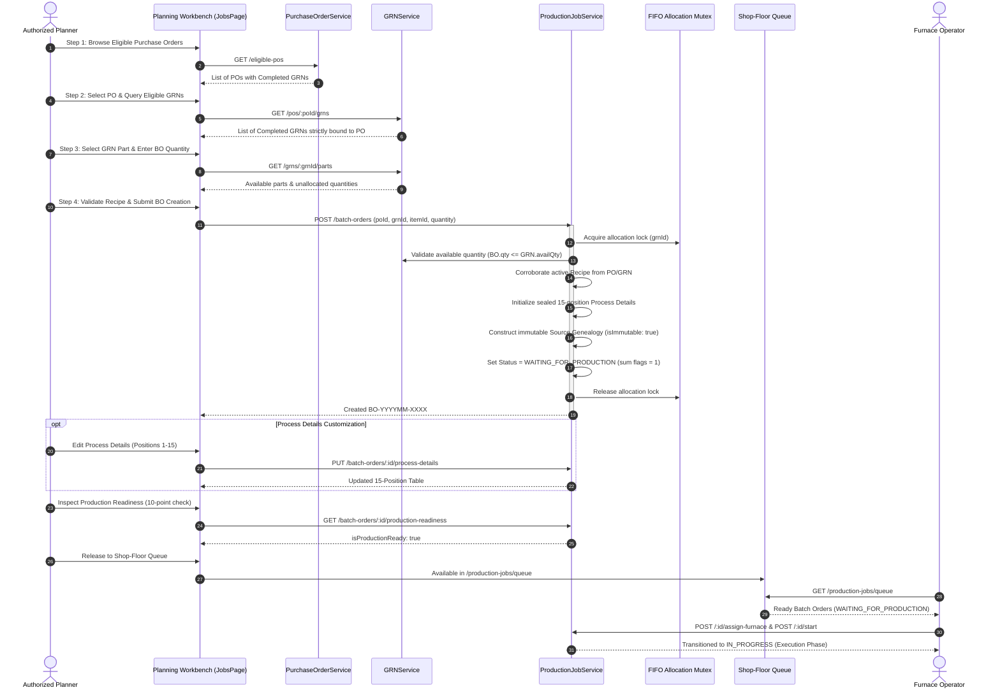

# 🚀 Astralis ERP — Complete Features & Architecture Catalog

> **Platform:** Astralis ERP (Advanced Thermal Processing, Precision Machining & Metallurgical Manufacturing)  
> **Tech Stack:** Node.js, Express, MongoDB (Mongoose 8), TypeScript, React 19, Redux Toolkit, React Router 7, Lucide Icons, Vanilla CSS (Apple HIG Design Tokens)  
> **Architecture:** Multi-Tenant Clean Layered Domain Architecture (`Route -> Controller -> Service -> Repository -> Model`) + Decoupled Domain Event Bus + Architecture Boundary Governance (`check:arch`)  
> **Authoritative Codebase Scope:** Entire ERP Repository (`c:\Users\Admin\Desktop\CelestiumERP`)

---

## 📑 Table of Contents

1. [Core Platform & Architecture Foundation](#1-core-platform--architecture-foundation)
   - 1.1 Multi-Tenant Isolation Engine
   - 1.2 Decoupled Domain Event Bus
   - 1.3 Immutable Audit Logging Subsystem
   - 1.4 Monotonic Sequential ID Generation
   - 1.5 Transparent Soft Delete Protocol
   - 1.6 Centralized Exception Hierarchy & Unified Response Envelope
   - 1.7 Enterprise Idempotency Middleware
   - 1.8 Async Background Task Queue & Resilience
   - 1.9 System Maintenance Lock Subsystem
   - 1.10 Database Connection & Resilience Subsystem
   - 1.11 Indexing Standards & Registry
   - 1.12 ACID Multi-Document Transactions
   - 1.13 Architecture Governance & Layer Boundary Enforcement (14 Rules)
   - 1.14 Security Stack, Middleware & Logging Infrastructure
   - 1.15 SRE Health, Liveness & Readiness Probes
2. [Core Platform Infrastructure Catalog](#2-core-platform-infrastructure-catalog)
3. [Domain Event Bus Registry (89 Typed Events)](#3-domain-event-bus-registry-89-typed-events)
4. [RBAC & Governance Permission Catalog (55 Granular Permissions)](#4-rbac--governance-permission-catalog-55-granular-permissions)
5. [Complete Backend Domain Modules Catalog (All 38 Modules)](#5-complete-backend-domain-modules-catalog-all-38-modules)
   - 5.1 Authentication (`auth`)
   - 5.2 Role-Based Access Control (`rbac`)
   - 5.3 Multi-Tenant Lifecycle (`tenant`)
   - 5.4 Customer Registry (`customer`)
   - 5.5 Item & Material Master (`item`)
   - 5.6 Recipe Master & Versioning (`recipe`)
   - 5.7 Specification Master (`specification`)
   - 5.8 Traceability & Heat Lots (`traceability`)
   - 5.9 Inventory & Stock Ledger (`inventory`)
   - 5.10 Warehouse & Storage Locations (`warehouse`)
   - 5.11 Quality Quarantine (`quarantine`)
   - 5.12 Finished Goods (`finished-goods`)
   - 5.13 Production Planning (`production-planning`)
   - 5.14 Material Requirements Planning (`material-requirements`)
   - 5.15 Furnace Capacity (`furnace-capacity`)
   - 5.16 Workforce Capacity (`workforce-capacity`)
   - 5.17 Constraint Analysis (`constraint-analysis`)
   - 5.18 Production Jobs & Batch Order Planning (`production-job`)
   - 5.19 Production Scheduling (`production-schedule`)
   - 5.20 Quality Inspection (`quality-inspection`)
   - 5.21 Metallurgical Lab (`metallurgical-lab`)
   - 5.22 Quality Planning (`quality-planning`)
   - 5.23 Non-Conformance & CAPA (`ncr-capa`)
   - 5.24 Quality Documentation & CoC (`quality-documentation`)
   - 5.25 Machinery Fleet (`machine`)
   - 5.26 Maintenance Management (`maintenance`)
   - 5.27 AMS 2750G Pyrometry (`pyrometry`)
   - 5.28 Workforce Attendance & Shifts (`attendance`)
   - 5.29 Dispatch Logistics (`dispatch`)
   - 5.30 Finance & General Ledger (`finance`)
   - 5.31 Manufacturing Job Costing (`costing`)
   - 5.32 Customer Billing & Invoicing (`billing`)
   - 5.33 Executive Reporting & Analytics (`reporting`)
   - 5.34 Notification Center (`notification`)
   - 5.35 Universal Global Search (`search`)
   - 5.36 Security Audit Trail (`audit`)
   - 5.37 Purchase Orders (`purchase-order`)
   - 5.38 Goods Receipt Notes & Material Receipts (`grn`)
6. [Frontend Architecture, Pages & Component Library](#6-frontend-architecture-pages--component-library)
   - 6.1 Application Shell & Navigation Layouts
   - 6.2 Frontend Route Matrix (16 Active Routes)
   - 6.3 Complete Page Workbenches (All 14 Pages)
   - 6.4 Apple HIG Design System Primitive Library (18 Components)
   - 6.5 Frontend State Management, RTK Base API & HTTP Client
   - 6.6 Apple HIG Design System Tokens & Aesthetics
7. [End-to-End Operational Domain Workflows](#7-end-to-end-operational-domain-workflows)
   - 7.1 Authoritative Production Phase Workflow (waiting for production -> in production -> waiting for inspection)
   - 7.2 Plan-to-Job Conversion & Constraint Feasibility Workflow
   - 7.3 Metallurgical Quality Inspection & CoC Generation Workflow
   - 7.4 Non-Conformance (NCR) & CAPA Verification Workflow
   - 7.5 Furnace Pyrometry (SAT/TUS) & Breakdown Maintenance Workflow
   - 7.6 Raw Material Heat-Lot Inwarding & Bi-Directional Genealogy Workflow
   - 7.7 Warehouse Storage, Quarantine Holding & Finished Goods Allocation Workflow
   - 7.8 Workforce Shift Roster, Punch Clock-In & Leave Workflow
   - 7.9 Outbound Dispatch & Gate Clearance Workflow
   - 7.10 Manufacturing Job Costing & Variance Analysis Workflow
   - 7.11 Customer Invoicing & Payment Reconciliation Workflow
   - 7.12 General Ledger Accounting & Financial Period Close Workflow
   - 7.13 Executive KPI & Shop-Floor Operational Reporting Workflow
   - 7.14 Universal Global Search & Quick Actions Workflow
   - 7.15 Authoritative Material Receipt, Storage Allocation & Serialized GRN Workflow
   - 7.16 Authoritative PO-to-GRN Batch Order Planning & Shop-Floor Handoff Workflow
8. [Operational Runbooks, SRE Documentation & Testing Infrastructure](#8-operational-runbooks-sre-documentation--testing-infrastructure)
   - 8.1 Database Seeding Engine (`backend/src/scripts/seed.ts`)
   - 8.2 Centralized Configuration Subsystem (`backend/src/config/`)
   - 8.3 Operational Runbooks & Technical Specifications (`docs/`)
   - 8.4 Automated Test Suite Matrix (64 Backend Specs + Frontend Suites)
     - *New:* `production-operator-workspace.spec.ts`

---

## 1. Core Platform & Architecture Foundation

### 1.1 Multi-Tenant Isolation Engine
- **Strict Collection Partitioning:** Every tenant-owned MongoDB collection is indexed by a mandatory `tenantId` field.
- **Tenant Context Middleware (`tenantMiddleware`):** Extracts tenant identity from HTTP header (`x-tenant-id`) and asserts equality against validated JWT claims (`req.user.tenantId`). Mismatches immediately throw a `403 Forbidden` (`CROSS_TENANT_ACCESS_DENIED`).
- **AsyncLocalStorage Context (`TenantContextHolder`):** Wraps incoming requests in an isolated Node.js `AsyncLocalStorage` context, providing ambient tenant context across asynchronous call chains without parameter leaking.
- **Base Repository Isolation (`BaseRepository<T>`):** Automatically injects `{ tenantId }` scope into all queries (`findById`, `findOne`, `findMany`, `count`), mutations (`create`, `updateById`, `updateMany`), and soft-deletes, guaranteeing zero cross-tenant query contamination.

### 1.2 Decoupled Domain Event Bus
- **In-Memory Type-Safe Event Bus (`DomainEventBus`):** Implements an asynchronous publish-subscribe event bus that decouples domain modules without external broker dependencies.
- **89 Strongly Typed Domain Events:** Covers all lifecycle transitions across Jobs, Quality, Pyrometry, Machines, Inventory, Warehouses, Workforce, Dispatch, Master Data, Costing, Finance, Purchase Orders, and GRNs.
- **Side-Effect Handlers (`registerCoreSubscribers`):** Offloads non-critical side effects (e.g. audit logging, cross-module notifications, finished-goods receipt triggers upon job completion) to keep primary HTTP responses fast and responsive.

### 1.3 Immutable Audit Logging Subsystem
- **Non-Blocking Silent Logger (`logSilently`):** Captures actor identity, action type, tenant context, timestamp, client IP, and entity details without impeding transactional execution.
- **Granular Change Diff Engine (`diff.engine.ts`):** Computes deep before-and-after property diffs (`calculateDiff`) for sensitive records to support aerospace (AMS 2750G) and automotive (CQI-9) compliance audits.
- **AuditLog Collection:** Permanently stores tamper-evident logs within tenant-partitioned MongoDB collections indexed by tenant, entity type, entity ID, and timestamp.

### 1.4 Monotonic Sequential ID Generation
- **Atomic Counter Engine (`CounterModel`, `getNextSequence`):** Utilizes MongoDB atomic `$inc` with upsert operations on a dedicated counters collection to generate monotonic, sequential numbers without race conditions under high concurrency.
- **Standardized Domain Prefixes:**
  - Purchase Order: `PO-YYYYMM-XXXX` (e.g., `PO-202609-0001`)
  - Goods Receipt Note: `GRN-YYYYMM-XXXX` (e.g., `GRN-202609-0001`)
  - Batch Order / Production Job: `BO-YYYYMM-XXXX` / `JOB-YYYYMM-XXXX` (e.g., `BO-202609-0001`, `JOB-202609-0001`)
  - Serialized Part Unit: `UNIT-YYYYMM-XXXX` (e.g., `UNIT-202609-0001`)
  - Heat Lot: `HEAT-YYYY-XXXX` (e.g., `HEAT-2026-0001`)
  - Furnace Asset: `FURN-XX` (e.g., `FURN-01`)
  - Quality Inspection: `QC-YYYYMM-XXXX`
  - CoC Certificate: `COC-YYYYMM-XXXX`
  - Non-Conformance Report: `NCR-YYYYMM-XXXX`
  - Corrective Action: `CAPA-YYYYMM-XXXX`
  - Dispatch Consignment: `DISP-YYYYMM-XXXX`
  - Customer Invoice: `INV-YYYYMM-XXXX`
  - Production Plan: `PLAN-YYYYMM-XXXX`

### 1.5 Transparent Soft Delete Protocol
- **Mongoose Soft-Delete Plugin (`softDeletePlugin`):** Transparently injects `{ isDeleted: false }` into all Mongoose `find`, `findOne`, `findOneAndUpdate`, `countDocuments`, and `aggregate` operations.
- **Audit Preservation:** Stores `deletedAt: Date` and `deletedBy: string` instead of physically deleting documents.
- **Entity Restoration:** Provides dedicated repository and controller restore methods (`restoreById`) to recover accidentally archived records.

### 1.6 Centralized Exception Hierarchy & Unified Response Envelope
- **Structured Error Hierarchy (`AppError`):**
  - `BadRequestError` (400)
  - `UnauthorizedError` (401)
  - `ForbiddenError` (403)
  - `NotFoundError` (404)
  - `ConflictError` (409)
  - `ValidationError` (422)
  - `TenantIsolationError` (403)
  - `IdempotencyConflictError` (409)
  - `InternalServerError` (500)
- **Unified API Response Standard (`ApiResponse`):** Standardizes all JSON HTTP responses across the platform:
  - `ApiResponse.success(res, data, message, statusCode)`
  - `ApiResponse.created(res, data, message)`
  - `ApiResponse.paginated(res, items, page, limit, total, message)`
  - `ApiResponse.noContent(res)`
  - `ApiResponse.error(res, message, statusCode, errors, code)`

### 1.7 Enterprise Idempotency Middleware
- **Duplicate Mutation Filter (`idempotencyMiddleware`):** Inspects `Idempotency-Key` headers on mutating requests (`POST`, `PUT`, `PATCH`).
- **In-Memory Mutex & Cache:** Stores request hashes and response envelopes. Duplicate requests with identical keys return the cached response immediately, preventing double work order creation, double billing, or accidental duplicate inventory deductions.

### 1.8 Async Background Task Queue & Resilience
- **In-Memory Job Queue (`AsyncQueueService`):** Executes intensive background operations such as report compilation, batch evaluations, and broadcast notifications.
- **Exponential Backoff & Dead-Letter Queue (DLQ):** Retries transient task failures with configurable backoff before moving failed jobs to an inspectable DLQ.

### 1.9 System Maintenance Lock Subsystem
- **Runtime Maintenance Lock (`MaintenanceLockManager`):** Allows administrators to engage maintenance mode during controlled migrations or upgrades, gracefully blocking incoming non-admin mutations with informative `503 Service Unavailable` responses.

### 1.10 Database Connection & Resilience Subsystem
- **Connection Lifecycle Manager (`DatabaseConnectionManager`):**
  - Pool Sizing: Configured between 5 and 20 connections per instance.
  - Timeout Protection: `serverSelectionTimeoutMS: 5000ms`.
  - Auto-Indexing: Automatically enabled in development/test (`autoIndex: true`) and disabled in production (`autoIndex: false`) to avoid collection locks on startup.
  - Driver Auto-Recovery: Handles network interruptions and gracefully reconnects.
  - Graceful Shutdown: Listens for `SIGINT` and `SIGTERM` to cleanly close MongoDB connection pools.

### 1.11 Indexing Standards & Registry
- **ESR Rule (Equality, Sort, Range):** All compound indexes strictly follow the ESR standard.
- **Index Registry (`IndexRegistry`):** Centralized utility that applies standard indexes:
  - Tenant Unique Index: `{ tenantId: 1, [field]: 1 }` with `{ unique: true }`
  - Status Filter Index: `{ tenantId: 1, status: 1, createdAt: -1 }`
  - Genealogy Index: `{ tenantId: 1, heatNumber: 1, lotNumber: 1 }`
  - Schedule Index: `{ tenantId: 1, furnaceId: 1, scheduledStartTime: 1, scheduledEndTime: 1 }`
  - Ephemeral TTL Index: `{ createdAt: 1 }` with expiration seconds.

### 1.12 ACID Multi-Document Transactions
- **Atomic Transaction Runner (`withTransaction`):** Coordinates complex operations across multiple collections inside atomic MongoDB sessions (e.g. Job completion + inventory finished goods receipt + CoC generation).

### 1.13 Architecture Governance & Layer Boundary Enforcement (14 Rules)
The platform enforces strict Layered Clean Architecture (`Route -> Controller -> Service -> Repository -> Model`) via `ArchitectureGuard` and automated tests (`npm run check:arch`):
1. **Rule 1: `DIRECT_PROCESS_ENV_PROHIBITED`** — Direct access to `process.env` is prohibited outside `src/config/` and `src/governance/`.
2. **Rule 2: `CONTROLLER_DIRECT_REPOSITORY_PROHIBITED`** — Controllers must never import Repositories directly.
3. **Rule 3: `CONTROLLER_DIRECT_MODEL_PROHIBITED`** — Controllers must never import Models or Mongoose directly.
4. **Rule 4: `ROUTE_DIRECT_SERVICE_PROHIBITED`** — Routes must never import Services directly; routes delegate strictly to Controllers.
5. **Rule 5: `ROUTE_DIRECT_REPOSITORY_PROHIBITED`** — Routes must never import Repositories directly.
6. **Rule 6: `ROUTE_DIRECT_MODEL_PROHIBITED`** — Routes must never import Models directly.
7. **Rule 7: `REPOSITORY_CALL_SERVICE_PROHIBITED`** — Repositories must never import Services (prohibits circular upward dependencies).
8. **Rule 8: `REPOSITORY_CALL_CONTROLLER_PROHIBITED`** — Repositories must never import Controllers.
9. **Rule 9: `REPOSITORY_EMIT_EVENTS_PROHIBITED`** — Repositories must never emit Domain Events directly; only Services emit events.
10. **Rule 10: `MODEL_IMPORT_SERVICE_PROHIBITED`** — Models must never import Services.
11. **Rule 11: `MODEL_IMPORT_REPOSITORY_PROHIBITED`** — Models must never import Repositories.
12. **Rule 12: `SERVICE_CALL_CONTROLLER_PROHIBITED`** — Services must never import Controllers.
13. **Rule 13: `SERVICE_EXPRESS_LEAKAGE_PROHIBITED`** — Services must never import or receive Express `Request`, `Response`, or `NextFunction` objects.
14. **Rule 14: `CROSS_DOMAIN_DIRECT_DATA_ACCESS_PROHIBITED`** — Domain A must never import Domain B's repository or model directly; cross-domain coordination must use Domain B's Service or Domain Event Bus.

### 1.14 Security Stack, Middleware & Logging Infrastructure
- **Helmet:** Sets secure HTTP response headers.
- **CORS Whitelist:** Validates origin headers against configured domains.
- **Compression:** Gzip compresses JSON payloads.
- **Rate Limiters:** `apiRateLimiter` (1000 req/15min) and `authRateLimiter` (20 req/15min).
- **Winston JSON Logger (`logger.ts`):** Emits structured JSON logs with automatic masking of sensitive keys (`password`, `token`, `secret`, `authorization`).
- **Zod Environment Validator (`env.config.ts`, `env.validator.ts`):** Validates all environment variables at startup, failing fast if required configuration keys are missing.
- **Async Handler HOC (`asyncHandler`):** Wraps express controller methods, capturing rejected promises and forwarding errors to the global error middleware.

### 1.15 SRE Health, Liveness & Readiness Probes
- `GET /api/v1/health` — Comprehensive service diagnostics: database connection state, round-trip ping latency, process uptime, and memory usage (RSS, Heap).
- `GET /api/v1/health/liveness` — Kubernetes liveness probe verifying process responsiveness.
- `GET /api/v1/health/readiness` — Kubernetes readiness probe verifying database readiness to receive traffic.

---

## 2. Core Platform Infrastructure Catalog

The core framework in `backend/src/core` provides foundational utilities and base classes across 18 subdirectories (33 files):

| Directory | File | Primary Exports | Functionality & Purpose |
|---|---|---|---|
| `constants` | `events.ts` | `DomainEvents`, `DomainEventName` | Central registry of 89 strongly typed domain event names across 11 categories. |
| `constants` | `permissions.ts` | `Permissions`, `PermissionKey`, `PERMISSION_CATALOG` | 55 granular permissions categorized by domain with Standard, Sensitive, and Critical tiers. |
| `constants` | `status.ts` | `JobStatus`, `QualityStatus`, `MachineStatus`, etc. | Authoritative enum definitions for all domain entity lifecycles. |
| `context` | `tenant-context.ts` | `TenantContext`, `TenantContextHolder` | `AsyncLocalStorage` context holder providing ambient tenant and user data. |
| `controllers` | `base.controller.ts` | `BaseController` | Base class for controllers with tenant extraction, user claims, pagination, and response helpers. |
| `database` | `connection.ts` | `DatabaseConnectionManager` | Mongoose connection lifecycle manager with retry loops, pooling, and graceful shutdown. |
| `database` | `health.ts` | `getDatabaseHealth`, `DatabaseHealth` | Evaluates live MongoDB connection health and ping latency. |
| `database` | `index-registry.ts` | `IndexRegistry` | Declarative index helper enforcing tenant-unique and ESR query optimization patterns. |
| `database` | `transaction.ts` | `withTransaction` | Executes multi-document operations inside managed MongoDB ACID sessions. |
| `errors` | `app-error.ts` | `AppError`, `BadRequestError`, `NotFoundError`, etc. | Complete structured HTTP exception hierarchy with error codes and status codes. |
| `events` | `domain-event-bus.ts` | `DomainEventBus` | In-memory pub/sub broker with typed event dispatching and listener management. |
| `events` | `subscribers.ts` | `registerCoreSubscribers` | Registers system-wide listeners for cross-domain side effects. |
| `governance` | `architecture-guard.ts` | `ArchitectureGuard`, `ArchitectureViolation` | AST and regex scanner enforcing 14 clean architecture layer rules in CI builds. |
| `maintenance` | `maintenance-lock.ts` | `MaintenanceLockManager` | Manages platform-wide maintenance locks to block non-administrative mutations. |
| `middleware` | `auth.middleware.ts` | `authenticateJwt`, `optionalAuth` | Validates Bearer JWT tokens and populates `req.user` claims. |
| `middleware` | `error.middleware.ts` | `errorMiddleware` | Centralized Express error handler normalizing exceptions into `ApiResponse.error`. |
| `middleware` | `idempotency.middleware.ts` | `idempotencyMiddleware` | Intercepts `Idempotency-Key` headers on mutations to prevent duplicate execution. |
| `middleware` | `rate-limiter.middleware.ts` | `apiRateLimiter`, `authRateLimiter` | Express rate-limiting middleware protecting against brute-force attacks and abuse. |
| `middleware` | `rbac.middleware.ts` | `requirePermission`, `requireRole` | Enforces RBAC permission and role authorizations on protected routes. |
| `middleware` | `tenant.middleware.ts` | `tenantMiddleware` | Asserts tenant boundaries by verifying `x-tenant-id` header against JWT claims. |
| `models` | `base.schema.ts` | `createBaseSchema` | Mongoose schema factory injecting `tenantId`, timestamps, soft delete, and ID transforms. |
| `models` | `counter.model.ts` | `CounterModel`, `getNextSequence` | Atomic monotonic sequential business identifier generator. |
| `plugins` | `soft-delete.plugin.ts` | `softDeletePlugin` | Global Mongoose plugin transparently injecting `{ isDeleted: false }` into queries. |
| `repository` | `base.repository.ts` | `BaseRepository<T>` | Abstract repository encapsulating tenant scoping for CRUD, pagination, and soft delete. |
| `responses` | `api-response.ts` | `ApiResponse` | Standard JSON response formatter (`success`, `created`, `paginated`, `error`). |
| `routes` | `base.router.ts` | `createBaseRouter` | Factory helper for configuring Express domain routers. |
| `services` | `audit-log.service.ts` | `AuditLogService` | Service managing tamper-evident audit logging and entity audit trail queries. |
| `services` | `base.service.ts` | `BaseService` | Base service class providing common logging and event emission capabilities. |
| `services` | `queue.service.ts` | `AsyncQueueService` | Background task queue with exponential backoff and dead-letter queue. |
| `types` | `common.types.ts` | `PaginatedResult`, `PaginationQuery`, `UserContext` | Core TypeScript interfaces and shared data types. |
| `utils` | `async-handler.ts` | `asyncHandler` | High-order controller wrapper forwarding rejected promises to error middleware. |
| `utils` | `crypto.utils.ts` | `hashPassword`, `comparePassword`, `generateToken` | Cryptographic helpers for bcrypt hashing and JWT token signing/verification. |
| `utils` | `diff.engine.ts` | `calculateDiff`, `DiffItem` | Deep property difference engine calculating before/after changes for audit logs. |
| `utils` | `logger.ts` | `logger` | Winston JSON logger with automated masking of sensitive attributes. |
| `validators` | `base.validator.ts` | `validateBody`, `validateQuery`, `validateParams` | Zod validation middleware for Express route inputs. |
| `validators` | `env.validator.ts` | `validateEnv`, `envSchema` | Zod schema validating environment variables at application bootstrap. |
| `validators` | `pagination.validator.ts` | `paginationQuerySchema` | Zod schema validating standard pagination and sorting parameters. |

---

## 3. Domain Event Bus Registry (91 Typed Events)

The in-memory `DomainEventBus` manages 91 strongly typed domain events across 11 business domains:

| Domain | Event Identifier | Emitted When | Typical Subscribed Side Effects |
|---|---|---|---|
| **Jobs** | `Job.Created` | New production job work order is drafted. | Audit logging, notification dispatch. |
| **Jobs** | `Job.InProduction` | Batch order atomically taken into production (`waiting_for_production` -> `in_production`). | Clears prior flags, establishes single active flag `inProduction = true`, locks from unrelated modifications. |
| **Jobs** | `Job.ApprovedForInspection` | Production execution completed and approved for inspection (`in_production` -> `waiting_for_inspection`). | Clears prior flags, activates `waitingForInspection = true`, surfaces BO in Quality Inspection queue. |
| **Jobs** | `Job.Scheduled` | Job assigned to furnace time slot. | Machine calendar update, operator notification. |
| **Jobs** | `Job.Started` | Furnace charge entry, heating cycle timer started. | Machine status `RUNNING`, live telemetry streaming. |
| **Jobs** | `Job.Paused` | Thermal cycle temporarily paused. | Machine status `IDLE`, downtime timer started. |
| **Jobs** | `Job.Resumed` | Processing resumed after hold. | Machine status `RUNNING`, downtime timer ended. |
| **Jobs** | `Job.DowntimeLogged` | Operator logs stoppage reason. | OEE metrics calculation, supervisor notification. |
| **Jobs** | `Job.Completed` | Thermal process completed, unloaded. | Quality inspection record auto-created, machine `IDLE`. |
| **Jobs** | `Job.Cancelled` | Job cancelled prior to completion. | Schedule released, inventory reservations released. |
| **Jobs** | `Job.DispatchStaged` | Job transferred to dispatch holding area. | Finished goods status updated to dispatchable. |
| **Quality** | `QualityInspection.Created` | Inspection record created for job or raw material. | Inspector assignment queue updated. |
| **Quality** | `QualityInspection.Started` | Inspector commences physical test execution. | Inspection status set to `IN_PROGRESS`. |
| **Quality** | `QualityInspection.MeasurementsRecorded` | Hardness survey or lab reading captured. | Traverse curve updated, target-vs-actual checked. |
| **Quality** | `QualityInspection.DefectLogged` | Discrepancy observed. | Defect Pareto updated. |
| **Quality** | `QualityInspection.Approved` | QA Manager signs off inspection. | CoC generated, job transitioned to `STORAGE`. |
| **Quality** | `QualityInspection.Rejected` | Quality inspection failed. | Automatic NCR generated, material quarantined. |
| **Quality** | `QualityInspection.ReinspectionRequested` | Inconclusive readings require repolish/retest. | Secondary inspection task queued. |
| **Quality** | `QualityInspection.NcrRaised` | Formal NCR created. | Containment alert dispatched, MRB review scheduled. |
| **Quality** | `QualityInspection.CapaUpdated` | Corrective/Preventive Action logged. | CAPA verification deadline tracked. |
| **Quality** | `QualityPlan.Approved` | Quality inspection plan revision approved. | Activated for new production runs. |
| **Quality** | `Quality.TestReportGenerated` | Lab test findings compiled. | Test report attached to job audit trail. |
| **Quality** | `Quality.CocIssued` | Certificate of Conformance approved and signed. | Finished goods released for dispatch. |
| **Quality** | `Quality.CocRevoked` | Certificate of Conformance voided. | Dispatches blocked, alert triggered. |
| **Machines** | `Machine.Registered` | New furnace, CNC, or quench tank commissioned. | Asset database updated. |
| **Machines** | `Machine.StatusChanged` | Operational state transitions (Idle, Running, Maint). | Command center status cards updated. |
| **Machines** | `Machine.BreakdownReported` | Unplanned equipment stoppage logged. | Machine status set to `BREAKDOWN`, maintenance alerted. |
| **Machines** | `Machine.BreakdownResolved` | Emergency repair completed. | Machine transitioned to `MAINTENANCE` for testing. |
| **Machines** | `Machine.CalibrationLogged` | Sensor calibration, TUS, or SAT recorded. | Pyrometry compliance window refreshed. |
| **Machines** | `Machine.MaintenanceTriggered` | PM schedule interval elapsed. | Maintenance work order spawned. |
| **Machines** | `Machine.MaintenanceCompleted` | Service completed, parts logged. | PM schedule timer reset, machine restored to `IDLE`. |
| **Machines** | `Maintenance.WorkOrderCreated` | Work order opened for repair or service. | Assigned technician notified. |
| **Machines** | `Maintenance.WorkOrderCompleted` | Maintenance technician signs off work order. | Asset downtime hours rolled into OEE. |
| **Machines** | `Maintenance.PreventivePlanCreated`| New PM schedule defined. | Calendar reminders configured. |
| **Inventory** | `Inventory.ItemCreated` | New item or SKU master record created. | Item catalog updated. |
| **Inventory** | `Inventory.GoodsReceived` | Inward delivery from supplier recorded. | Stock balance incremented, heat lot created. |
| **Inventory** | `Inventory.GoodsIssued` | Material issued to production job. | Stock balance decremented, WIP charged. |
| **Inventory** | `Inventory.StockAdjusted` | Supervisor manual stock adjustment logged. | Inventory ledger updated with variance. |
| **Inventory** | `Inventory.StockReserved` | Raw material reserved for planned job. | Available stock decremented, reserved incremented. |
| **Inventory** | `Inventory.StockReleased` | Reservation cancelled. | Available stock restored. |
| **Inventory** | `Inventory.HeatLotCreated` | New heat lot batch registered with MTR. | Inward QC inspection triggered. |
| **Inventory** | `Inventory.LowStockAlert` | Balance falls below safety reorder threshold. | Reorder notification sent to procurement. |
| **Creation Phase** | `PurchaseOrder.Created` | New Purchase Order drafted linking parts and recipes. | Audit logging, supplier tracking. |
| **Creation Phase** | `PurchaseOrder.Updated` | Purchase Order lines or quantities modified. | Recalculate fulfillment tolerances. |
| **Creation Phase** | `PurchaseOrder.Cancelled` | Open Purchase Order cancelled. | Release procurement commitments. |
| **Creation Phase** | `MaterialReceipt.Recorded` | Inward physical delivery recorded against PO. | Awaiting warehouse storage allocation. |
| **Creation Phase** | `MaterialReceipt.Stored` | Received materials put away in warehouse bin. | Stock ledger updated, ready for GRN. |
| **Creation Phase** | `GRN.Created` | Authoritative Goods Receipt Note created. | Serialized units generated, heat lot linked. |
| **Creation Phase** | `GRN.Printed` | Goods Receipt Note printed for physical records. | Compliance audit log updated. |
| **Creation Phase** | `GRN.UnitsReleasedForPlanning` | Serialized units cleared for batch planning. | Available for BO creation in Planning Workbench. |
| **Warehouse** | `Warehouse.PutawayCompleted` | Material placed in specific warehouse bin. | Location occupancy updated. |
| **Warehouse** | `Warehouse.MaterialQuarantined` | Material moved to quarantine storage bay. | Bin flagged as quarantine hold. |
| **Warehouse** | `Warehouse.MaterialReleased` | Material cleared by QA. | Transferred from quarantine to usable bin. |
| **Warehouse** | `Warehouse.FinishedGoodsReceived`| Completed job parts received in FG store. | Finished goods ledger incremented. |
| **Warehouse** | `Warehouse.FinishedGoodsReserved`| Parts reserved for scheduled customer dispatch. | FG reservation locked against shipping order. |
| **Workforce** | `Workforce.EmployeeCreated` | New operator or staff profile added. | Personnel directory updated. |
| **Workforce** | `Workforce.EmployeeDeactivated` | Employee offboarded or suspended. | System access revoked, schedules cleared. |
| **Workforce** | `Workforce.ShiftScheduled` | Operator assigned to shift roster. | Shift calendar updated. |
| **Workforce** | `Workforce.PunchRecorded` | Operator clocks in or out. | Attendance status computed (Present/Late). |
| **Workforce** | `Workforce.LeaveRequested` | Leave application submitted. | Supervisor approval queue updated. |
| **Workforce** | `Workforce.LeaveApproved` | Supervisor approves time off. | Shift roster updated, leave balance decremented. |
| **Workforce** | `Workforce.LeaveRejected` | Supervisor denies leave request. | Employee notified with reason. |
| **Workforce** | `Workforce.OvertimeRequested` | Overtime hours submitted. | Supervisor authorization queue updated. |
| **Workforce** | `Workforce.OvertimeApproved` | Overtime approved at multiplier rate. | Payroll cost accumulator updated. |
| **Workforce** | `Workforce.ShiftSwapped` | Peer shift swap approved. | Both operators' rosters swapped atomically. |
| **Workforce** | `Workforce.AttendanceCorrected`| Supervisor corrects missed punch. | Attendance record updated with audit justification. |
| **Dispatch** | `Dispatch.Created` | Outbound consignment order drafted. | Staging queue updated. |
| **Dispatch** | `Dispatch.QualityVerified` | Verification that all jobs have approved CoCs. | Gate clearance milestone 1 achieved. |
| **Dispatch** | `Dispatch.Scheduled` | Carrier, vehicle, and driver assigned. | Logistics schedule locked. |
| **Dispatch** | `Dispatch.Approved` | Plant manager authorizes departure. | Gate pass issued. |
| **Dispatch** | `Dispatch.Shipped` | Consignment departs factory premises. | Shipment status set to `IN_TRANSIT`. |
| **Dispatch** | `Dispatch.Delivered` | Customer receives goods, PoD uploaded. | Consignment `DELIVERED`, billing notified. |
| **Dispatch** | `Dispatch.Cancelled` | Consignment cancelled before departure. | Finished goods reservations released. |
| **Master Data**| `MasterData.RecipeApproved` | Thermal recipe revision approved. | Locked for production scheduling. |
| **Master Data**| `MasterData.SpecificationApproved`| Quality specification approved. | Linked to inspection criteria. |
| **Planning** | `Planning.ProductionPlanCreated` | Master production plan established. | MRP shortage calculation triggered. |
| **Planning** | `Planning.BatchOrderCreated` | Authoritative Batch Order derived from PO & GRN. | Queue placement in `WAITING_FOR_PRODUCTION`. |
| **Planning** | `Planning.MrpRunCompleted` | Material requirement calculations completed. | Shortage report generated. |
| **Costing** | `Costing.JobCostCalculated` | Material, labor, machine, energy calculated. | Job cost ledger populated. |
| **Costing** | `Costing.JobCostRecalculated` | Updated with final actuals upon completion. | Cost variance recorded. |
| **Costing** | `Costing.JobCostFrozen` | Job cost locked for historical archiving. | Sealed against future rate card changes. |
| **Costing** | `Costing.RateCardUpdated` | Machine-hour or labor rate revised. | Applied to future costing calculations. |
| **Finance** | `Finance.JournalPosted` | Balanced journal entry posted to GL. | Account balances updated. |
| **Finance** | `Finance.JournalReversed` | Journal entry reversed with offsetting entries.| Historical audit trail preserved. |
| **Finance** | `Finance.PeriodClosed` | Financial accounting period sealed. | Prior period postings blocked. |
| **Finance** | `Finance.PeriodReopened` | Period unsealed under supervisor approval. | Audit alert generated. |
| **Finance** | `Finance.InvoiceIssued` | Customer billing invoice generated. | Accounts receivable ledger incremented. |
| **Finance** | `Finance.InvoiceVoided` | Invoice cancelled. | Reversing journal posted. |
| **Finance** | `Finance.PaymentReceived` | Customer remittance recorded. | Receivables decremented, bank account credited. |
| **System** | `System.AuditLogged` | Audit entry recorded for compliance. | Real-time audit stream notified. |
| **System** | `System.AlertTriggered` | Critical operational anomaly detected. | Command center and push alerts triggered. |

---

## 4. RBAC & Governance Permission Catalog (55 Granular Permissions)

The platform enforces 55 granular permissions categorized across 13 functional domains with three sensitivity tiers:
- **Standard (37):** Routine shop-floor, planning, engineering, and administrative actions.
- **Sensitive (15):** High-impact actions (deletions, cancellations, quality sign-offs, gate releases, personnel deactivations).
- **Critical (3):** System-level administration, tenant management, and audit log access.

| Domain | Permission Key | Sensitivity | Purpose & Access Control Scope |
|---|---|---|---|
| **Jobs** | `JOB_VIEW` | Standard | View production jobs, recipes, schedules, and work order timelines. |
| **Jobs** | `JOB_CREATE` | Standard | Draft new production work orders and batches from approved plans. |
| **Jobs** | `JOB_UPDATE` | Standard | Update recipe targets, furnace allocations, and progress milestones. |
| **Jobs** | `JOB_DELETE` | Sensitive | Soft-delete or cancel draft work orders. |
| **Jobs** | `JOB_DISPATCH` | Sensitive | Authorize completed job transfer to dispatch holding. |
| **Planning / BO** | `BATCH_ORDER_CREATE` | Standard | Create authoritative Batch Orders derived from PO/GRN with recipe binding. |
| **Planning / BO** | `BATCH_ORDER_VIEW` | Standard | Inspect Batch Order source genealogy, 15-position process details, and readiness. |
| **Planning / BO** | `BATCH_ORDER_UPDATE` | Standard | Edit 15-position process details table while in `WAITING_FOR_PRODUCTION`. |
| **Creation Phase** | `PO_CREATE` | Standard | Create Purchase Orders linking parts and recipes (`purchase_order:order:create`). |
| **Creation Phase** | `PO_VIEW` | Standard | View Purchase Orders and receipt progress (`purchase_order:order:view`). |
| **Creation Phase** | `PO_UPDATE` | Standard | Update or cancel draft and open Purchase Orders (`purchase_order:order:update`). |
| **Creation Phase** | `STORAGE_RECORD` | Standard | Record received material intake and warehouse storage allocation (`inventory:storage:record`). |
| **Creation Phase** | `GRN_CREATE` | Standard | Create Goods Receipt Notes and generate individual part units (`inventory:grn:create`). |
| **Creation Phase** | `GRN_VIEW` | Standard | View Goods Receipt Notes and part unit genealogy (`inventory:grn:view`). |
| **Creation Phase** | `GRN_PRINT` | Standard | View and print authoritative Goods Receipt Notes (`inventory:grn:print`). |
| **Quality** | `QC_INSPECT` | Standard | Record hardness surveys, microhardness traverse, and microstructures. |
| **Quality** | `QC_ASSIGN` | Standard | Assign certified inspection personnel to inspection work orders. |
| **Quality** | `QC_APPROVE` | Sensitive | Authorize Certificates of Conformance (CoC) and release lots. |
| **Quality** | `QC_REJECT` | Sensitive | Reject non-conforming batches and trigger Non-Conformance Reports. |
| **Machines** | `MACHINE_VIEW` | Standard | Inspect machinery fleet status, working zones, and pyrometry telemetry. |
| **Machines** | `MACHINE_CREATE` | Standard | Register new furnaces, CNC equipment, and quench tanks. |
| **Machines** | `MACHINE_UPDATE` | Standard | Update machine technical parameters, zone dimensions, and capabilities. |
| **Machines** | `MACHINE_DELETE` | Standard | Decommission or archive obsolete factory machinery. |
| **Machines** | `MACHINE_MAINTAIN` | Standard | Log preventive maintenance, breakdown repairs, and sensor calibrations. |
| **Inventory** | `INVENTORY_VIEW` | Standard | View stock balances, heat lots, MTRs, and warehouse storage bins. |
| **Inventory** | `INVENTORY_UPDATE` | Standard | Record goods receipts, material issues, and bin transfers. |
| **Inventory** | `INVENTORY_MANAGE` | Standard | Perform supervisor manual stock adjustments and manage SKU master data. |
| **Employees** | `EMPLOYEE_VIEW` | Standard | View operator profiles, department allocations, and certified skills. |
| **Employees** | `EMPLOYEE_CREATE` | Standard | Register new employee profiles and operator accounts. |
| **Employees** | `EMPLOYEE_UPDATE` | Standard | Update contact information, department assignments, and work shifts. |
| **Employees** | `EMPLOYEE_DELETE` | Sensitive | Offboard and soft-delete an employee profile. |
| **Employees** | `EMPLOYEE_DEACTIVATE`| Sensitive | Temporarily suspend operator system access while preserving history. |
| **Employees** | `EMPLOYEE_REACTIVATE`| Sensitive | Re-enable system access for returning personnel. |
| **Employees** | `EMPLOYEE_ASSIGN` | Standard | Allocate operators to specific production cells and furnace bays. |
| **Employees** | `EMPLOYEE_MANAGE_SKILLS`| Sensitive | Certify specialized technical skills (e.g., Pyrometry, Vacuum Furnace). |
| **Attendance**| `ATTENDANCE_VIEW` | Standard | View shift rosters, clock-in/out records, leaves, and attendance calendars. |
| **Attendance**| `ATTENDANCE_MARK` | Standard | Record clock-in and clock-out timestamps for work shifts. |
| **Attendance**| `WORKFORCE_MANAGE` | Standard | Define plant shifts, approve leave applications, and authorize overtime. |
| **Dispatch** | `DISPATCH_VIEW` | Standard | View outbound consignments, shipping manifests, and delivery tracking. |
| **Dispatch** | `DISPATCH_CREATE` | Standard | Draft outbound shipment orders grouping finished jobs. |
| **Dispatch** | `DISPATCH_SCHEDULE` | Standard | Assign carrier details, vehicles, drivers, and delivery dates. |
| **Dispatch** | `DISPATCH_APPROVE` | Sensitive | Plant manager authorization for shipment gate departure. |
| **Dispatch** | `DISPATCH_MARK` | Standard | Update shipment milestones (Departed, In-Transit, Delivered with PoD). |
| **Dispatch** | `DISPATCH_CANCEL` | Sensitive | Cancel outbound dispatch and release finished goods back to storage. |
| **Reports** | `REPORTS_VIEW` | Standard | Access executive OEE dashboards, quality analytics, and throughput reports. |
| **Reports** | `REPORTS_MANAGE` | Standard | Configure automated recurring report generation and data exports. |
| **Customers** | `CUSTOMER_VIEW` | Standard | View customer directory, commercial terms, and contact profiles. |
| **Customers** | `CUSTOMER_CREATE` | Standard | Register new client companies and billing profiles. |
| **Customers** | `CUSTOMER_UPDATE` | Standard | Update customer billing terms, credit limits, and addresses. |
| **Customers** | `CUSTOMER_DELETE` | Standard | Archive or soft-delete customer profiles. |
| **Notifications**| `NOTIFICATIONS_VIEW`| Standard | View in-app notification center alerts and history. |
| **Notifications**| `NOTIFICATIONS_MANAGE`| Standard | Broadcast system alerts and manage notification preferences. |
| **Admin** | `SYSTEM_ADMIN` | Critical | Configure system infrastructure parameters and maintenance mode locks. |
| **Admin** | `TENANT_MANAGE` | Critical | Provision new tenant organizations and manage organizational lifecycles. |
| **Admin** | `AUDIT_VIEW` | Critical | Access and export immutable security audit logs with field diffs. |
| **Workflow** | `WORKFLOW_VIEW` | Standard | Inspect domain state-machine transition histories. |
| **Workflow** | `WORKFLOW_EXECUTE` | Standard | Trigger state transitions on jobs, quality inspections, and dispatches. |
| **Workflow** | `WORKFLOW_MANAGE` | Sensitive | Override or force state transitions under supervisor authorization. |

---

## 5. Complete Backend Domain Modules Catalog (All 38 Modules)

### 5.1 Authentication & Session Security (`modules/auth`)

> **Business Purpose:** Provides secure multi-tenant identity verification, bcrypt password hashing, dual JWT token rotation (access + refresh tokens), session revocation, and password recovery workflows.

#### Models & Schemas
- **`refresh-token.model.ts`** — Mongoose model: `RefreshToken`. Exported interfaces: ``. Encapsulates schema definitions, compound tenant indexes, and data validation rules.
- **`user.model.ts`** — Mongoose model: `User`. Exported interfaces: ``. Encapsulates schema definitions, compound tenant indexes, and data validation rules.

#### Repositories
- **`RefreshTokenRepository`** (`refresh-token.repository.ts`): Extends `BaseRepository<T>`. Encapsulates tenant-isolated database access routines:
  - Methods: `findByTokenHash()`, `revokeToken()`, `revokeFamily()`, `revokeAllForUser()`.
- **`UserRepository`** (`user.repository.ts`): Extends `BaseRepository<T>`. Encapsulates tenant-isolated database access routines:
  - Methods: `findByEmail()`, `findByUsername()`, `findByIdentifier()`, `findByResetToken()`, `updatePassword()`, `recordLoginSuccess()`, `recordFailedAttempt()`, `setResetToken()`, `clearResetToken()`.

#### Services
- **`AuthService`** (`auth.service.ts`): Encapsulates core business rules, transactional workflows, validation, and domain event publishing:
  - Methods: `register()`, `login()`, `refreshToken()`, `logout()`, `forgotPassword()`, `resetPassword()`, `getCurrentUser()`, `revokeAllSessions()`.

#### Controllers
- **`AuthController`** (`auth.controller.ts`): Extends `BaseController`. Handles HTTP request parsing, authentication verification, and response wrapping:

#### Validators (Zod Schemas)
- **`auth.validator.ts`**: Exported Zod validation schemas: .

#### API Endpoints & Routes
- `POST /api/v1/auth/register` — Handled by `AuthController`.
- `POST /api/v1/auth/login` — Handled by `AuthController`.
- `POST /api/v1/auth/refresh-token` — Handled by `AuthController`.
- `POST /api/v1/auth/refresh` — Handled by `AuthController`.
- `POST /api/v1/auth/forgot-password` — Handled by `AuthController`.
- `POST /api/v1/auth/reset-password` — Handled by `AuthController`.
- `GET /api/v1/auth/me` — Handled by `AuthController`.
- `POST /api/v1/auth/logout` — Handled by `AuthController`.
- `POST /api/v1/auth/revoke-all-sessions` — Handled by `AuthController`.

### 5.2 Role-Based Access Control (RBAC) & Governance (`modules/rbac`)

> **Business Purpose:** Manages fine-grained permission catalogs, role definitions, tenant-scoped user role bindings, and permission matrix queries.

#### Models & Schemas
- **`role.model.ts`** — Mongoose model: `Role`. Exported interfaces: ``. Encapsulates schema definitions, compound tenant indexes, and data validation rules.

#### Repositories
- **`RoleRepository`** (`role.repository.ts`): Extends `BaseRepository<T>`. Encapsulates tenant-isolated database access routines:
  - Methods: `findByCode()`, `findRolesByCodes()`, `seedDefaultRolesForTenant()`.

#### Services
- **`RbacService`** (`rbac.service.ts`): Encapsulates core business rules, transactional workflows, validation, and domain event publishing:
  - Methods: `getPermissionsCatalog()`, `getUserEffectivePermissions()`, `getRolesForTenant()`, `createRole()`, `updateRole()`, `assignRolesToUser()`.

#### Controllers
- **`RbacController`** (`rbac.controller.ts`): Extends `BaseController`. Handles HTTP request parsing, authentication verification, and response wrapping:

#### Validators (Zod Schemas)
- **`rbac.validator.ts`**: Exported Zod validation schemas: .

#### API Endpoints & Routes
- `GET /api/v1/rbac/permissions` — Handled by `RbacController`.
- `GET /api/v1/rbac/me/permissions` — Handled by `RbacController`.
- `GET /api/v1/rbac/roles` — Handled by `RbacController`.
- `POST /api/v1/rbac/roles` — Handled by `RbacController`.
- `PUT /api/v1/rbac/roles/:id` — Handled by `RbacController`.
- `POST /api/v1/rbac/users/:userId/roles` — Handled by `RbacController`.

### 5.3 Multi-Tenant Lifecycle & Organization Governance (`modules/tenant`)

> **Business Purpose:** Encapsulates tenant organization master data, status transitions (provisioning, active, suspended, archived), and system-wide isolation guarantees.

#### Models & Schemas
- **`tenant.model.ts`** — Mongoose model: `Tenant`. Exported interfaces: ``. Encapsulates schema definitions, compound tenant indexes, and data validation rules.

#### Repositories
- **`TenantRepository`** (`tenant.repository.ts`): Extends `BaseRepository<T>`. Encapsulates tenant-isolated database access routines:
  - Methods: `findById()`, `findByCode()`, `create()`, `update()`, `updateStatus()`, `findAll()`.

#### Services
- **`TenantService`** (`tenant.service.ts`): Encapsulates core business rules, transactional workflows, validation, and domain event publishing:
  - Methods: `provisionTenant()`, `getTenantByCode()`, `getTenantById()`, `suspendTenant()`, `activateTenant()`, `updateTenant()`, `getAllTenants()`.

#### Controllers
- _Internal domain service without direct HTTP controller endpoints._

#### Validators (Zod Schemas)
- _No dedicated request body validators required._

#### API Endpoints & Routes
_No direct HTTP routes mounted for this internal domain service._

### 5.4 Customer & Client Registry (`modules/customer`)

> **Business Purpose:** Maintains commercial customer profiles, credit limits, billing/shipping addresses, tax identifiers, and contact directories.

#### Models & Schemas
- **`customer.model.ts`** — Mongoose model: `Customer`. Exported interfaces: ``. Encapsulates schema definitions, compound tenant indexes, and data validation rules.

#### Repositories
- **`CustomerRepository`** (`customer.repository.ts`): Extends `BaseRepository<T>`. Encapsulates tenant-isolated database access routines:
  - Methods: `findByCode()`, `searchCustomers()`, `incrementJobCounters()`.

#### Services
- **`CustomerService`** (`customer.service.ts`): Encapsulates core business rules, transactional workflows, validation, and domain event publishing:
  - Methods: `createCustomer()`, `getCustomerById()`, `getCustomerByCode()`, `updateCustomer()`, `updateCustomerStatus()`, `archiveCustomer()`, `searchCustomers()`.

#### Controllers
- **`CustomerController`** (`customer.controller.ts`): Extends `BaseController`. Handles HTTP request parsing, authentication verification, and response wrapping:

#### Validators (Zod Schemas)
- **`customer.validator.ts`**: Exported Zod validation schemas: .

#### API Endpoints & Routes
- `GET /api/v1/customers` — Handled by `CustomerController`.
- `POST /api/v1/customers` — Handled by `CustomerController`.
- `GET /api/v1/customers/code/:code` — Handled by `CustomerController`.
- `GET /api/v1/customers/:id` — Handled by `CustomerController`.
- `PUT /api/v1/customers/:id` — Handled by `CustomerController`.
- `PATCH /api/v1/customers/:id/status` — Handled by `CustomerController`.
- `DELETE /api/v1/customers/:id` — Handled by `CustomerController`.

### 5.5 Item & Material Master Data (`modules/item`)

> **Business Purpose:** Defines master part records, customer drawing numbers, alloy grades, material classifications, and standard processing requirements.

#### Models & Schemas
- **`item.model.ts`** — Mongoose model: `Item`. Exported interfaces: ``. Encapsulates schema definitions, compound tenant indexes, and data validation rules.

#### Repositories
- **`ItemRepository`** (`item.repository.ts`): Extends `BaseRepository<T>`. Encapsulates tenant-isolated database access routines:
  - Methods: `findByCode()`, `searchItems()`, `updateStock()`, `incrementBatchCounters()`.

#### Services
- **`ItemService`** (`item.service.ts`): Encapsulates core business rules, transactional workflows, validation, and domain event publishing:
  - Methods: `createItem()`, `getItemById()`, `getItemByCode()`, `updateItem()`, `updateItemStatus()`, `archiveItem()`, `searchItems()`.

#### Controllers
- **`ItemController`** (`item.controller.ts`): Extends `BaseController`. Handles HTTP request parsing, authentication verification, and response wrapping:

#### Validators (Zod Schemas)
- **`item.validator.ts`**: Exported Zod validation schemas: .

#### API Endpoints & Routes
- `GET /api/v1/items` — Handled by `ItemController`.
- `POST /api/v1/items` — Handled by `ItemController`.
- `GET /api/v1/items/code/:code` — Handled by `ItemController`.
- `GET /api/v1/items/:id` — Handled by `ItemController`.
- `PUT /api/v1/items/:id` — Handled by `ItemController`.
- `PATCH /api/v1/items/:id/status` — Handled by `ItemController`.
- `DELETE /api/v1/items/:id` — Handled by `ItemController`.

### 5.6 Thermal Process Recipe Master & Versioning (`modules/recipe`)

> **Business Purpose:** Manages revision-controlled heat-treatment recipes including ramp rates, target temperatures, soak dwell times, carbon potential, quench media, and tempering stages.

#### Models & Schemas
- **`recipe.model.ts`** — Mongoose model: `Recipe`. Exported interfaces: ``. Encapsulates schema definitions, compound tenant indexes, and data validation rules.

#### Repositories
- **`RecipeRepository`** (`recipe.repository.ts`): Extends `BaseRepository<T>`. Encapsulates tenant-isolated database access routines:
  - Methods: `findByCodeAndRevision()`, `findLatestActiveRevision()`, `findHighestRevision()`, `searchRecipes()`, `supersedePreviousRevisions()`, `incrementJobCounters()`.

#### Services
- **`RecipeService`** (`recipe.service.ts`): Encapsulates core business rules, transactional workflows, validation, and domain event publishing:
  - Methods: `createRecipe()`, `getRecipeById()`, `getRecipeByCodeAndRevision()`, `getLatestActiveRecipe()`, `updateRecipe()`, `submitForApproval()`, `approveRecipe()`, `rejectRecipe()`, `createNewRevision()`, `retireRecipe()`, `searchRecipes()`.

#### Controllers
- **`RecipeController`** (`recipe.controller.ts`): Extends `BaseController`. Handles HTTP request parsing, authentication verification, and response wrapping:

#### Validators (Zod Schemas)
- **`recipe.validator.ts`**: Exported Zod validation schemas: .

#### API Endpoints & Routes
- `GET /api/v1/recipes` — Handled by `RecipeController`.
- `POST /api/v1/recipes` — Handled by `RecipeController`.
- `GET /api/v1/recipes/latest/:code` — Handled by `RecipeController`.
- `GET /api/v1/recipes/code/:code/revision/:revision` — Handled by `RecipeController`.
- `GET /api/v1/recipes/:id` — Handled by `RecipeController`.
- `PUT /api/v1/recipes/:id` — Handled by `RecipeController`.
- `POST /api/v1/recipes/:id/submit-approval` — Handled by `RecipeController`.
- `POST /api/v1/recipes/:id/approve` — Handled by `RecipeController`.
- `POST /api/v1/recipes/:id/reject` — Handled by `RecipeController`.
- `POST /api/v1/recipes/:id/new-revision` — Handled by `RecipeController`.
- `POST /api/v1/recipes/:id/retire` — Handled by `RecipeController`.

### 5.7 Metallurgical Specification Master & Standards (`modules/specification`)

> **Business Purpose:** Maintains revision-controlled customer and engineering specifications for surface hardness, core hardness, effective case depth (ECD), and microstructure limits.

#### Models & Schemas
- **`specification.model.ts`** — Mongoose model: `Specification`. Exported interfaces: ``. Encapsulates schema definitions, compound tenant indexes, and data validation rules.

#### Repositories
- **`SpecificationRepository`** (`specification.repository.ts`): Extends `BaseRepository<T>`. Encapsulates tenant-isolated database access routines:
  - Methods: `findByCodeAndRevision()`, `findLatestActiveRevision()`, `findHighestRevision()`, `searchSpecifications()`, `supersedePreviousRevisions()`, `incrementJobCounters()`.

#### Services
- **`SpecificationService`** (`specification.service.ts`): Encapsulates core business rules, transactional workflows, validation, and domain event publishing:
  - Methods: `createSpecification()`, `getSpecificationById()`, `getSpecificationByCodeAndRevision()`, `getLatestActiveSpecification()`, `updateSpecification()`, `submitForApproval()`, `approveSpecification()`, `rejectSpecification()`, `createNewRevision()`, `retireSpecification()`, `searchSpecifications()`.

#### Controllers
- **`SpecificationController`** (`specification.controller.ts`): Extends `BaseController`. Handles HTTP request parsing, authentication verification, and response wrapping:

#### Validators (Zod Schemas)
- **`specification.validator.ts`**: Exported Zod validation schemas: .

#### API Endpoints & Routes
- `GET /api/v1/specifications` — Handled by `SpecificationController`.
- `POST /api/v1/specifications` — Handled by `SpecificationController`.
- `GET /api/v1/specifications/latest/:code` — Handled by `SpecificationController`.
- `GET /api/v1/specifications/code/:code/revision/:revision` — Handled by `SpecificationController`.
- `GET /api/v1/specifications/:id` — Handled by `SpecificationController`.
- `PUT /api/v1/specifications/:id` — Handled by `SpecificationController`.
- `POST /api/v1/specifications/:id/submit-approval` — Handled by `SpecificationController`.
- `POST /api/v1/specifications/:id/approve` — Handled by `SpecificationController`.
- `POST /api/v1/specifications/:id/reject` — Handled by `SpecificationController`.
- `POST /api/v1/specifications/:id/new-revision` — Handled by `SpecificationController`.
- `POST /api/v1/specifications/:id/retire` — Handled by `SpecificationController`.

### 5.8 Metallurgical Heat-Lot Traceability & Lineage (`modules/traceability`)

> **Business Purpose:** Enforces complete bi-directional traceability linking raw material heat lots, Mill Test Certificates (MTR), chemistry records, inward inspection, job consumption, and customer shipments.

#### Models & Schemas
- **`heat-lot.model.ts`** — Mongoose model: `HeatLot`. Exported interfaces: ``. Encapsulates schema definitions, compound tenant indexes, and data validation rules.

#### Repositories
- **`HeatLotRepository`** (`heat-lot.repository.ts`): Extends `BaseRepository<T>`. Encapsulates tenant-isolated database access routines:
  - Methods: `findByHeatLotNumber()`, `findBySupplierHeatNumber()`, `findByJobCardNumber()`, `findChildLots()`, `searchHeatLots()`, `generateNextHeatLotNumber()`.

#### Services
- **`HeatLotService`** (`heat-lot.service.ts`): Encapsulates core business rules, transactional workflows, validation, and domain event publishing:
  - Methods: `inwardHeatLot()`, `getHeatLotById()`, `getHeatLotByNumber()`, `quarantineHeatLot()`, `releaseHeatLot()`, `allocateHeatLot()`, `consumeHeatLot()`, `forwardTrace()`, `backwardTrace()`, `searchHeatLots()`.

#### Controllers
- **`HeatLotController`** (`heat-lot.controller.ts`): Extends `BaseController`. Handles HTTP request parsing, authentication verification, and response wrapping:

#### Validators (Zod Schemas)
- **`heat-lot.validator.ts`**: Exported Zod validation schemas: .

#### API Endpoints & Routes
- `GET /api/v1/heat-lots` — Handled by `HeatLotController`.
- `POST /api/v1/heat-lots` — Handled by `HeatLotController`.
- `POST /api/v1/heat-lots/inward` — Handled by `HeatLotController`.
- `GET /api/v1/heat-lots/backward-trace` — Handled by `HeatLotController`.
- `GET /api/v1/heat-lots/forward-trace/:number` — Handled by `HeatLotController`.
- `GET /api/v1/heat-lots/number/:number` — Handled by `HeatLotController`.
- `GET /api/v1/heat-lots/:id` — Handled by `HeatLotController`.
- `PATCH /api/v1/heat-lots/:id/quarantine` — Handled by `HeatLotController`.
- `PATCH /api/v1/heat-lots/:id/release` — Handled by `HeatLotController`.
- `POST /api/v1/heat-lots/:id/allocate` — Handled by `HeatLotController`.
- `POST /api/v1/heat-lots/:id/consume` — Handled by `HeatLotController`.

### 5.9 Raw Materials, Consumables & Stock Ledger (`modules/inventory`)

> **Business Purpose:** Tracks stock balances, goods receipts, goods issues to production jobs, supervisor stock adjustments, inter-location transfers, and work-order reservations.

#### Models & Schemas
- **`inventory-balance.model.ts`** — Mongoose model: `InventoryBalance`. Exported interfaces: ``. Encapsulates schema definitions, compound tenant indexes, and data validation rules.
- **`inventory-transaction.model.ts`** — Mongoose model: ``. Exported interfaces: ``. Encapsulates schema definitions, compound tenant indexes, and data validation rules.

#### Repositories
- **`InventoryRepository`** (`inventory.repository.ts`): Extends `BaseRepository<T>`. Encapsulates tenant-isolated database access routines:
  - Methods: `getBalance()`, `findOrCreateBalance()`, `updateBalance()`, `searchBalances()`, `recordTransaction()`, `searchTransactions()`, `generateTransactionNumber()`.

#### Services
- **`InventoryService`** (`inventory.service.ts`): Encapsulates core business rules, transactional workflows, validation, and domain event publishing:
  - Methods: `recordGoodsReceipt()`, `recordGoodsIssue()`, `recordStockAdjustment()`, `recordInternalTransfer()`, `reserveStock()`, `releaseReservation()`, `getBalance()`, `searchBalances()`, `searchTransactions()`.

#### Controllers
- **`InventoryController`** (`inventory.controller.ts`): Extends `BaseController`. Handles HTTP request parsing, authentication verification, and response wrapping:

#### Validators (Zod Schemas)
- **`inventory.validator.ts`**: Exported Zod validation schemas: .

#### API Endpoints & Routes
- `GET /api/v1/inventory/balances` — Handled by `InventoryController`.
- `GET /api/v1/inventory/transactions` — Handled by `InventoryController`.
- `POST /api/v1/inventory/goods-receipt` — Handled by `InventoryController`.
- `POST /api/v1/inventory/goods-issue` — Handled by `InventoryController`.
- `POST /api/v1/inventory/adjustments` — Handled by `InventoryController`.
- `POST /api/v1/inventory/transfers` — Handled by `InventoryController`.
- `POST /api/v1/inventory/reservations` — Handled by `InventoryController`.
- `POST /api/v1/inventory/reservations/release` — Handled by `InventoryController`.

### 5.10 Warehouse Locations & Topology Management (`modules/warehouse`)

> **Business Purpose:** Models physical factory storage topology including warehouse bays, aisles, racks, and bins with capacity and occupancy tracking.

#### Models & Schemas
- **`storage-location.model.ts`** — Mongoose model: ``. Exported interfaces: ``. Encapsulates schema definitions, compound tenant indexes, and data validation rules.
- **`warehouse.model.ts`** — Mongoose model: `Warehouse`. Exported interfaces: ``. Encapsulates schema definitions, compound tenant indexes, and data validation rules.

#### Repositories
- **`WarehouseRepository`** (`warehouse.repository.ts`): Extends `BaseRepository<T>`. Encapsulates tenant-isolated database access routines:
  - Methods: `createWarehouse()`, `findWarehouseById()`, `findWarehouseByCode()`, `updateWarehouse()`, `searchWarehouses()`, `createLocation()`, `findLocationById()`, `findLocationByCode()`, `updateLocation()`, `searchLocations()`, `findLocationsByWarehouse()`.

#### Services
- **`WarehouseService`** (`warehouse.service.ts`): Encapsulates core business rules, transactional workflows, validation, and domain event publishing:
  - Methods: `createWarehouse()`, `getWarehouseById()`, `updateWarehouse()`, `searchWarehouses()`, `createStorageLocation()`, `getLocationById()`, `getLocationByCode()`, `validateLocationForStockMovement()`, `updateStorageLocation()`, `searchLocations()`, `getLocationsByWarehouse()`.

#### Controllers
- **`WarehouseController`** (`warehouse.controller.ts`): Extends `BaseController`. Handles HTTP request parsing, authentication verification, and response wrapping:

#### Validators (Zod Schemas)
- **`warehouse.validator.ts`**: Exported Zod validation schemas: .

#### API Endpoints & Routes
- `GET /api/v1/warehouses` — Handled by `WarehouseController`.
- `POST /api/v1/warehouses` — Handled by `WarehouseController`.
- `GET /api/v1/warehouses/locations` — Handled by `WarehouseController`.
- `POST /api/v1/warehouses/locations` — Handled by `WarehouseController`.
- `GET /api/v1/warehouses/locations/code/:code` — Handled by `WarehouseController`.
- `GET /api/v1/warehouses/locations/:id` — Handled by `WarehouseController`.
- `PATCH /api/v1/warehouses/locations/:id` — Handled by `WarehouseController`.
- `GET /api/v1/warehouses/:warehouseId/locations` — Handled by `WarehouseController`.
- `GET /api/v1/warehouses/:id` — Handled by `WarehouseController`.
- `PATCH /api/v1/warehouses/:id` — Handled by `WarehouseController`.

### 5.11 Quality Quarantine & Material Isolation (`modules/quarantine`)

> **Business Purpose:** Quarantines suspicious or non-conforming materials, tracking quarantine records, root causes, supervisor dispositions, and authorized release gates.

#### Models & Schemas
- **`quarantine.model.ts`** — Mongoose model: ``. Exported interfaces: ``. Encapsulates schema definitions, compound tenant indexes, and data validation rules.

#### Repositories
- **`QuarantineRepository`** (`quarantine.repository.ts`): Extends `BaseRepository<T>`. Encapsulates tenant-isolated database access routines:
  - Methods: `createQuarantine()`, `findQuarantineById()`, `findQuarantineByNumber()`, `findActiveQuarantineForTarget()`, `findActiveQuarantinesByItem()`, `updateQuarantine()`, `searchQuarantines()`, `generateQuarantineNumber()`.

#### Services
- **`QuarantineService`** (`quarantine.service.ts`): Encapsulates core business rules, transactional workflows, validation, and domain event publishing:
  - Methods: `placeInQuarantine()`, `releaseFromQuarantine()`, `dispositionQuarantine()`, `isTargetQuarantined()`, `getQuarantineById()`, `getQuarantineByNumber()`, `searchQuarantines()`.

#### Controllers
- **`QuarantineController`** (`quarantine.controller.ts`): Extends `BaseController`. Handles HTTP request parsing, authentication verification, and response wrapping:

#### Validators (Zod Schemas)
- **`quarantine.validator.ts`**: Exported Zod validation schemas: .

#### API Endpoints & Routes
- `GET /api/v1/quarantine` — Handled by `QuarantineController`.
- `POST /api/v1/quarantine` — Handled by `QuarantineController`.
- `GET /api/v1/quarantine/number/:number` — Handled by `QuarantineController`.
- `GET /api/v1/quarantine/:id` — Handled by `QuarantineController`.
- `POST /api/v1/quarantine/:id/release` — Handled by `QuarantineController`.
- `POST /api/v1/quarantine/:id/disposition` — Handled by `QuarantineController`.

### 5.12 Finished Goods Inventory & Dispatch Staging (`modules/finished-goods`)

> **Business Purpose:** Tracks QA-cleared finished goods received from production jobs, warehouse bin locations, dispatch reservations, and physical shipment releases.

#### Models & Schemas
- **`finished-goods.model.ts`** — Mongoose model: `FinishedGoods`. Exported interfaces: ``. Encapsulates schema definitions, compound tenant indexes, and data validation rules.

#### Repositories
- **`FinishedGoodsRepository`** (`finished-goods.repository.ts`): Extends `BaseRepository<T>`. Encapsulates tenant-isolated database access routines:
  - Methods: `create()`, `findById()`, `findByLotNumber()`, `findByJobCardNumber()`, `update()`, `search()`, `generateFgLotNumber()`.

#### Services
- **`FinishedGoodsService`** (`finished-goods.service.ts`): Encapsulates core business rules, transactional workflows, validation, and domain event publishing:
  - Methods: `inwardFinishedGoods()`, `releaseFinishedGoods()`, `reserveForDispatch()`, `releaseDispatchReservation()`, `moveLocation()`, `getById()`, `getByLotNumber()`, `search()`.

#### Controllers
- **`FinishedGoodsController`** (`finished-goods.controller.ts`): Extends `BaseController`. Handles HTTP request parsing, authentication verification, and response wrapping:

#### Validators (Zod Schemas)
- **`finished-goods.validator.ts`**: Exported Zod validation schemas: .

#### API Endpoints & Routes
- `GET /api/v1/finished-goods` — Handled by `FinishedGoodsController`.
- `POST /api/v1/finished-goods/inward` — Handled by `FinishedGoodsController`.
- `GET /api/v1/finished-goods/lot/:lotNumber` — Handled by `FinishedGoodsController`.
- `GET /api/v1/finished-goods/:id` — Handled by `FinishedGoodsController`.
- `POST /api/v1/finished-goods/:id/release` — Handled by `FinishedGoodsController`.
- `POST /api/v1/finished-goods/:id/reserve` — Handled by `FinishedGoodsController`.
- `POST /api/v1/finished-goods/:id/reserve/release` — Handled by `FinishedGoodsController`.
- `PATCH /api/v1/finished-goods/:id/location` — Handled by `FinishedGoodsController`.

### 5.13 Master Production Planning & Scheduling (`modules/production-planning`)

> **Business Purpose:** Creates and coordinates production plans, target quantities, planned dates, priority scheduling, and plan recalculation against factory constraints.

#### Models & Schemas
- **`production-plan.model.ts`** — Mongoose model: `ProductionPlan`. Exported interfaces: ``. Encapsulates schema definitions, compound tenant indexes, and data validation rules.

#### Repositories
- **`ProductionPlanRepository`** (`production-plan.repository.ts`): Extends `BaseRepository<T>`. Encapsulates tenant-isolated database access routines:
  - Methods: `generateNextPlanNumber()`, `findByPlanNumber()`, `findActivePlansByItem()`, `queryPlans()`.

#### Services
- **`ProductionPlanService`** (`production-plan.service.ts`): Encapsulates core business rules, transactional workflows, validation, and domain event publishing:
  - Methods: `createPlan()`, `getPlanById()`, `getPlanByNumber()`, `queryPlans()`, `updatePlan()`, `updatePlanStatus()`, `recalculatePlan()`.

#### Controllers
- **`ProductionPlanController`** (`production-plan.controller.ts`): Extends `BaseController`. Handles HTTP request parsing, authentication verification, and response wrapping:

#### Validators (Zod Schemas)
- **`production-plan.validator.ts`**: Exported Zod validation schemas: .

#### API Endpoints & Routes
- `GET /api/v1/production-plans` — Handled by `ProductionPlanController`.
- `POST /api/v1/production-plans` — Handled by `ProductionPlanController`.
- `GET /api/v1/production-plans/number/:planNumber` — Handled by `ProductionPlanController`.
- `GET /api/v1/production-plans/:id` — Handled by `ProductionPlanController`.
- `PUT /api/v1/production-plans/:id` — Handled by `ProductionPlanController`.
- `PATCH /api/v1/production-plans/:id/status` — Handled by `ProductionPlanController`.
- `POST /api/v1/production-plans/:id/recalculate` — Handled by `ProductionPlanController`.

### 5.14 Material Requirements Planning (MRP) & Shortages (`modules/material-requirements`)

> **Business Purpose:** Analyzes material demand against active production plans, detects raw material shortages, and manages material reservations against inventory.

#### Models & Schemas
- **`material-reservation.model.ts`** — Mongoose model: `MaterialReservation`. Exported interfaces: ``. Encapsulates schema definitions, compound tenant indexes, and data validation rules.

#### Repositories
- **`MaterialRequirementsRepository`** (`material-requirements.repository.ts`): Extends `BaseRepository<T>`. Encapsulates tenant-isolated database access routines:
  - Methods: `generateNextReservationNumber()`, `findReservationByNumber()`, `findActiveReservationsByPlan()`, `findActiveReservationsByTarget()`, `findReservationsByItem()`.

#### Services
- **`MaterialRequirementsService`** (`material-requirements.service.ts`): Encapsulates core business rules, transactional workflows, validation, and domain event publishing:
  - Methods: `calculateRequirements()`, `getShortages()`, `reserveMaterial()`, `releaseReservation()`, `releaseAllReservationsForPlan()`, `getReservationsByPlan()`.

#### Controllers
- **`MaterialRequirementsController`** (`material-requirements.controller.ts`): Extends `BaseController`. Handles HTTP request parsing, authentication verification, and response wrapping:

#### Validators (Zod Schemas)
- **`material-requirements.validator.ts`**: Exported Zod validation schemas: .

#### API Endpoints & Routes
- `POST /api/v1/material-requirements/calculate` — Handled by `MaterialRequirementsController`.
- `GET /api/v1/material-requirements/shortages` — Handled by `MaterialRequirementsController`.
- `POST /api/v1/material-requirements/reserve` — Handled by `MaterialRequirementsController`.
- `POST /api/v1/material-requirements/reservations/:id/release` — Handled by `MaterialRequirementsController`.
- `GET /api/v1/material-requirements/reservations/plan/:planId` — Handled by `MaterialRequirementsController`.

### 5.15 Furnace Asset Registry & Capacity Allocation (`modules/furnace-capacity`)

> **Business Purpose:** Manages furnace profiles, working zone dimensions, temperature limits, atmospheric controls, process capability matching, and time-slot capacity bookings.

#### Models & Schemas
- **`furnace-allocation.model.ts`** — Mongoose model: `FurnaceAllocation`. Exported interfaces: ``. Encapsulates schema definitions, compound tenant indexes, and data validation rules.
- **`furnace.model.ts`** — Mongoose model: `Furnace`. Exported interfaces: ``. Encapsulates schema definitions, compound tenant indexes, and data validation rules.

#### Repositories
- **`FurnaceAllocationRepository`** (`furnace-capacity.repository.ts`): Extends `BaseRepository<T>`. Encapsulates tenant-isolated database access routines:
  - Methods: `findFurnaceByCode()`, `findFurnaceById()`, `findFurnaces()`, `createFurnace()`, `updateFurnace()`, `generateNextAllocationNumber()`, `findOverlappingAllocations()`, `findAllocationsInPeriod()`, `createAllocation()`, `findAllocationById()`, `updateAllocation()`.

#### Services
- **`FurnaceCapacityService`** (`furnace-capacity.service.ts`): Encapsulates core business rules, transactional workflows, validation, and domain event publishing:
  - Methods: `createFurnace()`, `getFurnaces()`, `getFurnaceById()`, `checkCompatibility()`, `bookCapacity()`, `releaseAllocation()`, `getUtilization()`.

#### Controllers
- **`FurnaceCapacityController`** (`furnace-capacity.controller.ts`): Extends `BaseController`. Handles HTTP request parsing, authentication verification, and response wrapping:

#### Validators (Zod Schemas)
- **`furnace-capacity.validator.ts`**: Exported Zod validation schemas: .

#### API Endpoints & Routes
- `GET /api/v1/furnace-capacity` — Handled by `FurnaceCapacityController`.
- `POST /api/v1/furnace-capacity` — Handled by `FurnaceCapacityController`.
- `GET /api/v1/furnace-capacity/:id` — Handled by `FurnaceCapacityController`.
- `POST /api/v1/furnace-capacity/check-compatibility` — Handled by `FurnaceCapacityController`.
- `GET /api/v1/furnace-capacity/utilization` — Handled by `FurnaceCapacityController`.
- `POST /api/v1/furnace-capacity/book` — Handled by `FurnaceCapacityController`.
- `DELETE /api/v1/furnace-capacity/allocations/:id` — Handled by `FurnaceCapacityController`.

### 5.16 Workforce Operator Skills & Shift Allocation (`modules/workforce-capacity`)

> **Business Purpose:** Tracks operator skills (pyrometry, vacuum furnace operation, metallurgical testing), evaluates shift skill coverage, and books operator allocations.

#### Models & Schemas
- **`workforce-member.model.ts`** — Mongoose model: `WorkforceMember`. Exported interfaces: ``. Encapsulates schema definitions, compound tenant indexes, and data validation rules.
- **`workforce-shift-allocation.model.ts`** — Mongoose model: ``. Exported interfaces: ``. Encapsulates schema definitions, compound tenant indexes, and data validation rules.

#### Repositories
- **`WorkforceShiftAllocationRepository`** (`workforce-capacity.repository.ts`): Extends `BaseRepository<T>`. Encapsulates tenant-isolated database access routines:
  - Methods: `findEmployeeByCode()`, `findEmployeeById()`, `findEmployees()`, `createEmployee()`, `updateEmployee()`, `generateNextAllocationNumber()`, `findEmployeeAllocationsOnDate()`, `findAllocationsForShift()`, `createAllocation()`, `findAllocationById()`, `updateAllocation()`.

#### Services
- **`WorkforceCapacityService`** (`workforce-capacity.service.ts`): Encapsulates core business rules, transactional workflows, validation, and domain event publishing:
  - Methods: `createEmployee()`, `addOrUpdateSkill()`, `getEmployees()`, `getEmployeeById()`, `evaluateCoverage()`, `assignOperator()`, `releaseAssignment()`, `getShiftCapacity()`.

#### Controllers
- **`WorkforceCapacityController`** (`workforce-capacity.controller.ts`): Extends `BaseController`. Handles HTTP request parsing, authentication verification, and response wrapping:

#### Validators (Zod Schemas)
- **`workforce-capacity.validator.ts`**: Exported Zod validation schemas: .

#### API Endpoints & Routes
- `GET /api/v1/workforce-capacity` — Handled by `WorkforceCapacityController`.
- `POST /api/v1/workforce-capacity` — Handled by `WorkforceCapacityController`.
- `GET /api/v1/workforce-capacity/:id` — Handled by `WorkforceCapacityController`.
- `POST /api/v1/workforce-capacity/:id/skills` — Handled by `WorkforceCapacityController`.
- `POST /api/v1/workforce-capacity/evaluate-coverage` — Handled by `WorkforceCapacityController`.
- `GET /api/v1/workforce-capacity/shift-capacity` — Handled by `WorkforceCapacityController`.
- `POST /api/v1/workforce-capacity/assign` — Handled by `WorkforceCapacityController`.
- `DELETE /api/v1/workforce-capacity/allocations/:id` — Handled by `WorkforceCapacityController`.

### 5.17 Factory Constraint & Bottleneck Analysis (`modules/constraint-analysis`)

> **Business Purpose:** Performs multidimensional feasibility audits across furnace capacity, operator skill availability, and material stock to identify production bottlenecks.

#### Models & Schemas
- _No dedicated Mongoose collection; acts as a pure calculation, aggregation, or analytical engine._

#### Repositories
- _No standalone repository; coordinates across related domain services._

#### Services
- **`ConstraintAnalysisService`** (`constraint-analysis.service.ts`): Encapsulates core business rules, transactional workflows, validation, and domain event publishing:
  - Methods: `evaluatePlanConstraints()`, `factoryAudit()`.

#### Controllers
- **`ConstraintAnalysisController`** (`constraint-analysis.controller.ts`): Extends `BaseController`. Handles HTTP request parsing, authentication verification, and response wrapping:

#### Validators (Zod Schemas)
- **`constraint-analysis.validator.ts`**: Exported Zod validation schemas: .

#### API Endpoints & Routes
- `POST /api/v1/constraint-analysis/evaluate-plan/:planId` — Handled by `ConstraintAnalysisController`.
- `GET /api/v1/constraint-analysis/factory-audit` — Handled by `ConstraintAnalysisController`.
- `GET /api/v1/constraint-analysis/bottlenecks` — Handled by `ConstraintAnalysisController`.

### 5.18 Production Jobs & Batch Order Planning (`modules/production-job`)

> **Business Purpose:** Encapsulates the complete manufacturing lifecycle across two interconnected authoritative operational stages:
> 1. **Authoritative Planning Phase (Batch Order Derivation):** Planners derive Batch Orders (`BO-YYYYMM-XXXX`) strictly from completed Purchase Orders and Goods Receipt Notes (`PO -> GRN -> Part -> BO`), inheriting validated Item and Recipe parameters. Generates an authoritative 15-position Process Details table seeded from the recipe, enforces immutable source genealogy (`isImmutable: true`), locks inventory allocation under an enterprise FIFO concurrency mutex ($0 < \text{BO.quantity} \le \text{GRN.availableQty}$), establishes a strict single-active state machine (`status: 'WAITING_FOR_PRODUCTION'`, `workflowState.waitingForProduction: true`), and validates 10-point production readiness before shop-floor handoff.
> 2. **Authoritative Production Phase Reconstruction (`waiting for production` → `in production` → `waiting for inspection`):**
>    - **Waiting for Production Queue:** Production operators inspect eligible batch orders (`GET /production-jobs/waiting-for-production`).
>    - **Atomic Take into Production:** When an operator takes a BO (`POST /production-jobs/:id/take-for-production`), the system atomically clears prior workflow flags, transitions state to `inProduction = true` (invariant: $\sum \text{flag}_i = 1$), locks against concurrent operator assignment (`409 Conflict`), and prohibits unrelated ERP mutations while the BO is in production.
>    - **Recipe-Driven Execution:** Execution strictly follows the Recipe snapshot bound to the BO (`recipeSnapshot.stages`). Operators log stage milestones (`POST /production-jobs/:id/recipe-progress`) validating against recipe stages without field invention or omission.
>    - **Production Completion & Inspection Approval:** Evaluates execution readiness (`GET /production-jobs/:id/execution-readiness`). Approves for inspection (`POST /production-jobs/:id/approve-for-inspection` or alias `POST /approve-inspection`) only when all recipe stages are completed and piece counts balance ($Q_{\text{completed}} + Q_{\text{scrapped}} = Q_{\text{loaded}}$). Evaluates Recipe tolerance compliance; out-of-spec excursions require explicit authorized concession (`concessionApproved: true`, `concessionReason: string`). Atomically sets `waitingForInspection = true`, clears `inProduction` (invariant $\sum \text{flag}_i = 1$), removes the BO from active production jobs, establishes post-approval modification lock, and hands off directly to Quality Inspection.

#### Models & Schemas
- **`production-job.model.ts`** — Mongoose model: `ProductionJob`. Exported interfaces:
  - `IProductionJob`: Complete domain document representing a Batch Order / Production Job.
  - `IProcessDetailRow`: 15-position process details row (`position: 1..15`, `stageName`, `targetTemp`, `targetDurationMinutes`, `quenchMedium`, `atmosphere`, `tolerance`, `operatorNotes`, `isCompleted`).
  - `IBatchOrderGenealogy`: Immutable source lineage (`purchaseOrderId`, `purchaseOrderNumber`, `grnId`, `grnNumber`, `itemId`, `itemPartNumber`, `materialName`, `recipeId`, `recipeCode`, `isImmutable: true`).
  - `IBatchOrderProductionReadiness`: 10-point readiness check payload (`isProductionReady`, `reasons`, `checks`, `evaluatedAt`).
  - `IJobWorkflowState`: Single-active boolean state flags with invariant $\sum \text{flag}_i = 1$ (`waitingForProduction`, `inProduction`, `waitingForInspection`, `scheduled`, `inProgress`, `completed`, `cancelled`, `onHold`).
  - `IProductionExecution`: Reconstructed execution state tracking furnace, operator, shift, loaded piece count, loaded weight, completed piece count, scrapped piece count, furnace charge parameters (`furnaceCharge`), recipe stage progress logs (`IJobStageProgress[]`), and approval metadata.
  - `RecordFurnaceChargeDto`: Authoritative furnace charge input payload (`furnaceId`, `shiftId`, `loadNumber`, `loadedPieces`, `loadedWeightKg`, `setpointTempC`, `atmosphereType`, `notes`).
  - `SaveProductionDataDto`: Partial production execution payload allowing incremental saves of furnace charge, stage progress actuals, and operator thermal notes without triggering workflow state transitions.
  - `ApproveForInspectionDto`: Authoritative approval payload (`completedQuantity`, `scrappedQuantity`, `notes`, `concessionApproved`, `concessionReason`).
  - `IJobStageProgress`: Authoritative Recipe execution progress telemetry: `stageName`, `sequence`, `targetTemperatureC`, `actualTemperatureC`, `targetDurationMinutes`, `actualDurationMinutes`, `temperatureDeviationC`, `durationDeviationMinutes`, `isCompliant`, `deviationWarning`, `quenchMedium`, `quenchParameters` (`medium`, `agitationSpeedRpm`, `mediaInitialTempC`, `mediaFinalTempC`), `atmosphereLevel`, `atmosphereDetails`, `operatorNotes`, `loggedAt`, `loggedBy`.
  - `IProductionExecutionReadiness`: Execution readiness audit evaluating all recipe stages completed, piece count balance ($Q_{\text{completed}} + Q_{\text{scrapped}} = Q_{\text{loaded}}$), furnace equipment assigned, and operator assigned.
  - `IJobStageLog`, `IJobDowntimeLog`, `IJobTransitionLog`: Telemetry and lifecycle logs.

#### Repositories
- **`ProductionJobRepository`** (`production-job.repository.ts`): Extends `BaseRepository<T>`. Encapsulates tenant-isolated database access routines:
  - Production Phase Methods: `findWaitingForProductionQueue()`, `findInProductionQueue()`, `findWaitingForInspectionQueue()`, `atomicTakeForProduction()`, `atomicApproveForInspection()`, `findInProductionJobsForPo(tenantId, poId)`, `findInProductionJobsForGrn(tenantId, grnId)`.
  - Concurrency & Lock Enforcement:
    - `updateById()` strictly intercepts update attempts on in-production jobs, preventing mutation of processDetails, timeline, quantity, items, recipe snapshots, and source genealogy.
    - Post-Production Lock & Recipe Protection: `updateById()` permanently protects `recipeSnapshot` against substitution (`Recipe Protection Violation`), and intercepts updates on completed jobs in `waitingForInspection`, `inInspection`, `QUALITY_CHECK`, or `COMPLETED`, rejecting modifications to furnace charges, stage progress actuals, process details, customer, item, PO/GRN references, quantities, and furnace/operator assignments with `Post-Production Lock Violation`.
    - `atomicApproveForInspection()` asserts `status: 'IN_PRODUCTION' | 'IN_PROGRESS'` or `workflowState.inProduction: true`, preventing race conditions and multiple approvals (`409 Conflict`).
  - Planning Phase Methods: `generateNextJobNumber()`, `findJobByNumber()`, `findByPlanId()`, `findJobsByPlanId()`, `findByIdempotencyKey()`, `queryJobs()`, `findActiveQueueJobs()` (strictly delegates to `findWaitingForProductionQueue()`), `findConflictingJobs()`, `findEligiblePOs()`, `findEligibleGRNsForPO()`, `findEligiblePartsForGRN()`, `findActiveAllocationsForGRN()`.

#### Services
- **`ProductionJobService`** (`production-job.service.ts`): Encapsulates core business rules, transactional workflows, validation, and domain event publishing:
  - *Authoritative Production Phase Methods:*
    - `getWaitingForProductionQueue()`: Surfaces all BOs awaiting production entry (`waitingForProduction: true`).
    - `getInProductionQueue()`: Surfaces active production jobs (`inProduction: true`).
    - `getWaitingForInspectionQueue()`: Surfaces production jobs approved and awaiting quality inspection (`waitingForInspection: true`).
    - `takeForProduction()`: Atomically transitions BO to `IN_PRODUCTION`, asserts single active flag, enforces exclusive ownership (409 Conflict on race), records authoritative audit trail with before/after diffs, and emits `Job.InProduction`.
    - `recordFurnaceCharge()`: Authoritative furnace charge recording:
      - Validates BO is actively `inProduction = true`.
      - Validates operational furnace against capacity limits and operating temperature limits.
      - Sets furnace and operator assignment, shift details, and loaded metrics on `execution.furnaceCharge`.
      - Emits audit log `PRODUCTION_FURNACE_CHARGE_RECORDED`.
      - Maintains `inProduction = true` without workflow state advancement.
    - `saveProductionData()`: Partial work saving capability:
      - Persists incremental updates of furnace charge, stage progress actuals, and operator thermal notes.
      - Enforces strict single-active state machine invariant: keeps `inProduction = true` and does not advance to inspection.
      - Rejects laboratory QA inspection fields (`surfaceHardness`, `coreHardness`, `caseDepth`, `microstructure`, `mechanical`, `pyrometryCertification`) with `Inspection Boundary Violation`.
    - `recordRecipeStageProgress()`: Authoritative recipe-driven progress recording:
      - Validates BO is actively `inProduction = true`.
      - Binds strictly to `recipeSnapshot.stages` and matches target stage by name or sequence.
      - Enforces strict process sequence ($S_n$ blocked until $S_{n-1}$ is completed).
      - Compares actual telemetry against Recipe tolerance windows $[T_{\text{target}} - \text{tolMinus}, T_{\text{target}} + \text{tolPlus}]$.
      - Flags deviations non-silently (`isCompliant: false`, `deviationWarning`, `temperatureDeviationC`, `durationDeviationMinutes`).
      - Preserves planned requirement alongside actuals without overwriting recipe snapshot.
      - Excludes laboratory post-treatment hardness/case-depth inspection fields (phase boundary preservation).
      - Generates audit logs: `PRODUCTION_RECIPE_STAGE_RECORDED` and `PRODUCTION_STAGE_DEVIATION_FLAGGED`.
    - `evaluateProductionExecutionReadiness()`: Evaluates execution completeness: all recipe stages completed, loaded piece count balanced ($Q_{\text{completed}} + Q_{\text{scrapped}} = Q_{\text{loaded}}$), furnace equipment assigned, and operator assigned.
    - `approveForInspection()`: Authoritative production-to-inspection handoff operation:
      - Validates BO is actively `inProduction = true` (rejects non-in-production BOs).
      - Verifies piece count balance ($Q_{\text{completed}} + Q_{\text{scrapped}} = Q_{\text{loaded}}$).
      - Verifies all recipe stages from the bound Recipe snapshot are completed.
      - Enforces mandatory positive telemetry ($T > 0$°C, soak duration $> 0$ min).
      - Verifies operational furnace equipment and operator assignment.
      - Recipe Compliance & Concession Gating: Detects out-of-tolerance excursions and non-compliant stages. Automatically rejects unapproved deviations unless explicit concession authorization is provided (`concessionApproved: true`, non-empty `concessionReason`). Records concession details in `job.execution.qualityHandoff.concession`.
      - Atomically sets `waitingForProduction = false`, `inProduction = false`, `waitingForInspection = true`, preserving single-active flag invariant ($\sum \text{flag}_i = 1$).
      - Concurrency & Race Protection: Atomic filter asserts `inProduction: true` / `status: 'IN_PRODUCTION'`; concurrent approval returns `409 Conflict`.
      - Post-Approval Lock Enforcement: Rejects any subsequent attempts to record furnace charges, recipe progress actuals, partial saves, or process details on approved BOs (`Post-Production Lock Violation`).
      - Emits audit log `PRODUCTION_JOB_APPROVED_FOR_INSPECTION` and publishes domain events `Job.ApprovedForInspection` and `Job.Completed`.
      - Prohibits dispatch bypass: Prunes `STORAGE` from `WAITING_FOR_INSPECTION` allowed transitions, blocking direct transitions to storage or dispatch without QA clearance.
  - *Production Lock & Historical Record Integrity (Prompt 7):*
    - **Post-Production Historical Integrity & Record Locking:** Once a BO enters `waitingForInspection` (or downstream), all historical production execution data is permanently frozen. The service strictly rejects mutations across `recordFurnaceCharge()`, `recordRecipeStageProgress()`, `saveProductionData()`, `updateJob()`, `assignOperator()`, `removeOperator()`, `assignFurnace()`, `removeFurnace()`, and `cancelJob()` with `Post-Production Lock Violation`.
    - **Tampering Detection & Audit Trail:** Unauthorized post-production edit attempts automatically log an immutable security audit event `PRODUCTION_RECORD_LOCK_VIOLATION_ATTEMPT` capturing the actor, timestamp, entity ID, attempted operation, and current status.
    - **Authoritative Recipe Immutability:** Pinned `recipeSnapshot` and revision number are permanently immutable across the lifecycle, preventing version substitution or drift from subsequent master recipe edits.
    - **Strict Lifecycle Transition Guarding:** Transitions from `WAITING_FOR_INSPECTION` are restricted exclusively to `QUALITY_CHECK`. Rollbacks to `IN_PROGRESS` and bypass transitions to `STORAGE` or `READY_FOR_DISPATCH` are rejected with `State Transition Authority Violation`.
    - **Mongoose Document Model Defense-in-Depth:** `productionJobSchema.pre('save')` enforces that `recipeSnapshot` cannot be modified for existing documents (`!this.isNew`), and blocks direct document saves attempting to alter locked execution fields (`execution.furnaceCharge`, `execution.stageProgress`, piece counts, customer, item, PO/GRN references) when in post-production.
    - **Read-Only Historical Fidelity:** `GET /api/v1/production-jobs/:id` returns 100% complete execution history, thermal telemetry, piece balance, recipe snapshot, and genealogy in read-only mode.
    - **Role & Route Separation:** Quality inspection roles (`QC_INSPECTOR`) without production execution permissions are restricted from production mutation routes (`403 Forbidden`).
  - *Authoritative Operator Workspace Compilation (Prompt 8):*
    - `getOperatorWorkspace(tenantId, id)`: Compiles an authoritative shop-floor operator workspace view for active and historical Batch Orders:
      - **Header Context:** BO identity (`boNumber`, `jobNumber`), PO lineage, GRN lineage, Part specs (`partCode`, `partName`, `materialGrade`, `uom`), target and loaded piece quantities, loaded weight (kg), bound recipe code and name, immutable revision (`REV X`), process family, due date, current production status badge, and workflow lock indicator.
      - **Recipe Specification Panel:** Read-only master recipe snapshot specifications (`isMasterDataProtected: true`, `isReadOnly: true`) displaying target temperature windows $[T_{\text{min}}, T_{\text{max}}]$, soak duration, soak criteria, atmosphere, and quench parameters, cleanly separated from production actuals.
      - **Sequential Process Progress & Stepper:** Visual completion metrics (% and $X$ of $Y$ stages completed) and stage status classifications (`COMPLETED_COMPLIANT`, `COMPLETED_DEVIATION`, `NEXT_IN_SEQUENCE`, `LOCKED`).
      - **Furnace Charge State:** Surfaces active charge number, assigned furnace, shift, loaded piece count, loaded weight (kg), initial furnace temperature, and operator setup notes.
      - **Live Execution Readiness:** Verifies operational readiness (stages completed, piece count balance, equipment and operator assignment).
      - **State Awareness & Stale Protection:** Surfaces actionable execution permissions when `inProduction = true`, while enforcing read-only lock banners and disabled controls for historical/completed BOs.
  - *Planning Phase Methods:* `getEligiblePOs()`, `getEligibleGRNsForPO()`, `getEligiblePartsForGRN()`, `createBatchOrder()`, `getProcessDetails()`, `updateProcessDetails()`, `getBatchOrderGenealogy()`, `getBatchOrderProductionReadiness()`.
  - *Cleaned Up / Disabled:* `createDirectJob()` permanently disabled with `BadRequestError` to prevent un-genealogized work order bypass; legacy duplicate queue queries unified under `findWaitingForProductionQueue()`.

#### Controllers
- **`ProductionJobController`** (`production-job.controller.ts`): Extends `BaseController`. Handles HTTP request parsing, authentication verification, and response wrapping for Batch Orders and Production Phase operations (including `getOperatorWorkspace`).

#### Validators (Zod Schemas)
- **`production-job.validator.ts`**: Exported Zod validation schemas:
  - Reconstructed Production Phase: `takeForProductionSchema`, `recordRecipeStageProgressSchema`, `recordFurnaceChargeSchema`, `saveProductionDataSchema` (with custom `superRefine` boundary rejection quarantining laboratory inspection fields: `surfaceHardness`, `coreHardness`, `caseDepth`, `surfaceHardnessHRC`, `coreHardnessHRC`, `caseDepthMm`, `microstructure`, `mechanical`, `pyrometryCertification`), `approveForInspectionSchema` (with custom `superRefine` inspection boundary rejection and conditional `concessionReason` validation).
  - Planning Phase: `createBatchOrderSchema`, `updateProcessDetailsSchema`, `getProcessDetailsSchema`, `getBatchOrderGenealogySchema`, `getBatchOrderProductionReadinessSchema`, `convertPlanToJobSchema`, `queryJobsSchema`, `getJobByIdSchema`, `updateJobSchema`.

#### API Endpoints & Routes
*Mounted at `/api/v1/production-jobs`, `/api/v1/batch-orders`, and `/api/v1/planning` in Express routing.*

- **Reconstructed Production Phase Endpoints:**
  - `GET /api/v1/production-jobs/waiting-for-production` (alias `GET /api/v1/production-jobs/queue/waiting-for-production`) — Returns eligible BO queue strictly in `workflowState.waitingForProduction = true` with complete authoritative lineage (`PO -> GRN -> BO`), customer, part specs, bound recipe stages, quantities, and due date. Protected with `requireAnyPermission(PRODUCTION_JOB_VIEW, BATCH_ORDER_VIEW)`.
  - `GET /api/v1/production-jobs/in-production` — Returns active shop-floor jobs in `IN_PRODUCTION`.
  - `GET /api/v1/production-jobs/waiting-for-inspection` — Returns BOs approved for QA and in `WAITING_FOR_INSPECTION`.
  - `POST /api/v1/production-jobs/:id/take-for-production` (aliases `POST /:id/take-production`, `POST /batch-orders/:id/take-production`, `POST /batch-orders/:id/take-for-production`) — Atomically takes BO into production (`waitingForProduction` -> `inProduction`), verifying waiting state at invocation, enforcing single active flag ($\sum \text{flags} = 1$) and atomic concurrency lock (`409 Conflict` on race). Protected with `requireAnyPermission(PRODUCTION_JOB_START, PRODUCTION_JOB_TRANSITION, PRODUCTION_JOB_UPDATE, MACHINES_FURNACE_OPERATE)`.
  - `POST /api/v1/production-jobs/:id/charge` (aliases `POST /:id/furnace-charge`) — Records furnace charge execution parameters (furnace, shift, load number, pieces, weight, setpoint temp, atmosphere). Protected with `requireAnyPermission(PRODUCTION_JOB_UPDATE, MACHINES_FURNACE_OPERATE)`.
  - `POST /api/v1/production-jobs/:id/save-production-data` (aliases `PUT /:id/production-data`) — Atomically saves partial production execution data without advancing the workflow state from `inProduction`. Protected with `requireAnyPermission(PRODUCTION_JOB_UPDATE, MACHINES_FURNACE_OPERATE)`.
  - `POST /api/v1/production-jobs/:id/recipe-progress` (aliases `POST /:id/recipe-stage-progress`, `POST /batch-orders/:id/recipe-progress`) — Records recipe stage milestone progress against the bound Recipe snapshot with strict process sequencing, planned vs actual thermal tracking, and non-silent deviation detection.
  - `GET /api/v1/production-jobs/:id/execution-readiness` — Evaluates recipe stage completeness and piece balance before QA handoff.
  - `POST /api/v1/production-jobs/:id/approve-for-inspection` (aliases `POST /:id/approve-inspection`, `POST /batch-orders/:id/approve-for-inspection`) — Validates complete execution, evaluates tolerance excursions, enforces concession gating, sets `waitingForInspection = true`, removes from active production jobs, and hands off to Quality. Protected with `requireAnyPermission(PRODUCTION_JOB_COMPLETE, PRODUCTION_JOB_TRANSITION, PRODUCTION_JOB_UPDATE, MACHINES_FURNACE_OPERATE)`.
  - `GET /api/v1/production-jobs/:id/operator-workspace` (alias `GET /api/v1/batch-orders/:id/operator-workspace`) — Surfaces complete authoritative shop-floor operator workspace compilation (header context, read-only recipe specs, progress stepper, live furnace charge, execution readiness, and state awareness). Protected with `requireAnyPermission(PRODUCTION_JOB_VIEW, BATCH_ORDER_VIEW, MACHINES_FURNACE_OPERATE)`.
- **Planning Phase & Batch Order Endpoints:**
  - `GET /api/v1/production-jobs/eligible-pos` (also `/planning/eligible-pos`) — Returns POs with completed GRNs available for planning.
  - `GET /api/v1/production-jobs/pos/:poId/grns` (also `/planning/pos/:poId/grns`) — Returns eligible GRNs strictly linked to the specified PO.
  - `GET /api/v1/production-jobs/grns/:grnId/parts` (also `/planning/grns/:grnId/parts`) — Returns parts and available quantities on the GRN.
  - `POST /api/v1/production-jobs` (also `POST /api/v1/batch-orders`, `/create-batch-order`) — Creates authoritative Batch Order with validated genealogy and locked allocation.
  - `GET /api/v1/production-jobs/:id/process-details` (also `/batch-orders/:id/process-details`) — Retrieves 15 sequential process positions.
  - `PUT /api/v1/production-jobs/:id/process-details` (also `/batch-orders/:id/process-details`) — Updates process details while in `WAITING_FOR_PRODUCTION`.
  - `GET /api/v1/production-jobs/:id/genealogy` (also `/batch-orders/:id/genealogy`) — Retrieves immutable source genealogy card payload.
  - `GET /api/v1/production-jobs/:id/production-readiness` (also `/batch-orders/:id/production-readiness`) — 10-point readiness check.
- **Query & Utility Endpoints:**
  - `GET /api/v1/production-jobs` (also `GET /api/v1/batch-orders`) — Paginated search and filtering of jobs and batch orders.
  - `GET /api/v1/production-jobs/:id` (also `GET /api/v1/batch-orders/:id`) — Full details and history of a job by ID.
  - `POST /api/v1/production-jobs/convert-plan/:planId` — Converts approved production plan to job in `WAITING_FOR_PRODUCTION`.

### 5.19 Production Scheduling & Shop-Floor Queue (`modules/production-schedule`)

> **Business Purpose:** Schedules production jobs into machine time windows, manages priority sequencing, resolves booking conflicts, and surfaces active shop-floor furnace queues.

#### Models & Schemas
- **`production-schedule.model.ts`** — Mongoose model: `ProductionSchedule`. Exported interfaces: ``. Encapsulates schema definitions, compound tenant indexes, and data validation rules.

#### Repositories
- **`ProductionScheduleRepository`** (`production-schedule.repository.ts`): Extends `BaseRepository<T>`. Encapsulates tenant-isolated database access routines:
  - Methods: `generateNextScheduleNumber()`, `findActiveScheduleByJobId()`, `findActiveSchedulesByFurnaceAndTime()`, `findActiveSchedulesByOperatorAndTime()`, `querySchedules()`.

#### Services
- **`ProductionScheduleService`** (`production-schedule.service.ts`): Encapsulates core business rules, transactional workflows, validation, and domain event publishing:
  - Methods: `scheduleJob()`, `rescheduleJob()`, `unscheduleJob()`, `getProductionQueue()`, `querySchedules()`, `getScheduleById()`.

#### Controllers
- **`ProductionScheduleController`** (`production-schedule.controller.ts`): Extends `BaseController`. Handles HTTP request parsing, authentication verification, and response wrapping:

#### Validators (Zod Schemas)
- **`production-schedule.validator.ts`**: Exported Zod validation schemas: .

#### API Endpoints & Routes
- `POST /api/v1/production-schedules` — Handled by `ProductionScheduleController`.
- `POST /api/v1/production-schedules/:id/reschedule` — Handled by `ProductionScheduleController`.
- `POST /api/v1/production-schedules/:id/unschedule` — Handled by `ProductionScheduleController`.
- `GET /api/v1/production-schedules/queue` — Handled by `ProductionScheduleController`.
- `GET /api/v1/production-schedules` — Handled by `ProductionScheduleController`.
- `GET /api/v1/production-schedules/:id` — Handled by `ProductionScheduleController`.

### 5.20 Quality Inspection & In-Process Testing (`modules/quality-inspection`)

> **Business Purpose:** Orchestrates the 5-tier quality inspection lifecycle, certified inspector assignments, test recording, pass/fail dispositioning, and reinspection requests.

#### Models & Schemas
- **`quality-inspection.model.ts`** — Mongoose model: ``. Exported interfaces: ``. Encapsulates schema definitions, compound tenant indexes, and data validation rules.

#### Repositories
- **`QualityInspectionRepository`** (`quality-inspection.repository.ts`): Extends `BaseRepository<T>`. Encapsulates tenant-isolated database access routines:
  - Methods: `create()`, `findById()`, `findByInspectionNumber()`, `findByJobId()`, `find()`, `queryInspections()`, `generateNextInspectionNumber()`.

#### Services
- **`QualityInspectionService`** (`quality-inspection.service.ts`): Encapsulates core business rules, transactional workflows, validation, and domain event publishing:
  - Methods: `createInspection()`, `getInspections()`, `getInspectionById()`, `getInspectionByJobId()`, `assignInspector()`, `recordTestResults()`, `approveInspection()`, `rejectInspection()`, `requestReinspection()`.

#### Controllers
- **`QualityInspectionController`** (`quality-inspection.controller.ts`): Extends `BaseController`. Handles HTTP request parsing, authentication verification, and response wrapping:

#### Validators (Zod Schemas)
- **`quality-inspection.validator.ts`**: Exported Zod validation schemas: `createQualityInspectionSchema`, `assignInspectorSchema`, `recordTestResultsSchema`, `approveInspectionSchema`, `rejectInspectionSchema`, `requestReinspectionSchema`, `queryQualityInspectionsSchema`.

#### API Endpoints & Routes
- `POST /api/v1/quality-inspections` — Handled by `QualityInspectionController`.
- `GET /api/v1/quality-inspections` — Handled by `QualityInspectionController`.
- `GET /api/v1/quality-inspections/by-job/:jobId` — Handled by `QualityInspectionController`.
- `GET /api/v1/quality-inspections/:id` — Handled by `QualityInspectionController`.
- `POST /api/v1/quality-inspections/:id/assign` — Handled by `QualityInspectionController`.
- `POST /api/v1/quality-inspections/:id/test-results` — Handled by `QualityInspectionController`.
- `POST /api/v1/quality-inspections/:id/approve` — Handled by `QualityInspectionController`.
- `POST /api/v1/quality-inspections/:id/reject` — Handled by `QualityInspectionController`.
- `POST /api/v1/quality-inspections/:id/reinspection` — Handled by `QualityInspectionController`.

### 5.21 Metallurgical Lab Subsystem & Physical Testing (`modules/metallurgical-lab`)

> **Business Purpose:** Captures physical lab data including multi-scale hardness surveys (Rockwell, Vickers, Brinell), traverse depth-hardness curves (ECD), and microstructural evaluations.

#### Models & Schemas
- **`metallurgical-lab.model.ts`** — Mongoose model: ``. Exported interfaces: ``. Encapsulates schema definitions, compound tenant indexes, and data validation rules.

#### Repositories
- **`MetallurgicalLabRepository`** (`metallurgical-lab.repository.ts`): Extends `BaseRepository<T>`. Encapsulates tenant-isolated database access routines:
  - Methods: `create()`, `findById()`, `findByRecordNumber()`, `findByInspectionId()`, `findByJobId()`, `queryRecords()`, `generateNextRecordNumber()`.

#### Services
- **`MetallurgicalLabService`** (`metallurgical-lab.service.ts`): Encapsulates core business rules, transactional workflows, validation, and domain event publishing:
  - Methods: `createLabRecord()`, `getRecordById()`, `getRecordsByInspectionId()`, `getRecordsByJobId()`, `queryRecords()`, `addHardnessMeasurement()`, `addHardnessTraverse()`, `addMicrostructureObservation()`, `lockLabRecord()`, `calculateEffectiveCaseDepth()`.

#### Controllers
- **`MetallurgicalLabController`** (`metallurgical-lab.controller.ts`): Extends `BaseController`. Handles HTTP request parsing, authentication verification, and response wrapping:

#### Validators (Zod Schemas)
- **`metallurgical-lab.validator.ts`**: Exported Zod validation schemas: `createLabTestRecordSchema`, `addHardnessMeasurementSchema`, `hardnessTraversePointSchema`, `addHardnessTraverseSchema`, `addMicrostructureObservationSchema`, `lockLabTestRecordSchema`, `queryLabTestRecordsSchema`.

#### API Endpoints & Routes
- `POST /api/v1/metallurgical-lab` — Handled by `MetallurgicalLabController`.
- `GET /api/v1/metallurgical-lab` — Handled by `MetallurgicalLabController`.
- `GET /api/v1/metallurgical-lab/:id` — Handled by `MetallurgicalLabController`.
- `GET /api/v1/metallurgical-lab/by-inspection/:inspectionId` — Handled by `MetallurgicalLabController`.
- `GET /api/v1/metallurgical-lab/by-job/:jobId` — Handled by `MetallurgicalLabController`.
- `POST /api/v1/metallurgical-lab/:id/hardness` — Handled by `MetallurgicalLabController`.
- `POST /api/v1/metallurgical-lab/:id/traverse` — Handled by `MetallurgicalLabController`.
- `POST /api/v1/metallurgical-lab/:id/microstructure` — Handled by `MetallurgicalLabController`.
- `POST /api/v1/metallurgical-lab/:id/lock` — Handled by `MetallurgicalLabController`.

### 5.22 Quality Inspection Planning & Inspection Criteria (`modules/quality-planning`)

> **Business Purpose:** Maintains reusable inspection plans, sampling frequencies, mandatory test criteria, and acceptance thresholds tied to customer specifications.

#### Models & Schemas
- **`quality-planning.model.ts`** — Mongoose model: `QualityPlan`. Exported interfaces: ``. Encapsulates schema definitions, compound tenant indexes, and data validation rules.

#### Repositories
- **`QualityPlanningRepository`** (`quality-planning.repository.ts`): Extends `BaseRepository<T>`. Encapsulates tenant-isolated database access routines:
  - Methods: `create()`, `findById()`, `findByPlanCodeAndRevision()`, `findActiveApprovedRevision()`, `findApplicablePlan()`, `queryPlans()`, `markPreviousRevisionsObsolete()`, `generateNextPlanCode()`.

#### Services
- **`QualityPlanningService`** (`quality-planning.service.ts`): Encapsulates core business rules, transactional workflows, validation, and domain event publishing:
  - Methods: `createPlan()`, `updateDraftPlan()`, `approvePlan()`, `createRevision()`, `getPlanById()`, `getActiveApprovedPlan()`, `findApplicablePlan()`, `queryPlans()`, `createSnapshot()`, `evaluateInspectionCompliance()`.

#### Controllers
- **`QualityPlanningController`** (`quality-planning.controller.ts`): Extends `BaseController`. Handles HTTP request parsing, authentication verification, and response wrapping:

#### Validators (Zod Schemas)
- **`quality-planning.validator.ts`**: Exported Zod validation schemas: `acceptanceCriteriaSchema`, `inspectionCharacteristicSchema`, `createQualityPlanSchema`, `updateQualityPlanSchema`, `approveQualityPlanSchema`, `createQualityPlanRevisionSchema`, `queryQualityPlansSchema`.

#### API Endpoints & Routes
- `POST /api/v1/quality-plans` — Handled by `QualityPlanningController`.
- `GET /api/v1/quality-plans` — Handled by `QualityPlanningController`.
- `GET /api/v1/quality-plans/applicable` — Handled by `QualityPlanningController`.
- `GET /api/v1/quality-plans/active/:planCode` — Handled by `QualityPlanningController`.
- `GET /api/v1/quality-plans/:id` — Handled by `QualityPlanningController`.
- `PUT /api/v1/quality-plans/:id` — Handled by `QualityPlanningController`.
- `POST /api/v1/quality-plans/:id/approve` — Handled by `QualityPlanningController`.
- `POST /api/v1/quality-plans/:id/revise` — Handled by `QualityPlanningController`.

### 5.23 Non-Conformance Reports (NCR) & CAPA Tracking (`modules/ncr-capa`)

> **Business Purpose:** Manages defect non-conformance reports, containment actions, root-cause investigations (5-Why, Fishbone), dispositions, and Corrective/Preventive Action (CAPA) verification.

#### Models & Schemas
- **`ncr-capa.model.ts`** — Mongoose model: ``. Exported interfaces: ``. Encapsulates schema definitions, compound tenant indexes, and data validation rules.

#### Repositories
- **`NcrCapaRepository`** (`ncr-capa.repository.ts`): Extends `BaseRepository<T>`. Encapsulates tenant-isolated database access routines:
  - Methods: `createNcr()`, `findNcrById()`, `findNcrByNumber()`, `findNcrsByInspectionId()`, `findNcrsByJobId()`, `queryNcrs()`, `generateNextNcrNumber()`, `createCapa()`, `findCapaById()`, `findCapaByNumber()`, `findCapasByNcrId()`, `queryCapas()`, `generateNextCapaNumber()`.

#### Services
- **`NcrCapaService`** (`ncr-capa.service.ts`): Encapsulates core business rules, transactional workflows, validation, and domain event publishing:
  - Methods: `createNcr()`, `recordRootCause()`, `recordDisposition()`, `closeNcr()`, `getNcrById()`, `getNcrByNumber()`, `queryNcrs()`, `createCapa()`, `updateActionItem()`, `verifyEffectiveness()`, `closeCapa()`, `getCapaById()`, `queryCapas()`.

#### Controllers
- **`NcrCapaController`** (`ncr-capa.controller.ts`): Extends `BaseController`. Handles HTTP request parsing, authentication verification, and response wrapping:

#### Validators (Zod Schemas)
- **`ncr-capa.validator.ts`**: Exported Zod validation schemas: `createNcrSchema`, `recordNcrRootCauseSchema`, `recordNcrDispositionSchema`, `closeNcrSchema`, `createCapaSchema`, `updateCapaActionItemSchema`, `verifyCapaEffectivenessSchema`, `closeCapaSchema`, `queryNcrsSchema`, `queryCapasSchema`.

#### API Endpoints & Routes
- `POST /api/v1/ncrs` — Handled by `NcrCapaController`.
- `GET /api/v1/ncrs` — Handled by `NcrCapaController`.
- `GET /api/v1/ncrs/:id` — Handled by `NcrCapaController`.
- `PUT /api/v1/ncrs/:id/root-cause` — Handled by `NcrCapaController`.
- `POST /api/v1/ncrs/:id/disposition` — Handled by `NcrCapaController`.
- `POST /api/v1/ncrs/:id/close` — Handled by `NcrCapaController`.
- `POST /api/v1/ncrs/:ncrId/capas` — Handled by `NcrCapaController`.
- `GET /api/v1/ncrs` — Handled by `NcrCapaController`.
- `GET /api/v1/ncrs/:id` — Handled by `NcrCapaController`.
- `PUT /api/v1/ncrs/:id/action-items` — Handled by `NcrCapaController`.
- `POST /api/v1/ncrs/:id/verify` — Handled by `NcrCapaController`.
- `POST /api/v1/ncrs/:id/close` — Handled by `NcrCapaController`.

### 5.24 Quality Certificates & CoC Verification (`modules/quality-documentation`)

> **Business Purpose:** Generates ISO 17025 / AMS 2750G compliant Certificates of Conformance (CoC), test reports, digital signatures, QR verification codes, and revocation tracking.

#### Models & Schemas
- **`quality-documentation.model.ts`** — Mongoose model: ``. Exported interfaces: ``. Encapsulates schema definitions, compound tenant indexes, and data validation rules.

#### Repositories
- **`QualityDocumentationRepository`** (`quality-documentation.repository.ts`): Extends `BaseRepository<T>`. Encapsulates tenant-isolated database access routines:
  - Methods: `create()`, `findById()`, `findByDocumentNumber()`, `findByVerificationCode()`, `findLatestByInspectionId()`, `findByJobId()`, `query()`, `generateNextDocumentNumber()`.

#### Services
- **`QualityDocumentationService`** (`quality-documentation.service.ts`): Encapsulates core business rules, transactional workflows, validation, and domain event publishing:
  - Methods: `generateDocument()`, `revokeDocument()`, `verifyDocument()`, `getDocumentById()`, `getDocumentByNumber()`, `queryDocuments()`.

#### Controllers
- **`QualityDocumentationController`** (`quality-documentation.controller.ts`): Extends `BaseController`. Handles HTTP request parsing, authentication verification, and response wrapping:

#### Validators (Zod Schemas)
- **`quality-documentation.validator.ts`**: Exported Zod validation schemas: `generateQualityDocumentSchema`, `revokeQualityDocumentSchema`, `reissueQualityDocumentSchema`, `queryQualityDocumentsSchema`.

#### API Endpoints & Routes
- `GET /api/v1/quality-documents/verify/:code` — Handled by `QualityDocumentationController`.
- `POST /api/v1/quality-documents` — Handled by `QualityDocumentationController`.
- `GET /api/v1/quality-documents` — Handled by `QualityDocumentationController`.
- `GET /api/v1/quality-documents/:id` — Handled by `QualityDocumentationController`.
- `GET /api/v1/quality-documents/number/:documentNumber` — Handled by `QualityDocumentationController`.
- `POST /api/v1/quality-documents/:id/revoke` — Handled by `QualityDocumentationController`.

### 5.25 Machinery Fleet & Equipment Maintenance Registry (`modules/machine`)

> **Business Purpose:** Registers plant machinery, status management (Idle, Running, Maintenance, Breakdown, Offline), process capability tags, and notes.

#### Models & Schemas
- **`machine.model.ts`** — Mongoose model: `Machine`. Exported interfaces: ``. Encapsulates schema definitions, compound tenant indexes, and data validation rules.

#### Repositories
- **`MachineRepository`** (`machine.repository.ts`): Extends `BaseRepository<T>`. Encapsulates tenant-isolated database access routines:
  - Methods: `create()`, `findById()`, `findByCode()`, `update()`, `delete()`, `query()`, `findCapableMachines()`, `getFleetSummary()`.

#### Services
- **`MachineService`** (`machine.service.ts`): Encapsulates core business rules, transactional workflows, validation, and domain event publishing:
  - Methods: `createMachine()`, `updateMachine()`, `changeMachineStatus()`, `addNote()`, `getMachineById()`, `getMachineByCode()`, `queryMachines()`, `findCapableMachines()`, `getFleetSummary()`.

#### Controllers
- **`MachineController`** (`machine.controller.ts`): Extends `BaseController`. Handles HTTP request parsing, authentication verification, and response wrapping:

#### Validators (Zod Schemas)
- **`machine.validator.ts`**: Exported Zod validation schemas: `createMachineSchema`, `updateMachineSchema`, `changeMachineStatusSchema`, `addMachineNoteSchema`, `queryMachinesSchema`.

#### API Endpoints & Routes
- `GET /api/v1/machines/summary/fleet` — Handled by `MachineController`.
- `GET /api/v1/machines/capabilities/search` — Handled by `MachineController`.
- `GET /api/v1/machines` — Handled by `MachineController`.
- `POST /api/v1/machines` — Handled by `MachineController`.
- `GET /api/v1/machines/code/:machineCode` — Handled by `MachineController`.
- `GET /api/v1/machines/:id` — Handled by `MachineController`.
- `PUT /api/v1/machines/:id` — Handled by `MachineController`.
- `POST /api/v1/machines/:id/status` — Handled by `MachineController`.
- `POST /api/v1/machines/:id/notes` — Handled by `MachineController`.

### 5.26 Preventive & Breakdown Maintenance Management (`modules/maintenance`)

> **Business Purpose:** Coordinates Preventive Maintenance (PM) schedules, overdue service tracking, breakdown emergency reporting, repair work orders, and MTTR/MTBF metrics.

#### Models & Schemas
- **`maintenance.model.ts`** — Mongoose model: ``. Exported interfaces: ``. Encapsulates schema definitions, compound tenant indexes, and data validation rules.

#### Repositories
- **`MaintenanceRepository`** (`maintenance.repository.ts`): Extends `BaseRepository<T>`. Encapsulates tenant-isolated database access routines:
  - Methods: `createPlan()`, `findPlanById()`, `findPlanByCode()`, `updatePlan()`, `queryPlans()`, `findOverduePlans()`, `createWorkOrder()`, `findWorkOrderById()`, `findWorkOrderByNumber()`, `findActiveBreakdownByMachineId()`, `updateWorkOrder()`, `queryWorkOrders()`, `generateNextWorkOrderNumber()`, `getMetrics()`.

#### Services
- **`MaintenanceService`** (`maintenance.service.ts`): Encapsulates core business rules, transactional workflows, validation, and domain event publishing:
  - Methods: `createPreventivePlan()`, `updatePreventivePlan()`, `queryPlans()`, `getOverduePlans()`, `reportBreakdown()`, `resolveBreakdown()`, `createWorkOrder()`, `completeWorkOrder()`, `getWorkOrderById()`, `queryWorkOrders()`, `getMetrics()`.

#### Controllers
- **`MaintenanceController`** (`maintenance.controller.ts`): Extends `BaseController`. Handles HTTP request parsing, authentication verification, and response wrapping:

#### Validators (Zod Schemas)
- **`maintenance.validator.ts`**: Exported Zod validation schemas: `createPreventivePlanSchema`, `updatePreventivePlanSchema`, `reportBreakdownSchema`, `createWorkOrderSchema`, `resolveBreakdownSchema`, `completeWorkOrderSchema`, `queryMaintenanceWorkOrdersSchema`, `queryPreventivePlansSchema`.

#### API Endpoints & Routes
- `GET /api/v1/maintenance/metrics` — Handled by `MaintenanceController`.
- `GET /api/v1/maintenance/plans/overdue` — Handled by `MaintenanceController`.
- `GET /api/v1/maintenance/plans` — Handled by `MaintenanceController`.
- `POST /api/v1/maintenance/plans` — Handled by `MaintenanceController`.
- `PUT /api/v1/maintenance/plans/:id` — Handled by `MaintenanceController`.
- `POST /api/v1/maintenance/breakdown` — Handled by `MaintenanceController`.
- `POST /api/v1/maintenance/breakdown/:id/resolve` — Handled by `MaintenanceController`.
- `GET /api/v1/maintenance/work-orders` — Handled by `MaintenanceController`.
- `POST /api/v1/maintenance/work-orders` — Handled by `MaintenanceController`.
- `GET /api/v1/maintenance/work-orders/:id` — Handled by `MaintenanceController`.
- `POST /api/v1/maintenance/work-orders/:id/complete` — Handled by `MaintenanceController`.

### 5.27 AMS 2750G Pyrometry & Sensor Calibration (`modules/pyrometry`)

> **Business Purpose:** Enforces aerospace thermal compliance: thermocouple channel tracking, System Accuracy Tests (SAT), Temperature Uniformity Surveys (TUS), and multi-zone telemetry.

#### Models & Schemas
- **`pyrometry.model.ts`** — Mongoose model: ``. Exported interfaces: ``. Encapsulates schema definitions, compound tenant indexes, and data validation rules.

#### Repositories
- **`PyrometryRepository`** (`pyrometry.repository.ts`): Extends `BaseRepository<T>`. Encapsulates tenant-isolated database access routines:
  - Methods: `createChannel()`, `findChannelById()`, `findChannelByChannelId()`, `findChannelsByMachineId()`, `updateChannel()`, `queryChannels()`, `createCalibration()`, `findCalibrationById()`, `findLatestApprovedCalibration()`, `updateCalibration()`, `queryCalibrations()`, `generateNextCalibrationNumber()`, `createTelemetrySample()`, `findTelemetryByJobId()`, `findLatestTelemetryByMachineId()`.

#### Services
- **`PyrometryService`** (`pyrometry.service.ts`): Encapsulates core business rules, transactional workflows, validation, and domain event publishing:
  - Methods: `registerChannel()`, `incrementChannelUsage()`, `queryChannels()`, `logSensorCalibration()`, `logTusSurvey()`, `logSatTest()`, `approveCalibration()`, `logTelemetrySample()`, `evaluateMachineCompliance()`, `validateMachinePyrometryReadiness()`, `getCalibrationById()`, `queryCalibrations()`, `getJobTelemetry()`.

#### Controllers
- **`PyrometryController`** (`pyrometry.controller.ts`): Extends `BaseController`. Handles HTTP request parsing, authentication verification, and response wrapping:

#### Validators (Zod Schemas)
- **`pyrometry.validator.ts`**: Exported Zod validation schemas: `registerChannelSchema`, `logSensorCalibrationSchema`, `logTusSurveySchema`, `logSatTestSchema`, `approveCalibrationSchema`, `logTelemetrySchema`, `queryCalibrationsSchema`, `queryChannelsSchema`.

#### API Endpoints & Routes
- `GET /api/v1/pyrometry/machines/:machineId/compliance-status` — Handled by `PyrometryController`.
- `POST /api/v1/pyrometry/channels` — Handled by `PyrometryController`.
- `GET /api/v1/pyrometry/channels` — Handled by `PyrometryController`.
- `POST /api/v1/pyrometry/calibrations/sensor` — Handled by `PyrometryController`.
- `POST /api/v1/pyrometry/calibrations/tus` — Handled by `PyrometryController`.
- `POST /api/v1/pyrometry/calibrations/sat` — Handled by `PyrometryController`.
- `POST /api/v1/pyrometry/calibrations/:id/approve` — Handled by `PyrometryController`.
- `GET /api/v1/pyrometry/calibrations` — Handled by `PyrometryController`.
- `GET /api/v1/pyrometry/calibrations/:id` — Handled by `PyrometryController`.
- `POST /api/v1/pyrometry/telemetry` — Handled by `PyrometryController`.
- `GET /api/v1/pyrometry/telemetry/jobs/:jobId` — Handled by `PyrometryController`.

### 5.28 Workforce Attendance, Shifts & Leave Management (`modules/attendance`)

> **Business Purpose:** Manages shift definitions, worker schedules, clock-in/out punch timestamps, supervisor corrections, leave requests/balances, overtime authorizations, and holiday calendars.

#### Models & Schemas
- **`attendance.model.ts`** — Mongoose model: `Shift`. Exported interfaces: ``. Encapsulates schema definitions, compound tenant indexes, and data validation rules.

#### Repositories
- **`AttendanceRepository`** (`attendance.repository.ts`): Extends `BaseRepository<T>`. Encapsulates tenant-isolated database access routines:
  - Methods: `createShift()`, `findShiftById()`, `findShiftByCode()`, `findAllActiveShifts()`, `updateShift()`, `createSchedule()`, `findScheduleById()`, `findEmployeeScheduleOnDate()`, `querySchedules()`, `generateNextScheduleCode()`, `createAttendanceRecord()`, `findAttendanceById()`, `findEmployeeAttendanceOnDate()`, `queryAttendance()`, `generateNextAttendanceNumber()`, `createLeaveRequest()`, `findLeaveRequestById()`, `findApprovedLeavesForEmployee()`, `queryLeaves()`, `generateNextLeaveNumber()`, `findOrCreateLeaveBalance()`, `findLeaveBalance()`, `createOvertimeRecord()`, `findOvertimeById()`, `queryOvertime()`, `generateNextOvertimeNumber()`, `createShiftSwap()`, `findShiftSwapById()`, `generateNextSwapNumber()`, `createPlantHoliday()`, `findHolidaysInDateRange()`.

#### Services
- **`AttendanceService`** (`attendance.service.ts`): Encapsulates core business rules, transactional workflows, validation, and domain event publishing:
  - Methods: `createShift()`, `updateShift()`, `getActiveShifts()`, `createSchedule()`, `bulkCreateSchedules()`, `reassignShift()`, `querySchedules()`, `clockIn()`, `clockOut()`, `correctAttendance()`, `queryAttendance()`, `createLeaveRequest()`, `approveLeave()`, `rejectLeave()`, `getLeaveBalance()`, `queryLeaves()`, `createOvertimeRequest()`, `approveOvertime()`, `rejectOvertime()`, `queryOvertime()`, `createShiftSwap()`, `approveShiftSwap()`, `createPlantHoliday()`, `getPlantHolidays()`, `getWorkforceAvailability()`.

#### Controllers
- **`AttendanceController`** (`attendance.controller.ts`): Extends `BaseController`. Handles HTTP request parsing, authentication verification, and response wrapping:

#### Validators (Zod Schemas)
- **`attendance.validator.ts`**: Exported Zod validation schemas: `createShiftSchema`, `updateShiftSchema`, `createScheduleSchema`, `bulkCreateScheduleSchema`, `reassignShiftSchema`, `clockInSchema`, `clockOutSchema`, `correctAttendanceSchema`, `createLeaveRequestSchema`, `approveLeaveSchema`, `rejectLeaveSchema`, `createOvertimeRequestSchema`, `approveOvertimeSchema`, `rejectOvertimeSchema`, `createShiftSwapSchema`, `createPlantHolidaySchema`, `querySchedulesSchema`, `queryAttendanceSchema`, `queryLeavesSchema`, `queryOvertimeSchema`, `queryWorkforceAvailabilitySchema`.

#### API Endpoints & Routes
- `GET /api/v1/attendance/availability` — Handled by `AttendanceController`.
- `GET /api/v1/attendance/shifts` — Handled by `AttendanceController`.
- `POST /api/v1/attendance/shifts` — Handled by `AttendanceController`.
- `PUT /api/v1/attendance/shifts/:id` — Handled by `AttendanceController`.
- `GET /api/v1/attendance/schedules` — Handled by `AttendanceController`.
- `POST /api/v1/attendance/schedules` — Handled by `AttendanceController`.
- `POST /api/v1/attendance/schedules/bulk` — Handled by `AttendanceController`.
- `POST /api/v1/attendance/schedules/reassign` — Handled by `AttendanceController`.
- `POST /api/v1/attendance/swaps` — Handled by `AttendanceController`.
- `POST /api/v1/attendance/swaps/:id/approve` — Handled by `AttendanceController`.
- `GET /api/v1/attendance/records` — Handled by `AttendanceController`.
- `POST /api/v1/attendance/clock-in` — Handled by `AttendanceController`.
- `POST /api/v1/attendance/clock-out` — Handled by `AttendanceController`.
- `POST /api/v1/attendance/records/:id/correct` — Handled by `AttendanceController`.
- `GET /api/v1/attendance/leaves` — Handled by `AttendanceController`.
- `POST /api/v1/attendance/leaves` — Handled by `AttendanceController`.
- `POST /api/v1/attendance/leaves/:id/approve` — Handled by `AttendanceController`.
- `POST /api/v1/attendance/leaves/:id/reject` — Handled by `AttendanceController`.
- `GET /api/v1/attendance/leaves/balances/:employeeId` — Handled by `AttendanceController`.
- `GET /api/v1/attendance/overtime` — Handled by `AttendanceController`.
- `POST /api/v1/attendance/overtime` — Handled by `AttendanceController`.
- `POST /api/v1/attendance/overtime/:id/approve` — Handled by `AttendanceController`.
- `POST /api/v1/attendance/overtime/:id/reject` — Handled by `AttendanceController`.
- `GET /api/v1/attendance/holidays` — Handled by `AttendanceController`.
- `POST /api/v1/attendance/holidays` — Handled by `AttendanceController`.

### 5.29 Outbound Dispatch Logistics & Gate Clearance (`modules/dispatch`)

> **Business Purpose:** Manages the 6-stage dispatch lifecycle, grouping finished jobs into consignments, quality gate verification, carrier scheduling, departure, and delivery confirmation.

#### Models & Schemas
- **`dispatch.model.ts`** — Mongoose model: `DispatchConsignment`. Exported interfaces: ``. Encapsulates schema definitions, compound tenant indexes, and data validation rules.

#### Repositories
- **`DispatchRepository`** (`dispatch.repository.ts`): Extends `BaseRepository<T>`. Encapsulates tenant-isolated database access routines:
  - Methods: `create()`, `findById()`, `findByDispatchNumber()`, `findByDeliveryChallanNumber()`, `update()`, `query()`, `generateNextDispatchNumber()`, `generateNextDeliveryChallanNumber()`, `generateNextGatePassNumber()`.

#### Services
- **`DispatchService`** (`dispatch.service.ts`): Encapsulates core business rules, transactional workflows, validation, and domain event publishing:
  - Methods: `createDispatch()`, `verifyQuality()`, `scheduleDispatch()`, `approveDispatch()`, `recordDeparture()`, `confirmDelivery()`, `cancelDispatch()`, `queryDispatches()`, `getDispatchById()`, `getDispatchByNumber()`.

#### Controllers
- **`DispatchController`** (`dispatch.controller.ts`): Extends `BaseController`. Handles HTTP request parsing, authentication verification, and response wrapping:

#### Validators (Zod Schemas)
- **`dispatch.validator.ts`**: Exported Zod validation schemas: `PackageDetailsSchema`, `CreateDispatchLineSchema`, `createDispatchSchema`, `verifyDispatchQualitySchema`, `scheduleDispatchSchema`, `approveDispatchSchema`, `departDispatchSchema`, `deliverDispatchSchema`, `cancelDispatchSchema`, `queryDispatchesSchema`.

#### API Endpoints & Routes
- `POST /api/v1/dispatches` — Handled by `DispatchController`.
- `GET /api/v1/dispatches` — Handled by `DispatchController`.
- `GET /api/v1/dispatches/number/:dispatchNumber` — Handled by `DispatchController`.
- `GET /api/v1/dispatches/:id` — Handled by `DispatchController`.
- `POST /api/v1/dispatches/:id/verify-quality` — Handled by `DispatchController`.
- `POST /api/v1/dispatches/:id/schedule` — Handled by `DispatchController`.
- `POST /api/v1/dispatches/:id/approve` — Handled by `DispatchController`.
- `POST /api/v1/dispatches/:id/depart` — Handled by `DispatchController`.
- `POST /api/v1/dispatches/:id/deliver` — Handled by `DispatchController`.
- `POST /api/v1/dispatches/:id/cancel` — Handled by `DispatchController`.

### 5.30 Manufacturing Finance & General Ledger (`modules/finance`)

> **Business Purpose:** Provides double-entry general ledger accounting, chart of accounts, factory cost centers, journal posting/reversal, accounting period close, and trial balance generation.

#### Models & Schemas
- **`finance.model.ts`** — Mongoose model: `Account, CostCenter, AccountingPeriod, JournalEntry`. Exported interfaces: ``. Encapsulates schema definitions, compound tenant indexes, and data validation rules.

#### Repositories
- **`FinanceRepository`** (`finance.repository.ts`): Extends `BaseRepository<T>`. Encapsulates tenant-isolated database access routines:
  - Methods: `createAccount()`, `findAccountByCode()`, `findAllAccounts()`, `updateAccount()`, `seedDefaultAccounts()`, `createCostCenter()`, `findCostCenterByCode()`, `findAllCostCenters()`, `seedDefaultCostCenters()`, `createPeriod()`, `findPeriodByCode()`, `findPeriodForDate()`, `findAllPeriods()`, `updatePeriod()`, `seedDefaultPeriods()`, `createJournalEntry()`, `findJournalById()`, `findJournalByNumber()`, `updateJournal()`, `queryJournalEntries()`, `generateNextEntryNumber()`, `getJournalEntriesForLedger()`, `getAllPostedJournalsUpTo()`.

#### Services
- **`FinanceService`** (`finance.service.ts`): Encapsulates core business rules, transactional workflows, validation, and domain event publishing:
  - Methods: `createAccount()`, `getAllAccounts()`, `getAccountByCode()`, `updateAccount()`, `createCostCenter()`, `getAllCostCenters()`, `createPeriod()`, `getAllPeriods()`, `closePeriod()`, `reopenPeriod()`, `createJournalEntry()`, `postJournalEntry()`, `reverseJournalEntry()`, `getGeneralLedgerReport()`, `getTrialBalanceReport()`, `queryJournals()`, `getJournalById()`, `getJournalByNumber()`.

#### Controllers
- **`FinanceController`** (`finance.controller.ts`): Extends `BaseController`. Handles HTTP request parsing, authentication verification, and response wrapping:

#### Validators (Zod Schemas)
- **`finance.validator.ts`**: Exported Zod validation schemas: `createAccountSchema`, `updateAccountSchema`, `createCostCenterSchema`, `createPeriodSchema`, `closePeriodSchema`, `createJournalLineSchema`, `createJournalEntrySchema`, `reverseJournalEntrySchema`, `queryJournalEntriesSchema`, `queryLedgerSchema`, `queryTrialBalanceSchema`.

#### API Endpoints & Routes
- `POST /api/v1/finance/accounts` — Handled by `FinanceController`.
- `GET /api/v1/finance/accounts` — Handled by `FinanceController`.
- `GET /api/v1/finance/accounts/:code` — Handled by `FinanceController`.
- `PATCH /api/v1/finance/accounts/:code` — Handled by `FinanceController`.
- `POST /api/v1/finance/cost-centers` — Handled by `FinanceController`.
- `GET /api/v1/finance/cost-centers` — Handled by `FinanceController`.
- `POST /api/v1/finance/periods` — Handled by `FinanceController`.
- `GET /api/v1/finance/periods` — Handled by `FinanceController`.
- `POST /api/v1/finance/periods/:periodCode/close` — Handled by `FinanceController`.
- `POST /api/v1/finance/periods/:periodCode/reopen` — Handled by `FinanceController`.
- `POST /api/v1/finance/journals` — Handled by `FinanceController`.
- `GET /api/v1/finance/journals` — Handled by `FinanceController`.
- `GET /api/v1/finance/journals/number/:entryNumber` — Handled by `FinanceController`.
- `GET /api/v1/finance/journals/:id` — Handled by `FinanceController`.
- `POST /api/v1/finance/journals/:id/post` — Handled by `FinanceController`.
- `POST /api/v1/finance/journals/:id/reverse` — Handled by `FinanceController`.
- `GET /api/v1/finance/ledger` — Handled by `FinanceController`.
- `GET /api/v1/finance/trial-balance` — Handled by `FinanceController`.

### 5.31 Manufacturing Job Costing & Rate Cards (`modules/costing`)

> **Business Purpose:** Calculates standard and actual job costs across materials, labor, machine runtime, energy, and overhead allocation; manages rate cards and cost freezing.

#### Models & Schemas
- **`costing.model.ts`** — Mongoose model: `CostRateCard, JobCost`. Exported interfaces: ``. Encapsulates schema definitions, compound tenant indexes, and data validation rules.

#### Repositories
- **`CostingRepository`** (`costing.repository.ts`): Extends `BaseRepository<T>`. Encapsulates tenant-isolated database access routines:
  - Methods: `findActiveRateCard()`, `findRateCardByCode()`, `findAllRateCards()`, `createRateCard()`, `updateRateCard()`, `seedDefaultRateCards()`, `generateNextCostingNumber()`, `createJobCost()`, `findJobCostById()`, `findJobCostByJobId()`, `findJobCostByNumber()`, `queryJobCosts()`, `getSummaryReport()`.

#### Services
- **`CostingService`** (`costing.service.ts`): Encapsulates core business rules, transactional workflows, validation, and domain event publishing:
  - Methods: `getActiveRateCard()`, `getRateCardByCode()`, `getAllRateCards()`, `createRateCard()`, `updateRateCard()`, `calculateJobCost()`, `recalculateJobCost()`, `freezeJobCost()`, `getJobCostById()`, `getJobCostByJobId()`, `queryJobCosts()`, `getCostingSummaryReport()`.

#### Controllers
- **`CostingController`** (`costing.controller.ts`): Extends `BaseController`. Handles HTTP request parsing, authentication verification, and response wrapping:

#### Validators (Zod Schemas)
- **`costing.validator.ts`**: Exported Zod validation schemas: `createCostRateCardSchema`, `updateCostRateCardSchema`, `calculateJobCostSchema`, `recalculateJobCostSchema`, `freezeJobCostSchema`, `queryJobCostsSchema`.

#### API Endpoints & Routes
- `GET /api/v1/costing/rate-cards/active` — Handled by `CostingController`.
- `GET /api/v1/costing/rate-cards` — Handled by `CostingController`.
- `GET /api/v1/costing/rate-cards/:code` — Handled by `CostingController`.
- `POST /api/v1/costing/rate-cards` — Handled by `CostingController`.
- `PATCH /api/v1/costing/rate-cards/:code` — Handled by `CostingController`.
- `POST /api/v1/costing/jobs` — Handled by `CostingController`.
- `POST /api/v1/costing/jobs/:id/recalculate` — Handled by `CostingController`.
- `POST /api/v1/costing/jobs/:id/freeze` — Handled by `CostingController`.
- `GET /api/v1/costing/jobs` — Handled by `CostingController`.
- `GET /api/v1/costing/jobs/summary` — Handled by `CostingController`.
- `GET /api/v1/costing/jobs/job/:jobId` — Handled by `CostingController`.
- `GET /api/v1/costing/jobs/:id` — Handled by `CostingController`.

### 5.32 Customer Invoicing & Accounts Receivable (`modules/billing`)

> **Business Purpose:** Generates customer invoices from completed dispatchable jobs, records invoice finalization, payment receipts, invoice voiding, and accounts receivable aging.

#### Models & Schemas
- **`billing.model.ts`** — Mongoose model: `Invoice`. Exported interfaces: ``. Encapsulates schema definitions, compound tenant indexes, and data validation rules.

#### Repositories
- **`BillingRepository`** (`billing.repository.ts`): Extends `BaseRepository<T>`. Encapsulates tenant-isolated database access routines:
  - Methods: `generateNextInvoiceNumber()`, `generateNextPaymentNumber()`, `createInvoice()`, `findInvoiceById()`, `findInvoiceByNumber()`, `findInvoiceByDispatchId()`, `findActiveInvoiceForDispatch()`, `findActiveInvoiceForJob()`, `queryInvoices()`, `getAgingReport()`, `getReceivablesSummary()`.

#### Services
- **`BillingService`** (`billing.service.ts`): Encapsulates core business rules, transactional workflows, validation, and domain event publishing:
  - Methods: `createInvoice()`, `finalizeInvoice()`, `recordPayment()`, `voidInvoice()`, `getInvoiceById()`, `getInvoiceByNumber()`, `queryInvoices()`, `getAgingReport()`, `getReceivablesSummary()`.

#### Controllers
- **`BillingController`** (`billing.controller.ts`): Extends `BaseController`. Handles HTTP request parsing, authentication verification, and response wrapping:

#### Validators (Zod Schemas)
- **`billing.validator.ts`**: Exported Zod validation schemas: `createInvoiceSchema`, `finalizeInvoiceSchema`, `recordPaymentSchema`, `voidInvoiceSchema`, `queryInvoicesSchema`, `queryAgingReportSchema`.

#### API Endpoints & Routes
- `POST /api/v1/billing/invoices` — Handled by `BillingController`.
- `GET /api/v1/billing/invoices` — Handled by `BillingController`.
- `GET /api/v1/billing/invoices/summary` — Handled by `BillingController`.
- `GET /api/v1/billing/aging` — Handled by `BillingController`.
- `GET /api/v1/billing/invoices/number/:invoiceNumber` — Handled by `BillingController`.
- `GET /api/v1/billing/invoices/:id` — Handled by `BillingController`.
- `POST /api/v1/billing/invoices/:id/finalize` — Handled by `BillingController`.
- `POST /api/v1/billing/invoices/:id/payments` — Handled by `BillingController`.
- `POST /api/v1/billing/invoices/:id/void` — Handled by `BillingController`.

### 5.33 Executive Analytics & Domain Reporting (`modules/reporting`)

> **Business Purpose:** Aggregates plant-wide telemetry to generate executive dashboards, production throughput, equipment OEE, quality FPY, attendance, inventory valuation, and profitability reports.

#### Models & Schemas
- _No dedicated Mongoose collection; acts as a pure calculation, aggregation, or analytical engine._

#### Repositories
- **`ReportingRepository`** (`reporting.repository.ts`): Extends `BaseRepository<T>`. Encapsulates tenant-isolated database access routines:
  - Methods: `getProductionJobs()`, `getQualityInspections()`, `getNcrs()`, `getCapas()`, `getMachines()`, `getMaintenanceWorkOrders()`, `getAttendanceRecords()`, `getOvertimeRecords()`, `getInventoryBalances()`, `getItems()`, `getWarehouses()`, `getQuarantineRecords()`, `getDispatches()`, `getJobCosts()`, `getInvoices()`, `getAuditLogs()`.

#### Services
- **`ReportingService`** (`reporting.service.ts`): Encapsulates core business rules, transactional workflows, validation, and domain event publishing:
  - Methods: `getExecutiveDashboard()`, `getThroughputReport()`, `getCycleTimeReport()`, `getOeeDowntimeReport()`, `getQualityAnalyticsReport()`, `getWorkforceAttendanceReport()`, `getInventoryWarehouseReport()`, `getDispatchReport()`, `getJobCostProfitabilityReport()`, `formatToCsv()`, `getCommandCenterDashboard()`.

#### Controllers
- **`ReportingController`** (`reporting.controller.ts`): Extends `BaseController`. Handles HTTP request parsing, authentication verification, and response wrapping:

#### Validators (Zod Schemas)
- **`reporting.validator.ts`**: Exported Zod validation schemas: `dateRangeFilterSchema`.

#### API Endpoints & Routes
- `GET /api/v1/reporting/command-center` — Handled by `ReportingController`.
- `GET /api/v1/reporting/dashboard/executive` — Handled by `ReportingController`.
- `GET /api/v1/reporting/production/throughput` — Handled by `ReportingController`.
- `GET /api/v1/reporting/production/cycle-time` — Handled by `ReportingController`.
- `GET /api/v1/reporting/equipment/oee` — Handled by `ReportingController`.
- `GET /api/v1/reporting/quality` — Handled by `ReportingController`.
- `GET /api/v1/reporting/workforce/attendance` — Handled by `ReportingController`.
- `GET /api/v1/reporting/inventory/valuation` — Handled by `ReportingController`.
- `GET /api/v1/reporting/dispatch` — Handled by `ReportingController`.
- `GET /api/v1/reporting/costing/profitability` — Handled by `ReportingController`.

### 5.34 Notification Center & Multi-Channel Alerts (`modules/notification`)

> **Business Purpose:** Dispatches real-time in-app alerts, tracks unread badge counters, handles mark-as-read actions, broadcasts system notifications, and manages user preferences.

#### Models & Schemas
- **`notification.model.ts`** — Mongoose model: ``. Exported interfaces: `NotificationDocument, NotificationPreferenceDocument`. Encapsulates schema definitions, compound tenant indexes, and data validation rules.

#### Repositories
- **`NotificationRepository`** (`notification.repository.ts`): Extends `BaseRepository<T>`. Encapsulates tenant-isolated database access routines:
  - Methods: `createNotification()`, `findNotificationById()`, `findNotificationsByRecipient()`, `getUnreadNotificationCount()`, `markNotificationAsRead()`, `markAllNotificationsAsRead()`, `findDuplicateByIdempotencyKey()`, `getUserPreferences()`, `saveUserPreferences()`, `checkRateLimitCooldown()`.

#### Services
- **`NotificationService`** (`notification.service.ts`): Encapsulates core business rules, transactional workflows, validation, and domain event publishing:
  - Methods: `registerEventSubscriptions()`, `handleQcRejectedEvent()`, `handleNcrRaisedEvent()`, `handleMachineBreakdownEvent()`, `handleMaintenanceWorkOrderEvent()`, `handlePyrometryCalibrationEvent()`, `handleLowStockAlertEvent()`, `handleDispatchScheduledEvent()`, `handleJobPausedEvent()`, `dispatchTemplatedNotification()`, `getNotifications()`, `getUnreadCount()`, `markAsRead()`, `markAllAsRead()`, `getUserPreferences()`, `updateUserPreferences()`, `broadcastAlert()`.

#### Controllers
- **`NotificationController`** (`notification.controller.ts`): Extends `BaseController`. Handles HTTP request parsing, authentication verification, and response wrapping:

#### Validators (Zod Schemas)
- **`notification.validator.ts`**: Exported Zod validation schemas: `queryNotificationsSchema`, `updatePreferencesSchema`, `broadcastAlertSchema`.

#### API Endpoints & Routes
- `GET /api/v1/notifications` — Handled by `NotificationController`.
- `GET /api/v1/notifications/unread-count` — Handled by `NotificationController`.
- `POST /api/v1/notifications/mark-all-read` — Handled by `NotificationController`.
- `POST /api/v1/notifications/:id/read` — Handled by `NotificationController`.
- `GET /api/v1/notifications/preferences/me` — Handled by `NotificationController`.
- `PUT /api/v1/notifications/preferences/me` — Handled by `NotificationController`.
- `POST /api/v1/notifications/broadcast` — Handled by `NotificationController`.

### 5.35 Universal Global Search & Quick Actions (`modules/search`)

> **Business Purpose:** Executes multi-domain, permission-scoped, tenant-isolated full-text queries across jobs, machines, inventory, customers, quality inspections, and dispatches.

#### Models & Schemas
- _No dedicated Mongoose collection; acts as a pure calculation, aggregation, or analytical engine._

#### Repositories
- **`SearchRepository`** (`search.repository.ts`): Extends `BaseRepository<T>`. Encapsulates tenant-isolated database access routines:
  - Methods: `searchJobs()`, `searchCustomers()`, `searchEmployees()`, `searchMaterials()`, `searchHeatLots()`, `searchMachines()`, `searchInspections()`, `searchNcrs()`, `searchWarehouses()`, `searchDispatches()`, `searchInvoices()`.

#### Services
- **`SearchService`** (`search.service.ts`): Encapsulates core business rules, transactional workflows, validation, and domain event publishing:
  - Methods: `search()`, `getQuickActionsForActor()`, `getSuggestionsForQuery()`.

#### Controllers
- **`SearchController`** (`search.controller.ts`): Extends `BaseController`. Handles HTTP request parsing, authentication verification, and response wrapping:

#### Validators (Zod Schemas)
- **`search.validator.ts`**: Exported Zod validation schemas: `querySearchSchema`.

#### API Endpoints & Routes
- `GET /api/v1/search` — Handled by `SearchController`.
- `GET /api/v1/search/quick-actions` — Handled by `SearchController`.
- `GET /api/v1/search/suggestions` — Handled by `SearchController`.

### 5.36 Immutable Security Audit Trail Explorer (`modules/audit`)

> **Business Purpose:** Captures and queries tamper-evident audit records with actor identity, action type, IP address, before/after diffs, and entity audit history.

#### Models & Schemas
- **`audit-log.model.ts`** — Mongoose model: `AuditLog`. Exported interfaces: ``. Encapsulates schema definitions, compound tenant indexes, and data validation rules.

#### Repositories
- **`AuditLogRepository`** (`audit-log.repository.ts`): Extends `BaseRepository<T>`. Encapsulates tenant-isolated database access routines:
  - Methods: `queryAuditLogs()`, `findEntityHistory()`.

#### Services
- **`AuditService`** (`audit.service.ts`): Encapsulates core business rules, transactional workflows, validation, and domain event publishing:
  - Methods: `computeDiff()`, `record()`, `queryAuditLogs()`, `getEntityHistory()`.

#### Controllers
- **`AuditController`** (`audit.controller.ts`): Extends `BaseController`. Handles HTTP request parsing, authentication verification, and response wrapping:

#### Validators (Zod Schemas)
- **`audit.validator.ts`**: Exported Zod validation schemas: .

#### API Endpoints & Routes
- `GET /api/v1/audit/logs` — Handled by `AuditController`.
- `GET /api/v1/audit/entities/:entityType/:entityId` — Handled by `AuditController`.

### 5.37 Purchase Orders & Procurement Binding (`modules/purchase-order`)

> **Business Purpose:** Manages the authoritative commercial procurement lifecycle for raw material bar stock, forgings, and machining components. Enforces strict recipe binding at the PO line-item level (`PO Line -> Item + Recipe`), tracks supplier delivery commitments, calculates balance-to-receive quantities, manages PO statuses (`DRAFT`, `ISSUED`, `PARTIALLY_RECEIVED`, `RECEIVED`, `CLOSED`, `CANCELLED`), and guarantees that all inwarded materials possess unambiguous metallurgical processing recipes.

#### Models & Schemas
- **`purchase-order.model.ts`** — Mongoose model: `PurchaseOrder`. Exported interfaces:
  - `PurchaseOrderDocument`: Core tenant-scoped Mongoose document for purchase orders.
  - `IPurchaseOrderItem`: Line-item schema binding `itemId`, `itemCode`, `itemName`, `materialGrade`, `processFamily`, `recipeId`, `recipeCode`, `recipeRevision`, `orderedQuantity`, `receivedQuantity`, `balanceQuantity`, and `unitPrice`.

#### Repositories
- **`PurchaseOrderRepository`** (`purchase-order.repository.ts`): Extends `BaseRepository<T>`. Encapsulates tenant-isolated database access routines:
  - Methods: `generateNextPONumber()`, `findByPoNumber()`, `findEligibleForPlanning()`, `updateItemReceivedQuantity()`, `updateStatus()`, `queryOrders()`.

#### Services
- **`PurchaseOrderService`** (`purchase-order.service.ts`): Encapsulates core business rules, transactional workflows, validation, and domain event publishing:
  - Methods: `createOrder()`, `queryOrders()`, `getOrderById()`, `getOrderByPoNumber()`, `updateOrder()`, `cancelOrder()`, `recordReceiptFulfillment()`.
  - Source Genealogy Protection: `cancelOrder()` and `updateOrder()` strictly check for active in-production Batch Orders (`findInProductionJobsForPo`) and reject attempts to cancel or close a parent PO with `400 Bad Request` while downstream manufacturing is actively running.

#### Controllers
- **`PurchaseOrderController`** (`purchase-order.controller.ts`): Extends `BaseController`. Handles HTTP request parsing, authentication verification, and response wrapping:

#### Validators (Zod Schemas)
- **`purchase-order.validator.ts`**: Exported Zod validation schemas: `createPurchaseOrderSchema`, `updatePurchaseOrderSchema`, `queryPurchaseOrderSchema`.

#### API Endpoints & Routes
- `POST /api/v1/purchase-orders` — Create new Purchase Order with recipe-bound line items (requires `PO_CREATE`, idempotency protected).
- `GET /api/v1/purchase-orders` — Query Purchase Orders with pagination, search, and status filtering.
- `GET /api/v1/purchase-orders/number/:poNumber` — Retrieve Purchase Order by monotonic PO number (e.g., `PO-202609-0001`).
- `GET /api/v1/purchase-orders/:id` — Retrieve Purchase Order details by ID.
- `PUT /api/v1/purchase-orders/:id` — Update Purchase Order parameters (delivery dates, notes, terms).
- `POST /api/v1/purchase-orders/:id/cancel` — Cancel open Purchase Order and release procurement commitments.

### 5.38 Goods Receipt Notes & Material Receipts (`modules/grn`)

> **Business Purpose:** Executes the physical dock receipt, storage putaway, authoritative Goods Receipt Note (GRN) generation, serialized part unit tracking, and available-for-planning validation:
> 1. **Material Receipt Intake:** Records physical delivery against an issued PO, verifying supplier delivery note, heat number, lot number, and Mill Test Report (MTR).
> 2. **Warehouse Storage Allocation:** Allocates warehouse storage bay, shelf, and bin locations with full spatial movement audit history.
> 3. **Authoritative GRN Generation:** Generates `GRN-YYYYMM-XXXX` capturing accepted and rejected quantities, discrepancy reasons, and sign-offs.
> 4. **Serialized Unit Generation:** Automatically spawns discrete serialized part units (`UNIT-YYYYMM-XXXX`) inheriting full 5-tier lineage (`PO -> GRN -> Unit -> Item -> Recipe`).
> 5. **Planning Release Gate:** Evaluates whether units are quarantined, accepted, or available for batch order planning. Supports allocation locking for downstream batch creation.
> 6. **Authoritative Printing:** Generates formal compliance print layouts (HTML/JSON) with company headers, line items, heat references, and authorized signature blocks.

#### Models & Schemas
- **`grn.model.ts`** — Mongoose models: `MaterialReceiptModel`, `GRNModel`, `GRNUnitModel`. Exported interfaces:
  - `MaterialReceiptDocument`: Dock delivery receipt with MTR and heat details.
  - `GRNDocument`: Authoritative Goods Receipt Note record with inspection results.
  - `GRNUnitDocument` / `ISerializedUnit`: Individual serialized part unit with barcode, storage location, and planning status.
  - `IMaterialReceiptItem`, `IGRNItem`, `IStorageMovement`: Sub-document interfaces.

#### Repositories
- **`GRNRepository`** (`grn.repository.ts`): Extends `BaseRepository<T>`. Encapsulates tenant-isolated database access routines:
  - Methods: `generateNextReceiptNumber()`, `generateNextGRNNumber()`, `generateNextUnitIdentifier()`, `createMaterialReceipt()`, `findMaterialReceiptById()`, `findMaterialReceiptByNumber()`, `updateMaterialReceipt()`, `createGRN()`, `findGRNById()`, `findGRNByNumber()`, `findGRNsByPO()`, `createGRNUnits()`, `findUnitsByGRN()`, `findUnitByIdentifier()`, `updateUnitStatus()`, `allocateUnit()`, `queryAvailableUnits()`, `queryReceipts()`, `queryGRNs()`, `queryUnits()`.

#### Services
- **`GRNService`** (`grn.service.ts`): Encapsulates core business rules, transactional workflows, validation, and domain event publishing:
  - Methods: `recordMaterialReceipt()`, `storeMaterial()`, `createGRN()`, `getGrnById()`, `getGrnByNumber()`, `queryReceipts()`, `queryGRNs()`, `queryUnits()`, `getAvailableUnitsForPlanning()`, `getUnitTraceability()`, `allocateUnitForPlanning()`, `getStateMachineLifecycle()`, `printGRN()`.

#### Controllers
- **`GRNController`** (`grn.controller.ts`): Extends `BaseController`. Handles HTTP request parsing, authentication verification, and response wrapping:

#### Validators (Zod Schemas)
- **`grn.validator.ts`**: Exported Zod validation schemas:
  - `recordMaterialReceiptSchema`, `storeMaterialSchema`, `createGrnSchema`, `queryGrnSchema`, `queryGrnUnitSchema`, `allocateUnitSchema`, `queryAvailablePlanningUnitsSchema`.

#### API Endpoints & Routes
*Mounted at `/api/v1/grn` and `/api/v1/material-receipts` in Express routing.*

- `POST /api/v1/grn/receipts` (also `/material-receipts`) — Record inward physical arrival against PO (requires `STORAGE_RECORD`).
- `GET /api/v1/grn/receipts` (also `/material-receipts`) — Query material arrival receipts.
- `POST /api/v1/grn/receipts/:id/store` — Put away received material into warehouse bin location.
- `POST /api/v1/grn` — Generate authoritative Goods Receipt Note with serialized part units (requires `GRN_CREATE`).
- `GET /api/v1/grn` — Query GRN records with pagination and filters.
- `GET /api/v1/grn/:id` — Retrieve authoritative GRN details by ID.
- `GET /api/v1/grn/:id/print` (also `POST /.../:id/print`) — Generate printable HTML/JSON GRN document.
- `GET /api/v1/grn/units` — Query individual serialized part units with location and status.
- `GET /api/v1/grn/units/available-for-planning` — Query gate for units released for batch order planning.
- `GET /api/v1/grn/units/:unitIdentifier/traceability` — Full 5-tier genealogy tree for an individual unit.
- `POST /api/v1/grn/units/:unitIdentifier/allocate` — Atomically allocate unit to downstream batch order.
- `GET /api/v1/grn/state-control/lifecycle` — Introspect Creation Phase state machine transitions.

---

## 6. Frontend Architecture, Pages & Component Library

### 6.1 Application Shell & Navigation Layouts

The frontend is built with React 19, Redux Toolkit, React Router 7, and a custom Apple Human Interface Guidelines (HIG) design system in Vanilla CSS. The interface is organized around a responsive application shell that dynamically adapts between desktop, tablet, and mobile viewports:

- **Root Entrypoint (`main.tsx`):** Boots the React 19 application tree, binding to the `#root` DOM container with StrictMode enabled.
- **Root Router Shell (`App.tsx`):** Orchestrates all top-level routing, Redux store context injection, and route guards. Separates public unauthenticated views from protected operational pages.
- **Main Application Shell (`MainLayout.tsx`):** Enforces the standard enterprise desktop layout consisting of the persistent collapsible sidebar (`Sidebar.tsx`), top application bar (`Header.tsx`), and scrollable content viewport wrapped in `PageContainer.tsx`.
- **Authentication Shell (`AuthLayout.tsx`):** Centers login forms within an Apple-styled frosted glass card with deep background gradients and branding.
- **Application Header (`Header.tsx`):** 
  - Houses the corporate brand identity and active tenant tag.
  - Interactive `Ctrl+K` Global Search pill triggering the Command Palette.
  - Live system status beacon.
  - Notification drawer trigger with unread badge counter.
  - User profile menu displaying current operator name, assigned roles, and clean logout trigger.
- **Navigation Sidebar (`Sidebar.tsx`):**
  - Grouped navigation organized by operational domains:
    - **Manufacturing:** Command Center (`/dashboard`), Production Jobs (`/jobs`), Machinery Fleet (`/machines`), Inventory & Lots (`/inventory`), Warehouse & FG (`/warehouse`).
    - **Quality & Lab:** Quality Inspections & NCRs (`/quality`).
    - **Logistics & Finance:** Outbound Dispatch (`/dispatch`), Manufacturing Finance (`/finance`).
    - **Workforce & Management:** Workforce & Attendance (`/workforce`), Executive Reports (`/reports`), Security & Audit (`/settings`).
  - Tactile active-link indicators with subtle tinted backdrops and Lucide icon pairings.
- **Protected Route Guard (`ProtectedRoute.tsx`):** Validates user authentication via `useAuth()` before rendering route components; redirects unauthenticated visitors to `/login` while preserving the attempted target URL for post-login return.
- **Universal Command Palette (`CommandPalette.tsx`):**
  - Accessible from anywhere in the application via the global `Ctrl+K` or `Cmd+K` shortcut.
  - Frosted glass backdrop with blurred background.
  - Instant live search querying across Jobs, Equipment, Inventory, Dispatches, Customers, and Quality Inspections.
  - Domain category filter chips to narrow scope.
  - Keyboard navigation with Arrow keys, Enter selection, and Escape dismissal.
  - LocalStorage history preserving recent searches.

### 6.2 Frontend Route Matrix (16 Active Routes)

| Path | Element | Shell Layout | Auth Required | Purpose & Capabilities |
|---|---|---|---|---|
| `/login` | `<LoginPage />` | `AuthLayout` | No | Operator authentication, tenant selection, password credentials. |
| `/`, `/dashboard` | `<DashboardPage />` | `MainLayout` | Yes | Command center, live thermal runs, equipment status, active alerts. |
| `/planning`, `/batch-orders` | `<JobsPage />` | `MainLayout` | Yes | Authoritative Batch Order Planning Workbench, 4-step PO/GRN derivation wizard, 15-position table, readiness checks. |
| `/jobs`, `/production-jobs`, `/production-jobs/:id` | `<JobsPage />` | `MainLayout` | Yes | Authoritative Production Phase workbench: Waiting for Production Queue, atomic take, In-Production Execution with Recipe checklist, and Inspection Queue. |
| `/quality`, `/quality/inspections`, `/ncrs` | `<QualityPage />` | `MainLayout` | Yes | Lab testing, hardness surveys, NCR dispositioning, CoC generation, and Batch Orders Awaiting QA Inspection queue. |
| `/machines`, `/furnaces`, `/maintenance` | `<MachinesPage />` | `MainLayout` | Yes | Machinery fleet status, pyrometry compliance, breakdown reporting. |
| `/inventory`, `/heat-lots` | `<InventoryPage />` | `MainLayout` | Yes | Creation Phase POs, Material Receipts, GRN creation & printing, serialized units, stock ledger. |
| `/warehouse`, `/warehouses`, `/finished-goods` | `<WarehousePage />` | `MainLayout` | Yes | Warehouse location topology, quarantine holds, finished goods staging. |
| `/workforce`, `/attendance` | `<WorkforcePage />` | `MainLayout` | Yes | Operator skills, shift rosters, clock-in/out punch timestamps. |
| `/dispatch`, `/dispatches`, `/dispatches/:id` | `<DispatchPage />` | `MainLayout` | Yes | Outbound shipments, QA gate verification, gate clearance, delivery. |
| `/finance`, `/billing`, `/costing` | `<FinancePage />` | `MainLayout` | Yes | Factory billing invoices, job-level cost breakdowns, ledger accounts. |
| `/reports`, `/reporting` | `<ReportsPage />` | `MainLayout` | Yes | Executive OEE, throughput tonnage, quality FPY %, cost variance. |
| `/settings`, `/audit` | `<SettingsPage />` | `MainLayout` | Yes | Audit log explorer, entity before/after diffs, tenant profile info. |
| `/unauthorized` | `<UnauthorizedPage />` | `MainLayout` | Yes | Role/permission denial screen with safe navigation fallback. |
| `/404` | `<NotFoundPage />` | `MainLayout` | No | Clean 404 error page for undefined paths. |

### 6.3 Complete Page Workbenches (All 14 Pages)

#### 1. Dashboard Page (`DashboardPage.tsx`, 41.7 KB)
- **Role:** Central manufacturing command center providing real-time shop-floor operational visibility and executive KPIs.
- **State & Filters:** Manages `activeTab`, `timeFilter` ('Live Shift', 'Today', 'This Week', 'This Month'), and live refresh timers.
- **Key Visualizations & Modules:**
  - Fleet Status Grid: Live operational state cards for all active furnaces (Running, Idle, Maintenance, Breakdown) with current cycle temperatures and progress bars.
  - Active Work Orders Rail: Priority-ranked jobs currently inside thermal runs with dwell timers and target specifications.
  - Quality Pass/Fail Meter: Live First Pass Yield (FPY %) gauge with open NCR counters.
  - Inventory Reorder Alerts: Low-stock warning banner for quench oils, process gases, and bar stock.
  - Real-Time Event Feed: Streaming audit and domain event log displaying actor, action, and timestamp.

#### 2. Jobs & Production Phase Workbench (`JobsPage.tsx`, 44.5 KB)
- **Role:** Authoritative manufacturing workbench supporting both Batch Order Planning (`PO -> GRN -> Part -> BO`) and reconstructed Production Phase execution (`waiting for production` → `in production` → `waiting for inspection`).
- **State & Sub-Views:** `activeTab` ('WAITING_FOR_PRODUCTION', 'IN_PRODUCTION', 'WAITING_FOR_INSPECTION', 'PLANNING_AND_ALL'), `jobs`, `selectedJob`, `isCreateModalOpen`, `isTakeModalOpen`, `isApproveModalOpen`.
- **Key Capabilities:**
  - **Authoritative Waiting for Production Queue:**
    - Displays strictly batch orders in `workflowState.waitingForProduction = true` directly from server state (`hasFetchedQueues`), preventing premature or invalid BO presentation.
    - Authoritative Data Presentation: Lineage pill (`PO -> GRN -> BO`), Priority badge (`CRITICAL`, `URGENT`, `HIGH`, `NORMAL`), Customer and Part specs (`itemCode`, `itemName`, `materialGrade`), Pieces & Weight (`targetQuantity`, `weightKg`), Due Date, and Assigned Furnace.
    - **Inspect Recipe Stages Action & Dialog:** Dedicated inspection modal (`AppDialog`) allowing operators to review all thermal stages, target temperatures, soak times, and atmosphere criteria directly from the bound recipe snapshot. Strictly read-only and immutable; recipe substitution is prohibited.
    - **Operator "Take for Production" Action Dialog:** Captures furnace code, shift identifier, charge/load number, verified loaded piece count, and charge weight (kg).
    - **Atomic Concurrency Feedback:** Atomically transitions job to `inProduction = true`, asserts single-active flag ($\sum \text{flags} = 1$), and gracefully handles `409 Conflict` if another operator took the BO simultaneously, immediately refreshing the queue to clear stale records.
  - **In-Production Execution Panel & Shop-Floor Operator Workspace (Prompt 8 UX Reconstruction):**
    - Live tracking of active batch orders undergoing heat-treatment with high-contrast, shop-floor optimized UI tokens.
    - **Authoritative Header Context Banner:**
      - Deep slate gradient banner (`linear-gradient(135deg, rgba(15, 23, 42, 0.95), rgba(30, 41, 59, 0.85))`) with subtle cyan border and glow.
      - Prominently surfaces complete context: BO identity (`boNumber`, `jobNumber`), PO lineage, GRN lineage, Part details (`itemCode`, `itemName`, `materialGrade`, `uom`), target and loaded pieces, loaded weight (kg), bound Recipe code, name, and exact immutable revision badge (`REV ${revisionNumber}`), equipment bay assignment, due date, status badge, and workflow lock indicator.
    - **Process Progress Stepper:**
      - Visual completion bar with multi-color gradient showing completion percentage and $X$ of $Y$ stages completed.
      - Multi-stage status indicator cards mapping directly to `recipeSnapshot.stages`: Compliant Pass (`COMPLETED_COMPLIANT`, green border/badge), Excursion Alert (`COMPLETED_DEVIATION`, red border/warning badge), Next Ready (`NEXT_IN_SEQUENCE`, cyan border/badge), and Sequence Locked (`LOCKED`, grey lock icon).
    - **Two-Column Shop-Floor Workbench Layout:**
      - **Left Column: Furnace Charge Parameters & Inspection Handoff Gate:**
        - Live furnace charge readouts (charge number, shift, loaded pieces, loaded weight, initial furnace temperature, furnace equipment code).
        - Inline quick-edit form toggled via "Edit Charge" button allowing operators to update charge parameters (`POST /api/v1/production-jobs/:id/charge`) with live persistence.
        - Execution Readiness Gate: Real-time status cards checking all stages executed, piece count balance, equipment assignment, and operator assignment.
        - "Approve for Inspection" action button launching the inspection handoff modal.
      - **Right Column: Recipe Specifications & Stage Execution Logger:**
        - **Recipe Specification Panel:** Clear distinction between planned Recipe Requirements and Production Actuals. Master recipe parameters are strictly read-only (`isMasterDataProtected: true`) with explicit master protection badges. Features large legible 20px+ font readouts for target temperature windows $[T_{\text{min}}, T_{\text{max}}]$, soak duration, soak criteria, atmosphere, and quench specs.
        - **Authoritative Stage Execution Logger Form (`POST /production-jobs/:id/recipe-progress` & `POST /production-jobs/:id/save-production-data`):**
          - Stage selector constrained strictly to stages from the bound Recipe snapshot.
          - Pre-populated Requirement Target Card surfacing planned limits before actuals entry.
          - **Real-Time Temperature Delta Calculation:** Calculates temperature deviation delta ($\Delta = T_{\text{actual}} - T_{\text{target}}$) dynamically on input and renders an out-of-tolerance warning banner with exact excursion degrees when $\Delta$ exceeds tolerance windows.
          - Inputs for actual temperature (°C), actual soak time (min), quench parameters, atmosphere level, and operator notes.
          - Strict process sequence blocker enforcing predecessor completion ($S_{n-1}$ required before $S_n$).
          - Phase Boundary Notice: Explicitly alerts operators that laboratory metallurgical inspection fields (`surfaceHardness`, `coreHardness`, `caseDepth`, `microstructure`, `mechanical`, `pyrometryCertification`) are reserved strictly for Quality Inspection.
          - **"Save Partial Work" Action:** Dedicated button enabling operators to save intermediate actuals, furnace charge parameters, and thermal notes incrementally (`POST /api/v1/production-jobs/:id/save-production-data`) without advancing workflow state.
    - **"Approve for Inspection" Modal Dialog & Concession Authorization Gate:**
      - Validates completed and scrapped pieces balance against loaded pieces ($Q_{\text{completed}} + Q_{\text{scrapped}} = Q_{\text{loaded}}$) and all stages executed.
      - **Recipe Compliance Alert:** Real-time analysis surfaces any out-of-tolerance stage excursions or non-compliant stages in an amber banner.
      - **Concession Authorization:** Requires explicit supervisory sign-off (`concessionApproved: true`) and mandatory documented rationale (`concessionReason`) if any stage deviations exist; blocks submit otherwise.
      - Triggers atomic transition via `POST /api/v1/production-jobs/:id/approve-for-inspection`, setting `waitingForInspection = true` and activating the post-production modification lock.
  - **Waiting for Inspection Queue & Post-Production Record Locking:**
    - Displays batch orders that have completed production execution and are awaiting Quality Inspection.
    - Shows completed piece counts, scrapped counts, furnace run history, and operator sign-offs.
    - **Post-Production Historical Integrity & Record Locking Banner:** When viewing completed batch orders in `waitingForInspection`, `inInspection`, `QUALITY_CHECK`, or `COMPLETED`, renders the prominent lock banner: `🔒 Production Complete — Historical Record Locked: This Batch Order has completed heat-treatment production and is waiting for Quality Inspection. All production parameters (furnace charge, recipe stage progress actuals, piece counts, and thermal telemetry) are locked against further modification to guarantee historical integrity and regulatory auditability.`
    - **Historical Production Execution Telemetry Card:** Renders full historical execution data in 100% read-only mode, showing assigned furnace, charge/load number, conforming vs. scrapped pieces, inspection handoff status, and complete stage actuals (temperatures, soak durations, compliance tags). Mutation buttons are completely disabled.
  - **4-Step Guided Batch Order Planning Wizard & Drawer:**
    - Multi-step PO -> GRN -> Part -> BO derivation with FIFO allocation lock.
    - 8-card immutable source genealogy inspection grid.
    - 15-position Process Details table editable while in `WAITING_FOR_PRODUCTION`.
    - 10-point production readiness evaluation card.

#### 3. Quality Control Workbench (`QualityPage.tsx`, 32.8 KB)
- **Role:** ISO 17025 / AMS 2750G metallurgical inspection, non-conformance disposition, and Production-to-Quality handoff intake workbench.
- **State & Sub-Views:** `activeTab` ('Inspections', 'WAITING_FOR_INSPECTION', 'NCRs & CAPAs', 'Analytics'), `inspections`, `ncrs`, `waitingJobs`, and `selectedInspection`.
- **Key Capabilities:**
  - **Batch Orders Awaiting QA Inspection Queue:**
    - Directly queries `/api/v1/production-jobs/waiting-for-inspection` to surface completed production batch orders.
    - Renders detailed cards showing Job Number, Part Number, Material Grade, Customer Name, Unbroken Lineage (`PO -> GRN -> BO`), Completed / Scrapped Pieces, and Bound Recipe.
    - Direct "Initiate Inspection" intake action connecting production handoff directly to quality inspection workflows.
  - **Inspection Worklist & Data Entry:**
    - Hardness surveys: Rockwell (HRC), Vickers (HV), Brinell (HBW) across sample locations.
    - Traverse Case Depth Curve: Visual hardness vs. depth graph verifying Effective Case Depth (ECD).
    - Digital sign-off generating Certificate of Conformance (CoC), or formal rejection raising an NCR.
  - **NCR & CAPA Tracker:** Root cause investigations (5-Why), containment actions, and corrective preventive actions.

#### 4. Machinery & Equipment Workbench (`MachinesPage.tsx`, 28.5 KB)
- **Role:** Asset management for furnaces, CNC machinery, and quench tanks.
- **State & Sub-Views:** `activeTab` ('Fleet Overview', 'Maintenance Work Orders', 'Pyrometry & Calibration'), `machines`, and `workOrders`.
- **Key Capabilities:**
  - Asset Fleet Cards: Renders technical cards showing max operating temperature (°C), maximum charge weight (kg), atmosphere control capabilities, and live status.
  - Machine Registration Modal: Input technical parameters, heating element types, thermocouple channels, and plant bay locations.
  - Breakdown Logging Modal: Rapid emergency stoppage logging with severity tags, automatically transitioning equipment to `BREAKDOWN`.
  - Pyrometry & Calibration Log: Displays System Accuracy Test (SAT) and Temperature Uniformity Survey (TUS) due dates with warning alerts.

#### 5. Inventory & Creation Phase Workbench (`InventoryPage.tsx`, 24.7 KB)
- **Role:** Raw material stock ledger, heat lot traceability, MTR management, and authoritative Creation Phase lifecycle (`PO -> Material Storage -> GRN -> Serialized Units`).
- **State & Sub-Views:** `activeTab` ('Stock Ledger', 'Purchase Orders', 'Material Receipts', 'Goods Receipt Notes', 'Serialized Units', 'Heat Lots & MTRs'), `items`, `heatLots`, `selectedHeatLot`.
- **Key Capabilities:**
  - **Purchase Order Management:** Guided PO creation wizard binding supplier, expected delivery date, and line items strictly coupled to active recipes and item master records; tracks status lifecycle (`DRAFT`, `ISSUED`, `PARTIALLY_RECEIVED`, `RECEIVED`, `CANCELLED`).
  - **Material Storage Putaway:** Records inward physical deliveries and logs warehouse putaway movements to specific rack/shelf/bin locations.
  - **Authoritative GRN Generation & Printing:** Issues monotonic `GRN-YYYYMM-XXXX`, records inspected accepted/rejected quantities, and provides on-demand printable GRN certificates with company headers, heat details, QR codes, and authorized sign-off blocks.
  - **Serialized Part Unit Traceability:** Generates discrete serialized units (`UNIT-YYYYMM-XXXX`) inheriting unbroken 5-tier lineage (`PO -> GRN -> Unit -> Item -> Recipe`) and manages the available-for-planning release gate.
  - **Stock Ledger & Heat Lots:** Real-time on-hand, reserved, and available stock balances with MTR document attachments.

#### 6. Warehouse & Locations Workbench (`WarehousePage.tsx`, 12.6 KB)
- **Role:** Physical plant warehouse topology, quarantine holding, and finished-goods storage.
- **State & Actions:** `warehouses`, `isAddModalOpen`, `code`, `name`, `type` ('Raw Material', 'WIP', 'Quarantine', 'Finished Goods'), and `plantArea`.
- **Key Capabilities:**
  - Warehouse Topology Grid: Renders warehouse bays with total locations, occupied locations, and percentage utilization meters.
  - Storage Location Manager: Form to create and update racks, shelves, and bins with capacity constraints.
  - Quarantine Holding View: Highlights quarantined items awaiting quality review, preventing unauthorized issue or dispatch.
  - Finished Goods Bay: Staging area for QA-cleared completed jobs ready for packing and dispatch.

#### 7. Workforce & Attendance Workbench (`WorkforcePage.tsx`, 13.1 KB)
- **Role:** Personnel directory, shift scheduling, operator skill certification, and attendance tracking.
- **State & Actions:** `shifts`, `isClockInOpen`, `employeeId`, `shiftCode`, and `availableStaff`.
- **Key Capabilities:**
  - Daily Attendance Table: Displays operator name, employee code, scheduled shift, punch-in time, punch-out time, and compliance status.
  - Shift Clock-In Modal: Captures operator badge ID, assigned shift, and punch notes.
  - Operator Skills Matrix: Visual display of operator qualifications (Vacuum Furnace, Sealed Quench, Induction Hardening, Pyrometry).
  - Shift Schedule Calendar: Monthly grid showing workforce coverage and scheduled shift allocations.

#### 8. Outbound Dispatch Workbench (`DispatchPage.tsx`, 17.8 KB)
- **Role:** Outbound shipping logistics, document compliance, and delivery tracking.
- **State & Actions:** `dispatches`, `selectedDispatch`, `isConsignmentModalOpen`, and customer/carrier selection fields.
- **Key Capabilities:**
  - Shipping Orders Table: Displays consignment code, customer name, total items, transport carrier, gate departure status, and delivery date.
  - Consignment Creation Wizard: Groups finished goods from completed work orders into a shipping manifest.
  - Quality Gate Verification: Asserts that all attached jobs possess approved and signed Certificates of Conformance (CoC) before enabling departure.
  - Carrier & Gate Clearance: Records carrier name, vehicle number, driver details, and gate departure authorization.
  - Proof of Delivery (PoD): Confirms customer delivery receipt and records PoD document references.

#### 9. Manufacturing Finance Workbench (`FinancePage.tsx`, 20.1 KB)
- **Role:** Factory job costing, customer billing, and general ledger operations.
- **State & Sub-Views:** `activeTab` ('Customer Invoices', 'Job Costing & Profitability', 'General Ledger & Accounts'), `invoices`, and `jobCosts`.
- **Key Capabilities:**
  - Invoices Master Table: Lists issued invoices, customer names, total amounts, payment terms, and statuses (Draft, Issued, Paid, Void).
  - Invoice Creation Modal: Generates commercial invoices directly from approved completed/dispatched jobs.
  - Job Costing Breakdown: Visualizes direct material, direct labor, machine runtime cost, energy consumption, and factory overhead per job.
  - General Ledger View: Posted journal entries with double-entry debit/credit balances and cost center filtering.

#### 10. Executive Reports & Analytics (`ReportsPage.tsx`, 7.8 KB)
- **Role:** Executive reporting and domain operational analytics.
- **State & Controls:** `timeRange` ('Last 7 Days', 'Month to Date', 'Quarter to Date', 'Year to Date') and export actions.
- **Key Capabilities:**
  - Plant Throughput Metrics: Total heat-treated tonnage, average heating cycle durations, and furnace utilization rates.
  - Overall Equipment Effectiveness (OEE): Aggregated Availability, Performance, and Quality ratings across the furnace fleet.
  - First Pass Yield (FPY %): Trends over time with defect root-cause distribution.
  - Export Options: On-demand downloadable exports in CSV and JSON formats.

#### 11. System Settings & Audit Explorer (`SettingsPage.tsx`, 11.7 KB)
- **Role:** Security audit log explorer and organization configuration.
- **State & Sub-Views:** `activeTab` ('Audit Logs', 'Organization Profile', 'Security Policies'), `logs`, `isLoading`.
- **Key Capabilities:**
  - Tamper-Evident Audit Table: Lists timestamp, actor identity, action type (CREATE, UPDATE, DELETE, STATUS_CHANGE), entity type, and IP address.
  - Property Diff Inspector: Modal rendering deep JSON before-and-after property diffs for any modified entity.
  - Tenant Organization Profile: Displays plant facility name, tenant code, and operational parameters.

#### 12. Authentication View (`LoginPage.tsx`, 7.2 KB)
- **Role:** Secure authentication portal with high-contrast inputs and tenant routing.
- **State & Controls:** `email`, `password`, `tenantId`, `isLoading`, and structured error alerts.
- **Key Capabilities:**
  - Validates credentials against `/api/v1/auth/login`.
  - Dispatches `setCredentials` to Redux, persisting access and refresh tokens to LocalStorage.
  - Seamless redirection to the initially requested protected route.

#### 13. Unauthorized Access View (`UnauthorizedPage.tsx`, 1.7 KB)
- **Role:** Clean permission denial view when a user's assigned roles lack the required granular permission.
- **Key Capabilities:** Explains access restriction with a direct navigation button back to the Dashboard.

#### 14. Not Found Fallback (`NotFoundPage.tsx`, 1.8 KB)
- **Role:** Apple-styled 404 screen displayed when an invalid URL route is entered.
- **Key Capabilities:** Visual warning icon, descriptive message, and a one-click return to safe routes.

---

### 6.4 Apple HIG Design System Primitive Library (18 Components)

The frontend features a cohesive, bespoke Apple Human Interface Guidelines (HIG) component system in `frontend/src/design-system`:

| Category | Component File | Description & Visual Characteristics | Typical Usage |
|---|---|---|---|
| **Buttons** | `ActionButton.tsx` | Split compound button with primary action and context dropdown. | Multi-action buttons (e.g. Save vs Save & Dispatch). |
| **Buttons** | `AppButton.tsx` | Core button with variants (Primary, Secondary, Tinted, Ghost, Danger, Pill), loading spinners, and disabled states. | Primary user action triggers across forms and dialogs. |
| **Buttons** | `IconButton.tsx` | Compact circular or squircle icon button with tooltip integration and tactile active scaling. | Toolbar actions (refresh, edit, delete, close, settings). |
| **Feedback**| `AppAlert.tsx` | Semantic banner with Info, Success, Warning, and Danger styles. | Form feedback, validation errors, system notifications. |
| **Feedback**| `AppDialog.tsx` | Accessible modal dialog with backdrop blur, keyboard trapping, and spring animations. | Data entry modals, confirmation alerts, edit dialogs. |
| **Feedback**| `AppLoader.tsx` | Smooth SVG spinner with variable size variants. | Network request loading states and asynchronous spinners. |
| **Feedback**| `StatusBadge.tsx`| Color-coded status badge with subtle semantic tints and dot indicator. | Lifecycle states on jobs, machines, quality, and shifts. |
| **Forms** | `AppCheckbox.tsx`| Accessible checkbox with smooth indicator transition. | Table row multi-selection, binary form preferences. |
| **Forms** | `AppInput.tsx` | Text and numeric input with floating label, validation error, and focus rings. | Data capture across forms, filter bars, and modals. |
| **Forms** | `AppRadio.tsx` | Radio group with accessible keyboard navigation. | Mutually exclusive option selection (e.g. priority tiers). |
| **Forms** | `AppSelect.tsx` | Styled select dropdown with custom arrow and option styling. | Single-selection pickers (e.g. status, customer, machine). |
| **Navigation**|`AppDropdown.tsx`| Floating dropdown menu with spring entrance and item icons. | Action menus, filter option lists, user account menus. |
| **Navigation**|`AppTabs.tsx` | Segmented pill tabs and underline tabs with counter badges. | Sub-view navigation within workbenches. |
| **Navigation**|`NavigationItem.tsx`| Tactile sidebar button with active route tint and icon pairing. | Primary sidebar navigation links. |
| **Navigation**|`PageHeader.tsx` | Standardized view header with title, subtitle, icon, and action slot. | Consistent visual hierarchy at the top of every workbench. |
| **States** | `EmptyState.tsx` | Illustrative empty container with icon, message, and call to action. | Shown when tables or filter queries return zero results. |
| **Surfaces** | `AppCard.tsx` | Squircle container card with glass, elevated, and outlined variants. | Form containers, dashboard KPI cards, summary widgets. |
| **Surfaces** | `AppDrawer.tsx` | Slide-over side sheet with backdrop blur and spring slide animation. | Deep detail inspection without navigating away from tables. |

---

### 6.5 Frontend State Management, RTK Base API & HTTP Client

#### 1. Redux Toolkit Store (`store/store.ts`)
- Configures the central Redux store combining the RTK Query API slice (`baseApi`), authentication state (`authSlice`), and UI state (`uiSlice`).
- Exports strongly typed `RootState` and `AppDispatch` definitions.

#### 2. Base RTK Query API Slice (`store/baseApi.ts`)
- **Central API Client:** Configured with `baseUrl: env.API_BASE_URL` (`/api/v1`).
- **Header Injection:** Automatically extracts JWT access token and active tenant ID from Redux state (or LocalStorage fallback) and injects `Authorization: Bearer <token>` and `x-tenant-id: <tenantId>` headers into every outgoing request.
- **Single-Flight Re-Authentication Interceptor:** Wraps `rawBaseQuery` with `baseQueryWithReauth`. If any query encounters a `401 Unauthorized`, it transparently calls `performTokenRefresh()` and replays the original query once with the new token.
- **Domain Tag Types (24):** `Auth`, `User`, `Role`, `Tenant`, `Customer`, `ItemMaster`, `Recipe`, `Specification`, `Machine`, `Maintenance`, `Employee`, `Shift`, `Attendance`, `Leave`, `Overtime`, `Inventory`, `Batch`, `Warehouse`, `Job`, `QualityInspection`, `Dispatch`, `Costing`, `Finance`, `Report`, `Notification`, `AuditLog`.

#### 3. Authentication Slice (`store/slices/authSlice.ts`)
- **State Properties:** `user`, `token`, `refreshToken`, `tenantId`, `isAuthenticated`, `roles`, `permissions`.
- **Reducers:**
  - `setCredentials`: Stores authenticated user profile and tokens in Redux and LocalStorage.
  - `updateTokens`: Updates access and refresh tokens synchronously during token rotation.
  - `logout`: Purges user credentials and tokens from Redux and LocalStorage.

#### 4. UI Slice (`store/slices/uiSlice.ts`)
- **State Properties:** `sidebarCollapsed` (boolean), `commandPaletteOpen` (boolean), `activeTab` (string), `theme` ('light' | 'dark').
- **Reducers:** `toggleSidebar`, `setSidebarCollapsed`, `openCommandPalette`, `closeCommandPalette`, `setActiveTab`, `setTheme`.

#### 5. Authenticated HTTP Client (`services/apiClient.ts`)
- **Single-Flight Mutex (`performTokenRefresh`):** Prevents the "refresh storm" problem where multiple concurrent API calls with an expired token would trigger multiple refresh requests. Reuses a single shared promise mutex for all concurrent callers.
- **Session Expiration Handler (`handleSessionExpiration`):** Cleans up credentials and cleanly redirects the browser to `/login`.
- **Core Wrapper (`authenticatedFetch`):** Attaches headers, executes HTTP fetch, and intercepts 401 status codes to refresh tokens and retry.
- **Typed REST Helpers:** `apiClient.get(url)`, `apiClient.post(url, body)`, `apiClient.put(url, body)`, `apiClient.delete(url)`.

#### 6. Custom React Hooks
- **`useAuth` (`hooks/useAuth.ts`):** Returns current user identity, active tenant, authentication status, and clean logout trigger.
- **`usePermission` (`hooks/usePermission.ts`):** Checks whether the current user has specific granular permissions (e.g. `hasPermission('QC_APPROVE')`), allowing conditional UI element rendering.

---

### 6.6 Apple HIG Design System Tokens & Aesthetics

The user interface strictly implements Apple Human Interface Guidelines (HIG) design principles in `frontend/src/styles/index.css`:

- **SF Pro Typography Scale:** Standardized font sizes, weights, and line heights:
  - Display: `text-display` (40px, font-bold, tracking-tight)
  - Large Title: `text-large-title` (32px, font-bold)
  - Title 1: `text-title-1` (24px, font-semibold)
  - Title 2: `text-title-2` (20px, font-semibold)
  - Body: `text-body` (15px, font-normal, line-height 1.5)
  - Callout: `text-callout` (14px, font-medium)
  - Caption: `text-caption` (12px, font-medium, text-secondary)
- **Continuous Squircle Curvature:** Uses Apple continuous squircle corner radii:
  - Cards & Modals: `rounded-2xl` (16px) and `rounded-3xl` (24px)
  - Inputs & Buttons: `rounded-xl` (12px)
  - Chips & Badges: `rounded-full` (9999px)
- **Translucent Materials (Glassmorphism):** Utilizes multi-layer translucent materials with CSS `backdrop-filter: blur(20px)`:
  - `material-ultra-thin`: Subtlest blur for layered table headers.
  - `material-thin`: Standard card surface in dark mode.
  - `material-regular`: Navigation bar and floating toolbar material.
  - `material-thick`: Modal backdrops and Command Palette dialogs.
- **Tactile Spring Micro-Interactions:** Micro-interactions use cubic-bezier spring curves and tactile press feedback:
  - Button press state: `active:scale-[0.97] transition-transform duration-150`
  - Card hover state: Subtle elevation and border highlighting.
- **Keyframe Motion & Transitions:** Smooth 60fps animations:
  - `animate-page-enter`: Subtle fade and 6px upward drift on route transitions.
  - `animate-dialog-enter`: Spring zoom-and-fade for modals.
  - `animate-drawer-enter-right`: Smooth slide-in for inspection drawers.
  - `animate-toast-enter`: Spring bounce for floating notification toasts.
- **Semantic Colors & Accessibility:** Meets WCAG 2.1 AA contrast standards in both light and dark modes with dedicated semantic tokens for background, canvas, surface, borders, text, and status states (Success, Warning, Danger, Info).

---

## 7. End-to-End Operational Domain Workflows

### 7.1 Authoritative Production Phase Workflow (waiting for production -> in production -> waiting for inspection)

The Production Phase establishes the authoritative, closed-loop manufacturing pipeline:
$$\mathbf{PO} \longrightarrow \mathbf{GRN} \longrightarrow \mathbf{BO} \longrightarrow \mathbf{Recipe} \longrightarrow \mathbf{Production\ Execution} \longrightarrow \mathbf{Inspection\ Queue}$$

1. **Phase Inception & Production Queue (`waiting for production`):**
   - The Production Phase strictly begins with an approved Batch Order in `waiting for production` status (`workflowState.waitingForProduction: true`, $\sum \text{flags} = 1$).
   - **Server-Side Authorization Enforcement:**
     - Access to the queue requires explicit Production viewing privileges (`PRODUCTION_JOB_VIEW` or `BATCH_ORDER_VIEW`). Unauthorized users are rejected with `403 Forbidden` at the API boundary; frontend UI hiding or route guards are never solely relied upon.
     - Taking a BO requires execution privileges (`PRODUCTION_JOB_START`, `PRODUCTION_JOB_TRANSITION`, `PRODUCTION_JOB_UPDATE`, or `MACHINES_FURNACE_OPERATE`).
   - **Authoritative Server-Side State Filtering:**
     - Backend queries strictly match `{ 'workflowState.waitingForProduction': true }` / `{ waitingForProduction: true }`, explicitly excluding `inProduction: true`, `waitingForInspection: true`, and `isDeleted: true`.
     - The frontend never relies on client-side filtering to establish eligibility.
   - **Authoritative Job & Lineage Visibility Without Master Data Duplication:**
     - Each queue entry includes authoritative job identification from BO (`jobNumber`, `boNumber`), PO (`poId`, `poNumber`, `supplierName`), GRN (`grnId`, `grnNumber`, `receivedDate`, `heatLotNumber`), Part (`itemCode`, `itemName`, `materialGrade`), Recipe (`recipeCode`, `recipeName`, `recipeRevision`), Quantities (`targetQuantity`, `allocatedQuantity`, `loadedQuantity`), Weight (`weightKg`), Due Date, and Priority.
   - **Recipe Visibility & Substitution Prohibition:**
     - The Recipe governing the BO is strictly the authoritative Recipe referenced by the Batch Order (`recipeSnapshot`).
     - Operators can view complete thermal stages, setpoints (°C), soak durations (min), atmosphere criteria, and quench media via the dedicated Inspect Recipe Stages modal.
     - Recipe substitution is prohibited by design; queue interactions are strictly read-only regarding master data (PO, GRN, Item, Recipe).

2. **Atomic Production Ingestion (`waiting for production` $\longrightarrow$ `in production`):**
   - An authorized Production operator initiates production via `POST /api/v1/production-jobs/:id/take-for-production` (or `POST /api/v1/production-jobs/:id/take-production`), providing furnace code, shift identifier, operator name, verified loaded piece count, and charge weight (kg).
   - **State Verification at Moment of Operation:**
     - The backend verifies that the BO is still legitimately waiting for production at the exact instant of execution.
   - **Atomic State Mutation:**
     - Previous workflow flags are cleared.
     - Atomically sets `workflowState.waitingForProduction = false` and `workflowState.inProduction = true` (invariant: $\sum \text{flag}_i = 1$).
     - System updates status to `IN_PRODUCTION`, sets execution timestamps (`startedAt`, `actualStartDate`), and publishes domain event `Job.InProduction`.
   - **Concurrency Collision Control (Single-Winner Guarantee):**
     - The atomic MongoDB operation uses conditional query matching `{ _id: id, 'workflowState.waitingForProduction': true, 'workflowState.inProduction': { $ne: true } }`.
     - If two operators attempt to take the same BO concurrently, exactly one succeeds and the other immediately receives `409 Conflict`, leaving the BO in an unambiguous state.
   - **Queue Refresh & Active Session Isolation:**
     - The successfully taken BO is immediately removed from the waiting-for-production queue and surfaces in the in-production workbench tab, preventing duplicate active production sessions.
   - **Read-Only Master Data Protection:**
     - Taking a BO for production or viewing queue details never mutates PO, GRN, Item, or Recipe master data. Non-execution modifications through unrelated ERP endpoints are strictly rejected.

3. **Authoritative BO Production Lock & Exclusive Ownership Semantics (`inProduction = true`):**
   - Once a Batch Order enters production (`inProduction: true`), it becomes locked server-side against any modification other than authorized viewing and the authorized production workflow (`recordRecipeStageProgress`, `approveForInspection`).
   - **Exclusive Ownership:** Exactly one production operation holds the claim. Race conditions between concurrent users are rejected with `409 Conflict`.
   - **Queue Lock Semantics:**
     - The BO immediately disappears from the `waiting-for-production` queue.
     - Attempts by other operators to take or restart the BO are rejected with `409 Conflict`.
   - **Planning Operations Lock:**
     - Planning parameters cannot be altered while the job is in the furnace. `updateJob()` (`PATCH /api/v1/production-jobs/:id` or `PATCH /api/v1/batch-orders/:id`) and `updateProcessDetails()` (`PUT /api/v1/production-jobs/:id/process-details`) are strictly blocked with `400 Bad Request` (`In-Production Lock Violation`).
     - Operator assignments cannot be reassigned or removed (`POST /:id/assign-operator`, `POST /:id/remove-operator`).
     - Furnace assignments cannot be reassigned or removed (`POST /:id/assign-furnace`, `POST /:id/remove-furnace`).
   - **Lifecycle & Cancellation Lock:**
     - Arbitrary status transitions (`POST /api/v1/production-jobs/:id/transition`) and planning cancellations (`POST /api/v1/production-jobs/:id/cancel`) are rejected with `400 Bad Request` while in production.
   - **Recipe Protection:**
     - The Recipe governing the BO cannot be replaced, substituted, or amended during production. Operators must execute against the bound `recipeSnapshot`.
   - **Source Genealogy Protection ($\mathbf{PO} \longrightarrow \mathbf{GRN} \longrightarrow \mathbf{BO}$):**
     - The linkage between the parent Purchase Order, Goods Receipt Note, and Batch Order is strictly immutable.
     - Parent POs cannot be cancelled or closed while an associated Batch Order is active in production (`PurchaseOrderService.cancelOrder()` and `updateOrder()` throw `400 Bad Request`).
   - **Backend Multi-Layer Enforcement:**
     - Enforced at the Mongoose document model level (`pre('save')` hook strictly rejects changes to locked fields), Repository level (`updateById()` interceptor), and Service level (`In-Production Lock Violation` guards).
     - Direct API manipulation bypassing UI controls is completely neutralized.
   - **Workflow Exclusivity:**
     - Exactly one workflow flag is active at any time ($\sum \text{flag}_i = 1$). When production begins, `waitingForProduction = false`, `inProduction = true`, and all later flags remain `false`.
   - **Authoritative Audit Trail:**
     - The production start event is recorded in the centralized audit log capturing the BO ID, acting user, timestamp, state diffs, and `resultingState: 'IN_PRODUCTION'`.
   - **Authorized Production Editing & Read-Only Viewing:**
     - In-production records remain fully accessible for viewing by authorized personnel in the manufacturing workbench.
     - Only authorized production endpoints (`recordRecipeStageProgress`, `approveForInspection`) may update execution fields.

4. **Recipe-Driven Execution, Sequential Process Gating & Tolerance Deviation Tracking:**
   - **Recipe as Absolute Authority:**
     - The Recipe bound to the BO (`recipeSnapshot`) serves as the immutable process specification.
     - Production execution must strictly adhere to the stages defined in `recipeSnapshot.stages`.
     - Operators cannot replace the Recipe, alter stage definitions, or introduce arbitrary unapproved processes.
   - **Recipe Revision Pinning:**
     - The BO executes against the exact revision identifier captured at planning (`recipeSnapshot.revisionNumber`).
     - Silent substitution of newer master recipe revisions during active production is strictly prohibited.
   - **Authoritative Production Execution Telemetry:**
     - For each thermal stage, the system captures authoritative actual production telemetry:
       - Actual Temperature (°C): `actualTemperatureC`
       - Actual Soak Duration (minutes): `actualDurationMinutes`
       - Quench Telemetry: `quenchMedium`, `quenchAgitationSpeedRpm`, `quenchMediaInitialTempC`, `quenchMediaFinalTempC`
       - Atmosphere Telemetry: `atmosphereLevel` (e.g. % Carbon Potential), `atmosphereDetails`
       - Shop-Floor Observations: `operatorNotes`
     - Telemetry parameters are restricted strictly to heat-treatment operation execution fields explicitly defined in the domain model; speculative or non-standard fields are excluded.
   - **Planned Requirements vs Actual Production Telemetry:**
     - Retains an unbroken relationship between the authoritative Recipe requirement ($T_{\text{target}}$, $\text{duration}_{\text{target}}$, quench media, atmosphere) and the actual recorded shop-floor values.
     - Planned recipe parameters are preserved in `recipeSnapshot` and are never overwritten by actual execution logs.
   - **Continuous Tolerance Window Validation & Non-Silent Deviation Detection:**
     - Actual process values are automatically validated against authoritative Recipe tolerance limits:
       $$T_{\text{actual}} \in [T_{\text{target}} - \text{toleranceMinus},\ T_{\text{target}} + \text{tolerancePlus}]$$
     - If an actual value falls outside the allowable tolerance band:
       - Marked `isCompliant: false`.
       - Excursion delta is calculated: $\Delta T = T_{\text{actual}} - T_{\text{target}}$.
       - Explicit deviation warning is generated (`deviationWarning: 'Temperature excursion: ...'`).
       - Out-of-range actuals are never silently converted into passing results.
       - Emits domain audit event `PRODUCTION_STAGE_DEVIATION_FLAGGED` alongside `PRODUCTION_RECIPE_STAGE_RECORDED`.
   - **Strict Process Sequence Gating ($S_1 \longrightarrow S_2 \longrightarrow \dots \longrightarrow S_k$):**
     - Thermal processing must proceed in the exact sequential order defined by the Recipe snapshot.
     - The backend asserts that Stage $N$ can only be logged if Stage $N-1$ has already been recorded and completed. Attempting to skip or execute stages out of sequence throws `400 Bad Request` (`Sequence Violation`).
     - The UI dynamically enforces this by disabling inputs for subsequent stages until the active stage is completed.
   - **Data Integrity & BO Traceability:**
     - All execution progress logs are stored directly against the parent BO document in `job.execution.stageProgress`. Detached or untraceable production records cannot exist.
   - **Strict Inspection Boundary Preservation:**
     - The six specialized metallurgical inspection fields (`surfaceHardness`, `coreHardness`, `caseDepth`, `microstructure`, `mechanical`, `pyrometryCertification`) are strictly quarantined to the Quality Inspection stage.
     - Production execution forms and APIs explicitly exclude laboratory inspection data entry to maintain pristine organizational role boundaries.
   - **Operational Auditability:**
     - Every recorded stage generates an immutable entry in the centralized audit log capturing acting operator, timestamp, planned targets, actual telemetry, and compliance status.

5. **Production Completion & Inspection Approval (`in production` $\longrightarrow$ `waiting for inspection`):**
   - After thermal cycles conclude, the Production user submits the final completion payload via `POST /api/v1/production-jobs/:id/approve-for-inspection` specifying completed piece count, scrapped piece count, and optional notes.
   - **Pre-Approval Invariants:**
     - **Recipe Completeness:** Every stage specified in the bound Recipe snapshot must be fully executed and logged; incomplete runs throw `BadRequestError`.
     - **Piece Balance Invariant:** The sum of completed pieces and scrapped pieces must exactly match the loaded pieces ($Q_{\text{completed}} + Q_{\text{scrapped}} = Q_{\text{loaded}}$). Any discrepancy throws `BadRequestError`.
   - **Atomic Quality Handoff:**
     - `inProduction = false`.
     - `waitingForInspection = true` becomes the sole active state flag ($\sum \text{flags} = 1$).
     - Status updates to `WAITING_FOR_INSPECTION`.
     - Emits `Job.ApprovedForInspection` on the domain event bus.
     - The Batch Order is atomically cleared and removed from active production queues and jobs (`/production-jobs/in-production`).
     - The Batch Order immediately surfaces in the Quality Inspection queue (`GET /api/v1/production-jobs/waiting-for-inspection` and Quality Workbench `WAITING_FOR_INSPECTION` tab) where certified QC Inspectors can initiate metallurgical inspection.

---

### 7.2 Plan-to-Job Conversion & Constraint Feasibility Workflow

1. **Master Production Plan Establishment (`POST /api/v1/production-plans`):** Production Planner drafts a master plan for the upcoming period with target quantities and required completion dates.
2. **Material Requirements Run (`POST /api/v1/material-requirements/calculate`):** The MRP engine evaluates the bill of materials for all planned items against active inventory balances. Identifies shortages and logs material reservations (`POST /reserve`).
3. **Furnace & Workforce Capacity Checks (`POST /api/v1/furnaces/check-compatibility`, `POST /api/v1/workforce-capacity/evaluate-coverage`):** Asserts furnace working zone dimensions, temperature ratings, and operator skill certifications against planned workloads.
4. **Constraint Feasibility Audit (`POST /api/v1/constraint-analysis/evaluate-plan/:planId`):** Runs a composite bottleneck analysis across furnace capacity, operator availability, and material shortages. Returns a feasibility score and flagged constraints.
5. **Plan-to-Job Conversion (`POST /api/v1/production-jobs/convert-plan/:planId`):** Approved plans are converted into executable production work orders without duplicate data entry.

---

### 7.3 Metallurgical Quality Inspection & CoC Generation Workflow

1. **Inspection Work Order Creation (`POST /api/v1/quality-inspections`):** Spawns automatically upon job completion or raw material delivery. Generates `QC-YYYYMM-XXXX`. Status is `PENDING`.
2. **Inspector Assignment (`POST /api/v1/quality-inspections/:id/assign`):** Assigns a certified QC metallurgist. Status moves to `IN_PROGRESS`.
3. **Physical Lab Testing (`POST /api/v1/metallurgical-lab/:id/hardness`, `POST /.../traverse`):** Metallurgist performs hardness tests across Rockwell, Vickers, or Brinell scales, and records cross-sectional microhardness traverse curves to determine Effective Case Depth (ECD).
4. **Microstructural Evaluation (`POST /api/v1/metallurgical-lab/:id/microstructure`):** Records grain size numbers (ASTM E112), retained austenite percentage (%), and surface decarburization depth.
5. **Quality Manager Sign-Off (`POST /api/v1/quality-inspections/:id/approve`):** If all readings meet engineering specification limits, QA Manager approves the inspection.
6. **Certificate of Conformance (CoC) Issuance (`POST /api/v1/quality-documents`):** Compiles hardness surveys and test results into an ISO 17025 / AMS 2750G compliant CoC with digital signatures and a QR verification code. Emits `Quality.CocIssued`.

---

### 7.4 Non-Conformance (NCR) & CAPA Verification Workflow

1. **Inspection Rejection (`POST /api/v1/quality-inspections/:id/reject`):** If lab test readings fall outside drawing limits, inspection is rejected. Emits `QualityInspection.Rejected`.
2. **Automatic NCR Generation (`POST /api/v1/ncrs`):** An NCR record is automatically created (`NCR-YYYYMM-XXXX`). Non-conforming material is immediately placed into quarantine.
3. **Root Cause Analysis (`PUT /api/v1/ncrs/:id/root-cause`):** Engineering team conducts 5-Why or Fishbone analysis, documenting root causes (e.g. thermocouple drift, quench oil temperature fluctuation).
4. **Dispositioning (`POST /api/v1/ncrs/:id/disposition`):** Material Review Board (MRB) assigns disposition: Scrap, Rework (Re-temper/Re-harden), or Return to Supplier.
5. **CAPA Tracking & Verification (`POST /api/v1/ncrs/:ncrId/capas`, `POST /api/v1/capas/:id/verify`):** Corrective and Preventive Actions are assigned, executed, verified by the Quality Director, and closed (`POST /:id/close`).

---

### 7.5 Furnace Pyrometry (SAT/TUS) & Breakdown Maintenance Workflow

1. **Telemetry Streaming (`POST /api/v1/pyrometry/telemetry`):** Thermocouple sensors (Control, Overtemperature, Load) stream temperature readings during cycles.
2. **System Accuracy Test (SAT) (`POST /api/v1/pyrometry/calibrations/sat`):** Technicians perform periodic SATs by inserting a calibrated test probe adjacent to the control sensor; calculates temperature deviation and pass/fail status.
3. **Temperature Uniformity Survey (TUS) (`POST /api/v1/pyrometry/calibrations/tus`):** Multi-point survey mapping temperature variations across the furnace working zone to certify AMS 2750G furnace class (e.g. Class 2: ±6°C).
4. **Breakdown Reporting (`POST /api/v1/maintenance/breakdown`):** When an unexpected failure occurs (heating element burnout, quench pump failure), operator logs a breakdown. Machine status switches to `BREAKDOWN`.
5. **Maintenance Work Order Execution (`POST /api/v1/maintenance/work-orders`, `POST /.../complete`):** Maintenance technician replaces components, logs labor hours, and marks work order complete. Machine returns to `IDLE`.

---

### 7.6 Raw Material Heat-Lot Inwarding & Bi-Directional Genealogy Workflow

1. **Goods Receipt (`POST /api/v1/inventory/goods-receipt`):** Delivery arrives from mill/distributor. Inward supervisor logs invoice number, quantity, and material grade.
2. **Heat-Lot Creation (`POST /api/v1/heat-lots/inward`):** Creates heat lot record (`HEAT-YYYY-XXXX`), attaching supplier heat number and chemical composition from the Mill Test Certificate (MTR).
3. **Inward Quality Gate:** Material is held in quarantine until receiving inspection confirms chemistry and hardness. Once cleared, it is released to usable raw material stock.
4. **Job Consumption (`POST /api/v1/heat-lots/:id/consume`):** Production work orders consume specific quantities from the heat lot.
5. **Bi-Directional Traceability:**
   - **Forward Trace (`GET /api/v1/heat-lots/forward-trace/:number`):** Given a raw heat number, returns all production jobs, inspection reports, and customer dispatches that utilized that heat.
   - **Backward Trace (`GET /api/v1/heat-lots/backward-trace`):** Given a dispatched job or finished part, traces back to the exact furnace run, quench media batch, and supplier mill heat lot.

---

### 7.7 Warehouse Storage, Quarantine Holding & Finished Goods Allocation Workflow

1. **Putaway Routing (`POST /api/v1/warehouse/locations`):** Warehouse locations are configured with area, aisle, rack, and bin codes, tagged by material type (Raw Material, WIP, Quarantine, Finished Goods).
2. **Quarantine Isolation (`POST /api/v1/quarantine`):** Defective or uninspected materials are transferred into quarantine bins. System prevents these materials from being scheduled or issued.
3. **Authorized Quarantine Release (`POST /api/v1/quarantine/:id/release`):** Upon QA sign-off, quarantined stock is released and moved to usable inventory bins.
4. **Finished Goods Staging (`POST /api/v1/finished-goods/inward`):** Completed jobs passing final inspection are moved into finished goods storage bins.
5. **Reservation for Dispatch (`POST /api/v1/finished-goods/:id/reserve`):** When a dispatch consignment is created, finished goods quantities are locked against that order.

---

### 7.8 Workforce Shift Roster, Punch Clock-In & Leave Workflow

1. **Shift Definition (`POST /api/v1/attendance/shifts`):** HR defines shifts (Morning, Afternoon, Night) with start time, end time, grace periods, and break allowances.
2. **Roster Scheduling (`POST /api/v1/attendance/schedules`):** Supervisors schedule employees into shifts. System verifies that no worker is scheduled without mandatory rest windows.
3. **Clock-In / Clock-Out (`POST /api/v1/attendance/clock-in`, `POST /.../clock-out`):** Workers record attendance timestamps. System calculates shift duration and flags late arrivals or overtime.
4. **Attendance Correction (`POST /api/v1/attendance/records/:id/correct`):** Supervisors correct missed punches with required audit justification.
5. **Leave Applications & Approvals (`POST /api/v1/attendance/leaves`, `POST /.../:id/approve`):** Workers apply for time off; supervisor approval automatically updates shift rosters and deducts leave balances.
6. **Peer Shift Swapping (`POST /api/v1/attendance/swaps`, `POST /.../:id/approve`):** Two qualified workers propose a shift swap; supervisor approval swaps both rosters atomically.

---

### 7.9 Outbound Dispatch & Gate Clearance Workflow

1. **Consignment Drafting (`POST /api/v1/dispatches`):** Logistics coordinator creates a dispatch order selecting the customer and destination. Generates `DISP-YYYYMM-XXXX`. Status is `DRAFT`.
2. **Finished Goods Attachment:** Jobs in finished goods storage are attached to the consignment.
3. **Quality Compliance Gate (`POST /api/v1/dispatches/:id/verify-quality`):** System validates that every attached job has an approved, signed Certificate of Conformance (CoC). If any job lacks a valid CoC, the shipment cannot proceed.
4. **Carrier Scheduling (`POST /api/v1/dispatches/:id/schedule`):** Logistics attaches carrier name, vehicle number, driver name, and planned departure time. Status moves to `SCHEDULED`.
5. **Gate Departure Authorization (`POST /api/v1/dispatches/:id/approve`, `POST /.../depart`):** Plant Manager authorizes gate pass. Vehicle departs plant; consignment status transitions to `IN_TRANSIT`. Emits `Dispatch.Shipped`.
6. **Customer Delivery & PoD (`POST /api/v1/dispatches/:id/deliver`):** Driver delivers shipment. Customer signs delivery challan; Proof of Delivery (PoD) is uploaded. Status transitions to `DELIVERED`. Emits `Dispatch.Delivered`.

---

### 7.10 Manufacturing Job Costing & Variance Analysis Workflow

1. **Cost Rate Card Configuration (`POST /api/v1/costing/rate-cards`):** Finance defines machine-hour rates (power, depreciation, maintenance), labor-hour rates by skill level, and factory overhead absorption percentages.
2. **Direct Material Cost Calculation:** Actual quantities of bar stock, carburizing gases, and quench polymers issued to the job are valued at weighted average inventory cost.
3. **Direct Labor & Machine Cost Allocation:** Actual operator production hours and furnace cycle runtime hours are multiplied by their respective rate cards.
4. **Total Manufacturing Cost Rollup (`POST /api/v1/costing/jobs`):** Sums material, labor, machine, energy, and allocated overhead to determine total job cost and unit manufacturing cost.
5. **Cost Recalculation & Freezing (`POST /api/v1/costing/jobs/:id/recalculate`, `POST /.../freeze`):** Upon job completion, actual costs are locked to provide an immutable cost record for historical profitability analysis.

---

### 7.11 Customer Invoicing & Payment Reconciliation Workflow

1. **Invoice Generation (`POST /api/v1/billing/invoices`):** Billing team generates a commercial invoice from an approved completed or dispatched job. Generates `INV-YYYYMM-XXXX`. Status is `DRAFT`.
2. **Tax & Payment Terms Calculation:** Invoices compute applicable taxes, payment terms (Net 30, Net 60), and line-item totals.
3. **Invoice Finalization (`POST /api/v1/billing/invoices/:id/finalize`):** Invoice is sealed and issued to the customer. Accounts Receivable is incremented, and general ledger journal entries are automatically posted. Emits `Finance.InvoiceIssued`.
4. **Customer Payment Receipt (`POST /api/v1/billing/invoices/:id/payments`):** Customer payment remittance is recorded. Outstanding invoice balance is decremented. If balance reaches zero, status transitions to `PAID`. Emits `Finance.PaymentReceived`.
5. **Accounts Receivable Aging (`GET /api/v1/billing/aging`):** Generates aging summaries (Current, 1-30 Days, 31-60 Days, 61-90 Days, 90+ Days) to monitor credit risk.

---

### 7.12 General Ledger Accounting & Financial Period Close Workflow

1. **Chart of Accounts Setup (`POST /api/v1/finance/accounts`):** Finance establishes general ledger accounts categorized as Assets, Liabilities, Equity, Revenue, Direct Manufacturing Costs, and Operating Expenses.
2. **Cost Center Configuration (`POST /api/v1/finance/cost-centers`):** Factory cost centers are established (Furnace Bay 1, Furnace Bay 2, Quality Lab, Maintenance Cell, Administration).
3. **Journal Entry Posting (`POST /api/v1/finance/journals`, `POST /.../:id/post`):** Double-entry accounting journals are posted with validated balanced debits and credits.
4. **Trial Balance Generation (`GET /api/v1/finance/trial-balance`):** Sums all debits and credits across the chart of accounts for any accounting date range to ensure ledger equilibrium.
5. **Accounting Period Close (`POST /api/v1/finance/periods/:periodCode/close`):** At month-end, the period is validated for unresolved transactions and sealed. Postings to closed periods are strictly rejected.

---

### 7.13 Executive KPI & Shop-Floor Operational Reporting Workflow

1. **Shop-Floor Telemetry Aggregation (`GET /api/v1/reporting/command-center`):** Aggregates live furnace operational states, active work orders, operator coverage, and open quality holds into a unified payload for the command center.
2. **Executive Dashboard Compilation (`GET /api/v1/reporting/dashboard/executive`):** Calculates monthly revenue, plant-wide OEE, delivery on-time rates, and scrap percentages.
3. **Production Throughput & Cycle Time Analysis (`GET /api/v1/reporting/production/throughput`, `GET /.../cycle-time`):** Computes completed tonnage and cycle duration metrics categorized by thermal process family (Carburizing, Quenching, Annealing, Tempering).
4. **Equipment OEE Rankings (`GET /api/v1/reporting/equipment/oee`):** Computes Availability, Performance, and Quality ratings per furnace asset, identifying underperforming machinery.
5. **Quality Yield Trends (`GET /api/v1/reporting/quality`):** Generates First Pass Yield (FPY %) trend curves and defect Pareto charts.

---

### 7.14 Universal Global Search & Quick Actions Workflow

1. **Global Shortcut Trigger (`Ctrl+K` / `Cmd+K`):** Operator presses shortcut from any screen in the ERP. Redux dispatches `openCommandPalette`.
2. **Frosted Glass Modal Mounts:** The `CommandPalette.tsx` dialog opens over the current view with an Apple-styled frosted glass backdrop.
3. **Live Query Typing (`GET /api/v1/search?q=...`):** As the operator types, debounced requests query the backend search service.
4. **Permission & Tenant Scoping:** The search repository executes cross-domain searches across Jobs, Machines, Inventory, Dispatches, Customers, and Quality Inspections, automatically scoping to the tenant and filtering out domains where the user lacks read permission.
5. **Categorized Results Display:** Results are organized into domain clusters with icon badges, status chips, and primary identifiers.
6. **Keyboard Navigation & Deep-Link:** Operator navigates results with Up/Down arrow keys and presses Enter to instantly route directly to the target record's workbench drawer or details view.

---

### 7.15 Authoritative Material Receipt, Storage Allocation & Serialized GRN Workflow

1. **Purchase Order Issuance (`POST /api/v1/purchase-orders`):**
   - Procurement creates PO with supplier details, currency, expected delivery date, and line items.
   - Every line item is strictly bound to an `itemId` and an active `recipeId`.
   - Generates monotonic sequential ID `PO-YYYYMM-XXXX`. Initial status is `ISSUED`.
2. **Material Arrival & Dock Intake (`POST /api/v1/grn/receipts`):**
   - Stores clerk records physical unloading at the inward receiving dock.
   - Captures PO reference, delivery note number, vehicle registration, supplier heat number, and Mill Test Report (MTR) certificate number.
   - Generates monotonic sequential ID `RCPT-YYYYMM-XXXX`. Initial status is `RECEIVED`.
3. **Warehouse Putaway & Storage Allocation (`POST /api/v1/grn/receipts/:id/store`):**
   - Material handler puts away unloaded material from receiving dock into specific warehouse bay, shelf, and bin locations.
   - Validates quantity ($0 < \text{storedQuantity} \le \text{remainingQuantity}$).
   - Records spatial movement log (`sourceLocation` → `destinationLocationCode`) with timestamp and operator identity.
4. **Authoritative GRN Generation (`POST /api/v1/grn`):**
   - Store supervisor generates the official Goods Receipt Note.
   - Records accepted and rejected quantities, discrepancy reasons, and inspector notes.
   - System updates PO line fulfillment (`receivedQuantity`, `balanceQuantity`) and auto-transitions PO status (`PARTIALLY_RECEIVED` or `RECEIVED`).
   - Automatically generates discrete serialized part units (`UNIT-YYYYMM-XXXX`) for each accepted unit.
   - Generates monotonic sequential ID `GRN-YYYYMM-XXXX`.
5. **Quality Disposition & Planning Release Gate (`GET /api/v1/grn/units/available-for-planning`):**
   - Units passing receiving QC are stamped `AVAILABLE_FOR_PLANNING`.
   - Rejection flags quarantine hold (`QUARANTINED`), blocking planning allocation.
6. **Authoritative GRN Document Printing (`GET /api/v1/grn/:id/print`):**
   - Produces formal audit-ready printable document containing company header, PO reference, supplier metadata, chemical composition, heat lot link, unit barcode breakdown, and digital sign-off blocks.

---

### 7.16 Authoritative PO-to-GRN Batch Order Planning & Shop-Floor Handoff Workflow

1. **Step 1: Browse Eligible Purchase Orders (`GET /api/v1/planning/eligible-pos`):**
   - Authorized planner opens the Planning Workbench (`/planning` or `/batch-orders`).
   - System queries and lists only purchase orders that have completed Goods Receipt Notes with available, unallocated inventory.
2. **Step 2: Select PO & Filter Eligible GRNs (`GET /api/v1/planning/pos/:poId/grns`):**
   - Planner selects a PO. The system strictly queries and returns only GRNs belonging directly to that PO.
3. **Step 3: Select GRN Part & Enter Batch Order Quantity (`GET /api/v1/planning/grns/:grnId/parts`):**
   - Planner selects a part line item. The system calculates unallocated balance from GRN accepted quantity minus active batch orders.
   - Planner inputs BO quantity, strictly validated against available balance ($0 < \text{BO.quantity} \le \text{GRN.availableQty}$).
4. **Step 4: Recipe Corroboration & Atomic BO Creation (`POST /api/v1/batch-orders`):**
   - Planner submits batch order creation.
   - Concurrency mutex (`allocation-lock.ts`) locks the target GRN to prevent race conditions across concurrent planners.
   - System validates that the referenced Recipe matches the approved PO line item and Part Master.
   - Seeds the authoritative 15-position Process Details table (`IProcessDetailRow`) initialized from recipe parameters.
   - Inscribes immutable Source Genealogy (`isImmutable: true`).
   - Sets status to `WAITING_FOR_PRODUCTION` with single-active state invariant $\sum \text{flag}_i = 1$.
   - Generates monotonic sequential ID `BO-YYYYMM-XXXX`.
5. **Process Details Customization (`PUT /api/v1/batch-orders/:id/process-details`):**
   - While the batch order resides in `WAITING_FOR_PRODUCTION`, planners can fine-tune thermal parameters across positions 1 to 15 (target temperatures, dwell times, atmospheres, quench media).
   - Sealed 15-row structure prevents arbitrary row insertion or deletion.
6. **Production Readiness Evaluation (`GET /api/v1/batch-orders/:id/production-readiness`):**
   - 10-point algorithmic readiness check verifies PO link, GRN link, part valid, recipe bound, process details complete, quantity within bounds, status valid, furnace eligible, operator certifiable, and no conflicting locks.
7. **Shop-Floor Handoff & Pull Queue (`GET /api/v1/production-jobs/queue`):**
   - Ready batch orders surface automatically in the prioritized shop-floor queue.
   - Boundary enforcement strictly blocks planners from mutating shop-floor telemetry fields (`PRODUCTION_ONLY_FIELDS`).
   - Furnace operators pull batch orders from the queue, allocate physical furnace assets, and trigger cycle execution (`POST /api/v1/production-jobs/:id/start`), safely transitioning the job into the 12-stage execution phase.

---

## 8. Operational Runbooks, SRE Documentation & Testing Infrastructure

### 8.1 Database Seeding Engine (`backend/src/scripts/seed.ts`, 64.8 KB)

The database seeding subsystem generates realistic, high-frequency, relational test data for development, staging, and certification environments:
- **Tenant Scope:** Target tenant defaults to `tenant_default_001` (configured in `app.config.ts`).
- **Idempotent Purge & Seed:** Atomically deletes previous test documents for the tenant before populating fresh mock records.
- **Relational Integrity Across Domains:** Seeds cohesive multi-domain business entities:
  - Users & Roles: Superadmin, QA Metallurgist, Shift Supervisor, Operator with hashed passwords (`bcrypt`).
  - Item Master & Customers: 4140, 8620, Inconel 718 alloy grades, draw numbers, customer profiles.
  - Thermal Recipes: Vacuum carburizing, oil quench, and double-temper cycles with precise temperature ramps and soak timings.
  - Machinery Fleet: Multi-zone vacuum furnaces, sealed quench furnaces, pit carburizers with pyrometry telemetry.
  - Production Jobs: 12-stage work orders linked to recipes, furnaces, and operators.
  - Quality Inspections & Lab: Hardness traverse survey points, microstructural grain size assessments, and approved CoCs.
  - Traceability: Mill heat lots, supplier MTR certificates, and consumption links.
  - Warehouse & Inventory: Storage bays, raw bar stock balances, and finished goods reservations.
  - Logistics & Billing: Outbound dispatches, carrier details, commercial invoices, and payments.

### 8.2 Centralized Configuration Subsystem (`backend/src/config/`)

The configuration layer encapsulates all environment parameters with strict type safety:
- **`app.config.ts`:** Aggregates server, database, JWT, CORS, rate-limiting, and tenant configuration into a frozen, typed `config` object.
- **`database.config.ts`:** Manages database connection strings and pooling parameters.
- **`env.schema.ts`:** Zod schema defining all required and optional environment variables with default fallbacks and format validations.
- **`logger.config.ts`:** Winston structured logging configuration with file transports and console formats.
- **`env.config.ts`:** Re-exports validated environment parameters.

### 8.3 Operational Runbooks & Technical Specifications (`docs/`)

The platform includes 8 authoritative engineering specifications and operational runbooks:
1. **`DATABASE_ARCHITECTURE.md`:** MongoDB schema design standards, ESR indexing rules, dual identifier conventions, embedding vs. referencing decision matrix, and transaction standards.
2. **`TENANT_ISOLATION_ARCHITECTURE.md`:** Multi-tenant threat model, header vs. JWT claim verification, `BaseRepository<T>` auto-scoping, and developer guardrails.
3. **`PRODUCTION_DEPLOYMENT_RUNBOOK.md`:** Pre-deployment checklist, zero-downtime rolling update steps, smoke testing protocols, and verification commands.
4. **`DEPLOYMENT_ROLLBACK_PROCEDURES.md`:** Step-by-step emergency rollback triggers, database snapshot restoration, and traffic redirection procedures.
5. **`BACKUP_AND_DISASTER_RECOVERY.md`:** Point-in-time recovery (PITR) protocols, hourly snapshot schedules, off-site replication, and Recovery Time Objective (RTO < 30 min) / Recovery Point Objective (RPO < 5 min) targets.
6. **`INCIDENT_RESPONSE_RUNBOOK.md`:** Severity classification (SEV-1 through SEV-4), escalation matrices, root-cause analysis (RCA) templates, and post-mortem procedures.
7. **`PHASE_1_CERTIFICATION_REPORT.md`:** Verification findings for core platform stability, data boundary enforcement, and error resilience.
8. **`FACTORY_ACCEPTANCE_REPORT.md`:** End-to-end metallurgical workflow verification and compliance sign-off.

### 8.4 Automated Test Suite Matrix (63 Backend Specs + Frontend Suites)

The codebase features comprehensive test suites validating layer boundaries, data integrity, and business logic:
- **Backend Test Summary:** **63 Test Suites, 756 Tests Passed (0 Failures, 100% Pass Rate)**
- **Frontend Test Summary:** **3 Test Suites, 50 Tests Passed (0 Failures, 100% Pass Rate)**

#### 1. Backend Architecture Governance
- `tests/architecture-boundaries.spec.ts`: Automated AST scanner asserting 100% compliance with 14 layer-boundary rules (`check:arch`).

#### 2. Authoritative Creation & Planning Phase Integration Suites
- `backend/tests/planning-phase-batch-order.spec.ts` (97 tests):
  - Strict PO selection and completed GRN requirement.
  - PO-to-GRN containment and validation.
  - Part selection and recipe corroboration.
  - Concurrency allocation lock and mutex resilience under high parallel load.
  - Over-allocation prevention ($0 < \text{BO.quantity} \le \text{GRN.availableQty}$).
  - Sealed 15-position Process Details table initialization and editing.
  - Strict single-active state machine (`WAITING_FOR_PRODUCTION`, $\sum \text{flag}_i = 1$).
  - Source genealogy immutability (`isImmutable: true`).
  - Production readiness 10-point evaluation.
  - Planning-to-production handoff boundary segregation (`PRODUCTION_ONLY_FIELDS`).
  - Plan conversion (`convertPlanToJob`) alignment with `WAITING_FOR_PRODUCTION`.
  - Legacy direct job creation bypass prohibition (`createDirectJob` throws `BadRequestError`).
- `backend/tests/grn-creation.spec.ts` (15 tests):
  - Physical material dock arrival and receipt recording.
  - Spatial warehouse storage location allocation (bay/shelf/bin).
  - Authoritative Goods Receipt Note generation with sequential `GRN-YYYYMM-XXXX`.
  - PO line fulfillment updates and status auto-transitions.
- `backend/tests/grn-unit-traceability.spec.ts` (21 tests):
  - Discrete serialized part unit generation (`UNIT-YYYYMM-XXXX`).
  - 5-tier lineage tracking (`PO -> GRN -> Unit -> Item -> Recipe`).
  - Available-for-planning release gate and quarantine holds.
- `backend/tests/grn-view-print.spec.ts` (10 tests):
  - Authoritative GRN print preview formatting (HTML/JSON).
  - Header metadata, line items, heat references, and authorized signature blocks.

#### 3. Authoritative Production Phase Reconstruction Suite
- `backend/tests/production-phase-reconstruction.spec.ts` (11 tests):
  - Strict RBAC: 403 Forbidden for unauthorized users; 200 OK for `FURNACE_OPERATOR`.
  - Queue isolation: Only batch orders in `WAITING_FOR_PRODUCTION` returned by `/waiting-for-production`.
  - Atomic state transition: Taking a BO sets `inProduction = true`, status `IN_PRODUCTION`, clears `waitingForProduction`.
  - Concurrency lock: Simultaneous take attempt on an active job returns `409 Conflict`.
  - Recipe-driven execution: Progress logging asserts stage name exists in the bound Recipe snapshot.
  - Incomplete recipe rejection: Rejects inspection approval when not all recipe stages are logged.
  - Piece balance verification: Rejects approval when $Q_{\text{completed}} + Q_{\text{scrapped}} \neq Q_{\text{loaded}}$.
  - Complete approval handoff: Sets `waitingForInspection = true`, clears `inProduction`, and publishes `Job.ApprovedForInspection`.
  - Single active flag invariant: Exactly one boolean flag active ($\sum \text{flag}_i = 1$) at all lifecycle phases.
  - Queue visibility: Approved BOs immediately appear in `/waiting-for-inspection` and vanish from active production jobs.
  - Tamper protection: In-production BO is locked against non-execution updates.
- `backend/tests/production-queue.spec.ts` (15 tests):
  - Strict Authorization: Rejects unauthorized users without Production view permission with `403 Forbidden` (`requireAnyPermission(PRODUCTION_JOB_VIEW, BATCH_ORDER_VIEW)`).
  - Permitted Access: Successfully grants queue access (`200 OK`) to authorized Production operators (`FURNACE_OPERATOR`, `PLANT_MANAGER`).
  - Empty Queue Handling: Returns clean empty array (`[]`, total: 0) when no batch orders are in `waitingForProduction`.
  - Server-Side State Filtering: Excludes in-production, waiting-for-inspection, completed, cancelled, or draft jobs; returns strictly eligible BOs.
  - Comprehensive Job Metadata: Confirms complete authoritative identification fields from BO, PO, GRN, Part, Recipe, Quantities, Due Date, and Priority without master data duplication.
  - Authoritative Recipe Immutability: Guarantees recipe stages match bound recipe snapshot and rejects any recipe substitution attempts.
  - Atomic State Mutation: Takes a waiting BO, sets `waitingForProduction = false`, `inProduction = true`, `status = IN_PRODUCTION`, and maintains single active flag.
  - Concurrency Collision Control: Simulates two operators taking the same BO concurrently; exactly one wins (`200 OK`), competitor receives `409 Conflict`.
  - Already-In-Production Guard: Rejects taking a BO that has already moved to production with `409 Conflict`.
  - Invalid BO Handling: Returns `404 Not Found` when attempting to take a non-existent or deleted BO.
  - Post-Take Queue Refresh Isolation: Successfully taken BO immediately disappears from the waiting-for-production queue and surfaces in in-production.
  - Read-Only Master Data Protection: Queue operations never modify PO, GRN, Item, or Recipe master collections.
  - Direct API Access Protection: Validates direct HTTP calls against `/api/v1/production-jobs/waiting-for-production` and alias `/queue/waiting-for-production`.
  - Take Production Aliases: Confirms both `/take-for-production` and `/take-production` endpoints enforce identical authorization, invariants, and atomic concurrency.
- `backend/tests/production-lock.spec.ts` (15 tests):
  - Invariant 1 (Atomic Transition & Workflow Exclusivity): Atomically mutates `waitingForProduction = false` and `inProduction = true` with strictly one active flag ($\sum \text{flag}_i = 1$).
  - Invariant 2 (Exclusive Ownership & Race Protection): Allows only one winner when concurrent users claim the same BO; rejects competitor with `409 Conflict`.
  - Invariant 3 (Already In-Production Guard): Rejects attempts to start an already running BO with `409 Conflict`.
  - Invariant 4 (Queue Lock Semantics): Confirms in-production BO is excluded from `waiting-for-production` queue queries.
  - Invariant 5 (Planning Mutation Lock): Rejects `PATCH /api/v1/production-jobs/:id` (and alias `/batch-orders/:id`) with `400 Bad Request` (`In-Production Lock Violation`).
  - Invariant 6 (Process Details Lock): Rejects `PUT /api/v1/production-jobs/:id/process-details` with `400 Bad Request` (`In-Production Lock Violation`).
  - Invariant 7 (Operator Assignment Lock): Rejects `POST /:id/assign-operator` and `POST /:id/remove-operator` while in production.
  - Invariant 8 (Furnace Assignment Lock): Rejects `POST /:id/assign-furnace` and `POST /:id/remove-furnace` while in production.
  - Invariant 9 (Lifecycle Transition Lock): Rejects arbitrary transitions via `POST /:id/transition` while in production.
  - Invariant 10 (Planning Cancellation Lock): Rejects cancellation via `POST /:id/cancel` while in production.
  - Invariant 11 (Source Genealogy Protection): Rejects cancelling or closing parent PO via `POST /api/v1/purchase-orders/:id/cancel` when downstream BO is actively in production.
  - Invariant 12 (Authoritative Audit Trail): Records production start event in the audit log capturing BO ID, acting user, timestamp, state diffs, and resulting state `IN_PRODUCTION`.
  - Invariant 13 (Read-Only Record Viewing): Allows authorized operators to view complete BO record (`GET /:id`) while in production without modification.
  - Invariant 14 (Authorized Production Execution): Allows logging recipe stage progress via `POST /:id/recipe-progress` against the bound Recipe snapshot.
  - Invariant 15 (Recipe Substitution Prohibition): Rejects logging progress for stage names not present in the bound Recipe snapshot.
- `backend/tests/recipe-driven-execution.spec.ts` (15 tests):
  - Invariant 1 (Recipe as Authority): Rejects arbitrary process definitions or stages that contradict the bound Recipe snapshot (`400 Bad Request`).
  - Invariant 2 (Recipe Replacement Prohibition): Prohibits replacing the bound Recipe with a new or alternate recipe while the BO is in production (`In-Production Lock Violation`).
  - Invariant 3 (Recipe Revision Pinning): Verifies execution against the exact revision attached to the BO (`recipeSnapshot.revisionNumber`); prevents silent substitution of newer master revisions.
  - Invariant 4 (Production Execution Parameters): Captures all authoritative process parameters (actual temp, actual duration, quench parameters, atmosphere level/details, operator notes) without data loss.
  - Invariant 5 (Planned vs Actual Preservation): Retains planned requirements ($T_{\text{target}}$, duration, atmosphere) in the recipe snapshot without overwriting when recording actuals.
  - Invariant 6 (Valid Actual Compliance): Marks in-tolerance actuals as compliant (`isCompliant: true`, no deviation warning).
  - Invariant 7 (Out-of-Range Deviation Detection): Identifies excursions outside tolerance limits non-silently (`isCompliant: false`, `deviationWarning`, `temperatureDeviationC`).
  - Invariant 8 (Duration Excursion Tracking): Identifies and flags soak duration deficiencies or overruns (`durationDeviationMinutes`).
  - Invariant 9 (Missing Required Data): Rejects progress submissions missing required parameters (e.g. non-numeric or missing `actualTemperatureC`) with `400 Bad Request`.
  - Invariant 10 (Strict Process Sequence Gating): Blocks execution of Stage 2 when Stage 1 has not yet been logged (`400 Bad Request`, `Sequence Violation`).
  - Invariant 11 (Ordered Sequence Completion): Successfully allows sequential stage execution ($S_1 \rightarrow S_2$) when performed in authoritative Recipe order.
  - Invariant 12 (Data Integrity & Lineage): Stores actuals directly against the BO document (`job.execution.stageProgress`), preserving trace to parent BO, PO, and GRN.
  - Invariant 13 (Auditability & Event Logging): Emits structured audit log entries (`PRODUCTION_RECIPE_STAGE_RECORDED` and `PRODUCTION_STAGE_DEVIATION_FLAGGED`) recording planned vs actual metrics.
  - Invariant 14 (Inspection Boundary Quarantine): Preserves strict phase boundary—rejects or isolates post-treatment laboratory metallurgy inspection fields from production execution.
  - Invariant 15 (Authorization Enforcement): Rejects unauthorized users without production execution permissions with `403 Forbidden`.
- `backend/tests/production-data-capture.spec.ts` (14 tests):
  - Invariant 1 (Read-Only Authoritative BO Context): Retains authoritative lineage (BO, PO, GRN, Item, Recipe) unchanged through all data capture mutations.
  - Invariant 2 (Furnace Operational Limits Validation): Enforces furnace temperature limits against furnace master record during charge recording.
  - Invariant 3 (Furnace Operating Status Enforcement): Rejects assigning offline or in-maintenance furnaces to production jobs (`400 Bad Request`).
  - Invariant 4 (Furnace Charge Parameter Capture): Captures complete furnace charge metrics (furnace, shift, load number, pieces, weight, setpoint temp, atmosphere).
  - Invariant 5 (Planned vs Actual Parameter Distinction): Preserves recipe planned requirements intact alongside actual recorded metrics without overwriting recipe snapshot.
  - Invariant 6 (Strict Inspection Field Rejection): Rejects metallurgical laboratory inspection fields (`surfaceHardness`, `coreHardness`, `caseDepth`, `microstructure`, `mechanical`, `pyrometryCertification`) with `422 Unprocessable Entity` (`Inspection Boundary Violation`).
  - Invariant 7 (Partial Saves Without Workflow Advance): `saveProductionData` incrementally updates furnace charge, stage actuals, and notes while keeping `inProduction = true` and `waitingForInspection = false`.
  - Invariant 8 (Audit Logging for Partial Saves): Records structured audit events for incremental furnace charge and production data saves.
  - Invariant 9 (Incomplete Approval Rejection - Missing Stages): Prohibits advancing to inspection when recipe stages remain unexecuted.
  - Invariant 10 (Incomplete Approval Rejection - Zero Telemetry): Rejects advancing to inspection when recorded actuals have missing or zero temperature/duration.
  - Invariant 11 (Piece Balance Discrepancy Gate): Blocks inspection approval when $Q_{\text{completed}} + Q_{\text{scrapped}} \neq Q_{\text{loaded}}$ (`Piece Balance Discrepancy`).
  - Invariant 12 (Complete Execution Approval Success): Transitions cleanly from `inProduction` to `waitingForInspection` when all stages are complete and piece count balances.
  - Invariant 13 (Concurrent Partial Save Mutual Exclusion): Prevents conflicting concurrent partial updates from corrupting production records.
  - Invariant 14 (Authorization Check on Capture Routes): Rejects unauthenticated or unauthorized users lacking production execution permissions with `401/403`.
- `backend/tests/production-inspection-approval.spec.ts` (20 tests):
  - Invariant 1 (State Eligibility Validation): Strictly allows approval only for batch orders in `inProduction = true` / `IN_PRODUCTION`; rejects `WAITING_FOR_PRODUCTION` with 400 Bad Request.
  - Invariant 2 (Already Approved Rejection): Rejects approving batch orders already in `WAITING_FOR_INSPECTION` with `400 Bad Request`.
  - Invariant 3 (Route Aliasing): Verifies `/approve-for-inspection` and `/approve-inspection` behave identically.
  - Invariant 4 (Piece Count Conservation Balance): Requires $Q_{\text{completed}} + Q_{\text{scrapped}} = Q_{\text{loaded}}$; rejects discrepancies (`Piece count balance discrepancy`).
  - Invariant 5 (Negative Quantity Rejection): Rejects negative completed or scrapped pieces.
  - Invariant 6 (Zero Balance Rejection): Rejects empty / zero piece counts.
  - Invariant 7 (Recipe Stage Completeness): Enforces execution of every stage in `recipeSnapshot.stages`; blocks approval if any stage is missing.
  - Invariant 8 (Empty Execution Guard): Rejects approval when no stage progress has been recorded.
  - Invariant 9 (Furnace Equipment Assignment): Rejects approval when no operational furnace equipment is assigned.
  - Invariant 10 (Operator Assignment): Rejects approval when no production operator is assigned.
  - Invariant 11 (Mandatory Positive Telemetry - Temperature): Rejects actual temperature $\le 0$°C.
  - Invariant 12 (Mandatory Positive Telemetry - Soak Time): Rejects actual soak duration $\le 0$ min.
  - Invariant 13 (Recipe Compliance Gating & Rejection): Automatically blocks approval when stage deviations exist without explicit concession authorization (`400 Bad Request`).
  - Invariant 14 (Authorized Concession Approval): Successfully approves non-compliant batch orders when supervisory concession is provided (`concessionApproved: true`, `concessionReason: string`).
  - Invariant 15 (Concession Reason Validation): Rejects concession approval when `concessionReason` is empty or missing (`400 Bad Request`).
  - Invariant 16 (Laboratory Inspection Field Exclusion): Rejects QA measurement inputs (`surfaceHardness`, `caseDepth`, etc.) during production approval (`400 Bad Request`).
  - Invariant 17 (Atomic Concurrency & Race Protection): Rejects concurrent approval attempts on the same BO with `409 Conflict`.
  - Invariant 18 (Post-Approval Modification Lock): Strictly prohibits subsequent furnace charges, recipe progress actuals, partial saves, or process detail updates once approved (`Post-Production Lock Violation`).
  - Invariant 19 (Dispatch / Storage Bypass Prohibition): Blocks direct lifecycle transitions from `WAITING_FOR_INSPECTION` to `STORAGE` or dispatch states without QA clearance.
  - Invariant 20 (Authentication & Authorization): Enforces JWT authentication (`401`) and Production RBAC permissions (`403`).
- `backend/tests/production-record-lock.spec.ts` (18 tests):
  - Invariant 1 (Furnace Charge Locking & Security Audit): Rejects furnace charge logging on post-production BOs awaiting inspection (`Post-Production Lock Violation`) and logs `PRODUCTION_RECORD_LOCK_VIOLATION_ATTEMPT`.
  - Invariant 2 (Recipe Stage Progress Locking & Audit): Rejects telemetry stage updates on completed BOs with security audit logging.
  - Invariant 3 (Partial Save Lock): Rejects incremental production saves once in `waitingForInspection`.
  - Invariant 4 (Planning Modification Lock): Rejects `updateJob()` on post-production BOs.
  - Invariant 5 (Operator Assignment/Removal Lock): Rejects operator mutations once production is complete.
  - Invariant 6 (Furnace Assignment/Removal Lock): Rejects furnace equipment mutations once production is complete.
  - Invariant 7 (Cancellation Lock): Rejects cancellation of completed BOs awaiting inspection.
  - Invariant 8 (Backwards Rollback Prohibition): Rejects transition from `WAITING_FOR_INSPECTION` back to `IN_PROGRESS` (`State Transition Authority Violation`).
  - Invariant 9 (Inspection Bypass Prohibition): Rejects transition from `WAITING_FOR_INSPECTION` directly to `STORAGE` or dispatch.
  - Invariant 10 (Authorized Inspection Transition): Confirms transition from `WAITING_FOR_INSPECTION` strictly to `QUALITY_CHECK`.
  - Invariant 11 (Repository Recipe Immutability Guard): Rejects `updateById` attempting to substitute or alter `recipeSnapshot` (`Recipe Protection Violation`).
  - Invariant 12 (Repository Post-Production Mutation Guard): Rejects `updateById` modifying piece counts or furnace charges on post-production BOs.
  - Invariant 13 (Mongoose Pre-Save Recipe Immutability Guard): Pre-save hook rejects direct document saves modifying `recipeSnapshot` on existing documents.
  - Invariant 14 (Mongoose Pre-Save Post-Production Execution Lock): Pre-save hook rejects direct document saves modifying `execution.stageProgress` or furnace charges when `waitingForInspection = true`.
  - Invariant 15 (Mongoose Pre-Save Piece Count Lock): Pre-save hook rejects direct document saves modifying completed/scrapped piece counts on post-production BOs.
  - Invariant 16 (QC Inspector Role Separation - Furnace Charge): Rejects `QC_INSPECTOR` without production permissions from accessing furnace charge routes (`403 Forbidden`).
  - Invariant 17 (QC Inspector Role Separation - Stage Progress): Rejects `QC_INSPECTOR` without production permissions from logging recipe stage progress (`403 Forbidden`).
  - Invariant 18 (Historical Read-Only Fidelity): Asserts `GET /:id` returns 100% complete execution history, furnace charge details, stage progress actuals, compliance tags, and unbroken genealogy.
- `backend/tests/production-operator-workspace.spec.ts` (17 tests):
  - Invariant 1 (Authoritative Workspace Compilation - Header & Recipe Context): Validates `getOperatorWorkspace` aggregates complete header context, recipe specs, piece counts, and bound revision.
  - Invariant 2 (Process Progress & Stepper Tracking): Asserts stage count, completed stage count, percentage calculation, and progress completion boolean.
  - Invariant 3 (Sequential Stage Gating Status): Asserts sequential stage status tagging (`COMPLETED_COMPLIANT`, `COMPLETED_DEVIATION`, `NEXT_IN_SEQUENCE`, `LOCKED`).
  - Invariant 4 (Furnace Charge State Compilation): Verifies charge number, shift, pieces, weight, initial temp, and operational furnace assignment.
  - Invariant 5 (Execution Readiness Audit Compilation): Evaluates all recipe stages completed, piece balance ($Q_{\text{completed}} + Q_{\text{scrapped}} = Q_{\text{loaded}}$), and equipment/operator assignment.
  - Invariant 6 (State Awareness - In-Production Active Workspace): Verifies `inProduction = true` permits data entry and action execution (`canSavePartialWork`, `canRecordStageProgress`, `canApproveForInspection`).
  - Invariant 7 (State Awareness - Waiting for Production): Asserts `waitingForProduction` workspace shows awaiting furnace take badge with mutation controls blocked.
  - Invariant 8 (State Awareness - Completed/Waiting for Inspection Locked Workspace): Asserts post-production workspace renders authoritative lock banner and read-only flags.
  - Invariant 9 (Master Recipe Data Protection Flag): Enforces `isMasterDataProtected: true` and `isReadOnly: true` on recipe snapshot specifications.
  - Invariant 10 (Real-Time Temperature Delta Calculation & Out-of-Tolerance Deviation Warning): Asserts exact calculation of $\Delta = T_{\text{actual}} - T_{\text{target}}$ and flag on excursion outside $[T_{\text{target}} - 5, T_{\text{target}} + 5]$.
  - Invariant 11 (Save Partial Work Persists Incremental State Without Advancing Workflow): Asserts `saveProductionData` preserves `inProduction = true` and records stage actuals.
  - Invariant 12 (Approve for Inspection Enforces Piece Count Balance): Asserts approval requires $Q_{\text{completed}} + Q_{\text{scrapped}} = Q_{\text{loaded}}$.
  - Invariant 13 (Approve for Inspection Enforces Concession Gating on Deviations): Asserts approval on excursions requires supervisory concession authorization and documented reason.
  - Invariant 14 (Laboratory Hardness & Case Depth Boundary Quarantine): Rejects QA hardness/case-depth inputs during production save with custom boundary violation error.
  - Invariant 15 (Stale Edit Rejection - Non-In-Production Mutation Guard): Server strictly rejects production data saves when BO is not in active production (`400 Bad Request`).
  - Invariant 16 (Furnace Charge Parameter Update & Persistence): Asserts `recordFurnaceCharge` updates and persists charge parameters (`shift`, `notes`, `loadedPieces`, `loadedWeightKg`, `initialFurnaceTempC`).
  - Invariant 17 (Authentication & RBAC Permission Enforcement): Enforces authentication (`401`) and requires `PRODUCTION_JOB_VIEW`, `BATCH_ORDER_VIEW`, or `MACHINES_FURNACE_OPERATE` (`403`).

#### 4. Domain Integration Suites (47 Core Specs in `backend/tests/`)
- Production Execution & Lifecycle: `production-job.spec.ts`, `production-execution-workflow.spec.ts`, `production-scheduling.spec.ts`, `plan-to-job-handoff.spec.ts`.
- Metallurgical Lab & Quality: `quality-inspection.spec.ts`, `metallurgical-lab.spec.ts`, `ncr-capa.spec.ts`, `quality-documentation.spec.ts`, `pyrometry.spec.ts`.
- Machine & Maintenance: `machine.spec.ts`, `maintenance.spec.ts`, `furnace-capacity.spec.ts`.
- Traceability & Inventory: `heat-lot-traceability.spec.ts`, `inventory-ledger.spec.ts`, `warehouse.spec.ts`, `finished-goods.spec.ts`, `quarantine.spec.ts`.
- Workforce & Attendance: `workforce-attendance.spec.ts`, `workforce-capacity.spec.ts`.
- Finance, Costing & Billing: `finance.spec.ts`, `costing.spec.ts`, `billing.spec.ts`.
- Platform Core & Security: `auth.spec.ts`, `rbac.spec.ts`, `tenant-isolation.spec.ts`, `audit-logging.spec.ts`, `error-handling.spec.ts`, `database.spec.ts`, `health.spec.ts`.

#### 4. Frontend Integration Suites (`frontend/src/`)
- `e2e-workflows.test.tsx` (36 tests):
  - Multi-step Batch Order creation wizard (PO -> GRN -> Part -> BO).
  - Interactive BO drawer with hierarchy banner and 8-card source genealogy grid.
  - 15-position Process Details table parameter editing.
  - Planning-to-Production Handoff card with 10-point readiness check.
  - Creation Phase PO creation, Material Receipt, GRN generation, and Print Preview modal.
- `design-system/components.test.tsx` (10 tests):
  - Apple HIG component primitives (accessible buttons, inputs, dialogs, badges, drawers, tabs).
- `services/apiClient.test.ts` (4 tests):
  - Single-flight token refresh mutex, authorization header injection, and 401 retry loops.

