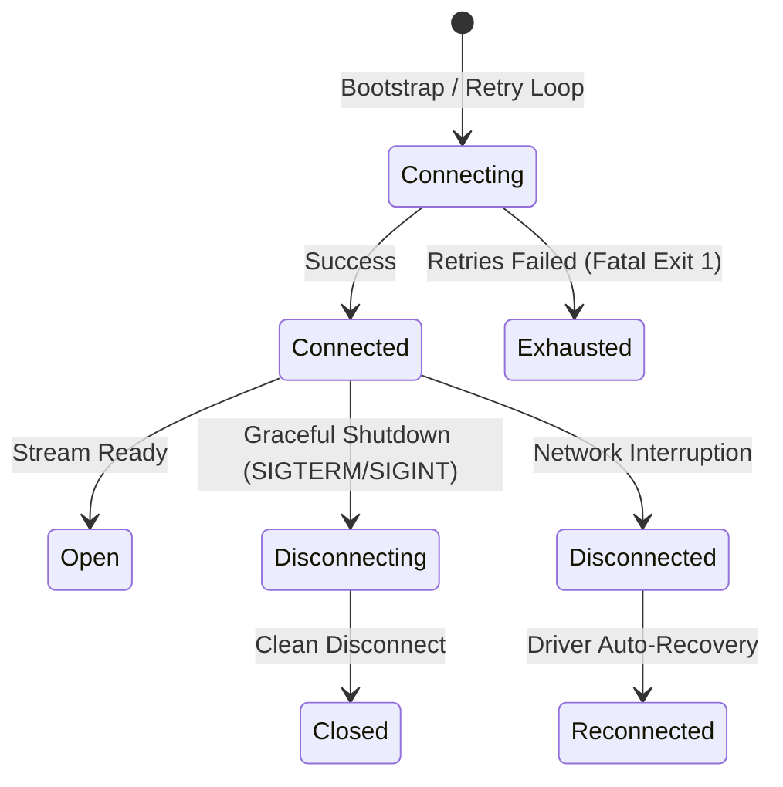

# 🗄️ Astralis ERP — MongoDB Database Architecture & Modeling Conventions

**Authoritative Reference for Database Infrastructure, Data Modeling, Indexing, and Traceability**

---

## 1. Executive Summary & Core Tenets

Astralis ERP uses **MongoDB** and **Mongoose 8** to support high-integrity heat-treatment manufacturing workflows. The data layer is engineered around five fundamental pillars:

1. **Strict Multi-Tenant Isolation:** Every collection is partitioned by `tenantId`. All queries, mutations, unique constraints, and compound indexes MUST include `tenantId`.
2. **Transparent Soft Deletion:** Deletions are logical (`isDeleted: true`, `deletedAt: Date`). The global plugin automatically prevents soft-deleted records from surfacing in active queries.
3. **Full Metallurgical Traceability:** Forward and backward genealogy tracking connects Raw Material Heat-Lots $\to$ Inward Inspection $\to$ Job Cards $\to$ Furnace Batch Runs $\to$ Metallurgical QC $\to$ Certificates of Conformance (CoC).
4. **ACID Transaction Boundaries:** Multi-document operations (e.g. batch job dispatch with stock deduction and CoC generation) are executed inside atomic MongoDB sessions via `withTransaction`.
5. **Architectural Separation:** Direct database access is restricted strictly to the **Repository Layer**. Controllers, Routes, and Services are mechanically prohibited from importing Mongoose or executing raw queries.

---

## 2. Connection Lifecycle & Resilience

The connection lifecycle is managed by `DatabaseConnectionManager` ([connection.ts](file:///c:/Users/Admin/Desktop/CelestiumERP/backend/src/core/database/connection.ts)):



### Connection Configuration Standard:
- **Pool Sizing:** Min 5, Max 20 connections per instance (tuned for Node.js event loop).
- **Timeout Protection:** `serverSelectionTimeoutMS: 5000ms`.
- **Auto-Indexing:** Enabled in development (`autoIndex: true`), disabled in production (`autoIndex: false`) to prevent collection blocking on startup.
- **Health Diagnostics:** Endpoint `/api/v1/health` executes round-trip ping commands and reports active latency.

---

## 3. Schema & Model Conventions

All domain models must be instantiated via `createBaseSchema<T>` ([base.schema.ts](file:///c:/Users/Admin/Desktop/CelestiumERP/backend/src/core/models/base.schema.ts)).

### Automatic Schema Injections:
- `tenantId` (String, required, indexed)
- `createdAt` & `updatedAt` (UTC Date, managed automatically)
- `isDeleted` & `deletedAt` (Managed by `softDeletePlugin`)
- Clean JSON / Object transforms: `_id` and `__v` are converted into a clean string `id`.

```typescript
import { model, Document } from 'mongoose';
import { createBaseSchema } from '@/core/models/base.schema.js';
import { IndexRegistry } from '@/core/database/index-registry.js';

export interface ISampleEntity extends Document {
  tenantId: string;
  code: string;
  name: string;
  status: 'draft' | 'active' | 'archived';
  isDeleted: boolean;
  createdAt: Date;
  updatedAt: Date;
}

const sampleSchema = createBaseSchema<ISampleEntity>({
  code: { type: String, required: true, trim: true, uppercase: true },
  name: { type: String, required: true, trim: true },
  status: { type: String, enum: ['draft', 'active', 'archived'], default: 'draft' }
});

// Enforce tenant unique business code
IndexRegistry.addTenantUniqueIndex(sampleSchema, 'code');

// Enforce status query optimization
IndexRegistry.addStatusFilterIndex(sampleSchema, 'status');

export const SampleModel = model<ISampleEntity>('Sample', sampleSchema);
```

---

## 4. Identifier & Timestamp Standards

### A. Dual Identifier Pattern
1. **System Identifier (`id`):** MongoDB ObjectID string, used for primary key lookups, URL routing, and foreign key relations.
2. **Business Code (`code`):** Human-readable, monotonically increasing, sequential business identifier generated by `CounterModel`:
   - Job Card: `JOB-YYYYMM-XXXX` (e.g. `JOB-202608-0042`)
   - Heat Lot: `HEAT-YYYY-XXXX` (e.g. `HEAT-2026-0105`)
   - Furnace ID: `FURN-XX` (e.g. `FURN-01`)
   - Quality CoC: `COC-YYYYMM-XXXX` (e.g. `COC-202608-0012`)

### B. Timestamp Invariant
- All timestamps MUST be stored as standard BSON `Date` objects in UTC.
- Serialization transforms timestamps to strict ISO-8601 strings (`YYYY-MM-DDTHH:mm:ss.sssZ`).

---

## 5. Embedding vs. Referencing Decision Matrix

| Relationship Pattern | Strategy | Example in Astralis ERP | Rationale |
|---|---|---|---|
| **Immutable Historical Snapshot** | **Embed** | Recipe parameters embedded in a Job Card at run time | Changing the master recipe later must NEVER alter historical parameters of past runs. |
| **High-Cardinality Telemetry** | **Embed (Bucketed) / Dedicated Collection** | Thermocouple 10-second temperature logs during a 6-hour cycle | Avoid unbounded document growth (>16MB limit). |
| **1 : Few (< 50 items)** | **Embed** | Job operational stages (12 fixed stages), QC test indentations | Accessed and updated together atomically with the parent aggregate. |
| **1 : Many / Unbounded** | **Reference** | Customer $\to$ Work Orders, Furnace $\to$ Maintenance Work Orders | Independent lifecycles, avoids document bloating. |
| **Cross-Domain Master Entities** | **Reference** | Operator ID, Customer ID, Alloy Grade ID, Equipment ID | Normalized entity managed by owner domain service. |

---

## 6. Indexing Conventions & Standards

All indexes in Astralis ERP must adhere to the **ESR (Equality, Sort, Range)** rule and prefix `tenantId`:

```
1. Equality Fields   --> { tenantId: 1, status: 1 }
2. Sort Fields       --> { createdAt: -1 }
3. Range Fields      --> { scheduledStartTime: 1 }
```

### Mandatory Index Types:
1. **Tenant Unique Index:** `{ tenantId: 1, [uniqueBusinessField]: 1 }` with `{ unique: true }`.
2. **Workflow Acceleration Index:** `{ tenantId: 1, isDeleted: 1, status: 1, createdAt: -1 }`.
3. **Metallurgical Genealogy Index:** `{ tenantId: 1, heatNumber: 1, lotNumber: 1, jobCardNumber: 1 }`.
4. **Furnace Schedule Index:** `{ tenantId: 1, furnaceId: 1, scheduledStartTime: 1, scheduledEndTime: 1 }`.
5. **TTL Indexes:** Ephemeral audit logs / idempotency tokens `{ createdAt: 1 }` with `{ expireAfterSeconds: 86400 }`.

---

## 7. Transaction & Session Usage Guidelines

Single-document mutations in MongoDB are atomic. Use `withTransaction` only when coordinating multi-document mutations across collections:

```typescript
import { withTransaction } from '@/core/database/transaction.js';

await withTransaction(async (session) => {
  // 1. Transition Job to DISPATCHED
  await jobRepository.updateStatus(tenantId, jobId, 'DISPATCHED', { session });

  // 2. Decrement Finished Goods Inventory
  await inventoryRepository.deductStock(tenantId, itemId, quantity, { session });

  // 3. Issue Final Certificate of Conformance (CoC)
  await cocRepository.create(tenantId, cocData, { session });
});
```

---

## 8. Anti-Patterns & Prohibited Practices

❌ **1. Unscoped Database Queries:** Querying without `tenantId` is strictly prohibited. `BaseRepository<T>` automatically enforces this.  
❌ **2. Cross-Domain Direct Repository Access:** Domain A must never import Domain B's Repository or Model. All cross-domain reads/writes go through Domain B's **Service Layer** or **Domain Event Bus**.  
❌ **3. Mutating Historical Snapshots:** Recipe snapshots, pyrometry calibration offsets, and CoC test measurements must never be mutated after batch completion.  
❌ **4. Unbounded Document Arrays:** Never append telemetry readings into an unbounded array in a single document without bucketing or time-series structuring.  
❌ **5. Raw Mongoose Queries in Controllers/Routes:** Only Repositories may interface with Mongoose models.
