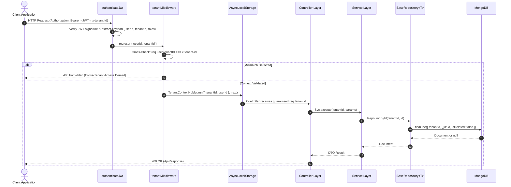

# 🛡️ Astralis ERP — Tenant Isolation & Security Architecture

**Authoritative Specification for Multi-Tenancy, Data Boundary Enforcement, and Cross-Tenant Security**

---

## 1. Overview & Threat Model

Astralis ERP is a multi-tenant Software-as-a-Service (SaaS) platform built for heat-treatment manufacturing facilities. Multiple independent factory organizations (tenants) share common application compute and MongoDB cluster resources while maintaining complete, cryptographically and logically isolated data boundaries.

### Threat Model & Defense In Depth:
1. **Header Spoofing Attack:** A malicious client authenticated as Tenant A submits `x-tenant-id: tenant_b` in an HTTP header to access Tenant B's sensitive metallurgical recipes or job pricing.
   - **Mitigation:** The `tenantMiddleware` checks `req.user.tenantId`. If `req.user.tenantId !== headerTenantId`, the request is blocked with `403 Forbidden` (`CROSS_TENANT_ACCESS_DENIED`).
2. **Data-Access Leakage / Unfiltered Queries:** An engineer forgets to add `{ tenantId }` in a newly written MongoDB query.
   - **Mitigation:** The `BaseRepository<T>` layer automatically prepends `{ tenantId: string }` on all reads, updates, counts, and deletions. Attempting to execute with a missing or empty `tenantId` throws a fatal security exception.
3. **Frontend Tampering:** An attacker manipulates React client state or LocalStorage to request another tenant's URL.
   - **Mitigation:** Zero trust in client state. Tenant boundaries are strictly validated on every HTTP API request at the server middleware and data layer.

---

## 2. Platform-Wide vs. Tenant-Owned Entities

| Category | Description | Entities in Astralis ERP | Storage & Indexing Strategy |
|---|---|---|---|
| **Platform-Wide** | Global infrastructure records managed by platform super-administrators. Not partitioned by tenant. | `Tenant` (organization catalog), System Permissions Catalog, Global Audit Logs | Stored without foreign `tenantId`. Unique index on `code` / `id`. |
| **Tenant-Owned** | All business, quality, manufacturing, financial, and operational records. Owned strictly by a single factory tenant. | `User`, `Customer`, `Part`, `Job`, `HeatLot`, `Furnace`, `Maintenance`, `QualityCoC`, `Inventory`, `Attendance`, `Invoice` | **Mandatory** `tenantId` field via `createBaseSchema<T>`. All compound indexes prefixed with `{ tenantId: 1 }`. |

---

## 3. Tenant Context Pipeline



---

## 4. Tenant Lifecycle & Operational Status

The `Tenant` entity lifecycle manages access states:

```
[PROVISIONING] ──(Setup Complete)──> [ACTIVE] ──(Billing / Safety Issue)──> [SUSPENDED]
                                        │                                       │
                                        │                                       │
                                 (Contract End)                          (Reactivated)
                                        │                                       │
                                        ▼                                       ▼
                                   [ARCHIVED]                                [ACTIVE]
```

- **`provisioning`:** Factory account created, master alloy tables and initial furnace profiles being loaded.
- **`active`:** Normal factory operation. All API endpoints active.
- **`suspended`:** Factory access temporarily blocked (e.g. non-payment, compliance hold). All API requests rejected with `403 Forbidden`.
- **`archived`:** Account terminated. Read-only historical audit access only.

---

## 5. Developer Rules for Future Domain Agents

Every agent writing code for Astralis ERP MUST adhere to these four immutable rules:

1. **Rule 1: Always extend `BaseRepository<T>` for tenant-owned entities.**  
   Never instantiate raw `model.find()` or `model.findOne()` in services or controllers.
2. **Rule 2: Pass `tenantId` explicitly as the first argument in all repository calls.**  
   Example: `await this.jobRepo.findById(tenantId, jobId)`.
3. **Rule 3: Compound index all query filters with `{ tenantId: 1 }` prefix.**  
   Use `IndexRegistry.addTenantUniqueIndex(schema, 'code')` and `IndexRegistry.addStatusFilterIndex(schema, 'status')`.
4. **Rule 4: Never trust client-supplied tenant IDs in request bodies.**  
   Always override or assert against `req.tenantId` obtained from the authenticated controller layer (`this.getTenantId(req)`).
